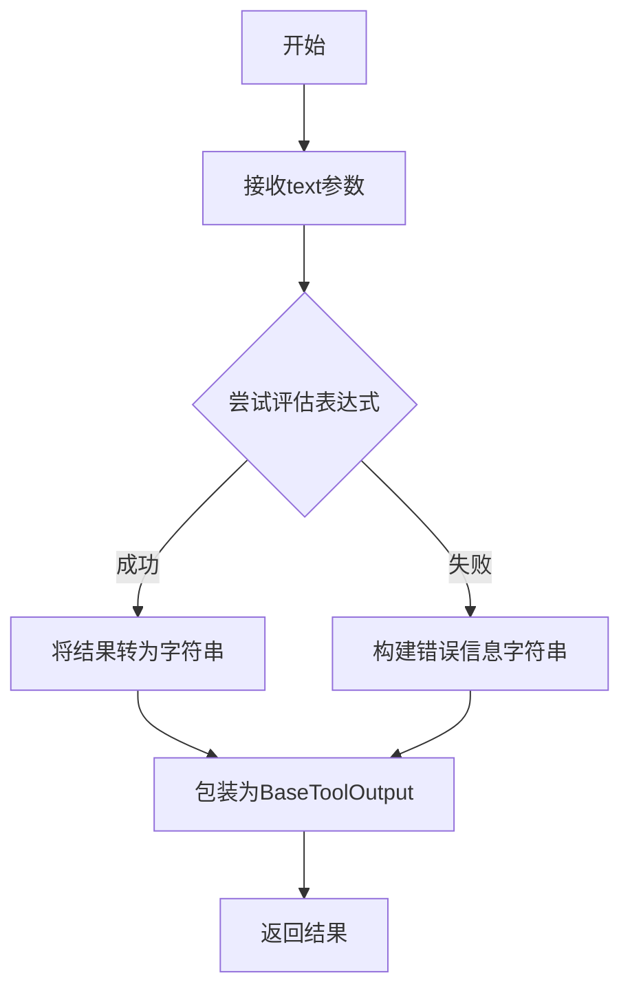
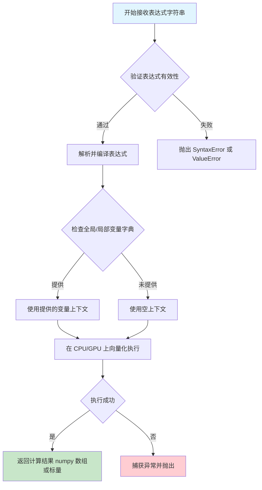
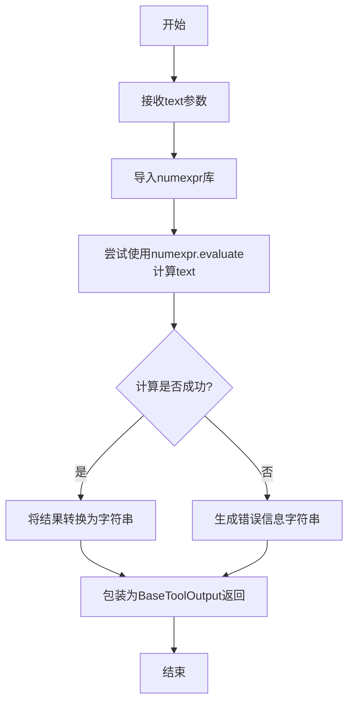
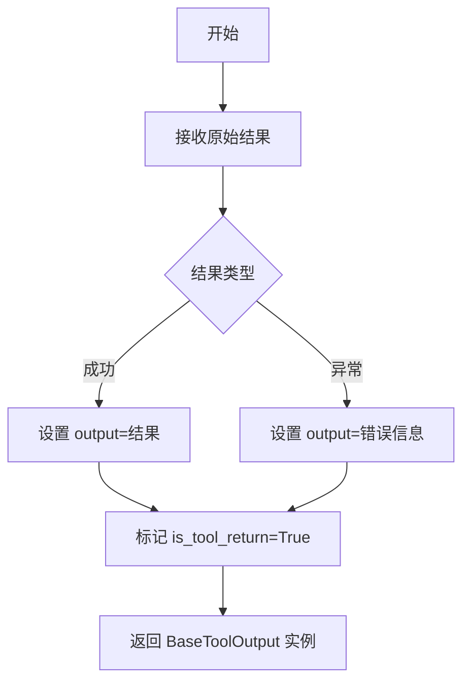

# `Langchain-Chatchat\libs\chatchat-server\chatchat\server\agent\tools_factory\calculate.py` 详细设计文档

这是一个数学计算器工具函数，使用numexpr库评估用户输入的数学表达式，并将结果或错误信息封装在BaseToolOutput对象中返回，支持简单的数学计算问答。

## 整体流程



## 类结构

```
Global Functions
└── calculate (工具函数)
```

## 全局变量及字段


### `text`
    
数学表达式

类型：`str`
    


### `ret`
    
计算结果或错误信息

类型：`str`
    


### `e`
    
捕获计算过程中的错误

类型：`Exception`
    


    

## 全局函数及方法


### `calculate`

这是一个数学计算器工具函数，用于评估简单的数学表达式。它接收用户输入的数学表达式字符串，使用 `numexpr` 库进行计算，并将结果封装在 `BaseToolOutput` 对象中返回。如果计算过程中出现错误，会返回格式化的错误信息。

参数：

-  `text`：`str`，需要计算的数学表达式字符串

返回值：`BaseToolOutput`，计算结果字符串或错误信息字符串

#### 流程图

```mermaid
flowchart TD
    A[开始] --> B[接收数学表达式 text]
    B --> C[导入 numexpr 库]
    C --> D{尝试计算}
    D -->|成功| E[使用 numexpr.evaluate 计算表达式]
    E --> F[将结果转为字符串]
    F --> G[创建 BaseToolOutput 对象]
    G --> H[返回结果]
    
    D -->|失败| I[捕获异常]
    I --> J[格式化错误信息 'wrong: {e}']
    J --> G
```

#### 带注释源码

```python
from chatchat.server.pydantic_v1 import Field  # 导入 Field 用于定义工具参数元数据
from .tools_registry import regist_tool  # 导入工具注册装饰器
from langchain_chatchat.agent_toolkits.all_tools.tool import BaseToolOutput  # 导入工具输出基类

@regist_tool(title="数学计算器")  # 使用装饰器注册为工具，标题为"数学计算器"
def calculate(text: str = Field(description="a math expression")) -> float:
    """
    Useful to answer questions about simple calculations.
    translate user question to a math expression that can be evaluated by numexpr.
    """
    import numexpr  # 导入数值表达式计算库

    try:
        # 尝试评估数学表达式
        ret = str(numexpr.evaluate(text))
    except Exception as e:
        # 如果计算出错，格式化错误信息
        ret = f"wrong: {e}"

    # 返回 BaseToolOutput 对象封装结果
    return BaseToolOutput(ret)
```

---

## 关键组件信息

| 组件名称 | 一句话描述 |
|---------|-----------|
| `calculate` | 数学表达式计算工具函数 |
| `numexpr` | 高效的数值表达式计算库 |
| `BaseToolOutput` | 工具输出的基类，用于封装返回结果 |
| `regist_tool` | 工具注册装饰器，将函数注册为可调用的工具 |

---

## 潜在的技术债务或优化空间

1. **异常处理过于宽泛**：使用 `except Exception as e` 捕获所有异常，可能隐藏特定错误类型，建议根据不同异常类型进行细分处理。

2. **缺少输入验证**：没有对输入的数学表达式进行安全性验证（如防止注入攻击），虽然 `numexpr` 本身相对安全，但可以增加白名单机制限制支持的运算符。

3. **返回值类型声明不准确**：函数签名声明返回 `float`，但实际返回 `BaseToolOutput` 对象，存在类型不一致问题。

4. **缺少超时机制**：对于复杂计算没有设置超时限制，可能导致长时间阻塞。

5. **错误信息暴露内部细节**：`f"wrong: {e}"` 可能暴露系统内部信息，建议对用户友好地进行错误包装。

---

## 其它项目

### 设计目标与约束
- **目标**：提供一个简单易用的数学计算工具，供 AI Agent 调用回答用户的计算问题
- **约束**：依赖 `numexpr` 库，支持基本的数学运算

### 错误处理与异常设计
- 统一的异常捕获机制，将错误信息格式化为字符串返回
- 不抛出异常，错误信息通过返回值传递

### 数据流与状态机
- 输入：数学表达式字符串
- 处理：使用 `numexpr.evaluate()` 计算表达式
- 输出：`BaseToolOutput` 对象封装的计算结果或错误信息

### 外部依赖与接口契约
- 依赖 `numexpr`：数值表达式计算
- 依赖 `BaseToolOutput`：工具输出封装
- 依赖 `Field`：参数元数据定义
- 依赖 `regist_tool`：工具注册装饰器


### `numexpr.evaluate`

`numexpr.evaluate` 是第三方库 numexpr 的核心函数，用于在 Python 中快速、安全地评估数学表达式字符串，支持向量化运算和常见数学运算符。

参数：

-  `expression`：`str`，需要计算的数学表达式字符串，支持运算符如 `+`, `-`, `*`, `/`, `**`, `sin`, `cos`, `exp` 等
-  `global_dict`：`dict`（可选），用于表达式中全局变量的查找字典
-  `local_dict`：`dict`（可选），用于表达式中局部变量的查找字典
-  `column_types`：`dict`（可选），用于指定列的数据类型
-  `zero`：`float`（可选），用于替换结果为零的值
-  `trymost`：`bool`（可选），是否尝试使用所有可用内核（默认 True）

返回值：`numpy.ndarray` 或 Python 数值类型，表达式的计算结果

#### 流程图



#### 带注释源码

```python
# numexpr.evaluate 伪源码实现（基于 numexpr 库的核心逻辑）
# 实际源码位于 numexpr 包的 numexpr.py 模块中

def evaluate(expression,                # str: 数学表达式字符串
             global_dict=None,          # dict: 全局变量上下文
             local_dict=None,           # dict: 局部变量上下文
             column_types=None,         # dict: 列类型定义
             zero=0.0,                  # float: 零值替换
             trymost=True):             # bool: 尝试最大化利用硬件
    
    """
    安全、快速地评估数学表达式
    
    参数:
        expression: 形如 "sin(x) + cos(y)**2" 的表达式
        global_dict: 表达式中引用的全局变量字典，如 {'x': 1.0, 'y': 2.0}
        local_dict: 表达式中引用的局部变量字典
        column_types: DataFrame 列的类型信息
        zero: 当结果为零时替换的值
        trymost: 是否尝试使用多核/加速器
    
    返回:
        计算结果，类型为 numpy.ndarray 或 Python 标量
    """
    
    # 步骤1: 参数预处理和验证
    if global_dict is None:
        global_dict = {}
    if local_dict is None:
        local_dict = {}
    
    # 步骤2: 编译器初始化（lazy 初始化）
    # numexpr 使用内部编译器将表达式字符串编译为字节码
    compiler = get_compiler()
    
    # 步骤3: 表达式解析和验证
    # 检查表达式中是否有不支持的操作符或语法错误
    expr = preprocess_expression(expression)
    
    # 步骤4: 生成评估计划
    # 根据硬件能力选择最优执行路径（单核/多核/SIMD）
    if trymost:
        plan = compiler.plan(expr, global_dict, local_dict, 
                            column_types=column_types, 
                            optimization='max')
    else:
        plan = compiler.plan(expr, global_dict, local_dict,
                            optimization='speed')
    
    # 步骤5: 执行表达式
    try:
        # 实际执行编译后的表达式
        # 这会调用 numexpr 的虚拟机的执行器
        result = executor.execute(plan)
        
        # 步骤6: 后处理（零值替换）
        if zero != 0.0:
            result = np.where(result == 0, zero, result)
            
    except Exception as e:
        # 捕获各类运行时错误：除零、溢出、无效操作等
        raise ValueError(f"Failed to evaluate expression '{expression}': {e}")
    
    # 步骤7: 返回结果
    # 如果是标量则返回标量，否则返回 numpy 数组
    if result.shape == ():
        return result.item()
    return result
```


### `calculate`

一个数学计算器工具函数，接收数学表达式字符串，使用 numexpr 库进行求值，并返回计算结果。

参数：

- `text`：`str`，需要计算的数学表达式

返回值：`BaseToolOutput`，计算结果（成功时为计算结果的字符串形式，失败时为错误信息）

#### 流程图



#### 带注释源码

```python
from chatchat.server.pydantic_v1 import Field  # 导入Field用于Pydantic模型定义

from .tools_registry import regist_tool  # 导入工具注册装饰器


from langchain_chatchat.agent_toolkits.all_tools.tool import (
    BaseToolOutput,  # 导入工具输出基类
)

@regist_tool(title="数学计算器")  # 使用装饰器注册工具，标题为"数学计算器"
def calculate(text: str = Field(description="a math expression")) -> float:
    """
    Useful to answer questions about simple calculations.
    translate user question to a math expression that can be evaluated by numexpr.
    """
    import numexpr  # 导入numexpr库用于数学表达式求值

    try:
        # 尝试使用numexpr评估数学表达式
        ret = str(numexpr.evaluate(text))
    except Exception as e:
        # 如果计算出错，返回错误信息
        ret = f"wrong: {e}"

    # 返回BaseToolOutput对象封装结果
    return BaseToolOutput(ret)
```


### `BaseToolOutput`

`BaseToolOutput` 是一个封装工具执行结果的基础类，用于在 LangChain ChatChat 框架中标准化工具的输出格式。它提供了统一的接口，使工具结果能够被代理（Agent）正确解析和处理。该类通常包含原始输出内容、是否成功执行的状态信息，以及可选的错误消息等字段。

参数：

- 无（构造函数参数需查看源代码）

返回值：`BaseToolOutput`，封装工具执行结果的对象

#### 流程图



#### 带注释源码

```python
# 从 langchain_chatchat 导入 BaseToolOutput 基类
# 这是一个用于封装工具执行结果的标准化类
from langchain_chatchat.agent_toolkits.all_tools.tool import (
    BaseToolOutput,
)

@regist_tool(title="数学计算器")
def calculate(text: str = Field(description="a math expression")) -> float:
    """
    Useful to answer questions about simple calculations.
    translate user question to a math expression that can be evaluated by numexpr.
    """
    import numexpr

    try:
        # 使用 numexpr 库评估数学表达式
        ret = str(numexpr.evaluate(text))
    except Exception as e:
        # 捕获异常并返回错误信息
        ret = f"wrong: {e}"

    # 返回 BaseToolOutput 封装的结果
    # BaseToolOutput 会将字符串结果封装为标准工具输出格式
    return BaseToolOutput(ret)
```

---

### 补充信息

#### 设计目标与约束

- **设计目标**：提供统一的工具输出封装格式，使 Agent 能够一致地处理不同工具的返回值
- **约束**：返回结果必须能够被序列化为字符串，以便跨进程传输

#### 错误处理与异常设计

- 计算表达式错误时，`numexpr.evaluate()` 会抛出异常
- 异常被捕获后，错误信息通过 `f"wrong: {e}"` 格式化为字符串
- 错误结果同样通过 `BaseToolOutput` 封装，保持返回类型一致性

#### 外部依赖与接口契约

- **依赖**：`numexpr` 库用于安全地评估数学表达式
- **接口**：函数签名 `calculate(text: str) -> BaseToolOutput`
- **输入约束**：`text` 必须是 `numexpr` 支持的数学表达式

#### 潜在的技术债务与优化空间

1. **类型注解不准确**：函数签名声明返回 `float`，但实际返回 `BaseToolOutput` 对象（内部包含字符串）
2. **错误处理过于简单**：直接返回错误字符串，可能更适合抛出自定义异常或返回错误码
3. **无输入验证**：未对 `text` 进行安全性检查（如恶意表达式）
4. **性能考虑**：每次调用都导入 `numexpr`，建议在模块顶部导入

## 关键组件


### 工具注册装饰器

使用 `@regist_tool` 装饰器将 `calculate` 函数注册为聊天工具，使其可以被 LangChain Agent 调用，title 参数定义了工具在界面上的显示名称。

### Pydantic Field 参数定义

使用 `chatchat.server.pydantic_v1.Field` 定义工具函数的参数，description 描述了参数的用途，用于生成工具调用时的参数提示信息。

### BaseToolOutput 包装

使用 `BaseToolOutput` 类包装计算结果返回，确保输出符合工具输出标准格式，提供统一的接口契约。

### numexpr 数学表达式求值

核心计算逻辑使用 `numexpr.evaluate()` 进行数学表达式求值，支持复杂数学运算并自动优化计算性能。

### 异常捕获与错误处理

使用 try-except 捕获计算过程中的所有异常，将错误信息格式化为 "wrong: {错误详情}" 字符串返回，实现优雅的错误处理机制。


## 问题及建议


### 已知问题

-   **类型声明与实际返回值不一致**：函数签名声明返回类型为 `float`，但实际返回的是 `BaseToolOutput` 对象，且内部包装的是字符串类型的计算结果
-   **异常处理过于宽泛**：使用 `except Exception as e` 捕获所有异常，不利于精确识别和处理特定错误类型
-   **导入位置不当**：`import numexpr` 放在函数内部而非文件顶部，不利于代码组织和性能（每次调用都会检查导入）
-   **缺少输入验证**：未对 `text` 参数进行空值检查、长度限制或格式验证，可能导致潜在问题
-   **错误信息返回方式不优雅**：将错误信息以 `"wrong: {e}"` 形式放入正常返回值中，破坏了返回类型的语义一致性

### 优化建议

-   **修正返回类型声明**：将函数返回类型从 `float` 改为 `BaseToolOutput`，或在函数文档中明确说明返回的是字符串形式的计算结果
-   **分层处理异常**：针对 `SyntaxError`、`TypeError`、`ZeroDivisionError` 等特定异常分别处理，或使用 `numexpr` 特定的异常类型
-   **优化导入结构**：将 `import numexpr` 移至文件顶部统一导入
-   **添加输入验证**：在函数开头增加参数校验，如检查 `text` 是否为空、长度是否合理等
-   **改进错误处理策略**：考虑直接抛出自定义异常或返回包含错误标识的结构，而不是混在正常结果中返回
-   **考虑安全性**：虽然 `numexpr` 相对安全，但可增加输入白名单机制，限制允许的运算符和函数

## 其它


### 设计目标与约束

该工具旨在为聊天机器人提供数学计算能力，将用户的数学问题转换为可由 numexpr 库评估的表达式并返回计算结果。设计约束包括：仅支持基本的数学表达式计算，不支持复杂函数或编程逻辑；输入必须是有效的 numexpr 可处理的数学表达式；输出结果以字符串形式返回。

### 错误处理与异常设计

工具内部包含 try-except 块捕获所有异常情况。当 numexpr.evaluate() 执行失败时（如表达式语法错误、包含不支持的运算符、除零错误等），异常被捕获并格式化为错误消息字符串，返回给调用方。错误格式为 "wrong: {具体异常信息}"。当前实现中所有异常统一处理，未区分异常类型。

### 数据流与状态机

输入数据流：用户输入的字符串文本 → calculate 函数 text 参数 → numexpr.evaluate() 进行表达式求值 → 结果转换为字符串 → 包装为 BaseToolOutput 对象返回。状态机较为简单，主要包含"就绪→计算中→返回结果"或"就绪→计算中→返回错误"两种状态转换。

### 外部依赖与接口契约

主要外部依赖包括：numexpr 库用于数学表达式求值；chatchat.server.pydantic_v1 的 Field 用于参数定义；langchain_chatchat.agent_toolkits.all_tools.tool 的 BaseToolOutput 作为返回类型。接口契约要求：输入参数 text 为字符串类型且必须提供；返回值为 BaseToolOutput 对象，其内容为计算结果的字符串形式或错误信息。

### 安全性考虑

当前实现存在潜在安全风险：numexpr 库虽然设计为安全执行数学表达式，但未对输入进行预验证；错误信息可能泄露内部异常详情；未限制表达式复杂度可能导致性能问题。建议增加输入验证机制，限制表达式长度和复杂度，并考虑对异常信息进行脱敏处理。

### 性能要求

计算性能依赖于 numexpr 库的实现，对于简单数学表达式应能快速返回。输入表达式长度应有所限制以防止过长的表达式导致性能问题或内存溢出。当前实现未包含超时机制或表达式复杂度限制。

### 兼容性考虑

该工具作为 ChatChat 框架的插件工具运行，需要与 langchain_chatchat 生态兼容。numexpr 库的版本兼容性需要确认。Field 的导入来自 chatchat.server.pydantic_v1，表明使用了特定版本的 pydantic（v1 风格），需要注意 pydantic v2 的兼容性差异。

### 使用示例

正向案例：输入 "2+3*4" 返回 "14"；输入 "sin(0)" 返回 "0.0"。错误案例：输入 "1/0" 返回 "wrong: divide by zero"；输入 "abc" 返回 "wrong: ..."

### 配置要求

该工具通过装饰器 @regist_tool 注册，title 参数设置为"数学计算器"。除函数参数 text 的描述外，无其他可配置项。numexpr 库本身无特殊配置需求。

### 限制条件

不支持的表达式类型包括：变量赋值、函数定义、多行表达式、Python 代码片段、特殊数学函数（需确认 numexpr 支持的函数列表）。输入表达式长度未做限制，可能导致性能和内存问题。不支持复数运算。不支持单位换算。

    