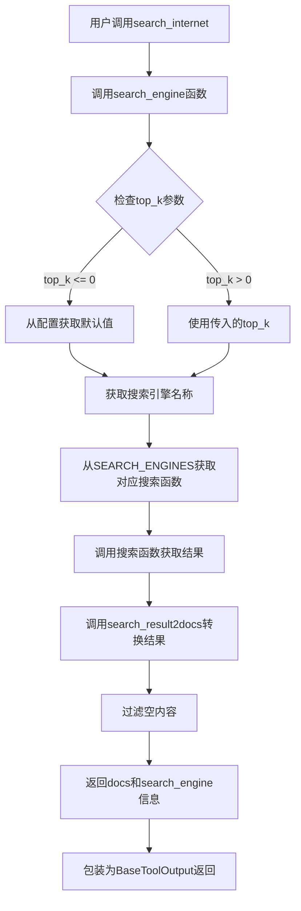
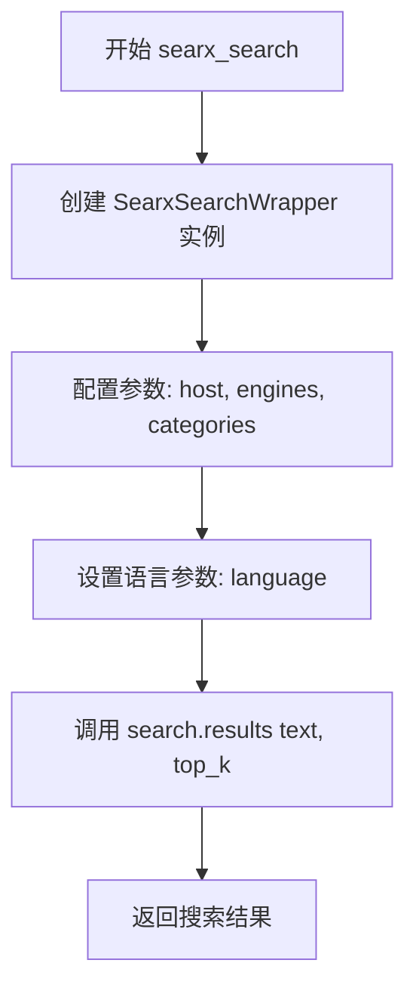
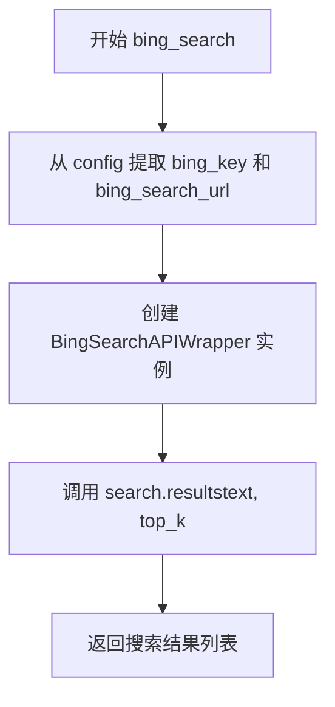
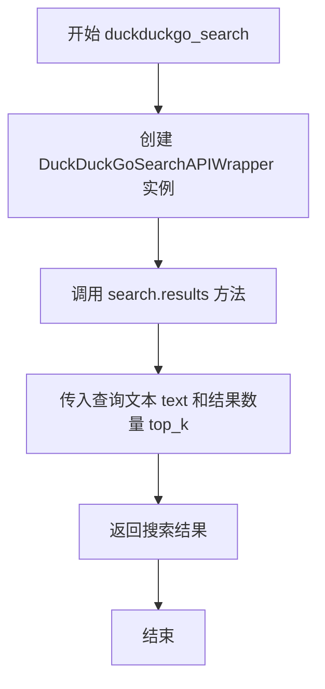
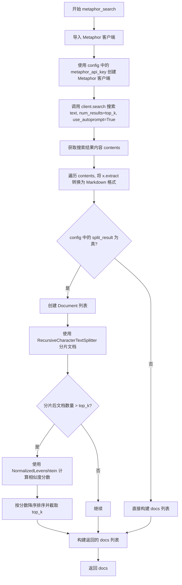
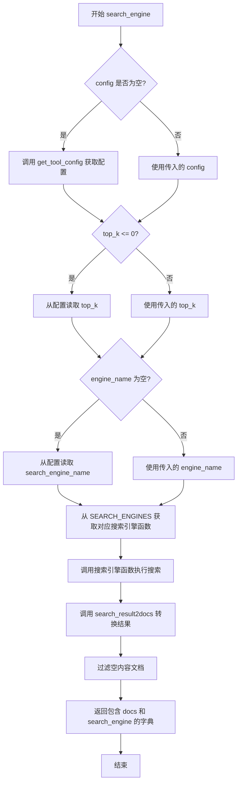
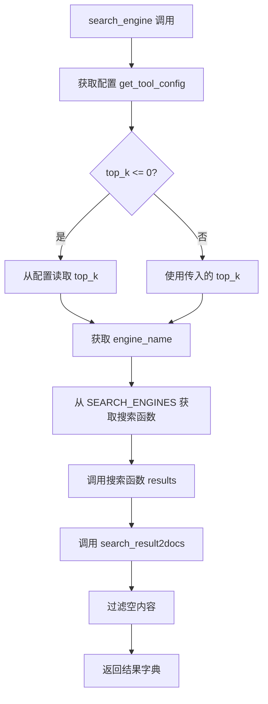

# `Langchain-Chatchat\libs\chatchat-server\chatchat\server\agent\tools_factory\search_internet.py` 详细设计文档

该模块提供互联网搜索功能，支持多种搜索引擎（bing、duckduckgo、metaphor、searx），将搜索结果转换为LangChain Document格式，供AI代理使用。

## 整体流程



## 类结构

```
无类定义，全部为全局函数
SEARCH_ENGINES (全局字典)
├── searx_search
├── bing_search
├── duckduckgo_search
└── metaphor_search

辅助函数:
├── search_result2docs
└── search_engine

入口函数:
└── search_internet (装饰器注册)
```

## 全局变量及字段


### `SEARCH_ENGINES`
    
搜索引擎名称到对应搜索函数实现的映射字典，支持bing、duckduckgo、metaphor和searx四种搜索引擎

类型：`Dict[str, Callable]`
    


    

## 全局函数及方法


### `searx_search`

该函数是一个搜索引擎封装函数，通过配置信息初始化 SearxSearchWrapper 实例，并调用其 `results` 方法执行搜索操作，返回指定数量的搜索结果。

参数：

- `text`：`str`，搜索查询文本
- `config`：`dict`，包含 Searx 搜索引擎配置的字典，需包含 `host`、`engines`、`categories` 键，可选包含 `language` 键（默认为 "zh-CN"）
- `top_k`：`int`，返回结果的数量上限

返回值：`Any`（取决于 `SearxSearchWrapper.results()` 的返回类型，通常为搜索结果列表），返回符合查询条件的搜索结果

#### 流程图



#### 带注释源码

```python
def searx_search(text, config, top_k: int):
    """
    使用 Searx 搜索引擎执行搜索查询
    
    参数:
        text: 搜索查询文本
        config: 搜索引擎配置字典，包含 host、engines、categories 等配置
        top_k: 返回结果的最大数量
    
    返回:
        搜索结果列表
    """
    # 初始化 SearxSearchWrapper，传入 Searx 服务器地址、搜索引擎和分类配置
    search = SearxSearchWrapper(
        searx_host=config["host"],       # Searx 服务器主机地址
        engines=config["engines"],       # 启用的搜索引擎列表
        categories=config["categories"], # 搜索分类（如 "general", "science" 等）
    )
    
    # 设置搜索语言，默认为中文简体
    search.params["language"] = config.get("language", "zh-CN")
    
    # 执行搜索并返回前 top_k 条结果
    return search.results(text, top_k)
```


### `bing_search`

该函数是一个搜索引擎封装函数，通过调用 Bing Search API 封装类 `BingSearchAPIWrapper` 执行实际的互联网搜索操作，并返回指定数量的搜索结果。

参数：

- `text`：`str`，搜索查询文本
- `config`：`dict`，包含 Bing API 配置信息的字典，必须包含 `bing_key`（订阅密钥）和 `bing_search_url`（搜索端点 URL）
- `top_k`：`int`，期望返回的搜索结果数量

返回值：`List[Dict]`，搜索结果列表，每个元素为包含 `snippet`（摘要）、`title`（标题）、`link`（链接）的字典

#### 流程图



#### 带注释源码

```python
def bing_search(text, config, top_k: int):
    """
    使用 Bing 搜索引擎进行搜索
    
    参数:
        text: str - 搜索查询文本
        config: dict - Bing API 配置，包含 bing_key 和 bing_search_url
        top_k: int - 返回结果数量限制
    
    返回:
        List[Dict] - 搜索结果列表，每个结果包含 snippet、title、link
    """
    # 从配置中提取 Bing API 认证信息和搜索端点
    search = BingSearchAPIWrapper(
        bing_subscription_key=config["bing_key"],  # Bing API 订阅密钥
        bing_search_url=config["bing_search_url"],  # Bing 搜索服务 URL
    )
    # 调用 BingSearchAPIWrapper 的 results 方法执行搜索并返回结果
    return search.results(text, top_k)
```


### `duckduckgo_search`

该函数是一个搜索引擎封装函数，用于通过 DuckDuckGo 搜索 API 执行网络搜索，并将搜索结果返回给调用方。

参数：

- `text`：`str`，需要搜索的查询文本
- `config`：`dict`，搜索引擎配置字典（虽然函数内部未使用，但保留与其它搜索函数接口一致）
- `top_k`：`int`，返回的搜索结果数量上限

返回值：`Any`，返回 DuckDuckGoSearchAPIWrapper 的 results 方法的执行结果，通常为包含搜索结果的列表

#### 流程图



#### 带注释源码

```python
def duckduckgo_search(text, config, top_k:int):
    """
    使用 DuckDuckGo 搜索 API 执行搜索并返回结果
    
    参数:
        text: str, 要搜索的查询文本
        config: dict, 搜索配置字典（当前函数未使用此参数，但保留以保持接口一致性）
        top_k: int, 需要返回的最大结果数量
    
    返回:
        Any, DuckDuckGo 搜索结果列表
    """
    # 创建 DuckDuckGo 搜索包装器实例
    search = DuckDuckGoSearchAPIWrapper()
    
    # 调用搜索结果方法，传入查询文本和结果数量，返回搜索结果
    return search.results(text, top_k)
```


### `metaphor_search`

该函数通过调用 Metaphor 搜索引擎 API 执行搜索，根据配置决定是否对结果进行分片处理，并使用 Normalized Levenshtein 算法对分片后的文档进行相似度排序，最终返回包含摘要、链接和标题的搜索结果列表。

参数：

- `text`：`str`，需要搜索的查询文本
- `config`：`dict`，包含 Metaphor API 密钥、分片配置（split_result、chunk_size、chunk_overlap）等参数的配置字典
- `top_k`：`int`，期望返回的搜索结果数量

返回值：`List[Dict]`，返回搜索结果列表，每个元素包含 `snippet`（文本摘要）、`link`（链接）和 `title`（标题）字段

#### 流程图



#### 带注释源码

```python
def metaphor_search(
    text: str,
    config: dict,
    top_k: int
) -> List[Dict]:
    """使用 Metaphor 搜索引擎进行搜索，并根据配置决定是否分片处理结果
    
    参数:
        text: 搜索查询文本
        config: 包含 API 密钥和分片配置的字典
        top_k: 返回结果数量上限
    
    返回:
        包含 snippet/link/title 的字典列表
    """
    # 动态导入 Metaphor 客户端库
    from metaphor_python import Metaphor

    # 使用配置中的 API 密钥创建 Metaphor 客户端
    client = Metaphor(config["metaphor_api_key"])
    
    # 执行搜索，设置结果数量并启用自动提示优化
    search = client.search(text, num_results=top_k, use_autoprompt=True)
    
    # 获取搜索结果的内容列表
    contents = search.get_contents().contents
    
    # 遍历内容，将提取的文本转换为 Markdown 格式
    for x in contents:
        x.extract = markdownify(x.extract)
    
    # 判断是否需要分片处理结果
    if config["split_result"]:
        # 创建 Document 对象列表
        docs = [
            Document(page_content=x.extract, metadata={"link": x.url, "title": x.title})
            for x in contents
        ]
        
        # 使用递归字符文本分割器对文档进行分片
        text_splitter = RecursiveCharacterTextSplitter(
            ["\n\n", "\n", ".", " "],  # 分隔符优先级
            chunk_size=config["chunk_size"],       # 每个分片的最大字符数
            chunk_overlap=config["chunk_overlap"], # 分片之间的重叠字符数
        )
        
        # 执行文档分片
        splitted_docs = text_splitter.split_documents(docs)
        
        # 如果分片数量超过 top_k，使用相似度算法筛选
        if len(splitted_docs) > top_k:
            # 初始化 Normalized Levenshtein 相似度计算器
            normal = NormalizedLevenshtein()
            
            # 为每个分片计算与原始查询的相似度分数
            for x in splitted_docs:
                x.metadata["score"] = normal.similarity(text, x.page_content)
            
            # 按相似度降序排序并截取 top_k 个结果
            splitted_docs.sort(key=lambda x: x.metadata["score"], reverse=True)
            splitted_docs = splitted_docs[: top_k]

        # 构建返回格式的文档列表
        docs = [
            {
                "snippet": x.page_content,
                "link": x.metadata["link"],
                "title": x.metadata["title"],
            }
            for x in splitted_docs
        ]
    else:
        # 不分片，直接构建返回格式的文档列表
        docs = [
            {"snippet": x.extract, "link": x.url, "title": x.title} for x in contents
        ]

    return docs
```


### `search_result2docs`

该函数用于将搜索结果列表转换为 LangChain 的 Document 对象列表，遍历每个搜索结果，提取 snippet（内容片段）、link（链接）和 title（标题）信息，并封装为标准的 Document 格式返回。

参数：

- `search_results`：`List[Dict]`，搜索结果列表，每个元素为包含搜索结果的字典，应包含 "snippet"、"link"、"title" 等键

返回值：`List[Document]`，返回 Langchain 的 Document 对象列表，每个 Document 包含页面内容和元数据

#### 流程图

```mermaid
flowchart TD
    A[开始 search_result2docs] --> B[初始化空文档列表 docs]
    B --> C{遍历 search_results}
    C -->|当前结果| D{检查 snippet 键是否存在}
    D -->|是| E[snippet = result['snippet']]
    D -->|否| F[snippet = '']
    E --> G{检查 link 键是否存在}
    F --> G
    G -->|是| H[source = result['link']]
    G -->|否| I[source = '']
    H --> J{检查 title 键是否存在}
    I --> J
    J -->|是| K[filename = result['title']]
    J -->|否| L[filename = '']
    K --> M[创建 Document 对象]
    L --> M
    M --> N[将 Document 添加到 docs 列表]
    N --> C
    C -->|遍历完成| O[返回 docs 列表]
    O --> P[结束]
```

#### 带注释源码

```python
def search_result2docs(search_results) -> List[Document]:
    """
    将搜索结果列表转换为 LangChain Document 对象列表
    
    参数:
        search_results: 搜索结果列表，每个元素为字典，包含 'snippet'、'link'、'title' 等键
    
    返回:
        Document 对象列表，每个 Document 包含页面内容和元数据
    """
    # 初始化空文档列表用于存储转换后的 Document 对象
    docs = []
    
    # 遍历每一个搜索结果
    for result in search_results:
        # 安全提取 snippet（内容片段），若不存在则为空字符串
        page_content = result["snippet"] if "snippet" in result.keys() else ""
        
        # 构建元数据字典，包含 source（链接）和 filename（标题）
        metadata = {
            # 安全提取 link（来源链接），若不存在则为空字符串
            "source": result["link"] if "link" in result.keys() else "",
            # 安全提取 title（文件名/标题），若不存在则为空字符串
            "filename": result["title"] if "title" in result.keys() else "",
        }
        
        # 创建 Document 对象并添加到文档列表
        doc = Document(
            page_content=page_content,
            metadata=metadata,
        )
        docs.append(doc)
    
    # 返回转换后的 Document 对象列表
    return docs
```


### `search_engine`

该函数是一个搜索引擎统一封装接口，支持多种搜索引擎（bing、duckduckgo、metaphor、searx）的灵活配置与调用，根据传入的查询词和配置参数执行搜索，并将搜索结果转换为 LangChain 的 Document 格式返回。

**参数：**

- `query`：`str`，搜索查询字符串
- `top_k`：`int`，返回结果数量，默认为 0（若小于等于 0 则从配置中读取默认值）
- `engine_name`：`str`，搜索引擎名称，默认为空字符串（若为空则从配置中读取）
- `config`：`dict`，搜索引擎配置字典，默认为空字典（若为空则调用 `get_tool_config("search_internet")` 自动获取）

**返回值：**`dict`，包含以下键值：
- `docs`：`List[Document]` - 搜索结果文档列表
- `search_engine`：`str` - 实际使用的搜索引擎名称

#### 流程图



#### 带注释源码

```python
def search_engine(query: str, top_k: int = 0, engine_name: str = "", config: dict = {}):
    """
    统一的搜索引擎封装函数，支持多种搜索引擎的灵活配置与调用。
    
    参数:
        query: str - 搜索查询字符串
        top_k: int - 返回结果数量，默认为0，若<=0则从配置读取
        engine_name: str - 搜索引擎名称，默认为空字符串，若为空则从配置读取
        config: dict - 搜索引擎配置字典，默认为空，若为空则自动获取
    
    返回:
        dict - 包含 docs (文档列表) 和 search_engine (搜索引擎名称) 的字典
    """
    # 如果 config 为空，则调用 get_tool_config("search_internet") 自动获取配置
    # 该配置包含各搜索引擎的认证信息、参数设置等
    config = config or get_tool_config("search_internet")
    
    # 如果 top_k <= 0，则从配置中读取 top_k 值
    # 若配置中也没有设置，则使用 Settings.kb_settings.SEARCH_ENGINE_TOP_K 作为默认值
    if top_k <= 0:
        top_k = config.get("top_k", Settings.kb_settings.SEARCH_ENGINE_TOP_K)
    
    # 如果 engine_name 为空，则从配置中读取 search_engine_name
    engine_name = engine_name or config.get("search_engine_name")
    
    # 从 SEARCH_ENGINES 字典中获取对应名称的搜索引擎函数
    # SEARCH_ENGINES 映射表: {"bing": bing_search, "duckduckgo": duckduckgo_search, "metaphor": metaphor_search, "searx": searx_search}
    search_engine_use = SEARCH_ENGINES[engine_name]
    
    # 调用对应的搜索引擎函数执行搜索
    # 传入查询文本、该引擎的专用配置、以及返回结果数量
    results = search_engine_use(
        text=query, 
        config=config["search_engine_config"][engine_name], 
        top_k=top_k
    )
    
    # 将搜索结果（字典列表）转换为 LangChain 的 Document 对象列表
    # 同时过滤掉 page_content 为空或仅包含空白字符的文档
    docs = [x for x in search_result2docs(results) if x.page_content and x.page_content.strip()]
    
    # 返回包含文档列表和实际使用的搜索引擎名称的字典
    return {"docs": docs, "search_engine": engine_name}
```


### `search_internet`

该函数是一个互联网搜索工具的入口函数，接收用户查询字符串，调用内部 `search_engine` 函数执行实际的搜索操作，并将结果封装为 `BaseToolOutput` 对象返回，供 Agent 或其他系统使用。

参数：

-  `query`：`str`，用于互联网搜索的查询字符串

返回值：`BaseToolOutput`，封装了搜索结果文档和所使用的搜索引擎信息

#### 流程图

```mermaid
flowchart TD
    A[调用 search_internet] --> B[传入 query 参数]
    B --> C[调用 search_engine 函数]
    C --> D[获取工具配置 get_tool_config]
    D --> E{判断 top_k 和 engine_name}
    E -->|top_k <= 0| F[从配置获取默认 top_k]
    E -->|top_k > 0| G[使用传入的 top_k]
    F --> H
    G --> H[从配置获取 search_engine_name]
    H --> I[从 SEARCH_ENGINES 字典获取对应搜索函数]
    I --> J[调用搜索函数获取原始结果]
    J --> K[调用 search_result2docs 转换为 Document 列表]
    K --> L[过滤空内容]
    L --> M[返回 {'docs': docs, 'search_engine': engine_name}]
    M --> N[BaseToolOutput 包装结果]
    N --> O[返回给调用者]
```

#### 带注释源码

```python
@regist_tool(title="互联网搜索")  # 装饰器：注册该函数为工具，标题为"互联网搜索"
def search_internet(query: str = Field(description="query for Internet search")):
    """
    使用此工具通过必应搜索引擎搜索互联网并获取信息。
    
    Args:
        query: str, 查询字符串
        
    Returns:
        BaseToolOutput: 封装搜索结果的对象
    """
    # 调用 search_engine 函数执行实际搜索，传入 query 参数
    # 返回结果被 BaseToolOutput 包装，format_context 用于格式化输出
    return BaseToolOutput(search_engine(query=query), format=format_context)
```

---

### 关联函数 `search_engine`

由于 `search_internet` 内部调用了 `search_engine`，以下是关联的详细信息：

参数：

-  `query`：`str`，搜索查询字符串
-  `top_k`：`int`，可选，返回结果数量，默认为 0（从配置读取）
-  `engine_name`：`str`，可选，搜索引擎名称，默认为空（从配置读取）
-  `config`：`dict`，可选，搜索引擎配置字典，默认为空

返回值：`dict`，包含 `docs`（Document 列表）和 `search_engine`（搜索引擎名称）

#### 流程图



#### 带注释源码

```python
def search_engine(query: str, top_k: int = 0, engine_name: str = "", config: dict = {}):
    """
    搜索引擎统一入口函数。
    
    Args:
        query: str, 搜索查询字符串
        top_k: int, 返回结果数量，0 表示使用配置默认值
        engine_name: str, 搜索引擎名称，空字符串表示使用配置默认值
        config: dict, 搜索引擎配置，如果为空则从工具配置获取
        
    Returns:
        dict: {'docs': List[Document], 'search_engine': str}
    """
    # 如果未提供配置，则从工具配置中获取 search_internet 的配置
    config = config or get_tool_config("search_internet")
    
    # 如果 top_k <= 0，则从配置中读取默认的 top_k 值
    if top_k <= 0:
        top_k = config.get("top_k", Settings.kb_settings.SEARCH_ENGINE_TOP_K)
    
    # 如果未指定搜索引擎，则从配置中读取
    engine_name = engine_name or config.get("search_engine_name")
    
    # 从注册表获取对应搜索引擎的搜索函数
    search_engine_use = SEARCH_ENGINES[engine_name]
    
    # 调用搜索函数获取原始搜索结果
    results = search_engine_use(
        text=query,
        config=config["search_engine_config"][engine_name],
        top_k=top_k
    )
    
    # 将原始结果转换为 Document 对象列表，并过滤空内容
    docs = [x for x in search_result2docs(results) if x.page_content and x.page_content.strip()]
    
    # 返回包含文档列表和搜索引擎名称的字典
    return {"docs": docs, "search_engine": engine_name}
```

---

### 全局变量

| 名称 | 类型 | 描述 |
|------|------|------|
| `SEARCH_ENGINES` | `Dict[str, Callable]` | 搜索引擎函数注册表，映射引擎名称到对应的搜索函数 |

### 关键组件信息

| 组件名称 | 描述 |
|----------|------|
| `search_internet` | 互联网搜索工具的入口函数，供 Agent 调用 |
| `search_engine` | 搜索引擎统一调度函数，负责配置读取和结果处理 |
| `SEARCH_ENGINES` | 搜索引擎注册表，支持 bing、duckduckgo、metaphor、searx 四种引擎 |
| `search_result2docs` | 将搜索结果原始字典转换为 LangChain Document 对象 |
| `BaseToolOutput` | 工具输出封装类，提供标准化的输出格式 |

### 潜在技术债务与优化空间

1. **错误处理缺失**：`search_engine` 函数未对 `SEARCH_ENGINES[engine_name]` 取值可能引发的 `KeyError` 进行捕获，当配置中指定的搜索引擎不存在时会导致程序崩溃
2. **硬编码默认值**：`search_engine` 中 `top_k` 的默认值 `Settings.kb_settings.SEARCH_ENGINE_TOP_K` 依赖全局设置，建议在配置层面进行校验
3. **配置访问路径深**：`config["search_engine_config"][engine_name]` 假设配置结构始终存在，未做嵌套键的容错处理
4. **结果过滤逻辑简单**：当前仅过滤空字符串，可考虑增加结果质量评分或去重机制

### 其它项目

- **设计目标**：提供统一的搜索接口，屏蔽不同搜索引擎 API 的差异，使 Agent 能够通过简单的 `search_internet` 工具调用多种搜索引擎
- **约束**：依赖 `chatchat.settings` 中的配置项 `SEARCH_ENGINE_TOP_K` 和 `search_engine_name`，需确保配置正确初始化
- **错误处理**：目前主要依赖下游 `BaseToolOutput` 的异常捕获，搜索函数内部缺少 Try-Except 保护
- **外部依赖**：LangChain 的搜索封装类（BingSearchAPIWrapper、DuckDuckGoSearchAPIWrapper、SearxSearchWrapper）以及 Metaphor API

## 关键组件


### 搜索引擎适配器层

该模块实现了多种搜索引擎（ Searx、Bing、DuckDuckGo、Metaphor）的适配器函数，每个适配器封装了对应搜索引擎 API 的调用逻辑，将查询文本和配置转换为搜索结果返回。

### 搜索引擎注册表 (SEARCH_ENGINES)

一个字典类型的全局变量，将搜索引擎名称映射到对应的搜索函数，支持动态选择和扩展新的搜索引擎，实现策略模式。

### 搜索结果转换器 (search_result2docs)

将搜索结果列表转换为 LangChain 的 Document 对象列表，包含页面内容、元数据（来源链接、标题）等信息，统一搜索结果的格式。

### 统一搜索入口 (search_engine)

作为核心调度函数，负责配置加载、引擎选择、结果获取和文档转换的完整流程，支持配置动态读取和默认值回退。

### 互联网搜索工具 (search_internet)

通过装饰器注册为 LangChain 工具，提供标准化的工具输出格式（BaseToolOutput），是面向 Agent 的外部接口。

### Metaphor 搜索引擎增强组件

包含分块（RecursiveCharacterTextSplitter）和相似度计算（NormalizedLevenshtein）逻辑，对搜索结果进行后处理，提升结果质量。

### 配置管理模块

通过 get_tool_config 和 Settings 集中管理搜索引擎配置（API密钥、URL、引擎参数、top_k等），实现配置与业务逻辑解耦。


## 问题及建议


### 已知问题

-   **缺少异常处理**：所有搜索引擎函数（searx_search、bing_search、duckduckgo_search、metaphor_search）均未进行异常捕获，API调用失败时会直接抛出异常导致程序中断
-   **可变默认参数**：search_engine函数使用`config: dict={}`作为默认参数，违反Python最佳实践（可变默认参数），应改为`config: dict=None`并在函数体内处理
-   **字典键访问未校验**：直接使用`config["search_engine_config"][engine_name]`和`SEARCH_ENGINES[engine_name]`访问字典，未检查键是否存在，可能导致KeyError
-   **参数未使用**：duckduckgo_search函数接收config参数但完全未使用，造成接口不一致
-   **动态导入位置不当**：metaphor_search函数内部动态导入metaphor_python，建议移至文件顶部以提高性能和代码清晰度
-   **类型注解缺失**：search_result2docs函数的参数search_results缺少类型注解
-   **配置访问潜在空值**：search_engine中config.get("top_k")可能返回None，后续比较top_k<=0可能产生意外行为

### 优化建议

-   **添加统一的异常处理**：在search_engine函数外层添加try-except块，捕获各搜索引擎可能的异常，返回有意义的错误信息或降级方案
-   **修复可变默认参数**：将`config: dict={}`改为`config: Optional[dict] = None`，函数体内使用`config = config or {}`
-   **添加字典键校验**：使用config.get()方法或在访问前检查键是否存在，如`if engine_name not in SEARCH_ENGINES: raise ValueError(...)`
-   **统一接口设计**：确保所有搜索引擎函数接收一致的参数，或移除未使用的config参数
-   **移动动态导入**：将`from metaphor_python import Metaphor`移至文件顶部导入
-   **完善类型注解**：为search_result2docs参数添加类型提示`search_results: List[Dict]`
-   **添加配置验证**：在search_engine函数入口添加配置校验逻辑，确保必要配置项存在
-   **引入日志记录**：添加logging模块记录搜索操作，便于调试和问题追踪

## 其它


### 设计目标与约束

**设计目标**：提供统一的搜索接口抽象，支持多种搜索引擎（Bing、DuckDuckGo、Metaphor、Searx），并对搜索结果进行标准化处理，转换为LangChain的Document格式供上层调用。

**约束条件**：
- 搜索引擎配置通过外部配置文件动态获取，不硬编码
- 搜索结果必须转换为统一的Document格式
- 支持配置每个搜索引擎的个性化参数（API密钥、端点、搜索参数等）
- 必须支持结果分片和相似度排序（Metaphor引擎）

### 错误处理与异常设计

**异常类型**：
- `KeyError`：配置中缺少必要字段（如search_engine_name、search_engine_config等）
- `ValueError`：engine_name不在支持的搜索引擎列表中
- `ConnectionError`：搜索引擎API连接失败
- `APIError`：搜索引擎返回错误响应

**处理策略**：
- 配置文件缺失时使用默认值（Settings.kb_settings.SEARCH_ENGINE_TOP_K）
- 搜索引擎不支持时抛出KeyError
- 搜索结果为空时返回空列表
- API异常向上层抛出，由调用方处理

### 数据流与状态机

**数据流向**：
```
用户查询 → search_internet() → search_engine() 
→ 选择搜索引擎 → 调用对应搜索引擎API 
→ 搜索结果 → search_result2docs() 
→ Document列表 → BaseToolOutput封装 → 返回
```

**状态机**：
- 初始状态：接收query
- 配置加载状态：获取tool_config
- 引擎选择状态：根据engine_name选择对应搜索函数
- 执行状态：调用搜索引擎并获取原始结果
- 转换状态：将原始结果转换为Document对象列表
- 返回状态：封装为BaseToolOutput返回

### 外部依赖与接口契约

**依赖的外部服务**：
- Bing Search API：需要bing_subscription_key和bing_search_url
- DuckDuckGo Search API：无需认证
- Metaphor API：需要metaphor_api_key
- Searx自建搜索服务：需要searx_host、engines、categories配置

**接口契约**：
- `search_internet(query: str) -> BaseToolOutput`：工具入口，接受查询字符串，返回标准化工具输出
- `search_engine(query: str, top_k: int, engine_name: str, config: dict) -> dict`：核心搜索函数，返回包含docs和search_engine的字典
- 各搜索引擎函数签名统一为`(text, config, top_k) -> List[Dict]`
- `search_result2docs(search_results) -> List[Document]`：结果转换函数

### 安全性考虑

- API密钥通过配置中心管理，不在代码中硬编码
- 搜索结果需要进行XSS防护处理（当前代码未实现）
- 用户输入的query需要进行长度限制和特殊字符过滤

### 性能考虑

- Metaphor引擎支持结果分片和相似度排序，可能产生大量文档片段，需要限制最终返回数量
- 可以考虑添加搜索结果缓存机制
- 并发搜索多个引擎时需要考虑超时控制

### 配置管理

配置结构示例：
```python
{
    "search_engine_name": "bing",  # 默认搜索引擎
    "top_k": 10,  # 默认返回结果数
    "search_engine_config": {
        "bing": {
            "bing_key": "xxx",
            "bing_search_url": "xxx"
        },
        "metaphor": {
            "metaphor_api_key": "xxx",
            "split_result": True,
            "chunk_size": 500,
            "chunk_overlap": 50
        },
        "searx": {
            "host": "http://xxx",
            "engines": ["google"],
            "categories": ["general"],
            "language": "zh-CN"
        }
    }
}
```

### 版本历史

| 版本 | 变更内容 |
|------|----------|
| 1.0.0 | 初始版本，支持四种搜索引擎 |
| 1.1.0 | 添加Metaphor引擎的结果分片和相似度排序功能 |

### 使用示例

```python
# 直接调用搜索函数
result = search_engine(query="Python教程", top_k=5, engine_name="bing", config={})
# result = {"docs": [Document...], "search_engine": "bing"}

# 通过工具调用
output = search_internet(query="最新的AI新闻")
# output = BaseToolOutput(...)
```


    