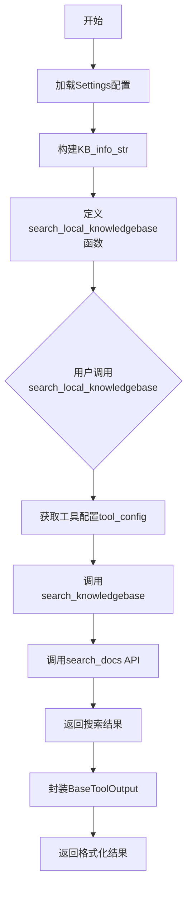
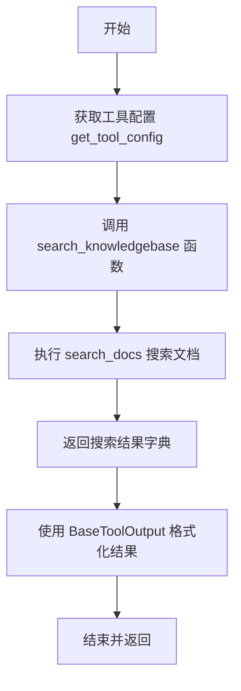

# `Langchain-Chatchat\libs\chatchat-server\chatchat\server\agent\tools_factory\search_local_knowledgebase.py` 详细设计文档

该代码实现了一个本地知识库搜索工具，通过装饰器注册为LangChain工具，允许用户指定数据库和查询词来搜索本地知识库中的文档，并返回相关结果。

## 整体流程



## 类结构

```
无类定义 (基于函数的模块)
└── 全局函数
    ├── search_knowledgebase
    └── search_local_knowledgebase (装饰器注册)
```

## 全局变量及字段


### `template`
    
用于本地知识库搜索工具的描述模板，包含知识库信息和数据库选择说明

类型：`str`
    


### `KB_info_str`
    
格式化后的知识库信息字符串，由Settings.kb_settings.KB_INFO字典键值对拼接而成

类型：`str`
    


    

## 全局函数及方法


### `search_knowledgebase`

该函数是本地知识库搜索的核心实现，接收查询语句、知识库名称和配置参数，调用文档搜索接口并返回指定知识库中的相关文档列表。

参数：

- `query`：`str`，用户输入的查询字符串，用于在知识库中检索相关内容。
- `database`：`str`，目标知识库的名称，指定要从哪个知识库中搜索文档。
- `config`：`dict`，搜索配置字典，包含 `top_k`（返回文档数量）和 `score_threshold`（相似度阈值）等参数。

返回值：`dict`，包含知识库名称和搜索结果文档列表的字典，结构为 `{"knowledge_base": database, "docs": docs}`。

#### 流程图

```mermaid
flowchart TD
    A[开始] --> B[接收参数: query, database, config]
    B --> C{验证参数}
    C -->|通过| D[调用 search_docs 函数]
    C -->|失败| E[抛出异常或返回错误]
    D --> F[获取返回的文档列表 docs]
    F --> G[构建返回字典: {"knowledge_base": database, "docs": docs}]
    G --> H[返回结果]
```

#### 带注释源码

```python
def search_knowledgebase(query: str, database: str, config: dict):
    """
    在指定知识库中搜索与查询语句相关的文档。

    参数:
        query: str - 查询字符串，用于匹配知识库中的文档内容
        database: str - 知识库的名称，指定搜索的目标知识库
        config: dict - 包含搜索配置的字典，必须包含 top_k 和 score_threshold 键

    返回:
        dict - 包含知识库名称和文档列表的字典，格式为 {"knowledge_base": database, "docs": docs}
    """
    # 调用知识库文档搜索接口，执行实际的搜索操作
    # search_docs 是从 chatchat.server.knowledge_base.kb_doc_api 导入的函数
    docs = search_docs(
        query=query,                      # 传入查询字符串
        knowledge_base_name=database,      # 传入知识库名称
        top_k=config["top_k"],             # 从配置中获取返回的文档数量
        score_threshold=config["score_threshold"],  # 从配置中获取相似度阈值
        file_name="",                      # 空字符串，表示不限制文件名
        metadata={},                       # 空字典，表示不限制元数据
    )
    
    # 返回搜索结果，包含知识库名称和文档列表
    return {"knowledge_base": database, "docs": docs}
```


### `search_local_knowledgebase`

该函数是一个 LangChain 工具（LangChain Tool），用于在本地知识库中搜索知识。它接收知识库名称和查询语句，从指定的知识库中检索相关文档，并返回格式化的搜索结果。

参数：

- `database`：`str`，要搜索的知识库名称，值为 `list_kbs()` 返回的知识库列表中的名称
- `query`：`str`，要搜索的查询语句

返回值：`BaseToolOutput`，包含知识库名称和搜索到的文档列表的工具输出对象

#### 流程图



#### 带注释源码

```python
from urllib.parse import urlencode

from chatchat.settings import Settings
from chatchat.server.agent.tools_factory.tools_registry import (
    regist_tool,
    format_context,
)

from langchain_chatchat.agent_toolkits.all_tools.tool import (
    BaseToolOutput,
)
from chatchat.server.knowledge_base.kb_api import list_kbs
from chatchat.server.knowledge_base.kb_doc_api import search_docs
from chatchat.server.pydantic_v1 import Field
from chatchat.server.utils import get_tool_config

# 工具描述模板，用于告知 Agent 如何使用该工具
# 模板中包含可用知识库列表信息
template = (
    "Use local knowledgebase from one or more of these:\n{KB_info}\n to get information，Only local data on "
    "this knowledge use this tool. The 'database' should be one of the above [{key}]."
)
# 从设置中获取知识库信息，格式化为字符串
KB_info_str = "\n".join([f"{key}: {value}" for key, value in Settings.kb_settings.KB_INFO.items()])
# 填充模板，生成最终的描述信息
template_knowledge = template.format(KB_info=KB_info_str, key="samples")


def search_knowledgebase(query: str, database: str, config: dict):
    """
    执行知识库搜索的内部函数
    
    参数:
        query: str - 搜索查询字符串
        database: str - 知识库名称
        config: dict - 包含 top_k 和 score_threshold 的配置字典
    
    返回:
        dict - 包含知识库名称和搜索文档列表的字典
    """
    # 调用知识库文档搜索 API
    docs = search_docs(
        query=query,
        knowledge_base_name=database,
        top_k=config["top_k"],              # 返回前 k 个结果
        score_threshold=config["score_threshold"],  # 相似度阈值
        file_name="",                       # 不限制文件名
        metadata={},                        # 不限制元数据
    )
    return {"knowledge_base": database, "docs": docs}


@regist_tool(description=template_knowledge, title="本地知识库")
def search_local_knowledgebase(
    database: str = Field(
        description="Database for Knowledge Search",
        choices=[kb.kb_name for kb in list_kbs().data],  # 动态获取可用知识库列表作为可选值
    ),
    query: str = Field(description="Query for Knowledge Search"),
):
    """
    本地知识库搜索工具（LangChain Tool）
    
    该函数被 @regist_tool 装饰器注册为 LangChain 工具，
    允许 AI Agent 在本地知识库中检索信息。
    
    参数:
        database: str - 知识库名称，从已注册的知识库中选择
        query: str - 搜索查询语句
    
    返回:
        BaseToolOutput - 格式化后的搜索结果，包含知识库名称和文档列表
    """
    # 获取该工具在配置文件中定义的配置（如 top_k、score_threshold 等）
    tool_config = get_tool_config("search_local_knowledgebase")
    
    # 调用内部搜索函数获取知识库文档
    ret = search_knowledgebase(query=query, database=database, config=tool_config)
    
    # 使用 BaseToolOutput 格式化结果，并使用 format_context 整理上下文格式后返回
    return BaseToolOutput(ret, format=format_context)
```

## 关键组件


### 知识库搜索工具

这是一个本地知识库搜索工具，通过langchain的tool注册机制提供统一的搜索接口，支持多知识库查询和上下文格式化返回。

### 搜索配置管理

通过get_tool_config函数获取工具配置参数（top_k、score_threshold等），实现搜索参数的动态配置和管理。

### 知识库信息模板

使用template和KB_info_str构建提示词模板，将知识库列表信息注入到工具描述中，供LLM理解可用知识库范围。

### 工具输出格式化

使用BaseToolOutput和format_context对搜索结果进行标准化封装，返回结构化的知识库检索结果。


## 问题及建议


### 已知问题

-   **模块级代码执行时序问题**：`KB_info_str`在模块导入时立即执行，如果`Settings.kb_settings`在导入时尚未初始化，会导致程序启动失败
-   **choices动态求值开销**：`Field(choices=[kb.kb_name for kb in list_kbs().data])`在函数定义时调用`list_kbs()`API，知识库数量多时影响加载性能，且无法实时感知知识库变化
-   **config字典访问缺乏防御性编程**：`config["top_k"]`和`config["score_threshold"]`直接访问键，若配置缺失会抛出`KeyError`异常
-   **错误处理机制缺失**：`search_docs()`、`list_kbs()`、`get_tool_config()`调用均未做异常捕获，网络异常或服务不可用时会直接向上抛出
-   **函数文档字符串为空**：`search_local_knowledgebase`函数的文档字符串为`""" """`，影响工具注册后的可读性和自动文档生成
-   **类型提示不完整**：`search_knowledgebase`函数的`ret`变量及部分参数缺少类型注解
-   **重复的模板格式化**：模板字符串在模块加载时格式化一次，若`KB_INFO`后续变化，模板不会同步更新

### 优化建议

-   将`KB_info_str`的计算延迟到函数调用时，或添加初始化检查和默认值保护
-   `choices`应改为在运行时动态获取，或使用`BeforeValidator`在工具执行前校验，而非函数定义时
-   使用`config.get("top_k", default_value)`提供配置缺失时的默认值
-   添加try-except块处理可能的异常情况，返回有意义的错误信息而非直接崩溃
-   为函数补充有意义的文档字符串，描述工具用途、参数含义和返回值
-   完善类型注解，增强代码可维护性和IDE支持
-   考虑将模板格式化移至函数内部或使用懒加载模式


## 其它


### 设计目标与约束

本工具的核心设计目标是为LLM Agent提供一个可靠的本地知识库查询接口，使其能够基于预定义的知识库进行问答。技术约束包括：1) 必须使用chatchat项目的工具注册机制；2) 知识库选择必须从已存在的知识库中动态获取；3) 搜索结果需通过BaseToolOutput格式化返回给LLM。

### 错误处理与异常设计

本模块涉及多处可能失败的环节，需要针对性处理：1) list_kbs()调用失败时，database参数的choices将为空，导致UI无法展示选项；2) search_docs()可能抛出数据库连接异常或文档解析错误；3) get_tool_config()获取配置失败时会导致top_k和score_threshold参数缺失；4) Field的choices参数在运行时动态获取，若知识库为空需有降级策略。建议为search_knowledgebase函数添加try-except包装，返回结构化错误信息而非直接抛出异常。

### 数据流与状态机

数据流向如下：1) 用户通过LLM Agent发起查询请求，包含database和query参数；2) 工具首先通过get_tool_config获取搜索参数配置；3) 调用search_knowledgebase执行实际搜索；4) search_docs内部调用向量数据库进行相似度检索；5) 检索结果通过BaseToolOutput包装后返回。整个过程为同步阻塞调用，无复杂状态机设计。

### 外部依赖与接口契约

本模块依赖以下外部接口：1) Settings.kb_settings.KB_INFO: 知识库元信息配置；2) list_kbs(): 返回知识库列表，接口契约为返回DataModel且包含kb_name属性；3) search_docs(): 文档搜索接口，接收query、knowledge_base_name、top_k、score_threshold等参数；4) get_tool_config(): 工具配置获取，接收工具名称返回配置字典；5) BaseToolOutput: 工具输出格式化类。依赖版本需与chatchat项目保持一致。

### 配置管理

工具配置通过get_tool_config("search_local_knowledgebase")动态获取，需在chatchat配置文件中预定义search_local_knowledgebase相关配置项，包括top_k（默认返回文档数）和score_threshold（相似度阈值）。KB_INFO在Settings初始化时加载，用于生成提示模板中的可选知识库描述。

### 安全性考虑

1) database参数虽然使用Field的choices限制为已存在的知识库，但仍需防范注入风险；2) query参数需进行基本的输入验证和清洗，防止恶意查询语句；3) 搜索结果中的文档内容可能包含敏感信息，需根据LLM Agent的权限级别进行过滤。

### 性能优化建议

1) list_kbs()的调用结果可缓存，避免每次工具注册时都重新获取；2) KB_info_str字符串拼接可优化为join操作；3) search_docs的top_k参数需根据实际性能测试设定合理默认值，过大的top_k会增加响应延迟。

### 测试策略建议

单元测试应覆盖：1) search_knowledgebase函数的参数校验和返回值结构；2) search_local_knowledgebase的Field验证逻辑；3) 模拟list_kbs()为空时的降级行为。集成测试需验证与实际知识库的连接以及搜索结果的准确性。

### 版本兼容性

本代码依赖于chatchat项目的内部API（包括pydantic_v1、server.utils等），这些API可能在项目版本迭代中发生变化。建议在chatchat项目的release notes中跟踪相关模块的变更日志，确保兼容性。

    