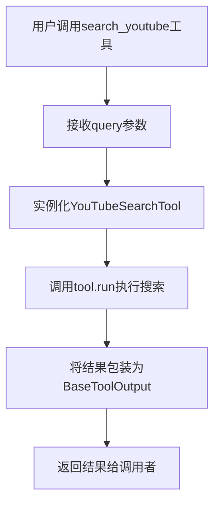
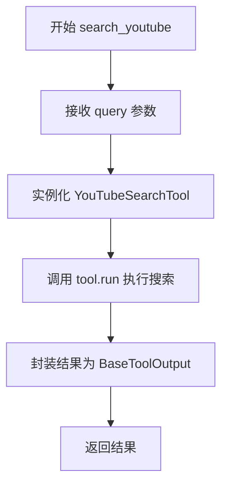
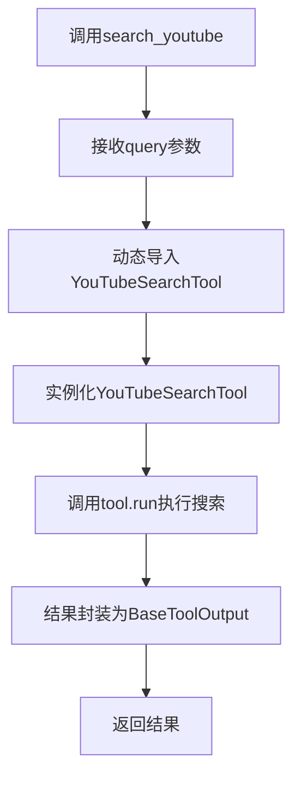

# `Langchain-Chatchat\libs\chatchat-server\chatchat\server\agent\tools_factory\search_youtube.py` 详细设计文档

这是一个YouTube视频搜索工具，通过langchain_community的YouTubeSearchTool实现搜索功能，并使用自定义的tools_registry装饰器注册为聊天机器人可用的工具。

## 整体流程



## 类结构

```
无类层次结构 (基于函数的工具注册模式)
└── search_youtube (工具函数)
```

## 全局变量及字段


### `Field`
    
Pydantic 字段定义类，用于描述函数参数的元数据

类型：`class (from pydantic_v1)`
    


### `regist_tool`
    
工具注册装饰器，用于将函数注册为可用的工具

类型：`decorator function`
    


### `BaseToolOutput`
    
工具输出的基类，用于封装工具执行结果

类型：`class`
    


### `YouTubeSearchTool`
    
YouTube 搜索工具类，用于在 YouTube 上搜索视频

类型：`class (from langchain_community.tools)`
    


### `search_youtube.query`
    
搜索 YouTube 视频的查询字符串参数

类型：`str`
    


### `search_youtube.tool`
    
YouTube 搜索工具的实例

类型：`YouTubeSearchTool`
    
    

## 全局函数及方法


### `search_youtube`

这是一个用于搜索 YouTube 视频的工具函数，通过调用 langchain_community 的 YouTubeSearchTool 执行搜索并返回结果。

参数：

- `query`：`str`，搜索 YouTube 视频的查询字符串

返回值：`BaseToolOutput`，搜索结果的工具输出封装

#### 流程图



#### 带注释源码

```python
# 导入 Field 用于 pydantic 字段定义
from chatchat.server.pydantic_v1 import Field

# 从工具注册模块导入注册装饰器
from .tools_registry import regist_tool

# 导入工具输出基类
from langchain_chatchat.agent_toolkits.all_tools.tool import (
    BaseToolOutput,
)

# 使用装饰器注册工具，标题为"油管视频"
@regist_tool(title="油管视频")
def search_youtube(query: str = Field(description="Query for Videos search")):
    """use this tools_factory to search youtube videos"""
    # 导入 YouTube 搜索工具（延迟导入，避免循环依赖）
    from langchain_community.tools import YouTubeSearchTool

    # 创建 YouTube 搜索工具实例
    tool = YouTubeSearchTool()
    
    # 执行搜索并返回封装后的结果
    return BaseToolOutput(tool.run(tool_input=query))
```

## 关键组件


### 一段话描述

该代码定义了一个YouTube视频搜索工具函数，通过`@regist_tool`装饰器注册到工具系统中，接收查询字符串参数并调用`langchain_community`库的`YouTubeSearchTool`执行搜索，最终将结果封装为`BaseToolOutput`返回。

### 文件整体运行流程

1. 模块导入阶段：导入Pydantic Field、工具注册装饰器、基础工具输出类
2. 工具注册阶段：使用`@regist_tool`装饰器注册函数为"油管视频"工具
3. 函数调用阶段：
   - 接收query参数（通过Pydantic Field定义描述）
   - 动态导入YouTubeSearchTool类
   - 实例化工具并执行run方法
   - 封装结果为BaseToolOutput返回

### 类的详细信息

由于该代码主要是一个函数定义而非类，以下为相关依赖类的信息：

**BaseToolOutput（langchain_chatchat.agent_toolkits.all_tools.tool）**
- 类型：工具输出封装类
- 描述：用于标准化工具执行结果的输出格式

**YouTubeSearchTool（langchain_community.tools）**
- 类型：第三方工具类
- 描述：YouTube搜索功能的封装实现

### 函数详细信息

**search_youtube**

| 属性 | 详情 |
|------|------|
| 名称 | search_youtube |
| 参数名称 | query |
| 参数类型 | str |
| 参数描述 | Query for Videos search |
| 返回值类型 | BaseToolOutput |
| 返回值描述 | 封装搜索结果的工具输出对象 |

**mermaid流程图**



**带注释源码**

```python
# 导入Pydantic字段定义，用于参数描述
from chatchat.server.pydantic_v1 import Field

# 导入工具注册装饰器
from .tools_registry import regist_tool

# 导入基础工具输出类
from langchain_chatchat.agent_toolkits.all_tools.tool import (
    BaseToolOutput,
)

# 使用装饰器注册工具，标题为"油管视频"
@regist_tool(title="油管视频")
def search_youtube(query: str = Field(description="Query for Videos search")):
    """use this tools_factory to search youtube videos"""
    # 动态导入YouTube搜索工具，避免顶层导入
    from langchain_community.tools import YouTubeSearchTool

    # 实例化YouTube搜索工具
    tool = YouTubeSearchTool()
    # 执行搜索并返回封装结果
    return BaseToolOutput(tool.run(tool_input=query))
```

### 关键组件信息

**张量索引与惰性加载**
- 代码使用了动态导入（lazy loading）技术，在函数内部导入YouTubeSearchTool，避免顶层导入带来的性能开销

**反量化支持**
- 该组件为纯字符串处理工具，无量化相关逻辑

**量化策略**
- 该组件为搜索工具，无量化策略需求

### 潜在的技术债务或优化空间

1. **缺少错误处理**：未对YouTubeSearchTool执行失败的情况进行异常捕获
2. **硬编码工具实例化**：每次调用都创建新的YouTubeSearchTool实例，可考虑复用
3. **返回值类型泛化**：可增加对不同类型输出的支持
4. **日志缺失**：未记录搜索日志，不利于问题排查
5. **超时控制**：未对YouTube API调用设置超时，可能导致请求阻塞

### 其它项目

**设计目标与约束**
- 目标：提供统一的YouTube视频搜索接口
- 约束：依赖langchain_community库，需确保版本兼容性

**错误处理与异常设计**
- 当前实现无try-except包裹
- 建议：添加网络异常、API限制等常见错误的处理逻辑

**数据流与状态机**
- 输入：字符串query → 处理：调用YouTube API → 输出：BaseToolOutput对象
- 无状态保持，每次调用独立

**外部依赖与接口契约**
- 依赖：chatchat.server.pydantic_v1.Field
- 依赖：langchain_chatchat.BaseToolOutput
- 依赖：langchain_community.tools.YouTubeSearchTool
- 接口：函数签名需匹配工具系统要求


## 问题及建议


### 已知问题

-   **重复实例化工具对象**：每次调用函数时都会创建新的`YouTubeSearchTool()`实例，导致不必要的内存开销和性能损耗
-   **运行时导入**：在函数内部导入`YouTubeSearchTool`模块会增加调用时的开销，且违反Python最佳实践（应在模块顶部导入）
-   **缺乏错误处理**：工具执行过程中没有try-except捕获异常，如果YouTube API调用失败会直接向上抛出未处理的异常
-   **类型注解不完整**：函数没有显式声明返回类型（应为`BaseToolOutput`），降低代码可读性和IDE支持
-   **Field使用不当**：使用`Field(description=...)`作为函数参数默认值是Pydantic v1的风格，但在普通函数参数中语义不明确，且`description`参数在运行时无实际作用
-   **缺少日志记录**：没有任何日志输出，难以进行线上问题排查和监控
-   **缺乏输入验证**：query参数没有长度限制或格式验证，可能导致API调用异常

### 优化建议

-   将`YouTubeSearchTool`实例化移至模块顶层或使用单例模式，确保工具对象只创建一次
-   将所有import语句移至文件顶部，使用标准Python导入方式
-   添加try-except异常处理，捕获可能的网络错误或API限制，并返回有意义的错误信息
-   为函数添加完整的类型注解：`def search_youtube(query: str) -> BaseToolOutput:`
-   移除不必要的Field包装，直接使用`query: str`作为参数，如需描述可使用函数docstring
-   添加日志记录，记录查询参数和执行结果，便于问题排查
-   考虑添加请求缓存机制，避免重复查询相同内容
-   添加查询参数验证，如最大长度限制、超时设置等
-   考虑添加重试机制，处理临时性网络故障


## 其它


### 设计目标与约束

本工具的核心目标是为聊天机器人系统提供YouTube视频搜索能力，允许用户通过自然语言查询获取相关的YouTube视频信息。设计约束包括：1) 必须通过统一的工具注册机制注册；2) 输入参数必须符合Pydantic v1的Field验证规范；3) 输出必须包装为BaseToolOutput格式以保持与其他工具的一致性；4) 依赖langchain_community库的YouTubeSearchTool实现具体搜索逻辑。

### 错误处理与异常设计

代码中未显式实现错误处理机制，存在以下潜在风险点：1) 当YouTubeSearchTool内部网络请求失败时会直接抛出异常；2) 当query参数为空或格式不正确时缺乏校验；3) 当langchain_community库不可用时ImportError会被直接抛出。建议改进：添加try-except块捕获网络异常和工具执行异常，返回包含错误信息的BaseToolOutput；对query参数添加长度限制和空值校验；在函数开头添加依赖库可用性检查，提供友好的错误提示。

### 数据流与状态机

该工具的数据流较为简单：用户输入query字符串 → 传递给YouTubeSearchTool.run()方法 → YouTubeSearchTool调用YouTube搜索API获取结果 → 结果转换为BaseToolOutput对象返回。状态机方面，该工具本身无状态设计，但作为Agent工具链的一部分，需要处理三种状态：等待执行、执行中、执行完成（成功或失败）。建议在工具元数据中声明这三种状态，以便Agent系统进行流程控制。

### 外部依赖与接口契约

主要外部依赖包括：1) langchain_community.tools.YouTubeSearchTool：核心搜索功能提供者；2) chatchat.server.pydantic_v1.Field：Pydantic字段定义；3) tools_registry.regist_tool：工具注册装饰器；4) langchain_chatchat.agent_toolkits.all_tools.tool.BaseToolOutput：输出包装类。接口契约方面：输入为单个必需参数query（str类型），输出为BaseToolOutput类型，包含工具执行结果或错误信息。

### 性能考虑与优化空间

当前实现每次调用都会实例化新的YouTubeSearchTool对象，造成不必要的资源开销。建议优化：1) 将tool实例作为模块级单例或缓存，避免重复创建；2) 考虑添加结果缓存机制，减少对YouTube API的重复调用；3) 对于超时场景，可以添加可选的timeout参数。性能指标方面，需关注首次调用时的冷启动延迟以及API响应的平均耗时。

### 安全性考虑

1) 输入验证：query参数应进行长度限制（建议最大512字符）和内容过滤，防止注入攻击；2) 依赖安全：需确保langchain_community库来自可信源且版本受控；3) 隐私保护：查询日志中可能包含用户搜索历史，需评估数据保留策略；4) API密钥管理：YouTubeSearchTool可能需要API密钥，应确保密钥通过安全配置注入而非硬编码。

### 配置管理

当前工具未暴露可配置项，建议添加以下配置选项：1) search_limit：单次搜索返回结果数量（默认10）；2) timeout：请求超时时间（默认30秒）；3) language/region：搜索语言和地区参数；4) safe_search：是否启用安全搜索。这些配置可通过装饰器参数或全局配置对象传递。

### 版本兼容性

1) 代码明确依赖Pydantic v1（chatchat.server.pydantic_v1），需确保项目内Pydantic版本兼容；2) langchain_community库版本需与langchain_chatchat主版本兼容；3) YouTubeSearchTool的API接口可能随库版本变化，需锁定依赖版本并做好兼容性测试。

### 测试策略建议

建议补充以下测试用例：1) 单元测试：验证query参数校验逻辑；2) 集成测试：模拟YouTubeSearchTool返回结果，验证输出格式；3) 异常测试：模拟网络超时、API错误等场景；4) 边界测试：空字符串、超长输入、特殊字符等。由于依赖外部API，集成测试建议使用mock或录制响应数据的方式。

### 部署注意事项

1) 部署环境需预装langchain_community和langchain_chatchat依赖包；2) 需配置YouTube Data API密钥（如YouTubeSearchTool需要）；3) 网络访问限制环境下需配置代理；4) 工具注册依赖的装饰器@regist_tool需在应用启动时正确初始化；5) 监控方面建议记录工具调用次数、成功率、平均响应时间等指标。


    