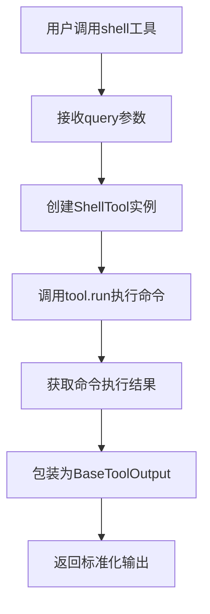
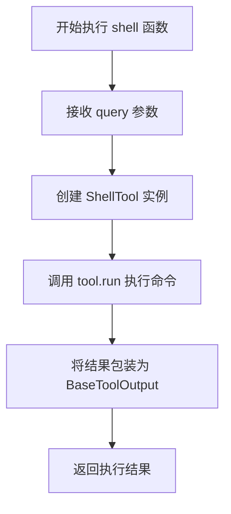
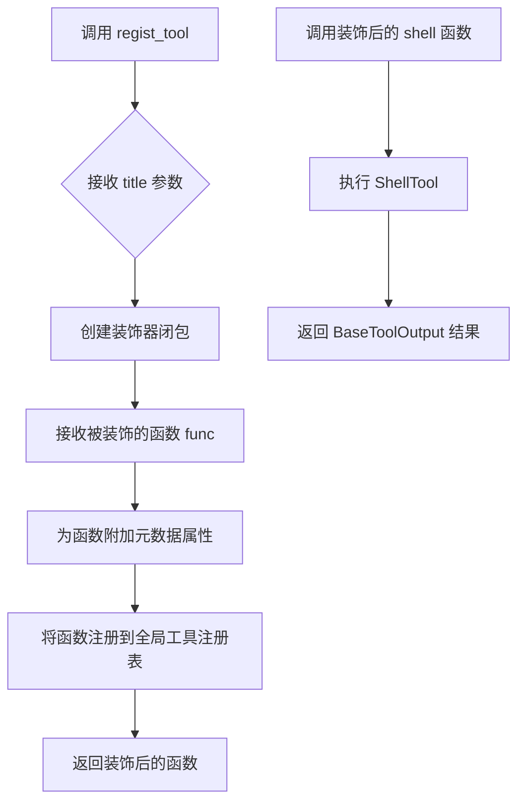
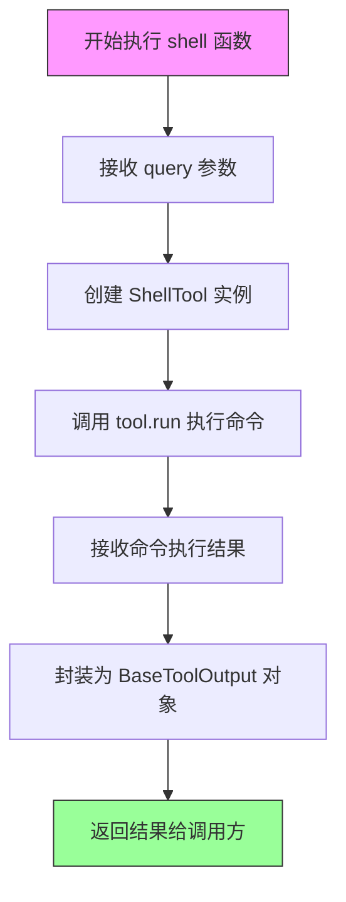

# `Langchain-Chatchat\libs\chatchat-server\chatchat\server\agent\tools_factory\shell.py` 详细设计文档

这是一个LangChain工具集成模块，通过装饰器模式注册了一个系统命令执行工具(shell)，该工具封装了LangChain的ShellTool，允许用户执行系统shell命令并返回标准化的工具输出结果。

## 整体流程



## 类结构

```
无自定义类定义
仅包含工具函数和导入的外部类
```

## 全局变量及字段


### `query`
    
The command to execute

类型：`str`
    


### `tool`
    
Instance of ShellTool to execute system commands

类型：`ShellTool`
    


### `BaseToolOutput`
    
Base class for tool output, used to wrap the result of shell command execution

类型：`class`
    


### `ShellTool`
    
LangChain community tool for executing shell commands

类型：`class`
    


### `regist_tool`
    
Decorator to register tools in the tool registry

类型：`function`
    


### `Field`
    
Pydantic field descriptor for parameter validation and description

类型：`class`
    


    

## 全局函数及方法


### `shell`

使用 Shell 工具执行系统 shell 命令，用户通过输入命令行指令来操作系统。

参数：

- `query`：`str`，需要执行的系统命令

返回值：`BaseToolOutput`，命令执行后的输出结果

#### 流程图



#### 带注释源码

```python
# LangChain 的 Shell 工具
from langchain_community.tools import ShellTool  # 导入 LangChain 社区的 Shell 工具

from chatchat.server.pydantic_v1 import Field  # 导入 Pydantic 字段定义

from .tools_registry import regist_tool  # 导入工具注册装饰器

from langchain_chatchat.agent_toolkits.all_tools.tool import (
    BaseToolOutput,  # 导入工具输出基类
)

# 使用注册装饰器注册该工具，标题为"系统命令"
@regist_tool(title="系统命令")
def shell(query: str = Field(description="The command to execute")):
    """Use Shell to execute system shell commands"""
    # 创建 ShellTool 实例，用于执行系统命令
    tool = ShellTool()
    # 调用 tool.run 方法执行输入的命令，并将结果包装为 BaseToolOutput 返回
    return BaseToolOutput(tool.run(tool_input=query))
```


### `regist_tool`

该函数是一个装饰器工厂，用于将自定义工具函数注册到系统的工具注册表中，并可为工具添加元数据信息（如标题、描述等）。

参数：

- `title`：`str`，工具的标题，用于在 UI 或文档中显示工具名称
- `**kwargs`：可选关键字参数，可包含 `description`（描述）、`name`（名称）等其他元数据

返回值：返回一个装饰器函数，该装饰器接收被装饰的函数作为参数，返回装饰后的函数对象。

#### 流程图



#### 带注释源码

```python
# regist_tool 是从 tools_registry 模块导入的装饰器工厂函数
# 此处展示其在代码中的使用方式：

# 导入注册装饰器
from .tools_registry import regist_tool

# 使用装饰器注册 shell 工具，并设置标题为"系统命令"
@regist_tool(title="系统命令")
def shell(query: str = Field(description="The command to execute")):
    """Use Shell to execute system shell shell命令执行工具"""
    # 创建 ShellTool 实例
    tool = ShellTool()
    # 执行命令并返回包装后的结果
    return BaseToolOutput(tool.run(tool_input=query))

# 注册装饰器内部逻辑（推测实现）
def regist_tool(title: str = None, **kwargs):
    """
    工具注册装饰器
    
    参数:
        title: 工具显示标题
        **kwargs: 其他元数据如 description, name 等
        
    返回:
        装饰器函数
    """
    def decorator(func):
        # 1. 附加元数据到函数对象
        func._tool_title = title
        func._tool_metadata = kwargs
        
        # 2. 注册到全局工具注册表
        # tools_registry.register(func)
        
        return func
    return decorator
```

---

> **注意**：由于 `regist_tool` 的完整源码位于 `chatchat/server/.../tools_registry.py` 文件中，当前代码片段仅展示了其使用方式，因此上述源码为基于使用模式的合理推测。如需获取精确实现，建议查阅 `tools_registry.py` 源文件。


### `shell`

该函数是一个系统命令执行工具，通过封装 LangChain 的 `ShellTool` 并使用自定义装饰器注册，为聊天系统提供执行本地 shell 命令的能力。

参数：

- `query`：`str`，要执行的系统命令

返回值：`BaseToolOutput`，执行 shell 命令后的输出结果

#### 流程图



#### 带注释源码

```python
# LangChain 的 Shell 工具 - 从 langchain_community 导入 ShellTool
from langchain_community.tools import ShellTool

# 从 chatchat.server.pydantic_v1 导入 Field，用于参数验证和描述
from chatchat.server.pydantic_v1 import Field

# 从当前包的工具注册模块导入注册装饰器
from .tools_registry import regist_tool

# 从 agent_toolkits 导入基础工具输出类
from langchain_chatchat.agent_toolkits.all_tools.tool import (
    BaseToolOutput,
)

# 使用装饰器注册工具，title="系统命令"用于前端显示
@regist_tool(title="系统命令")
def shell(query: str = Field(description="The command to execute")):
    """Use Shell to execute system shell commands"""
    # 创建 ShellTool 实例（LangChain 提供的 shell 执行工具）
    tool = ShellTool()
    # 调用 tool.run 方法执行命令，传入命令字符串
    # tool_input 参数接受要执行的命令
    return BaseToolOutput(tool.run(tool_input=query))
```

## 关键组件


### shell 函数

系统命令执行的主入口函数，通过装饰器注册为工具，接收用户输入的命令字符串，调用 LangChain 的 ShellTool 执行系统 shell 命令，并返回 BaseToolOutput 封装的结果。

### ShellTool (langchain_community.tools)

LangChain 社区提供的底层 shell 命令执行工具，负责实际执行操作系统命令的核心逻辑，支持命令输入并返回执行结果。

### BaseToolOutput

工具输出的标准封装类，将 ShellTool 的执行结果包装为统一的工具输出格式，提供标准化的返回结构。

### regist_tool 装饰器

自定义的工具注册装饰器，将 shell 函数注册到工具注册表中，并附加元数据（如标题"系统命令"）。

### Field (chatchat.server.pydantic_v1)

Pydantic 字段定义器，用于为函数参数提供类型注解、描述信息等元数据，在此处为 query 参数提供命令描述。


## 问题及建议


### 已知问题

-   **缺少错误处理**：代码未对 shell 命令执行失败的情况进行异常捕获，可能导致未处理的异常直接向上传播
-   **实例未复用**：`ShellTool()` 在每次调用函数时都创建新实例，造成资源浪费和性能开销
-   **安全性风险**：直接执行用户输入的 query 而无任何过滤或验证，可能导致命令注入攻击
-   **缺少超时控制**：shell 命令执行无超时设置，可能导致请求长时间阻塞甚至挂起
-   **无日志记录**：命令执行过程无任何日志，无法进行审计和问题追踪
-   **类型注解不完整**：函数缺少返回类型注解（→ BaseToolOutput）
-   **无输出限制**：shell 命令的输出可能非常大，没有进行截断或限制处理

### 优化建议

-   在函数内部添加 try-except 捕获异常，返回包含错误信息的 BaseToolOutput
-   将 `ShellTool()` 实例化为模块级变量或使用单例模式，避免重复创建
-   添加超时参数配置，限制命令最大执行时间
-   实现命令白名单机制或危险命令过滤，提升安全性
-   添加日志记录，记录执行的命令、时间戳和执行结果
-   为函数添加明确的返回类型注解 `→ BaseToolOutput`
-   对命令输出添加长度限制，防止内存溢出或响应过大

## 其它


### 设计目标与约束

- **设计目标**：提供一个安全的系统命令执行工具封装，允许 AI Agent 通过 LangChain 框架执行系统 shell 命令，并返回标准化的输出结果
- **约束条件**：依赖 `langchain_community.tools.ShellTool` 实现底层功能，受限于 ShellTool 本身的安全机制和功能限制

### 错误处理与异常设计

- **ShellTool 执行异常**：当 shell 命令执行失败时，ShellTool 会抛出异常，该异常会被包装在 BaseToolOutput 中返回
- **参数验证**：query 参数为必填项，通过 pydantic Field 进行描述和验证
- **超时处理**：依赖 ShellTool 的默认超时设置，需关注长时间运行的命令

### 数据流与状态机

- **输入数据流**：用户输入的 shell 命令字符串 → query 参数
- **处理流程**：query → ShellTool.run() → 执行系统命令 → 获取输出
- **输出数据流**：命令执行结果 → BaseToolOutput 包装 → 返回给调用者
- **状态**：仅存在「就绪」「执行中」「已完成」三种状态，无复杂状态机

### 外部依赖与接口契约

- **langchain_community.tools.ShellTool**：核心依赖，提供 shell 命令执行能力
- **chatchat.server.pydantic_v1.Field**：用于参数定义和文档生成
- **tools_registry.regist_tool**：工具注册装饰器，将函数注册到工具集合
- **langchain_chatchat.agent_toolkits.all_tools.tool.BaseToolOutput**：输出包装类，标准化工具返回格式

### 安全性考量

- **命令注入风险**：直接接受用户输入的 shell 命令，存在命令注入安全风险
- **权限控制**：执行权限依赖于运行进程的操作系统用户权限
- **建议**：生产环境应添加命令白名单、权限控制或沙箱机制

### 性能特征

- **阻塞执行**：ShellTool.run() 为同步阻塞调用，会阻塞当前线程直至命令执行完成
- **资源占用**：每个调用都会创建新的 ShellTool 实例，建议单例复用

### 测试建议

- 测试不同类型命令的执行（ls、echo、pwd 等）
- 测试异常命令的错误处理
- 测试超时场景
- 测试空命令和特殊字符输入

### 部署与环境要求

- Python 3.8+
- 需安装 langchain-community 和 langchain-chatchat 包
- 操作系统需支持 shell 命令执行


    