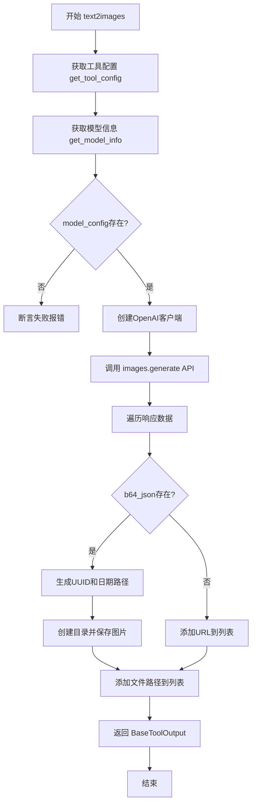
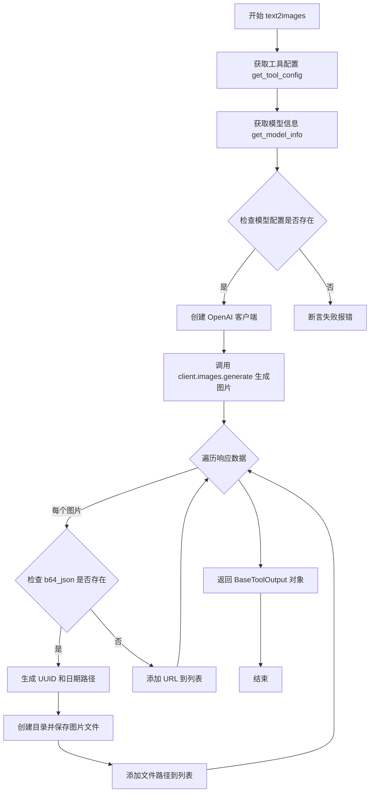

# `Langchain-Chatchat\libs\chatchat-server\chatchat\server\agent\tools_factory\text2image.py` 详细设计文档

这是一个文本生成图片的工具模块，通过调用第三方OpenAI兼容的API，根据用户提供的文本描述(prompt)生成对应图片，支持指定图片数量和尺寸，并将生成的base64编码图片保存到本地存储，最终返回图片路径或URL。

## 整体流程



## 类结构

```
模块: text2images (文本生成图片工具)
├── 全局函数: text2images
├── 依赖: BaseToolOutput (langchain_chatchat)
└── 依赖: Settings, Field, MsgType, get_tool_config, get_model_info (chatchat)
```

## 全局变量及字段


### `tool_config`
    
获取text2images工具的配置信息，包含模型等参数

类型：`dict`
    


### `model_config`
    
获取文本生成图片模型的配置信息，包含API地址、密钥等

类型：`dict`
    


### `client`
    
OpenAI客户端实例，用于调用文生图API

类型：`openai.Client`
    


### `resp`
    
调用文生图API返回的响应对象，包含生成的图片数据

类型：`openai.images.generate response`
    


### `images`
    
存储生成的图片文件路径或URL的列表

类型：`List[str]`
    


### `uid`
    
生成的唯一标识符，用于图片文件名

类型：`str`
    


### `today`
    
当前日期，格式为YYYY-MM-DD，用于组织文件目录

类型：`str`
    


### `path`
    
图片文件的完整存储路径

类型：`str`
    


### `filename`
    
图片文件的相对路径，用于数据库存储和前端展示

类型：`str`
    


    

## 全局函数及方法


### `text2images`

根据用户的文本描述调用 OpenAI DALL-E 模型生成图片，并将生成的 Base64 编码图片解码保存到本地存储，返回包含图片路径的工具输出对象。

参数：

- `prompt`：`str`，用户的描述，生成图片所需的文本提示词
- `n`：`int`，需生成图片的数量，默认值为 1
- `size`：`Literal["1024x1024", "768x1344", "864x1152", "1344x768", "1152x864", "1440x720", "720x1440"]`，图片尺寸，默认为 1024x1024

返回值：`BaseToolOutput`，包含消息类型（MsgType.IMAGE）和生成的图片路径列表（本地文件路径或 URL）

#### 流程图



#### 带注释源码

```python
import base64
from datetime import datetime
import os
import uuid
from typing import List, Literal

import openai
from PIL import Image

from chatchat.settings import Settings
from chatchat.server.pydantic_v1 import Field
from chatchat.server.utils import MsgType, get_tool_config, get_model_info

from .tools_registry import regist_tool

from langchain_chatchat.agent_toolkits.all_tools.tool import (
    BaseToolOutput,
)

# 使用装饰器注册工具，包含工具标题、描述和请求参数说明
@regist_tool(title="""
#文本生成图片工具
##描述
则根据用户的描述生成图片。
##请求参数
参数名	类型	必填	描述 
prompt	String	是	所需图像的文本描述
size	String	否	图片尺寸，可选值：1024x1024,768x1344,864x1152,1344x768,1152x864,1440x720,720x1440，默认是1024x1024。 
""", return_direct=True)
def text2images(
    prompt: str = Field(description="用户的描述"),
    n: int = Field(1, description="需生成图片的数量"),
    size: Literal["1024x1024", "768x1344", "864x1152", "1344x768", "1152x864", "1440x720", "720x1440"] = Field(description="图片尺寸"),
):
    """根据用户的描述生成图片"""

    # 从配置中获取 text2images 工具的配置信息
    tool_config = get_tool_config("text2images")
    
    # 获取模型配置信息，包括 api_base_url、api_key、model_name 等
    model_config = get_model_info(tool_config["model"])
    
    # 断言模型配置存在，否则抛出异常提示用户配置文生图模型
    assert model_config, "请正确配置文生图模型"

    # 创建 OpenAI 客户端，配置 base_url、api_key 和超时时间
    client = openai.Client(
        base_url=model_config["api_base_url"],
        api_key=model_config["api_key"],
        timeout=600,
    )
    
    # 调用 DALL-E API 生成图片，指定提示词、数量、尺寸、返回格式和模型
    resp = client.images.generate(
        prompt=prompt,
        n=n,
        size=size,
        response_format="b64_json",  # 指定返回 Base64 编码的 JSON 格式
        model=model_config["model_name"],
    )
    
    # 初始化图片路径列表
    images = []
    
    # 遍历 API 返回的每个图片数据
    for x in resp.data:
        # 如果返回的是 Base64 编码的图片数据
        if x.b64_json is not None:
            # 生成唯一标识符 UUID
            uid = uuid.uuid4().hex
            # 获取当前日期字符串，格式如 2024-01-01
            today = datetime.now().strftime("%Y-%m-%d")
            
            # 构建图片存储路径：MEDIA_PATH/image/YYYY-MM-DD/
            path = os.path.join(Settings.basic_settings.MEDIA_PATH, "image", today)
            
            # 确保目录存在，如不存在则创建
            os.makedirs(path, exist_ok=True)
            
            # 构建文件相对路径：image/YYYY-MM-DD/xxx.png
            filename = f"image/{today}/{uid}.png"
            
            # 将 Base64 解码并写入文件
            with open(os.path.join(Settings.basic_settings.MEDIA_PATH, filename), "wb") as fp:
                fp.write(base64.b64decode(x.b64_json))
            
            # 将本地文件路径添加到列表
            images.append(filename)
        else:
            # 如果没有 Base64 数据（如返回的是 URL），则直接添加 URL
            images.append(x.url)
    
    # 返回工具输出对象，包含消息类型为图片和图片路径列表
    return BaseToolOutput(
        {"message_type": MsgType.IMAGE, "images": images}, format="json"
    )
```

## 关键组件


### 文本生成图片工具 (text2images函数)

text2images是核心工具函数，接收用户的文本描述(prompt)、生成图片数量(n)和图片尺寸(size)参数，调用OpenAI图像生成API并将结果返回给用户。

### OpenAI客户端配置

使用openai.Client创建与图像生成API的连接，从模型配置中获取api_base_url、api_key等参数，并设置600秒超时时间。

### 响应格式处理

配置API返回格式为b64_json(base64编码的JSON)，便于直接传输图片二进制数据而无需额外下载步骤。

### 图片保存与持久化

遍历API返回的每张图片，检查是否存在base64数据，如有则解码并保存到MEDIA_PATH目录下的image/{日期}文件夹中，生成唯一文件名。

### BaseToolOutput返回包装

将结果封装为BaseToolOutput对象，指定消息类型为MsgType.IMAGE，包含图片路径列表，以JSON格式返回。

### 工具注册机制

使用@regist_tool装饰器注册工具，定义标题、描述和请求参数说明，支持return_direct=True直接返回结果。


## 问题及建议


### 已知问题

- **错误处理不足**：使用`assert`而非适当的异常处理，API调用失败时会导致未捕获异常；文件写入失败无容错机制；未验证`prompt`为空的情况
- **参数使用不一致**：`n`参数定义了图片数量，但代码中未对生成的多个图片进行循环处理，仅处理了第一张
- **硬编码配置**：`timeout=600`、`response_format="b64_json"`等参数硬编码在函数内，缺乏灵活配置
- **路径安全风险**：直接使用用户输入的prompt和系统时间构建文件路径，未做路径遍历防护
- **缺少日志记录**：整个函数无任何日志输出，难以追踪执行状态和排查问题
- **同步阻塞调用**：使用同步方式调用OpenAI API，会阻塞当前线程，高并发场景下性能受限
- **返回值类型不一致**：当`b64_json`为空时返回`x.url`，否则返回本地文件路径，返回值类型不统一
- **测试代码混入生产代码**：`if __name__ == "__main__"`块中包含完整的测试逻辑，不应出现在生产代码中
- **缺少重试与熔断机制**：依赖外部API调用，无重试逻辑和熔断保护，API临时不可用时会直接失败

### 优化建议

- 添加完整的异常捕获与处理逻辑，使用`try-except`包装API调用和文件操作，返回有意义的错误信息
- 修复`n`参数循环逻辑，确保生成多张图片时全部保存并返回
- 将超时时间、响应格式等配置提取到Settings配置文件中，支持动态调整
- 对文件路径进行安全校验，防止路径遍历攻击；建议使用`secure_filename`或UUID生成文件名
- 引入日志记录（如`logger`），记录关键操作节点和异常信息
- 考虑使用异步方式调用API或添加线程池，提升并发处理能力
- 统一返回值格式，建议始终返回本地文件路径或始终返回URL，避免类型不一致
- 移除`__main__`块中的测试代码，或将其移至独立的测试文件
- 添加API调用的重试机制和熔断器，防止外部服务故障影响整体系统稳定性

## 其它


### 设计目标与约束

**设计目标**：实现一个文本到图像生成的工具，能够根据用户的文字描述生成对应图片，支持多种尺寸选择，并将生成的图片持久化存储到本地文件系统，同时支持通过BaseToolOutput格式返回结果。

**约束条件**：
- 依赖OpenAI API进行图像生成，需正确配置api_base_url和api_key
- 图片尺寸必须为预定义的7种尺寸之一
- 生成图片数量n默认值为1
- 文件存储路径依赖于Settings.basic_settings.MEDIA_PATH配置
- API调用超时时间设置为600秒
- 仅支持b64_json格式返回，不支持URL返回（URL仅作为fallback）

### 错误处理与异常设计

**异常处理场景**：
1. **模型配置缺失**：使用assert断言检查model_config是否存在，不存在时抛出"请正确配置文生图模型"错误
2. **API调用失败**：openai.Client的timeout参数设置为600秒，超时后抛出openai超时异常
3. **文件写入失败**：IOError异常可能被抛出（文件路径不存在、权限问题等）
4. **Base64解码失败**：base64.b64decode可能抛出异常（数据损坏）
5. **参数校验失败**：Pydantic的Field验证失败时抛出ValidationError

**错误传播机制**：直接向上层抛出异常，由调用方处理；未捕获的异常会导致工具调用失败

### 数据流与状态机

**数据处理流程**：
1. **输入阶段**：接收prompt（必填）、n（可选，默认1）、size（可选，默认1024x1024）
2. **配置加载阶段**：通过get_tool_config获取工具配置，通过get_model_info获取模型信息
3. **API调用阶段**：构造openai.Client，调用images.generate接口
4. **响应解析阶段**：遍历resp.data，提取b64_json数据或url
5. **文件存储阶段**：生成UUID作为文件名，按日期组织目录结构，写入文件
6. **结果返回阶段**：构造BaseToolOutput对象，包含message_type和images列表

**状态转换**：
- 初始状态 → 配置加载 → API调用中 → 响应处理 → 文件存储 → 返回结果
- 任意阶段失败 → 异常抛出 → 错误状态

### 外部依赖与接口契约

**外部依赖**：
- `openai`库：用于调用图像生成API
- `PIL (Pillow)`：用于图像处理（仅在测试代码中使用）
- `chatchat.settings`：项目配置模块，提供MEDIA_PATH等配置
- `chatchat.server.pydantic_v1`：Pydantic V1版本，用于Field定义
- `chatchat.server.utils`：工具配置和模型信息获取函数
- `langchain_chatchat.agent_toolkits.all_tools.tool`：BaseToolOutput类定义

**接口契约**：
- **输入接口**：text2images函数接收prompt（str）、n（int）、size（Literal类型）参数
- **输出接口**：返回BaseToolOutput对象，包含JSON格式的dict，结构为{"message_type": MsgType.IMAGE, "images": List[str]}
- **文件路径格式**：image/{YYYY-MM-DD}/{uuid}.png

### 性能考量与优化建议

**当前实现分析**：
- 同步阻塞调用：API调用为同步操作，大批量生成时会阻塞
- 文件IO同步：图片写入为同步操作，高并发时可能成为瓶颈
- 无缓存机制：相同prompt会重复调用API

**优化建议**：
1. 考虑添加异步支持（asyncio/aiofiles）
2. 实现图片去重或缓存机制
3. 添加重试逻辑处理临时性API失败
4. 考虑将文件存储改为异步写入
5. 可增加图片生成队列机制

### 安全性分析

**安全考量**：
1. **输入验证**：prompt参数未做敏感内容过滤，可能生成不当图片
2. **文件路径安全**：依赖Settings配置的文件路径，需防止路径遍历攻击
3. **API密钥安全**：api_key存储在配置中，需确保配置安全
4. **文件上传大小**：未限制n参数最大值，可能导致大量存储

**风险点**：
- 用户可能通过构造特殊prompt生成恶意内容
- 未对生成的图片数量做上限控制
- 文件路径直接拼接未做安全校验

### 配置管理与环境要求

**必需配置**：
- `tool_config`：需包含model字段，指定使用的图像生成模型
- `model_config`：需包含api_base_url、api_key、model_name字段
- `Settings.basic_settings.MEDIA_PATH`：图片存储根目录

**环境要求**：
- Python 3.x环境
- 网络可达api_base_url指向的API服务
- 本地文件系统写权限
- 依赖库：openai、Pillow、pydantic、langchain-chatchat

### 测试与部署考量

**测试要点**：
1. 单元测试：验证参数解析、配置加载
2. 集成测试：验证API调用流程、文件存储
3. 边界测试：空prompt、超大n值、无效size值
4. 异常测试：API超时、文件写入失败、Base64解码失败

**部署注意事项**：
- 确保MEDIA_PATH目录存在且可写
- 正确配置模型API信息
- 考虑日志记录便于问题排查
- 监控API调用成功率和响应时间


    