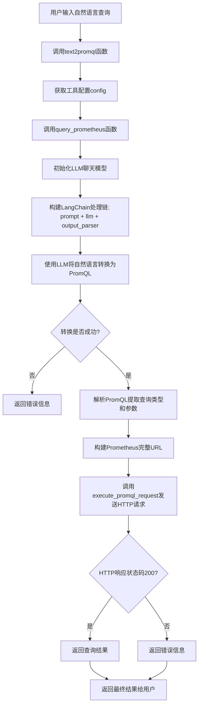
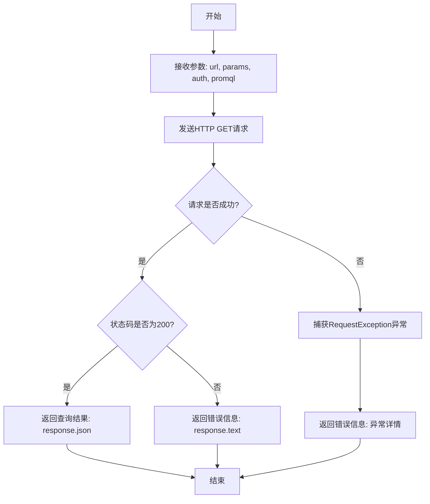
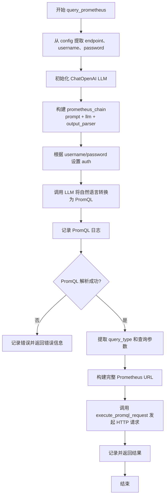
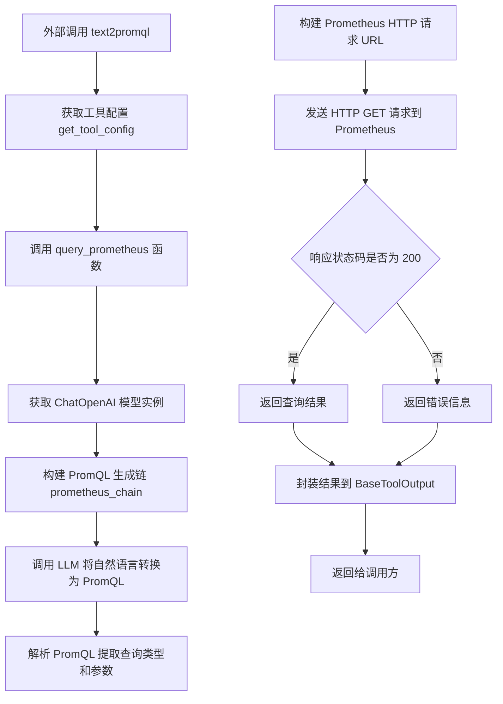

# `Langchain-Chatchat\libs\chatchat-server\chatchat\server\agent\tools_factory\text2promql.py` 详细设计文档

该代码实现了一个将自然语言转换为PromQL查询语句并执行的功能模块，通过LLM理解用户需求生成PromQL查询，调用Prometheus HTTP API获取监控数据并返回结果。

## 整体流程



## 类结构

```
该文件为工具模块，无独立类定义
依赖外部类:
├── BaseToolOutput (langchain_chatchat.agent_toolkits)
├── Field (chatchat.server.pydantic_v1)
└── ChatOpenAI (chatchat.server.utils.get_ChatOpenAI)
```

## 全局变量及字段


### `PROMETHEUS_PROMPT_TEMPLATE`
    
LLM提示词模板，定义Prometheus专家角色和查询规范

类型：`str`
    


### `logger`
    
模块级日志记录器

类型：`Logger`
    


    

## 全局函数及方法


### `execute_promql_request`

该函数负责向 Prometheus HTTP API 发送 GET 请求并处理响应，根据响应状态码返回查询结果或错误信息。

参数：

- `url`：`str`，Prometheus API 的完整 URL 地址
- `params`：`dict`，URL 查询参数字典
- `auth`：`Optional[HTTPBasicAuth]`，可选的 HTTP 基本认证对象，用于身份验证
- `promql`：`str`，执行的 PromQL 查询字符串，用于日志和错误信息

返回值：`str`，返回格式化后的查询结果或错误信息

#### 流程图



#### 带注释源码

```python
def execute_promql_request(url: str, params: dict, auth: Optional[HTTPBasicAuth], promql: str) -> str:
    """
    执行PromQL查询请求到Prometheus HTTP API
    
    参数:
        url: Prometheus API的完整URL地址
        params: URL查询参数字典
        auth: 可选的HTTP基本认证对象
        promql: PromQL查询字符串
    
    返回:
        格式化后的查询结果或错误信息字符串
    """
    try:
        # 发起HTTP GET请求，使用params传递查询参数，auth用于身份验证
        response = requests.get(url, params=params, auth=auth)
    except requests.exceptions.RequestException as e:
        # 捕获网络请求异常，返回错误信息
        return f"PromQL: {promql} 的错误: {e}\n"

    # 检查HTTP响应状态码
    if response.status_code == 200:
        # 请求成功，返回解析后的JSON响应数据
        return f"PromQL: {promql} 的查询结果: {response.json()}\n"
    else:
        # HTTP错误响应，返回服务器返回的错误文本
        return f"PromQL: {promql} 的错误: {response.text}\n"
```


### `query_prometheus`

该函数是 Prometheus 查询能力的核心业务逻辑，通过协调 LLM（大型语言模型）和 HTTP 请求，将用户输入的自然语言查询转换为 PromQL 语句，并向 Prometheus 服务器发起查询请求，最终返回查询结果或错误信息。

参数：

- `query`：`str`，用户输入的自然语言查询，用于描述想要查询的监控需求
- `config`：`dict`，Prometheus 配置字典，包含 `prometheus_endpoint`（Prometheus 服务器地址）、`username`（可选的用户名）和 `password`（可选的密码）

返回值：`str`，Prometheus 查询的执行结果或错误信息字符串

#### 流程图



#### 带注释源码

```python
def query_prometheus(query: str, config: dict) -> str:
    """
    协调 LLM 和 HTTP 请求，将自然语言查询转换为 PromQL 并执行
    
    Args:
        query: 用户输入的自然语言查询
        config: 包含 prometheus_endpoint, username, password 的配置字典
    
    Returns:
        Prometheus 查询结果或错误信息字符串
    """
    
    # === 步骤 1: 从配置中提取连接信息 ===
    # prometheus_endpoint: Prometheus 服务器的基础 URL (如 http://localhost:9090)
    # username/password: HTTP Basic 认证凭证（可选）
    prometheus_endpoint = config["prometheus_endpoint"]
    username = config["username"]
    password = config["password"]

    # === 步骤 2: 初始化 LLM ===
    # 使用 ChatOpenAI 作为语言模型，用于将自然语言转换为 PromQL
    # 注意: get_ChatOpenAI 是项目内部的封装函数
    llm = get_ChatOpenAI(
        # model_name=global_model_name,   # 使用的模型名称
        # temperature=0.1,               # 生成温度
        # streaming=True,                # 是否流式输出
        # local_wrap=True,               # 是否本地包装
        # verbose=True,                  # 详细模式
        # max_tokens=MAX_TOKENS,         # 最大 token 数
    )

    # === 步骤 3: 构建 LangChain 处理链 ===
    # ChatPromptTemplate: 将模板与用户输入结合生成 prompt
    # StrOutputParser: 解析 LLM 输出为字符串
    # RunnablePassthrough: 传递输入参数
    prometheus_prompt = ChatPromptTemplate.from_template(PROMETHEUS_PROMPT_TEMPLATE)
    output_parser = StrOutputParser()

    # 使用管道操作符构建 LCEL 链: 输入 -> prompt -> llm -> parser -> 输出
    prometheus_chain = (
        {"query": RunnablePassthrough()}  # 将 query 传递给 prompt
        | prometheus_prompt                # 生成 PromQL 生成提示
        | llm                               # 调用 LLM 生成 PromQL
        | output_parser                    # 解析输出为字符串
    )

    # === 步骤 4: 设置认证信息 ===
    # 根据用户名和密码是否存在来构建 HTTP Basic Auth 对象
    # 如果 username 或 password 为空，则 auth 为 None（无认证）
    auth = HTTPBasicAuth(username, password) if username and password else None

    # === 步骤 5: 调用 LLM 生成 PromQL ===
    # 将用户查询传入 chain，获取生成的 PromQL 语句
    # 示例输出: "query?query=up&time=2015-07-01T20:10:51.781Z"
    promql = prometheus_chain.invoke(query)
    logger.info(f"PromQL: {promql}")

    # === 步骤 6: 解析 PromQL 提取查询类型和参数 ===
    # PromQL 格式: "query_type?param1=value1&param2=value2"
    # query_type: 查询类型 (query 或 query_range)
    # query_params: 查询参数字符串
    try:
        # 按 '?' 分割获取查询类型和参数部分
        query_type, query_params = promql.split('?')
    except ValueError as e:
        # 分割失败时记录错误并返回错误信息
        logger.error(f"Promql split error: {e}")
        content = f"PromQL: {promql} 的错误: {e}\n"
        return content

    # === 步骤 7: 构建完整的 Prometheus API URL ===
    # 拼接基础 endpoint 和 API 路径
    # 示例: http://localhost:9090/api/v1/query
    prometheus_url = f"{prometheus_endpoint}/api/v1/{query_type}"

    # === 步骤 8: 解析查询参数 ===
    # parse_qs 返回值为字典，值为列表
    # 示例: parse_qs("query=up&time=2015-07-01T20:10:51.781Z")
    #       -> {'query': ['up'], 'time': ['2015-07-01T20:10:51.781Z']}
    # 需要转换为: {'query': 'up', 'time': '2015-07-01T20:10:51.781Z'}
    params = {k: v[0] for k, v in parse_qs(query_params).items()}

    # === 步骤 9: 发起 HTTP 请求并获取结果 ===
    # 调用 execute_promql_request 发送 GET 请求
    content = execute_promql_request(prometheus_url, params, auth, promql)

    # === 步骤 10: 返回结果 ===
    logger.info(content)
    return content
```


### `text2promql`

该函数是对话式Prometheus查询的入口函数，通过装饰器注册为工具，供外部系统调用。用户输入自然语言描述的查询需求，该函数将其转换为PromQL查询语句，发送给Prometheus服务器执行，并将查询结果封装在`BaseToolOutput`对象中返回。

参数：

- `query`：`str`，用户输入的自然语言查询需求，用于描述想要从Prometheus获取的监控数据

返回值：`BaseToolOutput`，封装了PromQL查询执行后的结果或错误信息

#### 流程图



#### 带注释源码

```python
@regist_tool(title="Prometheus对话")
def text2promql(
        query: str = Field(
            description="Tool for querying a Prometheus server, No need for PromQL statements, "
                        "just input the natural language that you want to chat with prometheus"
        )
):
    """
    使用此工具与 Prometheus 进行对话。
    输入自然语言查询，该工具会将其转换为 PromQL 并在 Prometheus 中执行，
    然后返回执行结果。
    
    参数:
        query: 用户输入的自然语言查询需求
        
    返回:
        BaseToolOutput: 封装了查询结果或错误信息的工具输出对象
    """
    # 从工具配置中获取 text2promql 相关的配置信息
    # 配置包含 Prometheus 端点、用户名、密码等连接信息
    tool_config = get_tool_config("text2promql")
    
    # 调用 query_prometheus 函数执行实际的查询逻辑
    # 将用户的自然语言查询转换为 PromQL 并执行
    # 最后将结果封装在 BaseToolOutput 对象中返回
    return BaseToolOutput(query_prometheus(query=query, config=tool_config))
```

## 关键组件


### text2promql

作为工具入口函数，使用`@regist_tool`装饰器注册为LangChain工具，接收用户自然语言查询，调用`query_prometheus`执行完整的PromQL转换和查询流程。

### query_prometheus

核心业务逻辑函数，协调LLM链式调用和HTTP请求流程。负责初始化ChatOpenAI模型、构建LangChain处理链、解析LLM输出的PromQL、构造HTTP请求参数并调用执行函数返回查询结果。

### execute_promql_request

HTTP请求执行函数，接收Prometheus URL、请求参数、认证信息和原始PromQL语句，发起GET请求并根据响应状态码返回格式化结果或错误信息。

### prometheus_chain

LangChain处理链对象，由`RunnablePassthrough`、`ChatPromptTemplate`、LLM模型和`StrOutputParser`组成，实现自然语言到PromQL的端到端转换。

### PROMETHEUS_PROMPT_TEMPLATE

预定义的提示词模板，定义LLM作为Prometheus专家的角色，指导其将用户需求转换为符合Prometheus HTTP API格式的PromQL查询语句。

### BaseToolOutput

LangChain Chatchat的工具输出包装类，用于标准化工具返回结果的格式。

### HTTPBasicAuth

requests库的认证类，用于处理Prometheus的可选HTTP Basic认证。

### get_tool_config

工具配置获取函数，从配置文件中读取Prometheus连接配置（如endpoint、username、password）。

### get_ChatOpenAI

ChatOpenAI模型初始化函数，用于创建LLM实例处理自然语言到PromQL的转换。

## 问题及建议


### 已知问题

-   **异常处理不完整**：`query_prometheus`函数中`prometheus_chain.invoke(query)`和`execute_promql_request`的调用没有被try-except包裹，LLM调用失败或网络异常会导致未捕获的异常向上传播
-   **PromQL解析方式简陋**：使用`promql.split('?')`解析生成的PromQL，无法处理URL中包含多个问号的复杂情况，且未对解析结果进行有效性校验
-   **日志配置不规范**：`logging.getLogger()`未指定logger名称，且仅使用了info和error级别，缺少debug/warning等层级
-   **硬编码的提示模板**：PROMETHEUS_PROMPT_TEMPLATE作为模块级常量，缺乏灵活配置能力
-   **调试代码残留**：存在注释掉的`promql = 'query?query=kube_pod_status_phase{namespace="default"}'`调试代码
-   **敏感信息明文传输**：密码通过HTTPBasicAuth明文传输，存在安全风险
-   **缺少超时控制**：`requests.get`调用未设置timeout参数，可能导致请求无限期等待
-   **配置校验缺失**：`config`字典直接访问键值，未做默认值处理或格式校验，键不存在时会抛出KeyError
-   **函数参数类型不精确**：`execute_promql_request`中`auth`参数类型为`Optional[HTTPBasicAuth]`，但实际可为None，调用时未做类型提示

### 优化建议

-   **完善异常处理**：在`query_prometheus`中添加try-except块，捕获LLM调用异常、HTTP请求异常等，并向调用方返回友好的错误信息
-   **改进PromQL解析**：使用`urllib.parse`模块的`urlparse`或`parse_qs`函数解析PromQL字符串，增加参数校验逻辑
-   **规范日志使用**：使用带名称的logger（如`logger = logging.getLogger(__name__)`），并根据场景选择合适的日志级别
-   **支持提示模板配置化**：将PROMETHEUS_PROMPT_TEMPLATE移至配置文件或支持动态加载
-   **清理调试代码**：移除所有注释掉的调试代码，保持代码整洁
-   **增加超时参数**：为`requests.get`添加timeout参数，建议设置为5-30秒
-   **增加配置校验**：使用pydantic或字典默认值确保配置安全访问，如`config.get("prometheus_endpoint", "")`
-   **考虑HTTPS和Token认证**：在安全要求较高的场景下，优先使用HTTPS并考虑Bearer Token认证方式
-   **添加请求重试机制**：对于临时性网络故障，可使用`requests.adapters.HTTPAdapter`实现重试逻辑
-   **增加单元测试**：针对PromQL解析、配置处理、异常处理等关键路径编写测试用例

## 其它


### 设计目标与约束

该模块旨在实现自然语言到PromQL查询的转换与执行，使用户无需了解PromQL语法即可查询Prometheus监控数据。设计目标包括：提供对话式的Prometheus查询接口、自动处理认证、标准化Prometheus API调用、返回可用的查询结果。约束条件包括：依赖LangChain框架、需配置Prometheus端点、仅支持HTTP Basic认证、依赖LLM进行自然语言到PromQL的转换。

### 错误处理与异常设计

代码采用多层级错误处理机制。在网络请求层，`execute_promql_request`函数捕获`requests.exceptions.RequestException`异常并返回错误信息。在PromQL解析层，`query_prometheus`函数使用try-except捕获`ValueError`异常处理分割错误。在LLM调用层，LangChain框架自行处理API错误。工具输出层通过`BaseToolOutput`封装返回结果。当前设计以字符串形式返回错误信息，建议改进为结构化错误对象并增加重试机制。

### 数据流与状态机

数据流为线性管道模式：用户输入自然语言查询 → LLM生成PromQL → 解析PromQL提取查询类型和参数 → 构建Prometheus HTTP请求 → 发起请求 → 返回结果。状态转换包括：初始状态 → LLM处理中 → PromQL解析中 → HTTP请求中 → 返回结果/错误状态。无复杂状态机，仅为单向数据流。

### 外部依赖与接口契约

外部依赖包括：`requests`库用于HTTP请求、`langchain_core`系列包用于LLM调用和提示词模板、`urllib.parse`用于URL参数解析、`chatchat.server.utils`模块提供工具配置和LLM初始化。接口契约方面，`text2promql`工具接收字符串参数`query`，返回`BaseToolOutput`对象；`query_prometheus`函数接收`query`字符串和`config`字典，返回字符串结果；`execute_promql_request`函数接收URL、参数、认证信息和PromQL字符串，返回字符串结果。

### 安全性考虑

代码支持HTTP Basic认证，用户名和密码从配置中读取并动态构建认证对象。敏感信息（密码）应通过安全配置管理，当前代码中密码以明文形式存在于配置字典中，建议使用环境变量或密钥管理系统。Prometheus端点URL需确保使用HTTPS协议以防止中间人攻击。

### 性能考虑

当前设计为同步执行，LLM调用和HTTP请求为阻塞操作。高并发场景下需考虑异步改造，如使用`aiohttp`替代`requests`库。LLM响应时间直接影响整体性能，建议添加超时配置。HTTP请求未设置超时时间，存在潜在的性能瓶颈。PromQL解析采用简单字符串分割，复杂查询可能失败。

### 配置管理

配置通过`get_tool_config("text2promql")`获取，需包含`prometheus_endpoint`、`username`、`password`三个必需字段。配置示例：`{"prometheus_endpoint": "http://localhost:9090", "username": "admin", "password": "admin"}`。建议增加配置项：请求超时时间、重试次数、日志级别、LLM模型参数等。

### 日志与监控

使用Python标准`logging`模块记录日志，主要日志点包括：LLM生成的PromQL查询内容、最终返回的内容结果。当前日志级别配置依赖全局设置，建议在模块级别设置专用logger并配置日志格式。异常信息通过logger.error记录，未记录详细堆栈信息，调试时可能需要增强日志详细程度。

### 测试策略

建议包含单元测试和集成测试。单元测试覆盖：PromQL解析逻辑、参数构建逻辑、错误处理分支。集成测试覆盖：与真实或模拟Prometheus服务器通信、LLM调用mock测试、端到端工具调用测试。测试数据应包括不同类型的查询（瞬时查询、时间范围查询）、异常输入（无效PromQL、连接失败）等场景。

### 部署架构

该模块为ChatChat项目的工具插件，部署时需满足以下依赖：Python 3.8+、LangChain相关包、requests库。需在ChatChat配置中注册`text2promql`工具。Prometheus服务器需开放API访问权限，建议通过反向代理控制访问。LLM服务需支持OpenAI兼容接口。

### 版本兼容性

代码依赖的包版本需兼容：`langchain-core`建议0.1.x版本、`requests`建议2.28+版本、Python版本建议3.8+。与LangChain版本更新可能存在兼容风险，建议锁定依赖版本。Prometheus API版本当前使用`/api/v1/`，需确保Prometheus版本支持该API端点。

### 扩展性与未来改进

当前设计的扩展方向包括：支持更多认证方式（Bearer Token、OAuth）、支持异步执行以提升性能、增加查询结果缓存机制、支持历史查询记录和历史结果查询、添加查询结果可视化展示、集成Prometheus告警规则查询。建议将错误处理标准化为异常类，增加配置验证机制，支持PromQL语法校验和错误提示。

    