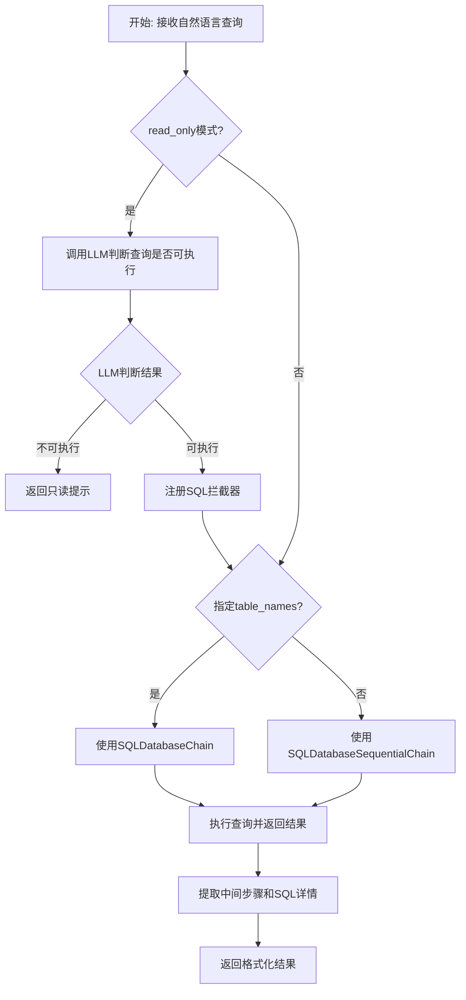
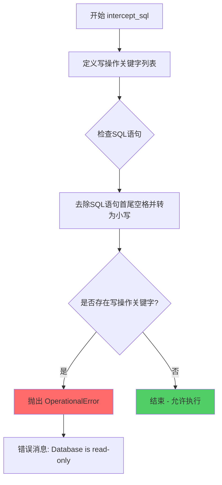
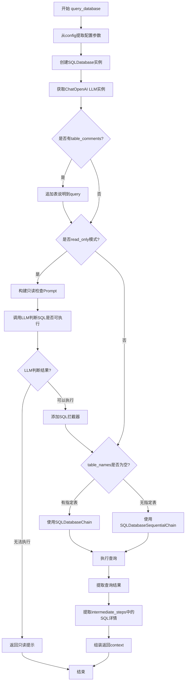
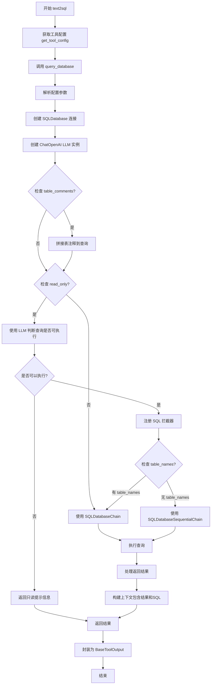
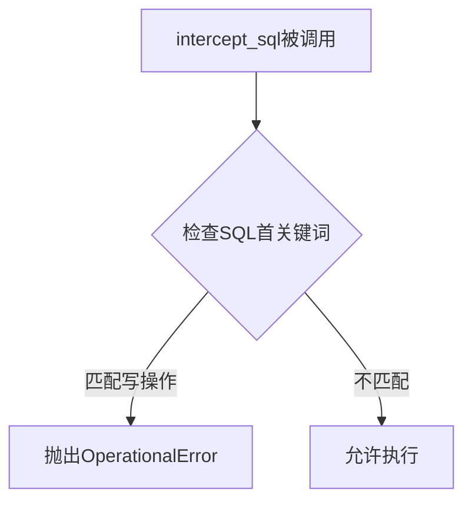
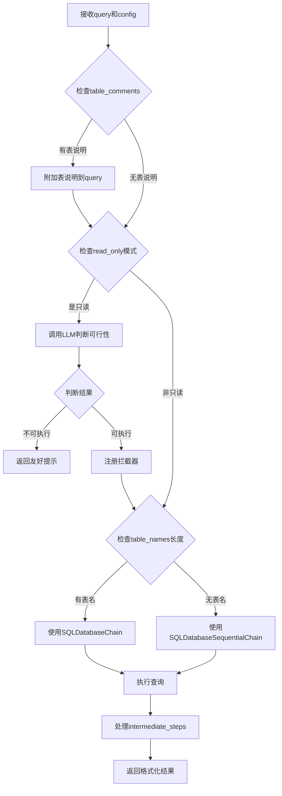

# `Langchain-Chatchat\libs\chatchat-server\chatchat\server\agent\tools_factory\text2sql.py` 详细设计文档

一个基于LangChain的文本到SQL转换工具，通过大语言模型将自然语言查询转换为SQL语句并在数据库中执行，支持只读模式保护、表名智能预测和查询过程细节返回。

## 整体流程



## 类结构

```
无类层次结构（基于函数的模块）
├── 全局函数
│   ├── intercept_sql (SQL拦截器)
│   ├── query_database (核心查询函数)
│   └── text2sql (工具入口函数)
└── 全局变量
    └── READ_ONLY_PROMPT_TEMPLATE
```

## 全局变量及字段


### `READ_ONLY_PROMPT_TEMPLATE`
    
用于判断SQL是否可以在只读模式下执行的提示模板，包含大模型的系统指令和用户问题格式占位符

类型：`str`
    


### `intercept_sql.write_operations`
    
SQL写操作关键字元组，用于在只读模式下拦截写操作，包含insert、update、delete、create、drop、alter、truncate、rename等关键字

类型：`tuple[str, ...]`
    
    

## 全局函数及方法


### `intercept_sql`

该函数是一个SQL拦截器，用于在数据库只读模式下阻止写操作。它通过检查SQL语句是否以特定的写操作关键字开头，如果是则抛出`OperationalError`异常，以确保数据库的安全性。

参数：

- `conn`：`sqlalchemy.engine.Connection`，数据库连接对象，由SQLAlchemy事件系统传入
- `cursor`：`sqlalchemy.engine.CursorResult`，数据库cursor对象，用于执行SQL
- `statement`：`str`，要执行的SQL语句，拦截器会检查此语句是否为写操作
- `parameters`：参数元组或字典，SQL语句的参数，由SQLAlchemy传入
- `context`：`dict`，执行上下文信息，包含连接属性等
- `executemany`：`bool`，标识是否为批量执行模式

返回值：无返回值，该函数通过抛出异常来阻止写操作执行

#### 流程图



#### 带注释源码

```python
def intercept_sql(conn, cursor, statement, parameters, context, executemany):
    """
    SQL拦截器函数，用于在数据库只读模式下阻止写操作
    
    参数:
        conn: SQLAlchemy数据库连接对象
        cursor: 数据库cursor对象
        statement: 要执行的SQL语句
        parameters: SQL语句的参数
        context: 执行上下文
        executemany: 是否为批量执行
    
    返回:
        无返回值，通过抛出异常阻止写操作
    """
    # 定义SQL写操作关键字列表，用于检测写操作
    write_operations = (
        "insert",   # 插入数据
        "update",   # 更新数据
        "delete",   # 删除数据
        "create",   # 创建表/数据库
        "drop",     # 删除表/数据库
        "alter",    # 修改表结构
        "truncate", # 清空表数据
        "rename",   # 重命名表
    )
    
    # 检查SQL语句是否以写操作关键字开头
    # 使用strip()去除首尾空格，lower()转为小写进行匹配
    if any(statement.strip().lower().startswith(op) for op in write_operations):
        # 如果检测到写操作，抛出OperationalError异常阻止执行
        raise OperationalError(
            "Database is read-only. Write operations are not allowed.",
            params=None,
            orig=None,
        )
```

#### 关键信息

- **使用场景**：该函数被注册为SQLAlchemy的事件监听器，在`query_database`函数中通过`event.listen(db._engine, "before_cursor_execute", intercept_sql)`挂载到数据库引擎上
- **异常类型**：使用SQLAlchemy的`OperationalError`异常，这是数据库操作错误的基类
- **设计目的**：提供双重保护机制，一方面通过LLM判断查询是否可以在只读模式下执行，另一方面通过拦截器从技术层面阻止写操作


### `query_database`

该函数是数据库对话功能的核心执行器，接收自然语言查询和配置参数，通过LangChain的SQLDatabaseChain或SQLDatabaseSequentialChain将自然语言转换为SQL并在数据库中执行，同时支持只读模式保护和多表场景下的智能表选择。

参数：

- `query`：`str`，用户输入的自然语言查询问题
- `config`：`dict`，包含模型配置和数据库连接信息的字典，具体包括model_name（模型名称）、top_k（返回结果数）、return_intermediate_steps（是否返回中间步骤）、sqlalchemy_connect_str（数据库连接字符串）、read_only（是否只读模式）、table_names（指定使用的表名列表）、table_comments（表的注释说明）

返回值：`str`，包含查询结果和执行的SQL语句详情的字符串

#### 流程图



#### 带注释源码

```python
def query_database(query: str, config: dict):
    """
    执行自然语言到SQL的转换与数据库查询
    
    参数:
        query: str - 用户输入的自然语言查询
        config: dict - 包含以下键的配置字典:
            - model_name: 模型名称
            - top_k: 返回结果数量限制
            - return_intermediate_steps: 是否返回中间步骤
            - sqlalchemy_connect_str: SQLAlchemy连接字符串
            - read_only: 是否只读模式
            - table_names: 使用的表名列表
            - table_comments: 表注释字典
    """
    # 从配置中提取模型相关参数
    model_name= config["model_name"]
    top_k = config["top_k"]
    return_intermediate_steps = config["return_intermediate_steps"]
    sqlalchemy_connect_str = config["sqlalchemy_connect_str"]
    read_only = config["read_only"]
    
    # 创建SQLDatabase实例，建立数据库连接
    db = SQLDatabase.from_uri(sqlalchemy_connect_str)

    # 动态导入ChatOpenAI，用于与大模型交互
    from chatchat.server.utils import get_ChatOpenAI

    # 初始化LLM实例，配置流式输出和本地包装
    llm = get_ChatOpenAI(
        model_name=model_name,
        temperature=0.1,
        streaming=True,
        local_wrap=True,
        verbose=True,
    )
    
    # 从配置中提取表相关信息
    table_names = config["table_names"]
    table_comments = config["table_comments"]
    result = None

    # 如果提供了表注释，追加到query中帮助LLM更好地选择表
    # 特别是在SQLDatabaseSequentialChain模式下，根据表名预测容易误判
    if table_comments:
        TABLE_COMMNET_PROMPT = (
            "\n\nI will provide some special notes for a few tables:\n\n"
        )
        # 将表注释格式化为 "表名:注释" 的形式
        table_comments_str = "\n".join([f"{k}:{v}" for k, v in table_comments.items()])
        query = query + TABLE_COMMNET_PROMPT + table_comments_str + "\n\n"

    # 只读模式处理：先让LLM判断查询是否能正常执行
    if read_only:
        # 构建只读检查的Prompt模板
        READ_ONLY_PROMPT = PromptTemplate(
            input_variables=["query"],
            template=READ_ONLY_PROMPT_TEMPLATE,
        )
        # 创建只读检查链
        read_only_chain = LLMChain(
            prompt=READ_ONLY_PROMPT,
            llm=llm,
        )
        # 调用LLM判断SQL是否能执行
        read_only_result = read_only_chain.invoke(query)
        
        # 如果LLM判断不能执行，返回友好提示
        if "SQL cannot be executed normally" in read_only_result["text"]:
            return "当前数据库为只读状态，无法满足您的需求！"

        # 添加SQL拦截器，防止LLM判断失误导致写操作执行
        # 拦截器会检查SQL语句是否包含写操作关键字
        event.listen(db._engine, "before_cursor_execute", intercept_sql)

    # 根据是否指定table_names选择使用哪种Chain
    # 如果指定了table_names，直接使用SQLDatabaseChain
    if len(table_names) > 0:
        db_chain = SQLDatabaseChain.from_llm(
            llm,
            db,
            verbose=True,
            top_k=top_k,
            return_intermediate_steps=return_intermediate_steps,
        )
        # 执行查询，传入query和要使用的表名
        result = db_chain.invoke({"query": query, "table_names_to_use": table_names})
    else:
        # 先预测使用哪些表，再执行查询
        # 避免将全量表结构传递给LLM导致token溢出
        db_chain = SQLDatabaseSequentialChain.from_llm(
            llm,
            db,
            verbose=True,
            top_k=top_k,
            return_intermediate_steps=return_intermediate_steps,
        )
        result = db_chain.invoke(query)

    # 组装返回结果，包含查询结果
    context = f"""查询结果:{result['result']}\n\n"""

    # 处理中间步骤，提取执行的SQL语句
    intermediate_steps = result["intermediate_steps"]
    # 保留最后两个步骤，因为前面可能包含示例数据
    if intermediate_steps:
        if len(intermediate_steps) > 2:
            # 获取倒数第二个步骤的输入（包含SQLQuery和Answer）
            sql_detail = intermediate_steps[-2:-1][0]["input"]
            # 提取SQLQuery和Answer之间的SQL语句
            sql_detail = sql_detail[
                sql_detail.find("SQLQuery:") + 9 : sql_detail.find("Answer:")
            ]
            context = context + "执行的sql:'" + sql_detail + "'\n\n"
    
    return context
```


### `text2sql`

该函数是一个数据库对话工具的入口函数，接收自然语言输入，通过大语言模型将自然语言转换为SQL语句并执行，最终返回数据库查询结果。函数内部调用`query_database`函数完成核心逻辑。

参数：

- `query`：`str`，用户输入的自然语言查询语句，用于描述想要与数据库交互的内容

返回值：`BaseToolOutput`，包含数据库执行结果及可能的中间步骤信息

#### 流程图



#### 带注释源码

```python
@regist_tool(title="数据库对话")
def text2sql(
    query: str = Field(
        description="No need for SQL statements,just input the natural language that you want to chat with database"
    ),
):
    """
    使用此工具与数据库对话。
    输入自然语言，工具会将其转换为SQL并在数据库中执行，然后返回执行结果。
    
    参数:
        query: str, 自然语言查询请求
        
    返回:
        BaseToolOutput: 包含数据库查询结果的工具输出对象
    """
    # 从配置中获取 text2sql 工具的配置参数
    # 包括模型名称、数据库连接字符串、只读模式、表名等配置
    tool_config = get_tool_config("text2sql")
    
    # 调用核心查询函数 query_database，传入自然语言查询和配置
    # 返回查询结果，并封装为 BaseToolOutput 对象
    return BaseToolOutput(query_database(query=query, config=tool_config))


def query_database(query: str, config: dict):
    """
    核心数据库查询函数，负责将自然语言转换为SQL并执行
    
    参数:
        query: str, 自然语言查询
        config: dict, 包含以下配置项:
            - model_name: 使用的语言模型名称
            - top_k: 返回结果数量限制
            - return_intermediate_steps: 是否返回中间步骤
            - sqlalchemy_connect_str: SQLAlchemy 连接字符串
            - read_only: 是否只读模式
            - table_names: 指定使用的表名列表
            - table_comments: 表注释信息字典
            
    返回:
        str: 格式化后的查询结果，包含执行结果和可能的SQL语句
    """
    # 从配置中提取各参数
    model_name = config["model_name"]
    top_k = config["top_k"]
    return_intermediate_steps = config["return_intermediate_steps"]
    sqlalchemy_connect_str = config["sqlalchemy_connect_str"]
    read_only = config["read_only"]
    
    # 创建 SQLDatabase 实例，用于数据库操作
    db = SQLDatabase.from_uri(sqlalchemy_connect_str)

    # 动态导入获取 ChatOpenAI 实例的函数
    from chatchat.server.utils import get_ChatOpenAI

    # 创建 ChatOpenAI 大语言模型实例
    # temperature=0.1: 控制生成随机性，较低值使输出更确定性
    # streaming=True: 启用流式输出
    # local_wrap=True: 本地包装模式
    # verbose=True: 启用详细日志
    llm = get_ChatOpenAI(
        model_name=model_name,
        temperature=0.1,
        streaming=True,
        local_wrap=True,
        verbose=True,
    )
    
    # 获取表名和表注释配置
    table_names = config["table_names"]
    table_comments = config["table_comments"]
    result = None

    # 如果配置了表注释，追加到查询中帮助大模型更好地判断使用哪些表
    # 这在 SQLDatabaseSequentialChain 模式下尤为重要，因为是根据表名做预测
    if table_comments:
        TABLE_COMMNET_PROMPT = (
            "\n\nI will provide some special notes for a few tables:\n\n"
        )
        table_comments_str = "\n".join([f"{k}:{v}" for k, v in table_comments.items()])
        query = query + TABLE_COMMNET_PROMPT + table_comments_str + "\n\n"

    # 只读模式处理
    if read_only:
        # 先让大模型判断只读模式是否能满足需求，避免后续执行报错
        READ_ONLY_PROMPT = PromptTemplate(
            input_variables=["query"],
            template=READ_ONLY_PROMPT_TEMPLATE,
        )
        read_only_chain = LLMChain(
            prompt=READ_ONLY_PROMPT,
            llm=llm,
        )
        # 调用只读检查链，判断查询是否能正常执行
        read_only_result = read_only_chain.invoke(query)
        
        # 如果大模型判断无法执行，返回友好提示
        if "SQL cannot be executed normally" in read_only_result["text"]:
            return "当前数据库为只读状态，无法满足您的需求！"

        # 注册 SQL 拦截器，防止大模型判断失误仍尝试执行写操作
        # 拦截器会检查 SQL 语句是否包含写操作关键字
        event.listen(db._engine, "before_cursor_execute", intercept_sql)

    # 根据是否指定 table_names 选择不同的链类型
    # 如果指定了 table_names，直接使用 SQLDatabaseChain，将特定表结构传递给大模型
    if len(table_names) > 0:
        db_chain = SQLDatabaseChain.from_llm(
            llm,
            db,
            verbose=True,
            top_k=top_k,
            return_intermediate_steps=return_intermediate_steps,
        )
        # 执行查询，传入查询语句和要使用的表名
        result = db_chain.invoke({"query": query, "table_names_to_use": table_names})
    else:
        # 如果未指定 table_names，使用 SQLDatabaseSequentialChain
        # 该链会先预测需要哪些表，然后再执行 SQL 查询
        # 优点是可以避免传递全量表结构导致 token 过长的问题
        db_chain = SQLDatabaseSequentialChain.from_llm(
            llm,
            db,
            verbose=True,
            top_k=top_k,
            return_intermediate_steps=return_intermediate_steps,
        )
        result = db_chain.invoke(query)

    # 格式化返回结果，包含查询结果
    context = f"""查询结果:{result['result']}\n\n"""

    # 处理中间步骤，包含 SQL 生成过程
    intermediate_steps = result["intermediate_steps"]
    
    # 如果存在中间步骤且长度大于2，保留最后两个元素
    # 因为前面的步骤可能包含示例数据，容易引起误解
    if intermediate_steps:
        if len(intermediate_steps) > 2:
            # 获取倒数第二个中间步骤的输入，即生成的 SQL
            sql_detail = intermediate_steps[-2:-1][0]["input"]
            # 截取从 SQLQuery: 到 Answer: 之间的内容
            sql_detail = sql_detail[
                sql_detail.find("SQLQuery:") + 9 : sql_detail.find("Answer:")
            ]
            # 将 SQL 语句添加到返回上下文中
            context = context + "执行的sql:'" + sql_detail + "'\n\n"
    
    return context


# SQL 拦截器函数，用于在只读模式下阻止写操作
def intercept_sql(conn, cursor, statement, parameters, context, executemany):
    """
    拦截 SQL 执行，检查是否为写操作
    
    参数:
        conn: 数据库连接
        cursor: 数据库游标
        statement: 要执行的 SQL 语句
        parameters: SQL 参数
        context: 执行上下文
        executemany: 是否批量执行
        
    抛出:
        OperationalError: 如果检测到写操作关键字
    """
    # 定义写操作关键字列表
    write_operations = (
        "insert",
        "update",
        "delete",
        "create",
        "drop",
        "alter",
        "truncate",
        "rename",
    )
    # 检查 SQL 语句是否以写操作关键字开头
    if any(statement.strip().lower().startswith(op) for op in write_operations):
        raise OperationalError(
            "Database is read-only. Write operations are not allowed.",
            params=None,
            orig=None,
        )
```

## 关键组件


### 一段话描述

该代码实现了一个基于LangChain的Text2SQL工具，允许用户使用自然语言与数据库进行交互，工具自动将自然语言转换为SQL语句并执行，同时支持只读模式保护、表注释辅助和表名自动预测等高级功能。

### 文件的整体运行流程

1. 用户通过`text2sql`工具输入自然语言查询
2. 工具调用`query_database`函数执行查询逻辑
3. 如果配置了`table_comments`，则将表说明附加到查询中
4. 如果启用`read_only`模式，先调用LLM判断查询是否可以在只读模式下执行，同时注册SQL拦截器阻止写操作
5. 根据是否指定`table_names`选择使用`SQLDatabaseChain`或`SQLDatabaseSequentialChain`
6. 执行查询并处理中间步骤，提取SQL语句
7. 返回格式化结果

### 全局变量和全局函数详细信息

#### 全局变量

| 名称 | 类型 | 描述 |
|------|------|------|
| `READ_ONLY_PROMPT_TEMPLATE` | str | 只读模式判断的提示模板，用于指导LLM判断SQL是否可在只读模式下执行 |

#### 全局函数

**intercept_sql**

| 属性 | 详情 |
|------|------|
| 参数名称 | conn, cursor, statement, parameters, context, executemany |
| 参数类型 | 连接对象, 游标对象, str, dict, 上下文对象, bool |
| 参数描述 | SQLAlchemy事件监听器参数，用于拦截SQL执行 |
| 返回值类型 | None |
| 返回值描述 | 无返回值，若检测到写操作则抛出OperationalError异常 |

**mermaid流程图**



**带注释源码**

```python
# 定义一个拦截器函数来检查SQL语句，以支持read-only,可修改下面的write_operations，以匹配你使用的数据库写操作关键字
def intercept_sql(conn, cursor, statement, parameters, context, executemany):
    # List of SQL keywords that indicate a write operation
    write_operations = (
        "insert",
        "update",
        "delete",
        "create",
        "drop",
        "alter",
        "truncate",
        "rename",
    )
    # Check if the statement starts with any of the write operation keywords
    if any(statement.strip().lower().startswith(op) for op in write_operations):
        raise OperationalError(
            "Database is read-only. Write operations are not allowed.",
            params=None,
            orig=None,
        )
```

**query_database**

| 属性 | 详情 |
|------|------|
| 参数名称 | query, config |
| 参数类型 | str, dict |
| 参数描述 | query为自然语言查询语句，config包含模型名、top_k、连接字符串等配置 |
| 返回值类型 | str |
| 返回值描述 | 返回格式化后的查询结果，包含SQL执行结果和执行的SQL语句 |

**mermaid流程图**



**带注释源码**

```python
def query_database(query: str, config: dict):
    model_name= config["model_name"]
    top_k = config["top_k"]
    return_intermediate_steps = config["return_intermediate_steps"]
    sqlalchemy_connect_str = config["sqlalchemy_connect_str"]
    read_only = config["read_only"]
    db = SQLDatabase.from_uri(sqlalchemy_connect_str)

    from chatchat.server.utils import get_ChatOpenAI

    llm = get_ChatOpenAI(
        model_name=model_name,
        temperature=0.1,
        streaming=True,
        local_wrap=True,
        verbose=True,
    )
    table_names = config["table_names"]
    table_comments = config["table_comments"]
    result = None

    # 如果发现大模型判断用什么表出现问题，尝试给langchain提供额外的表说明，辅助大模型更好的判断应该使用哪些表，尤其是SQLDatabaseSequentialChain模式下,是根据表名做的预测，很容易误判
    # 由于langchain固定了输入参数，所以只能通过query传递额外的表说明
    if table_comments:
        TABLE_COMMNET_PROMPT = (
            "\n\nI will provide some special notes for a few tables:\n\n"
        )
        table_comments_str = "\n".join([f"{k}:{v}" for k, v in table_comments.items()])
        query = query + TABLE_COMMNET_PROMPT + table_comments_str + "\n\n"

    if read_only:
        # 在read_only下，先让大模型判断只读模式是否能满足需求，避免后续执行过程报错，返回友好提示。
        READ_ONLY_PROMPT = PromptTemplate(
            input_variables=["query"],
            template=READ_ONLY_PROMPT_TEMPLATE,
        )
        read_only_chain = LLMChain(
            prompt=READ_ONLY_PROMPT,
            llm=llm,
        )
        read_only_result = read_only_chain.invoke(query)
        if "SQL cannot be executed normally" in read_only_result["text"]:
            return "当前数据库为只读状态，无法满足您的需求！"

        # 当然大模型不能保证完全判断准确，为防止大模型判断有误，再从拦截器层面拒绝写操作
        event.listen(db._engine, "before_cursor_execute", intercept_sql)

    # 如果不指定table_names，优先走SQLDatabaseSequentialChain，这个链会先预测需要哪些表，然后再将相关表输入SQLDatabaseChain
    # 这是因为如果不指定table_names，直接走SQLDatabaseChain，Langchain会将全量表结构传递给大模型，可能会因token太长从而引发错误，也浪费资源
    # 如果指定了table_names，直接走SQLDatabaseChain，将特定表结构传递给大模型进行判断
    if len(table_names) > 0:
        db_chain = SQLDatabaseChain.from_llm(
            llm,
            db,
            verbose=True,
            top_k=top_k,
            return_intermediate_steps=return_intermediate_steps,
        )
        result = db_chain.invoke({"query": query, "table_names_to_use": table_names})
    else:
        # 先预测会使用哪些表，然后再将问题和预测的表给大模型
        db_chain = SQLDatabaseSequentialChain.from_llm(
            llm,
            db,
            verbose=True,
            top_k=top_k,
            return_intermediate_steps=return_intermediate_steps,
        )
        result = db_chain.invoke(query)

    context = f"""查询结果:{result['result']}\n\n"""

    intermediate_steps = result["intermediate_steps"]
    # 如果存在intermediate_steps，且这个数组的长度大于2，则保留最后两个元素，因为前面几个步骤存在示例数据，容易引起误解
    if intermediate_steps:
        if len(intermediate_steps) > 2:
            sql_detail = intermediate_steps[-2:-1][0]["input"]
            # sql_detail截取从SQLQuery到Answer:之间的内容
            sql_detail = sql_detail[
                sql_detail.find("SQLQuery:") + 9 : sql_detail.find("Answer:")
            ]
            context = context + "执行的sql:'" + sql_detail + "'\n\n"
    return context
```

**text2sql**

| 属性 | 详情 |
|------|------|
| 参数名称 | query |
| 参数类型 | str |
| 参数描述 | 自然语言查询，不需要SQL语句，只需输入想与数据库交互的自然语言 |
| 返回值类型 | BaseToolOutput |
| 返回值描述 | 返回工具执行结果，包含数据库查询结果 |

**带注释源码**

```python
@regist_tool(title="数据库对话")
def text2sql(
    query: str = Field(
        description="No need for SQL statements,just input the natural language that you want to chat with database"
    ),
):
    """Use this tool to chat with  database,Input natural language, then it will convert it into SQL and execute it in the database, then return the execution result."""
    tool_config = get_tool_config("text2sql")
    return BaseToolOutput(query_database(query=query, config=tool_config))
```

### 关键组件信息

#### 1. 只读模式拦截器 (intercept_sql)

通过SQLAlchemy事件监听机制，在SQL执行前拦截并检查是否为写操作，若为写操作则抛出OperationalError异常，保护数据库免受意外修改。

#### 2. 惰性加载与表名预测 (SQLDatabaseSequentialChain vs SQLDatabaseChain)

当未指定table_names时使用SQLDatabaseSequentialChain，该链会先预测需要哪些表，避免将全量表结构传递给LLM导致token超限或资源浪费。

#### 3. 表注释辅助 (table_comments)

通过在query中附加表注释信息，帮助LLM更准确地判断应该使用哪些表，尤其在SQLDatabaseSequentialChain模式下表名预测容易误判时提供辅助。

#### 4. 只读模式双重保护

结合LLM判断和SQL拦截器双重机制：先用LLM判断查询是否可在只读模式下执行，再用拦截器从技术层面阻止写操作。

### 潜在的技术债务或优化空间

1. **异常处理不完善**：拦截器中`OperationalError`的`orig`参数为`None`，可能导致错误信息不够详细；缺乏对其他数据库异常（如连接超时、权限问题）的处理。

2. **硬编码的写操作关键字**：`write_operations`元组中的关键字是硬编码的，无法灵活适配不同数据库的SQL方言，且仅检查语句开头可能漏掉复杂SQL语句中的写操作。

3. **中间步骤解析逻辑脆弱**：`sql_detail`的提取依赖特定的字符串查找和切片操作，如果LLM输出格式变化会导致解析失败。

4. **动态导入问题**：`get_ChatOpenAI`在函数内部导入，这种模式不够规范，且每次调用都会重新导入。

5. **配置参数未做类型校验**：`config`字典直接访问键名，缺乏默认值处理和类型校验，配置缺失时会导致KeyError。

6. **性能考虑**：每次调用都创建新的LLM实例和数据库连接，缺乏连接池复用和LLM实例缓存。

7. **日志记录缺失**：代码中使用了`verbose=True`但缺乏显式的日志记录，调试和问题追踪困难。

### 其它项目

#### 设计目标与约束

- **目标**：让用户无需编写SQL即可通过自然语言查询数据库
- **约束**：依赖LangChain生态的SQLDatabaseChain系列实现

#### 错误处理与异常设计

- LLM判断可能不完全准确，因此采用LLM判断+拦截器双重保护机制
- 只读模式下返回友好提示而非直接报错

#### 数据流与状态机

```
用户输入 → query_database 
    → 判断table_comments → 附加表说明
    → 判断read_only模式 → LLM判断/注册拦截器
    → 判断table_names → 选择Chain类型
    → 执行SQL → 处理结果 → 返回
```

#### 外部依赖与接口契约

- 依赖`langchain`系列包：LLMChain, SQLDatabaseChain, SQLDatabaseSequentialChain
- 依赖`SQLAlchemy`：数据库连接和事件监听
- 依赖`chatchat.server.utils`：获取LLM实例和工具配置
- 依赖`chatchat.server.pydantic_v1`：Field定义


## 问题及建议


### 已知问题

-   **拦截器实现缺陷**：`intercept_sql` 函数中 `OperationalError` 的构造方式不正确，`orig=None` 应该传递原始异常对象，否则可能导致异常信息不完整或不准确
-   **硬编码的写操作关键字**：`write_operations` 元组中的关键字是硬编码的，可能不够全面（如缺少 `replace`、`merge` 等），且仅检查语句开头，可能遗漏 `SELECT ... INTO OUTFILE` 等操作
-   **重复导入模块**：代码中在第6行和第23行分别导入了 `chatchat.server.utils`，存在冗余导入
-   **字符串截取逻辑脆弱**：中间步骤的处理使用字符串查找和切片（`sql_detail.find("SQLQuery:") + 9 : sql_detail.find("Answer:")`），如果格式变化会导致索引错误或返回空字符串
-   **缺少异常捕获**：整个 `query_database` 函数没有 try-except 包装，数据库连接失败、LLM 调用失败等情况会导致未处理的异常直接抛出
-   **重复创建实例**：每次调用 `query_database` 都会创建新的 LLM 实例和 SQLDatabase 连接，没有复用机制，影响性能
-   **配置依赖隐式**：`get_tool_config("text2sql")` 的调用没有验证返回的 config 是否包含必要字段，可能导致运行时 KeyError

### 优化建议

-   **完善异常处理**：为 `query_database` 函数添加完整的 try-except 块，捕获数据库连接异常、SQL执行异常、LLM调用异常等，并返回友好的错误信息
-   **优化写操作检测**：扩展 `write_operations` 列表，使用正则表达式进行更全面的匹配，并考虑对 `SELECT INTO OUTFILE` 等危险读操作进行限制
-   **修复拦截器实现**：正确构造 `OperationalError`，传递原始异常信息和参数
-   **提取配置验证**：在函数开头添加配置字段验证，确保 `model_name`、`top_k`、`sqlalchemy_connect_str` 等必填字段存在
-   **优化中间步骤解析**：使用正则表达式或 LangChain 提供的解析方法来提取 SQL，避免脆弱的字符串截取
-   **添加资源管理**：考虑使用类封装或在模块级别缓存 LLM 和数据库连接，实现连接池复用
-   **添加日志记录**：使用 logging 模块记录查询日志、错误信息，便于问题排查和审计

## 其它


### 设计目标与约束

**设计目标**：实现一个基于大语言模型的自然语言转SQL查询工具，支持对MySQL数据库的智能问答，用户无需编写SQL语句即可通过自然语言与数据库交互，同时提供只读模式保护数据库安全。

**设计约束**：
- 仅支持MySQL数据库
- 在只读模式下，通过大模型预判和SQL拦截器双重保护防止写操作
- 大模型选择表的方式受限于LangChain固定输入参数，需通过query传递额外的表说明
- token限制：全量表结构可能导致token过长引发错误，需指定table_names或使用SQLDatabaseSequentialChain

### 错误处理与异常设计

**OperationalError**：当检测到写操作时抛出，提示"Database is read-only. Write operations are not allowed."

**只读模式判断**：大模型可能判断不准确，拦截器作为兜底保护

**数据库连接错误**：SQLDatabase.from_uri可能抛出连接异常，未显式捕获

**LLM调用异常**：get_ChatOpenAI和chain.invoke可能抛出异常，未显式捕获

**结果解析异常**：intermediate_steps解析时假设固定格式，可能因格式变化导致IndexError或字符串截取错误

### 数据流与状态机

**数据流**：
1. 用户输入自然语言query
2. 检查配置中的read_only标志
3. 如为只读模式，先调用LLM判断是否可执行
4. 如不可执行，返回友好提示
5. 如可执行或非只读模式，注册SQL拦截器（只读模式）
6. 根据table_names是否为空选择SQLDatabaseChain或SQLDatabaseSequentialChain
7. 执行SQL并返回结果
8. 解析intermediate_steps获取执行的SQL语句
9. 组装最终返回context

**状态机**：
- READY：初始化完成
- READ_ONLY_CHECK：只读模式检查中
- EXECUTING：SQL执行中
- COMPLETED：执行完成返回结果
- ERROR：执行异常

### 外部依赖与接口契约

**LangChain组件**：
- LLMChain：用于只读模式判断
- SQLDatabaseChain/SQLDatabaseSequentialChain：核心SQL生成与执行
- SQLDatabase：数据库连接封装

**SQLAlchemy**：
- event.listen：注册SQL拦截器
- OperationalError：写操作拦截异常

**项目内部依赖**：
- get_tool_config：获取工具配置
- get_ChatOpenAI：获取LLM实例
- regist_tool：工具注册装饰器
- BaseToolOutput：工具输出封装

**接口契约**：
- text2sql(query: str) -> BaseToolOutput
- query_database(query: str, config: dict) -> str

### 安全性考虑

**SQL注入防护**：依赖LangChain的SQLDatabaseChain内部防护，但自定义拦截器仅做关键字匹配，不够完善

**只读保护**：双重保护机制（大模型判断+拦截器），但拦截器仅检查语句开头，注释内SQL可能被绕过

**凭证安全**：sqlalchemy_connect_str需安全存储，避免硬编码

**LLM输出信任**：只读判断依赖LLM，存在被诱导绕过风险

### 性能优化建议

**表说明缓存**：table_comments每次请求都拼接，可考虑缓存

**LLM实例复用**：get_ChatOpenAI每次调用query_database都创建新实例，应复用

**数据库连接池**：SQLDatabase默认使用连接池，但未显式配置pool_size

**结果缓存**：相同query可考虑缓存结果

**异步处理**：当前为同步调用，可考虑改为async提高并发

### 配置管理

**必需配置项**：
- model_name：LLM模型名称
- sqlalchemy_connect_str：数据库连接字符串
- top_k：返回结果数量
- return_intermediate_steps：是否返回中间步骤
- read_only：是否只读模式

**可选配置项**：
- table_names：指定使用的表列表
- table_comments：表说明字典

### 并发与线程安全

**全局事件监听**：event.listen在只读模式下注册，可能影响其他请求

**LLM实例**：未使用线程本地存储，可能存在状态共享

**建议**：使用request级别的db实例而非全局，或使用线程本地存储

### 日志与监控

**verbose=True**：LangChain组件开启详细日志

**缺失项**：
- 无结构化日志记录
- 无请求耗时统计
- 无SQL执行监控
- 无异常告警

### 部署与运维注意事项

**环境依赖**：
- MySQL数据库
- LangChain相关包
- SQLAlchemy
- OpenAI兼容API

**权限要求**：
- 数据库只读用户（read_only=true）
- 数据库写用户（read_only=false）

**监控指标**：
- SQL执行成功率
- 只读模式拦截次数
- LLM调用延迟
- Token消耗统计

    