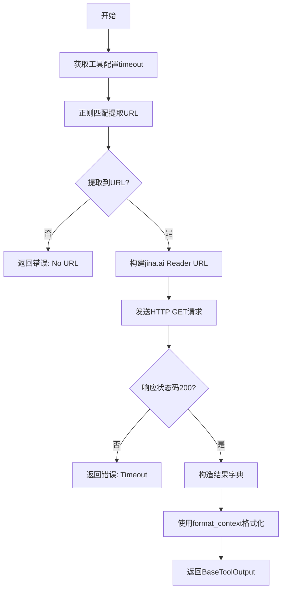
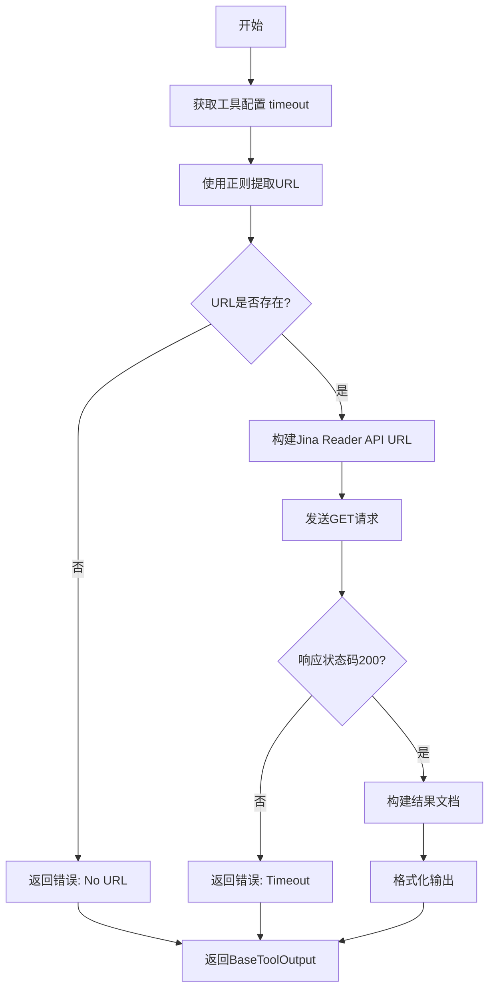
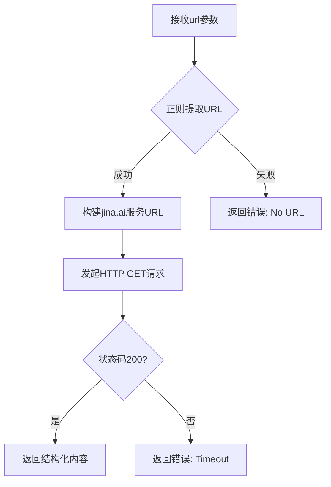

# `Langchain-Chatchat\libs\chatchat-server\chatchat\server\agent\tools_factory\url_reader.py` 详细设计文档

这是一个URL内容读取工具，通过集成jina-ai的reader服务，将任意URL的网页内容转换为LLM易于理解的文本形式，支持从包含URL的文本中自动提取目标链接，并返回结构化的内容摘要。

## 整体流程



## 类结构

```
url_reader (工具模块)
└── url_reader (工具函数)
```

## 全局变量及字段


### `url_pattern`
    
正则表达式，用于从文本中提取URL链接

类型：`re.Pattern`
    


### `reader_url`
    
jina.ai reader服务的API地址模板

类型：`str`
    


    

## 全局函数及方法


### `url_reader`

该函数是一个工具函数，通过调用 jina-ai 的 Reader API 将任意 URL 的网页内容转换为 LLM 易于理解的纯文本格式，支持从包含 URL 的文本中提取实际链接，并返回结构化的文档内容。

参数：

-  `url`：`str`，需要处理的 URL，可以是纯 URL 或包含 URL 的文本片段

返回值：`BaseToolOutput`，包含处理结果的结构化输出，若成功则返回提取的文本内容及元数据，若失败则返回错误信息

#### 流程图



#### 带注释源码

```python
"""
通过jana-ai/reader项目，将url内容处理为llm易于理解的文本形式
"""
import requests  # HTTP请求库
import re  # 正则表达式模块

# 从内部模块导入Pydantic Field用于参数定义
from chatchat.server.pydantic_v1 import Field
# 获取工具配置的辅助函数
from chatchat.server.utils import get_tool_config
# 格式化上下文的工具函数
from chatchat.server.agent.tools_factory.tools_registry import format_context
# 工具注册装饰器
from .tools_registry import regist_tool
# 基础工具输出类
from langchain_chatchat.agent_toolkits.all_tools.tool import BaseToolOutput


@regist_tool(title="URL内容阅读")  # 注册为工具，标题为"URL内容阅读"
def url_reader(
        url: str = Field(
            # 字段描述：需要处理的URL，以便使其网页内容更易于阅读
            description="The URL to be processed, so that its web content can be made more clear to read. Then provide a detailed description of the content in about 500 words. As structured as possible. ONLY THE LINK SHOULD BE PASSED IN."),
):
    """使用此工具获取URL的清晰内容"""
    
    # 从配置中获取url_reader工具的设置，包括超时时间
    tool_config = get_tool_config("url_reader")
    timeout = tool_config.get("timeout")

    # 定义URL匹配正则表达式：匹配http或https开头的URL
    # 包含字母、数字、./?&=_%#-等合法URL字符
    url_pattern = r'http[s]?://[a-zA-Z0-9./?&=_%#-]+'
    # 在输入文本中搜索URL
    match = re.search(url_pattern, url)
    # 如果找到则使用匹配到的URL，否则设为None
    url = match.group(0) if match else None

    # 如果没有找到有效URL，返回错误信息
    if url is None:
        return BaseToolOutput({"error": "No URL"})

    # 构建Jina Reader API的请求URL
    # Jina AI的Reader服务可以将网页转换为纯文本
    reader_url = "https://r.jina.ai/{url}".format(url=url)

    # 发送GET请求到Jina Reader API，设置超时时间
    response = requests.get(reader_url, timeout=timeout)

    # 检查响应状态码
    if response.status_code == 200:
        # 请求成功，返回结构化的文档内容
        # 包含原始文本和元数据（来源URL和空ID）
        return BaseToolOutput(
            {"result": response.text, 
             "docs": [{"page_content": response.text, 
                       "metadata": {'source': url, 'id': ''}}]},
            format=format_context)  # 使用format_context格式化输出
    else:
        # 请求失败，返回超时错误
        return BaseToolOutput({"error": "Timeout"})
```

---

## 补充信息

### 关键组件信息

| 组件名称 | 描述 |
|---------|------|
| `requests` | Python HTTP 客户端库，用于发送 GET 请求获取网页内容 |
| `re` | 正则表达式模块，用于从文本中提取 URL |
| `BaseToolOutput` | 基础工具输出类，封装工具返回的结构化数据 |
| `regist_tool` | 装饰器函数，将函数注册为系统工具 |
| `get_tool_config` | 工具配置获取函数，从配置文件中读取工具参数 |
| `format_context` | 上下文格式化函数，规范化输出格式 |
| Jina Reader API (`r.jina.ai`) | 外部依赖服务，将网页转换为 LLM 友好的纯文本 |

### 潜在的技术债务或优化空间

1. **错误处理不完善**：仅区分了"无URL"和"超时"两种错误状态，缺少对网络异常、URL无效、响应格式错误等情况的处理
2. **超时配置依赖外部**：若配置文件中未设置 timeout，可能导致 `None` 值传入请求，存在潜在风险
3. **正则表达式局限性**：当前正则可能无法匹配所有合法URL格式（如包含中文或特殊字符的URL）
4. **缺乏重试机制**：请求失败时直接返回错误，未实现重试逻辑
5. **硬编码 API 端点**：Jina Reader API 地址直接硬编码，缺乏灵活性
6. **文档长度限制**：Field 描述中提到"约500字"，但实际未实现此限制逻辑

### 设计目标与约束

- **设计目标**：将任意 URL 的网页内容简化为 LLM 可直接处理的纯文本，消除 HTML 噪音
- **输入约束**：接受纯 URL 或包含 URL 的自然语言文本
- **输出约束**：返回结构化文本，包含页面内容和来源元数据

### 错误处理与异常设计

| 错误场景 | 处理方式 |
|---------|---------|
| 输入中无有效 URL | 返回 `{"error": "No URL"}` |
| API 请求超时或失败 | 返回 `{"error": "Timeout"}` |
| 配置缺失 timeout | requests.get 可能使用默认超时或 None |

### 外部依赖与接口契约

- **Jina Reader API**：第三方服务，接口为 `https://r.jina.ai/{url}`，返回纯文本内容
- **配置依赖**：需要 `tool_config` 中包含 `url_reader.timeout` 配置项

## 关键组件


### URL内容阅读工具

这是一个基于jina-ai_reader服务的URL内容读取工具，通过正则表达式从输入文本中提取URL，然后调用jina.ai的r.jina.ai服务将网页内容转换为LLM易于理解的文本形式，最终返回结构化的文档内容。

### 整体运行流程

1. 工具函数`url_reader`接收URL参数（可能包含在句子中）
2. 使用正则表达式`http[s]?://[a-zA-Z0-9./?&=_%#-]+`从输入文本中提取URL
3. 如果未提取到URL，返回错误信息"No URL"
4. 构建jina.ai读取服务URL：`https://r.jina.ai/{url}`
5. 发起HTTP GET请求，设置超时时间
6. 请求成功时返回结构化内容，失败时返回超时错误

### 关键组件信息

#### url_reader函数

**描述**: 主工具函数，用于读取URL内容并转换为LLM友好格式

**参数**:
- url: str - 输入的URL或包含URL的文本

**返回值**:
- BaseToolOutput对象，包含result和docs字段

**mermaid流程图**:



**源码**:
```python
@regist_tool(title="URL内容阅读")
def url_reader(
        url: str = Field(
            description="The URL to be processed, so that its web content can be made more clear to read. Then provide a detailed description of the content in about 500 words. As structured as possible. ONLY THE LINK SHOULD BE PASSED IN."),
):
    """Use this tool to get the clear content of a URL."""

    tool_config = get_tool_config("url_reader")
    timeout = tool_config.get("timeout")

    # 提取url文本中的网页链接部分。url文本可能是一句话
    url_pattern = r'http[s]?://[a-zA-Z0-9./?&=_%#-]+'
    match = re.search(url_pattern, url)
    url = match.group(0) if match else None

    if url is None:
        return BaseToolOutput({"error": "No URL"})

    reader_url = "https://r.jina.ai/{url}".format(url=url)

    response = requests.get(reader_url, timeout=timeout)

    if response.status_code == 200:
        return BaseToolOutput(
            {"result": response.text, "docs": [{"page_content": response.text, "metadata": {'source': url, 'id': ''}}]},
            format=format_context)
    else:
        return BaseToolOutput({"error": "Timeout"})
```

#### URL提取逻辑

**描述**: 使用正则表达式从文本中提取URL链接

**正则表达式**: `r'http[s]?://[a-zA-Z0-9./?&=_%#-]+'`

**潜在问题**:
- 正则表达式可能无法匹配所有合法URL格式（如包含空格编码的URL）
- 仅返回第一个匹配的URL，可能遗漏文本中的多个URL

#### BaseToolOutput封装

**描述**: 工具输出的标准封装类

**返回格式**:
- 成功: `{"result": response.text, "docs": [{"page_content": response.text, "metadata": {'source': url, 'id': ''}}]}`
- 失败: `{"error": "No URL"}` 或 `{"error": "Timeout"}`

### 潜在技术债务与优化空间

1. **错误处理不完善**: 仅区分200状态码，其他错误码统一返回Timeout错误
2. **URL验证缺失**: 未验证提取的URL是否有效或可访问
3. **正则表达式局限**: 当前正则无法处理所有URL变体（如含Unicode字符的URL）
4. **超时配置依赖**: 依赖外部配置获取timeout值，若配置缺失可能返回None
5. **日志缺失**: 缺少请求日志和错误日志记录
6. **多URL支持**: 仅处理单个URL，未支持批量处理
7. **重试机制缺失**: 请求失败时无重试逻辑
8. **Content-Type处理**: 未检查响应内容类型，可能处理非文本内容

### 其它项目

#### 设计目标与约束
- 目标：将任意URL网页内容转换为LLM可读的简洁文本（约500字）
- 约束：依赖外部jina.ai服务，不可控因素为服务可用性

#### 错误处理与异常设计
- URL提取失败：返回`{"error": "No URL"}`
- HTTP请求超时：返回`{"error": "Timeout"}`（注意：此错误消息不准确，非超时情况也会返回）
- 异常捕获：代码中未显式捕获requests异常

#### 数据流与状态机
- 输入：字符串（URL或包含URL的文本）
- 处理：正则提取 → HTTP请求 → 响应解析
- 输出：结构化JSON（result + docs数组）

#### 外部依赖与接口契约
- 依赖服务：jina.ai的r.jina.ai Reader API
- 依赖库：requests, re, langchain_chatchat, chatchat.server模块
- 配置项：通过get_tool_config获取timeout参数


## 问题及建议


### 已知问题

-   **错误信息不准确**：当HTTP响应状态码非200时，统一返回`{"error": "Timeout"}`，无法区分真正的超时、404、500等不同错误类型
-   **异常处理缺失**：未捕获`requests.get()`可能抛出的网络异常（如DNS解析失败、连接拒绝等），可能导致程序崩溃
-   **超时配置风险**：`get_tool_config("url_reader").get("timeout")`可能返回`None`，导致`requests.get()`无限期等待
-   **URL安全验证缺失**：直接将用户输入的URL拼接到`https://r.jina.ai/{url}`中，未验证URL合法性，存在潜在SSRF风险
-   **正则表达式边界情况**：正则`r'http[s]?://[a-zA-Z0-9./?&=_%#-]+'`可能无法匹配所有合法URL格式（如含中文域名、IPv6地址等）
-   **返回内容无限制**：未对`response.text`长度进行限制，可能返回过大内容导致内存问题
-   **正则匹配失败处理**：当正则未匹配到URL时，虽然返回错误，但原始输入`url`参数未被清理或规范化

### 优化建议

-   增加`try-except`捕获`requests.RequestException`及其子类异常，返回具体错误信息
-   为`timeout`设置默认值（如30秒），避免`None`导致的无限等待
-   使用`python-dotenv`或配置中心统一管理超时配置
-   对输入URL进行格式验证，考虑使用`urllib.parse.urlparse`校验scheme和netwalk
-   添加响应内容长度限制，超出时返回截断提示或分页处理
-   细化错误返回值：区分“无URL”、“无效URL”、“网络错误”、“请求超时”、“远程服务错误”等
-   考虑添加简单缓存机制，避免重复请求相同URL
-   使用f-string替代`.format()`方式拼接字符串，提升可读性和性能

## 其它


### 设计目标与约束

该工具的核心设计目标是提供一个可靠、高效的URL内容提取服务，将任意网页内容转换为结构化文本供LLM使用。设计约束包括：1) 超时时间可配置，默认值需平衡响应速度与成功率；2) 仅支持HTTP/HTTPS协议；3) 输入必须是有效URL格式；4) 依赖外部jina.ai服务，需要网络连通性。

### 错误处理与异常设计

该工具采用统一的错误处理模式，通过BaseToolOutput返回错误信息。主要错误场景包括：1) 输入中无有效URL时返回"No URL"错误；2) HTTP请求超时时返回"Timeout"错误；3) HTTP状态码非200时视为请求失败。当前实现中异常处理较为简单，缺少网络连接失败、SSL错误、URL解析异常等情况的细分处理。建议增加更详细的错误码和错误消息，便于上层调用者进行针对性处理。

### 数据流与状态机

数据流处理流程如下：1) 接收原始输入字符串；2) 使用正则表达式提取URL；3) 验证URL提取结果，若失败则返回错误；4) 构建jina.ai reader服务URL；5) 发起HTTP GET请求；6) 接收响应并检查状态码；7) 成功时返回结构化内容，失败时返回错误。状态机包含：初始状态 -> URL提取状态 -> 请求发送状态 -> 响应处理状态 -> 完成状态，其中任何步骤失败都转入错误处理分支。

### 外部依赖与接口契约

该工具依赖以下外部组件：1) jina.ai的r.jina.ai服务，作为URL内容提取的外部API；2) requests库，用于HTTP请求；3) chatchat.server.pydantic_v1的Field，用于参数定义；4) chatchat.server.utils.get_tool_config，用于获取工具配置；5) chatchat.server.agent.tools_factory.tools_registry，用于工具注册；6) langchain_chatchat.agent_toolkits.all_tools.tool.BaseToolOutput，用于标准化输出格式；7) re模块，用于URL正则匹配。接口契约要求：输入url参数为字符串类型，输出为BaseToolOutput对象，包含result和docs字段或error字段。

### 安全性考虑

当前实现存在以下安全风险：1) 直接将用户输入的URL拼接到jina.ai服务URL中，未进行充分的URL验证和清洗；2) 缺少对响应内容的大小限制，可能导致大文件耗尽内存；3) 未对返回的HTML内容进行脱敏或过滤，可能包含敏感信息；4) 超时配置依赖外部配置文件，若配置不当可能导致服务不稳定。建议增加输入验证、响应大小限制、内容安全过滤等机制。

### 性能考虑

性能优化空间包括：1) 当前使用同步requests.get，在高并发场景下可能阻塞线程池，建议考虑使用aiohttp实现异步请求；2) 缺少请求重试机制，外部服务暂时不可用时会直接失败；3) 未实现响应缓存，重复请求相同URL会重复调用外部服务；4) 正则表达式匹配可考虑预编译以提升性能。建议添加重试机制和基础缓存策略。

### 配置管理

该工具通过get_tool_config("url_reader")获取配置，目前仅使用timeout参数。配置管理建议：1) 明确配置项的默认值和取值范围；2) 添加配置校验逻辑；3) 考虑增加重试次数、用户Agent、连接池大小等配置项；4) 配置变更时支持热加载。配置文件通常位于chatchat的配置文件结构中，具体路径需参考项目配置规范。

### 日志与监控

当前实现缺少日志记录功能，建议增加：1) URL提取过程的调试日志；2) HTTP请求的详细日志（包括URL、状态码、耗时）；3) 错误场景的警告日志；4) 关键性能指标（如平均响应时间、成功率）的监控埋点。日志级别建议：提取失败时使用WARNING，HTTP请求异常时使用ERROR，成功请求使用INFO。

### 测试策略

建议补充以下测试用例：1) 单元测试：URL正则提取的各种边界情况（无URL、多个URL、普通文本中的URL等）；2) 集成测试：模拟jina.ai服务返回不同状态码的场景；3) 异常测试：网络超时、连接拒绝、SSL错误等；4) 性能测试：并发请求下的响应时间和资源占用；5) 端到端测试：使用真实URL验证完整流程。测试时应考虑使用mock服务器避免外部依赖。

### 兼容性考虑

兼容性方面需关注：1) requests库的版本兼容性；2) Python版本兼容性（建议支持Python 3.8+）；3) jina.ai服务API的稳定性，当前使用r.jina.ai/{url}格式，若API变更需及时更新；4) 与chatchat项目其他组件的版本兼容；5) 返回格式的兼容性，当前返回的docs结构需与项目中其他工具保持一致。建议在文档中明确支持的Python版本范围和依赖库版本要求。

### 代码质量与可维护性

当前代码存在以下可改进点：1) 缺少类型注解，url_reader函数的参数和返回值缺少详细的类型标注；2) 硬编码的jina.ai服务URL不便于配置和更换；3) 错误消息较为简单，缺少错误码体系；4) 缺少docstring说明实现细节；5) 正则表达式可提取为常量便于维护。建议：增加类型注解、将服务URL配置化、添加详细的错误处理文档、完善函数docstring。

    