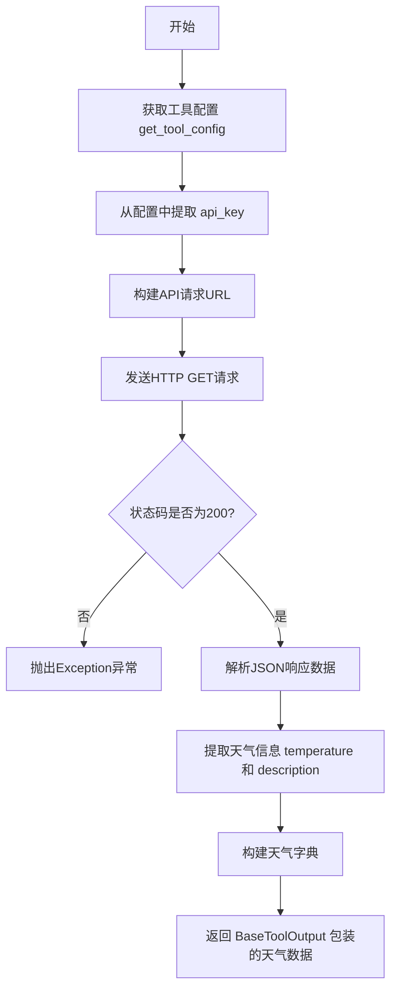
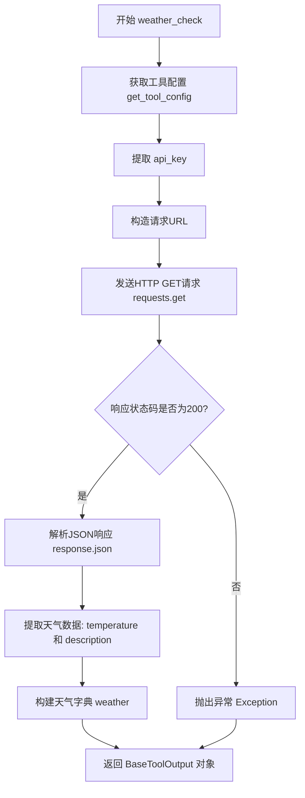

# `Langchain-Chatchat\libs\chatchat-server\chatchat\server\agent\tools_factory\weather_check.py` 详细设计文档

这是一个简单的天气查询工具，通过调用第三方天气API（心知天气）获取指定城市的当前天气状况，包括温度和天气描述，并返回标准化的工具输出格式。

## 整体流程



## 类结构

```
Global Functions
└── weather_check (通过 @regist_tool 装饰器注册的工具函数)
```

## 全局变量及字段


### `requests`
    
Python的HTTP库，用于发送HTTP请求获取天气数据

类型：`module`
    


### `Field`
    
Pydantic字段定义装饰器，用于定义工具函数的参数及其描述

类型：`class`
    


### `get_tool_config`
    
工具配置获取函数，用于从配置中读取天气API的密钥等配置信息

类型：`function`
    


### `regist_tool`
    
工具注册装饰器，用于将weather_check函数注册为聊天机器人可用的工具

类型：`decorator`
    


### `BaseToolOutput`
    
工具输出基类，用于封装工具执行结果并提供标准化的返回格式

类型：`class`
    


    

## 全局函数及方法


### `weather_check`

该函数是一个天气查询工具，通过调用第三方天气API（心知天气）获取指定城市的当前天气状况，包括温度和天气描述，并返回标准化的工具输出对象。

参数：

- `city`：`str`，城市名称，需包含城市和区县信息，例如 '厦门'

返回值：`BaseToolOutput`，包含天气温度（temperature）和天气描述（description）的字典结构

#### 流程图



#### 带注释源码

```python
"""
简单的单参数输入工具实现，用于查询现在天气的情况
"""
import requests  # 导入requests库用于发送HTTP请求

from chatchat.server.pydantic_v1 import Field  # 导入Field用于参数定义
from chatchat.server.utils import get_tool_config  # 导入获取工具配置的函数

from .tools_registry import regist_tool  # 导入工具注册装饰器

from langchain_chatchat.agent_toolkits.all_tools.tool import (
    BaseToolOutput,  # 导入工具输出基类
)

# 使用装饰器注册天气查询工具，标题为"天气查询"
@regist_tool(title="天气查询")
def weather_check(
    city: str = Field(description="City name,include city and county,like '厦门'"),
):
    """Use this tool to check the weather at a specific city"""

    # 从配置中获取天气工具的配置信息
    tool_config = get_tool_config("weather_check")
    # 提取API密钥
    api_key = tool_config.get("api_key")
    
    # 构造心知天气API的请求URL，包含密钥、位置、语言和单位参数
    url = f"https://api.seniverse.com/v3/weather/now.json?key={api_key}&location={city}&language=zh-Hans&unit=c"
    
    # 发送GET请求获取天气数据
    response = requests.get(url)
    
    # 判断HTTP响应状态码
    if response.status_code == 200:
        # 解析JSON响应数据
        data = response.json()
        
        # 从返回数据中提取天气信息
        weather = {
            "temperature": data["results"][0]["now"]["temperature"],  # 温度
            "description": data["results"][0]["now"]["text"],          # 天气描述
        }
        
        # 返回BaseToolOutput封装的对象
        return BaseToolOutput(weather)
    else:
        # HTTP请求失败时抛出异常
        raise Exception(f"Failed to retrieve weather: {response.status_code}")
```

## 关键组件


### 天气查询工具（weather_check）

这是一个简单的一键天气查询工具，通过调用心知天气API获取指定城市的实时天气信息，包括温度和天气描述，并返回结构化的工具输出结果。

### 工具注册装饰器（regist_tool）

使用装饰器模式将weather_check函数注册到工具管理系统，提供了工具标题"天气查询"，使该函数可以被Agent系统识别和调用。

### 配置管理模块（get_tool_config）

从应用配置中获取天气查询工具的特定配置，特别是API密钥。配置通过工具名称"weather_check"进行隔离管理，支持多工具配置共存。

### API请求构建

动态构建心知天气API的请求URL，包含API密钥、城市名称、语言（简体中文）和温度单位（摄氏度）参数。

### 外部依赖接口

集成requests库发送HTTP GET请求到第三方天气API服务，处理网络通信和数据获取逻辑。

### 响应解析与数据提取

从API返回的JSON响应中提取嵌套的天气数据，包括results[0].now.temperature和results[0].now.text字段，将原始数据转换为结构化字典格式。

### 工具输出封装（BaseToolOutput）

使用LangChain ChatChat框架的BaseToolOutput类封装返回数据，提供标准化的工具输出格式，支持Agent系统的统一处理。

### 异常处理机制

在API请求失败时抛出带状态码的异常信息，提供基本的错误反馈，但缺乏细粒度的异常分类和处理策略。


## 问题及建议


### 已知问题

-   **HTTP 请求缺少超时设置**：`requests.get(url)` 未设置 timeout 参数，可能导致请求无限期等待，造成线程/协程阻塞
-   **错误处理不完善**：仅检查 `response.status_code == 200`，未处理 API 返回错误响应体的情况（如城市不存在、API 密钥无效等）
-   **异常信息不够详细**：失败时仅返回 HTTP 状态码，缺少响应体内容，不利于问题排查
-   **未使用连接池/会话**：每次请求都创建新连接，效率低下
-   **缺少日志记录**：无任何日志输出，生产环境难以追踪问题和监控状态
-   **URL 硬编码拼接**：API 地址和参数拼接在函数内部，配置变更不灵活
-   **返回值类型注解缺失**：函数未声明返回类型，影响代码可读性和类型检查
-   **缺少重试机制**：网络波动或临时性 API 不可用时无法自动重试

### 优化建议

-   为 `requests.get()` 添加 `timeout` 参数（如 `timeout=10`），防止请求无限等待
-   增加对 API 错误响应的处理，解析响应体中的错误码和错误信息
-   使用 `requests.Session()` 维护会话，复用 TCP 连接
-   添加结构化日志记录请求 URL、响应状态、耗时等信息
-   将 API 地址、默认超时等配置提取到配置文件中
-   考虑添加简单的重试机制（如使用 `tenacity` 库）或熔断器
-   添加完整的类型注解，明确返回类型为 `BaseToolOutput`
-   考虑增加缓存机制（如 Redis），避免频繁请求相同城市天气

## 其它


### 设计目标与约束

该工具旨在为聊天机器人系统提供实时天气查询能力，允许用户通过自然语言查询指定城市的当前天气状况。设计约束包括：1) 仅支持单参数输入（城市名称），2) 依赖心知天气API v3版本，3) 返回数据格式为JSON，4) 仅支持中文语言返回（zh-Hans），5) 温度单位为摄氏度。

### 错误处理与异常设计

代码中包含两种主要错误处理机制：1) API请求失败时抛出Exception，错误信息包含HTTP状态码；2) JSON解析失败时会抛出requests库的JSONDecodeError。建议增加的错误处理包括：网络超时处理（建议添加timeout参数）、API频率限制处理、API密钥无效处理、城市名称无效返回空结果处理、以及重试机制（建议使用requests.adapters.HTTPAdapter配置重试策略）。

### 数据流与状态机

数据流如下：用户输入城市名称 → @regist_tool装饰器注册工具 → weather_check函数接收city参数 → get_tool_config获取API配置 → 构建API请求URL → requests.get发起HTTP请求 → 解析JSON响应 → 提取temperature和description字段 → 封装为BaseToolOutput对象返回。状态机包含：IDLE（空闲）、FETCHING（请求中）、SUCCESS（成功）、ERROR（异常）四种状态。

### 外部依赖与接口契约

外部依赖包括：requests库（HTTP请求）、chatchat.server.pydantic_v1（Field定义）、chatchat.server.utils（get_tool_config）、langchain_chatchat.agent_toolkits.all_tools.tool（BaseToolOutput）。接口契约方面，工具注册通过@regist_tool装饰器完成，输入参数为city字符串，输出为BaseToolOutput对象。外部API为心知天气API，接口地址为https://api.seniverse.com/v3/weather/now.json，需提供api_key参数。

### 安全性考虑

当前代码存在安全风险：API密钥通过get_tool_config获取，建议确保配置文件权限为600或400，防止密钥泄露。requests.get建议添加timeout参数防止请求挂起。考虑将API密钥存储在环境变量或密钥管理系统中，而非配置文件明文存储。建议增加请求日志记录，但需避免记录敏感信息。

### 性能考虑

当前实现每次查询都会发起新的HTTP请求，性能优化建议：1) 考虑添加简单的缓存机制（如使用functools.lru_cache或Redis缓存），缓存时间建议5-10分钟；2) 添加请求超时配置，建议timeout=10秒；3) 考虑使用连接池（requests.Session）复用TCP连接；4) 批量查询场景可考虑异步请求（aiohttp）。

### 测试策略

建议包含以下测试用例：1) 正常场景测试 - 使用有效城市名称验证返回数据格式；2) 网络异常测试 - 模拟网络超时、连接拒绝等场景；3) API错误测试 - 模拟401（密钥无效）、404（城市不存在）、429（频率限制）等HTTP错误码；4) 解析异常测试 - 模拟API返回异常数据格式；5) 边界测试 - 空字符串城市名、超长城市名、特殊字符城市名。

### 部署要求

部署环境要求：1) Python 3.8+；2) 安装requests库；3) 配置心知天气API密钥；4) 确保网络可达api.seniverse.com；5) 配置文件权限设置正确。建议使用环境变量或密钥管理服务存储API密钥，避免硬编码或明文配置文件。

### 版本兼容性

该代码依赖chatchat项目框架，需与chatchat主版本保持兼容。requests库建议使用>=2.25.0版本以确保安全修复。Python版本建议3.8及以上，以支持所有使用的语法特性。BaseToolOutput类来自langchain_chatchat包，需确保版本兼容性。

### 日志与监控建议

建议添加日志记录功能：1) 请求发起时记录请求URL（隐藏api_key）；2) 请求耗时记录；3) 响应状态码记录；4) 异常信息记录。监控指标建议包括：API调用成功率、平均响应时间、错误类型分布。建议集成到现有监控系统（如Prometheus）中。

### 扩展性设计

当前设计扩展性考虑：1) 工具可通过@regist_tool装饰器的参数扩展title、description等元信息；2) 可通过tool_config扩展支持多个天气API供应商；3) 可扩展返回更多天气字段（如湿度、风力、空气质量等）；4) 可添加多语言支持。建议未来考虑将API调用封装为独立的天气服务类，便于单元测试和替换实现。


    