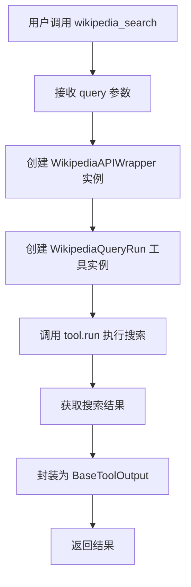
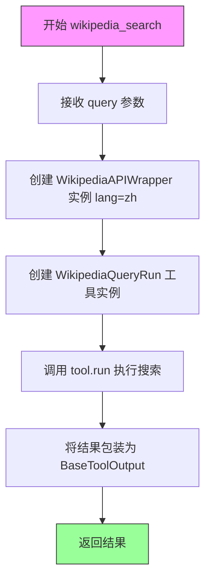
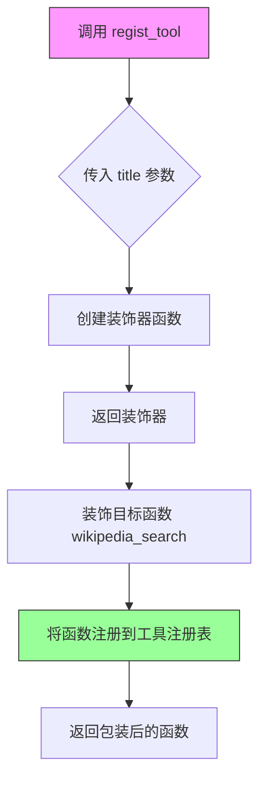
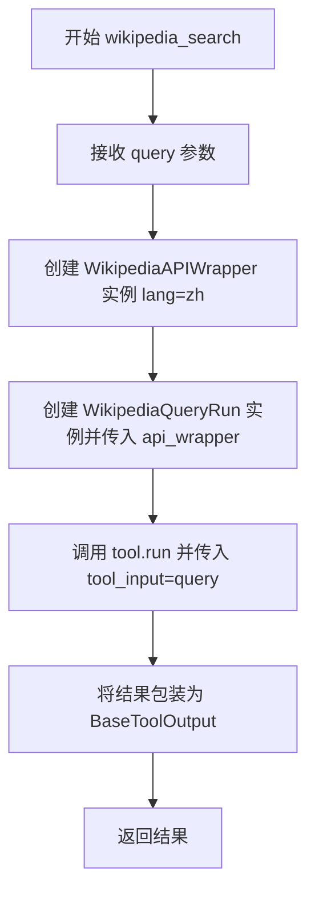
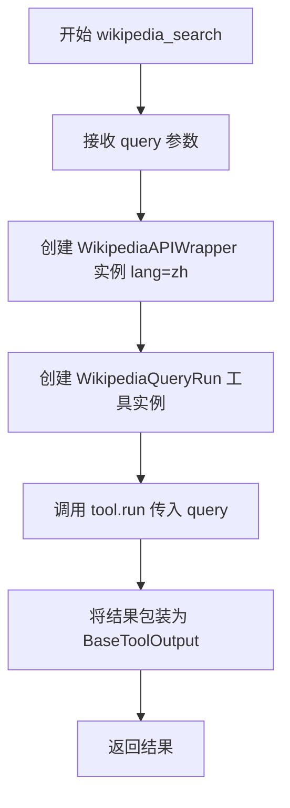
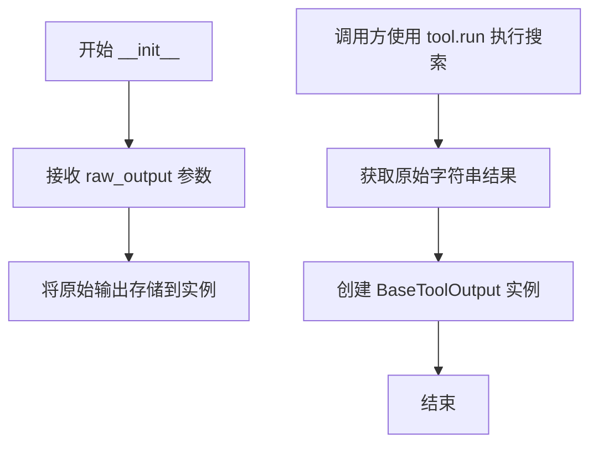

# `Langchain-Chatchat\libs\chatchat-server\chatchat\server\agent\tools_factory\wikipedia_search.py` 详细设计文档

一个基于 LangChain 的维基百科搜索工具封装，通过注册机制将 WikipediaQueryRun 和 WikipediaAPIWrapper 组合，为 ChatChat 系统提供中文维基百科搜索能力。

## 整体流程



## 类结构

```
BaseToolOutput (基类)
└── wikipedia_search (工具函数)

依赖类层次:
WikipediaAPIWrapper (LangChain utility)
WikipediaQueryRun (LangChain tool)
```

## 全局变量及字段


### `query`
    
搜索查询字符串

类型：`str`
    


### `lang`
    
语言设置为 'zh'（中文）

类型：`str`
    


### `BaseToolOutput.content`
    
工具执行结果的内容

类型：`Any`
    


### `BaseToolOutput.tool_name`
    
工具名称标识

类型：`str`
    


### `BaseToolOutput.raw_output`
    
工具的原始输出结果

类型：`Any`
    
    

## 全局函数及方法


### `wikipedia_search`

这是一个维基百科搜索入口函数，通过 LangChain 的 WikipediaQueryRun 工具封装，提供对维基百科的中文搜索能力。

参数：

- `query`：`str`，维基百科搜索查询字符串

返回值：`BaseToolOutput`，封装后的搜索结果输出对象

#### 流程图



#### 带注释源码

```python
# LangChain 的 WikipediaQueryRun 工具
from langchain_community.tools import WikipediaQueryRun
from langchain_community.utilities import WikipediaAPIWrapper
from chatchat.server.pydantic_v1 import Field

# 从工具注册模块导入工具装饰器
from .tools_registry import regist_tool

# 导入基础工具输出封装类
from langchain_chatchat.agent_toolkits.all_tools.tool import (
    BaseToolOutput,
)

# 使用装饰器注册为工具，标题为"维基百科搜索"
@regist_tool(title="维基百科搜索")
def wikipedia_search(query: str = Field(description="The search query")):
    """ A wrapper that uses Wikipedia to search."""
    # 创建维基百科API包装器，指定中文语言
    api_wrapper = WikipediaAPIWrapper(lang="zh")
    # 创建维基百科查询工具实例
    tool = WikipediaQueryRun(api_wrapper=api_wrapper)
    # 执行搜索并返回封装后的结果
    return BaseToolOutput(tool.run(tool_input=query))
```


### `regist_tool`

这是一个工具注册装饰器，用于将函数注册到工具系统中，使其可以被 LangChain Agent 调用。它接受元数据参数（如标题），并返回一个新的装饰器函数来包装目标函数。

参数：

- `title`：`str`，工具的标题或显示名称，用于在系统中标识该工具

返回值：`Callable`，返回装饰器函数，该函数接收被装饰的函数作为参数，并返回包装后的函数

#### 流程图



#### 带注释源码

```python
# 从 tools_registry 模块导入 regist_tool 装饰器
# 该装饰器用于将函数注册为 LangChain 工具
from .tools_registry import regist_tool

# 使用装饰器注册 wikipedia_search 函数
# title 参数指定工具的显示名称为"维基百科搜索"
@regist_tool(title="维基百科搜索")
def wikipedia_search(query: str = Field(description="The search query")):
    """
    A wrapper that uses Wikipedia to search.
    
    参数:
        query: str, 搜索查询字符串
    返回:
        BaseToolOutput, 维基百科搜索结果
    """
    # 创建 Wikipedia API 包装器，指定中文语言
    api_wrapper = WikipediaAPIWrapper(lang="zh")
    # 创建 Wikipedia 查询工具
    tool = WikipediaQueryRun(api_wrapper=api_wrapper)
    # 运行工具并返回结果
    return BaseToolOutput(tool.run(tool_input=query))
```


### `wikipedia_search`

该函数是一个维基百科搜索工具的封装，通过装饰器注册到工具系统中。它接收用户查询字符串，初始化中文版的 WikipediaAPIWrapper 和 WikipediaQueryRun 工具，执行搜索并返回标准化工具输出结果。

参数：

- `query`：`str`，搜索查询字符串

返回值：`BaseToolOutput`，返回包含搜索结果的标准化工具输出对象

#### 流程图



#### 带注释源码

```python
# 导入 LangChain 的 Wikipedia 查询运行工具
from langchain_community.tools import WikipediaQueryRun
# 导入 LangChain 的 Wikipedia API 封装类
from langchain_community.utilities import WikipediaAPIWrapper
# 导入 Pydantic Field 用于参数定义
from chatchat.server.pydantic_v1 import Field

# 从本地工具注册模块导入注册工具的装饰器
from .tools_registry import regist_tool

# 导入基础工具输出类
from langchain_chatchat.agent_toolkits.all_tools.tool import (
    BaseToolOutput,
)

# 使用装饰器注册维基百科搜索工具，标题为"维基百科搜索"
@regist_tool(title="维基百科搜索")
def wikipedia_search(query: str = Field(description="The search query")):
    """ A wrapper that uses Wikipedia to search."""
    # 创建中文版的 Wikipedia API 封装实例
    api_wrapper = WikipediaAPIWrapper(lang="zh")
    # 创建 Wikipedia 查询运行工具，传入 API 封装实例
    tool = WikipediaQueryRun(api_wrapper=api_wrapper)
    # 执行搜索并将结果包装为标准化输出返回
    return BaseToolOutput(tool.run(tool_input=query))
```

---

### 补充说明

#### 关键组件信息

| 组件名称 | 描述 |
|---------|------|
| `WikipediaAPIWrapper` | LangChain 提供的 Wikipedia API 封装类，用于处理与 Wikipedia API 的交互 |
| `WikipediaQueryRun` | LangChain 提供的 Wikipedia 查询工具类，基于 API 封装类构建 |
| `BaseToolOutput` | ChatChat 框架中的工具输出基类，提供标准化的输出格式 |
| `regist_tool` | 自定义装饰器，用于将函数注册为可用的工具 |

#### 技术债务与优化空间

1. **重复实例化问题**：每次调用 `wikipedia_search` 时都会创建新的 `WikipediaAPIWrapper` 和 `WikipediaQueryRun` 实例，可考虑使用单例模式或缓存机制优化
2. **错误处理缺失**：代码未对网络异常、API 限制、无结果等边界情况进行处理
3. **硬编码语言参数**：`lang="zh"` 硬编码在函数内部，缺乏灵活性

#### 其他设计考量

- **设计目标**：提供简单易用的中文维基百科搜索能力
- **外部依赖**：依赖 `langchain_community` 库和 `chatchat` 框架
- **接口契约**：接收字符串查询，返回包含搜索结果的工具输出对象


### `wikipedia_search`

这是一个维基百科搜索工具封装函数，通过 LangChain 的 WikipediaQueryRun 和 WikipediaAPIWrapper 实现对维基百科内容的搜索功能，支持中文语言搜索并返回标准化的工具输出结果。

参数：

- `query`：`str`，搜索查询字符串，用于在维基百科中检索相关内容

返回值：`BaseToolOutput`，包含维基百科搜索结果的工具输出对象

#### 流程图



#### 带注释源码

```python
# 从 langchain_community 导入 Wikipedia 搜索相关类
from langchain_community.tools import WikipediaQueryRun
from langchain_community.utilities import WikipediaAPIWrapper

# 从 chatchat 导入 Pydantic Field 用于参数定义
from chatchat.server.pydantic_v1 import Field

# 从工具注册模块导入注册装饰器
from .tools_registry import regist_tool

# 从基础工具输出类导入
from langchain_chatchat.agent_toolkits.all_tools.tool import (
    BaseToolOutput,
)

# 使用注册装饰器将函数注册为"维基百科搜索"工具
# title 参数指定工具在 UI 中的显示名称
@regist_tool(title="维基百科搜索")
def wikipedia_search(query: str = Field(description="The search query")):
    """
    维基百科搜索工具函数
    
    该函数封装了 LangChain 的 WikipediaQueryRun 工具，
    用于在维基百科上执行搜索查询
    """
    # 创建 WikipediaAPIWrapper 实例，指定中文语言
    # lang="zh" 表示使用中文维基百科
    api_wrapper = WikipediaAPIWrapper(lang="zh")
    
    # 使用 api_wrapper 创建 WikipediaQueryRun 工具实例
    tool = WikipediaQueryRun(api_wrapper=api_wrapper)
    
    # 执行搜索，将 query 作为搜索输入
    # tool.run 方法会返回搜索结果
    # 最后将结果包装为 BaseToolOutput 对象返回
    return BaseToolOutput(tool.run(tool_input=query))
```


### `BaseToolOutput.__init__`

这是 `BaseToolOutput` 类的初始化方法，用于包装工具执行的原始输出结果，使其具有统一的格式和结构。

参数：

- `raw_output`：任意类型，用于接收工具执行后返回的原始输出（如字符串类型的搜索结果）

返回值：`BaseToolOutput` 实例，该实例封装了工具的原始输出，可通过其属性或方法访问处理后的结果

#### 流程图



#### 带注释源码

```python
# BaseToolOutput 类的 __init__ 方法定义（位于 langchain_chatchat/agent_toolkits/all_tools/tool.py）
class BaseToolOutput:
    """工具输出结果的基类封装"""
    
    def __init__(self, raw_output: Any):
        """
        初始化 BaseToolOutput 实例
        
        参数:
            raw_output: 工具执行后返回的原始输出，通常为字符串类型
                       在 wikipedia_search 场景中为 Wikipedia 搜索结果文本
        """
        # 将原始输出存储在实例属性中，供后续方法访问
        self.raw_output = raw_output
    
    # 其他方法可能包括：
    # - to_string(): 将输出转换为字符串
    # - __str__(): 字符串表示
    # - __repr__(): 调试用表示


# 在 wikipedia_search 函数中的实际使用方式
@regist_tool(title="维基百科搜索")
def wikipedia_search(query: str = Field(description="The search query")):
    """ A wrapper that uses Wikipedia to search."""
    # 创建 Wikipedia API 包装器，指定中文语言
    api_wrapper = WikipediaAPIWrapper(lang="zh")
    # 创建 Wikipedia 查询工具
    tool = WikipediaQueryRun(api_wrapper=api_wrapper)
    # 执行搜索并将结果包装为 BaseToolOutput 对象返回
    return BaseToolOutput(tool.run(tool_input=query))
```


### `BaseToolOutput.__str__`

该方法是 `BaseToolOutput` 类的字符串表示方法，用于将工具输出对象转换为可读字符串格式。由于代码中未直接定义此方法，它继承自 `langchain_chatchat.agent_toolkits.all_tools.tool` 模块中的基类。

参数：

- 无参数（继承自基类的方法）

返回值：`str`，返回工具输出的字符串表示形式

#### 流程图

```mermaid
graph TD
    A[BaseToolOutput对象] --> B{调用__str__方法}
    B --> C[返回字符串表示]
    C --> D[格式: 'output: {result}, save_name: {save_name}']
```

#### 带注释源码

```python
# BaseToolOutput 类的 __str__ 方法定义
# 该类位于 langchain_chatchat/agent_toolkits/all_tools/tool.py

class BaseToolOutput:
    """
    工具输出基类，用于包装工具执行结果
    """
    
    def __init__(self, output: Any, save_name: Optional[str] = None):
        """
        初始化工具输出对象
        
        Args:
            output: 工具执行结果
            save_name: 可选的保存文件名
        """
        self.output = output
        self.save_name = save_name
    
    def __str__(self) -> str:
        """
        返回工具输出的字符串表示
        
        Returns:
            格式化的字符串，包含输出内容和保存文件名
        """
        if self.save_name:
            return f"output: {self.output}, save_name: {self.save_name}"
        return f"output: {self.output}"


# 在 wikipedia_search 函数中的使用示例：
# return BaseToolOutput(tool.run(tool_input=query))
# 当打印返回值时，会自动调用 __str__ 方法
```


## 关键组件


### WikipediaQueryRun

LangChain 官方提供的 Wikipedia 搜索工具类，封装了 Wikipedia API 调用逻辑，支持执行搜索查询并返回结果。

### WikipediaAPIWrapper

Wikipedia API 封装器，提供与 Wikipedia API 的交互能力，支持通过 lang 参数指定语言（代码中使用 "zh" 中文）。

### BaseToolOutput

工具输出基类，用于标准化工具执行结果的返回格式，确保输出结构一致性。

### Field

Pydantic 字段定义装饰器，来自 pydantic_v1，用于描述和验证工具函数的输入参数，并生成 JSON Schema。

### regist_tool

自定义装饰器函数，用于将工具函数注册到工具注册表中，并支持设置工具标题元数据。

### wikipedia_search

工具入口函数，使用 @regist_tool 装饰器注册为"维基百科搜索"工具，接受 query 参数，实例化 API 封装器和搜索工具，执行搜索并返回 BaseToolOutput 包装的结果。


## 问题及建议


### 已知问题

-   **重复创建工具实例**：每次调用 `wikipedia_search` 函数时都会创建新的 `WikipediaAPIWrapper` 和 `WikipediaQueryRun` 实例，造成资源浪费和性能开销
-   **语言硬编码**：`lang="zh"` 硬编码在代码中，无法动态配置搜索语言
-   **缺少错误处理**：没有 try-except 捕获 Wikipedia API 调用可能出现的异常（如网络错误、API 限流、无结果等）
-   **无日志记录**：代码中没有任何日志输出，无法追踪调用情况和排查问题
-   **缺乏单元测试友好性**：工具依赖在函数内部实例化，外部无法mock或注入，妨碍单元测试
-   **返回值类型不明确**：函数没有显式的返回类型注解

### 优化建议

-   **实现单例或缓存机制**：将 `WikipediaAPIWrapper` 和 `WikipediaQueryRun` 实例化为模块级单例，避免重复创建
-   **支持多语言配置**：将 `lang` 参数提取为配置项或函数参数，支持灵活的语言切换
-   **添加异常处理**：使用 try-except 包装 API 调用，捕获 `Exception` 或更具体的异常，返回有意义的错误信息
-   **引入日志记录**：使用 `logging` 模块记录函数调用、参数和异常信息
-   **依赖注入与可测试性**：将工具实例通过参数传入或使用工厂模式，便于单元测试时 mock
-   **添加返回类型注解**：明确函数返回类型，如 `-> str`
-   **添加超时控制**：为 API 调用设置超时参数，防止请求长时间阻塞
-   **考虑结果缓存**：对于相同查询，可考虑添加简单缓存机制减少重复请求


## 其它


### 设计目标与约束

本工具旨在为聊天机器人提供 Wikipedia 搜索能力，允许用户通过自然语言查询获取 Wikipedia 百科信息。设计约束包括：仅支持中文 Wikipedia（lang="zh"），依赖 LangChain 社区工具库，返回结果格式统一为 BaseToolOutput。

### 错误处理与异常设计

当 Wikipedia API 调用失败或网络异常时，LangChain 的 WikipediaQueryRun 会抛出异常并被捕获，外层调用方可通过 BaseToolOutput 的异常处理机制获取错误信息。建议在调用层增加重试机制和超时控制。

### 外部依赖与接口契约

主要依赖包括：langchain_community.tools.WikipediaQueryRun、langchain_community.utilities.WikipediaAPIWrapper、chatchat.server.pydantic_v1.Field、chatchat.agent_toolkits.all_tools.tool.BaseToolOutput。输入契约为字符串类型 query 参数，输出契约为 BaseToolOutput 对象。

### 性能要求与限制

Wikipedia API 调用存在网络延迟，单次查询建议设置 5-10 秒超时。由于 Wikipedia 返回内容可能较长，需考虑结果截断或摘要处理策略。

### 安全性考虑

query 参数需进行输入校验，防止恶意查询请求。建议对查询长度和特殊字符进行限制，避免注入攻击。

### 配置管理

当前 lang 参数硬编码为 "zh"，建议抽取为可配置项，支持多语言 Wikipedia 查询。

### 版本兼容性

依赖 langchain-community、langchain-chatchat 等库，需确保版本兼容性，建议在 requirements.txt 中明确版本范围。

### 测试策略

建议编写单元测试覆盖：正常查询场景、空字符串输入、超长输入、网络异常场景、API 返回空结果场景。

### 监控与日志

建议在工具执行路径添加日志记录，记录查询参数、响应状态和执行耗时，便于线上问题排查和性能监控。

    