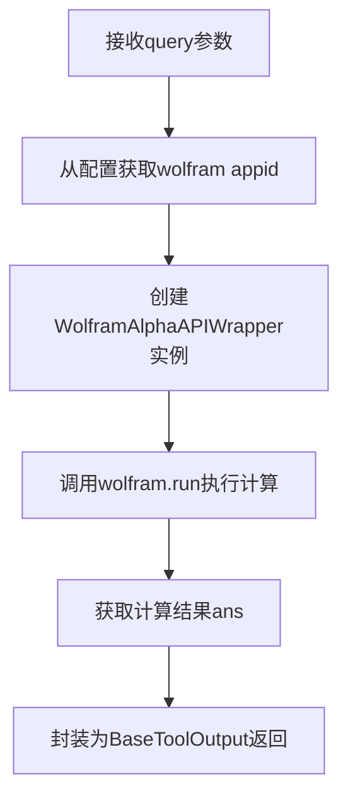
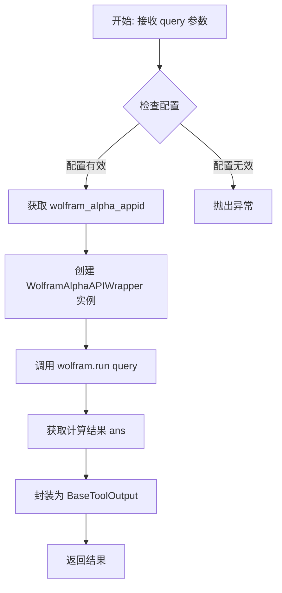

# `Langchain-Chatchat\libs\chatchat-server\chatchat\server\agent\tools_factory\wolfram.py` 详细设计文档

这是一个Langchain集成的Wolfram Alpha API封装工具，通过装饰器注册为聊天工具，提供数学公式计算功能。用户输入数学公式或计算表达式后，工具会调用Wolfram Alpha的计算API并返回计算结果。

## 整体流程



## 类结构

```
无类层次结构（基于函数的工具注册模式）
BaseToolOutput (外部导入的数据类)
wolfram (装饰器注册的函数工具)
```

## 全局变量及字段


### `wolfram`
    
Wolfram Alpha API 封装实例，用于执行数学公式计算查询

类型：`WolframAlphaAPIWrapper`
    


### `ans`
    
存储 Wolfram Alpha 返回的计算结果字符串

类型：`str`
    


    

## 全局函数及方法


### `wolfram`

该函数是一个 LangChain 工具封装，通过调用 Wolfram Alpha API 实现复杂数学公式的计算与求解功能。用户传入计算公式或数学问题，函数返回 Wolfram Alpha 的计算结果。

#### 参数

- `query`：`str`，需要计算或求解的数学公式/问题描述

#### 返回值

- `BaseToolOutput`，封装了 Wolfram Alpha API 返回的计算结果

#### 流程图



#### 带注释源码

```python
# Langchain 自带的 Wolfram Alpha API 封装

# 导入 Pydantic Field 用于参数定义
from chatchat.server.pydantic_v1 import Field
# 导入工具配置获取函数
from chatchat.server.utils import get_tool_config

# 从工具注册器导入装饰器
from .tools_registry import regist_tool

# 导入 LangChain 的工具输出基类
from langchain_chatchat.agent_toolkits.all_tools.tool import (
    BaseToolOutput,
)

# 使用装饰器注册该工具为 LangChain 工具
@regist_tool
def wolfram(query: str = Field(description="The formula to be calculated")):
    """
    用于计算复杂公式的工具
    
    参数:
        query: 需要计算的数学公式或问题
    返回:
        BaseToolOutput: 封装后的计算结果
    """

    # 延迟导入 Wolfram Alpha API 包装类（避免启动时依赖检查）
    from langchain.utilities.wolfram_alpha import WolframAlphaAPIWrapper

    # 从工具配置中获取 Wolfram Alpha App ID
    # get_tool_config("wolfram") 返回配置字典，包含 appid 等配置
    wolfram = WolframAlphaAPIWrapper(
        wolfram_alpha_appid=get_tool_config("wolfram").get("appid")
    )
    
    # 调用 Wolfram Alpha API 执行计算
    ans = wolfram.run(query)
    
    # 将原始结果封装为 BaseToolOutput 对象返回
    return BaseToolOutput(ans)
```

## 关键组件


### wolfram 工具函数

用于计算复杂数学公式的Wolfram Alpha查询工具，通过装饰器模式注册为系统工具，接收用户查询字符串并返回计算结果。

### WolframAlphaAPIWrapper 外部依赖

Langchain 官方提供的 Wolfram Alpha API 封装类，负责与 Wolfram Alpha 服务进行通信，执行实际的数据计算并返回原始结果。

### BaseToolOutput 输出封装

标准化工具输出容器，将 Wolfram Alpha 的计算结果封装为统一的工具输出格式，便于系统后续处理和展示。

### get_tool_config 配置获取

从系统配置中读取 Wolfram 工具相关配置（主要是 appid），实现配置与代码的解耦。

### Field 参数定义

Pydantic 框架的字段描述器，用于声明工具参数的元数据（描述信息），支持自动生成 API 文档和参数校验。

### regist_tool 装饰器

工具注册装饰器，将 wolfram 函数注册到系统的工具注册表中，使其可以被 Agent 和其他组件发现和调用。


## 问题及建议


### 已知问题

-   **配置获取空值风险**：`get_tool_config("wolfram").get("appid")` 当配置不存在或 appid 键缺失时返回 `None`，导致 `WolframAlphaAPIWrapper` 初始化失败但无明确错误提示
-   **异常处理缺失**：API 调用未使用 try-except 包裹，网络异常、API 配额耗尽、查询语法错误等会直接抛出未捕获异常
-   **重复模块导入**：`langchain.utilities.wolfram_alpha.WolframAlphaAPIWrapper` 在函数内部导入，每次调用都执行导入逻辑，性能开销不必要
-   **重复实例化**：`wolfram` 对象在每次函数调用时都创建新实例，未实现连接复用或单例模式
-   **参数校验缺失**：未对 `query` 参数进行长度限制、空值校验或格式验证，可能传入空字符串导致 API 无谓调用
-   **类型注解不完整**：函数缺少返回类型注解（仅依赖 docstring），不符合严格类型规范
-   **日志缺失**：无任何日志记录，调试和问题追踪困难

### 优化建议

-   在函数入口处添加配置校验，若 `appid` 为 `None` 抛出明确的自定义异常（如 `ValueError("Wolfram Alpha appid not configured")`）
-   使用 try-except 捕获 `WolframAlphaAPIWrapper` 可能的异常（如 `RateLimitError`、`ValidationError`），统一返回错误信息的 `BaseToolOutput`
-   将 `WolframAlphaAPIWrapper` 导入移至文件顶部，实例化移至模块级别或使用缓存（`functools.lru_cache`）实现复用
-   对 `query` 参数添加前置校验：`if not query or not query.strip(): raise ValueError("Query cannot be empty")`
-   添加 `query` 长度限制（如 max_length=2000）防止超长请求
-   添加函数返回类型注解：`-> BaseToolOutput`
-   引入标准日志模块（`logging`），记录 API 调用频率、耗时及异常信息

## 其它


### 设计目标与约束

本工具的设计目标是为Langchain聊天机器人提供计算困难数学公式的能力，集成Wolfram Alpha的强大计算功能。约束条件包括：必须配置有效的Wolfram Alpha appid、依赖外部API服务、API调用存在网络延迟和失败风险。

### 错误处理与异常设计

本工具涉及多层错误处理：1) appid配置缺失时WolframAlphaAPIWrapper会抛出异常；2) 网络请求失败时APIwrapper会抛出异常；3) 未捕获的异常会中断工具执行流程。建议添加try-except捕获异常并返回有意义的错误信息给用户。

### 数据流与状态机

数据流：用户输入query字符串 → get_tool_config获取appid配置 → 实例化WolframAlphaAPIWrapper → 调用run方法执行计算 → 返回BaseToolOutput对象。状态机包含三个状态：初始化、计算中、完成/异常。

### 外部依赖与接口契约

外部依赖包括：langchain.utilities.wolfram_alpha.WolframAlphaAPIWrapper（核心计算组件）、chatchat.server.utils.get_tool_config（配置读取）、chatchat.server.pydantic_v1.Field（参数定义）、.tools_registry.regist_tool（工具注册装饰器）、langchain_chatchat.agent_toolkits.all_tools.tool.BaseToolOutput（统一输出格式）。

### 安全性考虑

本工具存在安全风险：appid以明文形式存储在配置中。建议使用环境变量或密钥管理服务存储敏感appid，避免硬编码和配置文件明文存储。

### 性能考虑

API调用存在网络延迟，单次调用可能耗时数秒。无缓存机制，相同查询会重复调用API。优化方向：添加请求结果缓存、考虑异步调用、支持超时配置。

### 配置说明

需要在配置文件中添加wolfram.appid配置项，值为Wolfram Alpha API的应用程序ID。可通过环境变量WOLFRAM_ALPHA_APPID或配置文件获取。

### 使用示例

```python
# 在工具注册后，可以通过以下方式调用
result = wolfram("integrate x^2 from 0 to 1")
# 返回: BaseToolOutput对象，包含计算结果字符串
```

    