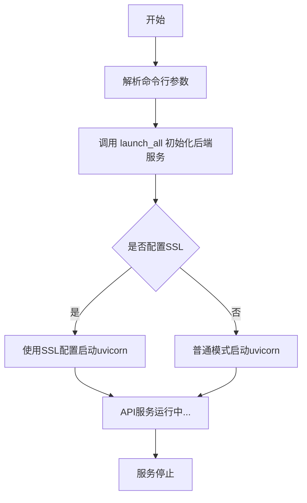
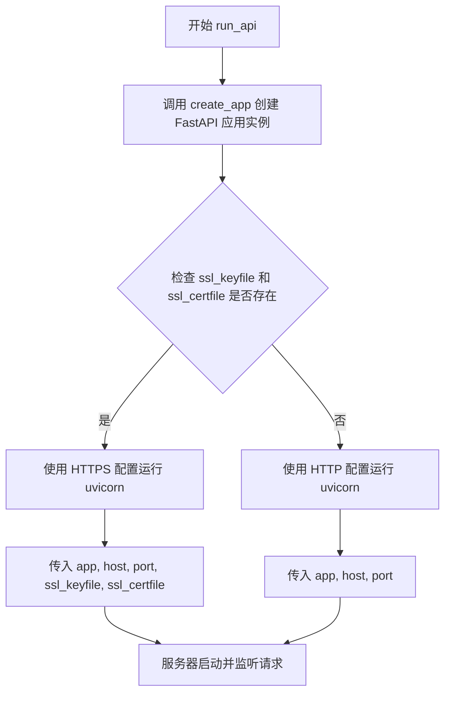

# `Langchain-Chatchat\libs\chatchat-server\chatchat\server\api_allinone_stale.py` 详细设计文档

这是一个集成化的API服务器启动脚本，用于启动支持多个大语言模型(LLM)的API服务。它整合了模型加载、控制器、工作进程和服务器组件，支持多模型部署、多GPU配置和SSL加密，提供统一的RESTful API接口供外部调用。

## 整体流程



## 类结构

```
该文件为脚本入口文件，无复杂类层次结构
主要依赖模块：
├── api (create_app)
├── llm_api_stale (controller_args, launch_all, parser, server_args, worker_args)
└── uvicorn (ASGI服务器)
```

## 全局变量及字段


### `api_args`
    
API相关参数列表，用于配置API服务

类型：`list`
    


### `parser`
    
命令行参数解析器对象

类型：`ArgumentParser`
    


### `controller_args`
    
控制器配置参数

类型：`dict`
    


### `worker_args`
    
工作进程配置参数

类型：`dict`
    


### `server_args`
    
服务器配置参数

类型：`dict`
    


### `args`
    
解析后的命令行参数对象

类型：`Namespace`
    


### `args_dict`
    
args的字典形式

类型：`dict`
    


    

## 全局函数及方法


### `run_api`

启动API服务器的函数，根据是否提供SSL证书来运行带或不带HTTPS支持的uvicorn服务器。

参数：

- `host`：`str`，服务器监听的主机地址
- `port`：`int`，服务器监听的端口号
- `**kwargs`：可选关键字参数，用于传递SSL配置
  - `ssl_keyfile`：`str`，SSL私钥文件路径（可选）
  - `ssl_certfile`：`str`，SSL证书文件路径（可选）

返回值：`None`，该函数直接运行uvicorn服务器，不会返回

#### 流程图



#### 带注释源码

```python
def run_api(host, port, **kwargs):
    """
    启动API服务器的函数
    
    Args:
        host: 服务器监听的主机地址（如 "0.0.0.0"）
        port: 服务器监听的端口号（如 7861）
        **kwargs: 可选关键字参数
            - ssl_keyfile: SSL私钥文件路径
            - ssl_certfile: SSL证书文件路径
    """
    # 创建FastAPI应用实例
    app = create_app()
    
    # 检查是否提供了SSL配置（私钥和证书）
    if kwargs.get("ssl_keyfile") and kwargs.get("ssl_certfile"):
        # 如果提供了SSL配置，使用HTTPS方式启动服务器
        uvicorn.run(
            app,
            host=host,
            port=port,
            ssl_keyfile=kwargs.get("ssl_keyfile"),
            ssl_certfile=kwargs.get("ssl_certfile"),
        )
    else:
        # 如果没有SSL配置，使用普通HTTP方式启动服务器
        uvicorn.run(app, host=host, port=port)
```

## 关键组件


### 命令行参数解析模块

通过 argparse 添加 API 相关的命令行参数，包括 api-host、api-port、ssl_keyfile、ssl_certfile，用于配置 API 服务器的网络和 SSL 相关信息。

### run_api 函数

负责启动 uvicorn ASGI 服务器，根据是否提供 SSL 证书决定是否启用 HTTPS 加密连接，并将 create_app() 创建的应用运行在指定主机和端口上。

### 主启动流程

整合参数解析、模型加载（launch_all）和 API 服务器启动的完整启动流程，支持单/多模型、多 GPU 部署，并输出启动进度提示信息。

### SSL/TLS 安全连接支持

通过条件判断 kwargs.get("ssl_keyfile") 和 kwargs.get("ssl_certfile") 实现可选的 HTTPS 安全传输层配置。

### 应用工厂函数

通过 create_app() 创建 FastAPI 应用实例，作为 uvicorn 服务的入口点。

### 模型加载与控制器

通过 launch_all 函数配合 controller_args、worker_args、server_args 实现多模型、多 GPU 的分布式模型加载与推理服务。


## 问题及建议


### 已知问题

- **缺乏异常处理**：代码没有对`launch_all()`和`run_api()`调用可能出现的异常进行捕获和处理，可能导致服务启动失败时出现未捕获的异常
- **未使用的变量**：`api_args`列表定义后未被使用，属于死代码
- **硬编码配置**：API主机地址"0.0.0.0"和端口7861硬编码在`parser.add_argument`中，灵活性不足
- **SSL参数重复获取**：对`kwargs.get("ssl_keyfile")`和`kwargs.get("ssl_certfile")`进行了多次调用，可优化为一次性获取
- **类型提示缺失**：函数参数和返回值均无类型提示，影响代码可读性和IDE支持
- **中英文混合输出**：print语句同时包含中英文信息，风格不统一，应采用统一的国际化方案或统一语言
- **魔法字符串**：模块名`llm_api_stale`中的"stale"暗示该模块可能已过时，存在技术债务风险
- **导入路径处理**：通过`sys.path.append`手动添加路径不是最佳实践，应使用包管理或相对导入
- **无日志配置**：仅依赖print输出日志，生产环境应配置结构化日志

### 优化建议

- 添加try-except块包裹服务启动逻辑，捕获并妥善处理各类异常，提供友好的错误提示
- 移除未使用的`api_args`变量或明确其用途
- 考虑将主机和端口的默认值提取为配置常量或环境变量，增强灵活性
- 重构SSL参数获取逻辑，使用变量缓存结果避免重复调用
- 为所有函数添加类型注解，提升代码质量和可维护性
- 统一日志输出语言，或引入i18n机制处理国际化
- 评估`llm_api_stale`模块状态，如已废弃则及时重构或替换
- 使用标准的Python包导入机制替代手动sys.path操作
- 引入Python标准logging模块，配置日志级别、格式和输出目标

## 其它


### 设计目标与约束

设计目标：提供一个统一的API服务入口，支持启动多个LLM模型服务，并暴露RESTful API接口供外部调用。支持通过命令行参数灵活配置模型路径、GPU资源、SSL加密等。

约束条件：
- 依赖Python 3.8+
- 需要uvicorn作为ASGI服务器
- 需要api模块提供create_app工厂函数
- 需要llm_api_stale模块提供参数解析和启动逻辑
- 模型服务启动耗时较长（3-10分钟），需做好超时处理和用户提示

### 错误处理与异常设计

参数解析异常：当parser.parse_args()解析失败时，argparse会自动打印错误信息并退出。

模型启动异常：launch_all函数内部应捕获模型加载失败、GPU资源不足等异常，若启动失败应打印错误日志并以非零状态码退出。

API服务异常：run_api函数中若SSL文件路径无效，uvicorn启动时会抛出异常；应捕获并打印友好错误信息。

运行时异常：主线程中所有调用应使用try-except包装，避免未捕获异常导致程序直接终止。

### 数据流与状态机

程序启动流程状态机：
1. 初始状态（PARSE_ARGS）→ 解析命令行参数
2. 解析完成状态（LAUNCH_LLM） → 调用launch_all启动LLM模型服务
3. 模型就绪状态（RUN_API） → 启动uvicorn API服务器
4. 运行状态（SERVING） → 持续处理HTTP请求

数据流向：
命令行参数 → args对象 → launch_all(模型服务启动) + run_api(API服务启动) → uvicorn监听HTTP请求

### 外部依赖与接口契约

外部依赖：
- uvicorn：ASGI服务器，负责HTTP服务
- api模块：提供create_app()返回ASGI应用实例
- llm_api_stale模块：提供controller_args、worker_args、server_args配置字典及launch_all函数

接口契约：
- create_app()：无参数，返回实现了ASGI协议的应用实例
- launch_all(args, controller_args, worker_args, server_args)：启动所有LLM模型服务，无返回值
- run_api(host, port, **kwargs)：启动API服务，阻塞直到服务关闭

### 安全性考虑

SSL/TLS加密：支持通过--ssl_keyfile和--ssl_certfile参数启用HTTPS，确保传输层安全。

主机绑定：默认绑定0.0.0.0，建议生产环境改为内网IP或localhost。

无认证机制：当前实现无API认证和鉴权，建议后续添加API Key或JWT认证。

### 性能考虑

模型加载性能：LLM模型加载耗时长（3-10分钟），建议增加加载进度条或分阶段启动反馈。

并发处理：uvicorn默认使用单worker，生产环境建议使用--workers参数启动多worker进程。

GPU资源：支持--num-gpus和--max-gpu-memory参数，需合理评估GPU显存占用。

### 部署和运维相关

部署方式：支持直接运行Python脚本或通过systemd/systemctl管理进程。

日志输出：使用print输出启动信息，建议接入标准日志库（logging）实现分级日志。

端口配置：默认7861，建议通过环境变量或配置文件管理不同环境的端口。

健康检查：建议添加/health端点用于服务健康探测。

### 配置管理

命令行参数：使用argparse统一管理，支持模型路径、GPU配置、API服务配置等。

配置优先级：命令行参数 > 环境变量 > 默认值。

敏感信息：SSL证书路径、模型路径等需妥善保管，避免硬编码。

### 测试策略

单元测试：测试parser参数解析、run_api函数调用逻辑。

集成测试：测试完整启动流程（可使用mock替代实际模型加载）。

性能测试：测试API响应时延、并发请求处理能力。

### 扩展性设计

模型热插拔：当前需重启服务加载新模型，建议支持运行时动态注册模型。

多租户隔离：当前无租户隔离，可考虑引入namespace或独立实例。

插件化架构：可抽象模型加载器，支持接入不同类型的LLM后端。

    