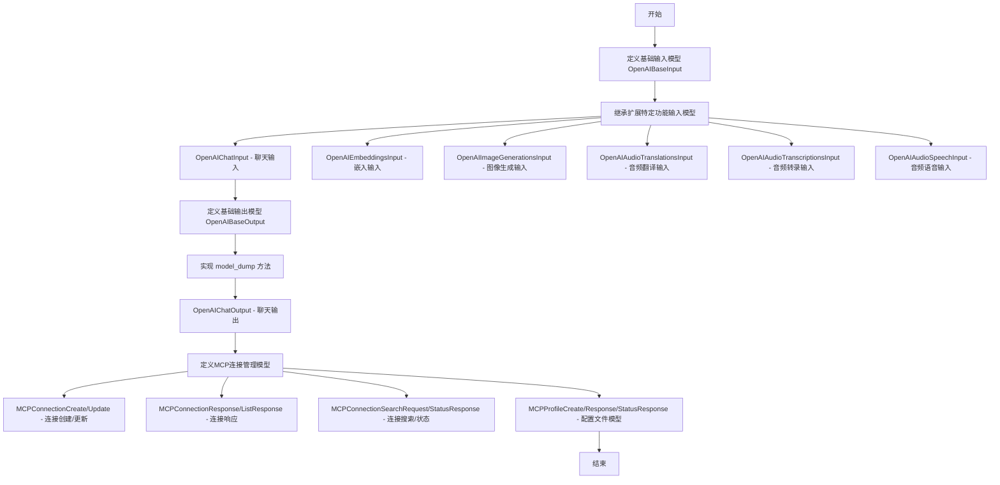
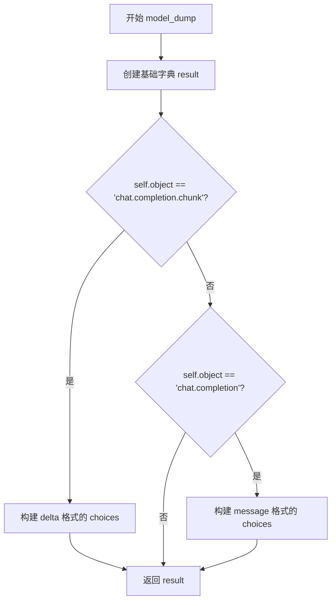
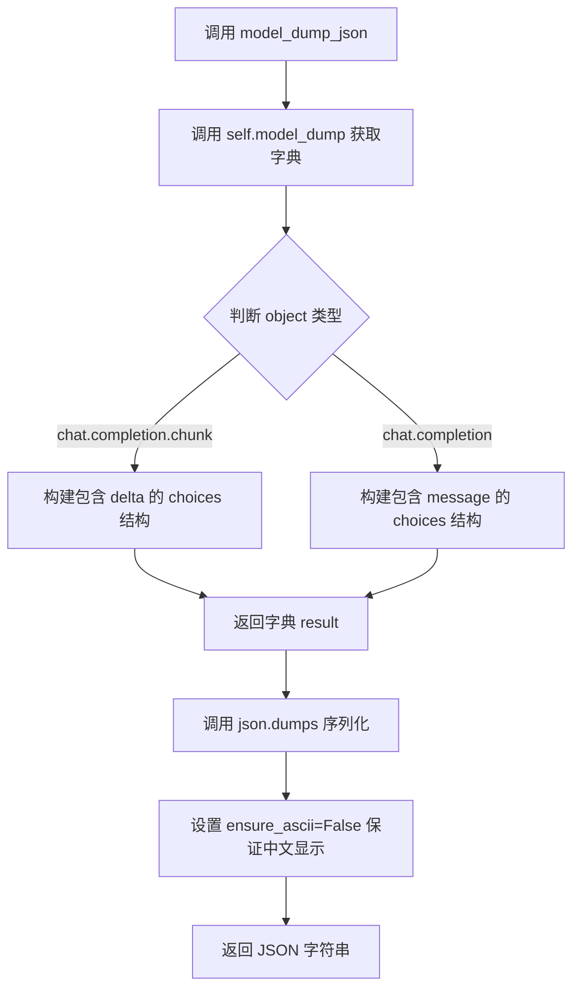

# `Langchain-Chatchat\libs\chatchat-server\chatchat\server\api_server\api_schemas.py` 详细设计文档

该文件定义了与OpenAI API交互所需的各种输入输出数据模型（涵盖聊天、嵌入、图像、音频等），以及MCP（Model Context Protocol）连接和配置管理的请求/响应模型，用于构建RESTful API接口的数据验证和序列化。

## 整体流程



## 类结构

```
OpenAIBaseInput (基础输入模型)
├── OpenAIChatInput (聊天输入)
├── OpenAIEmbeddingsInput (嵌入输入)
├── OpenAIImageBaseInput (图像基础输入)
│   ├── OpenAIImageGenerationsInput (图像生成输入)
│   ├── OpenAIImageVariationsInput (图像变体输入)
│   └── OpenAIImageEditsInput (图像编辑输入)
├── OpenAIAudioTranslationsInput (音频翻译输入)
│   └── OpenAIAudioTranscriptionsInput (音频转录输入)
└── OpenAIAudioSpeechInput (音频语音输入)

OpenAIBaseOutput (基础输出模型)
└── OpenAIChatOutput (聊天输出)

MCPConnectionCreate (MCP连接创建请求)
MCPConnectionUpdate (MCP连接更新请求)
MCPConnectionResponse (MCP连接响应)
MCPConnectionListResponse (MCP连接列表响应)
MCPConnectionSearchRequest (MCP连接搜索请求)
MCPConnectionStatusResponse (MCP连接状态响应)
MCPProfileCreate (MCP配置文件创建)
MCPProfileResponse (MCP配置文件响应)
MCPProfileStatusResponse (MCP配置文件状态响应)
```

## 全局变量及字段


### `ChatCompletionMessageParam`
    
OpenAI聊天消息参数的类型定义，定义消息的结构和属性

类型：`TypeAlias`
    


### `ChatCompletionToolChoiceOptionParam`
    
OpenAI工具选择选项参数的类型定义，用于指定使用哪个工具

类型：`TypeAlias`
    


### `ChatCompletionToolParam`
    
OpenAI工具参数的类型定义，描述工具的结构和参数

类型：`TypeAlias`
    


### `completion_create_params`
    
OpenAI创建聊天完成请求的参数模块，包含所有可用的参数定义

类型：`Module`
    


### `Settings`
    
ChatChat项目的全局设置类，包含模型配置如TEMPERATURE等参数

类型：`Class`
    


### `AgentStatus`
    
Agent执行状态枚举，定义Agent的不同运行状态

类型：`Enum/IntEnum`
    


### `MsgType`
    
消息类型枚举，定义文本、图像等不同消息类型的常量

类型：`IntEnum`
    


### `get_default_llm`
    
获取系统默认LLM模型名称的函数，返回默认语言模型标识符

类型：`Callable[[], str]`
    


### `AnyUrl`
    
Pydantic URL类型，用于验证和序列化URL字符串

类型：`PydanticType`
    


### `BaseModel`
    
Pydantic基础模型类，所有数据模型的基类

类型：`PydanticClass`
    


### `Field`
    
Pydantic字段装饰器，用于定义模型字段的元数据和验证规则

类型：`PydanticFunction`
    


### `UploadFile`
    
FastAPI文件上传类型，用于处理HTTP文件上传请求

类型：`FastAPIType`
    


### `OpenAIBaseInput.user`
    
发起请求的用户标识，用于追踪和权限控制

类型：`Optional[str]`
    


### `OpenAIBaseInput.extra_headers`
    
额外添加到请求头的键值对，用于自定义HTTP头

类型：`Optional[Dict]`
    


### `OpenAIBaseInput.extra_query`
    
额外添加到查询参数的键值对，用于URL参数

类型：`Optional[Dict]`
    


### `OpenAIBaseInput.extra_json`
    
额外添加到请求体的JSON数据，优先级高于客户端默认参数

类型：`Optional[Dict]`
    


### `OpenAIBaseInput.timeout`
    
请求超时时间（秒），控制API调用等待时长

类型：`Optional[float]`
    


### `OpenAIChatInput.messages`
    
聊天消息列表，包含对话历史和上下文

类型：`List[ChatCompletionMessageParam]`
    


### `OpenAIChatInput.model`
    
使用的LLM模型标识符，指定要调用的AI模型

类型：`str`
    


### `OpenAIChatInput.frequency_penalty`
    
频率惩罚参数，用于减少词元重复出现的概率

类型：`Optional[float]`
    


### `OpenAIChatInput.function_call`
    
指定函数调用行为，强制或禁止调用函数

类型：`Optional[FunctionCall]`
    


### `OpenAIChatInput.functions`
    
可用的函数定义列表，供模型选择调用

类型：`List[Function]`
    


### `OpenAIChatInput.logit_bias`
    
词元偏差映射，用于调整特定词元的选择概率

类型：`Optional[Dict[str, int]]`
    


### `OpenAIChatInput.logprobs`
    
是否返回对数概率，用于调试和概率分析

类型：`Optional[bool]`
    


### `OpenAIChatInput.max_tokens`
    
最大生成词元数，限制输出长度

类型：`Optional[int]`
    


### `OpenAIChatInput.n`
    
生成多少个回复候选，用于采样多样化输出

类型：`Optional[int]`
    


### `OpenAIChatInput.presence_penalty`
    
存在惩罚参数，鼓励模型讨论新话题

类型：`Optional[float]`
    


### `OpenAIChatInput.response_format`
    
响应格式限制，如JSON输出约束

类型：`ResponseFormat`
    


### `OpenAIChatInput.seed`
    
随机种子，用于可重现的随机采样

类型：`Optional[int]`
    


### `OpenAIChatInput.stop`
    
停止词元序列，遇到时停止生成

类型：`Union[Optional[str], List[str]]`
    


### `OpenAIChatInput.stream`
    
是否启用流式响应，逐块返回生成内容

类型：`Optional[bool]`
    


### `OpenAIChatInput.temperature`
    
采样温度，控制随机性和创造性

类型：`Optional[float]`
    


### `OpenAIChatInput.tool_choice`
    
工具选择策略，控制模型如何选择工具

类型：`Union[ChatCompletionToolChoiceOptionParam, str]`
    


### `OpenAIChatInput.tools`
    
可用工具定义列表，扩展模型能力

类型：`List[Union[ChatCompletionToolParam, str]]`
    


### `OpenAIChatInput.top_logprobs`
    
返回最高n个对数概率，用于详细概率分析

类型：`Optional[int]`
    


### `OpenAIChatInput.top_p`
    
核采样参数，限制词元选择集合

类型：`Optional[float]`
    


### `OpenAIEmbeddingsInput.input`
    
文本输入，用于生成向量嵌入

类型：`Union[str, List[str]]`
    


### `OpenAIEmbeddingsInput.model`
    
嵌入模型标识符，指定向量化模型

类型：`str`
    


### `OpenAIEmbeddingsInput.dimensions`
    
输出向量维度，控制嵌入向量大小

类型：`Optional[int]`
    


### `OpenAIEmbeddingsInput.encoding_format`
    
编码格式，指定输出为float或base64

类型：`Optional[Literal]`
    


### `OpenAIImageBaseInput.model`
    
图像生成模型标识符

类型：`str`
    


### `OpenAIImageBaseInput.n`
    
生成图像数量

类型：`int`
    


### `OpenAIImageBaseInput.response_format`
    
响应格式，url或base64编码

类型：`Optional[Literal]`
    


### `OpenAIImageBaseInput.size`
    
图像尺寸规格

类型：`Optional[Literal]`
    


### `OpenAIImageGenerationsInput.prompt`
    
图像生成提示词，描述期望的图像内容

类型：`str`
    


### `OpenAIImageGenerationsInput.quality`
    
图像质量等级，standard或hd

类型：`Literal`
    


### `OpenAIImageGenerationsInput.style`
    
图像风格，vivid或natural

类型：`Optional[Literal]`
    


### `OpenAIImageVariationsInput.image`
    
输入图像，文件或URL

类型：`Union[UploadFile, AnyUrl]`
    


### `OpenAIImageEditsInput.prompt`
    
图像编辑提示词，描述修改要求

类型：`str`
    


### `OpenAIImageEditsInput.mask`
    
编辑区域掩码图像

类型：`Union[UploadFile, AnyUrl]`
    


### `OpenAIAudioTranslationsInput.file`
    
音频文件输入

类型：`Union[UploadFile, AnyUrl]`
    


### `OpenAIAudioTranslationsInput.model`
    
翻译模型标识符

类型：`str`
    


### `OpenAIAudioTranslationsInput.prompt`
    
提示词，引导翻译风格

类型：`Optional[str]`
    


### `OpenAIAudioTranslationsInput.response_format`
    
输出格式，如json、text

类型：`Optional[str]`
    


### `OpenAIAudioTranslationsInput.temperature`
    
采样温度

类型：`float`
    


### `OpenAIAudioTranscriptionsInput.language`
    
指定音频语言，有助于提高识别准确率

类型：`Optional[str]`
    


### `OpenAIAudioTranscriptionsInput.timestamp_granularities`
    
时间戳粒度，word或segment级别

类型：`Optional[List[Literal]]`
    


### `OpenAIAudioSpeechInput.input`
    
待转换为语音的文本输入

类型：`str`
    


### `OpenAIAudioSpeechInput.model`
    
语音合成模型标识符

类型：`str`
    


### `OpenAIAudioSpeechInput.voice`
    
语音音色选择

类型：`str`
    


### `OpenAIAudioSpeechInput.response_format`
    
输出音频格式

类型：`Optional[Literal]`
    


### `OpenAIAudioSpeechInput.speed`
    
播放速度倍率

类型：`Optional[float]`
    


### `OpenAIBaseOutput.id`
    
唯一标识符，响应ID

类型：`Optional[str]`
    


### `OpenAIBaseOutput.content`
    
生成的内容文本

类型：`Optional[str]`
    


### `OpenAIBaseOutput.model`
    
使用的模型名称

类型：`Optional[str]`
    


### `OpenAIBaseOutput.object`
    
对象类型标识

类型：`Literal`
    


### `OpenAIBaseOutput.role`
    
消息角色，assistant

类型：`Literal`
    


### `OpenAIBaseOutput.finish_reason`
    
生成结束原因

类型：`Optional[str]`
    


### `OpenAIBaseOutput.created`
    
创建时间戳

类型：`int`
    


### `OpenAIBaseOutput.tool_calls`
    
工具调用列表

类型：`List[Dict]`
    


### `OpenAIBaseOutput.status`
    
Agent执行状态码

类型：`Optional[int]`
    


### `OpenAIBaseOutput.message_type`
    
消息类型标识

类型：`int`
    


### `OpenAIBaseOutput.message_id`
    
数据库消息记录ID

类型：`Optional[str]`
    


### `OpenAIBaseOutput.is_ref`
    
是否为引用消息，影响显示方式

类型：`bool`
    


### `MCPConnectionCreate.server_name`
    
MCP服务器名称

类型：`str`
    


### `MCPConnectionCreate.args`
    
命令执行参数列表

类型：`List[str]`
    


### `MCPConnectionCreate.env`
    
环境变量映射

类型：`Dict[str, str]`
    


### `MCPConnectionCreate.cwd`
    
工作目录路径

类型：`Optional[str]`
    


### `MCPConnectionCreate.transport`
    
传输协议类型

类型：`str`
    


### `MCPConnectionCreate.timeout`
    
连接超时时间

类型：`int`
    


### `MCPConnectionCreate.enabled`
    
是否启用连接

类型：`bool`
    


### `MCPConnectionCreate.description`
    
连接描述信息

类型：`Optional[str]`
    


### `MCPConnectionCreate.config`
    
连接配置字典

类型：`Dict`
    


### `MCPConnectionUpdate.server_name`
    
MCP服务器名称（可选更新）

类型：`Optional[str]`
    


### `MCPConnectionUpdate.args`
    
命令参数（可选更新）

类型：`Optional[List[str]]`
    


### `MCPConnectionUpdate.env`
    
环境变量（可选更新）

类型：`Optional[Dict[str, str]]`
    


### `MCPConnectionUpdate.cwd`
    
工作目录（可选更新）

类型：`Optional[str]`
    


### `MCPConnectionUpdate.transport`
    
传输协议（可选更新）

类型：`Optional[str]`
    


### `MCPConnectionUpdate.timeout`
    
超时时间（可选更新）

类型：`Optional[int]`
    


### `MCPConnectionUpdate.enabled`
    
启用状态（可选更新）

类型：`Optional[bool]`
    


### `MCPConnectionUpdate.description`
    
描述（可选更新）

类型：`Optional[str]`
    


### `MCPConnectionUpdate.config`
    
配置（可选更新）

类型：`Optional[Dict]`
    


### `MCPConnectionResponse.id`
    
连接唯一标识

类型：`str`
    


### `MCPConnectionResponse.server_name`
    
服务器名称

类型：`str`
    


### `MCPConnectionResponse.args`
    
命令参数

类型：`List[str]`
    


### `MCPConnectionResponse.env`
    
环境变量

类型：`Dict[str, str]`
    


### `MCPConnectionResponse.cwd`
    
工作目录

类型：`Optional[str]`
    


### `MCPConnectionResponse.transport`
    
传输协议

类型：`str`
    


### `MCPConnectionResponse.timeout`
    
超时时间

类型：`int`
    


### `MCPConnectionResponse.enabled`
    
是否启用

类型：`bool`
    


### `MCPConnectionResponse.description`
    
连接描述

类型：`Optional[str]`
    


### `MCPConnectionResponse.config`
    
连接配置

类型：`Dict`
    


### `MCPConnectionResponse.create_time`
    
创建时间

类型：`str`
    


### `MCPConnectionResponse.update_time`
    
更新时间

类型：`Optional[str]`
    


### `MCPConnectionListResponse.connections`
    
连接列表

类型：`List[MCPConnectionResponse]`
    


### `MCPConnectionListResponse.total`
    
总连接数

类型：`int`
    


### `MCPConnectionSearchRequest.keyword`
    
搜索关键词

类型：`Optional[str]`
    


### `MCPConnectionSearchRequest.transport`
    
传输方式过滤

类型：`Optional[str]`
    


### `MCPConnectionSearchRequest.enabled`
    
启用状态过滤

类型：`Optional[bool]`
    


### `MCPConnectionSearchRequest.limit`
    
返回结果数量限制

类型：`int`
    


### `MCPConnectionStatusResponse.success`
    
操作是否成功

类型：`bool`
    


### `MCPConnectionStatusResponse.message`
    
状态消息

类型：`str`
    


### `MCPConnectionStatusResponse.connection_id`
    
关联的连接ID

类型：`Optional[str]`
    


### `MCPProfileCreate.timeout`
    
默认超时时间

类型：`int`
    


### `MCPProfileCreate.working_dir`
    
默认工作目录

类型：`str`
    


### `MCPProfileCreate.env_vars`
    
默认环境变量

类型：`Dict[str, str]`
    


### `MCPProfileResponse.timeout`
    
超时时间

类型：`int`
    


### `MCPProfileResponse.working_dir`
    
工作目录

类型：`str`
    


### `MCPProfileResponse.env_vars`
    
环境变量

类型：`Dict[str, str]`
    


### `MCPProfileResponse.update_time`
    
更新时间

类型：`str`
    


### `MCPProfileStatusResponse.success`
    
操作是否成功

类型：`bool`
    


### `MCPProfileStatusResponse.message`
    
状态消息

类型：`str`
    
    

## 全局函数及方法


### `OpenAIBaseOutput.model_dump`

该方法将 `OpenAIBaseOutput` 模型实例序列化为字典格式，根据 `object` 字段的值（流式块或完整消息）构建不同的 `choices` 结构，以适配 OpenAI API 响应格式。

参数：

- 该方法无显式参数（隐式参数为 `self`，代表当前 `OpenAIBaseOutput` 实例）

返回值：`dict`，返回符合 OpenAI API 响应格式的字典，包含 id、object、model、created、status、message_type、message_id、is_ref 等基础字段，以及根据 object 类型构建的 choices 数组。

#### 流程图



#### 带注释源码

```python
def model_dump(self) -> dict:
    """将模型实例序列化为字典，适配 OpenAI API 响应格式"""
    
    # 步骤1: 构建包含基础字段的字典 result
    # 包含 id、object、model、created、status、message_type、message_id、is_ref 等
    # 使用 model_extra 扩展额外字段（pydantic v2 的 extra fields 功能）
    result = {
        "id": self.id,
        "object": self.object,
        "model": self.model,
        "created": self.created,
        "status": self.status,
        "message_type": self.message_type,
        "message_id": self.message_id,
        "is_ref": self.is_ref,
        **(self.model_extra or {}),  # 展开额外字段，允许灵活扩展
    }

    # 步骤2: 根据 object 类型构建不同的 choices 结构
    # chat.completion.chunk 用于流式响应 (streaming)
    if self.object == "chat.completion.chunk":
        result["choices"] = [
            {
                "delta": {                     # delta 表示增量内容（流式场景）
                    "content": self.content,
                    "tool_calls": self.tool_calls,
                },
                "role": self.role,
            }
        ]
    # chat.completion 用于非流式完整响应
    elif self.object == "chat.completion":
        result["choices"] = [
            {
                "message": {                  # message 表示完整消息
                    "role": self.role,
                    "content": self.content,
                    "finish_reason": self.finish_reason,
                    "tool_calls": self.tool_calls,
                }
            }
        ]

    # 步骤3: 返回序列化后的字典
    return result
```


### `OpenAIBaseOutput.model_dump_json`

该方法将 `OpenAIBaseOutput` 模型实例序列化为 JSON 字符串格式，用于 API 响应或数据持久化场景。它调用内部 `model_dump()` 方法获取字典表示，再通过 `json.dumps` 转换为 JSON 字符串，并确保中文字符正常显示（非 ASCII 转义）。

参数：
- 无（仅 `self` 隐式参数）

返回值：`str`，返回符合 OpenAI API 响应格式的 JSON 字符串

#### 流程图



#### 带注释源码

```python
def model_dump_json(self):
    """
    将模型实例序列化为 JSON 字符串
    
    该方法是对 model_dump() 的封装，通过 json.dumps 将字典转换为 JSON 字符串。
    主要用于生成符合 OpenAI API 响应格式的输出。
    
    Returns:
        str: JSON 格式的字符串表示，包含标准 OpenAI 响应结构
    """
    # 调用 model_dump() 获取模型数据的字典表示
    # ensure_ascii=False 确保中文字符正常显示，不进行 ASCII 转义
    return json.dumps(self.model_dump(), ensure_ascii=False)
```

## 关键组件


### OpenAIBaseInput

基础输入模型类，定义了所有OpenAI API请求的通用参数，包括用户标识、额外头部、额外查询参数、额外JSONbody和超时设置。

### OpenAIChatInput

聊天完成输入模型，继承自OpenAIBaseInput，封装了消息列表、模型选择、频率惩罚、函数调用、逻辑偏差、最大令牌数、温度、top_p等核心聊天参数。

### OpenAIEmbeddingsInput

嵌入向量输入模型，用于处理文本嵌入请求，支持单个字符串或字符串列表输入，指定模型和维度参数。

### OpenAIImageBaseInput

图像相关操作的基类输入模型，定义图像生成/编辑/变体请求的通用参数，包括模型选择、数量、响应格式和图像尺寸。

### OpenAIImageGenerationsInput

图像生成输入模型，继承自OpenAIImageBaseInput，添加了提示词、质量（standard/hd）和风格（vivid/natural）参数。

### OpenAIImageVariationsInput

图像变体输入模型，继承自OpenAIImageBaseInput，支持通过UploadFile或URL上传图像作为变体源。

### OpenAIImageEditsInput

图像编辑输入模型，继承自OpenAIImageVariationsInput，添加了编辑提示词和可选的掩码图像参数。

### OpenAIAudioTranslationsInput

音频翻译输入模型，用于将音频翻译为文本，继承自OpenAIBaseInput并添加文件、模型、提示词、响应格式和温度参数。

### OpenAIAudioTranscriptionsInput

音频转录输入模型，继承自OpenAIAudioTranslationsInput，添加了语言和时间戳粒度参数用于精细控制转录输出。

### OpenAIAudioSpeechInput

音频语音合成输入模型，将文本转换为语音，支持多种音频格式（mp3/opus/aac/flac/pcm/wav）和语速控制。

### OpenAIBaseOutput

基础输出模型类，定义了聊天完成的通用输出结构，包括ID、内容、模型、创建时间、工具调用、状态、消息类型等核心字段，并实现了model_dump和model_dump_json方法用于序列化。

### OpenAIChatOutput

聊天完成输出模型，继承自OpenAIBaseOutput，用于封装聊天API的标准响应格式。

### MCPConnectionCreate

MCP连接创建请求模型，定义了服务器名称、命令参数、环境变量、工作目录、传输方式（stdio/sse）、超时时间、启用状态、描述和配置等连接参数。

### MCPConnectionUpdate

MCP连接更新请求模型，继承自MCPConnectionCreate，所有字段均为可选，用于更新现有MCP连接配置。

### MCPConnectionResponse

MCP连接响应模型，包含完整的连接信息：ID、服务器名称、参数、环境变量、工作目录、传输方式、超时、启用状态、描述、配置以及创建和更新时间。

### MCPConnectionListResponse

MCP连接列表响应模型，返回连接数组和总数，用于分页查询MCP连接。

### MCPConnectionSearchRequest

MCP连接搜索请求模型，支持关键词、传输方式和启用状态过滤，并提供返回数量限制参数。

### MCPConnectionStatusResponse

MCP连接状态响应模型，返回操作是否成功、消息和可选的连接ID。

### MCPProfileCreate

MCP通用配置创建请求模型，定义默认超时时间、工作目录和环境变量，用于初始化MCP服务配置。

### MCPProfileResponse

MCP通用配置响应模型，返回超时时间、工作目录、环境变量和更新时间。

### MCPProfileStatusResponse

MCP通用配置状态响应模型，与MCPConnectionStatusResponse结构相同，返回操作状态和消息。


## 问题及建议


### 已知问题

-   **类型注解与默认值不一致**：`OpenAIChatInput` 中 `functions` 和 `tools` 字段类型声明为 `List[...]` 但默认值为 `None`，会导致类型检查器警告。
-   **运行时依赖注入**：`temperature` 字段直接引用 `Settings.model_settings.TEMPERATURE`，在模块导入时执行，可能导致循环依赖或测试困难。
-   **重复字段定义**：`MCPConnectionCreate` 和 `MCPConnectionUpdate` 包含大量重复字段，应通过继承或混入类重构。
-   **泛型类型缺失**：`MCPConnectionResponse.config` 字段使用 `Dict` 而非 `Dict[str, Any]`，缺乏类型安全。
-   **未使用的导入**：`AgentStatus` 从 `langchain_chatchat.callbacks.agent_callback_handler` 导入但未使用。
-   **硬编码枚举值**：`OpenAIBaseOutput.object` 字段使用字面量类型定义但 `model_dump` 方法中直接硬编码字符串 `"chat.completion.chunk"`。
-   **Pydantic v2 方法兼容性**：`model_dump` 和 `model_dump_json` 方法在 v2 中已内置，自定义实现可能导致行为不一致，应使用 `model_dump(mode='json')` 替代。
-   **缺失字段验证**：部分可选字段如 `MCPConnectionResponse.update_time` 定义为 `Optional[str]` 但无格式校验，应使用 `Optional[datetime]` 并添加验证器。

### 优化建议

-   将 `functions` 和 `tools` 的默认值改为 `Field(default=None)` 或改为 `Optional[List[...]]` 类型注解。
-   使用 `Field(default_factory=get_default_temperature)` 延迟获取配置值，或在应用启动时注入依赖。
-   抽取 `MCPConnectionBase` 基类包含公共字段，让 `MCPConnectionCreate` 和 `MCPConnectionUpdate` 继承。
-   将 `config: Dict` 改为 `config: Dict[str, Any]`，`update_time` 改为 `Optional[datetime]` 类型。
-   移除未使用的 `AgentStatus` 导入或添加 `noqa` 注释。
-   移除自定义 `model_dump` 方法，改用 Pydantic v2 内置序列化机制。
-   为 `MCPConnectionResponse` 添加 `model_validator` 验证 `update_time` 格式。

## 其它


### 设计目标与约束

该代码定义了一系列用于支持OpenAI API接口的Pydantic模型，兼容OpenAI接口规范，同时扩展支持MCP（Model Context Protocol）连接管理功能。设计目标包括：1）提供统一的输入输出数据模型，支持聊天完成、嵌入生成、图像生成、图像编辑、图像变体、音频翻译、音频转录、语音合成等多种API功能；2）支持MCP连接的创建、更新、查询、状态管理等操作；3）通过Pydantic V2实现数据验证和序列化；4）支持AgentStatus状态追踪和消息类型管理。约束条件包括：使用Python类型注解、遵循OpenAI API规范、依赖FastAPI框架、依赖chatchat项目内部模块。

### 错误处理与异常设计

代码本身为数据模型定义，未包含显式的异常处理逻辑。错误处理依赖于Pydantic的数据验证机制，当输入数据不符合模型定义时会抛出ValidationError。模型中关键字段均设置了合理的约束条件，如MCPConnectionCreate中timeout字段设置了ge=1和le=300的边界限制，server_name设置了min_length=1和max_length=100的长度限制。外部调用方需要处理Pydantic验证异常，并参考OpenAI API的错误响应格式进行统一错误返回。状态码通过status字段（AgentStatus类型）进行标识，具体错误码定义需参考AgentStatus枚举。

### 数据流与状态机

数据流主要分为两类：API输入数据流和响应数据流。输入数据流：客户端请求 → FastAPI端点 → Pydantic模型验证 → 业务逻辑处理 → 调用OpenAI API或MCP服务。输出数据流：OpenAI API响应或MCP服务响应 → OpenAIBaseOutput/具体输出模型 → model_dump()/model_dump_json()序列化 → JSON响应返回。状态机方面，OpenAIBaseOutput包含status字段用于表示AgentStatus，可能的状态转换包括：初始化 → 处理中 → 完成/失败。MCPConnectionStatusResponse包含success布尔字段表示连接状态。MCPConnectionListResponse支持分页查询，通过total字段记录总数。

### 外部依赖与接口契约

主要外部依赖包括：1）FastAPI框架的UploadFile用于文件上传；2）openai.types.chat模块的ChatCompletionMessageParam、ChatCompletionToolChoiceOptionParam、ChatCompletionToolParam、completion_create_params等类型定义；3）chatchat.settings模块的Settings配置类，用于获取TEMPERATURE默认值；4）chatchat.server.pydantic_v2的AnyUrl、BaseModel、Field；5）chatchat.server.utils的MsgType和get_default_llm；6）langchain_chatchat.callbacks.agent_callback_handler的AgentStatus。接口契约方面，模型遵循OpenAI API规范，部分字段带有description描述，配置类支持别名（如extra_json对应extra_body）。MCP相关Schema提供了完整的CRUD操作接口定义，包括创建、更新、查询、状态检查等能力。

### 配置与扩展性

代码支持多种扩展方式：1）通过OpenAIBaseInput的extra_headers、extra_query、extra_json（extra_body别名）字段支持传递额外参数；2）Config中设置extra="allow"允许动态添加额外字段；3）MCPConnectionCreate和MCPConnectionUpdate的config字段为Dict类型，支持存储任意配置信息；4）OpenAIBaseOutput通过model_extra支持动态字段。配置管理通过Settings.model_settings.TEMPERATURE获取默认温度参数，支持全局配置统一管理。

### 安全与权限考虑

代码中涉及的安全考虑包括：1）MCPConnectionCreate的timeout字段设置了1-300秒的合理超时限制，防止资源耗尽；2）MCPConnectionUpdate中敏感字段（如env环境变量）设计为可选更新，支持最小权限原则；3）文件上传使用AnyUrl类型，支持URL和本地文件两种方式，需注意文件上传的安全验证；4）MCP连接支持enabled字段，可动态启用/禁用连接。

### 版本兼容性与迁移

代码使用from __future__ import annotations实现类型注解的前向引用兼容性。使用Pydantic V2语法，包括Field、model_dump、model_dump_json等方法。需要注意Pydantic V1和V2之间的差异：V2中model_dump()替代了dict()，model_dump_json()替代了json()，验证逻辑有所变化。extra_body通过alias="extra_json"实现参数别名兼容。代码注释标记了# noqa和# noaq用于静态分析工具忽略特定警告。

### 测试与验证建议

针对该代码模块，建议的测试策略包括：1）单元测试：验证各模型字段验证逻辑，包括正常值、边界值、非法值；2）集成测试：测试模型与FastAPI端点的集成，验证请求解析和响应序列化；3）MCP Schema测试：验证MCPConnectionCreate/Update的约束条件（正则匹配、边界限制）；4）序列化测试：验证model_dump()和model_dump_json()输出格式符合OpenAI API规范；5）兼容性测试：验证与OpenAI官方类型定义的兼容性。

### 关键设计决策

1）使用Pydantic V2而非V1，利用新版本的性能优势和更严格的数据验证能力；2）采用继承结构（OpenAIBaseInput → OpenAIChatInput等）实现代码复用和一致性；3）MCP连接Schema独立定义，支持独立的连接管理功能模块；4）输出模型支持chat.completion和chat.completion.chunk两种object类型，兼容流式和非流式响应；5）使用time.time()作为默认创建时间戳，确保时间戳的准确性。


    