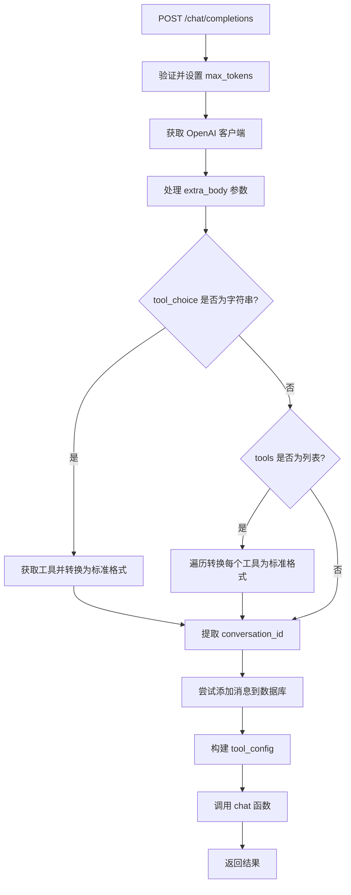

# `Langchain-Chatchat\libs\chatchat-server\chatchat\server\api_server\chat_routes.py` 详细设计文档

该模块是 ChatChat 系统的核心 API 端点，提供统一的 OpenAI 兼容聊天接口，支持普通对话、知识库对话、文件对话和反馈功能，通过 FastAPI 路由分发不同的聊天请求到对应的处理模块。

## 整体流程



## 类结构

```
APIRouter (FastAPI 路由)
└── chat_router
    ├── POST /feedback → chat_feedback
    ├── POST /kb_chat → kb_chat
    ├── POST /file_chat → file_chat
    └── POST /chat/completions → chat_completions (主处理函数)
```

## 全局变量及字段


### `logger`
    
日志记录器实例，用于记录程序运行过程中的日志信息

类型：`logging.Logger`
    


### `chat_router`
    
FastAPI APIRouter 实例，带 /chat 前缀和 ChatChat 对话标签，用于定义聊天相关的 API 路由

类型：`APIRouter`
    


    

## 全局函数及方法


### `chat_completions`

这是兼容 OpenAI 的统一聊天接口，根据请求参数（`tools`、`tool_choice` 等）调用不同的聊天功能（LLM 对话、Agent 对话、工具调用等），并将结果以 OpenAI 兼容格式返回。

参数：

- `request`：`Request`，FastAPI 请求对象，用于获取请求上下文
- `body`：`OpenAIChatInput`，OpenAI 格式的聊天输入，包含模型、消息、流式标志等参数

返回值：`Dict`，与 OpenAI 兼容的响应字典，包含聊天结果

#### 流程图

```mermaid
flowchart TD
    A[接收 POST /chat/completions 请求] --> B{body.max_tokens 是否为空}
    B -->|是| C[使用 Settings.model_settings.MAX_TOKENS]
    B -->|否| D[保留原始值]
    C --> E[获取 OpenAI 客户端]
    D --> E
    E --> F[提取 extra 参数并清理 model_extra]
    F --> G{tool_choice 是字符串?}
    G -->|是| H[调用 get_tool 转换为标准格式]
    G -->|否| I{tools 是列表?}
    H --> I
    I -->|是| J[遍历 tools 转换为标准格式]
    I -->|否| K[从 extra 获取 conversation_id]
    J --> K
    K --> L{conversation_id 存在?}
    L -->|是| M[调用 add_message_to_db 添加消息]
    L -->|否| N[message_id = None]
    M --> O
    N --> O
    O{body.tools 存在?}
    O -->|是| P[构建 tool_config 字典]
    O -->|否| Q[tool_config = {}]
    P --> R[调用 chat 函数处理请求]
    Q --> R
    R --> S[返回结果 Dict]
```

#### 带注释源码

```python
@chat_router.post("/chat/completions", summary="兼容 openai 的统一 chat 接口")
async def chat_completions(
    request: Request,
    body: OpenAIChatInput,
) -> Dict:
    """
    请求参数与 openai.chat.completions.create 一致，可以通过 extra_body 传入额外参数
    tools 和 tool_choice 可以直接传工具名称，会根据项目里包含的 tools 进行转换
    通过不同的参数组合调用不同的 chat 功能：
    - tool_choice
        - extra_body 中包含 tool_input: 直接调用 tool_choice(tool_input)
        - extra_body 中不包含 tool_input: 通过 agent 调用 tool_choice
    - tools: agent 对话
    - 其它：LLM 对话
    以后还要考虑其它的组合（如文件对话）
    返回与 openai 兼容的 Dict
    """
    # 当调用本接口且 body 中没有传入 "max_tokens" 参数时, 默认使用配置中定义的值
    if body.max_tokens in [None, 0]:
        body.max_tokens = Settings.model_settings.MAX_TOKENS

    # 获取异步 OpenAI 客户端，用于调用模型
    client = get_OpenAIClient(model_name=body.model, is_async=True)
    
    # 从 model_extra 中提取额外参数，转换为普通字典
    extra = {**body.model_extra} or {}
    
    # 清理 body 对象，移除 extra 参数避免后续处理出错
    for key in list(extra):
        delattr(body, key)

    # 检查并转换 tool_choice 格式：字符串 -> 标准函数调用格式
    if isinstance(body.tool_choice, str):
        if t := get_tool(body.tool_choice):
            body.tool_choice = {"function": {"name": t.name}, "type": "function"}
    
    # 检查并转换 tools 格式：字符串列表 -> 标准函数定义格式
    if isinstance(body.tools, list):
        for i in range(len(body.tools)):
            if isinstance(body.tools[i], str):
                if t := get_tool(body.tools[i]):
                    body.tools[i] = {
                        "type": "function",
                        "function": {
                            "name": t.name,
                            "description": t.description,
                            "parameters": t.args,
                        },
                    }

    # 从 extra 参数中获取会话 ID
    conversation_id = extra.get("conversation_id")
  
    # 尝试将消息添加到数据库，记录会话历史
    try:
        message_id = (
            add_message_to_db(
                chat_type="agent_chat",
                query=body.messages[-1]["content"],
                conversation_id=conversation_id,
            )
            if conversation_id
            else None
        )
    except Exception as e:
        logger.warning(f"failed to add message to db: {e}")
        message_id = None

    # 初始化模型配置和工具配置
    chat_model_config = {}  # TODO: 前端支持配置模型
    tool_config = {}
    
    # 如果请求包含 tools，则构建工具配置字典
    if body.tools:
        tool_names = [x["function"]["name"] for x in body.tools]
        tool_config = {name: get_tool_config(name) for name in tool_names}

    # 调用核心 chat 函数处理请求，获取聊天结果
    result = await chat(
        query=body.messages[-1]["content"],
        metadata=extra.get("metadata", {}),
        conversation_id=extra.get("conversation_id", ""),
        message_id=message_id,
        history_len=-1,
        stream=body.stream,
        chat_model_config=extra.get("chat_model_config", chat_model_config),
        tool_config=tool_config,
        use_mcp=extra.get("use_mcp", False),
        max_tokens=body.max_tokens,
    )
    
    # 返回与 OpenAI 兼容的结果字典
    return result
```

## 关键组件


### API路由架构

负责管理和注册所有聊天相关的API端点，包括反馈、知识库对话、文件对话和统一的OpenAI兼容聊天接口。

### chat_completions 核心函数

统一的聊天完成接口，兼容OpenAI接口规范，支持工具调用、代理对话和普通LLM对话三种模式，通过参数组合自动路由到不同的chat功能。

### Tool处理模块

负责将字符串形式的tool_choice和tools转换为符合OpenAI规范的字典格式，包括获取工具名称、描述和参数模式。

### 消息持久化管理

在每次对话时将用户消息存储到数据库，支持conversation_id关联，返回message_id用于后续追踪。

### 工具配置获取

根据tools列表动态获取各工具的配置信息，存储在tool_config字典中供chat函数使用。

### 配置默认值处理

当请求未指定max_tokens时，自动从Settings中获取模型的最大token限制值。

### 额外参数提取与清理

从model_extra中提取extra_body参数（如conversation_id、metadata、chat_model_config等），并从请求体中移除这些额外属性。


## 问题及建议


### 已知问题

- **异常处理不完善**：`add_message_to_db` 失败时仅记录警告日志，未进行降级处理或向上层抛出异常，可能导致调用方无法感知消息存储失败
- **缺少参数验证**：直接访问 `body.messages[-1]["content"]`，未验证 messages 是否为空或格式是否正确，可能导致索引越界异常
- **类型安全风险**：使用 `isinstance` 检查后直接进行字典访问（如 `x["function"]["name"]`），未处理字典结构不符合预期的情况
- **TODO 技术债务**：`chat_model_config = {}  # TODO: 前端支持配置模型` 标记了未完成的功能，但代码中硬编码了空字典
- **不一致的错误处理**：`get_tool` 返回 `None` 时的处理逻辑分散，未统一处理工具不存在的情况
- **内存和性能问题**：使用 `for key in list(extra): delattr(body, key)` 动态删除属性不是最佳实践，可能影响性能和代码可读性
- **日志记录不足**：缺少关键路径的日志记录，如工具调用、配置加载等，不利于问题排查
- **返回值类型宽泛**：函数返回类型声明为 `Dict` 而非具体类型（如 `OpenAIChatOutput`），降低了类型安全性和 IDE 智能提示支持

### 优化建议

- **完善参数校验**：在函数入口添加 `body.messages` 的非空和格式校验，对非法输入提前返回 400 错误
- **统一错误处理**：为 `get_tool` 和 `get_tool_config` 的调用添加异常捕获，或在工具注册阶段确保工具必存在
- **完成 TODO 功能**：要么实现前端模型配置支持，要么移除该 TODO 注释并明确该字段的用途
- **优化属性操作**：避免使用 `delattr` 动态删除属性，考虑使用 `pydantic` 模型的字段排除机制或重新构造对象
- **细化返回类型**：定义具体的响应模型（如 `OpenAIChatOutput`）替代宽泛的 `Dict`，提升类型安全
- **增强日志**：在关键分支（如工具调用、数据库操作）添加 info 或 debug 级别日志
- **考虑异步优化**：如 `get_tool_config` 为同步调用且可能阻塞，考虑改为异步或添加缓存

## 其它


### 设计目标与约束

本模块旨在提供统一的聊天API接口，兼容OpenAI API规范，支持普通对话、知识库对话、文件对话以及工具调用等多种场景。约束条件包括：必须依赖FastAPI框架、必须使用异步处理、必须维护与OpenAI API的兼容性、必须支持流式输出。

### 错误处理与异常设计

代码中通过try-except捕获了数据库写入异常并记录警告日志，但整体错误处理较为薄弱。建议增加：1) 工具名称不存在时返回明确错误信息；2) 数据库连接失败时的降级处理；3) 模型调用超时的异常捕获；4) 参数校验失败的HTTP 422响应；5) 认证授权失败的HTTP 401/403响应。当前仅在add_message_to_db处有异常处理，其他关键操作如get_tool、get_tool_config、chat调用均无异常保护。

### 数据流与状态机

数据流向：Request Body → OpenAIChatInput解析 → 工具转换处理 → 数据库消息记录 → chat函数调用 → 返回Dict结果。状态机方面：初始状态接收请求 → 参数预处理（max_tokens默认值、工具格式转换） → 消息持久化 → 执行对话逻辑 → 返回结果。其中工具调用存在两条路径：tool_choice含tool_input时直接调用工具，否则通过agent调用。

### 外部依赖与接口契约

核心依赖包括：fastapi.APIRouter用于路由定义、langchain.prompts.prompt.PromptTemplate用于提示词模板、sse_starlette.EventSourceResponse用于SSE流式响应、chatchat.server.chat.*系列模块提供核心聊天逻辑、chatchat.server.db.repository提供数据库操作、chatchat.utils提供日志和工具获取。外部接口契约：chat_completions接收OpenAIChatInput格式请求，返回兼容OpenAI的Dict响应，支持stream参数控制流式/非流式输出。

### 配置与可扩展性设计

当前chat_model_config为空字典且标注TODO需前端支持配置模型，tool_config通过get_tool_config动态获取。设计可扩展点：1) 工具注册机制通过get_tool实现动态发现；2) 聊天模型配置支持运行时注入；3) MCP（Model Context Protocol）通过use_mcp参数启用。配置文件依赖Settings.model_settings.MAX_TOKENS作为默认令牌数上限。

### 安全性考虑

代码未包含认证授权检查，conversation_id从extra参数提取存在篡改风险，tool_config动态加载工具配置需防止恶意工具注入，query内容直接存入数据库需防范注入攻击。建议增加：请求体验证、敏感信息脱敏、工具权限控制、输入清洗等安全措施。

### 性能与监控

流式响应通过body.stream参数控制，异步客户端get_OpenAIClient(is_async=True)支持并发处理，但缺少请求限流、熔断机制。日志记录仅在数据库写入失败时触发，建议增加关键操作埋点、调用链路追踪、性能指标采集。

### API版本管理与兼容性

当前接口路径为/chat/completions，使用OpenAIChatInput确保请求格式兼容，但返回结果为Dict需明确其与OpenAI响应格式的映射关系。缺少版本号管理，建议在路径或响应头中体现版本信息以便后续迭代兼容。

### 测试策略建议

建议补充单元测试覆盖：工具转换逻辑、参数默认值设置、异常处理流程、数据库调用Mock；集成测试覆盖：完整对话流程、工具调用流程、流式响应验证；压力测试覆盖：高并发场景、长时间运行稳定性。


    