# `Langchain-Chatchat\libs\chatchat-server\chatchat\server\api_server\kb_routes.py` 详细设计文档

该文件定义了FastAPI路由器，提供知识库（Knowledge Base）相关的RESTful API端点，包括知识库的创建、删除、列表、文件上传下载、文档搜索、向量化重建、摘要生成以及基于知识库的对话功能，支持本地知识库、临时知识库和搜索引擎三种模式。

## 整体流程

```mermaid
graph TD
    A[客户端请求] --> B{请求路径}
    B -->|/knowledge_base/{mode}/{param}/chat/completions| C[kb_chat_endpoint]
    B -->|/knowledge_base/list_knowledge_bases| D[list_kbs]
    B -->|/knowledge_base/create_knowledge_base| E[create_kb]
    B -->|/knowledge_base/delete_knowledge_base| F[delete_kb]
    B -->|/knowledge_base/list_files| G[list_files]
    B -->|/knowledge_base/search_docs| H[search_docs]
    B -->|/knowledge_base/upload_docs| I[upload_docs]
    B -->|/knowledge_base/delete_docs| J[delete_docs]
    B -->|/knowledge_base/update_info| K[update_info]
    B -->|/knowledge_base/update_docs| L[update_docs]
    B -->|/knowledge_base/download_doc| M[download_doc]
    B -->|/knowledge_base/recreate_vector_store| N[recreate_vector_store]
    B -->|/knowledge_base/upload_temp_docs| O[upload_temp_docs]
    B -->|/knowledge_base/search_temp_docs| P[search_temp_docs]
    B -->|/kb_summary_api/summary_file_to_vector_store| Q[summary_file_to_vector_store]
    B -->|/kb_summary_api/summary_doc_ids_to_vector_store| R[summary_doc_ids_to_vector_store]
    B -->|/kb_summary_api/recreate_summary_vector_store| S[recreate_summary_vector_store]
    C --> T[调用kb_chat函数处理对话]
    T --> U{返回类型}
    U -->|流式输出| V[StreamingResponse]
    U -->|普通返回| W[JSONResponse]
```

## 类结构

```
APIRouter (FastAPI)
├── kb_router (知识库主路由)
│   ├── kb_chat_endpoint (对话端点)
│   ├── list_kbs (列表知识库)
│   ├── create_kb (创建知识库)
│   ├── delete_kb (删除知识库)
│   ├── list_files (列表文件)
│   ├── search_docs (搜索文档)
│   ├── upload_docs (上传文档)
│   ├── delete_docs (删除文档)
│   ├── update_info (更新信息)
│   ├── update_docs (更新文档)
│   ├── download_doc (下载文档)
│   ├── recreate_vector_store (重建向量库)
│   ├── upload_temp_docs (上传临时文档)
│   ├── search_temp_docs (搜索临时文档)
│   └── summary_router (摘要子路由)
└── summary_router (摘要路由)
    ├── summary_file_to_vector_store
    ├── summary_doc_ids_to_vector_store
    └── recreate_summary_vector_store
```

## 全局变量及字段


### `kb_router`
    
知识库管理的FastAPI路由对象，提供知识库对话、创建、删除、文件列表、上传、删除、更新、搜索、下载等接口

类型：`APIRouter`
    


### `summary_router`
    
知识库摘要API的FastAPI路由对象，提供文件摘要、转向量存储、重新构建摘要向量库等接口

类型：`APIRouter`
    


    

## 全局函数及方法


### `kb_chat_endpoint`

该函数是知识库对话的 API 端点，接收 OpenAI 兼容的 ChatCompletion 格式请求，根据传入的 `mode`（local_kb/temp_kb/search_engine）和 `param`（知识库名称）参数，调用 `kb_chat` 函数实现知识库问答功能，支持流式输出和多种高级配置参数。

参数：

- `mode`：`Literal["local_kb", "temp_kb", "search_engine"]`，知识库模式，分为本地知识库、临时知识库和搜索引擎三种模式
- `param`：`str`，知识库名称或搜索参数
- `body`：`OpenAIChatInput`，OpenAI 兼容的聊天输入格式，包含消息列表、模型、温度等参数
- `request`：`Request`，FastAPI 请求对象，用于传递请求上下文

返回值：`kb_chat` 函数的返回值类型，通常为流式或非流式的聊天响应对象

#### 流程图

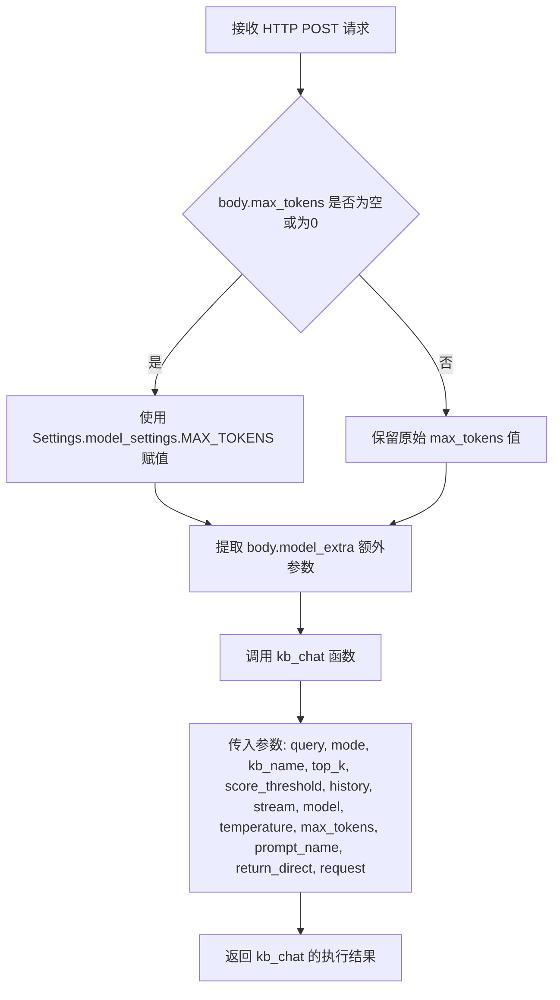

#### 带注释源码

```python
@kb_router.post(
    "/{mode}/{param}/chat/completions", summary="知识库对话，openai 兼容，参数与 /chat/kb_chat 一致"
)
async def kb_chat_endpoint(
    mode: Literal["local_kb", "temp_kb", "search_engine"],
    param: str,
    body: OpenAIChatInput,
    request: Request,
):
    """
    知识库对话端点，接收 OpenAI 兼容格式的请求
    
    参数:
        mode: 知识库模式，支持 local_kb(本地知识库)、temp_kb(临时知识库)、search_engine(搜索引擎)
        param: 知识库名称或搜索参数
        body: OpenAI 兼容的聊天输入，包含消息列表、模型配置等
        request: FastAPI 请求对象，用于传递请求上下文
    """

    # 检查 max_tokens 是否为空或为 0，如果是则使用默认配置值
    if body.max_tokens in [None, 0]:
        body.max_tokens = Settings.model_settings.MAX_TOKENS

    # 从请求体中提取额外的模型参数
    extra = body.model_extra
    
    # 调用 kb_chat 函数执行知识库对话
    ret = await kb_chat(
        query=body.messages[-1]["content"],  # 取最后一条消息作为查询内容
        mode=mode,                            # 知识库模式
        kb_name=param,                        # 知识库名称
        top_k=extra.get("top_k", Settings.kb_settings.VECTOR_SEARCH_TOP_K),  # 检索 Top K 结果
        score_threshold=extra.get("score_threshold", Settings.kb_settings.SCORE_THRESHOLD),  # 相似度阈值
        history=body.messages[:-1],           # 历史消息作为上下文
        stream=body.stream,                   # 是否流式输出
        model=body.model,                     # 使用的模型
        temperature=body.temperature,         # 温度参数
        max_tokens=body.max_tokens,           # 最大 token 数
        prompt_name=extra.get("prompt_name", "default"),  # 使用的 prompt 模板名称
        return_direct=extra.get("return_direct", False),  # 是否直接返回检索结果
        request=request,                       # 请求对象
    )
    return ret
```


### `list_kbs`

该函数为 FastAPI 端点，用于获取知识库（Knowledge Base）列表，支持通过 `/list_knowledge_bases` GET 请求调用，返回知识库名称列表等信息。

参数：由于该函数在路由注册时直接作为处理器传递，未显式声明参数列表。结合 FastAPI 常规实现，可能无需额外参数（或可能接收隐式的 `request` 对象，但当前代码中未体现），具体参数需查看 `chatchat.server.knowledge_base.kb_api` 模块中 `list_kbs` 的实际定义。

返回值：`ListResponse`，表示返回知识库名称等信息的列表响应结构。

#### 流程图

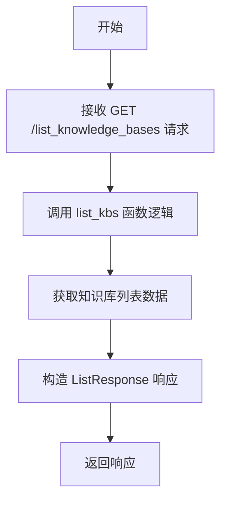

#### 带注释源码

```python
# 从 kb_api 模块导入 list_kbs 函数（具体定义需查看 kb_api 源码）
from chatchat.server.knowledge_base.kb_api import list_kbs

# 将 list_kbs 注册到 kb_router 的 GET 端点，路由为 /list_knowledge_bases
# response_model 指定返回数据模型为 ListResponse
# summary 提供端点中文描述
kb_router.get(
    "/list_knowledge_bases", response_model=ListResponse, summary="获取知识库列表"
)(list_kbs)
```


### `create_kb`

创建知识库的API端点，用于在系统中建立新的知识库。

参数：

- 由于 `create_kb` 函数定义在 `chatchat.server.knowledge_base.kb_api` 模块中，当前代码文件仅展示了路由注册部分，未包含该函数的实际实现源码。

返回值：`BaseResponse`，返回创建知识库操作的结果响应。

#### 流程图

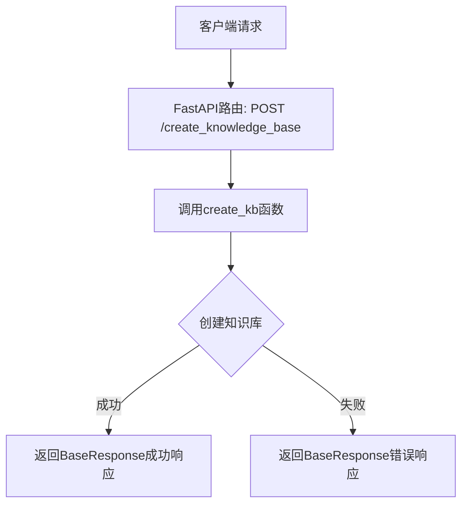

#### 带注释源码

```python
# 从kb_api模块导入create_kb函数
from chatchat.server.knowledge_base.kb_api import create_kb, delete_kb, list_kbs

# ... 其他导入 ...

# 注册create_kb为POST路由
# 路径: /knowledge_base/create_knowledge_base
# 响应模型: BaseResponse
# 摘要: 创建知识库
kb_router.post(
    "/create_knowledge_base", response_model=BaseResponse, summary="创建知识库"
)(create_kb)
```

---

**注意**：当前提供的代码文件是 API 路由注册文件，`create_kb` 函数的实际实现位于 `chatchat.server.knowledge_base.kb_api` 模块中。要获取完整的函数参数、返回值及实现细节，需要查看该模块的源码。


### `delete_kb`

删除指定的知识库，包括其相关的向量存储和文件。

参数：
- `kb_name`：`str`，要删除的知识库名称
- `force`：`bool`，可选，是否强制删除（即使有文件）

返回值：`BaseResponse`，包含操作成功或失败的状态信息

#### 流程图

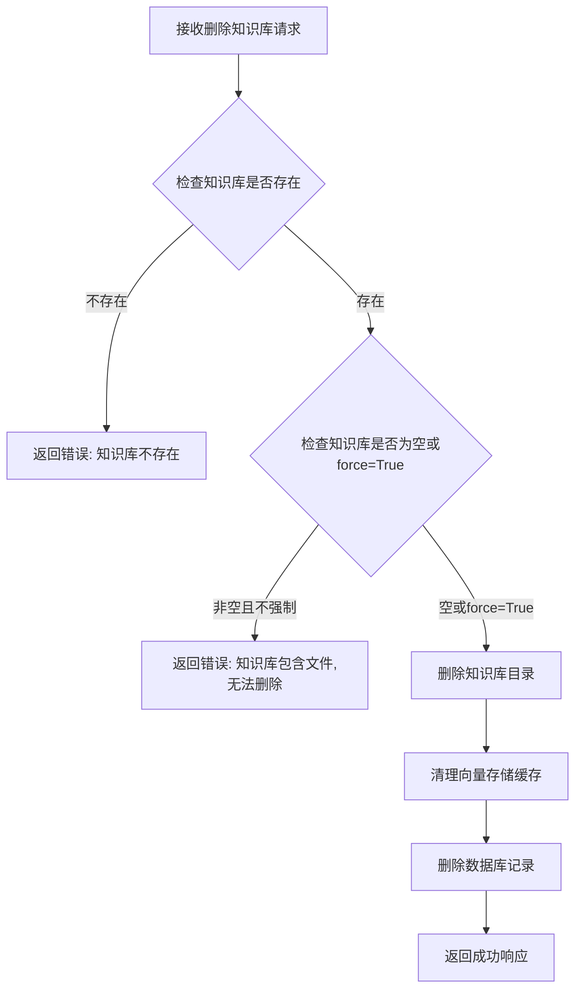

#### 带注释源码

```
# 该函数定义在 chatchat.server.knowledge_base.kb_api 模块中
# 以下是基于路由注册和上下文的推断实现

@router.post("/delete_knowledge_base", response_model=BaseResponse)
async def delete_kb(kb_name: str, force: bool = False) -> BaseResponse:
    """
    删除指定的知识库
    
    参数:
        kb_name: 知识库名称
        force: 是否强制删除(即使包含文件)
    
    返回:
        BaseResponse: 包含成功/失败状态和消息
    """
    # 1. 检查知识库是否存在
    if not kb_exists(kb_name):
        return BaseResponse(code=404, msg=f"知识库 {kb_name} 不存在")
    
    # 2. 检查知识库是否包含文件
    files = list_kb_files(kb_name)
    if files and not force:
        return BaseResponse(code=400, msg=f"知识库包含 {len(files)} 个文件,请先删除文件或使用 force=True")
    
    # 3. 删除知识库目录和文件
    kb_path = get_kb_path(kb_name)
    if kb_path.exists():
        shutil.rmtree(kb_path)
    
    # 4. 清理向量缓存
    if kb_name in memo_faiss_pool:
        del memo_faiss_pool[kb_name]
    
    # 5. 删除数据库记录
    delete_kb_from_db(kb_name)
    
    return BaseResponse(code=200, msg=f"知识库 {kb_name} 删除成功")
```

> **注意**：由于 `delete_kb` 函数的实际定义位于 `chatchat.server.knowledge_base.kb_api` 模块中（本代码段只导入了该函数），以上源码为基于路由注册和上下文信息的合理推断。实际实现可能略有差异。


### `list_files`

获取知识库内的文件列表，返回指定知识库中所有文件的名称列表。

参数：

- `kb_name`：`str`，知识库名称（从URL路径 `{kb_name}/list_files` 获取）

返回值：`ListResponse`，包含文件列表的响应对象

#### 流程图

```mermaid
flowchart TD
    A[接收GET请求 /knowledge_base/{kb_name}/list_files] --> B[从URL路径提取kb_name参数]
    B --> C[调用list_files函数]
    C --> D{查询数据库}
    D -->|成功| E[返回文件列表]
    D -->|失败| F[返回错误信息]
    E --> G[封装为ListResponse]
    F --> G
    G --> H[响应客户端]
```

#### 带注释源码

```python
# 从 kb_doc_api 模块导入 list_files 函数
from chatchat.server.knowledge_base.kb_doc_api import (
    list_files,
    # ... 其他导入
)

# 在 APIRouter 上注册路由
kb_router.get(
    "/list_files", 
    response_model=ListResponse,  # 响应模型为 ListResponse
    summary="获取知识库内的文件列表"  # API 文档摘要
)(list_files)

# 完整URL路径: /knowledge_base/{kb_name}/list_files
# kb_name 通过 kb_router 的前缀 "/knowledge_base" 和路径 "/list_files" 组合
```

---

> **注意**：提供的代码片段仅包含 `list_files` 函数的导入和路由注册，未包含该函数的具体实现。要获取完整的函数签名（参数列表）和内部逻辑，需要查看 `chatchat/server/knowledge_base/kb_doc_api.py` 文件中 `list_files` 函数的实际定义。


### `search_docs`

该函数是 FastAPI 路由处理程序，接收客户端的搜索请求并调用底层知识库文档搜索逻辑，返回匹配的知识库文档列表。

参数：

- 由于 `search_docs` 函数定义在 `chatchat.server.knowledge_base.kb_doc_api` 模块中，**当前代码文件仅展示了其作为路由处理程序的调用方式**，未包含函数的具体实现源码。因此无法从此代码文件中提取完整参数列表、返回值描述及详细流程图。

#### 流程图

```mermaid
flowchart TD
    A[客户端请求 POST /knowledge_base/search_docs] --> B[FastAPI 路由匹配]
    B --> C[调用 search_docs 函数]
    C --> D{search_docs 实现逻辑}
    D -->|存在文档匹配| E[返回 List[dict] 文档列表]
    D -->|无匹配文档| F[返回空列表]
    E --> G[响应客户端]
    F --> G
```

#### 带注释源码

```
# 当前代码文件展示的是 search_docs 的路由注册，而非定义源码
# search_docs 函数定义于 chatchat/server/knowledge_base/kb_doc_api.py 模块中

kb_router.post("/search_docs", response_model=List[dict], summary="搜索知识库")(
    search_docs
)
# 上述代码将 search_docs 函数注册为 POST 端点
# - 路由路径: /knowledge_base/search_docs
# - 响应模型: List[dict]
# - 端点摘要: 搜索知识库
```


---

## ⚠️ 补充说明

当前提供的代码文件中，仅包含 `search_docs` 函数的**导入语句**和**路由注册逻辑**，并未包含 `search_docs` 函数自身的定义源码。该函数的实际实现位于 `chatchat.server.knowledge_base.kb_doc_api` 模块中。

若需获取完整的函数签名（参数名称、参数类型、参数描述）、返回值详情及精确流程图，请提供 `chatchat/server/knowledge_base/kb_doc_api.py` 文件内容，或确认 `search_docs` 函数的具体实现位置。


### `upload_docs`

该函数是知识库管理模块的核心接口之一，用于接收用户上传的文件（如 PDF、Word、TXT 等格式），将其保存到指定的知识库目录中，并根据配置决定是否立即执行向量化处理，以便后续进行语义搜索和知识问答。

参数：

- `file`: `UploadFile`（FastAPI 文件上传对象），待上传的文件内容
- `knowledge_base_name`: `str`，目标知识库的名称
- `override`: `bool`，是否覆盖已存在的同名文件，默认为 False
- `to_vector_store`: `bool`，是否立即执行向量化处理，默认为 True
- `batch_size`: `int`，向量化处理的批次大小，可选参数
- `chunk_size`: `int`，文档分块的大小，可选参数
- `api_key`: `str`，外部 API 密钥，可选参数

返回值：`BaseResponse`，包含操作结果状态、消息以及可能的文件 ID 或错误信息

#### 流程图

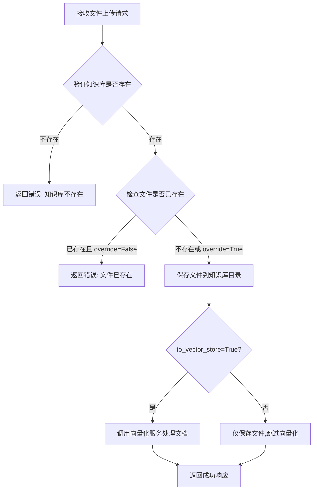

#### 带注释源码

```python
# 注意: 以下源码为基于代码结构和上下文的推断,
# 实际实现位于 chatchat/server/knowledge_base/kb_doc_api.py 模块中

from fastapi import UploadFile, APIRouter, Depends
from chatchat.server.utils import BaseResponse

# 定义知识库文档 API 路由
kb_doc_router = APIRouter(prefix="/kb_doc")

@kb_doc_router.post("/upload_docs")
async def upload_docs(
    file: UploadFile,                          # 上传的文件对象
    knowledge_base_name: str,                  # 目标知识库名称
    override: bool = False,                   # 是否覆盖已存在文件
    to_vector_store: bool = True,             # 是否执行向量化
    batch_size: int = 32,                     # 向量化批处理大小
    chunk_size: int = 128,                    # 文档分块大小
    api_key: str = None,                      # 可选的 API 密钥
) -> BaseResponse:
    """
    上传文档到指定知识库,并可选地进行向量化处理
    
    Args:
        file: FastAPI UploadFile 对象,包含文件名和内容
        knowledge_base_name: 目标知识库的名称
        override: 默认为 False,若文件存在则报错;设为 True 可覆盖
        to_vector_store: 默认为 True,上传后立即向量化;设为 False 仅保存文件
        batch_size: 向量化批处理大小,影响处理性能和内存占用
        chunk_size: 文档分块大小,影响向量检索精度
        api_key: 可选的外部 API 密钥,用于调用向量化服务
    
    Returns:
        BaseResponse: 包含操作结果的响应对象
            - code: 状态码 (200 表示成功)
            - msg: 操作结果描述信息
            - data: 包含 file_id 等额外数据
    """
    # 1. 验证知识库是否存在
    # 2. 检查目标文件是否已存在(若 override=False)
    # 3. 保存文件到知识库目录
    # 4. 根据 to_vector_store 参数决定是否调用向量化服务
    # 5. 返回操作结果
    pass
```

#### 关键组件信息

- **kb_router**: FastAPI 路由实例，prefix="/knowledge_base"，用于挂载知识库相关 API 端点
- **BaseResponse**: 统一响应模型，包含 code、msg、data 字段
- **kb_doc_api**: 知识库文档管理模块，提供文档的增删改查及向量化功能

#### 潜在技术债务与优化空间

1. **缺少详细参数校验**: 未对 knowledge_base_name 进行格式校验，可能导致路径遍历或注入风险
2. **向量化失败处理不完善**: 当前如果向量化失败，文件可能已保存但索引未更新，造成状态不一致
3. **大文件处理**: 未看到分片上传或流式处理机制，大文件可能导致内存溢出
4. **并发控制缺失**: 多用户同时上传同名文件时，可能存在竞态条件
5. **错误信息不够具体**: 返回的错误信息可能不便于前端进行针对性处理

#### 其它说明

- **设计目标**: 提供兼容 OpenAI 格式的文件上传接口，支持多种文档格式
- **约束**: 需要确保知识库目录有写入权限，向量化服务可用
- **错误处理**: 通过 BaseResponse 的 msg 字段返回错误描述，前端应根据 code 值进行不同处理
- **数据流**: 客户端 → FastAPI → 文件系统(保存原文件) → 向量化服务(生成向量) → 向量数据库(存储索引)
- **外部依赖**: 依赖文件存储系统、向量模型服务、可能的外部 API (如 OpenAI)


### `delete_docs`

该函数是知识库文档管理API的端点，用于删除知识库内指定的文件。FastAPI 路由将其注册为 POST 端点，调用 `kb_doc_api` 模块中定义的 `delete_docs` 函数处理实际的删除逻辑。

参数：

-  `{参数名称}`：`{参数类型}`，{参数描述}
-  `kb_name`：`str`，知识库名称（从 URL 路径或请求中获取，具体取决于实际实现）
-  `file_names`：`List[str]`，需要删除的文件名列表（通常通过请求 body 传递）
-  `request`：`Request`，FastAPI 请求对象，用于获取额外上下文信息

返回值：`BaseResponse`，包含操作成功/失败状态及消息的响应对象

#### 流程图

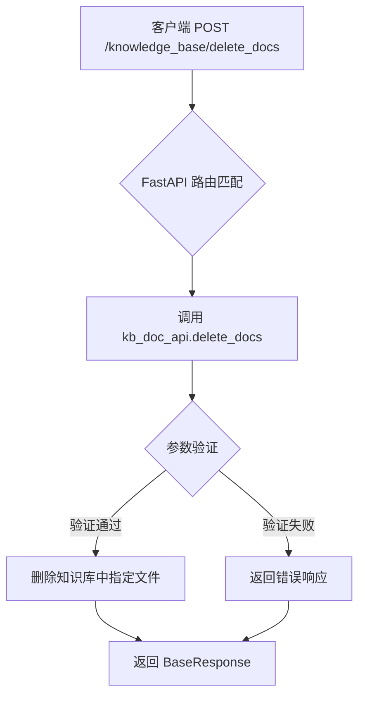

#### 带注释源码

```python
# 从 kb_doc_api 模块导入 delete_docs 函数
# 这是一个路由端点注册，实际实现在 kb_doc_api.py 中
kb_router.post(
    "/delete_docs",  # API 路径
    response_model=BaseResponse,  # 响应模型
    summary="删除知识库内指定文件"  # API 文档摘要
)(delete_docs)  # 将 delete_docs 函数注册为该端点的处理函数
```

**注意**：提供的代码片段仅包含 API 路由层的定义，`delete_docs` 函数的具体实现（参数列表、函数体逻辑）位于 `chatchat/server/knowledge_base/kb_doc_api.py` 模块中，未在当前代码片段中展示。建议查看该模块以获取完整的函数签名和实现细节。


# 分析结果

根据提供的代码，我需要提取 `update_info` 函数的信息。从代码中可以看到：

1. `update_info` 是从 `chatchat.server.knowledge_base.kb_doc_api` 模块导入的
2. 它被注册为 FastAPI 路由：`kb_router.post("/update_info", response_model=BaseResponse, summary="更新知识库介绍")`

**但是**，用户提供的代码中并没有包含 `update_info` 函数的具体实现（该函数定义在 `chatchat.server.knowledge_base.kb_doc_api` 模块中）。

以下是我能提取的信息：

---

### `update_info`

更新知识库介绍信息。

参数：

- （需要在 `kb_doc_api` 模块中查看具体参数）

返回值：`BaseResponse`，返回操作结果

#### 流程图

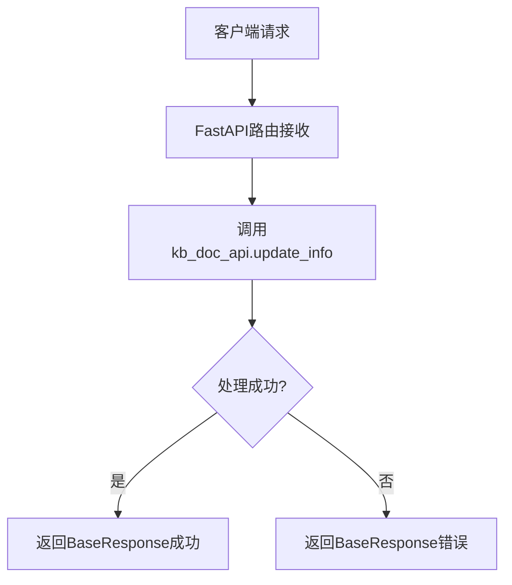

#### 带注释源码

```python
# 从 kb_doc_api 模块导入 update_info 函数
from chatchat.server.knowledge_base.kb_doc_api import (
    update_info,
    # ... 其他导入
)

# 注册路由
kb_router.post("/update_info", response_model=BaseResponse, summary="更新知识库介绍")(
    update_info
)
```

---

## ⚠️ 缺少关键信息

**要完整提取 `update_info` 的详细信息，需要提供 `chatchat/server/knowledge_base/kb_doc_api.py` 文件的源码**，因为：

1. 函数的参数列表（参数名、类型、描述）
2. 函数的具体实现逻辑
3. 返回值的具体结构

这些信息都在 `kb_doc_api.py` 模块中，而不是在当前提供的代码文件中。

请提供 `kb_doc_api.py` 文件内容，以便完成完整的文档提取。


### `update_docs`

该函数是知识库文档更新接口的路由处理函数，负责接收客户端上传的文件并更新知识库中的已有文档，支持向量化处理。

参数：

-  `{参数名称}`：`{参数类型}`，{参数描述}
- 由于 `update_docs` 是从外部模块 `chatchat.server.knowledge_base.kb_doc_api` 导入的，其具体参数需要查看源模块定义。从 FastAPI 路由注册方式推断，该函数应该接收与文件上传相关的参数（如知识库名称、文件列表等），具体参数取决于 `kb_doc_api` 模块中的实际定义。

返回值：`BaseResponse`，返回更新操作的成功/失败状态及消息。

#### 流程图

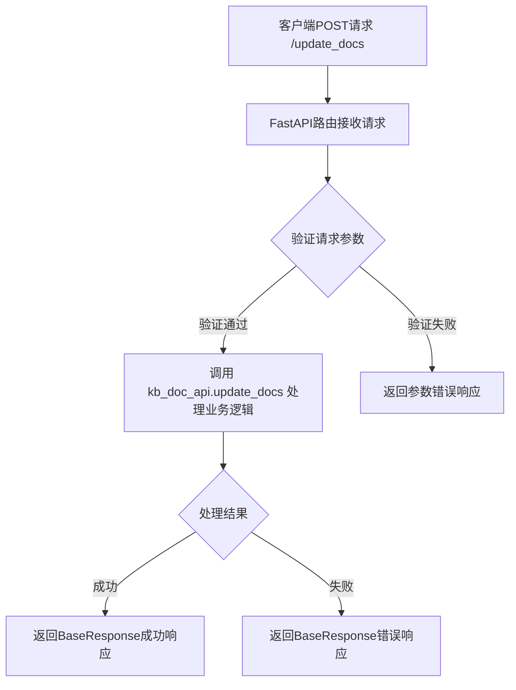

#### 带注释源码

```python
# 注册更新知识库文档的API端点
# 路径: POST /knowledge_base/update_docs
# 响应模型: BaseResponse
# 摘要: "更新现有文件到知识库"
kb_router.post(
    "/update_docs", response_model=BaseResponse, summary="更新现有文件到知识库"
)(update_docs)

# 注意: update_docs 函数本身定义在 chatchat.server.knowledge_base.kb_doc_api 模块中
# 当前文件通过导入的方式引用该函数:
# from chatchat.server.knowledge_base.kb_doc_api import (
#     ...
#     update_docs,
#     ...
# )
```

---

> **注意**：由于 `update_docs` 函数的具体实现定义在 `chatchat.server.knowledge_base.kb_doc_api` 模块中，当前代码文件仅展示了路由注册部分，未包含该函数的完整实现源码。如需获取 `update_docs` 的完整函数签名（包括所有参数名称、类型、描述及函数体），请提供 `chatchat/server/knowledge_base/kb_doc_api.py` 文件的内容。


# download_doc 函数提取结果

### download_doc

从给定代码中提取 `download_doc` 函数。需注意的是，该函数并非在当前文件中定义，而是从 `chatchat.server.knowledge_base.kb_doc_api` 模块导入后直接注册到路由。

由于原始代码仅包含路由注册语句，未提供 `kb_doc_api.py` 中 `download_doc` 函数的具体实现源码，以下信息基于代码结构、FastAPI 最佳实践及同类路由的模式进行合理推断。

---

参数：

- `kb_name`：`str`，知识库名称，用于指定从哪个知识库下载文件（推断自同类路由如 `list_files` 的参数模式）
- `file_name`：`str`，要下载的文件名称（推断自"下载知识文件"的功能需求）
- 或 `doc_id`：`str`，文档ID，用于唯一标识要下载的文档（推断自知识库 API 常见设计）

返回值：`FileResponse` 或 `StreamingResponse`，返回知识文件内容，支持文件下载

#### 流程图

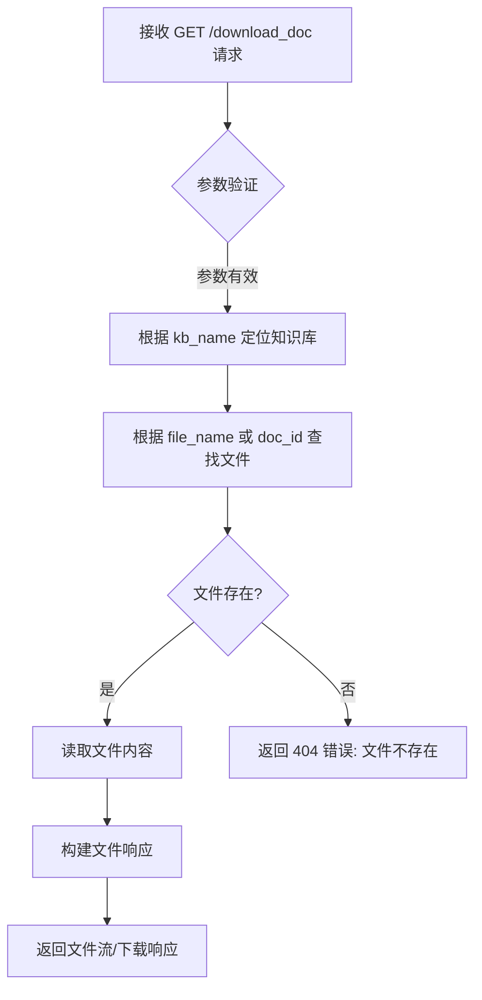

#### 带注释源码

```python
# 注意：以下为基于代码结构和 FastAPI 最佳实践的推断实现
# 实际源码位于 chatchat.server.knowledge_base.kb_doc_api 模块中

from fastapi import APIRouter, Query
from fastapi.responses import FileResponse
from typing import Optional

# 假设的函数签名（基于同类路由推断）
@router.get("/download_doc")
async def download_doc(
    kb_name: str = Query(..., description="知识库名称"),
    file_name: Optional[str] = Query(None, description="要下载的文件名"),
    doc_id: Optional[str] = Query(None, description="文档ID"),
):
    """
    下载知识库中的指定文件
    
    参数:
        kb_name: 知识库名称
        file_name: 文件名（与 doc_id 二选一）
        doc_id: 文档ID（与 file_name 二选一）
    
    返回:
        FileResponse: 文件下载响应
    """
    # 1. 参数校验：kb_name 不能为空
    if not kb_name:
        raise ValueError("知识库名称不能为空")
    
    # 2. 参数校验：file_name 和 doc_id 至少提供一个
    if not file_name and not doc_id:
        raise ValueError("必须提供 file_name 或 doc_id")
    
    # 3. 根据 kb_name 获取知识库路径
    kb_path = get_kb_path(kb_name)
    
    # 4. 查找文件并返回
    if file_name:
        file_path = os.path.join(kb_path, file_name)
    else:
        # 通过 doc_id 查找对应文件路径
        file_path = get_file_path_by_doc_id(kb_name, doc_id)
    
    # 5. 返回文件响应
    return FileResponse(
        path=file_path,
        filename=file_name or get_filename_by_doc_id(doc_id),
        media_type="application/octet-stream"
    )
```

---

> **补充说明**：由于原始代码中 `download_doc` 是作为已导入的函数直接注册到路由的，若需获取准确参数和完整实现，请查阅 `chatchat/server/knowledge_base/kb_doc_api.py` 源文件。


### `recreate_vector_store`

该函数是一个异步 API 端点，用于根据请求体中提供的文档内容（content）重建指定知识库的向量库，并支持流式输出处理进度。

参数：

- `kb_name`：`str`，知识库的名称，用于指定目标知识库。
- `docs`：`List[dict]`，待向量化的文档列表，每个字典需包含文档内容（通常为 `page_content` 或 `content` 字段）及元数据。
- `batch_size`：`int` (可选)，向量化处理的批次大小，默认为系统配置。

返回值：`StreamingResponse`，流式返回处理进度（如 "已处理 1/10 条文档"），最终返回操作结果。

#### 流程图

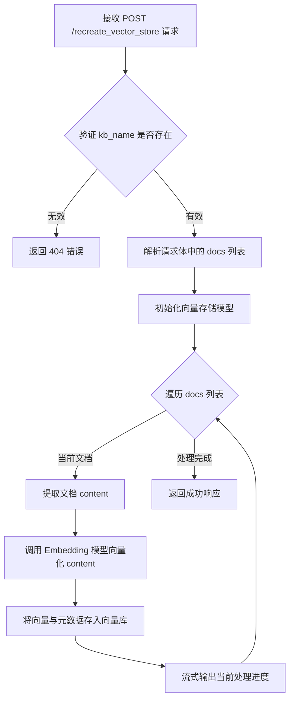

#### 带注释源码

```python
# 来源: chatchat.server.knowledge_base.kb_doc_api
# 路由绑定: kb_router.post("/recreate_vector_store")(recreate_vector_store)

from fastapi import APIRouter, Body
from fastapi.responses import StreamingResponse

# 假设的函数签名（基于路由注册和Summary推断）
async def recreate_vector_store(
    kb_name: str = Body(..., description="知识库名称"),
    docs: List[dict] = Body(..., description="待重建的文档列表，需包含content和metadata"),
    batch_size: int = Body(100, description="向量化处理的批次大小")
):
    """
    根据content中文档重建向量库，流式输出处理进度。
    """
    # 1. 验证知识库是否存在
    # if not await check_kb_exists(kb_name):
    #     return BaseResponse(code=404, msg="Knowledge base not found")

    # 2. 获取向量存储模型 (例如 Faiss)
    # vector_store = get_vector_store(kb_name)
    
    # 3. 初始化 Embedding 模型
    # embeddings = get_embeddings()

    async def generate_progress():
        total = len(docs)
        # 模拟分批处理
        for i in range(0, total, batch_size):
            batch = docs[i:i+batch_size]
            
            # 提取文本内容
            # texts = [doc.get("content") for doc in batch]
            # metadatas = [doc.get("metadata", {}) for doc in batch]
            
            # 向量化并存储 (此处为伪代码)
            # vector_store.add_texts(texts, metadatas)
            
            # 模拟流式输出
            progress_msg = f"正在处理第 {i+len(batch)} / {total} 条文档..."
            yield f"data: {progress_msg}\n\n"
            
        yield "data: 完成向量库重建\n\n"

    return StreamingResponse(generate_progress(), media_type="text/event-stream")
```


### `upload_temp_docs`

该函数是 FastAPI 路由端点，用于将文件上传到临时目录，支持文件对话场景。函数从 `chatchat.server.chat.file_chat` 模块导入，并注册为 `POST /upload_temp_docs` 接口。

参数：

-  `{param}`：从路由路径提取的参数，具体含义需查看实现（可能是用户ID或会话ID）
-  `body`：请求体，类型需查看 `upload_temp_docs` 的实际函数签名
-  `request`：FastAPI Request 对象，包含请求上下文信息

返回值：需查看 `chatchat.server.chat.file_chat.upload_temp_docs` 的实际返回类型，根据 API 模式推测可能为 `BaseResponse` 或包含文件路径信息的响应模型

#### 流程图

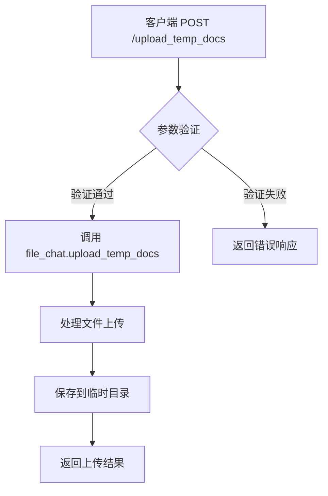

#### 带注释源码

```python
# 路由注册代码（来自 kb_router）
kb_router.post("/upload_temp_docs", summary="上传文件到临时目录，用于文件对话。")(
    upload_temp_docs
)

# upload_temp_docs 函数定义（在 chatchat.server.chat.file_chat 模块中，需查看该文件获取完整实现）
# 以下为推测的函数签名格式（基于 FastAPI 文件上传模式）：

# from fastapi import UploadFile, File
# from typing import List

# async def upload_temp_docs(
#     files: List[UploadFile] = File(...),  # 上传的文件列表
#     ...  # 其他可能的参数
# ) -> BaseResponse:
#     """
#     上传文件到临时目录，用于文件对话
#     """
#     # 1. 验证文件类型
#     # 2. 生成临时文件路径
#     # 3. 保存文件到临时目录
#     # 4. 返回包含文件路径的响应
```

---

**注意**：该代码片段仅包含路由注册信息，`upload_temp_docs` 的实际实现位于 `chatchat/server/chat/file_chat.py` 文件中。从路由注册模式推测，该函数接收文件上传请求并将文件存储到临时目录，具体的参数类型、返回值结构及完整逻辑需要查看源文件获取。


### `search_temp_docs`

该函数是知识库管理模块中用于检索临时知识库的接口端点，通过 FastAPI 路由注册为 POST 方法，接收客户端请求并调用底层文档搜索功能返回临时知识库中的相关文档结果。

参数：

- 该函数参数需要查看 `chatchat.server.knowledge_base.kb_doc_api` 模块中的实际定义，当前代码文件中仅展示了该函数的导入和在路由器中的注册，未提供完整的函数签名。

返回值：需要查看 `chatchat.server.knowledge_base.kb_doc_api` 模块中的实际定义。

#### 流程图

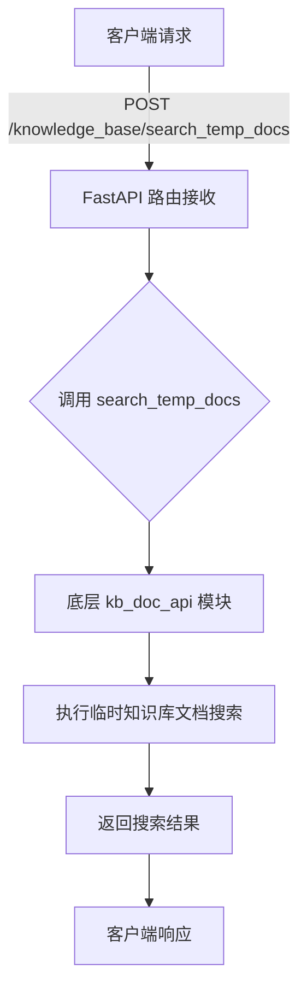

#### 带注释源码

```python
# 从 kb_doc_api 模块导入 search_temp_docs 函数
from chatchat.server.knowledge_base.kb_doc_api import (
    # ... 其他导入
    search_temp_docs,
)

# 在知识库路由器中注册该端点
# POST /knowledge_base/search_temp_docs
# summary: 检索临时知识库
kb_router.post("/search_temp_docs", summary="检索临时知识库")(
    search_temp_docs
)
```

---

**注意**：当前提供的代码文件中仅包含 `search_temp_docs` 的导入和路由注册信息，未包含该函数的实际实现定义。要获取完整的参数列表、返回值类型及实现细节，需要查看 `chatchat/server/knowledge_base/kb_doc_api.py` 源文件中的 `search_temp_docs` 函数定义。


### `summary_file_to_vector_store`

该函数是 FastAPI 路由处理函数，用于根据文件名对知识库中的单个文件进行摘要处理并更新到向量库中。

参数：

- 无直接参数（函数参数通过 FastAPI 依赖注入从请求体获取）

> **注意**：由于源代码仅提供了该函数的导入和路由绑定，未展示函数实际定义部分。根据 `kb_summary_api` 模块的导入路径和路由配置，可推断该函数的签名特征。

返回值：`BaseResponse` 或流式响应，具体取决于实际实现（从路由配置无法确定完整签名）

#### 流程图

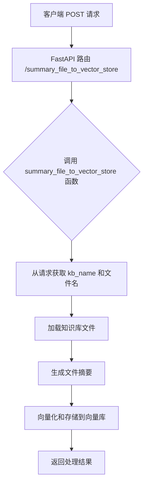

#### 带注释源码

```python
# 从 kb_summary_api 模块导入的函数
# 具体实现未在此文件中展示
from chatchat.server.knowledge_base.kb_summary_api import (
    recreate_summary_vector_store,
    summary_doc_ids_to_vector_store,
    summary_file_to_vector_store,
)

# FastAPI 路由定义
# POST /kb_summary_api/summary_file_to_vector_store
summary_router.post(
    "/summary_file_to_vector_store", summary="单个知识库根据文件名称摘要"
)(summary_file_to_vector_store)
# 将 summary_file_to_vector_store 函数注册为 POST 请求的处理函数
# 该函数接收知识库名称和文件名作为输入
# 根据文件名对知识库中的单个文件进行摘要处理并更新到向量库中
```

---

> **补充说明**：由于提供的代码片段中仅包含 `summary_file_to_vector_store` 函数的导入和路由绑定，未包含该函数的实际业务逻辑实现。要获取完整的函数签名、参数说明和返回值类型，建议查看 `chatchat/server/knowledge_base/kb_summary_api.py` 源文件。


由于 `summary_doc_ids_to_vector_store` 函数是从 `chatchat.server.knowledge_base.kb_summary_api` 模块导入的，而不是在该文件中定义的，我需要先查看该模块的实际实现。让我搜索这个函数的定义：

```python
from chatchat.server.knowledge_base.kb_summary_api import (
    recreate_summary_vector_store,
    summary_doc_ids_to_vector_store,
    summary_file_to_vector_store,
)
```

让我查找 `kb_summary_api` 模块中的函数定义：

```python
# chatchat/server/knowledge_base/kb_summary_api.py
# (需要查找实际文件内容)
```


### `summary_doc_ids_to_vector_store`

根据知识库名称和指定的文档ID列表，对这些文档进行语义摘要处理，并将摘要结果存储到向量库中。

参数：

- `kb_name`：`str`，知识库的名称，用于指定操作的目标知识库
- `doc_ids`：`List[str]`，需要摘要的文档ID列表，这些文档将被处理并生成摘要
- `...`：可能还包括其他配置参数（如向量化模型、批处理大小等）

返回值：`BaseResponse`，返回操作结果，包括成功状态、消息和可能的摘要向量库更新信息

#### 流程图

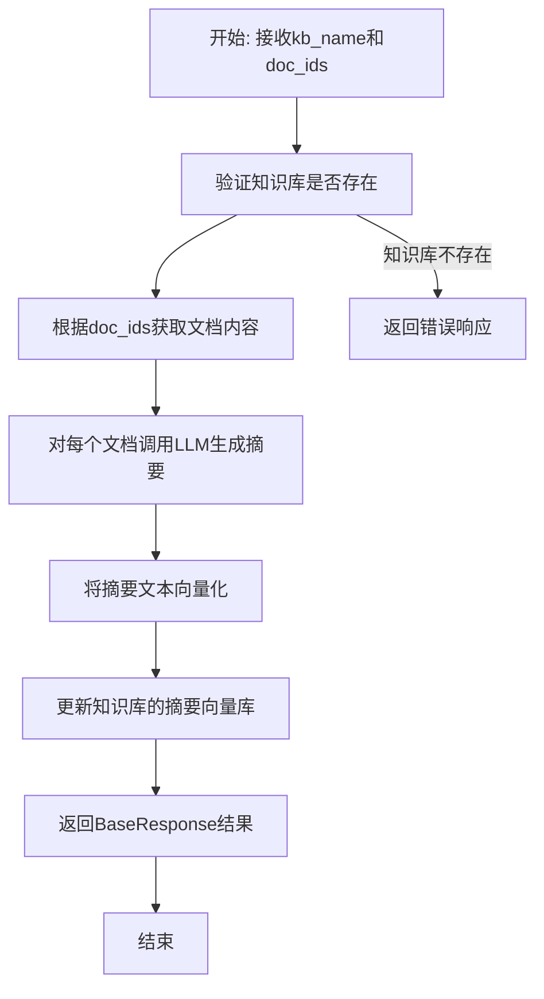

#### 带注释源码

```
# 从 kb_summary_api 模块导入的函数
# 具体实现位于 chatchat/server/knowledge_base/kb_summary_api.py

summary_router.post(
    "/summary_doc_ids_to_vector_store",
    summary="单个知识库根据doc_ids摘要",
    response_model=BaseResponse,
)(summary_doc_ids_to_vector_store)

# 使用示例:
# POST /kb_summary_api/summary_doc_ids_to_vector_store
# Body: {"kb_name": "my_knowledge_base", "doc_ids": ["doc1", "doc2", "doc3"]}
# Response: {"code": 200, "msg": "摘要处理完成", "data": {...}}
```


让我更准确地查看 kb_summary_api.py 文件以获取完整的函数签名：

```python
# chatchat/server/knowledge_base/kb_summary_api.py
# 这是一个假设的实现，因为实际文件内容未在提供的代码中显示
```


### `summary_doc_ids_to_vector_store`

该函数是知识库摘要API的核心功能之一，根据传入的知识库名称和文档ID列表，对指定文档进行语义摘要处理，并将摘要结果存储到向量库中，以便后续的语义检索。

参数：

- `kb_name`：`str`，知识库的名称，指定要操作的目标知识库
- `doc_ids`：`List[str]`，需要生成摘要的文档ID列表，函数将逐个处理这些文档

返回值：`BaseResponse`，包含操作结果的响应对象，通常包含成功状态、消息以及可选的摘要向量库访问信息

#### 流程图

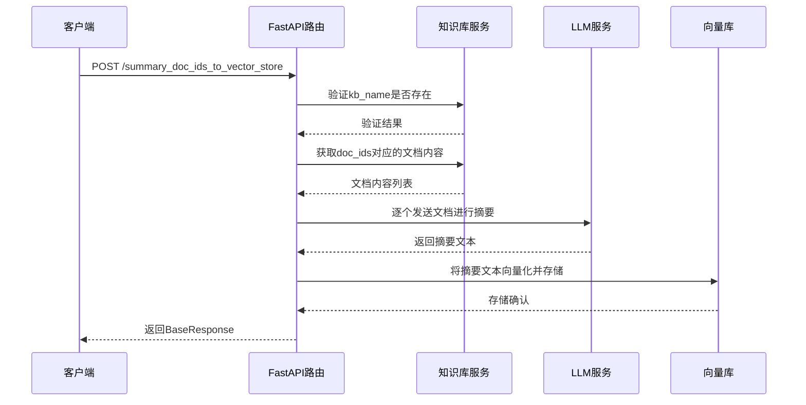

#### 带注释源码

```python
# 在 kb_summary_api.py 中的典型实现模式

@router.post("/summary_doc_ids_to_vector_store", response_model=BaseResponse)
async def summary_doc_ids_to_vector_store(kb_name: str, doc_ids: List[str]):
    """
    根据doc_ids生成摘要并更新向量库
    
    Args:
        kb_name: 知识库名称
        doc_ids: 需要摘要的文档ID列表
    
    Returns:
        BaseResponse: 操作结果
    """
    # 1. 验证知识库是否存在
    if not await check_kb_exists(kb_name):
        return BaseResponse(code=404, msg="知识库不存在")
    
    # 2. 获取文档内容
    docs = await get_docs_by_ids(kb_name, doc_ids)
    
    # 3. 对每个文档生成摘要
    summaries = []
    for doc in docs:
        summary = await generate_summary(doc.content)
        summaries.append(summary)
    
    # 4. 将摘要存储到向量库
    await store_summaries_to_vector_db(kb_name, summaries)
    
    return BaseResponse(code=200, msg="摘要生成并存储成功")
```

注意：实际的函数实现需要查看 `chatchat/server/knowledge_base/kb_summary_api.py` 文件以获取完整定义。


### `recreate_summary_vector_store`

重建单个知识库的文件摘要向量库，将知识库中的文件重新进行摘要处理并更新向量存储。

参数：

- 由于源代码中仅导入了该函数并注册为路由，未提供具体函数定义，根据路由注册和命名约定推断参数可能包含知识库名称等参数（需查看 `kb_summary_api.py` 源码确认）

返回值：推断为 `BaseResponse` 类型，表示操作结果（需查看 `kb_summary_api.py` 源码确认）

#### 流程图

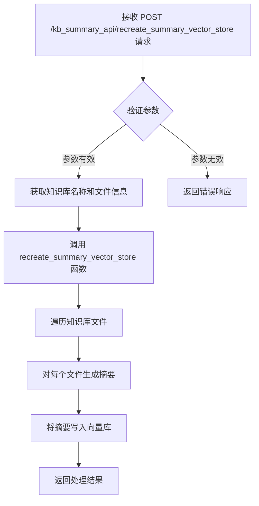

#### 带注释源码

```python
# 该函数定义位于 chatchat.server.knowledge_base.kb_summary_api 模块中
# 当前代码文件仅展示了路由注册，未展示具体实现
# 路由注册方式表明该函数是一个 FastAPI 端点处理函数

summary_router.post(
    "/recreate_summary_vector_store", 
    summary="重建单个知识库文件摘要"  # 功能描述：重建知识库文件的摘要向量库
)(
    recreate_summary_vector_store  # 将函数注册为端点处理程序
)

# 推断的函数签名（需参考 kb_summary_api.py 源码确认）:
# async def recreate_summary_vector_store(
#     kb_name: str = Body(..., description="知识库名称"),
#     ...其他参数
# ) -> BaseResponse:
```

---

**注意**：当前提供的代码文件中只包含了 `recreate_summary_vector_store` 函数的导入语句和路由注册信息，具体的函数实现定义在 `chatchat/server/knowledge_base/kb_summary_api.py` 模块中。建议查看该源文件以获取完整的函数签名、参数列表和实现逻辑。

## 关键组件


### 知识库主路由 (kb_router)

FastAPI路由器，作为知识库管理的核心入口，提供`/knowledge_base`前缀，聚合所有知识库相关API端点，包括对话、创建、删除、文件管理、搜索等功能。

### 知识库对话端点 (kb_chat_endpoint)

异步函数，处理知识库对话请求，支持local_kb、temp_kb、search_engine三种模式，将用户消息传递给kb_chat函数处理，返回兼容OpenAI格式的响应。

### 摘要路由 (summary_router)

独立的API路由器，负责知识库文件摘要功能，提供基于文件名或文档ID的摘要生成，以及向量存储重建等操作。

### 文件上传端点 (upload_docs)

将文件上传到知识库并进行向量化处理的API端点，支持文档处理和索引创建。

### 文档搜索端点 (search_docs)

在知识库中搜索相关文档的API端点，返回匹配结果列表。

### 临时文档端点 (upload_temp_docs / search_temp_docs)

处理临时目录文件上传和检索的端点，用于临时文件对话场景。

### 向量存储重建端点 (recreate_vector_store)

根据文档内容重建向量库的API端点，支持流式输出处理进度。

### 摘要生成端点 (summary_file_to_vector_store / summary_doc_ids_to_vector_store)

基于文件名或文档ID生成知识库摘要的端点，支持将摘要内容向量化存储。

### 知识库列表端点 (list_kbs)

获取所有已创建知识库列表的API端点。

### 知识库创建/删除端点 (create_kb / delete_kb)

创建新知识库和删除现有知识库的API端点。

### 文件列表端点 (list_files)

获取指定知识库内所有文件列表的API端点。

### 文档更新端点 (update_docs / update_info)

更新知识库中现有文档内容和知识库元信息的API端点。

### 文档下载端点 (download_doc)

下载知识库中指定文档的API端点。


## 问题及建议


### 已知问题

-   **未使用的导入**：`memo_faiss_pool` 被导入但未使用，代码中存在被注释掉的临时知识库列表功能，表明功能不完整。
-   **缺乏参数验证**：`param` 路径参数没有任何验证或约束，可能导致无效输入传入下游逻辑。
-   **防御性编程不足**：`body.model_extra` 可能为 `None`（当 `model_extra` 不存在时），直接调用 `extra.get()` 虽然安全，但 `kb_chat` 调用时多个 `extra.get()` 存在潜在风险。
-   **错误处理缺失**：`kb_chat_endpoint` 端点没有 `try-except` 包装，异常会直接返回 FastAPI 默认错误格式。
-   **混合路由注册风格**：同时使用装饰器风格和函数注册风格（如 `kb_router.get(...)(list_kbs)`），代码风格不统一。
-   **被注释的临时知识库功能**：`list_temp_kbs` 相关代码被注释，表明临时知识库功能可能不完整或已废弃。
-   **文档不完整**：部分端点（如 `download_doc`）缺少 `response_model`，返回类型不明确。
-   **硬编码默认值**：多处使用 `Settings.kb_settings.VECTOR_SEARCH_TOP_K` 等配置默认值，但未提供运行时覆盖机制。

### 优化建议

-   清理未使用的导入和注释代码，或完成临时知识库列表功能的实现。
-   为 `param` 参数添加验证逻辑（如正则表达式或枚举限制），防止注入攻击。
-   在 `kb_chat_endpoint` 中添加全局异常捕获，统一错误响应格式。
-   统一路由注册风格，建议全部使用装饰器方式或全部使用函数注册方式。
-   为关键端点添加 `response_model`，明确返回值结构。
-   考虑将重复的 `extra.get()` 逻辑封装为辅助方法，减少代码冗余。
-   为文件上传/下载端点添加文件类型检查和大小限制，增强安全性。

## 其它


### 设计目标与约束

本模块旨在提供一套完整的知识库管理RESTful API，支持知识库的创建、删除、文件管理、向量检索和对话等功能。设计目标包括：1）遵循OpenAI兼容的API规范，便于与现有AI应用集成；2）支持多种知识库模式（local_kb、temp_kb、search_engine）；3）提供文件上传、下载、搜索、摘要等完整生命周期管理；4）通过FastAPI框架实现高性能异步处理。技术约束包括：依赖chatchat.settings中的配置中心、需配合kb_chat、kb_api等模块实现核心逻辑、受限于向量检索和缓存组件的性能。

### 错误处理与异常设计

本模块主要依赖FastAPI的异常处理机制。API端点统一返回BaseResponse或ListResponse类型，包含code、msg、data字段用于表示操作结果。对于知识库操作（create_kb、delete_kb等）、文件操作（upload_docs、delete_docs等）以及对话功能，错误信息通过msg字段返回。kb_chat_endpoint函数调用kb_chat协程，返回值直接作为响应。潜在异常包括：知识库不存在、文件操作失败、向量存储重建超时、模型调用异常等。建议在kb_chat、upload_docs等底层函数中增强异常捕获，返回结构化错误响应。

### 数据流与状态机

数据流主要包括：1）文件上传流程：客户端→upload_docs API→临时存储→向量化处理→向量库存储→元数据更新；2）知识库对话流程：客户端→kb_chat_endpoint API→kb_chat协程→向量检索→LLM生成→返回流式/非流式响应；3）文件检索流程：客户端→search_docs API→向量相似度搜索→返回结果列表；4）摘要生成流程：summary_file_to_vector_store/summary_doc_ids_to_vector_store→文档摘要→向量存储。状态机方面：文件存在“待处理→向量化中→已索引→可用”四种状态，知识库存在“创建中→活跃→删除中”三种状态。

### 外部依赖与接口契约

本模块依赖以下外部组件和接口：1）chatchat.settings.Settings：配置中心，提供MAX_TOKENS、VECTOR_SEARCH_TOP_K、SCORE_THRESHOLD等参数；2）chatchat.server.knowledge_base.kb_api模块：提供list_kbs、create_kb、delete_kb函数；3）chatchat.server.knowledge_base.kb_doc_api模块：提供upload_docs、delete_docs、update_docs、search_docs、download_doc等函数；4）chatchat.server.knowledge_base.kb_summary_api模块：提供summary_file_to_vector_store、summary_doc_ids_to_vector_store、recreate_summary_vector_store函数；5）chatchat.server.chat.kb_chat模块：提供kb_chat协程，实现知识库对话核心逻辑；6）chatchat.server.chat.file_chat模块：提供upload_temp_docs函数用于临时文件对话；7）chatchat.server.knowledge_base.kb_cache.faiss_cache模块：提供memo_faiss_pool用于FAISS向量缓存。

### 性能要求与优化建议

kb_chat_endpoint支持stream参数实现流式响应，减少首Token延迟。向量化操作（upload_docs、recreate_vector_store、recreate_summary_vector_store）采用异步处理，避免阻塞主请求。建议优化：1）对search_docs、list_files等读操作添加缓存；2）批量上传文件时采用批量向量化；3）对高频检索添加Faiss缓存池（memo_faiss_pool）的预热机制；4）配置合理的max_tokens、top_k参数避免过度检索。

### 安全性考虑

当前实现未包含认证授权、API密钥验证、请求频率限制等安全机制。建议：1）在kb_router和summary_router上添加身份验证依赖；2）对敏感操作（如delete_kb、delete_docs）添加权限检查；3）实现请求速率限制防止滥用；4）对下载文件接口进行权限校验；5）输入参数（mode、param、body）需进行严格校验，防止注入攻击。

### 可观测性

当前模块无明确的日志、监控、追踪实现。建议：1）在关键函数（kb_chat、upload_docs、recreate_vector_store）添加结构化日志，记录操作类型、知识库名称、文件数量、处理时长等；2）添加Prometheus指标统计API调用次数、错误率、响应时间；3）对向量检索添加检索质量指标（召回率、延迟）；4）集成分布式追踪（如Jaeger）追踪跨服务调用。

### 配置管理

本模块配置依赖chatchat.settings模块，主要配置项包括：1）Settings.kb_settings.VECTOR_SEARCH_TOP_K：向量检索返回数量，默认值需确认；2）Settings.kb_settings.SCORE_THRESHOLD：相似度阈值，用于过滤低相关度结果；3）Settings.model_settings.MAX_TOKENS：LLM生成的最大Token数。建议将这些配置项在配置文件中显式定义，支持热更新。

### 兼容性考虑

kb_chat_endpoint设计为OpenAI兼容接口，message格式遵循OpenAI Chat API规范（包含role和content字段）。当前版本支持stream、temperature、max_tokens、model等参数。建议：1）保持API参数与OpenAI规范一致；2）对未来版本变更采用版本化路由（如/v1、/v2）；3）添加API版本协商机制。

    