# `Langchain-Chatchat\libs\chatchat-server\chatchat\server\api_server\mcp_routes.py` 详细设计文档

这是一个FastAPI路由模块，提供MCP（Model Context Protocol）连接的完整CRUD管理功能，包括MCP通用配置（Profile）的创建、查询、更新、重置和删除，以及连接配置的创建、列表查询、详情获取、更新、删除、启用、禁用、搜索和按服务器名称查询等操作。

## 整体流程

```mermaid
graph TD
    A[客户端请求] --> B{请求路径}
    B --> C[/profile 相关]
    B --> D[/ 连接相关]
    B --> E[/{connection_id} 相关]
    B --> F[/search 相关]
    B --> G[/server/{server_name}]
    B --> H[/enabled/list]
    
    C --> C1[GET /profile - 获取配置]
    C --> C2[POST /profile - 创建/更新配置]
    C --> C3[PUT /profile - 更新配置]
    C --> C4[POST /profile/reset - 重置配置]
    C --> C5[DELETE /profile - 删除配置]
    
    D --> D1[POST / - 创建连接]
    D --> D2[GET / - 获取连接列表]
    
    E --> E1[GET /{connection_id} - 获取详情]
    E --> E2[PUT /{connection_id} - 更新连接]
    E --> E3[DELETE /{connection_id} - 删除连接]
    E --> E4[POST /{connection_id}/enable - 启用]
    E --> E5[POST /{connection_id}/disable - 禁用]
    
    F --> F1[POST /search - 搜索连接]
    G --> G1[GET /server/{server_name} - 按名称查询]
    H --> H1[GET /enabled/list - 获取已启用连接]
```

## 类结构

```
mcp_router (APIRouter - 主路由)
├── MCP Profile 端点组
│   ├── get_mcp_profile_endpoint
│   ├── create_or_update_mcp_profile
│   ├── update_mcp_profile_endpoint
│   ├── reset_mcp_profile_endpoint
│   └── delete_mcp_profile_endpoint
├── MCP Connection 端点组
│   ├── create_mcp_connection
│   ├── list_mcp_connections
│   ├── get_mcp_connection
│   ├── update_mcp_connection_by_id
│   ├── delete_mcp_connection_by_id
│   ├── enable_mcp_connection_endpoint
│   ├── disable_mcp_connection_endpoint
│   ├── search_mcp_connections_endpoint
│   ├── get_connections_by_server_name
│   └── list_enabled_mcp_connections
└── 辅助函数
    └── model_to_response
```

## 全局变量及字段


### `logger`
    
用于记录系统运行日志的日志记录器实例

类型：`Logger`
    


### `mcp_router`
    
FastAPI路由实例，用于定义MCP连接相关的API端点

类型：`APIRouter`
    


    

## 全局函数及方法


### `model_to_response`

将数据库模型（ORM对象）转换为 API 响应专用的 `MCPConnectionResponse` 数据对象，处理时间字段的格式转换。

参数：

- `model`：任意类型，数据库模型对象，需包含 `id`, `server_name`, `args`, `env`, `cwd`, `transport`, `timeout`, `enabled`, `description`, `config`, `create_time`, `update_time` 等属性

返回值：`MCPConnectionResponse`，包含转换后的 MCP 连接响应数据对象

#### 流程图

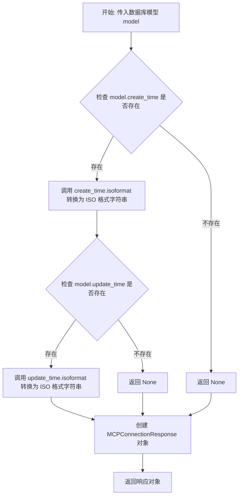

#### 带注释源码

```python
def model_to_response(model) -> MCPConnectionResponse:
    """
    将数据库模型转换为响应对象
    
    参数:
        model: 数据库模型对象，包含 MCP 连接的所有字段
        
    返回:
        MCPConnectionResponse: 响应数据对象，用于 API 返回
    """
    # 将数据库模型对象的各字段映射到响应对象
    # 时间字段需要特殊处理：将 datetime 对象转换为 ISO 格式字符串
    return MCPConnectionResponse(
        id=model.id,                          # 连接唯一标识
        server_name=model.server_name,        # 服务器名称
        args=model.args,                      # 启动参数
        env=model.env,                        # 环境变量
        cwd=model.cwd,                        # 工作目录
        transport=model.transport,            # 传输协议
        timeout=model.timeout,               # 超时时间
        enabled=model.enabled,               # 是否启用
        description=model.description,       # 连接描述
        config=model.config,                 # 额外配置
        # 条件转换：如果创建时间存在则转换为 ISO 格式，否则为 None
        create_time=model.create_time.isoformat() if model.create_time else None,
        # 条件转换：如果更新时间存在则转换为 ISO 格式，否则为 None
        update_time=model.update_time.isoformat() if model.update_time else None,
    )
```


### `get_mcp_profile_endpoint`

获取 MCP 通用配置的 API 端点，用于从数据库中检索或返回默认的 MCP 配置文件信息。

参数： 无

返回值：`MCPProfileResponse`，包含超时时间、工作目录、环境变量和更新时间等配置信息

#### 流程图

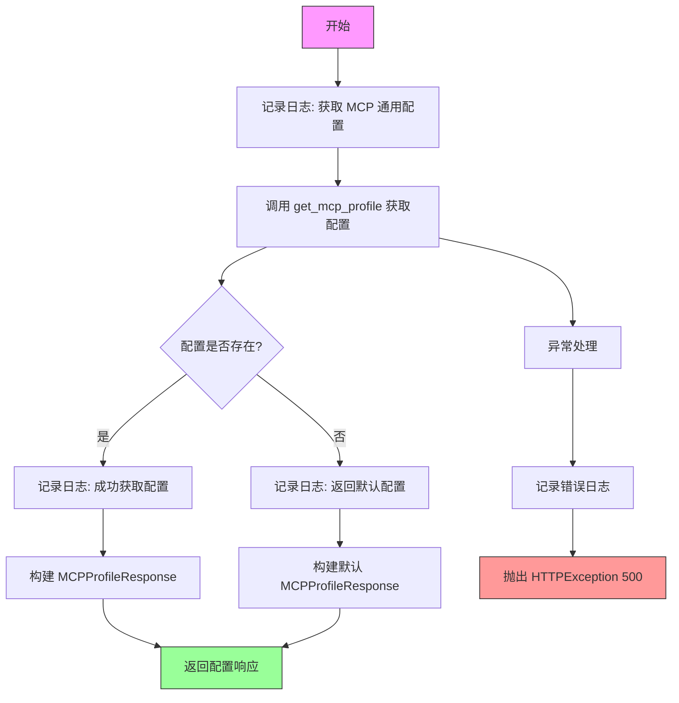

#### 带注释源码

```python
@mcp_router.get("/profile", response_model=MCPProfileResponse, summary="获取 MCP 通用配置")
async def get_mcp_profile_endpoint():
    """
    获取 MCP 通用配置
    
    该端点用于获取系统中配置的 MCP 通用参数，包括：
    - timeout: 超时时间设置
    - working_dir: 工作目录
    - env_vars: 环境变量
    - update_time: 最后更新时间
    
    Returns:
        MCPProfileResponse: 包含配置信息的响应对象
        
    Raises:
        HTTPException: 500 错误，当获取配置发生异常时
    """
    # 记录日志，表示开始获取配置
    logger.info("获取 MCP 通用配置")
    try:
        # 调用仓储层函数获取配置
        profile = get_mcp_profile()
        
        # 判断配置是否存在
        if profile:
            # 配置存在，记录成功日志
            logger.info("成功获取 MCP 通用配置")
            # 返回从数据库获取的配置
            return MCPProfileResponse(
                timeout=profile["timeout"],
                working_dir=profile["working_dir"],
                env_vars=profile["env_vars"],
                update_time=profile["update_time"]
            )
        else:
            # 配置不存在，记录日志并返回默认配置
            logger.info("MCP 通用配置不存在，返回默认配置")
            # 返回系统预设的默认配置值
            return MCPProfileResponse(
                timeout=30,  # 默认超时 30 秒
                working_dir="/tmp",  # 默认工作目录
                env_vars={  # 默认环境变量
                    "PATH": "/usr/local/bin:/usr/bin:/bin",
                    "PYTHONPATH": "/app",
                    "HOME": "/tmp"
                },
                update_time=datetime.now().isoformat()  # 当前时间
            )
    
    except Exception as e:
        # 捕获异常，记录错误日志
        logger.error(f"获取 MCP 通用配置失败: {str(e)}")
        # 抛出 500 内部服务器错误
        raise HTTPException(status_code=500, detail=str(e))
```


### `create_or_update_mcp_profile`

创建或更新 MCP 通用配置的 API 端点，接收 MCP 配置文件数据，调用底层 repository 函数创建或更新配置，并返回更新后的配置信息。

参数：

- `profile_data`：`MCPProfileCreate`，MCP 配置文件数据，包含超时时间、工作目录和环境变量等配置信息

返回值：`MCPProfileResponse`，返回更新后的 MCP 通用配置信息，包含超时时间、工作目录、环境变量和更新时间

#### 流程图

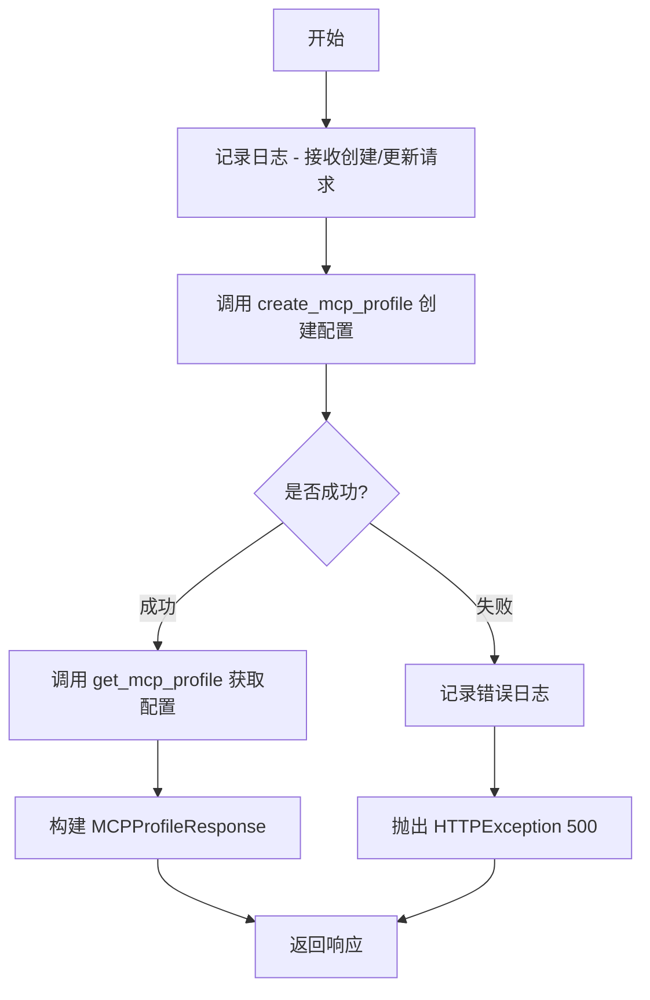

#### 带注释源码

```python
@mcp_router.post("/profile", response_model=MCPProfileResponse, summary="创建/更新 MCP 通用配置")
async def create_or_update_mcp_profile(profile_data: MCPProfileCreate):
    """
    创建或更新 MCP 通用配置
    """
    # 记录接收到的配置参数日志
    logger.info(f"创建/更新 MCP 通用配置: timeout={profile_data.timeout}, working_dir={profile_data.working_dir}")
    try:
        # 调用 repository 层函数创建配置文件
        profile_id = create_mcp_profile(
            timeout=profile_data.timeout,
            working_dir=profile_data.working_dir,
            env_vars=profile_data.env_vars,
        )
        
        # 获取更新后的配置文件信息
        profile = get_mcp_profile()
        # 记录成功日志，包含新创建的配置文件 ID
        logger.info(f"成功创建/更新 MCP 通用配置，ID: {profile_id}")
        # 返回响应模型，包含配置详情
        return MCPProfileResponse(
            timeout=profile["timeout"],
            working_dir=profile["working_dir"],
            env_vars=profile["env_vars"],
            update_time=profile["update_time"]
        )
    
    except Exception as e:
        # 捕获异常，记录错误日志
        logger.error(f"创建/更新 MCP 通用配置失败: {str(e)}")
        # 抛出 HTTP 500 错误
        raise HTTPException(status_code=500, detail=str(e))
```


### `update_mcp_profile_endpoint`

更新 MCP 通用配置接口，用于通过 PUT 请求更新 MCP 的通用配置文件，包括超时时间、工作目录和环境变量等设置。

参数：

- `profile_data`：`MCPProfileCreate`，包含需要更新的 MCP 通用配置数据（timeout、working_dir、env_vars）

返回值：`MCPProfileResponse`，更新后的 MCP 通用配置信息

#### 流程图

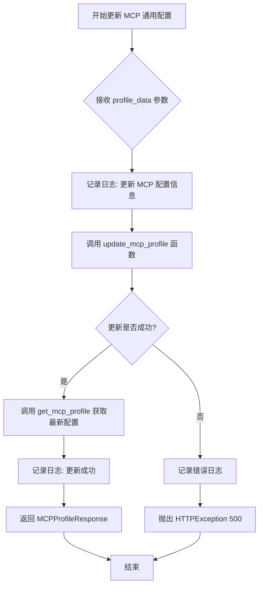

#### 带注释源码

```python
@mcp_router.put("/profile", response_model=MCPProfileResponse, summary="更新 MCP 通用配置")
async def update_mcp_profile_endpoint(profile_data: MCPProfileCreate):
    """
    更新 MCP 通用配置
    
    该接口用于更新 MCP 的通用配置，包括：
    - timeout: 超时时间设置
    - working_dir: 工作目录路径
    - env_vars: 环境变量字典
    
    Args:
        profile_data: MCPProfileCreate 类型的请求体，包含需要更新的配置项
        
    Returns:
        MCPProfileResponse: 更新后的完整配置信息，包含最新的 update_time
        
    Raises:
        HTTPException: 当更新操作失败时抛出 500 错误
    """
    # 记录更新操作的日志，包含传入的 timeout 和 working_dir 参数
    logger.info(f"更新 MCP 通用配置: timeout={profile_data.timeout}, working_dir={profile_data.working_dir}")
    try:
        # 调用数据库层的 update_mcp_profile 函数执行更新操作
        profile_id = update_mcp_profile(
            timeout=profile_data.timeout,
            working_dir=profile_data.working_dir,
            env_vars=profile_data.env_vars,
        )
        
        # 更新成功后，获取最新的配置信息
        profile = get_mcp_profile()
        
        # 记录成功日志，包含更新的配置ID
        logger.info(f"成功更新 MCP 通用配置，ID: {profile_id}")
        
        # 返回更新后的完整配置响应
        return MCPProfileResponse(
            timeout=profile["timeout"],
            working_dir=profile["working_dir"],
            env_vars=profile["env_vars"],
            update_time=profile["update_time"]
        )
    
    # 捕获所有异常并返回统一的错误响应
    except Exception as e:
        logger.error(f"更新 MCP 通用配置失败: {str(e)}")
        raise HTTPException(status_code=500, detail=str(e))
```


### `reset_mcp_profile_endpoint`

重置 MCP 通用配置为默认值，将 profile 配置恢复为系统预设的初始值。

参数：  
无参数

返回值：`MCPProfileStatusResponse`，包含操作成功标志和状态消息的响应对象

#### 流程图

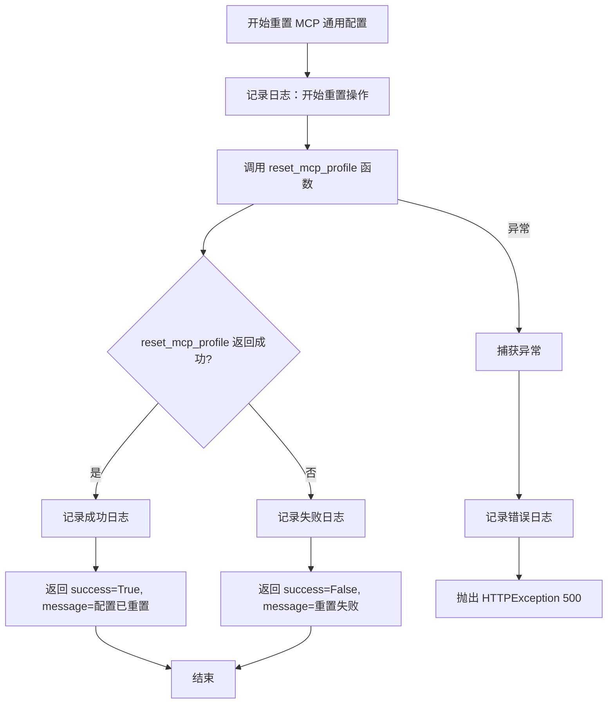

#### 带注释源码

```python
@mcp_router.post("/profile/reset", response_model=MCPProfileStatusResponse, summary="重置 MCP 通用配置")
async def reset_mcp_profile_endpoint():
    """
    重置 MCP 通用配置为默认值
    
    端点: POST /api/v1/mcp_connections/profile/reset
    响应模型: MCPProfileStatusResponse
    功能: 将 MCP Profile 配置重置为系统默认配置
    """
    # 记录重置操作开始日志
    logger.info("重置 MCP 通用配置为默认值")
    try:
        # 调用底层数据库/业务逻辑层的重置函数
        success = reset_mcp_profile()
        
        # 根据重置结果构建响应
        if success:
            # 重置成功，记录成功日志并返回成功响应
            logger.info("成功重置 MCP 通用配置")
            return MCPProfileStatusResponse(
                success=True,
                message="MCP 通用配置已重置为默认值"
            )
        else:
            # 重置操作返回失败，记录错误日志并返回失败响应
            logger.error("重置 MCP 通用配置失败")
            return MCPProfileStatusResponse(
                success=False,
                message="重置 MCP 通用配置失败"
            )
    
    except Exception as e:
        # 捕获异常，记录错误日志并抛出 HTTP 500 异常
        logger.error(f"重置 MCP 通用配置失败: {str(e)}")
        raise HTTPException(status_code=500, detail=str(e))
```


### `delete_mcp_profile_endpoint`

删除 MCP 通用配置的 API 端点，通过调用数据库层的 `delete_mcp_profile()` 函数实现删除操作，并根据执行结果返回相应的状态响应。

参数：

- （无参数）

返回值：`MCPProfileStatusResponse`，包含操作成功标志和消息描述

#### 流程图

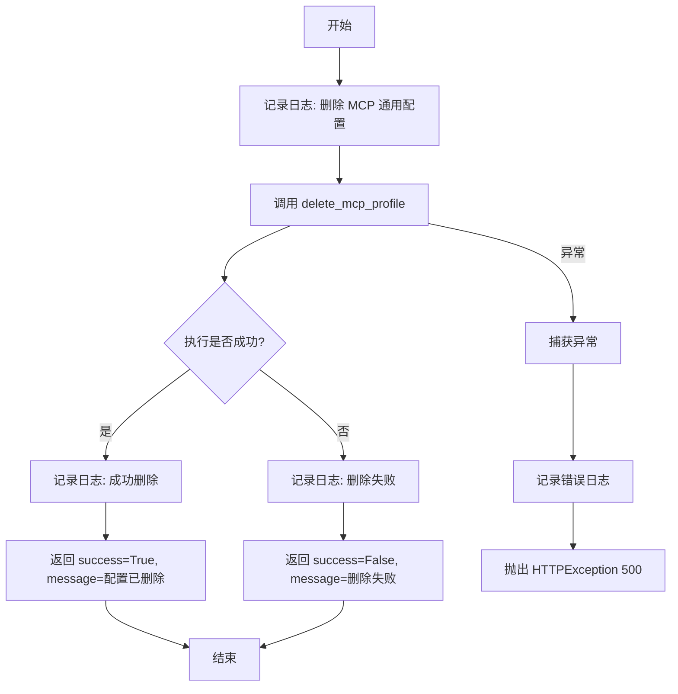

#### 带注释源码

```python
@mcp_router.delete("/profile", response_model=MCPProfileStatusResponse, summary="删除 MCP 通用配置")
async def delete_mcp_profile_endpoint():
    """
    删除 MCP 通用配置
    """
    # 记录删除操作的日志
    logger.info("删除 MCP 通用配置")
    try:
        # 调用数据库层函数执行删除
        success = delete_mcp_profile()
        
        # 根据删除结果构造响应
        if success:
            logger.info("成功删除 MCP 通用配置")
            return MCPProfileStatusResponse(
                success=True,
                message="MCP 通用配置已删除"
            )
        else:
            logger.error("删除 MCP 通用配置失败")
            return MCPProfileStatusResponse(
                success=False,
                message="删除 MCP 通用配置失败"
            )
    
    # 捕获异常并返回 500 错误
    except Exception as e:
        logger.error(f"删除 MCP 通用配置失败: {str(e)}")
        raise HTTPException(status_code=500, detail=str(e))
```


### `create_mcp_connection`

创建新的 MCP 连接配置，该接口接收连接参数，验证服务器名称唯一性，调用数据层添加连接记录，并返回创建的连接详情。

参数：

- `connection_data`：`MCPConnectionCreate`，包含创建 MCP 连接所需的配置信息，包括服务器名称、参数、环境变量、工作目录、传输协议、超时设置、启用状态、描述和自定义配置

返回值：`MCPConnectionResponse`，返回创建的 MCP 连接完整信息，包含 ID、服务器名称、参数、环境变量、工作目录、传输协议、超时设置、启用状态、描述、自定义配置、创建时间和更新时间

#### 流程图

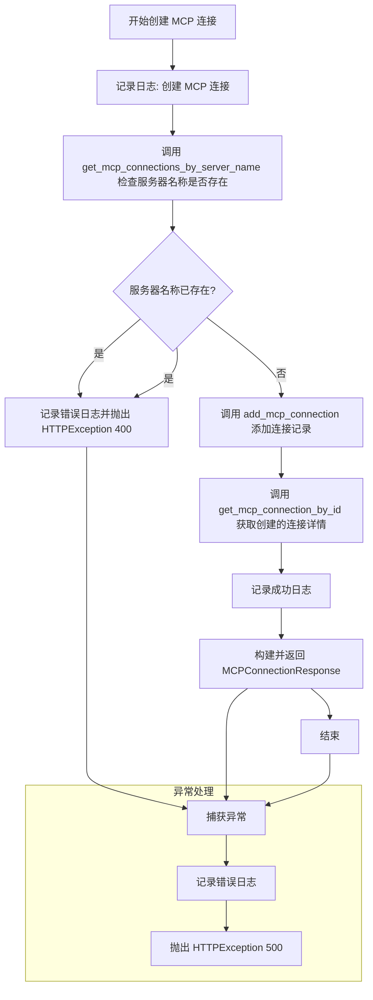

#### 带注释源码

```python
@mcp_router.post("/", response_model=MCPConnectionResponse, summary="创建 MCP 连接")
async def create_mcp_connection(connection_data: MCPConnectionCreate):
    """
    创建新的 MCP 连接配置
    
    参数:
        connection_data: MCPConnectionCreate 类型，包含创建连接所需的配置信息
            - server_name: 服务器名称（必须唯一）
            - args: 命令行参数列表
            - env: 环境变量字典
            - cwd: 工作目录
            - transport: 传输协议
            - timeout: 超时时间（秒）
            - enabled: 是否启用
            - description: 连接描述
            - config: 自定义配置字典
            
    返回:
        MCPConnectionResponse: 创建成功的连接详情
        
    异常:
        HTTPException 400: 服务器名称已存在
        HTTPException 500: 服务器内部错误
    """
    # 记录创建连接的日志，包含服务器名称
    logger.info(f"创建 MCP 连接: {connection_data.server_name}")
    try:
        # 检查服务器名称是否已存在，避免重复创建
        existing = get_mcp_connections_by_server_name(server_name=connection_data.server_name)
        if existing:
            # 如果已存在，记录错误日志并抛出 400 异常
            logger.error(f"服务器名称 '{connection_data.server_name}' 已存在")
            raise HTTPException(
                status_code=400,
                detail=f"服务器名称 '{connection_data.server_name}' 已存在"
            )
        
        # 调用数据层添加 MCP 连接记录
        connection_id = add_mcp_connection(
            server_name=connection_data.server_name,
            args=connection_data.args,
            env=connection_data.env,
            cwd=connection_data.cwd,
            transport=connection_data.transport,
            timeout=connection_data.timeout,
            enabled=connection_data.enabled,
            description=connection_data.description,
            config=connection_data.config,
        )
        
        # 获取刚创建的连接详情，用于返回给客户端
        connection = get_mcp_connection_by_id(connection_id)
        # 记录成功日志，包含服务器名称和连接 ID
        logger.info(f"成功创建 MCP 连接: {connection_data.server_name}, ID: {connection_id}")
        # 构建并返回响应对象
        return MCPConnectionResponse(
            id=connection["id"],
            server_name=connection["server_name"],
            args=connection["args"],
            env=connection["env"],
            cwd=connection["cwd"],
            transport=connection["transport"],
            timeout=connection["timeout"],
            enabled=connection["enabled"],
            description=connection["description"],
            config=connection["config"],
            create_time=connection["create_time"],
            update_time=connection["update_time"],
        )
    
    except Exception as e:
        # 捕获所有异常，记录错误日志并抛出 500 异常
        logger.error(f"创建 MCP 连接失败: {str(e)}")
        raise HTTPException(status_code=500, detail=str(e))
```


### `list_mcp_connections`

获取所有 MCP 连接配置列表，支持可选过滤是否仅返回已启用的连接。

参数：

-  `enabled_only`：`bool`，可选参数，Query 参数，默认为 False。当设置为 True 时，仅返回已启用的连接；否则返回所有连接。

返回值：`MCPConnectionListResponse`，包含 MCP 连接列表和总数的信息。

#### 流程图

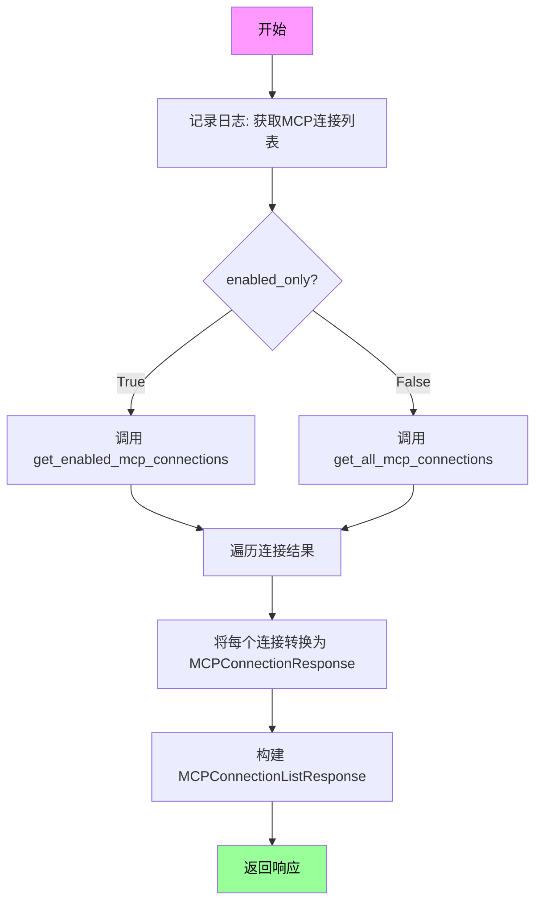

#### 带注释源码

```python
@mcp_router.get("/", response_model=MCPConnectionListResponse, summary="获取 MCP 连接列表")
async def list_mcp_connections(
    enabled_only: bool = Query(False, description="仅返回启用的连接")
):
    """
    获取所有 MCP 连接配置列表
    
    Args:
        enabled_only: 是否仅返回已启用的连接，默认返回所有连接
    
    Returns:
        MCPConnectionListResponse: 包含连接列表和总数
    """
    # 记录日志，包含过滤参数
    logger.info(f"获取 MCP 连接列表, enabled_only={enabled_only}")
    try:
        # 根据 enabled_only 参数选择不同的查询方法
        if enabled_only:
            # 仅获取已启用的连接
            connections = get_enabled_mcp_connections()
        else:
            # 获取所有连接
            connections = get_all_mcp_connections()
        
        # 将数据库模型转换为响应对象列表
        response_connections = [MCPConnectionResponse(
            id=conn["id"],
            server_name=conn["server_name"],
            args=conn["args"],
            env=conn["env"],
            cwd=conn["cwd"],
            transport=conn["transport"],
            timeout=conn["timeout"],
            enabled=conn["enabled"],
            description=conn["description"],
            config=conn["config"],
            create_time=conn["create_time"],
            update_time=conn["update_time"],
        ) for conn in connections]
        
        # 记录成功获取的连接数量
        logger.info(f"成功获取 MCP 连接列表，共 {len(response_connections)} 个连接")
        
        # 返回包含连接列表和总数的响应对象
        return MCPConnectionListResponse(
            connections=response_connections,
            total=len(response_connections)
        )
    
    except Exception as e:
        # 捕获异常并记录错误日志
        logger.error(f"获取 MCP 连接列表失败: {str(e)}")
        # 抛出 500 内部服务器错误异常
        raise HTTPException(status_code=500, detail=str(e))
```


### `get_mcp_connection` (GET /{connection_id})

根据 ID 获取 MCP 连接配置详情，用于通过唯一的连接标识符检索特定的 MCP 服务器连接信息。

参数：

- `connection_id`：`str`，MCP 连接的唯一标识符，用于指定要查询的连接

返回值：`MCPConnectionResponse`，返回指定 ID 的 MCP 连接配置详情，包含服务器名称、参数、环境变量、工作目录、传输协议、超时设置、启用状态、描述、配置、创建时间和更新时间等完整信息

#### 流程图

```mermaid
flowchart TD
    A[开始: 接收 GET /{connection_id} 请求] --> B[记录日志: 获取 MCP 连接详情]
    B --> C{验证 connection_id}
    C -->|参数缺失| D[抛出 400 错误: 缺少必要参数]
    C -->|参数有效| E[调用 get_mcp_connection_by_id 查询数据库]
    E --> F{查询结果是否存在}
    F -->|不存在| G[记录错误日志: 连接 ID 不存在]
    G --> H[抛出 404 错误: 连接 ID 不存在]
    F -->|存在| I[调用 model_to_response 转换数据模型]
    I --> J[记录成功日志: 成功获取 MCP 连接详情]
    J --> K[返回 MCPConnectionResponse]
    E --> L{数据库查询异常}
    L --> M[捕获异常]
    M --> N[记录错误日志: 获取 MCP 连接详情失败]
    N --> O[抛出 500 错误: 服务器内部错误]
```

#### 带注释源码

```python
@mcp_router.get("/{connection_id}", response_model=MCPConnectionResponse, summary="获取 MCP 连接详情")
async def get_mcp_connection(connection_id: str):
    """
    根据 ID 获取 MCP 连接配置详情
    
    Args:
        connection_id: MCP 连接的唯一标识符
        
    Returns:
        MCPConnectionResponse: 包含连接详情的响应对象
        
    Raises:
        HTTPException: 404 - 连接不存在; 500 - 服务器内部错误
    """
    # 记录获取连接详情的请求日志
    logger.info(f"获取 MCP 连接详情: {connection_id}")
    try:
        # 调用仓储层函数根据 ID 查询连接
        connection = get_mcp_connection_by_id(connection_id)
        
        # 检查连接是否存在
        if not connection:
            # 记录错误日志：连接 ID 不存在
            logger.error(f"连接 ID '{connection_id}' 不存在")
            # 抛出 404 异常
            raise HTTPException(
                status_code=404,
                detail=f"连接 ID '{connection_id}' 不存在"
            )
        
        # 记录成功获取连接的日志
        logger.info(f"成功获取 MCP 连接详情: {connection_id}")
        # 将数据库模型转换为响应对象并返回
        return model_to_response(connection)
    
    # 重新抛出 HTTP 异常（404 等）
    except HTTPException:
        raise
    # 捕获其他所有异常并返回 500 错误
    except Exception as e:
        logger.error(f"获取 MCP 连接详情失败: {str(e)}")
        raise HTTPException(status_code=500, detail=str(e))
```


### `update_mcp_connection_by_id`

更新指定 ID 的 MCP 连接配置，支持部分更新（只更新传入的字段）。

参数：

- `connection_id`：`str`，路径参数，表示要更新的 MCP 连接的唯一标识符
- `update_data`：`MCPConnectionUpdate`，请求体参数，包含要更新的连接配置信息（server_name, args, env, cwd, transport, timeout, enabled, description, config）

返回值：`MCPConnectionStatusResponse`，返回更新操作的结果状态，包含连接 ID、操作是否成功以及相关消息

#### 流程图

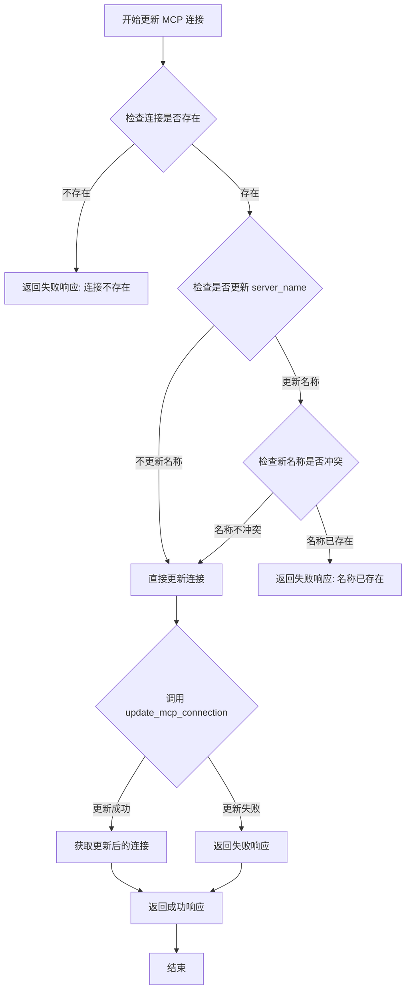

#### 带注释源码

```python
@mcp_router.put("/{connection_id}", response_model=MCPConnectionStatusResponse, summary="更新 MCP 连接")
async def update_mcp_connection_by_id(
    connection_id: str, 
    update_data: MCPConnectionUpdate
):
    """
    更新 MCP 连接配置
    
    Args:
        connection_id: MCP 连接的唯标识符
        update_data: 包含要更新的字段的 MCPConnectionUpdate 对象
    
    Returns:
        MCPConnectionStatusResponse: 包含操作结果的响应对象
    """
    # 记录更新操作的日志
    logger.info(f"更新 MCP 连接: {connection_id}")
    try:
        # 第一步：检查连接是否存在
        existing = get_mcp_connection_by_id(connection_id)
        if not existing:
            # 连接不存在，记录错误并返回失败响应
            logger.error(f"连接 ID '{connection_id}' 不存在")
            return MCPConnectionStatusResponse(
                    connection_id=connection_id,
                    success=False,
                    message=f"连接 ID '{connection_id}' 不存在"
            )   
        
        
        # 第二步：如果更新了 server_name，检查是否与其他连接冲突
        if update_data.server_name and update_data.server_name != existing.server_name:
            # 注意：这里调用的是 get_connections_by_server_name，但未在导入中定义
            # 可能存在潜在的 bug，应该使用 get_mcp_connections_by_server_name
            name_existing = get_connections_by_server_name(server_name=update_data.server_name)
            if name_existing:
                # 名称已存在，返回冲突错误
                logger.error(f"服务器名称 '{update_data.server_name}' 已存在")
                return MCPConnectionStatusResponse(
                    connection_id=connection_id,
                    success=False,
                    message=f"服务器名称 '{update_data.server_name}' 已存在"
                )   
        
        # 第三步：执行更新操作
        updated_id = update_mcp_connection(
            connection_id=connection_id,
            server_name=update_data.server_name,
            args=update_data.args,
            env=update_data.env,
            cwd=update_data.cwd,
            transport=update_data.transport,
            timeout=update_data.timeout,
            enabled=update_data.enabled,
            description=update_data.description,
            config=update_data.config,
        )
        
        # 第四步：检查更新结果并返回响应
        if updated_id:
            # 更新成功，获取更新后的连接信息
            connection = get_mcp_connection_by_id(connection_id)
            logger.info(f"成功更新 MCP 连接: {connection_id}")
            return MCPConnectionStatusResponse(
                connection_id=connection["id"],
                success=True,
                message="成功更新",
            )
        else:
            # 更新失败
            logger.error("更新 MCP 连接失败")
            return MCPConnectionStatusResponse(
                connection_id=connection_id,
                success=False,
                message=f"更新 MCP 连接失败",
            )
    
    except HTTPException:
        # 重新抛出 HTTP 异常
        raise
    except Exception as e:
        # 捕获其他异常，返回通用失败响应
        logger.error(f"更新 MCP 连接失败: {str(e)}")
        return MCPConnectionStatusResponse(
                connection_id=connection_id,
                success=False,
                message=f"更新 MCP 连接失败: {str(e)}",
        )
```


### `delete_mcp_connection_by_id`

删除指定 ID 的 MCP 连接配置。

参数：

- `connection_id`：`str`，MCP 连接的唯一标识符

返回值：`MCPConnectionStatusResponse`，包含删除操作是否成功的状态信息

#### 流程图

```mermaid
flowchart TD
    A[接收 DELETE /{connection_id} 请求] --> B{检查 connection_id 是否存在}
    B -->|不存在| C[记录错误日志]
    C --> D[抛出 404 HTTPException]
    B -->|存在| E[调用 delete_mcp_connection 删除连接]
    E --> F{删除是否成功}
    F -->|成功| G[记录成功日志]
    G --> H[返回 success=True 的 MCPConnectionStatusResponse]
    F -->|失败| I[记录失败日志]
    I --> J[返回 success=False 的 MCPConnectionStatusResponse]
    K[捕获 Exception] --> L[记录错误日志]
    L --> M[抛出 500 HTTPException]
```

#### 带注释源码

```python
@mcp_router.delete("/{connection_id}", response_model=MCPConnectionStatusResponse, summary="删除 MCP 连接")
async def delete_mcp_connection_by_id(connection_id: str):
    """
    删除 MCP 连接配置
    
    根据传入的 connection_id 删除对应的 MCP 连接配置记录。
    1. 首先检查连接是否存在
    2. 如果存在则执行删除操作
    3. 返回删除结果的状态响应
    """
    # 记录删除操作的日志
    logger.info(f"删除 MCP 连接: {connection_id}")
    try:
        # 检查连接是否存在
        existing = get_mcp_connection_by_id(connection_id)
        if not existing:
            # 连接不存在，记录错误日志并抛出 404 异常
            logger.error(f"连接 ID '{connection_id}' 不存在")
            raise HTTPException(
                status_code=404,
                detail=f"连接 ID '{connection_id}' 不存在"
            )
        
        # 执行删除操作
        success = delete_mcp_connection(connection_id)
        if success:
            # 删除成功，记录成功日志
            logger.info(f"成功删除 MCP 连接: {connection_id}")
            return MCPConnectionStatusResponse(
                success=True,
                message="连接删除成功",
                connection_id=connection_id
            )
        else:
            # 删除失败，记录失败日志
            logger.error(f"删除 MCP 连接失败: {connection_id}")
            return MCPConnectionStatusResponse(
                success=False,
                message="连接删除失败",
                connection_id=connection_id
            )
    
    except HTTPException:
        # 重新抛出 HTTP 异常（404 等）
        raise
    except Exception as e:
        # 捕获其他异常，记录错误日志并抛出 500 异常
        logger.error(f"删除 MCP 连接失败: {str(e)}")
        raise HTTPException(status_code=500, detail=str(e))
```


### `enable_mcp_connection_endpoint`

启用指定的 MCP 连接，通过 POST 请求 `/api/v1/mcp_connections/{connection_id}/enable` 端点，将指定 ID 的 MCP 连接状态设置为启用。

参数：

- `connection_id`：`str`，MCP 连接的唯标识符，用于指定要启用的连接

返回值：`MCPConnectionStatusResponse`，包含操作结果的状态响应对象

#### 流程图

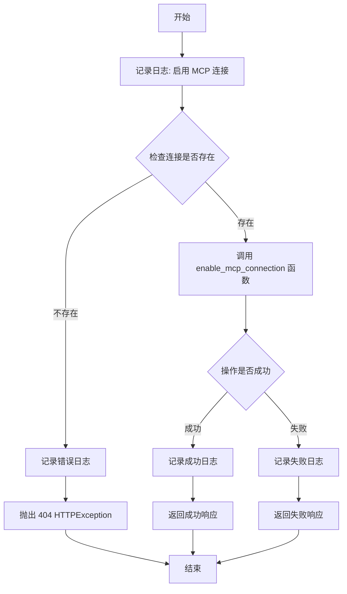

#### 带注释源码

```python
@mcp_router.post("/{connection_id}/enable", response_model=MCPConnectionStatusResponse, summary="启用 MCP 连接")
async def enable_mcp_connection_endpoint(connection_id: str):
    """
    启用指定的 MCP 连接
    
    Args:
        connection_id: MCP 连接的唯标识符
        
    Returns:
        MCPConnectionStatusResponse: 包含操作结果的响应对象
    """
    # 记录启用操作的日志
    logger.info(f"启用 MCP 连接: {connection_id}")
    try:
        # 通过连接 ID 查询数据库，检查连接是否存在
        existing = get_mcp_connection_by_id(connection_id)
        if not existing:
            # 连接不存在，记录错误日志并抛出 404 异常
            logger.error(f"连接 ID '{connection_id}' 不存在")
            raise HTTPException(
                status_code=404,
                detail=f"连接 ID '{connection_id}' 不存在"
            )
        
        # 调用数据库层的启用连接函数
        success = enable_mcp_connection(connection_id)
        if success:
            # 启用成功，记录日志并返回成功响应
            logger.info(f"成功启用 MCP 连接: {connection_id}")
            return MCPConnectionStatusResponse(
                success=True,
                message="连接启用成功",
                connection_id=connection_id
            )
        else:
            # 启用失败，记录日志并返回失败响应
            logger.error(f"启用 MCP 连接失败: {connection_id}")
            return MCPConnectionStatusResponse(
                success=False,
                message="连接启用失败",
                connection_id=connection_id
            )
    
    # 重新抛出 HTTP 异常，避免被下方通用异常处理
    except HTTPException:
        raise
    # 捕获其他未知异常，记录日志并抛出 500 错误
    except Exception as e:
        logger.error(f"启用 MCP 连接失败: {str(e)}")
        raise HTTPException(status_code=500, detail=str(e))
```


### `disable_mcp_connection_endpoint`

禁用指定的 MCP 连接，将连接的状态设置为 disabled。

参数：

- `connection_id`：`str`，MCP 连接的 ID，用于指定要禁用的连接

返回值：`MCPConnectionStatusResponse`，包含操作结果的状态响应，包含 success 布尔值、message 描述信息 和 connection_id 连接 ID

#### 流程图

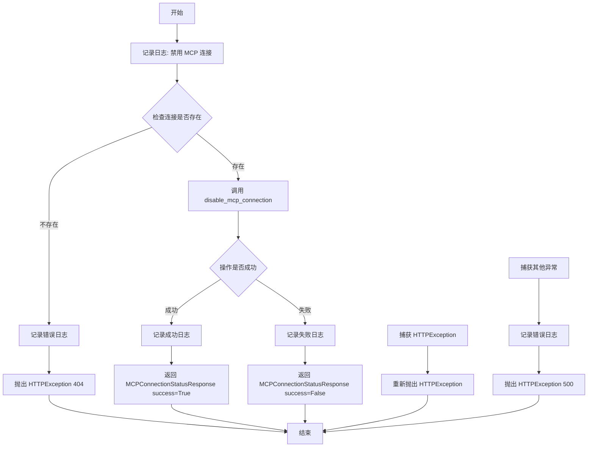

#### 带注释源码

```python
@mcp_router.post("/{connection_id}/disable", response_model=MCPConnectionStatusResponse, summary="禁用 MCP 连接")
async def disable_mcp_connection_endpoint(connection_id: str):
    """
    禁用指定的 MCP 连接
    """
    # 记录禁用操作的日志
    logger.info(f"禁用 MCP 连接: {connection_id}")
    try:
        # 检查连接是否存在
        existing = get_mcp_connection_by_id(connection_id)
        if not existing:
            # 连接不存在，记录错误并抛出 404 异常
            logger.error(f"连接 ID '{connection_id}' 不存在")
            raise HTTPException(
                status_code=404,
                detail=f"连接 ID '{connection_id}' 不存在"
            )
        
        # 调用仓储层的禁用方法
        success = disable_mcp_connection(connection_id)
        if success:
            # 禁用成功，记录日志并返回成功响应
            logger.info(f"成功禁用 MCP 连接: {connection_id}")
            return MCPConnectionStatusResponse(
                success=True,
                message="连接禁用成功",
                connection_id=connection_id
            )
        else:
            # 禁用失败，记录日志并返回失败响应
            logger.error(f"禁用 MCP 连接失败: {connection_id}")
            return MCPConnectionStatusResponse(
                success=False,
                message="连接禁用失败",
                connection_id=connection_id
            )
    
    # 重新抛出 HTTPException 异常
    except HTTPException:
        raise
    except Exception as e:
        # 捕获其他异常，记录日志并抛出 500 异常
        logger.error(f"禁用 MCP 连接失败: {str(e)}")
        raise HTTPException(status_code=500, detail=str(e))
```


### `search_mcp_connections_endpoint`

根据条件搜索 MCP 连接配置，支持按关键字、传输类型、启用状态进行过滤，并可限制返回结果数量。

**参数：**

- `search_request`：`MCPConnectionSearchRequest`，搜索请求对象，包含 keyword（关键字）、transport（传输类型）、enabled（启用状态）、limit（返回数量限制）等搜索条件

**返回值：**`MCPConnectionListResponse`，包含搜索到的 MCP 连接列表和总数

#### 流程图

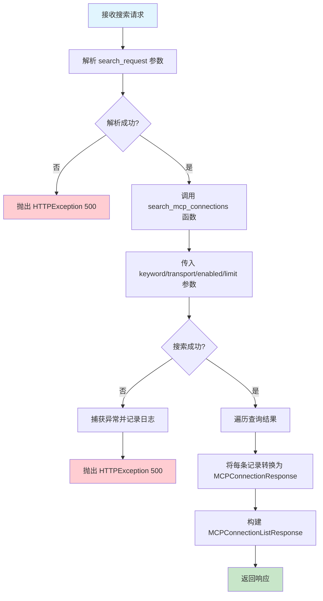

#### 带注释源码

```python
@mcp_router.post("/search", response_model=MCPConnectionListResponse, summary="搜索 MCP 连接")
async def search_mcp_connections_endpoint(search_request: MCPConnectionSearchRequest):
    """
    根据条件搜索 MCP 连接配置
    
    支持的搜索条件:
    - keyword: 关键字，用于模糊匹配服务器名称或描述
    - transport: 传输类型（如 stdio, sse 等）
    - enabled: 是否启用（True/False）
    - limit: 返回结果数量限制
    """
    # 记录搜索请求参数，用于调试和审计
    logger.info(f"搜索 MCP 连接: keyword={search_request.keyword}, transport={search_request.transport}, enabled={search_request.enabled}, limit={search_request.limit}")
    
    try:
        # 调用仓储层函数执行数据库搜索
        # 根据传入的条件（关键字、传输类型、启用状态、返回数量限制）查询 MCP 连接
        connections = search_mcp_connections(
            keyword=search_request.keyword,
            transport=search_request.transport,
            enabled=search_request.enabled,
            limit=search_request.limit,
        )
        
        # 将数据库模型转换为 API 响应对象
        # 遍历查询结果，为每条记录创建 MCPConnectionResponse 对象
        response_connections = [MCPConnectionResponse(
            id=conn["id"],
            server_name=conn["server_name"],
            args=conn["args"],
            env=conn["env"],
            cwd=conn["cwd"],
            transport=conn["transport"],
            timeout=conn["timeout"],
            enabled=conn["enabled"],
            description=conn["description"],
            config=conn["config"],
            create_time=conn["create_time"],
            update_time=conn["update_time"],
        ) for conn in connections]
        
        # 记录搜索结果数量
        logger.info(f"成功搜索 MCP 连接，找到 {len(response_connections)} 个连接")
        
        # 返回包含连接列表和总数的响应对象
        return MCPConnectionListResponse(
            connections=response_connections,
            total=len(response_connections)
        )
    
    except Exception as e:
        # 捕获所有异常，记录错误日志并返回 500 错误
        logger.error(f"搜索 MCP 连接失败: {str(e)}")
        raise HTTPException(status_code=500, detail=str(e))
```


### `get_connections_by_server_name`

根据服务器名称获取MCP连接配置列表的API端点，通过指定的server_name查询并返回匹配的MCP连接配置。

参数：

- `server_name`：`str`，路径参数，服务器名称，用于过滤MCP连接配置

返回值：`MCPConnectionListResponse`，包含连接列表和总数的响应对象

#### 流程图

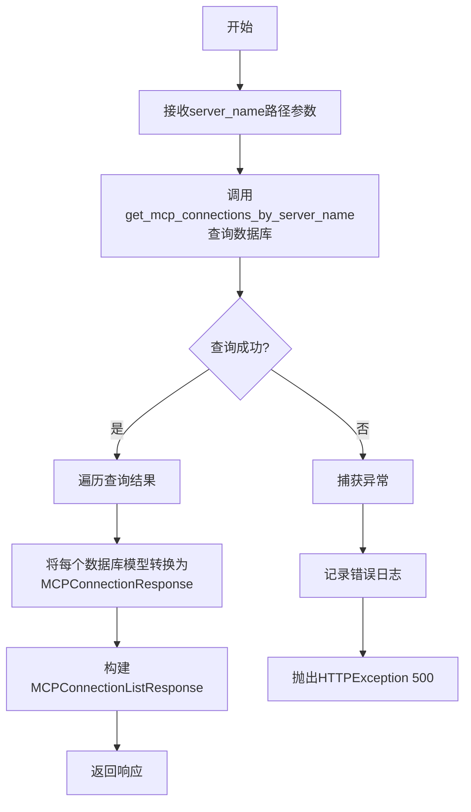

#### 带注释源码

```python
@mcp_router.get("/server/{server_name}", response_model=MCPConnectionListResponse, summary="根据服务器名称获取连接")
async def get_connections_by_server_name(server_name: str):
    """
    根据服务器名称获取 MCP 连接配置列表
    """
    # 记录日志，标识开始根据服务器名称查询连接
    logger.info(f"根据服务器名称获取 MCP 连接: {server_name}")
    try:
        # 调用仓储层函数，根据server_name查询对应的MCP连接配置
        connections = get_mcp_connections_by_server_name(server_name)
        
        # 将数据库模型列表转换为API响应对象列表
        response_connections = [MCPConnectionResponse(
            id=conn["id"],
            server_name=conn["server_name"],
            args=conn["args"],
            env=conn["env"],
            cwd=conn["cwd"],
            transport=conn["transport"],
            timeout=conn["timeout"],
            enabled=conn["enabled"],
            description=conn["description"],
            config=conn["config"],
            create_time=conn["create_time"],
            update_time=conn["update_time"],
        ) for conn in connections]
        
        # 记录成功日志，包含返回的连接数量
        logger.info(f"成功根据服务器名称获取 MCP 连接，找到 {len(response_connections)} 个连接")
        
        # 返回包含连接列表和总数的响应对象
        return MCPConnectionListResponse(
            connections=response_connections,
            total=len(response_connections)
        )
    
    except Exception as e:
        # 捕获异常并记录错误日志
        logger.error(f"根据服务器名称获取 MCP 连接失败: {str(e)}")
        # 抛出500内部服务器错误异常
        raise HTTPException(status_code=500, detail=str(e))
```


### `list_enabled_mcp_connections`

获取所有已启用的 MCP 连接配置列表，通过调用数据库仓储层的 `get_enabled_mcp_connections` 函数查询所有 `enabled=True` 的连接记录，并转换为 API 响应格式返回给客户端。

参数：
- 无

返回值：`MCPConnectionListResponse`，返回包含所有已启用 MCP 连接的列表及总数。若查询失败则抛出 500 错误。

#### 流程图

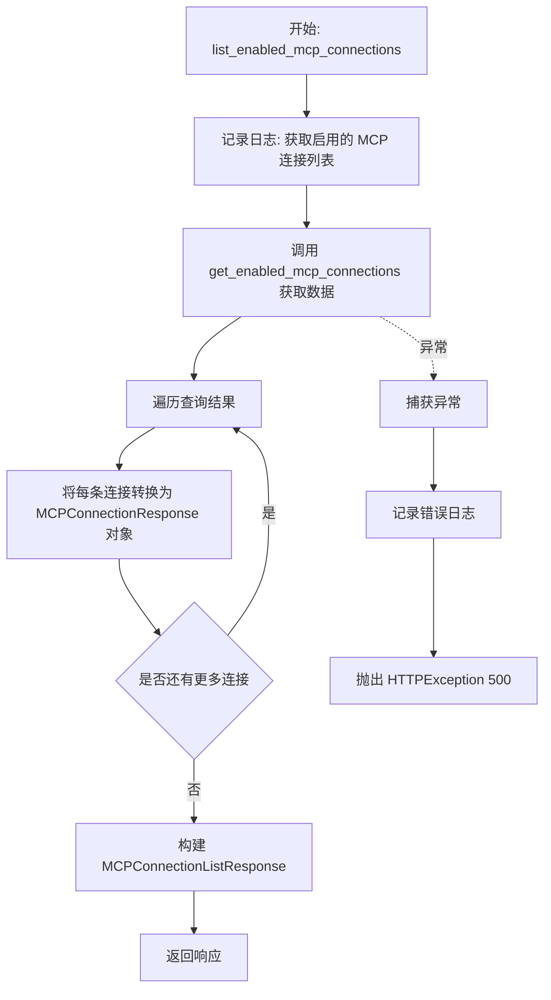

#### 带注释源码

```python
@mcp_router.get("/enabled/list", response_model=MCPConnectionListResponse, summary="获取启用的 MCP 连接")
async def list_enabled_mcp_connections():
    """
    获取所有启用的 MCP 连接配置
    """
    # 记录获取启用了的连接列表的日志
    logger.info("获取启用的 MCP 连接列表")
    try:
        # 调用仓储层函数获取所有 enabled=True 的连接记录
        connections = get_enabled_mcp_connections()
        
        # 遍历查询结果，将每条字典数据转换为 MCPConnectionResponse 响应模型对象
        response_connections = [MCPConnectionResponse(
            id=conn["id"],
            server_name=conn["server_name"],
            args=conn["args"],
            env=conn["env"],
            cwd=conn["cwd"],
            transport=conn["transport"],
            timeout=conn["timeout"],
            enabled=conn["enabled"],
            description=conn["description"],
            config=conn["config"],
            create_time=conn["create_time"],
            update_time=conn["update_time"],
        ) for conn in connections]
        
        # 记录成功获取的连接数量日志
        logger.info(f"成功获取启用的 MCP 连接列表，共 {len(response_connections)} 个连接")
        
        # 返回包含连接列表和总数的响应对象
        return MCPConnectionListResponse(
            connections=response_connections,
            total=len(response_connections)
        )
    
    except Exception as e:
        # 捕获异常并记录错误日志
        logger.error(f"获取启用的 MCP 连接列表失败: {str(e)}")
        # 抛出 500 内部服务器错误
        raise HTTPException(status_code=500, detail=str(e))
```

## 关键组件


### MCP Profile 管理组件

负责MCP通用配置的获取、创建、更新、重置和删除操作，包括超时时间、工作目录和环境变量等全局设置。

### MCP Connection 管理组件

负责MCP连接配置的完整生命周期管理，包括创建、读取、更新、删除连接，支持服务器名称、参数、环境变量、工作目录、传输协议、超时时间等配置项。

### 连接状态控制组件

提供MCP连接的启用和禁用功能，支持通过connection_id对单个连接进行状态切换，便于动态管理哪些连接处于活跃状态。

### 连接搜索与过滤组件

支持按关键词、传输协议、是否启用等条件搜索MCP连接，并提供根据服务器名称查询、仅获取已启用连接等过滤功能。

### 数据模型转换组件

将数据库模型对象转换为API响应对象，负责处理时间格式转换和字段映射，确保API返回的数据格式统一规范。

### 路由注册与前缀管理组件

通过FastAPI APIRouter定义RESTful API端点，统一使用"/api/v1/mcp_connections"前缀，并按功能模块分组管理各类路由。

## 问题及建议


### 已知问题

- **路由命名冲突风险**：`/profile` 路由与 `/{connection_id}` 路由虽然已通过调整顺序避免冲突，但这种依赖顺序的设计容易在未来维护中引入新的路由冲突问题
- **函数命名不一致**：在 `update_mcp_connection_by_id` 方法中调用了 `get_connections_by_server_name`（缺少 `mcp_` 前缀），而导入的函数名是 `get_mcp_connections_by_server_name`，这会导致运行时错误
- **错误处理方式不统一**：部分端点（如 `delete_mcp_connection_by_id`、`get_mcp_connection`）在资源不存在时抛出 `HTTPException`，而 `update_mcp_connection_by_id` 却返回 `MCPConnectionStatusResponse(success=False, ...)`，造成 API 行为不一致
- **代码重复**：多处重复构建 `MCPConnectionResponse` 对象的逻辑，虽然已定义 `model_to_response` 辅助函数，但在 `list_mcp_connections`、`search_mcp_connections_endpoint` 等端点中未使用该函数
- **端点功能冗余**：`list_mcp_connections(enabled_only=True)` 与 `/enabled/list` 端点功能完全重复，造成 API 冗余
- **敏感信息泄露风险**：异常处理中直接 `detail=str(e)` 将原始错误信息返回给客户端，可能泄露内部实现细节和数据库信息
- **数据库查询效率低**：在更新操作后再次调用 `get_mcp_connection_by_id` 获取完整对象，而非直接使用 repository 层返回的数据，增加数据库负载
- **缺少输入验证**：未使用 FastAPI 的 Pydantic 验证器对请求参数进行更细粒度的校验（如 server_name 格式、timeout 范围等）

### 优化建议

- 修复函数命名不一致问题：将 `get_connections_by_server_name` 改为 `get_mcp_connections_by_server_name`
- 统一错误处理策略：对于资源不存在的场景，全部抛出 `HTTPException(status_code=404)` 或全部返回状态响应对象
- 重构响应构建逻辑：创建列表转换函数如 `models_to_responses`，或在 repository 层直接返回响应对象，减少端点中的重复代码
- 合并冗余端点：移除 `/enabled/list` 端点，统一使用 `list_mcp_connections?enabled_only=true`
- 优化异常处理：使用自定义异常类或统一的错误响应格式，避免直接暴露原始异常信息
- 考虑在 repository 层添加批量操作方法，减少多次数据库查询

## 其它


### 设计目标与约束

本模块旨在提供对 MCP（Model Context Protocol）连接配置和通用配置（Profile）的完整管理能力，包括创建、查询、更新、删除、启用/禁用等操作。通过 RESTful API 接口，支持灵活的参数配置（args、env、cwd、transport、timeout）和状态管理，同时确保服务器名称的唯一性约束和连接状态的有效转换。

### 错误处理与异常设计

本模块采用分层异常处理策略：对于业务逻辑错误（如资源不存在、名称冲突）返回 400/404 状态码并附带详细错误信息；对于未预期的服务器错误返回 500 状态码。关键操作（如创建、更新、删除、启用/禁用）均返回 MCPConnectionStatusResponse 统一响应格式，包含 success 布尔值和 message 描述，确保客户端能够清晰判断操作结果。部分端点使用 HTTPException 向上传递异常，而另一些则捕获异常后转换为状态响应对象。

### 数据流与状态机

MCP 连接存在两种状态：enabled（启用）和 disabled（禁用），状态通过 enable_mcp_connection 和 disable_mcp_connection 函数切换。数据流遵循：客户端请求 → FastAPI 路由层 → 业务逻辑验证 → 仓库层 Repository → 数据库持久化 → 响应转换 → 客户端。Profile 配置独立于 Connection 存在，提供全局超时、工作目录、环境变量等默认参数。

### 外部依赖与接口契约

本模块依赖以下外部组件：FastAPI 框架提供 RESTful 接口能力；chatchat.server.db.repository 中的 mcp_connection_repository 模块提供数据库操作；chatchat.server.api_server.api_schemas 定义请求/响应数据结构；chatchat.utils.build_logger 提供日志能力。Repository 层函数定义了明确的接口契约，包括参数类型、返回值格式和可能的异常情况。

### API 接口规范

本模块暴露以下 API 端点：MCP Profile 端点（/profile 的 GET/POST/PUT/DELETE 以及 /profile/reset）；MCP Connection 端点（/ 的 CRUD 操作，/{connection_id} 的详情/更新/删除，/{connection_id}/enable 和 /{connection_id}/disable 状态控制）；搜索与过滤端点（/search、/server/{server_name}、/enabled/list）。所有端点均使用统一的响应模型包装数据。

### 安全考虑

当前实现中，env 环境变量以明文形式存储和传输，存在敏感信息泄露风险。建议对敏感配置进行加密存储或在后续版本中引入密钥管理服务（KMS）。此外，连接配置中的 config 字段需评估其内容是否包含凭据信息，并采取相应的保护措施。

### 性能与扩展性

当前实现中，部分端点缺少分页机制（如 list_mcp_connections 返回全部数据），在大规模场景下可能导致性能问题。search_mcp_connections 已支持 limit 参数，建议在其他列表接口中统一引入分页支持。数据库查询可考虑添加索引以优化 server_name、enabled 等常用过滤字段的查询性能。


    