# `Langchain-Chatchat\libs\chatchat-server\chatchat\server\api_server\openai_routes.py` 详细设计文档

提供OpenAI兼容的RESTful API接口，整合多个AI模型平台的调用能力，支持聊天完成、文本补全、嵌入生成、图像生成和文件管理等功能，并通过信号量机制实现模型级别的并发控制。

## 整体流程

```mermaid
graph TD
    A[客户端请求] --> B{请求类型}
    B --> C[/v1/models 列出模型]
    B --> D[/v1/chat/completions 聊天完成]
    B --> E[/v1/completions 文本补全]
    B --> F[/v1/embeddings 嵌入生成]
    B --> G[/v1/images/generations 图像生成]
    B --> H[/v1/files 文件操作]
    C --> I[并发获取各平台模型列表]
    D --> J[get_model_client 获取模型客户端]
    J --> K{选择最优平台}
    K --> L[通过Semaphore控制并发]
    L --> M[调用openai_request]
    M --> N{是否流式响应}
    N -- 是 --> O[返回EventSourceResponse]
    N -- 否 --> P[返回普通JSON]
```

## 类结构

```
OpenAI Router 模块 (FastAPI)
├── 核心函数
│   ├── get_model_client (异步上下文管理器)
│   ├── openai_request (异步请求处理)
│   └── 路由处理函数 (9个)
├── 文件处理函数 (5个)
└── 辅助函数 (3个)
```

## 全局变量及字段


### `DEFAULT_API_CONCURRENCIES`
    
默认单个模型最大并发数

类型：`int`
    


### `model_semaphores`
    
模型信号量映射，key为(模型名,平台名)

类型：`Dict[Tuple[str, str], asyncio.Semaphore]`
    


    

## 全局函数及方法


### `get_model_client`

对重名模型进行调度的异步上下文管理器，依次选择空闲的模型或当前访问数最少的模型，返回可用于与 OpenAI API 交互的异步客户端。

参数：
- `model_name`：`str`，要获取客户端的模型名称

返回值：`AsyncGenerator[AsyncClient]`，异步生成器，包含一个 `AsyncClient` 实例，用于与 OpenAI API 交互

#### 流程图

```mermaid
flowchart TD
    A[开始] --> B[获取模型信息 multiple=True]
    B --> C{模型信息是否存在?}
    C -->|否| D[抛出断言错误: 模型未找到]
    C -->|是| E[初始化 max_semaphore = 0]
    E --> F[遍历 model_infos]
    F --> G[构建 key = (model_name, platform_name)]
    G --> H{key 是否在 model_semaphores 中?}
    H -->|否| I[创建新 Semaphore]
    H -->|是| J[获取已有 Semaphore]
    I --> K
    J --> K[获取 api_concurrencies]
    K --> L{Semaphore._value >= api_concurrencies?}
    L -->|是| M[选中该平台 selected_platform]
    L -->|否| N{Semaphore._value > max_semaphore?}
    N -->|是| O[更新 max_semaphore 和 selected_platform]
    N -->|否| P[继续下一轮循环]
    M --> Q[break 退出循环]
    O --> P
    P --> F
    Q --> R[构建最终 key = (model_name, selected_platform)]
    R --> S[获取 semaphore]
    S --> T[await semaphore.acquire 获取信号量]
    T --> U[yield get_OpenAIClient]
    U --> V[发生异常]
    V --> W[记录日志]
    W --> X[执行 finally 释放信号量]
    X --> Z[结束]
```

#### 带注释源码

```python
@asynccontextmanager
async def get_model_client(model_name: str) -> AsyncGenerator[AsyncClient]:
    """
    对重名模型进行调度，依次选择：空闲的模型 -> 当前访问数最少的模型
    
    参数:
        model_name: 模型名称，用于查找对应的客户端
        
    返回:
        AsyncGenerator[AsyncClient]: 异步生成器，产生一个 AsyncClient 实例
    """
    max_semaphore = 0           # 用于记录当前最大的可用信号量值
    selected_platform = ""      # 最终选中的平台名称
    # 获取模型信息，multiple=True 表示返回所有同名模型的配置信息
    model_infos = get_model_info(model_name=model_name, multiple=True)
    # 断言模型必须存在，否则抛出异常
    assert model_infos, f"specified model '{model_name}' cannot be found in MODEL_PLATFORMS."

    # 遍历所有同名模型，找到最优（空闲）的平台
    for m, c in model_infos.items():
        key = (m, c["platform_name"])  # 构建缓存 key：模型名+平台名
        # 获取该平台允许的并发数，默认为 DEFAULT_API_CONCURRENCIES
        api_concurrencies = c.get("api_concurrencies", DEFAULT_API_CONCURRENCIES)
        
        # 如果该 key 尚未创建过信号量，则创建一个新的
        if key not in model_semaphores:
            model_semaphores[key] = asyncio.Semaphore(api_concurrencies)
        
        semaphore = model_semaphores[key]  # 获取对应的信号量
        
        # 调度策略1：优先选择完全空闲（_value 等于并发上限）的模型
        if semaphore._value >= api_concurrencies:
            selected_platform = c["platform_name"]
            break  # 找到空闲平台，立即退出
        # 调度策略2：选择当前访问量最少（_value 最大）的模型
        elif semaphore._value > max_semaphore:
            selected_platform = c["platform_name"]
            max_semaphore = semaphore._value

    # 构建最终选择的平台对应的 key
    key = (m, selected_platform)
    semaphore = model_semaphores[key]
    
    try:
        # 获取信号量，控制并发
        await semaphore.acquire()
        # 生成 AsyncClient 供调用者使用
        yield get_OpenAIClient(platform_name=selected_platform, is_async=True)
    except Exception:
        # 捕获所有异常并记录日志
        logger.exception(f"failed when request to {key}")
    finally:
        # 最终释放信号量，通知其他请求可以使用该平台
        semaphore.release()
```


### `openai_request`

异步函数，通用 OpenAI 请求处理函数，支持流式和非流式响应。该函数是一个核心的辅助函数，用于统一处理各种 OpenAI API 调用，包括 chat completions、completions、images、audio 等，并自动处理额外的 JSON 字段和流式响应的封装。

参数：

- `method`：任意可调用对象（`Callable`），OpenAI 客户端的方法（如 `client.chat.completions.create`），用于执行实际的 API 请求
- `body`：`BaseModel`，请求体的 Pydantic 模型，包含 API 调用所需的参数
- `extra_json`：`Dict`，可选，默认为空字典 `{}`，额外的 JSON 字段，会被添加到响应对象中
- `header`：`Iterable`，可选，默认为空列表 `[]`，流式响应时在开头发送的内容块
- `tail`：`Iterable`，可选，默认为空列表 `[]`，流式响应时在结尾发送的内容块

返回值：返回值类型为 `Union[EventSourceResponse, Dict]`。当 `body.stream` 为 `True` 时，返回 `EventSourceResponse` 对象用于 SSE 流式响应；否则返回包含响应数据的字典对象。

#### 流程图

```mermaid
flowchart TD
    A[开始 openai_request] --> B{body.stream 是否为 True}
    B -->|是| C[创建 generator 协程]
    B -->|否| D[执行 method(**params) 获取结果]
    C --> E[返回 EventSourceResponse]
    D --> F[遍历 extra_json 字段设置到结果对象]
    F --> G[返回 result.model_dump_json]
    
    subgraph generator
    H[遍历 header 元素] --> I{元素类型}
    I -->|str| J[创建 OpenAIChatOutput]
    I -->|dict| K[使用 model_validate 验证]
    I -->|其他| L[抛出 RuntimeError]
    J --> M[设置 extra_json 到对象]
    K --> M
    M --> N[yield model_dump_json]
    
    O[async for chunk in method(**params)] --> P[设置 extra_json 到 chunk]
    P --> Q[yield chunk.model_dump_json]
    
    R[遍历 tail 元素] --> S{元素类型}
    S -->|str| T[创建 OpenAIChatOutput]
    S -->|dict| U[使用 model_validate 验证]
    S -->|其他| V[抛出 RuntimeError]
    T --> W[设置 extra_json 到对象]
    U --> W
    W --> X[yield model_dump_json]
    
    N --> Y[处理异常]
    Q --> Y
    X --> Y
    Y --> Z{异常类型}
    Z -->|CancelledError| AA[记录警告日志并返回]
    Z -->|其他异常| AB[记录错误日志并 yield 错误 JSON]
    end
    
    C --> E
```

#### 带注释源码

```python
async def openai_request(
    method, body, extra_json: Dict = {}, header: Iterable = [], tail: Iterable = []
):
    """
    helper function to make openai request with extra fields
    
    通用 OpenAI 请求处理函数，支持流式和非流式响应。
    - method: OpenAI 客户端的方法调用
    - body: 请求体模型
    - extra_json: 额外的 JSON 字段，会被添加到响应中
    - header/tail: 流式响应时的前缀/后缀内容块
    """

    # 定义内部生成器函数，用于处理流式响应
    async def generator():
        """
        内部生成器，处理流式响应的所有数据块
        包括：header块 + 实际响应块 + tail块
        """
        try:
            # 处理 header（前缀内容块）
            for x in header:
                if isinstance(x, str):
                    # 字符串类型：创建 OpenAIChatOutput 对象
                    x = OpenAIChatOutput(content=x, object="chat.completion.chunk")
                elif isinstance(x, dict):
                    # 字典类型：使用 Pydantic 模型验证
                    x = OpenAIChatOutput.model_validate(x)
                else:
                    raise RuntimeError(f"unsupported value: {header}")
                
                # 将 extra_json 中的字段添加到输出对象
                for k, v in extra_json.items():
                    setattr(x, k, v)
                yield x.model_dump_json()

            # 处理实际的 API 响应块（流式）
            async for chunk in await method(**params):
                for k, v in extra_json.items():
                    setattr(chunk, k, v)
                yield chunk.model_dump_json()

            # 处理 tail（后缀内容块）
            for x in tail:
                if isinstance(x, str):
                    x = OpenAIChatOutput(content=x, object="chat.completion.chunk")
                elif isinstance(x, dict):
                    x = OpenAIChatOutput.model_validate(x)
                else:
                    raise RuntimeError(f"unsupported value: {tail}")
                for k, v in extra_json.items():
                    setattr(x, k, v)
                yield x.model_dump_json()
        
        # 处理用户取消请求的情况
        except asyncio.exceptions.CancelledError:
            logger.warning("streaming progress has been interrupted by user.")
            return
        # 处理其他异常
        except Exception as e:
            logger.error(f"openai request error: {e}")
            yield {"data": json.dumps({"error": str(e)})}

    # 从请求体中提取参数，排除未设置的字段
    params = body.model_dump(exclude_unset=True)
    
    # 处理 max_tokens 为 0 的边界情况，使用默认配置值
    if params.get("max_tokens") == 0:
        params["max_tokens"] = Settings.model_settings.MAX_TOKENS

    # 根据 body.stream 字段判断是否为流式请求
    if hasattr(body, "stream") and body.stream:
        # 流式响应：返回 EventSourceResponse (SSE)
        return EventSourceResponse(generator())
    else:
        # 非流式响应：直接 await 获取结果
        result = await method(**params)
        # 将 extra_json 字段添加到结果对象
        for k, v in extra_json.items():
            setattr(result, k, v)
        return result.model_dump()
```


### `list_models`

该函数是一个异步端点，用于并发获取所有已配置平台的模型列表，并将结果整合返回。它通过创建多个异步任务并行请求各个平台的模型数据，最后将所有平台的模型信息汇总为一个统一的列表。

参数： 无

返回值：`Dict`，返回包含所有平台模型列表的字典，格式为 `{"object": "list", "data": [...]}`，其中 `data` 数组中每个元素包含模型详情及所属平台名称 `platform_name`。

#### 流程图

```mermaid
flowchart TD
    A[开始] --> B[获取所有已配置平台]
    B --> C[为每个平台创建异步任务]
    C --> D[并发执行所有任务]
    D --> E{任务完成?}
    E -->|是| F[收集各平台返回的模型列表]
    F --> G[整合结果为统一格式]
    G --> H[返回 {"object": "list", "data": result}]
    H --> I[结束]
    
    E -->|异常| J[记录异常并返回空列表]
    J --> F
    
    subgraph task内部
    T1[获取平台对应的OpenAI客户端]
    T2[调用client.models.list]
    T3[遍历模型数据]
    T4[为每个模型添加platform_name]
    T5[返回模型列表]
    end
    
    D --> T1
    T1 --> T2
    T2 --> T3
    T3 --> T4
    T4 --> T5
    T5 --> E
```

#### 带注释源码

```python
@openai_router.get("/models")
async def list_models() -> Dict:
    """
    整合所有平台的模型列表。
    """
    # 定义内部异步任务函数，用于获取单个平台的模型列表
    async def task(name: str, config: Dict):
        try:
            # 获取指定平台的异步OpenAI客户端
            client = get_OpenAIClient(name, is_async=True)
            # 异步调用平台API获取模型列表
            models = await client.models.list()
            # 遍历模型数据，为每个模型添加平台名称标识
            # 使用字典展开将模型属性展开，并与 platform_name 合并
            return [{**x.model_dump(), "platform_name": name} for x in models.data]
        except Exception:
            # 捕获异常并记录日志，返回空列表表示该平台获取失败
            logger.exception(f"failed request to platform: {name}")
            return []

    # 初始化结果列表，用于收集所有平台的模型数据
    result = []
    # 获取所有已配置的平台字典，为每个平台创建异步任务
    tasks = [
        asyncio.create_task(task(name, config))
        for name, config in get_config_platforms().items()
    ]
    # 遍历已完成的任务（按完成顺序），依次收集各平台的模型列表
    for t in asyncio.as_completed(tasks):
        result += await t

    # 返回符合OpenAI API规范的统一格式：包含 object 和 data 字段
    return {"object": "list", "data": result}
```


### `create_chat_completions`

处理聊天完成请求的异步端点函数，接收 OpenAI 格式的聊天输入，通过模型调度器获取合适的模型客户端，并调用 OpenAI 请求辅助函数完成聊天完成请求的创建和响应。

参数：

- `body`：`OpenAIChatInput`，聊天完成请求的输入数据，包含模型名称、消息列表等参数

返回值：返回聊天完成的结果，可能是流式响应（EventSourceResponse）或普通字典结果，取决于请求参数。

#### 流程图

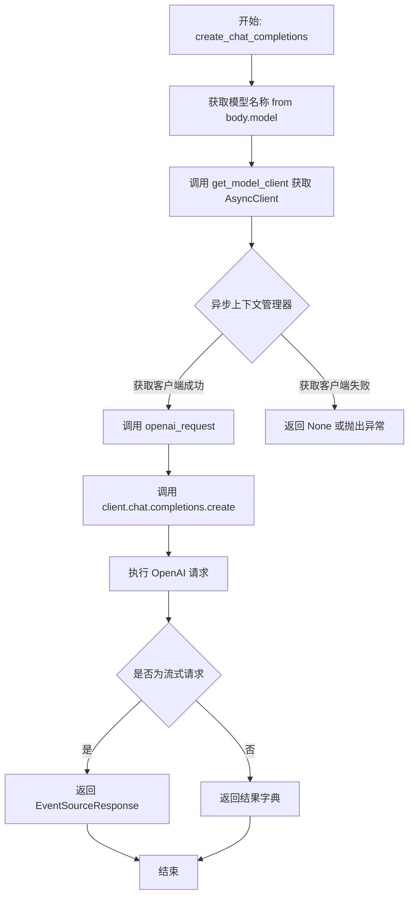

#### 带注释源码

```python
@openai_router.post("/chat/completions")
async def create_chat_completions(
    body: OpenAIChatInput,
):
    """
    处理聊天完成请求的异步端点
    
    参数:
        body: OpenAIChatInput 类型的请求体，包含模型名称、消息列表等
    
    返回:
        聊天完成结果，流式或非流式响应
    """
    # 使用异步上下文管理器获取模型客户端
    # get_model_client 会根据模型名称选择合适的平台和客户端
    async with get_model_client(body.model) as client:
        # 调用 openai_request 辅助函数执行请求
        # 该函数处理流式/非流式请求的差异，并添加额外的字段
        result = await openai_request(client.chat.completions.create, body)
        # 返回请求结果
        return result
```


### `create_completions`

该函数是 OpenAI 兼容接口的文本补全端点，接收文本补全请求，通过模型调度器获取合适的模型客户端，然后调用 `openai_request` 辅助函数向 OpenAI 兼容的补全接口发起请求，并返回结果。支持流式和非流式两种响应模式。

参数：

-  `request`：`Request`，FastAPI 请求对象，用于获取请求上下文（虽然当前未直接使用，但保留以备扩展）
-  `body`：`OpenAIChatInput`，包含模型名称、补全参数（如 prompt、max_tokens、temperature 等）的请求体

返回值：取决于请求类型。如果 `body.stream` 为 True，则返回 `EventSourceResponse`（SSE 流式响应）；否则返回 `Dict`（包含补全结果的字典）

#### 流程图

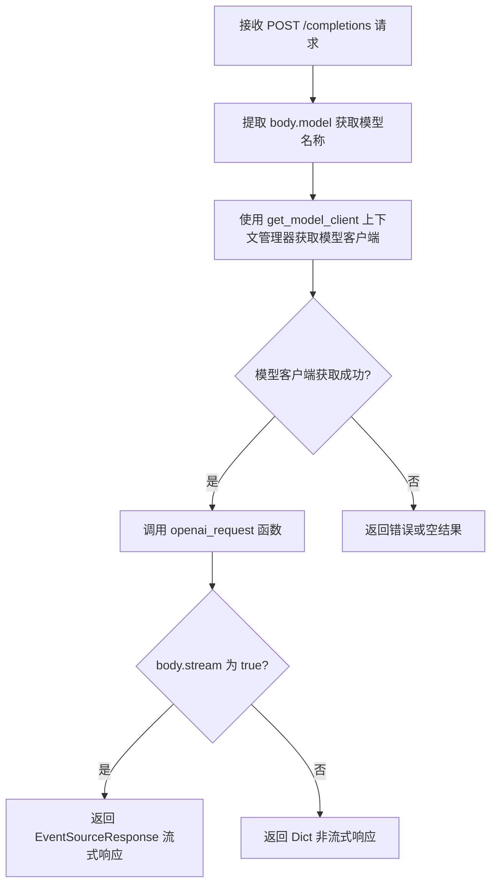

#### 带注释源码

```python
@openai_router.post("/completions")
async def create_completions(
    request: Request,      # FastAPI 请求对象
    body: OpenAIChatInput, # 包含模型和补全参数的请求体
):
    """
    处理文本补全请求的异步端点。
    1. 通过 get_model_client 获取对应模型的异步客户端（带并发控制）
    2. 调用 openai_request 发起补全请求
    3. 返回流式或非流式结果
    """
    # 使用上下文管理器获取模型客户端，自动处理并发信号量和资源释放
    async with get_model_client(body.model) as client:
        # 调用 openai_request 辅助函数，传入补全接口方法和请求体
        return await openai_request(client.completions.create, body)
```


### `create_embeddings`

处理嵌入生成请求的异步端点，接收嵌入输入参数，调用 OpenAI 兼容平台的 embeddings 接口，生成并返回嵌入向量结果。

参数：

- `request`：`Request`，FastAPI 请求对象，用于获取请求上下文（当前函数中未直接使用）
- `body`：`OpenAIEmbeddingsInput`，嵌入请求的输入数据，包含模型名称、输入文本等参数

返回值：`Dict`，嵌入模型的输出结果，包含嵌入向量数据

#### 流程图

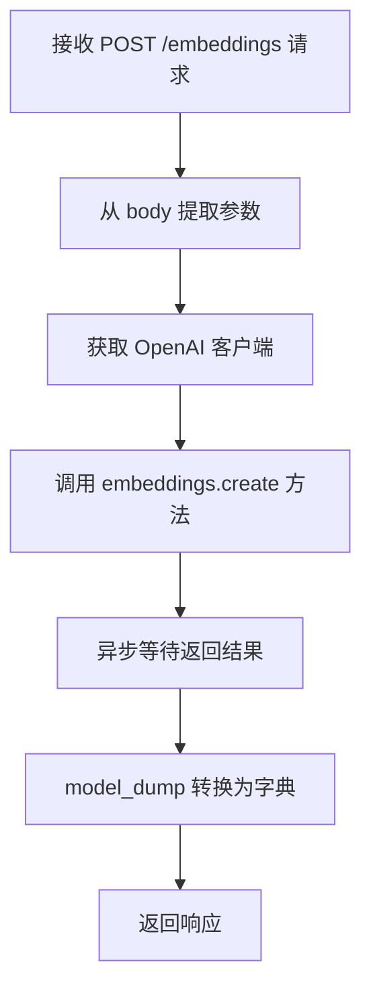

#### 带注释源码

```python
@openai_router.post("/embeddings")
async def create_embeddings(
    request: Request,          # FastAPI 请求对象，用于获取请求上下文
    body: OpenAIEmbeddingsInput, # 嵌入请求输入，包含 model、input 等字段
):
    """
    异步处理嵌入生成请求
    """
    # 从 body 中提取非空参数，生成字典
    params = body.model_dump(exclude_unset=True)
    
    # 根据模型名称获取对应的 OpenAI 客户端
    client = get_OpenAIClient(model_name=body.model)
    
    # 调用嵌入接口并返回结果
    return (await client.embeddings.create(**params)).model_dump()
```


### `create_image_generations`

该函数是 FastAPI 路由处理函数，接收图像生成请求，从请求体中提取模型名称和图像生成参数，通过上下文管理器获取对应的模型客户端，最后调用通用的 `openai_request` 辅助函数执行图像生成请求并返回结果。

参数：

- `request`：`Request`，FastAPI 请求对象，用于获取请求上下文信息（当前代码中未直接使用，但作为路由函数标准参数保留）
- `body`：`OpenAIImageGenerationsInput`，图像生成请求的输入模型，包含模型名称、提示词、图像数量、尺寸等生成参数

返回值：`Any`，返回图像生成的结果数据，具体类型取决于 `openai_request` 函数的返回，可能是同步结果或 SSE 流式响应（通过 `EventSourceResponse`）

#### 流程图

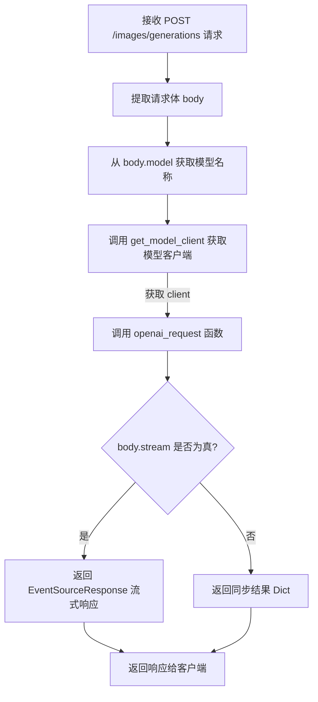

#### 带注释源码

```python
@openai_router.post("/images/generations")
async def create_image_generations(
    request: Request,
    body: OpenAIImageGenerationsInput,
):
    """
    处理图像生成请求的异步路由函数。
    
    参数:
        request: FastAPI Request 对象,提供请求上下文
        body: OpenAIImageGenerationsInput 模型,包含图像生成所需的参数
    
    返回:
        图像生成结果,类型取决于请求配置(同步或流式)
    """
    # 使用上下文管理器获取指定模型的异步客户端
    # get_model_client 会根据模型名称选择合适的平台客户端
    # 并处理并发限制(通过信号量)
    async with get_model_client(body.model) as client:
        # 调用通用 OpenAI 请求处理函数
        # client.images.generate 是 OpenAI SDK 的图像生成方法
        # openai_request 会处理同步/流式请求的差异
        return await openai_request(client.images.generate, body)
```


### `create_image_variations`

该函数是 FastAPI 路由处理程序，接收图像变体请求，使用 `get_model_client` 获取对应的 OpenAI 异步客户端，然后通过 `openai_request` 转发请求到底层模型，生成图像变体。

参数：

- `request`：`Request`，FastAPI 请求对象，用于获取请求上下文（虽然当前未直接使用，但保留以支持未来扩展如获取请求头、查询参数等）
- `body`：`OpenAIImageVariationsInput`，图像变体输入参数，包含模型名称、图像数据等

返回值：`Any`，返回 OpenAI 图像变体 API 的响应结果（可能是同步结果或通过 `EventSourceResponse` 返回的流式响应）

#### 流程图

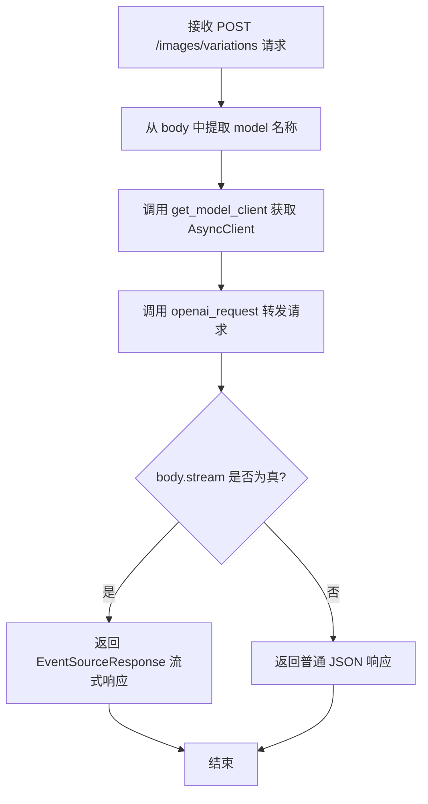

#### 带注释源码

```python
@openai_router.post("/images/variations")  # 注册路由：POST /v1/images/variations
async def create_image_variations(
    request: Request,                        # FastAPI 请求对象（当前未使用）
    body: OpenAIImageVariationsInput,        # 图像变体请求体，包含 model、image 等字段
):
    # 使用上下文管理器获取模型客户端，内部包含信号量调度逻辑
    async with get_model_client(body.model) as client:
        # 调用 openai_request 助手函数，传入客户端方法和请求体
        # openai_request 会自动处理流式/非流式响应，并添加额外字段
        return await openai_request(client.images.create_variation, body)
```


### `create_image_edit`

异步函数，处理图像编辑请求，调用 OpenAI 图像编辑接口，返回编辑后的图像结果。

参数：

- `request`：`Request`，FastAPI 请求对象，用于接收客户端请求
- `body`：`OpenAIImageEditsInput`，图像编辑请求的输入参数，包含模型名称、图像、遮罩等

返回值：`Dict` 或 `EventSourceResponse`，返回图像编辑结果，若启用流式则返回 `EventSourceResponse`，否则返回字典格式结果

#### 流程图

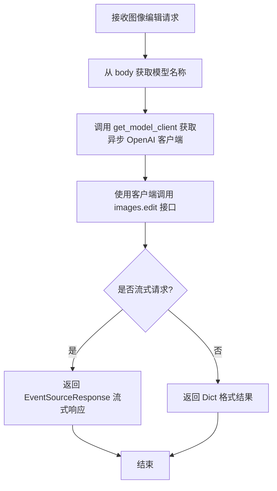

#### 带注释源码

```python
@openai_router.post("/images/edit")
async def create_image_edit(
    request: Request,
    body: OpenAIImageEditsInput,
):
    """
    处理图像编辑请求的异步端点
    
    参数:
        request: FastAPI Request 对象,包含请求上下文
        body: OpenAIImageEditsInput 类型,包含图像编辑所需的参数
              如模型名称、原始图像、遮罩图像、提示词等
    
    返回:
        根据 body.stream 配置返回:
        - 流式: EventSourceResponse 用于 SSE 推送
        - 非流式: Dict 格式的图像编辑结果
    """
    # 获取对应模型的异步 OpenAI 客户端
    async with get_model_client(body.model) as client:
        # 调用 openai_request 辅助函数执行图像编辑请求
        return await openai_request(client.images.edit, body)
```


### `create_audio_translations`

该函数是用于处理音频翻译请求的异步接口，当前已被标记为废弃并暂不支持使用。它接收客户端请求和音频翻译输入参数，通过模型客户端调度器获取合适的 OpenAI 客户端，并调用通用的请求处理函数完成翻译任务的转发。

参数：

- `request`：`Request`，FastAPI 请求对象，用于获取请求上下文信息
- `body`：`OpenAIAudioTranslationsInput`，音频翻译请求的输入参数模型，包含模型名称待翻译文件等字段

返回值：`Any`，返回 `openai_request` 函数的执行结果，通常为包含翻译结果的字典对象

#### 流程图

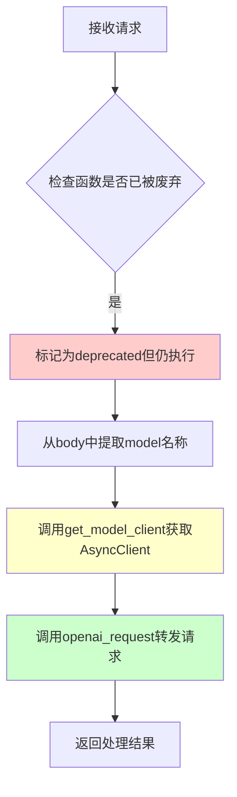

#### 带注释源码

```python
@openai_router.post("/audio/translations", deprecated="暂不支持")
async def create_audio_translations(
    request: Request,
    body: OpenAIAudioTranslationsInput,
):
    """
    音频翻译接口（暂不支持）
    
    该接口用于将音频文件翻译为目标语言，但由于功能尚未完善，
    已被标记为废弃。调用此接口时仍会正常执行请求逻辑。
    
    参数:
        request: FastAPI 请求对象，提供请求上下文
        body: 音频翻译输入模型，包含:
            - model: 使用的模型名称
            - file: 待翻译的音频文件
            - 其他翻译相关参数
    
    返回:
        包含翻译结果的字典对象，由 openai_request 返回
    """
    # 使用模型客户端上下文管理器获取对应平台的异步 OpenAI 客户端
    # get_model_client 会根据模型名称和平台配置进行调度
    async with get_model_client(body.model) as client:
        # 调用通用请求处理函数，传入客户端方法和请求体
        # 该函数会处理流式/非流式请求、异常捕获、额外字段注入等逻辑
        return await openai_request(client.audio.translations.create, body)
```


### `create_audio_transcriptions`

音频转录接口异步处理函数，目前标记为暂不支持（deprecated），用于接收客户端的音频转录请求，并通过 `get_model_client` 获取模型客户端后调用 OpenAI 音频转录 API 完成处理。

参数：

- `request`：`Request`，FastAPI 请求对象，包含客户端请求的上下文信息
- `body`：`OpenAIAudioTranscriptionsInput`，音频转录请求的输入参数，包含模型名称、音频文件等配置信息

返回值：`Any`，返回 `openai_request` 函数的执行结果，可能是 `EventSourceResponse`（流式响应）或 `Dict`（非流式响应）

#### 流程图

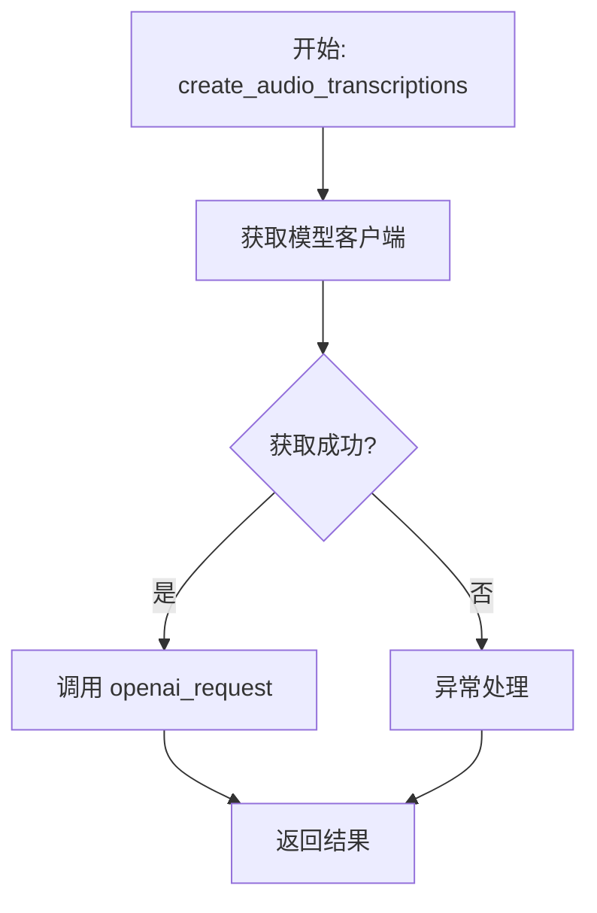

#### 带注释源码

```python
@openai_router.post("/audio/transcriptions", deprecated="暂不支持")
async def create_audio_transcriptions(
    request: Request,
    body: OpenAIAudioTranscriptionsInput,
):
    """
    音频转录接口异步处理函数
    
    该接口用于处理音频转录请求，将音频文件转换为文本。
    当前标记为 deprecated，暂不支持使用。
    
    参数:
        request: FastAPI 请求对象，提供请求上下文
        body: 音频转录输入参数，包含模型名称、文件等信息
    
    返回:
        返回 openai_request 的处理结果，支持流式或非流式响应
    """
    # 使用 async context manager 获取模型客户端
    # get_model_client 会根据模型名称选择合适的平台和并发控制
    async with get_model_client(body.model) as client:
        # 调用 openai_request 辅助函数执行实际的 API 请求
        # 该函数会处理流式/非流式响应以及额外的 JSON 字段
        return await openai_request(client.audio.transcriptions.create, body)
```


### `create_audio_speech`

这是一个异步 API 端点，用于通过 OpenAI 兼容接口生成音频语音（text-to-speech），但由于标记了 `@deprecated` 装饰器且 deprecated 属性为 "暂不支持"，目前该功能尚未启用或仍在开发中。

参数：

- `request`：`Request`，FastAPI 的请求对象，用于获取请求上下文信息
- `body`：`OpenAIAudioSpeechInput`，请求体，包含生成语音所需的模型名称、输入文本、音频配置等参数

返回值：`Any`，返回 `openai_request` 函数的结果，可能是字典或 OpenAI API 响应的模型_dump() 结果

#### 流程图

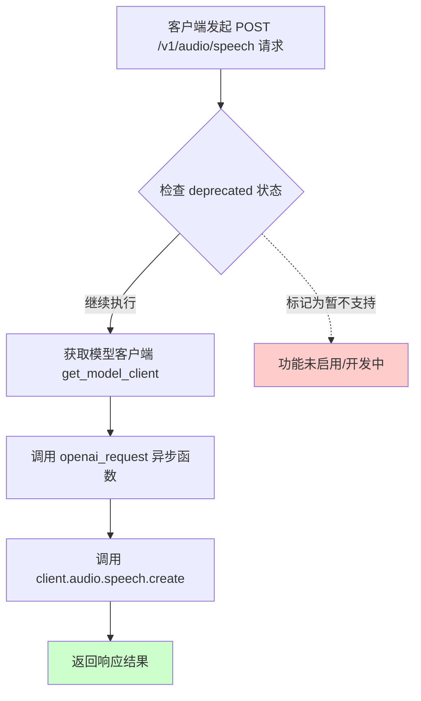

#### 带注释源码

```python
@openai_router.post("/audio/speech", deprecated="暂不支持")
async def create_audio_speech(
    request: Request,
    body: OpenAIAudioSpeechInput,
):
    """
    异步端点：创建音频语音（Text-to-Speech）
    
    暂不支持：该功能标记为 deprecated，原因为 "暂不支持"
    """
    # 使用上下文管理器获取模型客户端，支持多平台调度
    async with get_model_client(body.model) as client:
        # 调用通用请求处理函数，传入 OpenAI 客户端的 audio.speech.create 方法
        return await openai_request(client.audio.speech.create, body)
```

---

#### 关联组件说明

| 组件名称 | 描述 |
|---------|------|
| `get_model_client` | 异步上下文管理器，根据模型名称获取可用的 OpenAI 客户端，支持多平台调度和并发控制 |
| `openai_request` | 通用异步请求处理函数，支持流式/非流式响应，注入额外字段 |
| `OpenAIAudioSpeechInput` | Pydantic 模型，定义音频语音生成的请求参数 |
| `model_semaphores` | 全局并发控制字典，按 (model_name, platform) 限制并发数 |


### `_get_file_id`

生成文件ID，基于base64编码。该函数将文件用途、创建日期和文件名组合后，使用URL安全的Base64编码生成唯一的文件标识符。

参数：

- `purpose`：`str`，文件用途（如 "assistants"），用于标识文件的类别
- `created_at`：`int`，文件创建时间的时间戳（秒），用于生成日期信息
- `filename`：`str`，原始文件名，标识文件的名称

返回值：`str`，经过URL安全Base64编码的文件ID，格式为 `{purpose}/{today}/{filename}` 的Base64编码字符串

#### 流程图

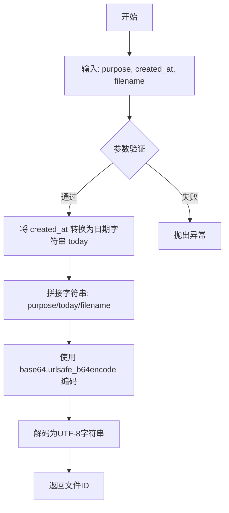

#### 带注释源码

```python
def _get_file_id(
    purpose: str,
    created_at: int,
    filename: str,
) -> str:
    """
    生成文件ID，基于base64编码。
    
    将文件用途、创建日期和文件名组合后，使用URL安全的Base64编码
    生成唯一的文件标识符。
    
    参数:
        purpose: 文件用途（如 "assistants"）
        created_at: 文件创建时间的时间戳（秒）
        filename: 原始文件名
    
    返回:
        经过URL安全Base64编码的文件ID字符串
    """
    # 将时间戳转换为日期字符串，格式为 YYYY-MM-DD
    today = datetime.fromtimestamp(created_at).strftime("%Y-%m-%d")
    
    # 构造文件路径格式字符串: {purpose}/{today}/{filename}
    # 示例: "assistants/2024-01-15/document.pdf"
    file_path_string = f"{purpose}/{today}/{filename}"
    
    # 使用URL安全的Base64编码（替换 + 和 / 为 - 和 _，去掉填充 =）
    # 编码后结果示例: "YXNzaXN0YW50cy8yMDI0LTAxLTE1L2RvY3VtZW50LnBkZg=="
    encoded_id = base64.urlsafe_b64encode(file_path_string.encode()).decode()
    
    return encoded_id
```


### `_get_file_info`

获取文件信息，根据文件ID（Base64编码）解码并查询本地文件系统中的文件元数据。

参数：

- `file_id`：`str`，文件唯一标识符（Base64 URL安全编码的字符串，格式为 `purpose/date/filename`）

返回值：`Dict`，包含文件用途、创建时间、文件名和文件大小的字典

#### 流程图

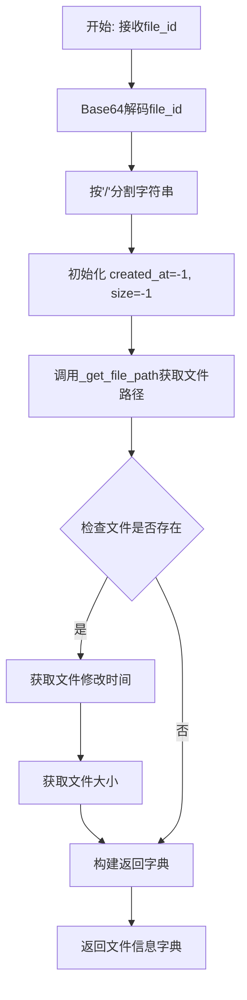

#### 带注释源码

```python
def _get_file_info(file_id: str) -> Dict:
    """
    根据file_id获取文件的元信息
    
    参数:
        file_id: Base64 URL安全编码的文件ID，格式为 "purpose/date/filename"
    
    返回:
        包含文件信息的字典:
        - purpose: 文件用途
        - created_at: 文件创建时间(Unix时间戳)，文件不存在时为-1
        - filename: 文件名
        - bytes: 文件大小(字节)，文件不存在时为-1
    """
    # 1. Base64解码file_id并分割获取各部分信息
    splits = base64.urlsafe_b64decode(file_id).decode().split("/")
    
    # 2. 初始化默认值（文件不存在时的默认值）
    created_at = -1
    size = -1
    
    # 3. 获取文件完整路径
    file_path = _get_file_path(file_id)
    
    # 4. 检查文件是否存在，若存在则获取实际元数据
    if os.path.isfile(file_path):
        created_at = int(os.path.getmtime(file_path))  # 获取文件修改时间
        size = os.path.getsize(file_path)               # 获取文件大小
    
    # 5. 组装并返回文件信息字典
    return {
        "purpose": splits[0],      # 从解码后的字符串中提取用途
        "created_at": created_at,  # 文件修改时间或-1
        "filename": splits[2],     # 从解码后的字符串中提取文件名
        "bytes": size,             # 文件大小或-1
    }
```


### `_get_file_path`

该函数接收一个Base64编码的URL安全文件ID，解码后将其与基础临时目录和"openai_files"子目录拼接，返回文件的完整文件系统路径，用于在服务器端定位和管理上传的OpenAI兼容格式文件。

参数：

- `file_id`：`str`，Base64编码的URL安全文件标识符，包含文件的目的地、创建日期和文件名信息

返回值：`str`，返回文件的完整绝对路径，格式为`{基础临时目录}/openai_files/{purpose}/{date}/{filename}`

#### 流程图

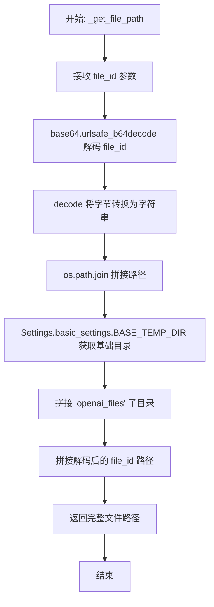

#### 带注释源码

```python
def _get_file_path(file_id: str) -> str:
    """
    根据文件ID获取文件的完整路径
    
    该函数是文件管理模块的核心路径解析函数，将Base64编码的
    文件ID转换为实际的文件系统路径。
    
    Parameters:
        file_id (str): Base64编码的URL安全字符串，格式为 "purpose/date/filename"
                       例如: "assistants/2024-01-15/document.pdf"
    
    Returns:
        str: 文件的完整绝对路径，格式为:
             "{BASE_TEMP_DIR}/openai_files/{purpose}/{date}/{filename}"
    """
    # Step 1: Base64 URL安全解码
    # 将编码的文件ID还原为原始的路径字符串
    # 输入示例: "YXNzaXN0YW50cy8yMDI0LTAxLTE1L2RvY3VtZW50LnBkZg=="
    # 输出示例: "assistants/2024-01-15/document.pdf"
    file_id = base64.urlsafe_b64decode(file_id).decode()
    
    # Step 2: 路径拼接
    # 将基础临时目录、openai_files子目录和解码后的文件ID组合成完整路径
    # Settings.basic_settings.BASE_TEMP_DIR 通常为系统的临时目录路径
    return os.path.join(
        Settings.basic_settings.BASE_TEMP_DIR,  # 基础临时目录，如 /tmp 或 /var/tmp
        "openai_files",                          # OpenAI文件存储子目录
        file_id                                  # 解码后的文件路径（purpose/date/filename）
    )
```

---

#### 补充信息

**使用场景：**
- `files` API：上传文件时生成存储路径
- `list_files` API：遍历目录时还原文件ID
- `retrieve_file` API：获取文件元信息时定位文件
- `retrieve_file_content` API：返回文件内容时定位文件
- `delete_file` API：删除文件时定位文件

**路径格式示例：**
```
输入file_id: "YXNzaXN0YW50cy8yMDI0LTAxLTE1L3Rlc3QuZHR4"
解码后: "assistants/2024-01-15/test.dtx"
返回路径: "/tmp/chatchat/openai_files/assistants/2024-01-15/test.dtx"
```

**潜在优化空间：**
1. 缺少路径安全性验证（路径遍历攻击防护）
2. 未检查文件是否存在于文件系统中
3. 没有处理 `base64.urlsafe_b64decode` 解码失败的情况
4. 硬编码了 "openai_files" 子目录名称，可配置化


### `files`

异步函数，处理文件上传，将上传的文件保存到服务器指定目录，并返回文件元信息。

参数：

- `request`：`Request`，FastAPI 请求对象，用于获取请求上下文
- `file`：`UploadFile`，上传的文件对象
- `purpose`：`str`，文件用途，默认为 "assistants"

返回值：`Dict`，包含文件ID、文件名、大小、创建时间、对象类型和用途的字典

#### 流程图

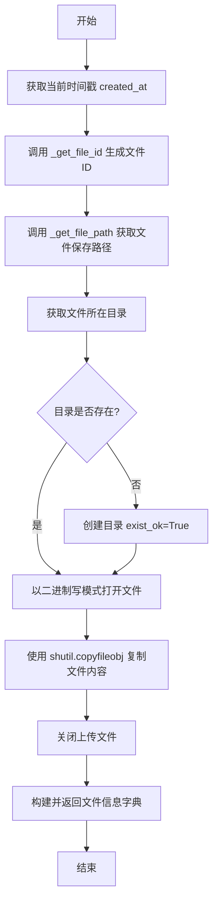

#### 带注释源码

```python
@openai_router.post("/files")
async def files(
    request: Request,
    file: UploadFile,
    purpose: str = "assistants",
) -> Dict:
    """
    处理文件上传接口
    - 根据 purpose、当前时间戳和文件名生成唯一文件ID
    - 将文件保存到配置的临时目录下的 openai_files 目录
    - 返回文件元信息
    """
    # 获取当前时间戳作为文件创建时间
    created_at = int(datetime.now().timestamp())
    # 根据 purpose、创建时间和文件名生成 base64 编码的文件ID
    file_id = _get_file_id(
        purpose=purpose, created_at=created_at, filename=file.filename
    )
    # 获取文件的完整保存路径
    file_path = _get_file_path(file_id)
    # 获取文件所在目录
    file_dir = os.path.dirname(file_path)
    # 确保目录存在，如不存在则创建
    os.makedirs(file_dir, exist_ok=True)
    # 以二进制写模式打开目标文件
    with open(file_path, "wb") as fp:
        # 将上传文件的流内容复制到目标文件
        shutil.copyfileobj(file.file, fp)
    # 关闭上传文件流，释放资源
    file.file.close()

    # 返回文件元信息字典
    return dict(
        id=file_id,                 # 文件唯一标识
        filename=file.filename,     # 文件名
        bytes=file.size,            # 文件大小
        created_at=created_at,      # 创建时间戳
        object="file",              # 对象类型
        purpose=purpose,            # 文件用途
    )
```


### `list_files`

列出指定用途（purpose）的所有文件，并返回包含文件 ID、元数据等信息的数据结构。

参数：

- `purpose`：`str`，文件用途（如 "assistants"），用于定位存储目录

返回值：`Dict[str, List[Dict]]`，返回包含文件列表的字典，结构为 `{"data": [file_info_dict, ...]}`，每个 file_info_dict 包含 id、object、purpose、created_at、filename、bytes 字段

#### 流程图

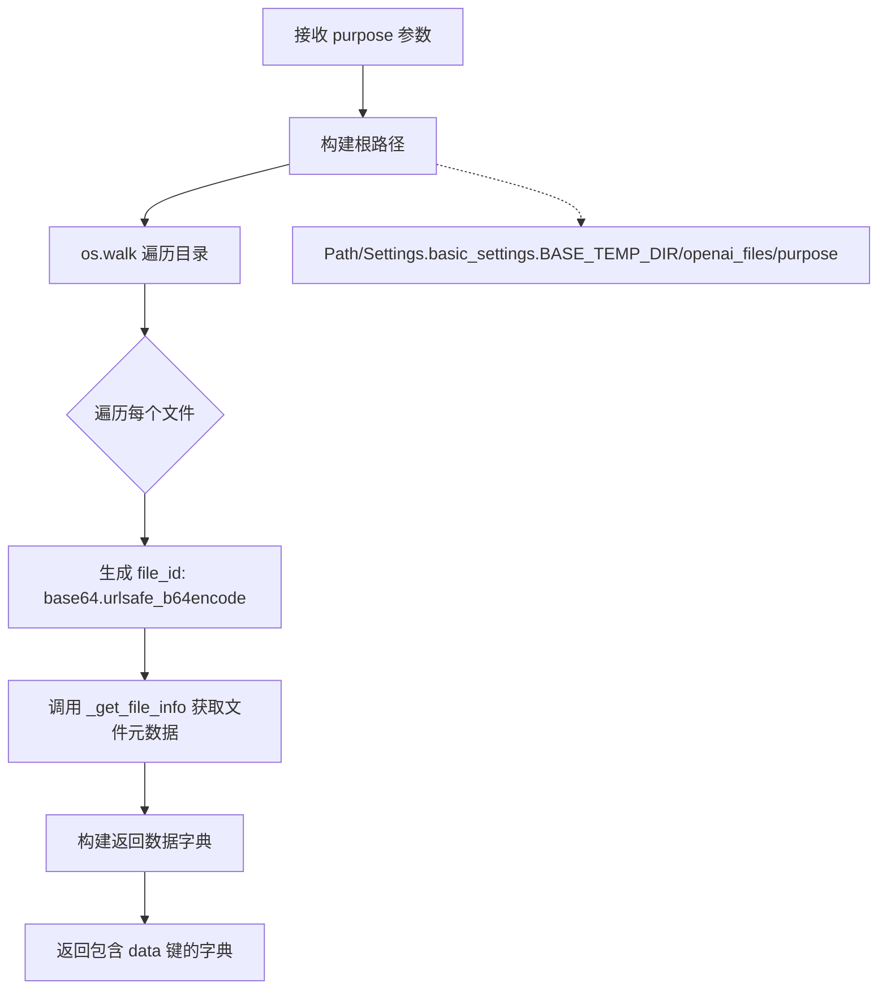

#### 带注释源码

```python
@openai_router.get("/files")
def list_files(purpose: str) -> Dict[str, List[Dict]]:
    """
    列出指定用途的所有文件
    
    该函数遍历 BASE_TEMP_DIR/openai_files/{purpose} 目录，
    对每个文件生成唯一的 file_id，并获取其元数据信息。
    """
    file_ids = []
    # 构建目标目录路径：基础临时目录 + openai_files 子目录 + 用途目录
    root_path = Path(Settings.basic_settings.BASE_TEMP_DIR) / "openai_files" / purpose
    
    # 使用 os.walk 递归遍历目录树
    for dir, sub_dirs, files in os.walk(root_path):
        # 计算相对路径
        dir = Path(dir).relative_to(root_path).as_posix()
        for file in files:
            # 生成文件唯一标识：用途/相对路径/文件名
            # 使用 URL 安全的 base64 编码确保 ID 可作为 URL 参数
            file_id = base64.urlsafe_b64encode(
                f"{purpose}/{dir}/{file}".encode()
            ).decode()
            file_ids.append(file_id)
    
    # 构建返回数据：每个文件信息包含从 _get_file_info 获取的元数据
    # 加上 id 和 object 字段
    return {
        "data": [{**_get_file_info(x), "id": x, "object": "file"} for x in file_ids]
    }
```


### `retrieve_file`

获取指定文件ID的元信息，包括文件用途、创建时间、文件名和文件大小等。

参数：

- `file_id`：`str`，文件的唯一标识符（Base64 编码的 URL 安全字符串）

返回值：`Dict`，包含文件元信息的字典，包含 purpose（用途）、created_at（创建时间戳）、filename（文件名）、bytes（文件大小）、id（文件ID）和 object（对象类型）

#### 流程图

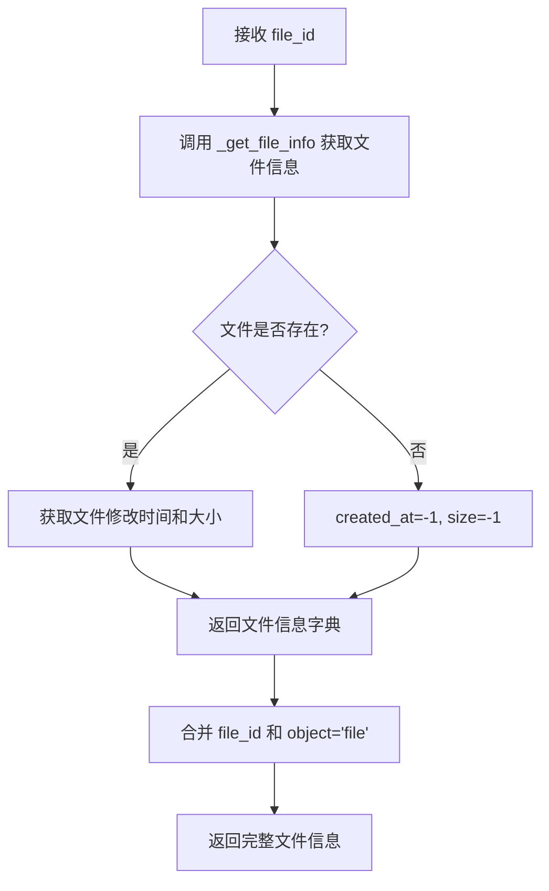

#### 带注释源码

```python
@openai_router.get("/files/{file_id}")
def retrieve_file(file_id: str) -> Dict:
    """
    获取指定文件ID的元信息
    
    Args:
        file_id: Base64 URL 编码的文件标识符，格式为 "purpose/date/filename"
    
    Returns:
        包含文件元信息的字典，包括：
        - id: 文件ID
        - object: 对象类型，固定为 "file"
        - purpose: 文件用途
        - filename: 文件名
        - created_at: 创建时间戳（文件不存在时为 -1）
        - bytes: 文件大小（字节，文件不存在时为 -1）
    """
    # 调用内部函数获取文件基本信息
    file_info = _get_file_info(file_id)
    
    # 合并文件信息与文件ID和对象类型，返回完整的文件元信息字典
    return {**file_info, "id": file_id, "object": "file"}
```


### `retrieve_file_content`

获取指定文件ID对应的文件内容，以文件下载的形式返回给客户端。

参数：

- `file_id`：`str`，文件唯一标识符，通过 Base64 编码包含文件的用途、创建日期和文件名信息

返回值：`FileResponse`（代码中标注为 `Dict`，实际返回 FastAPI 的 FileResponse 对象），返回文件的二进制内容，支持断点续传和内容协商

#### 流程图

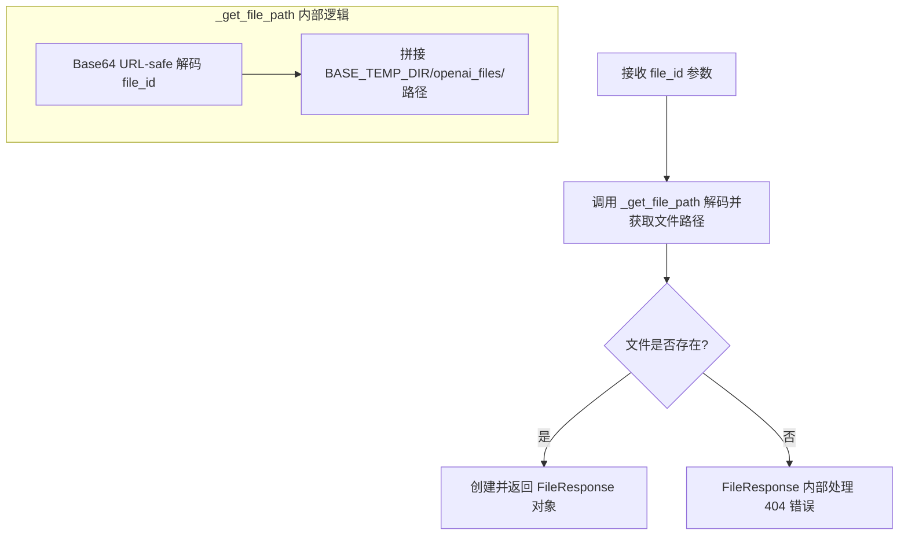

#### 带注释源码

```python
@openai_router.get("/files/{file_id}/content")
def retrieve_file_content(file_id: str) -> Dict:
    """
    获取文件内容的接口端点
    """
    # Step 1: 根据 file_id 解析并获取文件的实际存储路径
    # _get_file_path 内部逻辑：
    # 1. base64.urlsafe_b64decode(file_id) 解码得到 "purpose/date/filename" 格式的字符串
    # 2. 拼接路径: Settings.basic_settings.BASE_TEMP_DIR/openai_files/{解码后的路径}
    file_path = _get_file_path(file_id)
    
    # Step 2: 使用 FastAPI 的 FileResponse 返回文件
    # FileResponse 会自动处理：
    # - Content-Type 头（根据文件扩展名推断）
    # - Content-Length 头
    # - Content-Disposition 头（attachment 模式触发下载）
    # - 断点续传支持（Range 请求）
    return FileResponse(file_path)
```


### `delete_file`

该函数是 FastAPI 的删除文件接口处理程序，接收客户端传来的文件 ID，调用内部函数 `_get_file_path` 获取实际文件路径，检查文件是否存在，如存在则删除该文件，最后返回包含文件 ID、删除状态和对象类型的字典。

参数：

- `file_id`：`str`，文件唯一标识符，用于定位要删除的文件

返回值：`Dict`，包含删除操作的结果，包含文件 ID、删除状态（布尔值）和对象类型

#### 流程图

```mermaid
flowchart TD
    A[开始 delete_file] --> B[调用 _get_file_path 获取文件路径]
    B --> C[初始化 deleted = False]
    C --> D{检查文件是否存在 os.path.isfile}
    D -->|是| E[执行文件删除 os.remove]
    D -->|否| F[直接进入返回步骤]
    E --> G[设置 deleted = True]
    F --> H[返回结果字典]
    G --> H
    H[结束]
```

#### 带注释源码

```python
@openai_router.delete("/files/{file_id}")
def delete_file(file_id: str) -> Dict:
    """
    删除指定文件
    """
    # 根据 file_id 获取服务器上的实际文件路径
    file_path = _get_file_path(file_id)
    # 初始化删除状态为 False
    deleted = False

    try:
        # 检查文件是否存在
        if os.path.isfile(file_path):
            # 存在则删除文件
            os.remove(file_path)
            # 更新删除状态为 True
            deleted = True
    except:
        # 异常捕获静默处理，任何错误都视为删除失败
        ...

    # 返回包含文件ID、删除状态和对象类型的字典
    return {"id": file_id, "deleted": deleted, "object": "file"}
```

## 关键组件


### 模型并发控制系统 (model_semaphores)

全局信号量字典，用于控制每个平台模型的并发请求数量，key 为 (model_name, platform_name) 元组，value 为 asyncio.Semaphore 对象。

### 异步模型客户端获取器 (get_model_client)

异步上下文管理器，根据模型名称获取可用的 OpenAI 客户端。实现了调度策略：优先选择空闲的模型，其次选择当前访问数最少的模型。支持重名模型的多平台调度。

### 通用 OpenAI 请求处理函数 (openai_request)

处理 OpenAI API 请求的辅助函数，支持流式和非流式响应。支持在请求前后注入额外字段，处理多种输入格式（字符串或字典），并提供统一的错误处理和日志记录。

### 多平台模型列表整合 (list_models)

异步函数，通过并发请求所有已配置平台获取模型列表，并整合返回。返回格式遵循 OpenAI API 规范，包含平台名称标识。

### 文件管理模块

包含文件上传 (_get_file_id, files)、文件列表获取 (list_files)、文件信息查询 (_get_file_info)、文件内容获取 (retrieve_file_content) 及文件删除 (delete_file) 等功能，基于 Base64 编码的文件 ID 和临时目录存储。

### API 路由集合 (openai_router)

FastAPI 路由器，提供完整的 OpenAI 兼容接口，包括：/models（模型列表）、/chat/completions（聊天完成）、/completions（文本补全）、/embeddings（嵌入生成）、/images/generations（图像生成）、/images/variations（图像变体）、/images/edit（图像编辑）、/audio/*（音频相关，已deprecated）等端点。


## 问题及建议


### 已知问题

-   **`get_model_client` 函数的信号量选择逻辑存在缺陷**：当所有平台的信号量都不可用时，函数会使用循环结束后的最后一个 `m` 值，可能导致选择了错误的平台；且直接访问 `semaphore._value` 是私有属性，存在不稳定性
-   **全局 `model_semaphores` 字典存在竞态条件**：多个协程可能同时修改该字典，缺乏线程/协程安全的保护机制
-   **资源泄漏风险**：`get_model_client` 异常捕获块中仅记录日志，若获取客户端失败，信号量未被正确释放；`files` 端点中 `file.file.close()` 调用后未使用上下文管理器
-   **异常处理不完整**：`delete_file` 函数中使用 `...` 忽略异常，应使用具体异常类型或日志记录；部分端点（如音频相关）标记为 deprecated 但仍返回实现代码
-   **类型注解不严谨**：`extra_json: Dict = {}` 应为 `Dict[str, Any]`；`header: Iterable = []` 应明确类型；缺少许多参数和返回值的类型注解
-   **文件路径遍历风险**：`_get_file_path` 函数未验证 `file_id` 解码后的路径是否在预期目录内，可能存在路径遍历攻击漏洞
-   **API 参数使用不一致**：部分端点接收 `request: Request` 参数但未实际使用；函数参数命名不一致（如 `body` vs `request, body`）

### 优化建议

-   **重构并发控制逻辑**：使用 `asyncio.Lock` 保护 `model_semaphores` 字典；重构 `get_model_client` 使用明确的选择策略；考虑使用公共属性或封装方法访问信号量值
-   **完善资源管理**：使用 `try/finally` 确保信号量在所有路径上都能正确释放；文件操作使用上下文管理器 (`async with` 或 `with`)
-   **规范化异常处理**：为所有异常处理添加具体日志；为 deprecated 端点返回适当的状态码（如 501 NotImplemented）而非空实现
-   **加强类型注解**：使用 `typing.Optional`、`typing.Any`、`typing.List` 等提供完整类型信息；为所有公开函数添加返回类型注解
-   **增强安全性**：在文件路径操作前验证路径合法性；添加路径遍历攻击防护
-   **统一 API 设计**：移除未使用的 `request` 参数；统一函数签名风格
-   **性能优化**：`list_files` 端点考虑使用缓存或分页；考虑为频繁创建的任务添加连接池或复用机制

## 其它


### 设计目标与约束

本模块旨在提供一个统一的OpenAI兼容API网关，整合多个大模型平台的访问能力。核心设计目标包括：1）通过统一接口屏蔽底层平台差异，降低上游业务系统的接入成本；2）通过信号量机制实现单平台单模型的并发控制，防止单个平台配额被耗尽；3）支持模型级别的负载均衡，优先选择空闲度最高的平台；4）完整兼容OpenAI API规范（/v1/*路径），支持chat completions、completions、embeddings、images、audio、files等核心功能。约束条件包括：依赖openai库和FastAPI框架；需要预先配置MODEL_PLATFORMS；音频相关接口暂不支持。

### 错误处理与异常设计

整体采用分层异常处理策略。在`openai_request`函数中，通过try-except捕获两类异常：1）asyncio.exceptions.CancelledError表示用户主动中断流式响应，记录warning日志后正常返回；2）其他Exception统一记录error日志，并以OpenAI错误格式返回给客户端。在`get_model_client`中，捕获异常后记录日志但不抛出，确保信号量能正确释放。HTTP层异常通过FastAPI的HTTPException统一处理。对于平台调用失败，`list_models`函数中每个平台的请求相互独立，单一平台异常不影响其他平台结果的返回。文件操作相关的异常在`delete_file`中采用静默处理模式。

### 数据流与状态机

主数据流如下：客户端请求 → FastAPI路由 → 获取模型客户端(get_model_client) → 调度选择平台 → 调用openai_request → 转发至目标平台 → 响应回传。状态机主要体现在模型调度过程：get_model_client首先获取模型的所有平台配置，然后遍历检查每个平台的信号量可用量，优先选择信号量值等于并发上限（即完全空闲）的平台，若无完全空闲则选择可用量最大的平台，选中后尝试获取信号量，获取成功后yield客户端实例，finally块确保信号量释放。流式响应使用EventSourceResponse实现Server-Sent Events推送。

### 外部依赖与接口契约

本模块依赖以下外部组件：1）openai库(AsyncClient)用于与各平台建立连接；2）FastAPI框架提供HTTP服务；3）sse_starlette用于流式响应；4）chatchat.settings模块提供配置管理(get_config_platforms、get_model_info、get_OpenAIClient)；5）chatchat.utils.build_logger用于日志记录。接口契约方面，所有/v1/*路径遵循OpenAI API规范，返回数据结构与OpenAI官方文档一致。模型列表接口并发获取各平台模型后合并；文件相关接口将文件存储在BASE_TEMP_DIR/openai_files目录下，文件ID采用base64编码的purpose/date/filename格式。

### 安全考虑

当前代码未实现显式的身份认证和授权机制，建议在生产环境中通过FastAPI的依赖注入添加API Key验证。文件上传接口未对文件类型和大小做限制，存在潜在的安全风险。敏感信息如平台API Key应通过环境变量或密钥管理系统注入，避免硬编码。跨平台调度过程中需注意日志脱敏，防止泄露平台配置信息。

### 性能考虑与优化空间

并发控制使用字典缓存信号量实例，避免重复创建开销。模型列表获取采用asyncio.as_completed实现并行请求，减少总等待时间。优化建议：1）model_semaphores字典缺乏清理机制，长期运行可能导致内存泄漏，建议添加过期清理逻辑；2）get_model_client中的平台选择逻辑在高并发场景下可能存在竞争条件，建议增加锁保护；3）文件操作使用同步IO，在高负载时可能阻塞事件循环，建议改用aiofiles；4）可考虑引入连接池复用OpenAI客户端实例。

### 配置管理

主要配置项包括：DEFAULT_API_CONCURRENCIES设置单模型默认最大并发数（默认5）；Settings.model_settings.MAX_TOKENS设置默认最大token数；Settings.basic_settings.BASE_TEMP_DIR设置文件存储根目录；MODEL_PLATFORMS（在get_config_platforms中获取）定义各平台的模型映射和并发限制。配置通过chatchat.settings模块统一管理，支持从环境变量或配置文件加载。

### 监控与日志

日志使用build_logger()创建，记录级别分为info、warning、error三档。关键日志点包括：请求调度失败、平台调用异常、流式响应中断。监控指标建议包括：各平台请求成功率、平均响应时间、并发使用率、信号量等待队列长度。文件操作相关接口缺少访问日志，建议补充以便审计追溯。

### 版本兼容性

本模块兼容OpenAI API v1版本规范，使用/v1前缀路径。支持的模型类型包括chat、text、embedding、image、audio、file。需要注意不同平台对OpenAI API规范的实现程度差异，某些高级参数可能不被所有平台支持。音频相关接口（translations、transcriptions、speech）当前标记为deprecated，暂不支持。

### 限流与配额管理

限流机制通过asyncio.Semaphore实现，每个(model_name, platform)组合拥有独立的信号量，容量由api_concurrencies配置决定。默认容量为5，可通过平台配置覆盖。信号量释放时机在finally块中确保执行，即使发生异常也能正确归还配额。注意：当前实现中信号量值的检查（semaphore._value）依赖于asyncio.Semaphore的内部实现，存在版本兼容性风险。


    