# `Langchain-Chatchat\libs\chatchat-server\chatchat\server\api_server\server_app.py` 详细设计文档

这是一个基于 FastAPI 的 Langchain-ChatGLM API 服务器，提供了聊天、知识库检索、工具调用、OpenAI 兼容接口、MCP 协议支持等多种功能，并支持静态文件服务（媒体和图片）和跨域访问控制。

## 整体流程

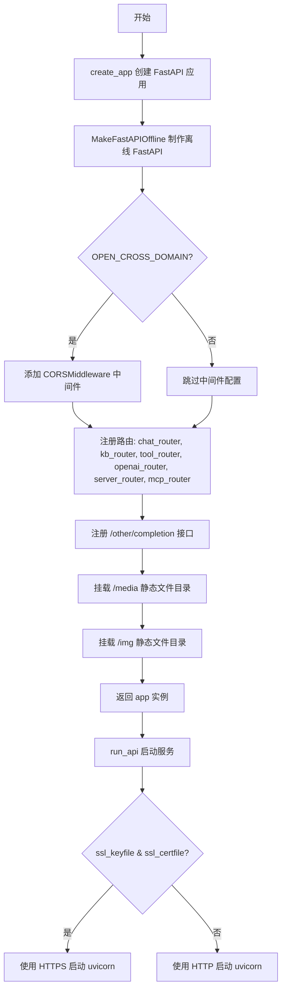

## 类结构

```
FastAPI (主应用框架)
├── chat_router (聊天相关 API)
├── kb_router (知识库相关 API)
├── tool_router (工具相关 API)
├── openai_router (OpenAI 兼容 API)
├── server_router (服务器管理 API)
├── mcp_router (MCP 协议 API)
└── StaticFiles (静态文件服务: /media, /img)
```

## 全局变量及字段


### `app`
    
FastAPI应用程序实例，由create_app()函数创建并返回，作为整个API服务的主应用对象

类型：`FastAPI`
    


### `run_mode`
    
创建应用时的运行模式参数，用于控制应用的初始化行为，默认为None

类型：`Optional[str]`
    


### `args`
    
命令行参数解析结果对象，包含host、port、ssl_keyfile、ssl_certfile等运行时配置

类型：`argparse.Namespace`
    


### `args_dict`
    
将args命名空间对象转换为字典形式，便于后续参数传递和访问

类型：`dict`
    


### `host`
    
服务器监听地址，默认为0.0.0.0，表示监听所有网络接口

类型：`str`
    


### `port`
    
服务器监听端口，默认为7861，用于接收客户端请求

类型：`int`
    


### `FastAPI.title`
    
FastAPI应用的标题，设置为'Langchain-Chatchat API Server'，用于API文档显示

类型：`str`
    


### `FastAPI.version`
    
FastAPI应用的版本号，值为__version__变量，用于API文档和版本跟踪

类型：`str`
    
    

## 全局函数及方法


### `create_app`

该函数是 Langchain-Chatchat 项目的核心应用工厂函数，用于创建和配置 FastAPI 应用实例，包括设置中间件、注册各类路由、挂载静态文件，并返回配置完整的应用对象。

参数：

- `run_mode`：`str`，可选参数，用于指定运行模式，默认为 None

返回值：`FastAPI`，返回配置完成的 FastAPI 应用实例

#### 流程图

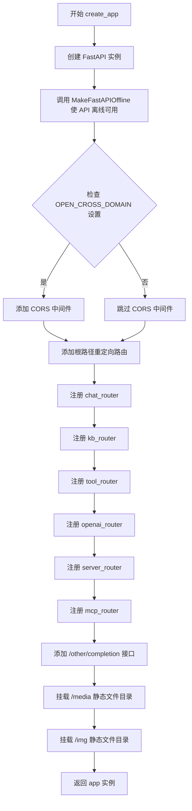

#### 带注释源码

```python
def create_app(run_mode: str = None):
    """
    创建并配置 FastAPI 应用实例
    
    参数:
        run_mode: 运行模式，可选参数
    
    返回:
        配置完成的 FastAPI 应用实例
    """
    # 1. 创建 FastAPI 应用，设置标题和版本
    app = FastAPI(title="Langchain-Chatchat API Server", version=__version__)
    
    # 2. 使 FastAPI 离线可用（不依赖在线 OpenAPI 规范）
    MakeFastAPIOffline(app)
    
    # 3. 添加 CORS 中间件，允许跨域请求
    # 在 config.py 中设置 OPEN_DOMAIN=True，允许跨域
    # set OPEN_DOMAIN=True in config.py to allow cross-domain
    if Settings.basic_settings.OPEN_CROSS_DOMAIN:
        app.add_middleware(
            CORSMiddleware,
            allow_origins=["*"],           # 允许所有来源
            allow_credentials=True,       # 允许携带凭证
            allow_methods=["*"],          # 允许所有 HTTP 方法
            allow_headers=["*"],          # 允许所有请求头
        )

    # 4. 根路径重定向到 swagger 文档
    @app.get("/", summary="swagger 文档", include_in_schema=False)
    async def document():
        return RedirectResponse(url="/docs")

    # 5. 注册各类业务路由
    app.include_router(chat_router)      # 聊天相关路由
    app.include_router(kb_router)        # 知识库相关路由
    app.include_router(tool_router)      # 工具相关路由
    app.include_router(openai_router)    # OpenAI 兼容路由
    app.include_router(server_router)    # 服务器相关路由
    app.include_router(mcp_router)       # MCP 协议路由

    # 6. 其它接口 - LLM 模型补全接口
    app.post(
        "/other/completion",
        tags=["Other"],
        summary="要求llm模型补全(通过LLMChain)",
    )(completion)

    # 7. 媒体文件静态文件服务
    app.mount("/media", StaticFiles(directory=Settings.basic_settings.MEDIA_PATH), name="media")

    # 8. 项目相关图片静态文件服务
    img_dir = str(Settings.basic_settings.IMG_DIR)
    app.mount("/img", StaticFiles(directory=img_dir), name="img")

    # 9. 返回配置完成的 app 实例
    return app
```


### `run_api`

该函数是 FastAPI 应用的启动入口，根据是否提供 SSL 证书文件（ssl_keyfile 和 ssl_certfile），选择使用 HTTPS 或 HTTP 模式启动 uvicorn 服务器。

参数：

- `host`：`str`，服务器监听的主机地址
- `port`：`int`，服务器监听的端口号
- `ssl_keyfile`：`str`，可选，SSL 私钥文件路径，用于 HTTPS 加密
- `ssl_certfile`：`str`，可选，SSL 证书文件路径，用于 HTTPS 加密
- `**kwargs`：可变关键字参数，可传递其他 uvicorn.run 支持的参数

返回值：`None`，无返回值，通过 uvicorn.run 启动服务器

#### 流程图

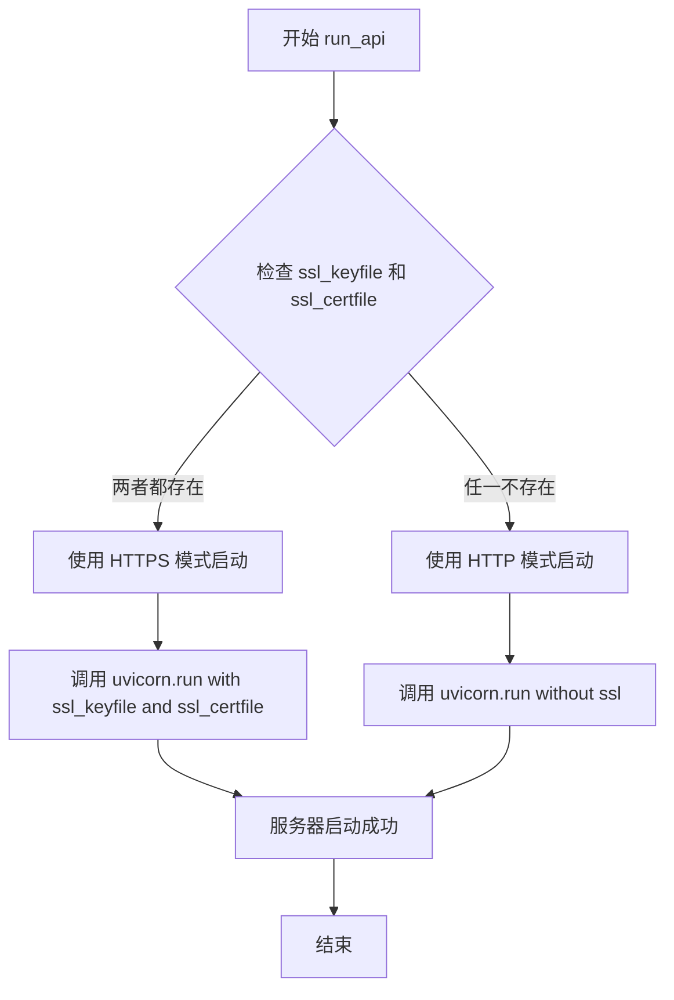

#### 带注释源码

```python
def run_api(host, port, **kwargs):
    """
    启动 FastAPI 应用的 uvicorn 服务器
    
    参数:
        host: 服务器监听的主机地址，如 '0.0.0.0'
        port: 服务器监听的端口号，如 7861
        **kwargs: 可选关键字参数，支持 ssl_keyfile 和 ssl_certfile
    
    返回:
        None: 此函数通过 uvicorn.run 启动服务器，不返回任何值
    """
    # 检查是否同时提供了 SSL 密钥文件和证书文件
    if kwargs.get("ssl_keyfile") and kwargs.get("ssl_certfile"):
        # 如果两者都存在，使用 HTTPS 模式启动服务器
        uvicorn.run(
            app,                          # FastAPI 应用实例
            host=host,                   # 监听主机地址
            port=port,                   # 监听端口
            ssl_keyfile=kwargs.get("ssl_keyfile"),   # SSL 私钥文件路径
            ssl_certfile=kwargs.get("ssl_certfile"), # SSL 证书文件路径
        )
    else:
        # 如果未提供 SSL 证书，使用普通 HTTP 模式启动服务器
        uvicorn.run(app, host=host, port=port)


# 全局应用实例，在模块加载时创建
app = create_app()

# 命令行入口点
if __name__ == "__main__":
    # 解析命令行参数
    parser = argparse.ArgumentParser(
        prog="langchain-ChatGLM",
        description="About langchain-ChatGLM, local knowledge based ChatGLM with langchain"
        " ｜ 基于本地知识库的 ChatGLM 问答",
    )
    parser.add_argument("--host", type=str, default="0.0.0.0")
    parser.add_argument("--port", type=int, default=7861)
    parser.add_argument("--ssl_keyfile", type=str)
    parser.add_argument("--ssl_certfile", type=str)
    
    # 解析参数并转换为字典
    args = parser.parse_args()
    args_dict = vars(args)

    # 调用 run_api 启动服务器
    run_api(
        host=args.host,
        port=args.port,
        ssl_keyfile=args.ssl_keyfile,
        ssl_certfile=args.ssl_certfile,
    )
```


## 一段话描述

这是一个基于 FastAPI 框架的 Langchain-Chatchat 本地知识库问答系统的 API 服务器，通过模块化路由设计提供聊天、知识库管理、工具调用、OpenAI 兼容接口等多种功能，并支持静态文件服务和跨域配置。

## 文件的整体运行流程

1. **应用创建阶段**：调用 `create_app()` 函数，初始化 FastAPI 应用实例
2. **中间件配置**：添加 CORS 中间件（可选）和离线模式支持
3. **路由注册**：挂载多个 API 路由模块（chat、kb、tool、openai、server、mcp）
4. **静态文件服务**：挂载媒体文件和图片目录
5. **应用实例化**：创建全局 `app` 对象
6. **命令行解析**：通过 `argparse` 解析主机、端口、SSL 证书等启动参数
7. **服务启动**：调用 `run_api()` 使用 uvicorn 启动 ASGI 服务器

---

## 全局变量和全局函数详细信息

### 全局变量

| 名称 | 类型 | 描述 |
|------|------|------|
| `app` | `FastAPI` | 全局 FastAPI 应用实例，由 `create_app()` 创建 |
| `__version__` | `str` | 从 `chatchat` 包导入的版本号 |

### 全局函数

#### `create_app`

| 属性 | 详情 |
|------|------|
| 名称 | `create_app` |
| 参数 | `run_mode: str = None` |
| 返回值 | `FastAPI`，返回配置好的 FastAPI 应用实例 |

**功能描述**：创建并配置 FastAPI 应用实例，包括中间件、路由、静态文件等。

**参数**：
- `run_mode`：`str` 或 `None`，运行模式，可选参数

**返回值**：`FastAPI`，配置完成的 FastAPI 应用实例

#### `run_api`

| 属性 | 详情 |
|------|------|
| 名称 | `run_api` |
| 参数 | `host`, `port`, `**kwargs` |
| 返回值 | `None` |

**功能描述**：使用 uvicorn 启动 API 服务器，支持 SSL/TLS 加密连接。

**参数**：
- `host`：`str`，服务器监听地址
- `port`：`int`，服务器监听端口
- `ssl_keyfile`：`str`（可选），SSL 私钥文件路径
- `ssl_certfile`：`str`（可选），SSL 证书文件路径

**返回值**：`None`，无返回值

#### `document` (FastAPI 路由处理函数)

| 属性 | 详情 |
|------|------|
| 名称 | `document` |
| 所属 | FastAPI 路由 `/` 的 GET 处理器 |
| 参数 | 无 |
| 返回值 | `RedirectResponse`，重定向到 `/docs` |

---

### `create_app` 流程图

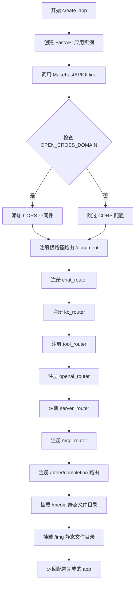

### `run_api` 流程图

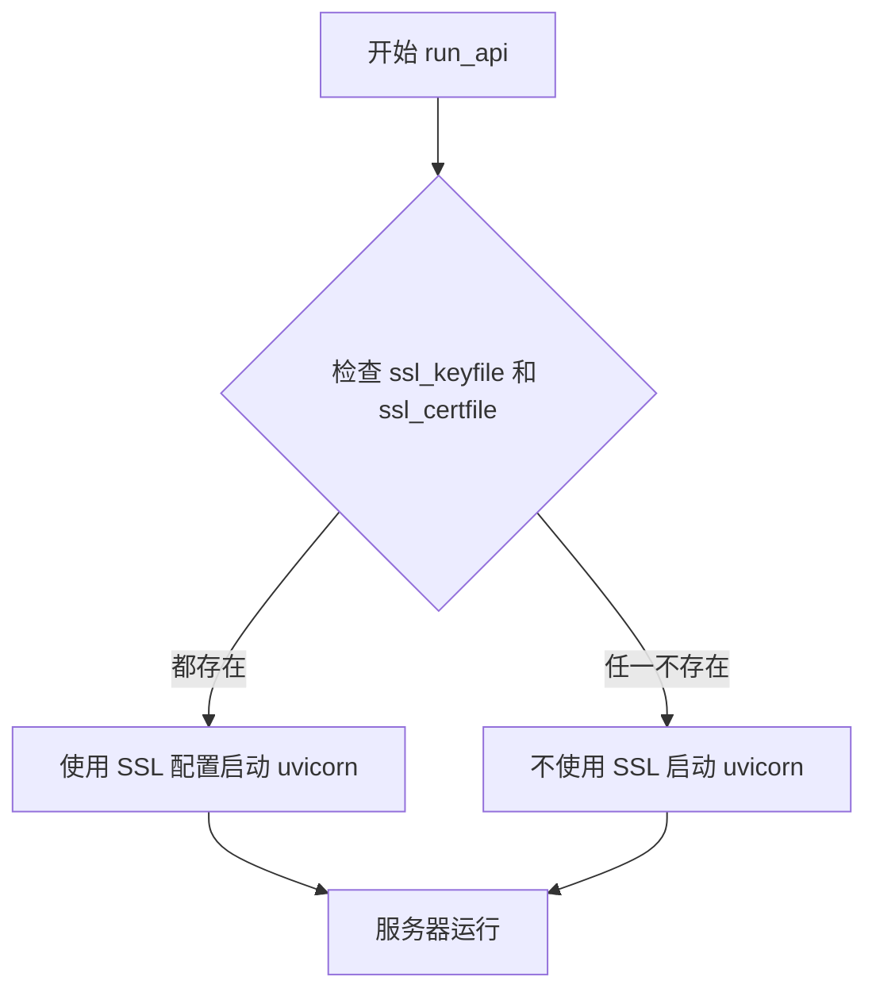

---

### `create_app` 带注释源码

```python
def create_app(run_mode: str = None):
    """
    创建并配置 FastAPI 应用实例
    
    参数:
        run_mode: str, 可选的运行模式参数
        
    返回:
        FastAPI: 配置完成的 FastAPI 应用实例
    """
    # 初始化 FastAPI 应用，设置标题和版本
    app = FastAPI(title="Langchain-Chatchat API Server", version=__version__)
    
    # 使 FastAPI 支持离线模式（不依赖外部 CDN）
    MakeFastAPIOffline(app)
    
    # Add CORS middleware to allow all origins
    # 在config.py中设置OPEN_DOMAIN=True，允许跨域
    # set OPEN_DOMAIN=True in config.py to allow cross-domain
    # 检查设置是否允许跨域
    if Settings.basic_settings.OPEN_CROSS_DOMAIN:
        # 添加 CORS 中间件，允许所有来源、凭证、方法和头
        app.add_middleware(
            CORSMiddleware,
            allow_origins=["*"],      # 允许所有来源
            allow_credentials=True,   # 允许携带凭证
            allow_methods=["*"],      # 允许所有 HTTP 方法
            allow_headers=["*"],      # 允许所有 HTTP 头
        )

    # 根路径 GET 请求处理器，重定向到 Swagger 文档
    @app.get("/", summary="swagger 文档", include_in_schema=False)
    async def document():
        """返回重定向响应到 /docs"""
        return RedirectResponse(url="/docs")

    # 注册聊天相关路由
    app.include_router(chat_router)
    # 注册知识库相关路由
    app.include_router(kb_router)
    # 注册工具相关路由
    app.include_router(tool_router)
    # 注册 OpenAI 兼容接口路由
    app.include_router(openai_router)
    # 注册服务器管理相关路由
    app.include_router(server_router)
    # 注册 MCP 协议相关路由
    app.include_router(mcp_router)

    # 其它接口 - LLM 模型补全功能
    # 通过 LLMChain 实现，要求 LLM 模型补全
    app.post(
        "/other/completion",
        tags=["Other"],
        summary="要求llm模型补全(通过LLMChain)",
    )(completion)

    # 媒体文件服务
    # 挂载 /media 路径，指向配置中的媒体文件目录
    app.mount("/media", StaticFiles(directory=Settings.basic_settings.MEDIA_PATH), name="media")

    # 项目相关图片
    # 获取图片目录路径并挂载到 /img 路径
    img_dir = str(Settings.basic_settings.IMG_DIR)
    app.mount("/img", StaticFiles(directory=img_dir), name="img")

    # 返回配置完成的 FastAPI 应用实例
    return app
```

### `run_api` 带注释源码

```python
def run_api(host, port, **kwargs):
    """
    使用 uvicorn 启动 API 服务器
    
    参数:
        host: str, 服务器监听地址
        port: int, 服务器监听端口
        **kwargs: 额外参数，可包含 ssl_keyfile 和 ssl_certfile
        
    返回:
        None
    """
    # 检查是否提供了 SSL 密钥文件和证书文件
    if kwargs.get("ssl_keyfile") and kwargs.get("ssl_certfile"):
        # 如果提供了 SSL 配置文件，使用 HTTPS 模式启动服务器
        uvicorn.run(
            app,
            host=host,
            port=port,
            ssl_keyfile=kwargs.get("ssl_keyfile"),    # SSL 私钥文件路径
            ssl_certfile=kwargs.get("ssl_certfile"),  # SSL 证书文件路径
        )
    else:
        # 如果未提供 SSL 配置，使用普通 HTTP 模式启动服务器
        uvicorn.run(app, host=host, port=port)
```

### `document` 方法带注释源码

```python
@app.get("/", summary="swagger 文档", include_in_schema=False)
async def document():
    """
    根路径 GET 请求处理器
    
    返回:
        RedirectResponse: 重定向到 /docs (Swagger UI 文档页面)
    """
    return RedirectResponse(url="/docs")
```

---

## 关键组件信息

| 组件名称 | 一句话描述 |
|----------|------------|
| `FastAPI` | Web 框架，提供 API 服务核心能力 |
| `chat_router` | 聊天功能路由模块，处理对话相关 API |
| `kb_router` | 知识库路由模块，处理向量知识库管理 |
| `tool_router` | 工具路由模块，处理外部工具调用 |
| `openai_router` | OpenAI 兼容接口路由，提供 OpenAI API 兼容性 |
| `server_router` | 服务器管理路由，提供服务器状态和管理接口 |
| `mcp_router` | MCP 协议路由，处理模型上下文协议 |
| `completion` | LLM 补全功能，通过 LLMChain 实现文本补全 |
| `StaticFiles` | 静态文件服务，用于提供媒体文件和图片 |
| `MakeFastAPIOffline` | 工具类，使 FastAPI 离线可用，不依赖外部 CDN |
| `Settings` | 配置管理类，提供应用配置访问 |

---

## 潜在的技术债务或优化空间

1. **CORS 配置过于宽松**：当前允许所有来源（`*`），存在安全风险，建议根据实际需求限制允许的域名

2. **缺少应用生命周期管理**：没有显式的启动和关闭事件处理（如 `on_event("startup")` 和 `on_event("shutdown")`），难以优雅地管理资源释放

3. **路由模块集中注册**：所有路由在 `create_app` 中集中注册，路由模块内部实现对主文件不可见，可读性较低

4. **错误处理缺失**：没有全局异常处理器（`app.add_exception_handler`），API 错误响应格式可能不统一

5. **SSL 配置仅支持文件路径**：SSL 配置只能通过文件路径指定，不支持内存证书或动态配置

6. **静态文件目录硬编码**：媒体文件和图片目录依赖 `Settings` 配置，建议增加存在性检查

7. **缺少请求日志中间件**：未配置请求日志记录，不利于问题排查和监控

---

## 其它项目

### 设计目标与约束

- **设计目标**：提供本地知识库问答系统的统一 API 服务入口，支持多种客户端接入
- **技术栈**：FastAPI + uvicorn + Starlette
- **约束**：需要依赖 `chatchat` 包的其他模块（settings、server、chat 等）

### 错误处理与异常设计

- 当前代码未实现全局异常处理器
- 建议添加统一的异常处理，规范化错误响应格式（如 `{code, message, data}` 结构）
- 对于静态文件目录不存在的情况，运行时可能抛出异常

### 数据流与状态机

- **数据流**：
  1. 客户端请求 → uvicorn ASGI 服务器
  2. FastAPI 路由分发 → 各子路由模块
  3. 业务逻辑处理 → 返回响应
- **状态**：应用为无状态设计，会话状态由客户端或外部存储管理

### 外部依赖与接口契约

| 依赖模块 | 用途 |
|----------|------|
| `chatchat.settings.Settings` | 应用配置管理 |
| `chatchat.server.api_server.*_routes` | 各功能模块路由 |
| `chatchat.server.chat.completion` | LLM 补全功能 |
| `chatchat.server.utils.MakeFastAPIOffline` | 离线模式支持 |
| `uvicorn` | ASGI 服务器 |
| `fastapi` | Web 框架 |

### 启动参数说明

| 参数 | 类型 | 默认值 | 描述 |
|------|------|--------|------|
| `--host` | `str` | `"0.0.0.0"` | 服务器监听地址 |
| `--port` | `int` | `7861` | 服务器监听端口 |
| `--ssl_keyfile` | `str` | `None` | SSL 私钥文件路径（可选） |
| `--ssl_certfile` | `str` | `None` | SSL 证书文件路径（可选） |


### `MakeFastAPIOffline`

该函数用于将 FastAPI 应用设置为离线模式，主要目的是使 OpenAPI 文档等在线资源在离线环境下可用，可能通过将相关静态文件打包到应用中来实现。

参数：

-  `app`：`FastAPI`，FastAPI 应用实例，需要被设置为离线模式的应用程序

返回值：`None`（根据函数调用方式推断），该函数直接修改传入的 FastAPI 应用实例，不返回任何值

#### 流程图

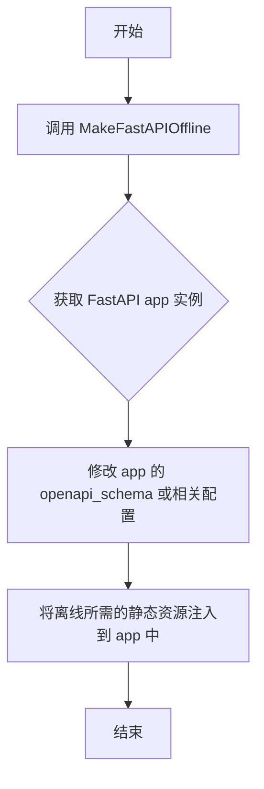

#### 带注释源码

```
# 从 chatchat.server.utils 模块导入 MakeFastAPIOffline 函数
from chatchat.server.utils import MakeFastAPIOffline

# 在 create_app 函数中调用 MakeFastAPIOffline
def create_app(run_mode: str = None):
    # 创建 FastAPI 应用实例
    app = FastAPI(title="Langchain-Chatchat API Server", version=__version__)
    
    # 调用 MakeFastAPIOffline 将应用设置为离线模式
    # 这通常会将 OpenAPI 文档等静态资源打包到应用内部
    # 使其在没有网络或无法访问外部资源的环境中正常运行
    MakeFastAPIOffline(app)
    
    # 后续的中间件配置和路由注册...
```

---

**注意**：提供的代码片段中只包含 `MakeFastAPIOffline` 函数的**导入**和**调用**，并未包含该函数的具体实现源码。该函数定义位于 `chatchat.server.utils` 模块中。如需获取完整的函数实现源码，建议查看 `chatchat/server/utils.py` 文件。


### `FastAPI.add_middleware`

该方法用于向 FastAPI 应用添加中间件，允许在请求处理流程中插入预处理和后处理逻辑。中间件是一种拦截器模式，可以对每个传入的请求和传出的响应进行统一处理。

#### 参数

- `middleware_class`：`type`，中间件类（如 `CORSMiddleware`、`HTTPSRedirectMiddleware` 等）
- `**kwargs`：传递给中间件构造函数的额外参数

#### 返回值

`None`，无返回值

#### 流程图

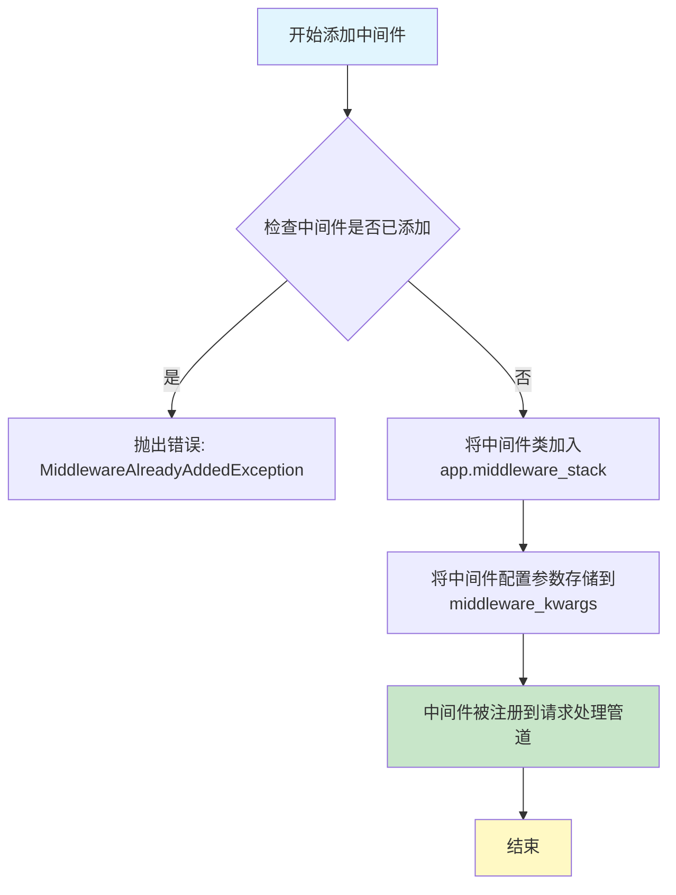

#### 带注释源码

```python
# 在 create_app 函数中调用 add_middleware 的示例
def create_app(run_mode: str = None):
    """
    创建 FastAPI 应用实例
    """
    app = FastAPI(title="Langchain-Chatchat API Server", version=__version__)
    MakeFastAPIOffline(app)
    
    # Add CORS middleware to allow all origins
    # 在config.py中设置OPEN_DOMAIN=True，允许跨域
    # set OPEN_DOMAIN=True in config.py to allow cross-domain
    if Settings.basic_settings.OPEN_CROSS_DOMAIN:
        # 调用 FastAPI.add_middleware 方法添加 CORS 中间件
        app.add_middleware(
            CORSMiddleware,                    # middleware_class: 中间件类
            allow_origins=["*"],               # 允许所有来源
            allow_credentials=True,           # 允许携带凭证
            allow_methods=["*"],               # 允许所有 HTTP 方法
            allow_headers=["*"],               # 允许所有请求头
        )
```

#### 补充说明

| 项目 | 说明 |
|------|------|
| **设计目标** | 通过中间件模式实现请求/响应的统一处理逻辑（如 CORS、认证、日志等） |
| **约束** | 同一中间件类只能添加一次，重复添加会抛出 `MiddlewareAlreadyAddedException` |
| **错误处理** | 如果中间件类不存在或参数错误，会抛出相应的异常 |
| **执行顺序** | 最后添加的中间件最接近请求处理函数（洋葱模型，外层先执行） |
| **外部依赖** | 依赖 Starlette 框架的中间件系统 |
| **典型应用场景** | - CORS 跨域请求处理<br>- 用户认证/授权<br>- 请求日志记录<br>- 性能监控<br>- HTTPS 重定向 |


### `FastAPI.include_router`

该方法用于将路由器（Router）注册到 FastAPI 应用中，以便将一组相关的 API 路由统一管理并挂载到应用上。在 `create_app` 函数中，通过调用六次 `include_router` 方法分别挂载了聊天路由、知识库路由、工具路由、OpenAI 兼容路由、服务器路由和 MCP 路由，使这些模块的 API 端点能够被主应用识别并提供服务。

参数：

- `router`：`Router` 类型，需要被注册的路由器对象，如 `chat_router`、`kb_router` 等
- `prefix`：`str` 类型（可选），路由前缀，默认为空字符串
- `tags`：`list[str | None] | None` 类型（可选），用于 API 文档的标签分组
- `dependencies`：`list[Depends] | None` 类型（可选），依赖注入列表
- `responses`：`dict[int | str, dict[str, Any]] | None` 类型（可选），自定义响应模型
- `callbacks`：`list[APIRoute] | None` 类型（可选），回调函数列表
- `deprecated`：`bool | None` 类型（可选），标记路由是否已弃用
- `include_in_schema`：`bool` 类型（可选），是否在 OpenAPI 模式中包含，默认为 `True`

返回值：`None`，该方法直接在 FastAPI 实例上注册路由，不返回任何值。

#### 流程图

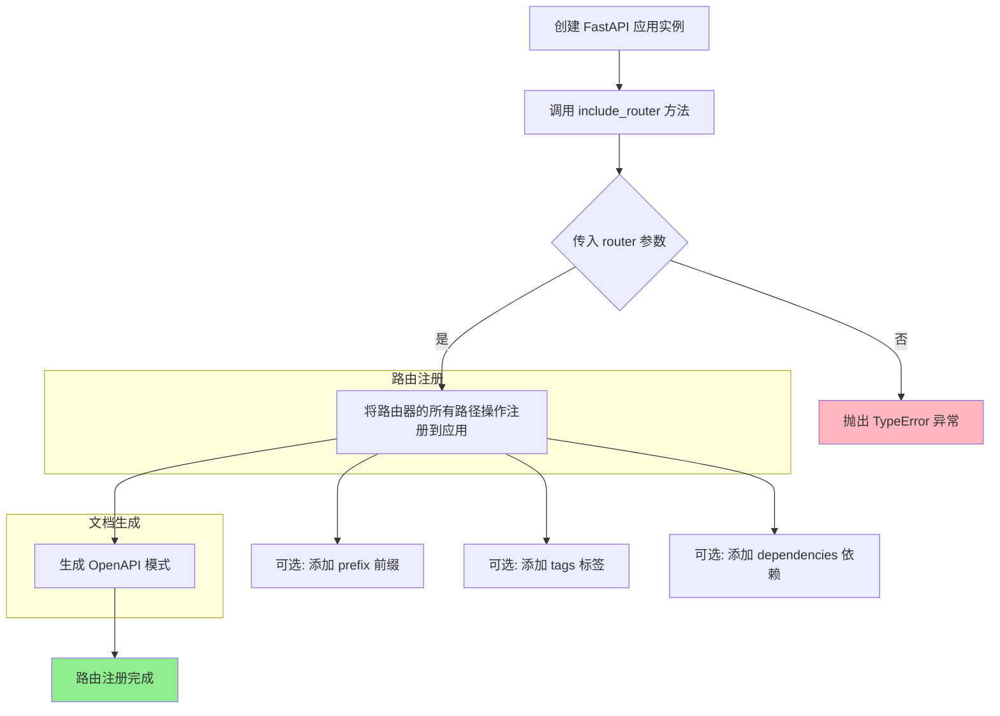

#### 带注释源码

```python
def create_app(run_mode: str = None):
    """
    创建并配置 FastAPI 应用实例
    
    参数:
        run_mode: 运行模式，可选参数
    返回:
        配置好的 FastAPI 应用实例
    """
    # 初始化 FastAPI 应用，设置标题和版本
    app = FastAPI(title="Langchain-Chatchat API Server", version=__version__)
    
    # 使 FastAPI 可以在离线环境下运行（自定义工具类）
    MakeFastAPIOffline(app)
    
    # 根据配置添加 CORS 中间件，允许跨域请求
    if Settings.basic_settings.OPEN_CROSS_DOMAIN:
        app.add_middleware(
            CORSMiddleware,
            allow_origins=["*"],
            allow_credentials=True,
            allow_methods=["*"],
            allow_headers=["*"],
        )

    # 定义根路径重定向到 /docs (Swagger 文档)
    @app.get("/", summary="swagger 文档", include_in_schema=False)
    async def document():
        return RedirectResponse(url="/docs")

    # ========================================================================
    # include_router 方法调用 - 将各个模块的路由器注册到应用中
    # ========================================================================
    
    # 注册聊天相关路由（处理对话请求）
    app.include_router(chat_router)
    
    # 注册知识库相关路由（处理向量存储和检索）
    app.include_router(kb_router)
    
    # 注册工具相关路由（处理工具调用）
    app.include_router(tool_router)
    
    # 注册 OpenAI 兼容接口路由
    app.include_router(openai_router)
    
    # 注册服务器自身管理相关路由
    app.include_router(server_router)
    
    # 注册 MCP (Model Context Protocol) 相关路由
    app.include_router(mcp_router)

    # ========================================================================
    # 手动挂载其他端点（非路由器方式）
    # ========================================================================
    
    # 注册 completion 端点（LLM 补全功能）
    # 使用函数式编程方式直接将 completion 函数注册为路径操作
    app.post(
        "/other/completion",
        tags=["Other"],
        summary="要求llm模型补全(通过LLMChain)",
    )(completion)

    # 挂载静态文件目录 - 媒体文件
    app.mount("/media", StaticFiles(directory=Settings.basic_settings.MEDIA_PATH), name="media")

    # 挂载静态文件目录 - 项目图片
    img_dir = str(Settings.basic_settings.IMG_DIR)
    app.mount("/img", StaticFiles(directory=img_dir), name="img")

    return app
```

#### 关键组件信息

| 组件名称 | 一句话描述 |
|---------|-----------|
| `chat_router` | 处理聊天对话相关 API 端点的路由器 |
| `kb_router` | 处理知识库创建、查询和管理相关 API 端点的路由器 |
| `tool_router` | 处理工具注册、调用和管理相关 API 端点的路由器 |
| `openai_router` | 提供 OpenAI 兼容 API 接口的路由器 |
| `server_router` | 处理服务器自身配置、状态查询等管理端点的路由器 |
| `mcp_router` | 处理 MCP (Model Context Protocol) 协议相关端点的路由器 |

#### 潜在技术债务与优化空间

1. **路由前缀统一管理缺失**：当前所有路由使用默认前缀，建议对不同模块的路由使用 `prefix` 参数进行分组，如 `app.include_router(chat_router, prefix="/chat")`，便于 API 管理和版本控制。

2. **重复的中间件配置**：CORS 中间件配置硬编码在代码中，建议提取到配置文件或 Settings 类中管理。

3. **静态文件目录硬编码**：`/media` 和 `/img` 目录直接通过 `app.mount` 挂载，未做目录存在性检查，可能导致应用启动失败。

4. **缺乏错误处理**：当前代码未对路由注册过程中可能出现的异常进行处理，建议添加 try-except 块增强鲁棒性。

5. **路由标签规范化**：虽然部分路由使用了 `tags` 参数，但六次 `include_router` 调用均未显式指定标签，可能导致 API 文档中分类不清晰。


### `FastAPI.mount`

`FastAPI.mount` 是 FastAPI（继承自 Starlette）提供的用于挂载 ASGI 应用程序（如静态文件服务器）作为子应用程序的方法。在代码中用于挂载静态文件目录以提供媒体文件和图片的访问服务。

参数：

- `path`：`str`，挂载路径，例如 `"/media"` 或 `"/img"`
- `app`：`ASGIApp`，要挂载的 ASGI 应用程序，如 `StaticFiles(directory=...)`
- `name`：`str`（可选），挂载名称，用于反向路由查找

返回值：`None`，该方法无返回值，直接在 FastAPI 应用实例上注册路由

#### 流程图

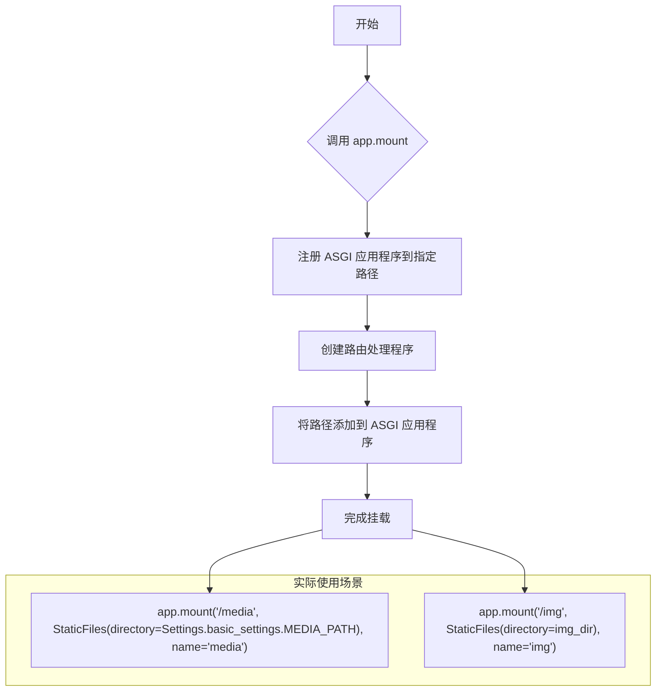

#### 带注释源码

```python
# 媒体文件挂载
# 将 /media 路径映射到 Settings.basic_settings.MEDIA_PATH 目录
# 使用 StaticFiles 中间件提供静态文件服务
app.mount("/media", StaticFiles(directory=Settings.basic_settings.MEDIA_PATH), name="media")

# 项目相关图片挂载
# 将 /img 路径映射到 Settings.basic_settings.IMG_DIR 目录
# name='img' 用于在应用中反向查找此路由
img_dir = str(Settings.basic_settings.IMG_DIR)
app.mount("/img", StaticFiles(directory=img_dir), name="img")
```

#### 关键组件信息

| 组件名称 | 一句话描述 |
|---------|-----------|
| `FastAPI` | 基于 Starlette 的 Web 框架，提供挂载 ASGI 应用的能力 |
| `StaticFiles` | Starlette 提供的静态文件服务 ASGI 应用程序 |
| `Settings.basic_settings.MEDIA_PATH` | 配置的媒体文件存储目录 |
| `Settings.basic_settings.IMG_DIR` | 配置的项目图片存储目录 |

#### 潜在技术债务或优化空间

1. **路径硬编码问题**：媒体路径和图片路径直接调用，建议提取为配置常量
2. **缺少错误处理**：StaticFiles 目录不存在时可能抛出异常，应添加目录存在性检查
3. **未指定静态文件缓存策略**：生产环境可考虑添加缓存头以提升性能
4. **挂载名称未充分利用**：虽然指定了 `name` 参数，但代码中未使用反向路由功能


### `FastAPI.get` (app.get)

这是 FastAPI 框架的 GET 路由装饰器，用于定义处理 HTTP GET 请求的端点。在代码中，它被用于根路径 "/" ，当用户访问根 URL 时，将请求重定向到 Swagger 文档页面。

参数：

- `"/"`：`str`，路由路径，表示根路径
- `summary`：`str`，可选参数，API 端点的摘要说明，此处为 "swagger 文档"
- `include_in_schema`：`bool`，可选参数，是否在 OpenAPI 模式中包含此路由，此处为 `False`
- `tags`：`list`，可选参数，API 文档中的标签组

返回值：

- `RedirectResponse`：`starlette.responses.RedirectResponse`，返回 HTTP 302 重定向响应，将客户端重定向到 "/docs"（Swagger 文档页面）

#### 流程图

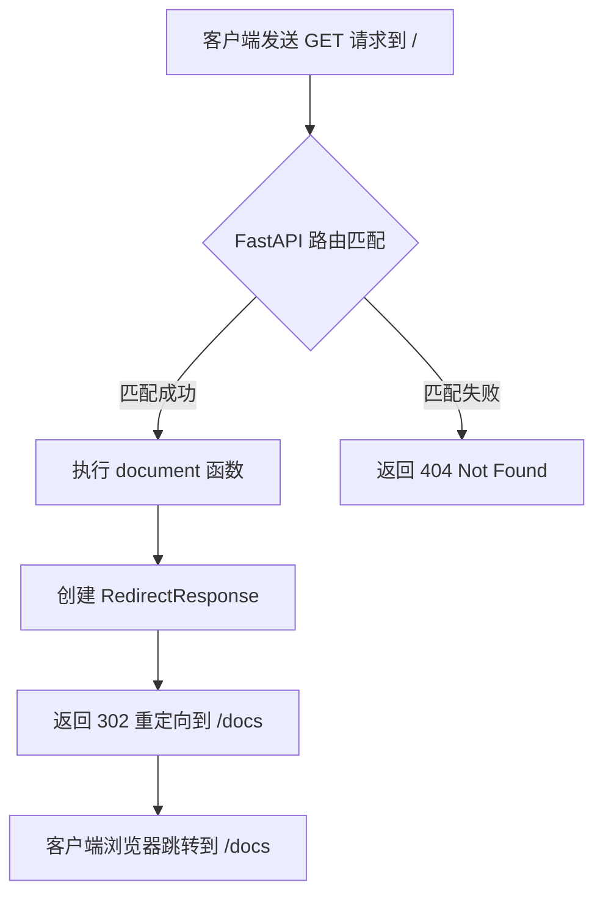

#### 带注释源码

```python
@app.get("/", summary="swagger 文档", include_in_schema=False)
async def document():
    """
    根路径路由处理函数
    
    当用户访问应用根路径 "/" 时，此函数被调用。
    函数返回一个重定向响应，将用户引导至 Swagger API 文档页面。
    
    Returns:
        RedirectResponse: 包含 302 状态码的重定向响应，目标 URL 为 /docs
    """
    return RedirectResponse(url="/docs")
```


### `app.post("/other/completion")`

该接口是 FastAPI 应用中的一个 POST 路由注册，通过 `app.post()` 装饰器将 `completion` 函数注册到 `/other/completion` 端点，用于接收客户端请求并调用 LLM 模型进行文本补全任务。

参数：

- 无直接参数（参数由被注册的 `completion` 函数定义）
- 隐含参数：`request`（请求体，由 FastAPI 自动解析）

返回值：

- 取决于 `completion` 函数的返回值类型
- 通常为 JSON 响应（`Response` 或 `JSONResponse`）

#### 流程图

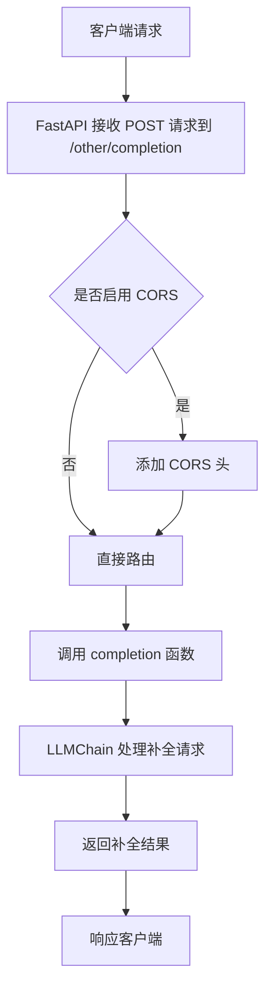

#### 带注释源码

```python
    # 使用 FastAPI 的 post 方法注册路由
    # 路由路径: /other/completion
    # 标签: Other（用于 API 文档分组）
    # 摘要: 要求llm模型补全(通过LLMChain)
    app.post(
        "/other/completion",
        tags=["Other"],
        summary="要求llm模型补全(通过LLMChain)",
    )(completion)  # 将 completion 函数绑定到此路由
```

---

### 补充说明

由于提供的代码片段中未包含 `completion` 函数的完整定义（该函数从 `chatchat.server.chat.completion` 模块导入），以下为基于代码结构的合理推断：

| 项目 | 信息 |
|------|------|
| **函数来源** | `chatchat.server.chat.completion` |
| **函数用途** | 通过 LLMChain 调用 LLM 模型进行文本补全 |
| **可能的参数** | `prompt` (str): 待补全的文本提示 |
| **可能的返回值** | `dict` 或 `str`: 补全结果 |

如需获取 `completion` 函数的完整详细设计文档，需要查看 `chatchat/server/chat/completion.py` 源文件。


## 关键组件


### FastAPI 应用创建 (create_app)

该函数是核心应用工厂函数，负责初始化FastAPI实例、配置中间件、注册所有路由并挂载静态文件目录。它设置了应用标题和版本，启用了CORS跨域支持（当OPEN_CROSS_DOMAIN配置为True时），并整合了聊天、知识库、工具、OpenAI、服务器和MCP等多种功能模块的路由。

### 路由注册模块

代码中导入了6个路由模块并通过app.include_router方法注册到FastAPI应用中：chat_router处理聊天相关请求、kb_router管理知识库操作、tool_router提供工具调用功能、openai_router实现OpenAI兼容接口、server_router提供服务器管理端点、mcp_router处理MCP协议通信。此外还有一个直接注册的completion函数用于处理LLM模型补全请求。

### CORS 中间件配置

根据Settings.basic_settings.OPEN_CROSS_DOMAIN的配置动态添加CORS中间件，允许所有来源、方法、凭证和请求头的跨域请求。该配置可通过环境变量控制，为前端应用提供跨域访问支持。

### 静态文件挂载

通过app.mount方法挂载了两个静态文件目录：/media路径映射到Settings.basic_settings.MEDIA_PATH用于提供媒体文件服务，/img路径映射到Settings.basic_settings.IMG_DIR用于提供项目相关图片资源。

### Uvicorn 服务器运行器 (run_api)

该函数封装了uvicorn.run方法，支持通过传入的host和port参数启动ASGI服务器。提供了可选的SSL/TLS支持，当ssl_keyfile和ssl_certfile参数都存在时启用HTTPS模式，否则使用普通HTTP模式。

### 命令行参数解析

使用argparse模块定义并解析4个命令行参数：--host指定监听地址（默认0.0.0.0）、--port指定监听端口（默认7861）、--ssl_keyfile指定SSL私钥文件路径、--ssl_certfile指定SSL证书文件路径。解析后的参数被传递给run_api函数用于启动服务器。

### MakeFastAPIOffline 工具

通过MakeFastAPIOffline(app)调用为FastAPI应用添加离线支持功能，可能包括修改OpenAPI文档生成逻辑以适应离线或本地部署场景。


## 问题及建议


### 已知问题

-   **全局应用实例导致测试困难**：代码在模块顶层直接执行了 `app = create_app()`。这意味着当 Python 解释器加载该模块时，应用及其依赖（如 Settings）必须立即可用，这不仅会导致导入变慢，也使得在单元测试中通过 `app.dependency_overrides` 替换依赖变得困难，违反了“应用工厂模式”的最佳实践。
-   **未使用的参数**：`create_app` 函数定义了 `run_mode` 参数，但在实际逻辑中完全未使用，造成代码冗余。
-   **安全配置风险**：当 `OPEN_CROSS_DOMAIN` 开启时，CORS 中间件被配置为 `allow_origins=["*"]`，允许所有来源、方法和头部，这在生产环境中存在潜在的跨站请求伪造（CSRF）风险。
-   **启动阶段缺少预检**：代码直接使用 `Settings` 中的路径挂载静态文件（`/media`, `/img`），但未在应用启动前（Startup Event）检查这些目录是否存在。如果目录缺失，Uvicorn 可能在运行时崩溃或返回 500 错误，而非在启动时给出清晰的提示。
-   **SSL 配置缺少校验**：虽然支持 SSL 加密传输，但直接将近乎裸的 `ssl_keyfile` 和 `ssl_certfile` 参数传递给 `uvicorn.run`。如果文件路径错误或文件不存在，Uvicorn 启动时才会抛出异常，缺乏提前的用户友好提示。
-   **缺少全局异常处理**：当前代码未注册全局异常处理器（Exception Handlers）。这意味着路由中未捕获的异常（如代码 bug）会返回默认的 HTML 错误页面或 JSON 格式不统一的堆栈信息，不利于 API 规范化和前端交互。

### 优化建议

-   **采用应用工厂模式进行重构**：将 `app = create_app()` 的调用移至 `if __name__ == "__main__"` 代码块内部，或者保留在顶层但确保 `Settings` 等配置类已完全初始化。这能保证应用在测试环境中的可复现性。
-   **移除冗余参数**：删除 `create_app` 函数中未使用的 `run_mode` 参数，保持接口简洁。
-   **增强 CORS 安全性**：将 CORS 配置改为从 `Settings` 中读取具体的允许来源列表（Allowed Origins），而非简单的通配符 `["*"]`，或者至少在生产模式下进行限制。
-   **添加 Startup 事件检查**：利用 FastAPI 的 `@app.on_event("startup")` 钩子，在应用启动时检查 `MEDIA_PATH` 和 `IMG_DIR` 是否存在，如果不存在则创建目录或抛出明确的初始化错误。
-   **优化 SSL 启动逻辑**：在 `run_api` 函数中，在调用 `uvicorn.run` 之前，使用 `os.path.exists()` 检查 SSL 证书和密钥文件是否存在，提供更友好的错误信息。
-   **统一错误响应格式**：注册全局异常处理器（例如处理 `HTTPException` 和通用 `Exception`），将所有错误响应统一封装为 `{code: int, msg: str, data: Any}` 的格式，并记录详细日志。


## 其它


### 设计目标与约束

本项目旨在构建一个基于本地知识库的ChatGLM问答系统的API服务器，提供聊天、知识库管理、工具调用、OpenAI兼容接口等功能。设计约束包括：支持本地部署、兼容OpenAI API规范、支持CORS跨域访问、提供静态文件服务。

### 错误处理与异常设计

FastAPI已内置异常处理机制，自定义异常可通过@app.exception_handler装饰器统一处理。运行时关键异常包括：配置读取失败、静态目录不存在、SSL证书文件路径错误等。错误响应遵循OpenAI API格式，返回detail字段描述错误信息。

### 数据流与状态机

客户端请求 → FastAPI路由 → 中间件处理(CORS) → 路由处理器 → 业务逻辑 → 响应返回。应用状态主要由Settings单例管理配置，app对象在模块加载时创建，服务进程生命周期内保持运行。

### 外部依赖与接口契约

核心依赖包括：fastapi(Web框架)、uvicorn(ASGI服务器)、starlette(底层框架)、langchain(LLM集成)。外部接口契约：/docs和/redoc提供Swagger/OpenAPI文档，/media和/img提供静态文件访问，各路由模块暴露RESTful API端点。

### 配置文件与参数设计

命令行参数：--host(默认0.0.0.0)、--port(默认7861)、--ssl_keyfile、--ssl_certfile。配置来源：Settings类从chatchat.settings模块读取，涵盖basic_settings.OPEN_CROSS_DOMAIN、MEDIA_PATH、IMG_DIR等配置项。

### 安全性考虑

CORS中间件配置允许跨域访问(需设置OPEN_CROSS_DOMAIN=True)。SSL/TLS支持通过可选的keyfile和certfile参数启用。静态文件服务需确保目录路径安全性，避免路径遍历攻击。

### 性能考量

使用uvicorn异步运行支持高并发。静态文件通过StaticFiles挂载到/media和/img路径。建议生产环境配置反向代理(Nginx)和负载均衡。

### 部署与运维

支持直接运行(python server.py)和命令行参数指定监听地址端口。提供SSL加密支持用于HTTPS部署。建议使用systemd或Docker容器化管理进程。

### 监控与日志

uvicorn默认输出访问日志和错误日志。可通过配置logging模块自定义日志格式和输出目标。建议集成Prometheus指标采集和ELK日志收集系统。

### 目录结构建议

项目采用模块化结构：chatchat.server.api_server(路由)、chatchat.server.chat(对话逻辑)、chatchat.settings(配置)、静态资源目录(media、img)。

### 版本兼容性

依赖Python 3.8+、FastAPI 0.100+、Pydantic 2.0+。需确保chatchat包版本与__version__一致。


    