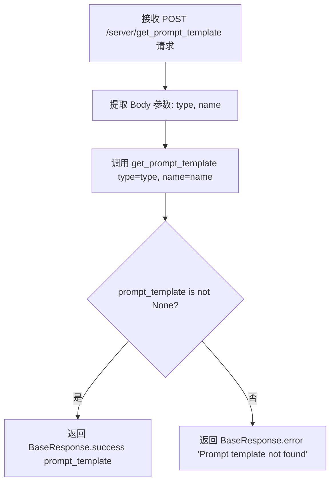

# `Langchain-Chatchat\libs\chatchat-server\chatchat\server\api_server\server_routes.py` 详细设计文档

该文件是一个FastAPI路由模块，定义了服务器相关的RESTful API端点，包括获取服务器原始配置信息和根据类型、名称查询prompt模板的功能，支持动态从Settings中获取可选的模板类型。

## 整体流程

```mermaid
graph TD
    A[客户端请求] --> B{请求路径}
    B --> C[/server/configs]
    B --> D[/server/get_prompt_template]
    C --> E[调用get_server_configs函数]
    E --> F[返回服务器原始配置]
    D --> G[获取type和name参数]
    G --> H[调用get_prompt_template查询模板]
    H --> I{模板是否存在?}
    I -- 是 --> J[BaseResponse.success返回模板]
    I -- 否 --> K[BaseResponse.error返回错误]
```

## 类结构

```
模块级别
├── server_router (APIRouter实例)
├── available_template_types (全局变量)
├── get_server_configs (挂载的端点)
└── get_server_prompt_template (视图函数)
```

## 全局变量及字段


### `server_router`
    
FastAPI路由实例，用于处理服务器状态相关的API端点，前缀为/server，标签为Server State

类型：`APIRouter`
    


### `available_template_types`
    
从Settings中获取的可用的提示模板类型列表，用于API文档和参数验证

类型：`list`
    


    

## 全局函数及方法


### `get_server_prompt_template`

该函数是一个 FastAPI 端点，用于根据指定的模板类型和名称获取服务器配置的 prompt 模板。客户端通过 POST 请求传递 `type` 和 `name` 参数，函数内部调用 `get_prompt_template` 获取模板，若模板存在则返回成功响应，否则返回错误提示。

参数：

-  `type`：`str`，模板类型，对应 Settings 中的 prompt_settings 字段键，可选值见 `available_template_types`，默认为 "llm_model"
-  `name`：`str`，模板名称，用于定位具体模板，默认为 "default"

返回值：`BaseResponse`，成功时返回包含 prompt_template 数据的成功响应，失败时返回错误信息

#### 流程图



#### 带注释源码

```python
@server_router.post("/get_prompt_template", summary="获取服务区配置的 prompt 模板", response_model=BaseResponse)
def get_server_prompt_template(
        type: str = Body(
            "llm_model", description="模板类型，可选值：{available_template_types}"
        ),
        name: str = Body("default", description="模板名称"),
):
    # 调用工具函数 get_prompt_template 根据类型和名称获取模板
    prompt_template = get_prompt_template(type=type, name=name)
    
    # 检查模板是否获取成功
    if prompt_template is None:
        # 模板不存在，返回错误响应
        return BaseResponse.error("Prompt template not found")
    
    # 模板存在，返回成功响应并附带模板数据
    return BaseResponse.success(prompt_template)
```

## 关键组件


### server_router (APIRouter)

FastAPI路由容器，负责管理服务器相关的API端点，提供/server_configs和/server/get_prompt_template两个接口。

### available_template_types (全局变量)

从Settings中提取的所有可用提示模板类型列表，用于验证和文档化模板类型选项。

### /server/configs 端点

获取服务器原始配置信息的API端点，委托给get_server_configs函数处理。

### get_server_prompt_template 函数

处理获取提示模板请求的函数，接收type和name参数，从模板库中检索对应的模板并返回。

### BaseResponse

统一的响应模型封装类，提供success和error静态方法用于构造标准化的API响应。


## 问题及建议


### 已知问题

- **类型验证缺失**：`type` 参数未验证是否在 `available_template_types` 有效值范围内，可能导致运行时错误
- **硬编码默认值**：`type` 的默认值 "llm_model" 硬编码在函数签名中，与 `available_template_types` 列表可能不同步
- **Body 参数语法冗余**：`Body()` 在作为唯一参数且无特殊配置时可省略，但不影响功能
- **错误处理不一致**：`get_server_configs` 接口调用时未进行异常捕获，与 `get_server_prompt_template` 的错误处理模式不统一
- **文档描述错误**：`/get_prompt_template` 接口的 summary 写为"服务区配置"，应为"服务器配置"
- **全局变量计算时机**：`available_template_types` 在模块导入时计算，若 `Settings` 未完全初始化可能导致问题

### 优化建议

- **添加参数校验**：使用 Pydantic 枚举或 validator 验证 `type` 参数是否在有效模板类型列表中
- **统一错误处理**：为 `get_server_configs` 调用添加 try-except 保护
- **修复文档描述**：修正 summary 中的错别字
- **类型提示完善**：为 `get_server_prompt_template` 函数添加返回类型注解
- **配置常量提取**：将默认值提取为常量或从 Settings 动态获取，避免同步问题
- **考虑 Pydantic 模型**：将请求体封装为 Pydantic 模型，提高可维护性和类型安全

## 其它


### 设计目标与约束

本模块的设计目标是提供服务器配置和Prompt模板的查询接口，支持动态获取服务器原始配置信息以及根据类型和名称获取对应的Prompt模板。约束条件包括：模板类型必须从Settings.prompt_settings.model_fields中获取有效值，模板名称默认为"default"，未找到模板时返回错误响应。

### 错误处理与异常设计

本模块采用统一的BaseResponse进行错误响应封装。当get_prompt_template返回None时，触发"Prompt template not found"错误并通过BaseResponse.error()返回。对于get_server_configs接口，直接透传底层函数返回结果。异常类型主要包括：模板未找到异常（返回404类错误响应）、配置获取异常（由底层函数处理）。所有接口均通过response_model=BaseResponse进行响应格式统一。

### 数据流与状态机

数据流1（/server/configs）：客户端POST请求 → server_router → get_server_configs函数 → 返回配置数据 → BaseResponse包装 → 客户端。数据流2（/server/get_prompt_template）：客户端POST请求（含type和name参数） → server_router → get_server_prompt_template函数 → 调用get_prompt_template查询 → 判断结果是否为None → BaseResponse.success/error包装 → 客户端。状态机：初始状态→请求处理中→成功状态/失败状态→响应返回。

### 外部依赖与接口契约

外部依赖包括：chatchat.server.types.server.response.base.BaseResponse（统一响应封装）、chatchat.settings.Settings（配置管理）、chatchat.server.utils.get_prompt_template（模板查询工具）、chatchat.server.utils.get_server_configs（配置查询工具）。接口契约：/server/configs接口直接挂载get_server_configs作为依赖，返回原始配置；/server/get_prompt_template接口接受type（字符串，默认为"llm_model"）和name（字符串，默认为"default"）两个Body参数，返回BaseResponse<Any>类型。

### 日志设计

建议在关键路径添加日志记录：1）get_server_configs调用时记录请求进入；2）get_prompt_template查询时记录查询参数（type、name）；3）模板未找到时记录警告日志；4）成功返回时记录模板名称。建议使用Python标准logging模块，按INFO/WARNING/ERROR级别区分。

### 安全考虑

当前实现存在潜在安全风险：type参数未做严格校验，仅依赖available_template_types列表限制；建议增加输入验证确保type值在允许列表内。Body参数虽非直接用户输入，但作为API参数应考虑注入防护。配置获取接口可能暴露敏感服务器信息，建议根据实际场景添加认证授权检查。

### 性能优化

可优化点：1）available_template_types在模块加载时计算一次，避免重复调用Settings.prompt_settings.model_fields.keys()；2）get_prompt_template结果可考虑缓存机制，减少重复查询；3）对于高并发场景，可考虑添加请求限流。当前实现无明显性能瓶颈，属于轻量级查询接口。

### 配置项说明

available_template_types：从Settings.prompt_settings.model_fields动态获取的模板类型列表，用于API文档参数描述和运行时校验。该列表在模块导入时生成一次，后续直接使用缓存值。

### 测试策略建议

单元测试：测试available_template_types正确获取；测试get_server_prompt_template各种场景（找到模板、未找到模板）；测试BaseResponse正确封装。集成测试：测试/server/configs端点返回正确配置；测试/server/get_prompt_template端点参数验证和响应格式。


    