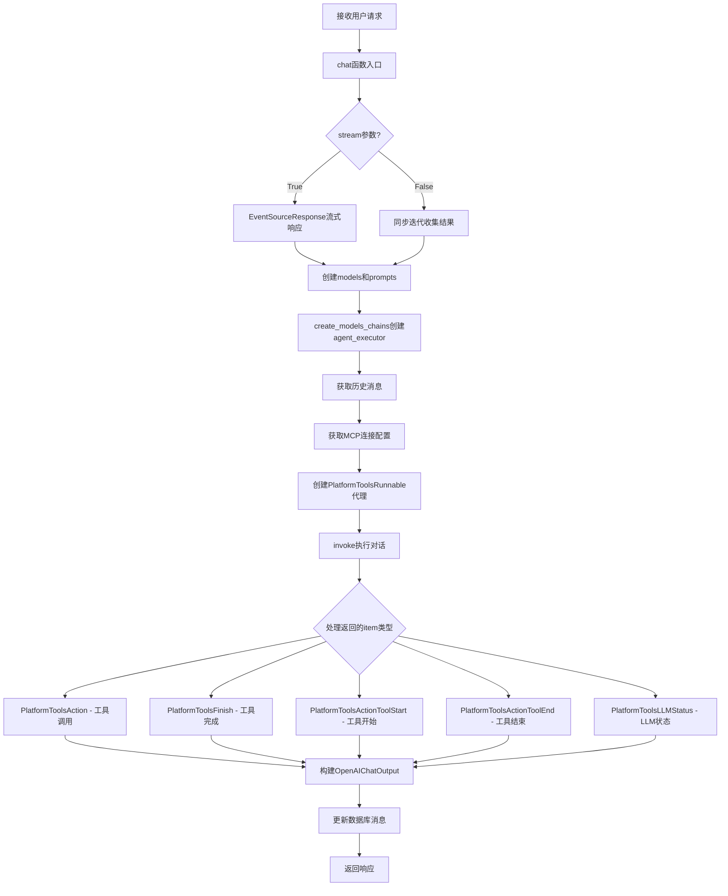
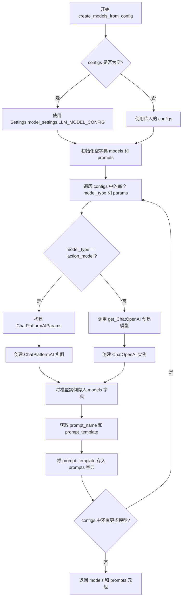
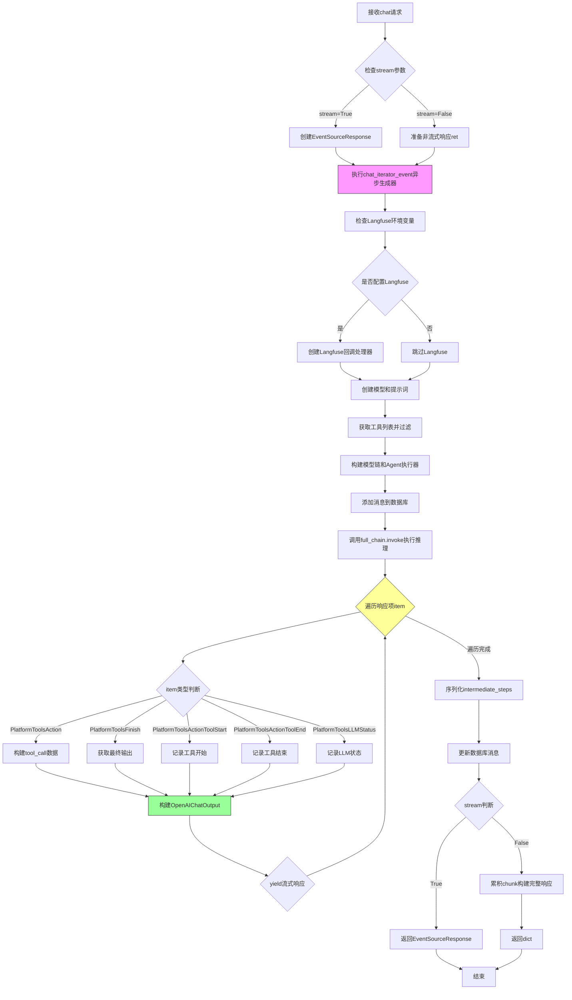

# `Langchain-Chatchat\libs\chatchat-server\chatchat\server\chat\chat.py` 详细设计文档

这是一个FastAPI聊天API服务模块，提供了基于LLM的对话功能，支持工具调用、MCP（Model Context Protocol）连接、流式输出和历史消息管理，通过PlatformToolsRunnable实现平台知识模式代理执行。

## 整体流程



## 类结构

```
模块级函数
├── create_models_from_config (创建模型实例)
├── create_models_chains (创建对话链和代理)
└── chat (主聊天入口，async)
```

## 全局变量及字段


### `logger`
    
用于记录程序运行日志的日志记录器对象

类型：`logging.Logger`
    


### `configs`
    
LLM模型配置字典，包含不同模型类型的参数配置

类型：`dict`
    


### `models`
    
模型实例字典，key为模型类型，value为模型实例对象

类型：`dict`
    


### `prompts`
    
提示模板字典，key为模型类型，value为ChatPromptTemplate对象

类型：`dict`
    


### `tools`
    
可用工具列表，包含所有已配置的LangChain工具

类型：`list[BaseTool]`
    


### `callbacks`
    
回调处理器列表，用于处理模型调用过程中的事件

类型：`list[BaseCallbackHandler]`
    


### `history`
    
对话历史列表，包含用户和助手的对话记录

类型：`list[dict]`
    


### `messages`
    
从数据库获取的消息记录列表，按时间倒序排列

类型：`list[dict]`
    


### `intermediate_steps`
    
agent执行过程中的中间步骤数据

类型：`list`
    


### `mcp_connections`
    
MCP连接配置字典，包含各MCP服务器的连接信息

类型：`dict`
    


### `agent_executor`
    
平台工具代理执行器，负责协调agent的工具调用和流程

类型：`PlatformToolsRunnable`
    


### `full_chain`
    
完整的对话链，包含输入处理和agent执行

类型：`Runnable`
    


### `chat_iterator`
    
聊天结果异步迭代器，用于流式输出agent响应

类型：`AsyncIterator`
    


### `message_id`
    
数据库消息ID，用于关联和更新消息记录

类型：`str`
    


### `last_tool`
    
最后工具调用信息字典，包含工具名称、参数和输出

类型：`dict`
    


    

## 全局函数及方法


### `create_models_from_config`

该函数根据配置字典创建对应的LLM模型实例和提示模板，支持不同类型的模型（如 action_model 使用 ChatPlatformAI，其他使用 ChatOpenAI），同时处理回调函数、流式输出和最大token数配置。

参数：

- `configs`：`Optional[dict]`，模型配置字典，包含不同模型类型的参数（如 model_name、temperature、max_tokens、prompt_name 等），如果为 None 则使用 Settings.model_settings.LLM_MODEL_CONFIG
- `callbacks`：`Optional[List[BaseCallbackHandler]]`，回调处理器列表，用于 langchain 的回调机制
- `stream`：`bool`，是否启用流式输出
- `max_tokens`：`Optional[int]`，LLM 最大 token 数限制，如果为 None 则使用配置中的默认值

返回值：`Tuple[dict, dict]`，返回一个元组，第一个元素是模型实例字典（键为模型类型），第二个元素是提示模板字典（键为模型类型）

#### 流程图



#### 带注释源码

```python
def create_models_from_config(configs, callbacks, stream, max_tokens):
    """
    根据配置创建LLM模型实例和提示模板
    
    Args:
        configs: 模型配置字典，键为模型类型，值为参数字典
        callbacks: 回调处理器列表，用于langchain的回调机制
        stream: 是否启用流式输出
        max_tokens: 最大token数限制，None时使用配置默认值
    
    Returns:
        Tuple[dict, dict]: (models, prompts) 模型实例字典和提示模板字典
    """
    # 如果configs为空或None，使用默认配置
    configs = configs or Settings.model_settings.LLM_MODEL_CONFIG
    
    # 初始化模型和提示词字典
    models = {}
    prompts = {}
    
    # 遍历配置中的每个模型类型
    for model_type, params in configs.items():
        # 获取模型名称，默认使用系统默认LLM
        model_name = params.get("model", "").strip() or get_default_llm()
        
        # 判断是否启用回调：根据params中的callbacks配置或全局callbacks参数
        callbacks = callbacks if params.get("callbacks", False) else None
        
        # 确定max_tokens值：优先使用传入值，否则使用配置中的值，默认1000
        max_tokens_value = max_tokens if max_tokens is not None else params.get("max_tokens", 1000)
        
        # 根据模型类型创建不同的模型实例
        if model_type == "action_model":
            # action_model 使用 ChatPlatformAI 平台AI模型
            llm_params = get_ChatPlatformAIParams(
                model_name=model_name,
                temperature=params.get("temperature", 0.5),
                max_tokens=max_tokens_value,
            )
            model_instance = ChatPlatformAI(**llm_params)
        else:
            # 其他模型类型使用 ChatOpenAI
            model_instance = get_ChatOpenAI(
                model_name=model_name,
                temperature=params.get("temperature", 0.5),
                max_tokens=max_tokens_value,
                callbacks=callbacks,
                streaming=stream,
                local_wrap=True,
            )
        
        # 将模型实例存入字典，键为模型类型
        models[model_type] = model_instance
        
        # 获取并创建对应的提示词模板
        prompt_name = params.get("prompt_name", "default")
        prompt_template = get_prompt_template(type=model_type, name=prompt_name)
        prompts[model_type] = prompt_template
    
    # 返回模型实例和提示词模板的元组
    return models, prompts
```


### `create_models_chains`

该函数是对话系统的核心构建方法，负责从数据库加载历史对话记录、配置MCP连接、创建平台工具代理执行器，并组装完整的对话链供后续调用。

参数：

- `history_len`：`int`，从数据库中取历史消息的数量，控制上下文窗口大小
- `prompts`：`dict`，提示词模板字典，包含不同模型类型的提示词配置
- `models`：`dict`，模型实例字典，键为模型类型（如"action_model"），值为模型实例
- `tools`：`list[Runnablenable]`，LangChain工具列表，用于Agent调用的工具集合
- `callbacks`：`list`，回调函数列表，用于监控模型调用过程（如langfuse）
- `conversation_id`：`str`，对话框ID，用于从数据库检索对应的历史对话记录
- `metadata`：`dict`，附件元数据，可能包含图像或其他功能相关数据
- `use_mcp`：`bool`，是否启用MCP（Model Context Protocol）连接，默认为False

返回值：`(dict, PlatformToolsRunnable)`，返回元组包含：
- `full_chain`：完整的对话链（LangChain Runnable序列），可直接调用处理用户输入
- `agent_executor`：平台工具代理执行器实例，包含中间步骤和历史记录状态

#### 流程图

```mermaid
flowchart TD
    A[开始 create_models_chains] --> B[filter_message 获取历史消息]
    B --> C[反转消息顺序<br/>构建 history 列表]
    C --> D{len > 0 且 metadata 存在?}
    D -->|Yes| E[loads 反序列化 intermediate_steps]
    D -->|No| F[intermediate_steps = []<br/>获取 action_model]
    E --> F
    F --> G[获取启用的 MCP 连接]
    G --> H{MCP 连接数量 > 0?}
    H -->|Yes| I[遍历连接<br/>转换 stdio/sse 格式]
    H -->|No| J[mcp_connections = {}]
    I --> K[PlatformToolsRunnable.create_agent_executor]
    J --> K
    K --> L[构建 full_chain<br/>chat_input lambda]
    L --> M[返回 (full_chain, agent_executor)]
    
    style A fill:#e1f5fe
    style M fill:#c8e6c9
```

#### 带注释源码

```python
def create_models_chains(
    history_len, prompts, models, tools, callbacks, conversation_id, metadata, use_mcp: bool = False
):
    """
    创建完整的对话链和平台工具代理执行器
    
    参数:
        history_len: 从数据库中取历史消息的数量
        prompts: 提示词模板字典
        models: 模型实例字典
        tools: LangChain工具列表
        callbacks: 回调函数列表
        conversation_id: 对话框ID
        metadata: 附件元数据
        use_mcp: 是否使用MCP
    
    返回:
        (full_chain, agent_executor): 对话链和代理执行器元组
    """
    
    # Step 1: 从数据库获取conversation_id对应的历史消息
    messages = filter_message(
        conversation_id=conversation_id, limit=history_len
    )
    
    # Step 2: 返回的记录按时间倒序，转为正序（ oldest -> newest ）
    messages = list(reversed(messages))
    
    # Step 3: 构建历史对话格式（符合LangChain消息格式）
    history: List[Union[List, Tuple]] = []
    for message in messages:
        # 添加用户消息
        history.append({"role": "user", "content": message["query"]}) 
        # 添加助手回复
        history.append({"role": "assistant", "content":  message["response"]})  

    # Step 4: 获取中间步骤（Agent执行过程中的工具调用记录）
    # 使用loads反序列化，支持指定命名空间
    intermediate_steps = loads(
        messages[-1].get("metadata", {}).get("intermediate_steps"), 
        valid_namespaces=["langchain_chatchat", "agent_toolkits", "all_tools", "tool"] 
    ) if len(messages) > 0 and messages[-1].get("metadata") is not None else []
    
    # Step 5: 获取action_model并绑定回调
    llm = models["action_model"]
    llm.callbacks = callbacks
    
    # Step 6: 获取所有启用的MCP连接
    connections = get_enabled_mcp_connections()
    
    # Step 7: 转换为MCP连接格式，支持StdioConnection和SSEConnection类型
    mcp_connections = {}
    for conn in connections:
        if conn["transport"] == "stdio":
            # StdioConnection类型：本地进程通信
            mcp_connections[conn["server_name"]] = {
                "transport": "stdio",
                "command": conn["config"].get("command", conn["args"][0] if conn["args"] else ""),
                "args": conn["args"][1:] if len(conn["args"]) > 1 else [],
                "env": conn["env"],
                "encoding": "utf-8",
                "encoding_error_handler": "strict"
            }
        elif conn["transport"] == "sse":
            # SSEConnection类型：Server-Sent Events远程通信
            mcp_connections[conn["server_name"]] = {
                "transport": "sse",
                "url": conn["config"].get("url", ""),
                "headers": conn["config"].get("headers", {}),
                "timeout": conn.get("timeout", 30.0),
                "sse_read_timeout": conn.get("sse_read_timeout", 60.0)
            }
    
    # Step 8: 创建平台工具代理执行器
    # 使用"platform-knowledge-mode"模式，结合注册表、工具和历史
    agent_executor = PlatformToolsRunnable.create_agent_executor(
        agent_type="platform-knowledge-mode",
        agents_registry=agents_registry,
        llm=llm,
        tools=tools,
        history=history,
        intermediate_steps=intermediate_steps,
        mcp_connections=mcp_connections if use_mcp else {}  # 根据开关决定是否启用MCP
    )

    # Step 9: 构建完整的对话链
    # 使用LangChain的管道操作符 | 组装：输入 -> agent_executor
    full_chain = {"chat_input": lambda x: x["input"]} | agent_executor

    return full_chain, agent_executor
```


### `chat`

主聊天API入口函数，处理用户查询并返回对话结果。该函数支持流式和非流式两种输出模式，集成了Langfuse监控、平台知识模式Agent、MCP连接管理，以及多种工具交互状态的处理。

参数：

- `query`：`str`，用户输入的查询内容
- `metadata`：`dict`，附件信息，可能是图像或其他功能数据
- `conversation_id`：`str`，对话框ID，用于关联会话历史
- `message_id`：`str`，数据库消息ID，可为None
- `history_len`：`int`，从数据库中取历史消息的数量，-1表示取全部
- `stream`：`bool`，是否启用流式输出，默认为True
- `chat_model_config`：`dict`，LLM模型配置
- `tool_config`：`dict`，工具配置
- `use_mcp`：`bool`，是否使用MCP（Model Context Protocol）
- `max_tokens`：`int`，LLM最大token数配置

返回值：根据`stream`参数不同而不同
- `stream=True`：返回`EventSourceResponse`，SSE流式响应
- `stream=False`：返回`dict`，包含完整聊天结果的字典

#### 流程图



#### 带注释源码

```python
async def chat(
        query: str = Body(..., description="用户输入", examples=["恼羞成怒"]),
        metadata: dict = Body({}, description="附件，可能是图像或者其他功能", examples=[]),
        conversation_id: str = Body("", description="对话框ID"),
        message_id: str = Body(None, description="数据库消息ID"),
        history_len: int = Body(-1, description="从数据库中取历史消息的数量"),
        stream: bool = Body(True, description="流式输出"),
        chat_model_config: dict = Body({}, description="LLM 模型配置", examples=[]),
        tool_config: dict = Body({}, description="工具配置", examples=[]),
        use_mcp: bool = Body(False, description="使用MCP"),
        max_tokens: int = Body(None, description="LLM最大token数配置", example=4096),
):
    """Agent 对话 - 主聊天API入口函数"""

    # 定义异步生成器函数，用于流式输出聊天结果
    async def chat_iterator_event() -> AsyncIterable[OpenAIChatOutput]:
        try:
            callbacks = []

            # 检查是否启用langchain-chatchat的langfuse支持
            # langfuse是一个LLM可观测性平台，用于追踪和监控模型调用
            import os

            langfuse_secret_key = os.environ.get("LANGFUSE_SECRET_KEY")
            langfuse_public_key = os.environ.get("LANGFUSE_PUBLIC_KEY")
            langfuse_host = os.environ.get("LANGFUSE_HOST")
            # 仅当三个环境变量都配置时才启用langfuse
            if langfuse_secret_key and langfuse_public_key and langfuse_host:
                from langfuse import Langfuse
                from langfuse.callback import CallbackHandler

                langfuse_handler = CallbackHandler()
                callbacks.append(langfuse_handler)

            # 根据配置创建模型实例和提示词模板
            models, prompts = create_models_from_config(
                callbacks=callbacks, configs=chat_model_config, stream=stream, max_tokens=max_tokens
            )
            # 获取所有可用工具，并根据tool_config过滤出需要使用的工具
            all_tools = get_tool().values()
            tools = [tool for tool in all_tools if tool.name in tool_config]
            # 为每个工具添加回调处理器
            tools = [t.copy(update={"callbacks": callbacks}) for t in tools]
            
            # 创建完整的模型链和Agent执行器
            full_chain, agent_executor = create_models_chains(
                prompts=prompts,
                models=models,
                conversation_id=conversation_id,
                tools=tools,
                callbacks=callbacks,
                history_len=history_len,
                metadata=metadata,
                use_mcp = use_mcp
            )
            
            # 将用户消息添加到数据库记录
            message_id = add_message_to_db(
                    chat_type="llm_chat",
                    query=query,
                    conversation_id=conversation_id,
            )
            
            # 调用链式执行器处理用户输入
            chat_iterator = full_chain.invoke({
                "input": query
            })
            
            last_tool = {}  # 用于跟踪最后一个工具调用的状态
            
            # 异步迭代器遍历Agent执行过程中的所有事件
            async for item in chat_iterator:

                data = {}

                data["status"] = item.status
                data["tool_calls"] = []
                data["message_type"] = MsgType.TEXT
                
                # 处理PlatformToolsAction事件 - Agent执行工具动作
                if isinstance(item, PlatformToolsAction):
                    logger.info("PlatformToolsAction:" + str(item.to_json()))
                    data["text"] = item.log
                    tool_call = {
                        "index": 0,
                        "id": item.run_id,
                        "type": "function",
                        "function": {
                            "name": item.tool,
                            "arguments": item.tool_input,
                        },
                        "tool_output": None,
                        "is_error": False,
                    }
                    data["tool_calls"].append(tool_call)

                # 处理PlatformToolsFinish事件 - Agent完成执行
                elif isinstance(item, PlatformToolsFinish):
                    data["text"] = item.log

                    last_tool.update(
                        tool_output=item.return_values["output"],
                    )
                    data["tool_calls"].append(last_tool)

                    # 尝试解析工具输出中的message_type
                    try:
                        tool_output = json.loads(item.return_values["output"])
                        if message_type := tool_output.get("message_type"):
                            data["message_type"] = message_type
                    except:
                        ...

                # 处理PlatformToolsActionToolStart事件 - 工具开始执行
                elif isinstance(item, PlatformToolsActionToolStart):
                    logger.info("PlatformToolsActionToolStart:" + str(item.to_json()))

                    last_tool = {
                        "index": 0,
                        "id": item.run_id,
                        "type": "function",
                        "function": {
                            "name": item.tool,
                            "arguments": item.tool_input,
                        },
                        "tool_output": None,
                        "is_error": False,
                    }
                    data["tool_calls"].append(last_tool)

                # 处理PlatformToolsActionToolEnd事件 - 工具执行结束
                elif isinstance(item, PlatformToolsActionToolEnd):
                    logger.info("PlatformToolsActionToolEnd:" + str(item.to_json()))
                    last_tool.update(
                        tool_output=item.tool_output,
                        is_error=False,
                    )
                    data["tool_calls"] = [last_tool]

                    last_tool = {}
                    # 尝试从工具输出中提取message_type
                    try:
                        tool_output = json.loads(item.tool_output)
                        if message_type := tool_output.get("message_type"):
                            data["message_type"] = message_type
                    except:
                        ...
                
                # 处理PlatformToolsLLMStatus事件 - LLM生成中的状态
                elif isinstance(item, PlatformToolsLLMStatus):

                    data["text"] = item.text

                # 构建OpenAI格式的聊天输出对象
                ret = OpenAIChatOutput(
                    id=f"chat{uuid.uuid4()}",
                    object="chat.completion.chunk",
                    content=data.get("text", ""),
                    role="assistant",
                    tool_calls=data["tool_calls"],
                    model=models["llm_model"].model_name,
                    status=data["status"],
                    message_type=data["message_type"],
                    message_id=message_id,
                    class_name=item.class_name()
                )
                # 流式输出JSON序列化的结果
                yield ret.model_dump_json()

            # 执行完成后，序列化中间步骤（用于调试和恢复）
            string_intermediate_steps = dumps(agent_executor.intermediate_steps, pretty=True)

            # 更新数据库中的消息记录
            update_message(
                message_id, 
                agent_executor.history[-1].get("content"),
                metadata = {
                    "intermediate_steps": string_intermediate_steps
                }
            )
            
        # 处理用户取消请求的情况
        except asyncio.exceptions.CancelledError:
            logger.warning("streaming progress has been interrupted by user.")
            return
        # 处理其他异常情况
        except Exception as e:
            logger.error(f"error in chat: {e}")
            yield {"data": json.dumps({"error": str(e)})}
            return

    # 根据stream参数选择响应方式
    if stream:
        # 流式响应：返回EventSourceResponse对象
        return EventSourceResponse(chat_iterator_event())
    else:
        # 非流式响应：先创建基础响应对象，然后累积所有chunk
        ret = OpenAIChatOutput(
            id=f"chat{uuid.uuid4()}",
            object="chat.completion",
            content="",
            role="assistant",
            finish_reason="stop",
            tool_calls=[],
            status=AgentStatus.agent_finish,
            message_type=MsgType.TEXT,
            message_id=message_id,
        )

        # 迭代收集所有流式chunk
        async for chunk in chat_iterator_event():
            data = json.loads(chunk)
            # 累加文本内容
            if text := data["choices"][0]["delta"]["content"]:
                ret.content += text
            # 累加工具调用
            if data["status"] == AgentStatus.tool_end:
                ret.tool_calls += data["choices"][0]["delta"]["tool_calls"]
            ret.model = data["model"]
            ret.created = data["created"]

        # 返回字典格式的完整响应
        return ret.model_dump()
```

## 关键组件


### PlatformToolsRunnable

基于LangChain的Agent执行器，支持平台知识模式，整合了工具调用和MCP连接管理能力

### create_models_from_config

从配置字典创建LLM模型实例和提示模板的工厂函数，支持action_model和普通llm_model类型

### create_models_chains

构建完整的Agent执行链，包括从数据库加载历史消息、恢复intermediate_steps、初始化MCP连接、创建PlatformToolsRunnable执行器

### chat

核心异步对话入口函数，处理用户查询、工具调用、流式输出、消息持久化，支持Langfuse监控集成

### MCP连接管理

将数据库中的MCP连接配置转换为stdio和sse两种传输类型的标准化格式，供Agent执行器使用

### 消息历史管理

从数据库按conversation_id获取历史消息，反转顺序后构建LangChain格式的history列表，支持intermediate_steps序列化恢复

### 流式输出处理

异步迭代Agent执行结果，区分PlatformToolsAction、PlatformToolsFinish、PlatformToolsActionToolStart、PlatformToolsActionToolEnd、PlatformToolsLLMStatus等不同状态类型，转换为OpenAI SSE格式

### Langfuse集成

可选的LangChain监控支持，通过环境变量配置secret/public key和host，创建CallbackHandler用于追踪LLM调用

### OpenAIChatOutput

统一的聊天输出数据模型，包含id、content、tool_calls、status、message_type等字段，支持SSE流式和批量两种模式


## 问题及建议


### 已知问题

- **异常捕获过于宽泛**：多处使用空的`except: ...`静默捕获所有异常，导致错误难以追踪和调试
- **变量覆盖问题**：`create_models_from_config`函数中`callbacks`参数被重新赋值覆盖，可能导致意外行为
- **数据库访问存在风险**：直接访问`messages[-1]`可能在消息列表为空时引发`IndexError`异常
- **工具过滤逻辑缺陷**：当`tool_config`为空字典时，会返回所有工具而非空列表，可能导致安全问题
- **重复代码模式**：流式和非流式处理逻辑中存在大量重复代码，可提取为独立方法
- **资源管理不足**：`Langfuse`回调处理器未显式关闭，可能导致资源泄漏
- **中间步骤序列化无错误处理**：`loads()`调用缺少异常捕获，若数据格式错误会导致整个流程崩溃
- **硬编码默认值**：`max_tokens=1000`等配置硬编码在代码中，降低了可维护性

### 优化建议

- 将宽泛的异常捕获改为具体异常类型，并记录日志或重新抛出
- 重命名函数内变量避免与参数名冲突，或重构逻辑消除覆盖
- 在访问`messages[-1]`前检查列表长度
- 修复工具过滤逻辑：`tools = [tool for tool in all_tools if tool.name in tool_config] if tool_config else []`
- 提取流式/非流式公共逻辑为独立函数，减少代码重复
- 使用上下文管理器或显式关闭处理Langfuse资源
- 为`loads()`添加try-except处理，提供fallback逻辑
- 将硬编码值移至配置文件或使用Settings默认值

## 其它


### 设计目标与约束

本模块旨在实现一个基于LangChain的AI聊天Agent服务，支持流式输出、工具调用、MCP协议集成和历史消息管理。核心约束包括：支持异步处理以提高并发性能；通过MCP连接扩展工具能力；限制历史消息长度以控制token消耗；确保API响应符合OpenAI聊天格式。

### 错误处理与异常设计

代码中主要包含三类异常处理：1）asyncio.exceptions.CancelledError用于处理用户主动中断流式输出的场景，此时记录warning日志并正常返回；2）其他所有Exception统一捕获，记录error日志后返回包含错误信息的JSON响应；3）JSON解析异常使用空异常捕获避免因工具输出格式错误导致服务崩溃。建议补充：数据库操作失败时的重试机制；LLM调用超时处理；MCP连接超时与断线重连策略。

### 数据流与状态机

数据流从用户请求开始，经历以下阶段：1）请求验证与配置初始化；2）历史消息加载与反转；3）模型与Agent构建；4）工具过滤与MCP连接准备；5）Agent执行与流式输出；6）中间步骤序列化与数据库更新。状态机方面，Agent通过PlatformToolsAction、PlatformToolsFinish、PlatformToolsActionToolStart、PlatformToolsActionToolEnd、PlatformToolsLLMStatus等状态进行转换，每个状态对应不同的输出格式与处理逻辑。

### 外部依赖与接口契约

主要外部依赖包括：FastAPI框架用于RESTful API；LangChain及其ChatPlatformAI实现LLM调用；chatchat.server.db.repository模块提供消息持久化；chatchat.server.agents_registry提供Agent注册；MCP连接器支持stdio和SSE两种传输方式。接口契约方面，chat函数接收query、metadata、conversation_id、message_id、history_len、stream、chat_model_config、tool_config、use_mcp、max_tokens等参数，返回EventSourceResponse流或OpenAI格式的聊天完成响应。

### 性能考虑与优化空间

当前实现存在以下性能瓶颈：1）每次请求都重新加载完整历史消息，应考虑增量加载或缓存机制；2）MCP连接在每次请求时重新获取并构建，建议连接池复用；3）工具过滤采用列表推导式复制对象，大规模工具集时可优化；4）中间步骤序列化使用dumps可能产生较大内存开销，建议采用增量序列化或压缩存储。

### 安全考虑

代码涉及的安全点包括：1）LANGFUSE密钥通过环境变量传入，需确保环境变量安全存储；2）MCP连接配置包含命令、参数、环境变量等敏感信息，需加密存储与传输；3）conversation_id和message_id需防止注入攻击；4）工具调用需验证权限与调用频率限制。

### 监控与日志

日志使用build_logger创建，记录级别分为info（Agent状态转换）、warning（用户中断）、error（异常错误）。建议补充：LLM调用耗时统计；Token消耗计量；MCP连接成功率监控；工具调用频率与错误率统计。

### 配置管理

模型配置通过Settings.model_settings.LLM_MODEL_CONFIG获取，支持温度、最大token数、回调函数等参数。工具配置通过tool_config参数传入，用于过滤可用工具。MCP连接配置从数据库get_enabled_mcp_connections获取，支持stdio和SSE两种传输类型及超时配置。

    