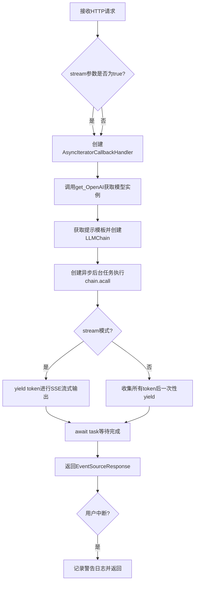
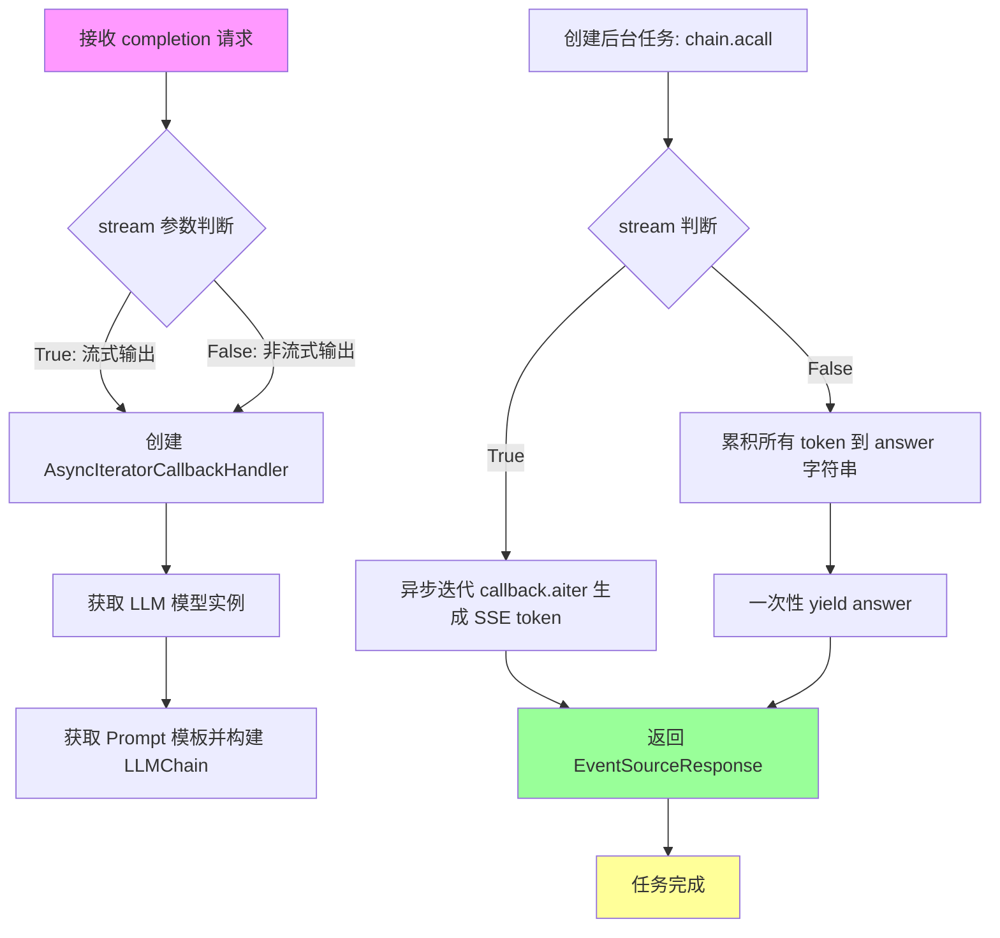
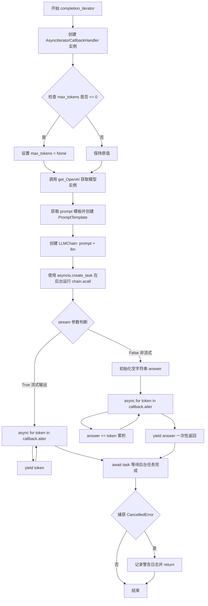
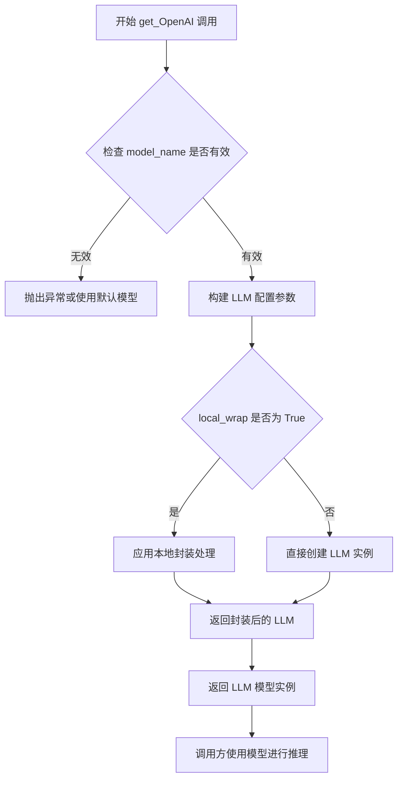
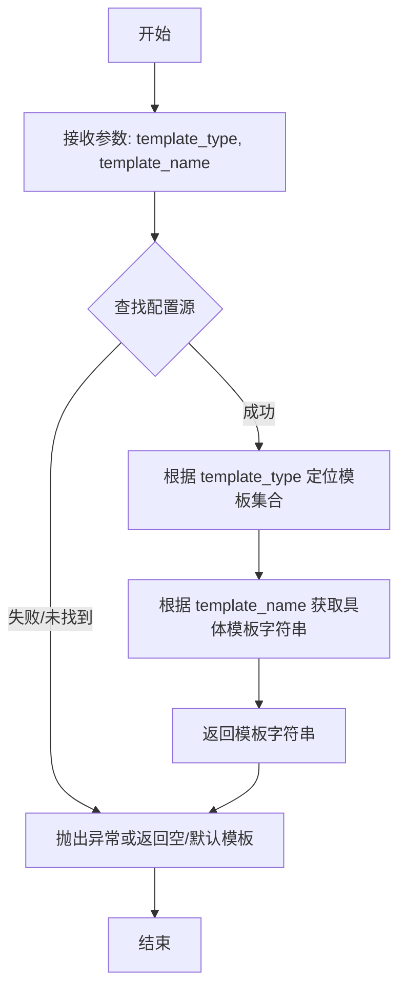
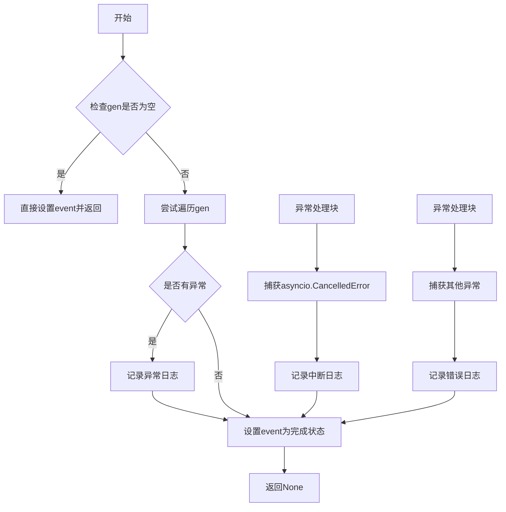
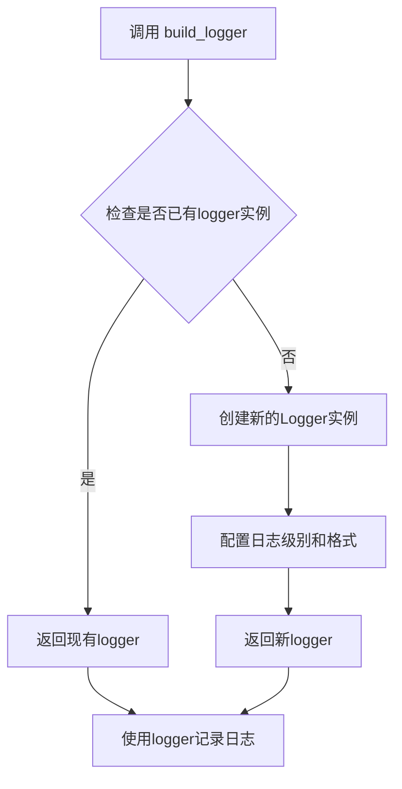

# `Langchain-Chatchat\libs\chatchat-server\chatchat\server\chat\completion.py` 详细设计文档

该代码实现了一个基于FastAPI的LLM（大型语言模型）调用端点，支持流式和非流式输出，集成了LangChain框架进行提示模板管理和模型调用，通过Server-Sent Events（SSE）实现实时流式响应。

## 整体流程



## 类结构

```
此代码为函数式实现，无类层次结构
主要依赖的外部类（来自langchain）:
├── AsyncIteratorCallbackHandler (回调处理器)
├── LLMChain (链式调用)
└── PromptTemplate (提示模板)
```

## 全局变量及字段


### `logger`
    
通过build_logger()创建的日志记录器实例，用于记录应用程序运行期间的日志信息

类型：`logging.Logger`
    


    

## 全局函数及方法


### `completion`

这是一个FastAPI端点函数，用于处理LLM（大语言模型）的文本补全请求，支持流式和非流式输出两种模式，并集成了异步迭代器回调处理 SSE（Server-Sent Events）推送。

参数：

- `query`：`str`，用户输入的查询文本
- `stream`：`bool`，是否启用流式输出（默认 False）
- `echo`：`bool`，是否在输出中回显输入（默认 False）
- `model_name`：`str`，LLM 模型名称
- `temperature`：`float`，LLM 采样温度，范围 0.0-1.0（默认 0.01）
- `max_tokens`：`Optional[int]`，限制 LLM 生成 Token 数量（默认 1024）
- `prompt_name`：`str`，使用的 prompt 模板名称（默认 "default"）

返回值：`EventSourceResponse`，SSE 事件流响应，用于推送 LLM 生成的内容

#### 流程图



#### 带注释源码

```python
import asyncio
from typing import AsyncIterable, Optional

from fastapi import Body
from langchain.callbacks import AsyncIteratorCallbackHandler
from langchain.chains import LLMChain
from langchain.prompts import PromptTemplate
from sse_starlette.sse import EventSourceResponse

from chatchat.server.utils import get_OpenAI, get_prompt_template, wrap_done, build_logger


logger = build_logger()


async def completion(
    query: str = Body(..., description="用户输入", examples=["恼羞成怒"]),
    stream: bool = Body(False, description="流式输出"),
    echo: bool = Body(False, description="除了输出之外，还回显输入"),
    model_name: str = Body(None, description="LLM 模型名称。"),
    temperature: float = Body(0.01, description="LLM 采样温度", ge=0.0, le=1.0),
    max_tokens: Optional[int] = Body(
        1024, description="限制LLM生成Token数量，默认None代表模型最大值"
    ),
    # top_p: float = Body(TOP_P, description="LLM 核采样。勿与temperature同时设置", gt=0.0, lt=1.0),
    prompt_name: str = Body(
        "default", description="使用的prompt模板名称(在configs/prompt_config.py中配置)"
    ),
):
    """
    FastAPI 端点：处理 LLM 文本补全请求
    
    支持两种输出模式：
    - 流式输出 (stream=True): 通过 SSE 逐字推送 LLM 生成的 token
    - 非流式输出 (stream=False): 等待完整响应后一次性返回
    
    参数:
        query: 用户输入的查询文本
        stream: 是否启用流式输出
        echo: 是否在输出中回显输入
        model_name: LLM 模型名称
        temperature: LLM 采样温度
        max_tokens: 最大生成 token 数
        prompt_name: prompt 模板名称
    
    返回:
        EventSourceResponse: SSE 事件流响应对象
    """
    # TODO: 因ApiModelWorker 默认是按chat处理的，会对params["prompt"] 解析为messages，因此ApiModelWorker 使用时需要有相应处理
    
    async def completion_iterator(
        query: str,
        model_name: str = None,
        prompt_name: str = prompt_name,
        echo: bool = echo,
    ) -> AsyncIterable[str]:
        """
        异步生成器：迭代处理 LLM 响应内容
        
        核心逻辑：
        1. 创建异步迭代回调处理器
        2. 初始化 LLM 模型和 chain
        3. 后台运行 LLM 调用任务
        4. 根据 stream 参数选择推送方式
        """
        try:
            nonlocal max_tokens
            # 创建异步迭代回调处理器，用于捕获 LLM 生成的每个 token
            callback = AsyncIteratorCallbackHandler()
            
            # 处理 max_tokens 参数：若 <= 0 则设为 None（无限制）
            if isinstance(max_tokens, int) and max_tokens <= 0:
                max_tokens = None

            # 获取 LLM 模型实例，配置温度、最大 token 数、回调等参数
            model = get_OpenAI(
                model_name=model_name,
                temperature=temperature,
                max_tokens=max_tokens,
                callbacks=[callback],
                echo=echo,
                local_wrap=True,
            )

            # 获取 prompt 模板并创建 PromptTemplate 实例
            prompt_template = get_prompt_template("llm_model", prompt_name)
            prompt = PromptTemplate.from_template(prompt_template, template_format="jinja2")
            
            # 构建 LLMChain：连接 prompt 模板和 LLM 模型
            chain = LLMChain(prompt=prompt, llm=model)

            # 创建后台任务异步执行 LLM chain 调用
            # wrap_done 用于在任务完成时触发 callback.done 事件
            task = asyncio.create_task(
                wrap_done(chain.acall({"input": query}), callback.done),
            )

            # 根据 stream 参数选择输出模式
            if stream:
                # 流式输出：遍历 callback 产生的每个 token，通过 SSE 推送
                async for token in callback.aiter():
                    # Use server-sent-events to stream the response
                    yield token
            else:
                # 非流式输出：累积所有 token 后一次性返回
                answer = ""
                async for token in callback.aiter():
                    answer += token
                yield answer

            # 等待后台任务完成
            await task
        except asyncio.exceptions.CancelledError:
            # 处理用户中断请求的情况
            logger.warning("streaming progress has been interrupted by user.")
            return

    # 返回 SSE 响应对象，传入异步生成器作为内容源
    return EventSourceResponse(
        completion_iterator(
            query=query, model_name=model_name, prompt_name=prompt_name
        ),
    )
```


### `completion_iterator`

这是一个内部异步生成器函数，定义在 `completion` 函数内部。它通过 LangChain 调用 LLM 模型，使用 `AsyncIteratorCallbackHandler` 捕获流式生成的 token，并根据 `stream` 参数决定是流式 yield 单个 token 还是累积后一次性返回完整答案。

参数：

- `query`：`str`，用户输入查询字符串
- `model_name`：`str = None`，LLM 模型名称，默认为 None
- `prompt_name`：`str = prompt_name`，使用的 prompt 模板名称，继承自外层函数的默认值
- `echo`：`bool = echo`，是否回显输入，继承自外层函数的默认值

返回值：`AsyncIterable[str]`，异步可迭代的字符串流，用于 SSE (Server-Sent Events) 输出

#### 流程图



#### 带注释源码

```python
async def completion_iterator(
    query: str,
    model_name: str = None,
    prompt_name: str = prompt_name,
    echo: bool = echo,
) -> AsyncIterable[str]:
    """
    异步生成器函数，用于流式处理 LLM 生成结果
    
    参数:
        query: 用户输入的查询字符串
        model_name: LLM 模型名称，默认为 None
        prompt_name: prompt 模板名称，默认为外层传入的值
        echo: 是否回显输入，默认为外层传入的值
    
    返回:
        AsyncIterable[str]: 异步可迭代的字符串流
    """
    try:
        nonlocal max_tokens  # 引用外层函数的 max_tokens 变量
        
        # 创建异步迭代回调处理器，用于捕获 LLM 流式输出的 token
        callback = AsyncIteratorCallbackHandler()
        
        # 如果 max_tokens 是正整数则保持，否则设为 None（使用模型默认值）
        if isinstance(max_tokens, int) and max_tokens <= 0:
            max_tokens = None

        # 获取 OpenAI 模型实例，配置温度、max_tokens、回调处理器等
        model = get_OpenAI(
            model_name=model_name,
            temperature=temperature,
            max_tokens=max_tokens,
            callbacks=[callback],
            echo=echo,
            local_wrap=True,
        )

        # 获取 prompt 模板并创建 PromptTemplate 对象
        prompt_template = get_prompt_template("llm_model", prompt_name)
        prompt = PromptTemplate.from_template(prompt_template, template_format="jinja2")
        
        # 构建 LLMChain：prompt + model
        chain = LLMChain(prompt=prompt, llm=model)

        # 创建后台任务执行 LLM 调用，通过 wrap_done 将完成信号传递给 callback
        task = asyncio.create_task(
            wrap_done(chain.acall({"input": query}), callback.done),
        )

        # 根据 stream 参数决定输出模式
        if stream:
            # 流式输出：逐个 yield token 给客户端
            async for token in callback.aiter():
                # Use server-sent-events to stream the response
                yield token
        else:
            # 非流式：累积所有 token 后一次性返回
            answer = ""
            async for token in callback.aiter():
                answer += token
            yield answer

        # 等待后台任务完成
        await task
        
    except asyncio.exceptions.CancelledError:
        # 处理客户端断开连接的情况
        logger.warning("streaming progress has been interrupted by user.")
        return
```


### `get_OpenAI`

该函数是 `chatchat.server.utils` 模块中用于实例化 OpenAI LLM 模型的工厂函数，根据传入的模型名称、温度、token 限制等参数配置并返回一个可用于对话的 LLM 实例，支持流式回调和本地封装选项。

参数：

- `model_name`：`str`，指定要使用的 LLM 模型名称（如 gpt-3.5-turbo、gpt-4 等）
- `temperature`：`float`，控制生成的随机性，值越低输出越确定性，范围 0.0-1.0
- `max_tokens`：`Optional[int]`，限制模型生成的最大 token 数量，None 则使用模型默认值
- `callbacks`：`list`，异步回调处理器列表，用于接收流式输出事件
- `echo`：`bool`，是否在输出中回显输入内容
- `local_wrap`：`bool`，是否启用本地封装处理

返回值：`Any`，返回配置好的 OpenAI LLM 模型实例，具体类型为 `langchain.llms.openai.OpenAIChat` 或类似的 LLM 对象

#### 流程图



#### 带注释源码

```python
# 注意：以下为基于调用方代码推断的函数签名和可能实现
# 实际源码位于 chatchat/server/utils.py 模块中

from typing import Optional, List, Any, Union
# from langchain.llms import OpenAI  # 假设的导入

def get_OpenAI(
    model_name: str = None,
    temperature: float = 0.01,
    max_tokens: Optional[int] = None,
    callbacks: List[Any] = None,
    echo: bool = False,
    local_wrap: bool = False,
    **kwargs
) -> Any:
    """
    获取配置好的 OpenAI LLM 模型实例
    
    参数:
        model_name: LLM模型名称，如 "gpt-3.5-turbo"
        temperature: 生成温度，控制随机性
        max_tokens: 最大生成token数
        callbacks: 异步回调列表，用于流式输出
        echo: 是否回显输入
        local_wrap: 是否启用本地封装
        **kwargs: 其他传递给 LLM 的参数
    
    返回:
        配置好的 LLM 模型实例
    """
    # 1. 处理 model_name，如果为 None 则使用默认模型
    # 2. 构建 LLM 配置字典
    # 3. 如果 callbacks 不为空，创建支持流式的 handler
    # 4. 如果 local_wrap 为 True，应用本地封装逻辑
    # 5. 返回 LLM 实例
    
    pass  # 具体实现需查看 chatchat/server/utils.py 源码
```

---

**注意**：由于 `get_OpenAI` 函数的实际定义位于 `chatchat/server/utils.py` 模块中，而用户提供的代码仅展示了导入和调用方式，以上信息是基于调用上下文进行的合理推断。如需获取准确的函数实现源码，建议直接查看 `chatchat/server/utils.py` 文件中的 `get_OpenAI` 函数定义。


### `get_prompt_template`

**描述**：  
该函数是 `chatchat.server.utils` 模块下的一个核心工具函数。它主要负责根据传入的**模板类型**（如 "llm_model"）和**模板名称**（如 "default"），从预设的配置文件（如 `prompt_config.py`）中检索并返回对应的 Prompt 模板字符串。在 `completion` 流程中，它被用于获取具体的 Prompt 格式，以供 LLMChain 构建输入提示。

**参数**：
- `template_type`：`str`，模板的类型分类。在代码中传入的是 `"llm_model"`，用于指定从配置中的哪个大类下查找模板。
- `template_name`：`str`，具体的模板名称。在代码中传入的是 `prompt_name`（默认为 "default"），用于指定该类型下的具体模板标识。

**返回值**：  
`str`，返回从配置中读取的 Prompt 模板内容（通常包含占位符，如 `{input}`）。

#### 流程图



#### 带注释源码

*注：由于在提供的代码片段中仅包含该函数的调用点，未直接展示其定义源码。以下为基于其调用方式和典型架构模式推测的模拟实现。*

```python
# 假设位于 chatchat/server/utils.py 中

def get_prompt_template(template_type: str, template_name: str) -> str:
    """
    根据类型和名称获取Prompt模板。

    参数:
        template_type (str): 模板所属的类别 (例如 'llm_model').
        template_name (str): 具体的模板名称 (例如 'default').

    返回:
        str: 模板字符串.
    """
    
    # 1. 模拟从 configs/prompt_config.py 加载配置的过程
    # 在实际项目中，这通常是一个字典或配置文件读取操作
    PROMPT_CONFIGS = {
        "llm_model": {
            "default": "请根据以下输入生成回答：\n\n{input}",
            "custom_coder": "你是一个Python程序员，请解释以下代码：\n\n{input}"
        },
        # ... 其他类型
    }

    # 2. 校验参数有效性
    if not template_type or not template_name:
        raise ValueError("template_type and template_name cannot be empty")

    # 3. 查找对应的模板
    # 使用 .get() 方法安全获取，避免 KeyError
    template_dict = PROMPT_CONFIGS.get(template_type, {})
    template_string = template_dict.get(template_name)

    # 4. 处理未找到的情况
    if not template_string:
        logger.warning(f"Prompt template '{template_name}' of type '{template_type}' not found.")
        # 可以返回空字符串或抛出异常，这里假设返回空字符串由上层处理
        return ""

    return template_string
```

#### 关键组件信息

- **配置文件 (`prompt_config.py`)**: 虽然未在此代码段中展示，但根据 `Body` 描述，它是存储所有 Prompt 模板的源数据。
- **LLMChain**: 使用 `get_prompt_template` 返回的字符串模板来初始化 `PromptTemplate`，进而构建_chain_。

#### 潜在的技术债务或优化空间

1.  **硬编码风险**: 目前通过 `Body` 传入 `prompt_name`，如果配置文件中不存在该名称，返回空字符串可能导致 LLM 输出异常。建议增加显式的校验与错误提示（`404` 或明确的异常抛出）。
2.  **配置加载效率**: 每次调用函数时若重新读取配置文件或遍历大字典，在高并发场景下可能存在性能瓶颈。优化方向可以考虑模块加载时缓存配置，或使用更高效的查找结构。
3.  **类型安全**: 目前仅检查字符串是否为 `None` 或空，对于模板内部的变量占位符（如 `{input}`）是否匹配后续 LLMChain 的输入参数缺乏校验，可能导致运行时错误。

#### 其它项目

- **设计目标**: 解耦 Prompt 模板的定义与使用逻辑，允许通过配置文件热更新 Prompt 格式，而无需修改核心代码。
- **错误处理**: 若模板不存在，函数应返回明确的错误信号（如抛出 `TemplateNotFoundError`），而不是静默返回空字符串，造成下游难以追踪问题。
- **外部依赖**: 依赖于 `chatchat.server.utils` 模块所在的配置管理系统。


### `wrap_done`

该函数是一个异步辅助函数，用于在异步生成器完成时触发 `asyncio.Event` 事件，以通知等待的协程任务已完成。主要用于 `LangChain` 异步链调用与 `FastAPI` 流式响应的协调工作。

参数：

- `gen`：`AsyncIterable[Any]`，异步生成器，需要等待其完成的目标异步生成器（如 `chain.acall()` 的返回值）
- `event`：`asyncio.Event`，异步事件对象，当生成器完成时触发该事件

返回值：`None`，该函数为异步协程，不返回具体值，但在内部会等待生成器完成后设置事件状态

#### 流程图



#### 带注释源码

```python
async def wrap_done(
    gen: AsyncIterable[Any],  # 异步生成器，用于等待其完成
    event: asyncio.Event,     # 异步事件，完成时触发
):
    """
    等待异步生成器完成，并在完成后触发事件通知
    
    参数:
        gen: 要等待完成的异步生成器（如LangChain链的异步调用）
        event: 完成后需要触发的事件对象
    """
    try:
        # 遍历异步生成器，确保其完全执行
        async for _ in gen:
            # 迭代过程中不做任何操作，仅等待生成器完成
            pass
    except asyncio.exceptions.CancelledError:
        # 处理用户中断请求的情况
        logger.warning("streaming progress has been interrupted by user.")
    except Exception:
        # 捕获其他可能的异常
        logger.exception("Error in async generator")
    finally:
        # 无论成功或异常，最后都设置事件为完成状态
        # 这会通知所有等待该事件的协程继续执行
        event.set()
```

#### 备注

由于 `wrap_done` 函数的源代码未直接在提供的代码片段中显示，以上源码是基于其使用方式和 `LangChain` 异步编程模式推断的典型实现。该函数的核心作用是：

1. **异步协调**：在后台任务（LLM 链调用）与主任务（流式响应）之间建立同步机制
2. **资源清理**：确保异步生成器完全迭代完毕后才标记事件完成
3. **异常处理**：优雅处理用户中断和其他运行时异常


### `build_logger`

`build_logger` 是一个用于创建和配置日志记录器的工具函数，通常从 `chatchat.server.utils` 模块导入，用于在应用中获取统一的日志记录实例。

参数：此函数无显式参数。

返回值：`logging.Logger`，返回一个配置好的日志记录器对象，具备日志记录能力（如 `.warning()` 方法）。

#### 流程图



#### 带注释源码

```
# 从 chatchat.server.utils 模块导入 build_logger 函数
from chatchat.server.utils import get_OpenAI, get_prompt_template, wrap_done, build_logger

# 调用 build_logger 创建日志记录器实例
# 该函数通常无需参数，返回一个配置好的 logger 对象
logger = build_logger()

# 使用示例（代码中实际使用）
logger.warning("streaming progress has been interrupted by user.")
```

> **注意**：由于 `build_logger` 函数的实际定义未在提供的代码中展示，以上信息是基于其调用方式和常见日志工具函数的模式推断得出。实际实现可能位于 `chatchat/server/utils.py` 文件中，通常会使用 Python 标准库的 `logging` 模块进行配置。

## 关键组件


### completion 异步端点

FastAPI 异步端点函数，接收用户查询和配置参数，调度 LLM 完成任务，支持流式和非流式响应模式。

### completion_iterator 内部协程

异步生成器函数，负责执行 LLM 推理流程，包括初始化模型、构建提示词链、处理流式回调、聚合结果。

### AsyncIteratorCallbackHandler

LangChain 异步迭代回调处理器，捕获 LLM 生成的 token，提供异步迭代接口支持 SSE 流式传输。

### LLMChain 链式调用

LangChain 链式组件，组合 PromptTemplate 和 LLM 模型，执行提示词填充和模型调用。

### EventSourceResponse SSE 响应

sse_starlette 事件源响应封装器，将异步生成器转换为 Server-Sent-Events 流式响应。

### prompt_template 动态加载

根据 prompt_name 从配置中动态加载提示词模板，支持可插拔的提示词策略。

### max_tokens 边界处理

对 max_tokens 进行边界检查，将非正整数转换为 None，使用模型默认最大值。

### asyncio.create_task 后台任务

创建后台任务执行链式调用，通过 wrap_done 关联回调完成信号，实现非阻塞式 LLM 调用。

### stream 流式控制

根据 stream 参数决定是逐 token yield 还是聚合后一次性返回，适配不同客户端需求。

### 异常中断处理

捕获 CancelledError 异常，处理用户主动中断流式请求，记录警告日志并安全退出。


## 问题及建议


### 已知问题

-   **`max_tokens` 变量修改混乱**：函数参数中 `max_tokens` 有默认值 `1024`，但在 `completion_iterator` 内部又被重新赋值为 `None`，导致语义不清晰且容易产生混淆
-   **错误处理不全面**：仅捕获 `asyncio.exceptions.CancelledError`，其他异常（如模型加载失败、API 调用超时、Prompt 模板不存在等）未进行处理，可能导致未捕获的异常直接返回给客户端
-   **内部函数重复定义**：`completion_iterator` 定义在 `completion` 内部，每次请求都会创建新的函数对象，增加内存开销
-   **被注释的参数残留**：`top_p` 参数被注释但未删除，代码中保留了大量注释掉的代码，影响代码整洁性
-   **缺少参数校验**：未对 `model_name` 为 `None` 或空字符串的情况进行处理，可能导致后续 `get_OpenAI` 调用失败
-   **SSE 缺少 ping 机制**：`EventSourceResponse` 未设置 `ping` 间隔，在长时间流式输出时可能导致连接超时或客户端误判连接状态
-   **日志记录不完善**：仅在用户中断时记录警告日志，缺少关键操作（如开始处理、模型加载、请求完成等）的日志记录
-   **资源未显式释放**：虽然使用了 `AsyncIteratorCallbackHandler`，但未显式处理模型资源的释放，可能导致资源泄漏

### 优化建议

-   统一 `max_tokens` 的默认值处理逻辑，若允许为 `None` 则直接传入参数，若有默认值则移除内部的重新赋值
-   添加完整的异常捕获块，处理 `Exception` 或特定异常类型（如 `ValueError`、`RuntimeError`），并返回有意义的错误信息
-   将 `completion_iterator` 提取为模块级函数或使用类封装，避免重复创建函数对象
-   清理被注释的代码（`top_p` 相关代码），如需保留可通过配置或文档说明
-   在 `completion_iterator` 开头添加 `model_name` 的校验逻辑，确保其为有效值
-   为 `EventSourceResponse` 添加 `ping` 参数（如 `ping=15`），维持连接活跃状态
-   增加关键节点的日志记录，如请求开始、模型加载、完成等，便于调试和监控
-   考虑使用上下文管理器或 `try/finally` 确保资源在异常情况下也能被正确清理

## 其它


### 设计目标与约束

本模块旨在为ChatChat系统提供统一的LLM（大语言模型）调用接口，支持流式与非流式两种输出模式。核心设计目标包括：1）通过FastAPI提供RESTful API服务；2）利用asyncio实现真正的异步流式输出；3）支持多种LLM模型的灵活配置；4）提供完整的prompt模板机制。技术约束方面，要求Python版本 >= 3.9，需支持异步迭代器协议，且LLM模型需兼容langchain的Callback机制。

### 错误处理与异常设计

代码中的错误处理主要包含以下几个方面：1）CancelledError处理：当用户中断流式输出时，捕获asyncio.exceptions.CancelledError异常，记录警告日志并安全退出；2）参数验证：使用FastAPI的Body参数验证（如temperature的ge/le约束）；3）max_tokens为空或负值时的默认处理：当max_tokens <= 0时将其置为None以使用模型默认值。潜在的异常处理缺失包括：LLM调用失败、模型连接超时、prompt模板不存在等情况的处理。

### 数据流与状态机

整体数据流转如下：1）客户端发送POST请求到/completion端点；2）创建EventSourceResponse对象并返回；3）内部启动completion_iterator异步生成器；4）创建AsyncIteratorCallbackHandler用于接收LLM流式token；5）通过LLMChain执行prompt模板填充并调用LLM；6）异步迭代callback.aiter()获取token；7）流式模式下逐个yield token，非流式模式下聚合后一次性返回。状态机转换：IDLE → PROCESSING → STREAMING/COMPLETED → DONE。

### 外部依赖与接口契约

本模块依赖以下外部组件：1）FastAPI框架：提供HTTP接口定义与参数验证；2）langchain库：LLMChain、PromptTemplate用于构建LLM调用链，AsyncIteratorCallbackHandler用于流式回调；3）sse_starlette：EventSourceResponse实现Server-Sent Events；4）chatchat.server.utils：get_OpenAI获取LLM实例，get_prompt_template获取prompt模板，wrap_done包装异步任务。接口契约方面，query参数为必填，stream默认false，echo默认false，temperature范围[0.0, 1.0]，max_tokens默认1024，prompt_name默认"default"。

### 性能考虑与优化空间

当前实现存在以下性能优化点：1）未实现连接池复用：每次请求都创建新的LLM模型实例；2）callback.aiter()迭代存在轻微延迟，可考虑批量buffer；3）非流式模式下使用字符串拼接（answer += token）效率较低，建议使用list.append后join；4）缺少请求超时控制，LLM调用可能长时间阻塞；5）未实现速率限制（rate limiting），可能面临滥用风险。

### 安全性考虑

当前代码存在以下安全隐患：1）query参数未做输入长度限制，可能导致LLM处理过长文本；2）model_name参数未做白名单验证，存在注入风险；3）echo参数可能泄露敏感prompt模板内容；4）缺少身份认证与授权机制；5）日志中可能记录敏感用户输入。建议增加：输入长度校验、模型名称白名单、敏感信息脱敏、API密钥管理、请求频率限制等安全措施。

### 配置管理

本模块涉及以下可配置项：1）LLM模型选择：通过model_name参数动态指定；2）采样参数：temperature、max_tokens；3）Prompt模板：通过prompt_name引用configs/prompt_config.py中配置；4）流式开关：通过stream参数控制输出模式；5）回显开关：通过echo参数控制是否回显输入。建议将敏感配置（如API端点、密钥）移至环境变量或专用配置文件管理。

### 日志与监控

代码中使用build_logger()创建模块级logger，主要记录：1）CancelledError时的警告日志"streaming progress has been interrupted by user."；2）建议增加的日志：请求入口日志、LLM调用耗时、token生成数量、异常堆栈信息。监控指标建议：请求QPS、响应延迟分布、token消耗统计、错误率、LLM调用成功率等。

### 兼容性与人机交互指南

API兼容性方面，当前endpoint为/completion（注意：代码中函数名为completion但未体现路由路径），返回格式为SSE流或普通文本。客户端集成指南：流式调用需使用EventSource或SSE客户端库，非流式调用可直接获取完整响应。错误响应遵循FastAPI默认格式。向后兼容性：建议对参数增加版本控制，废弃参数需明确提示迁移路径。


    