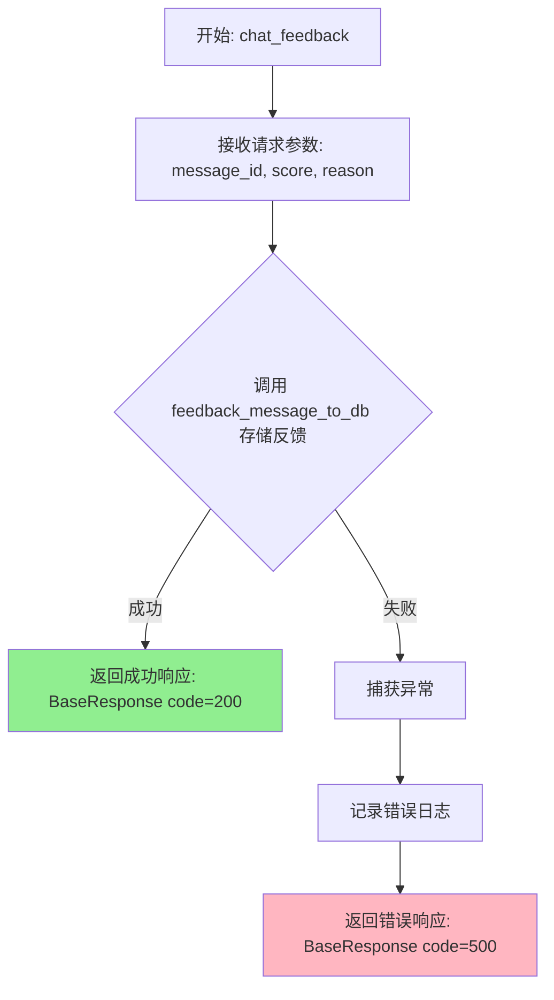
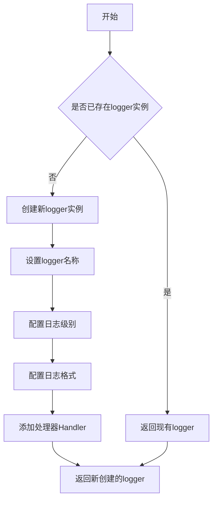
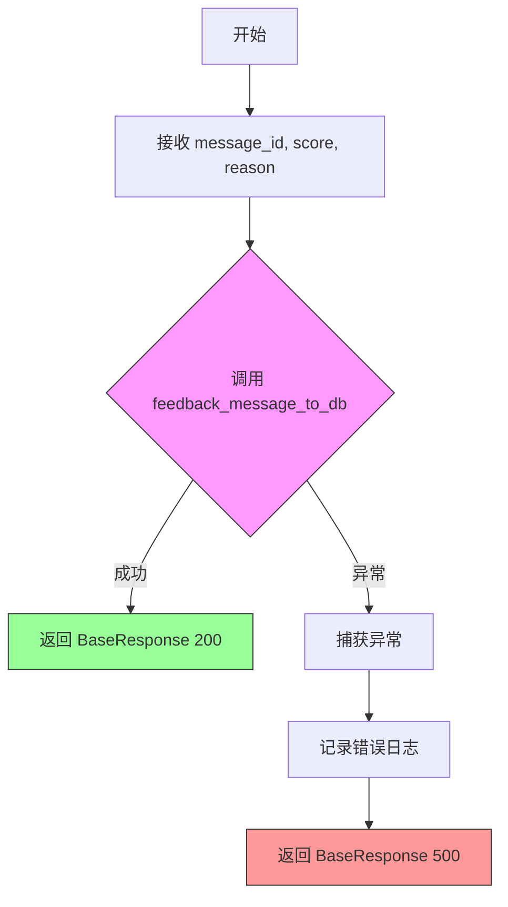
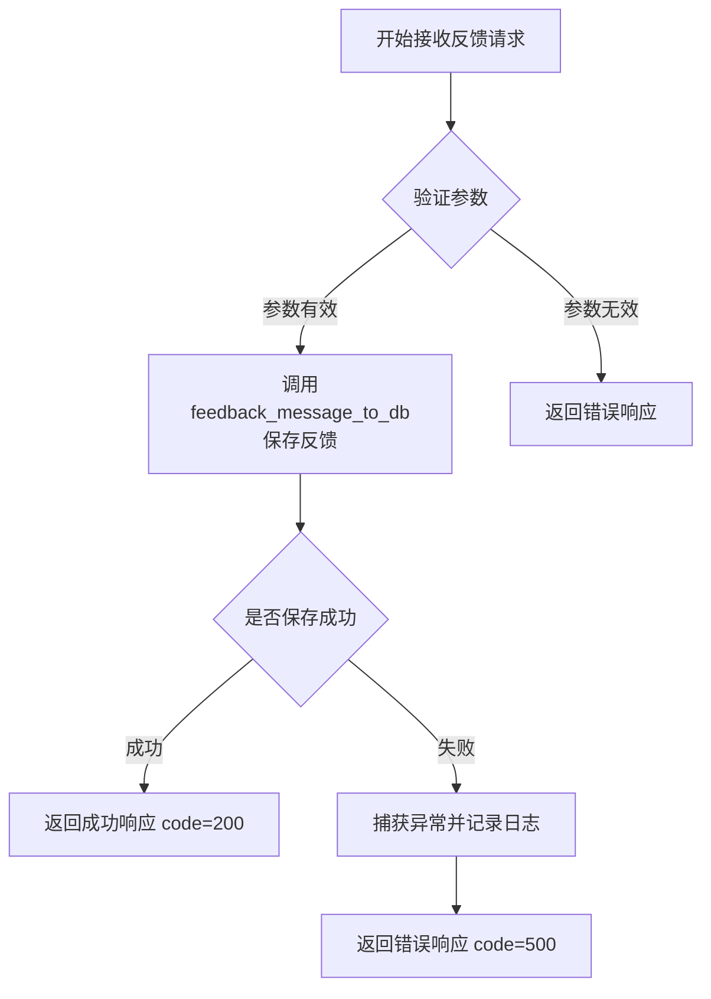

# `Langchain-Chatchat\libs\chatchat-server\chatchat\server\chat\feedback.py` 详细设计文档

这是一个FastAPI聊天反馈接口，用于接收用户对聊天记录的评分和评价，将反馈信息存储到数据库，并返回标准化的响应结果。

## 整体流程

```mermaid
graph TD
    A[开始] --> B[接收请求参数]
    B --> C{message_id, score, reason}
    C --> D[调用 feedback_message_to_db 保存反馈]
    D --> E{是否抛出异常?}
    E -- 是 --> F[记录错误日志]
    F --> G[返回 BaseResponse(code=500)]
    E -- 否 --> H[返回 BaseResponse(code=200)]
```

## 类结构

```
无类定义 - 模块级函数
```

## 全局变量及字段


### `logger`
    
日志记录器实例，由build_logger()构建，用于记录程序运行过程中的日志信息

类型：`logging.Logger`
    


    

## 全局函数及方法


### `chat_feedback`

该函数是一个 FastAPI 端点，用于接收用户对聊天记录的反馈评分（分数和理由），并将反馈数据存储到数据库中，返回操作结果。

参数：

- `message_id`：`str`，聊天记录的唯一标识ID
- `score`：`int`，用户评分，取值范围 0-100，越大表示评价越高
- `reason`：`str`，用户对评分理由的描述，如不符合事实等

返回值：`BaseResponse`，包含操作状态码和消息的响应对象

#### 流程图



#### 带注释源码

```python
# 导入 FastAPI 的 Body 用于从请求体中提取参数
from fastapi import Body

# 导入日志构建工具
from chatchat.utils import build_logger
# 导入数据库操作函数：存储反馈消息到数据库
from chatchat.server.db.repository import feedback_message_to_db
# 导入基础响应类，用于构造返回值
from chatchat.server.utils import BaseResponse

# 构建模块级日志记录器
logger = build_logger()


def chat_feedback(
    # message_id: 聊天记录的唯一标识，从请求体获取，最大长度32字符
    message_id: str = Body("", max_length=32, description="聊天记录id"),
    # score: 用户评分，从请求体获取，范围0-100
    score: int = Body(0, max=100, description="用户评分，满分100，越大表示评价越高"),
    # reason: 用户评分理由，从请求体获取
    reason: str = Body("", description="用户评分理由，比如不符合事实等"),
):
    """
    处理聊天反馈的 FastAPI 端点函数
    
    接收用户对聊天记录的评分和理由，持久化到数据库，并返回操作结果
    """
    try:
        # 尝试将反馈信息写入数据库
        # 参数: 消息ID、评分、评分理由
        feedback_message_to_db(message_id, score, reason)
    except Exception as e:
        # 捕获所有异常，处理存储失败的情况
        # 构建错误消息
        msg = f"反馈聊天记录出错： {e}"
        # 记录错误日志，包含异常类型和错误详情
        logger.error(f"{e.__class__.__name__}: {msg}")
        # 返回500错误响应
        return BaseResponse(code=500, msg=msg)

    # 存储成功，返回200成功响应
    return BaseResponse(code=200, msg=f"已反馈聊天记录 {message_id}")
```


### `build_logger`

该函数是用于创建并配置项目日志记录器的工厂函数，从 `chatchat.utils` 模块导出，返回一个配置好的 logger 实例，用于项目中各模块的日志记录。

参数：
- 该函数无显式参数

返回值：`logging.Logger`，返回配置好的 Python 标准库日志记录器对象

#### 流程图



#### 带注释源码

```python
# 基于代码导入方式和调用模式的推断实现
# from chatchat.utils import build_logger
# logger = build_logger()

def build_logger(name: str = "chatchat") -> logging.Logger:
    """
    构建并配置项目日志记录器
    
    Args:
        name: logger名称，默认为"chatchat"
        
    Returns:
        配置好的Logger实例
    """
    # 获取或创建logger（单例模式，避免重复创建）
    logger = logging.getLogger(name)
    
    # 避免重复配置（当logger已有handler时跳过）
    if logger.handlers:
        return logger
    
    # 设置日志级别（通常为INFO）
    logger.setLevel(logging.INFO)
    
    # 创建控制台处理器
    console_handler = logging.StreamHandler()
    console_handler.setLevel(logging.INFO)
    
    # 设置日志格式：时间戳 - 日志级别 - 模块名 - 消息
    formatter = logging.Formatter(
        '%(asctime)s - %(name)s - %(levelname)s - %(message)s'
    )
    console_handler.setFormatter(formatter)
    
    # 将handler添加到logger
    logger.addHandler(console_handler)
    
    return logger

# 使用示例
# logger = build_logger()
# logger.info("这是信息日志")
# logger.error("这是错误日志")
```

> **注意**：由于代码中仅展示了 `build_logger` 函数的导入和调用方式，未提供该函数的具体实现源码，上述内容为基于代码使用模式的合理推断。实际实现可能包含更多配置选项（如文件输出、日志轮转、不同环境下的日志级别区分等）。


### `feedback_message_to_db`

将用户的聊天反馈（评分和理由）持久化到数据库的函数。

参数：

- `message_id`：`str`，聊天记录的唯一标识 ID
- `score`：`int`，用户评分，满分 100，数值越大表示评价越高
- `reason`：`str`，用户评分理由，例如不符合事实等

返回值：`Unknown`（根据当前代码片段无法确定实际返回值类型，推测为 `None` 或 `bool`）

#### 流程图



#### 带注释源码

```python
# 该函数定义位于 chatchat.server.db.repository 模块中
# 当前代码片段仅展示了调用方，未展示其实际实现
# 以下为基于调用方式的推断

def feedback_message_to_db(
    message_id: str,   # 聊天记录的唯一标识 ID
    score: int,         # 用户评分，范围 0-100
    reason: str         # 用户评分理由
):
    """
    将用户的聊天反馈持久化到数据库
    
    Args:
        message_id: 聊天记录的唯一标识
        score: 用户评分（0-100）
        reason: 评分理由
    
    Returns:
        推测返回 None 或布尔值（当前调用方未使用返回值）
    """
    # 实际的数据库插入逻辑
    # 可能涉及 ORM 操作或直接 SQL 执行
    pass
```

---

#### 补充说明

| 项目 | 说明 |
|------|------|
| **设计目标** | 将用户对聊天的反馈评分和理由持久化存储，用于后续数据分析和服务质量改进 |
| **约束** | `message_id` 最大长度 32 字符，`score` 范围 0-100 |
| **错误处理** | 调用方使用 `try-except` 捕获异常，异常时记录日志并返回 500 错误 |
| **数据流** | 前端 → FastAPI Body → chat_feedback → feedback_message_to_db → 数据库 |
| **接口契约** | 调用方传入三个必要参数，函数内部处理数据库持久化，不返回结果供调用方使用 |
| **技术债务** | 函数返回值类型不明确，调用方未处理返回值，可能导致静默失败 |


### `chat_feedback`

该函数用于处理用户对聊天记录的反馈评价，接收消息ID、评分和评分理由，将反馈信息保存到数据库，并返回相应的操作结果。

参数：

- `message_id`：`str`，聊天记录id，用于唯一标识需要反馈的聊天记录
- `score`：`int`，用户评分，满分100，越大表示评价越高
- `reason`：`str`，用户评分理由，比如不符合事实等

返回值：`BaseResponse`，包含操作状态码和消息的响应对象

#### 流程图



#### 带注释源码

```python
from fastapi import Body  # 导入FastAPI的Body参数装饰器

from chatchat.utils import build_logger  # 导入日志构建器
from chatchat.server.db.repository import feedback_message_to_db  # 导入数据库操作函数
from chatchat.server.utils import BaseResponse  # 导入响应基类，用于统一返回格式

logger = build_logger()  # 初始化日志记录器


def chat_feedback(
    message_id: str = Body("", max_length=32, description="聊天记录id"),
    score: int = Body(0, max=100, description="用户评分，满分100，越大表示评价越高"),
    reason: str = Body("", description="用户评分理由，比如不符合事实等"),
):
    """
    处理用户对聊天记录的反馈评价
    
    参数:
        message_id: 聊天记录的唯一标识符
        score: 用户给出的评分，范围0-100
        reason: 用户给出该评分的具体理由
    
    返回:
        BaseResponse: 包含操作结果状态码和消息的响应对象
    """
    try:
        # 尝试将反馈信息保存到数据库
        feedback_message_to_db(message_id, score, reason)
    except Exception as e:
        # 捕获异常并记录错误日志
        msg = f"反馈聊天记录出错： {e}"
        logger.error(f"{e.__class__.__name__}: {msg}")
        # 返回错误响应，状态码500表示服务器内部错误
        return BaseResponse(code=500, msg=msg)

    # 反馈成功，返回成功响应，状态码200表示操作成功
    return BaseResponse(code=200, msg=f"已反馈聊天记录 {message_id}")
```

---

### 关于 `BaseResponse` 类

由于提供的代码中没有 `BaseResponse` 类的完整定义，只能从使用方式推断其结构：

#### 推断的类结构

```python
# 推断的BaseResponse类结构（来源：chatchat.server.utils）
class BaseResponse:
    """
    统一的API响应基类
    
    属性:
        code: int - 状态码，200表示成功，500表示错误
        msg: str - 响应消息，用于返回给客户端的信息
    """
    
    def __init__(self, code: int = 200, msg: str = ""):
        self.code = code
        self.msg = msg
```

#### 使用示例

```python
# 在chat_feedback函数中的使用方式：
return BaseResponse(code=500, msg=msg)  # 返回错误响应
return BaseResponse(code=200, msg=f"已反馈聊天记录 {message_id}")  # 返回成功响应
```

## 关键组件


### FastAPI聊天反馈端点 (chat_feedback)

该端点是一个POST请求处理函数，接收用户的聊天反馈信息（消息ID、评分、评分理由），调用数据库仓储层将反馈保存到数据库，并返回操作结果。函数使用FastAPI的Body参数接收数据，通过try-except捕获异常并返回相应的错误响应。

### 聊天反馈数据模型

定义了三个关键的输入参数：message_id为字符串类型，最大长度为32，用于唯一标识聊天记录；score为整型，取值范围0-100，表示用户对聊天内容的评分；reason为字符串类型，用于用户填写评分理由或不符合事实的说明。

### 日志记录模块

使用build_logger工具函数创建全局logger实例，用于记录函数执行过程中的关键信息和错误日志，便于问题排查和系统监控。

### 数据库仓储层接口 (feedback_message_to_db)

封装了将聊天反馈数据持久化到数据库的业务逻辑，由外部模块chatchat.server.db.repository提供，接收消息ID、评分和理由作为参数执行插入或更新操作。

### 统一响应模型 (BaseResponse)

用于构建HTTP响应的数据模型，包含code（状态码）和msg（消息内容）字段，函数根据执行成功或失败返回不同的状态码和信息。

### 异常处理机制

使用try-except捕获所有Exception类型的异常，记录错误日志并返回500状态码的错误响应，确保API的健壮性并向客户端提供有意义的错误信息。


## 问题及建议


### 已知问题

-   **异常处理过于宽泛**：使用 `except Exception as e` 会捕获所有异常，包括潜在的系统级异常（如 KeyboardInterrupt、SystemExit），掩盖真正的错误原因
-   **错误日志不完整**：仅记录了错误消息，未记录完整的堆栈信息（`traceback`），不利于生产环境问题排查
-   **输入验证不足**：`score` 参数只限制了最大值（max=100），未限制最小值，负数评分仍可传入；`message_id` 为空字符串时仍会调用数据库操作
-   **缺乏成功日志**：操作成功时无日志记录，无法追溯用户反馈行为
-   **缺少业务校验**：未校验 `message_id` 对应的聊天记录是否存在，数据库操作可能写入无效数据
-   **错误信息泄露实现细节**：返回的错误消息包含异常类型名称（`e.__class__.__name__`），可能暴露内部实现信息
-   **无幂等性设计**：重复提交相同反馈会多次写入数据库，缺乏去重或状态检查机制
-   **数据库操作无事务保障**：直接调用 `feedback_message_to_db`，未显式管理事务边界

### 优化建议

-   **细化异常捕获**：针对特定异常类型（如 `DatabaseError`、`IntegrityError`）进行捕获，保留系统级异常向上传播
-   **完善日志记录**：使用 `logger.exception()` 或 `traceback.format_exc()` 记录完整堆栈；添加成功操作的 info 级别日志
-   **强化输入校验**：使用 Pydantic 模型替代 Body 参数，添加 `ge=0` 约束 score 最小值；校验 `message_id` 格式（非空 UUID/雪花 ID）
-   **增加业务校验**：调用数据库前验证 `message_id` 是否存在，返回明确的 404 错误
-   **脱敏错误信息**：错误响应仅返回通用提示（如"服务内部错误"），详细错误信息记录到日志
-   **实现幂等机制**：通过唯一约束或状态字段防止重复反馈，或使用分布式锁
-   **事务管理**：在 `feedback_message_to_db` 中显式使用事务，确保数据一致性

## 其它


### 设计目标与约束

该模块旨在为聊天系统提供用户反馈功能，允许用户对聊天记录进行评分和评论。约束条件包括：message_id长度限制为32字符，score取值范围为0-100，reason为可选字段。API采用RESTful风格，通过HTTP POST方法接收反馈数据。

### 错误处理与异常设计

异常处理采用try-except捕获所有Exception类型，记录错误日志并返回500错误码和错误信息。数据库操作异常被捕获后转换为用户友好的错误消息。异常信息包含异常类名和详细错误描述，便于问题追踪。

### 外部依赖与接口契约

外部依赖包括：chatchat.utils.build_logger日志工具、chatchat.server.db.repository.feedback_message_to_db数据库操作函数、chatchat.server.utils.BaseResponse响应基类。接口契约要求feedback_message_to_db函数接受message_id、score、reason三个参数并返回操作结果。

### 安全性考虑

message_id参数使用Body参数并设置max_length=32进行输入长度验证，防止缓冲区溢出和恶意输入。score参数设置max=100进行数值范围校验。数据库操作需确保SQL注入防护。日志记录需注意不要泄露敏感信息。

### 性能考虑

该函数为同步阻塞调用，数据库写入操作可能影响响应时间。建议在生产环境中考虑异步处理或消息队列解耦。当前实现适用于中小规模并发场景。

### 可测试性

函数依赖外部模块(logger、feedback_message_to_db、BaseResponse)，建议通过依赖注入提高可测试性。可使用FastAPI的TestClient进行端到端测试，或对业务逻辑进行单元测试。

### 部署配置

部署时需确保数据库连接配置正确，日志级别和输出路径已配置。API网关需配置合理的超时时间和重试策略。建议配合健康检查接口进行部署验证。


    