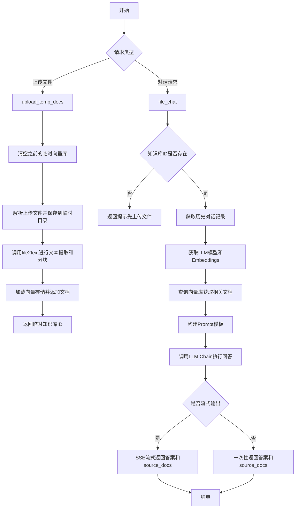
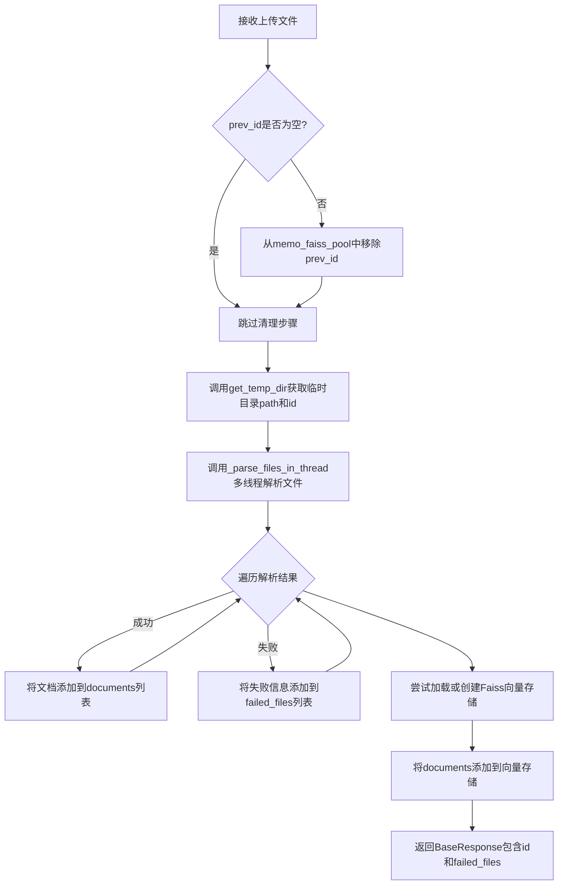
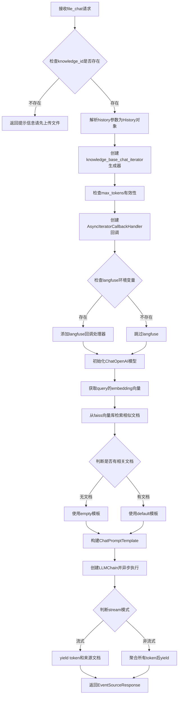
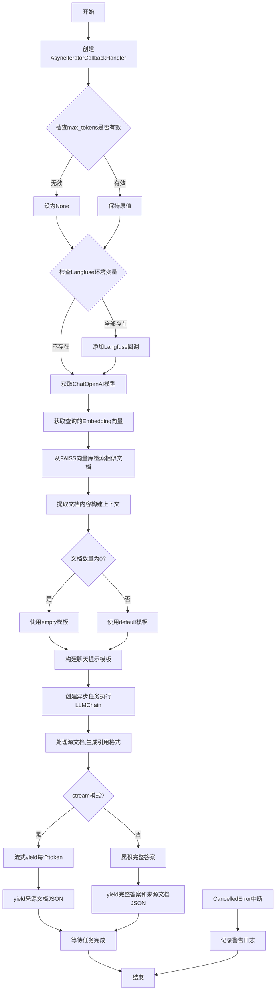

# `Langchain-Chatchat\libs\chatchat-server\chatchat\server\chat\file_chat.py` 详细设计文档

该文件实现了一个基于FastAPI的临时知识库问答系统，支持用户上传文件并进行向量化存储，同时提供基于临时知识库的对话功能，支持流式输出和LLM集成。

## 整体流程



## 类结构

```
模块: kb_temp_api (临时知识库API)
├── 函数: _parse_files_in_thread
├── 函数: upload_temp_docs (FastAPI端点)
└── 函数: file_chat (FastAPI端点)
    └── 内部函数: knowledge_base_chat_iterator (异步生成器)
```

## 全局变量及字段


### `logger`
    
日志记录器实例，用于记录系统运行日志

类型：`logging.Logger`
    


### `files`
    
上传文件列表，包含用户上传的文件对象

类型：`List[UploadFile]`
    


### `dir`
    
目标目录路径，用于保存上传文件的目录

类型：`str`
    


### `zh_title_enhance`
    
中文标题增强标志，用于是否启用中文标题增强

类型：`bool`
    


### `chunk_size`
    
文本分块大小，用于知识库中文本的分块长度

类型：`int`
    


### `chunk_overlap`
    
分块重叠大小，用于知识库中文本分块的重叠长度

类型：`int`
    


### `prev_id`
    
前一个临时知识库ID，用于指定前一个临时知识库以替换

类型：`Optional[str]`
    


### `documents`
    
文档列表，用于存储从文件中解析出的文档对象

类型：`List[Document]`
    


### `path`
    
临时目录路径，用于存储临时文件的目录路径

类型：`str`
    


### `id`
    
临时知识库ID，用于标识临时知识库的唯一ID

类型：`str`
    


### `failed_files`
    
上传失败的文件列表，用于记录上传失败的文件及错误信息

类型：`List[dict]`
    


### `knowledge_id`
    
知识库ID，用于标识当前使用的临时知识库

类型：`str`
    


### `query`
    
用户查询，用于从知识库中检索相关文档

类型：`str`
    


### `top_k`
    
向量搜索返回数量，用于指定返回最相似的文档数量

类型：`int`
    


### `score_threshold`
    
相似度阈值，用于过滤低相似度的文档

类型：`float`
    


### `history`
    
对话历史，用于存储用户与助手的对话历史

类型：`List[History]`
    


### `stream`
    
是否流式输出，用于指定是否以流式方式返回回答

类型：`bool`
    


### `model_name`
    
LLM模型名称，用于指定使用的语言模型

类型：`Optional[str]`
    


### `temperature`
    
采样温度，用于控制生成文本的随机性

类型：`float`
    


### `max_tokens`
    
最大token数，用于限制生成回答的最大长度

类型：`Optional[int]`
    


### `prompt_name`
    
prompt模板名称，用于指定使用的提示模板

类型：`str`
    


### `callback`
    
异步迭代回调处理器，用于处理流式输出的回调

类型：`AsyncIteratorCallbackHandler`
    


### `callbacks`
    
回调列表，用于存储各种回调处理器

类型：`List[Any]`
    


### `langfuse_secret_key`
    
Langfuse密钥，用于Langfuse服务的认证

类型：`Optional[str]`
    


### `langfuse_public_key`
    
Langfuse公钥，用于Langfuse服务的认证

类型：`Optional[str]`
    


### `langfuse_host`
    
Langfuse主机，用于指定Langfuse服务的地址

类型：`Optional[str]`
    


### `model`
    
ChatOpenAI模型实例，用于与语言模型交互

类型：`ChatOpenAI`
    


### `embed_func`
    
Embeddings函数，用于将文本转换为向量嵌入

类型：`BaseEmbeddings`
    


### `embeddings`
    
查询的embeddings向量，用于在知识库中进行相似度搜索

类型：`List[float]`
    


### `vs`
    
向量存储实例，用于存储和检索文档向量

类型：`FAISS`
    


### `docs`
    
检索到的文档列表，用于提供回答的相关文档

类型：`List[Document]`
    


### `context`
    
拼接的文档上下文，用于构建提示上下文

类型：`str`
    


### `prompt_template`
    
Prompt模板，用于生成提示文本

类型：`BasePromptTemplate`
    


### `input_msg`
    
输入消息，用于构建用户消息

类型：`History`
    


### `chat_prompt`
    
聊天提示模板，用于生成聊天格式的提示

类型：`ChatPromptTemplate`
    


### `chain`
    
LLMChain实例，用于执行语言模型链式调用

类型：`LLMChain`
    


### `task`
    
异步任务，用于后台执行链式调用

类型：`asyncio.Task`
    


### `source_documents`
    
来源文档列表，用于在回答中引用文档来源

类型：`List[str]`
    


### `answer`
    
生成的回答，用于返回给用户的回答文本

类型：`str`
    


### `token`
    
流的token，用于流式输出中的单个文本片段

类型：`str`
    


    

## 全局函数及方法


### `_parse_files_in_thread`

该函数通过多线程方式并发处理上传的文件列表，将每个文件保存到指定目录，并调用知识库文件处理方法将文件内容转换为文本块（Document），最终以生成器形式逐个返回每个文件的处理结果。

参数：

- `files`：`List[UploadFile]`，待处理的 UploadFile 对象列表，每个元素代表一个上传的文件
- `dir`：`str`，文件保存的目标目录路径
- `zh_title_enhance`：`bool`，是否启用中文标题增强功能，用于文本分块时提升中文标题的权重
- `chunk_size`：`int`，知识库中单段文本的最大长度（字符数），决定分块后每个文档片段的大小
- `chunk_overlap`：`int`，相邻文本块之间的重叠字符数，用于保持上下文连贯性

返回值：`Generator[Tuple[bool, str, str, List[Document]], None, None]`，生成器类型，每个元素是一个元组，包含 `(是否成功, 文件名, 消息文本, 文档列表)`；成功时文档列表包含转换后的 Document 对象，失败时为空列表

#### 流程图

```mermaid
flowchart TD
    A[开始 _parse_files_in_thread] --> B[构建参数列表 params]
    B --> C{遍历 run_in_thread_pool 结果}
    C -->|每次迭代| D[调用 parse_file 处理单个文件]
    D --> E{文件处理是否成功}
    E -->|成功| F[返回 (True, filename, 成功消息, docs)]
    E -->|失败| G[返回 (False, filename, 错误消息, [])]
    F --> C
    G --> C
    C --> H[所有文件处理完毕，生成器结束]
```

#### 带注释源码

```python
def _parse_files_in_thread(
    files: List[UploadFile],
    dir: str,
    zh_title_enhance: bool,
    chunk_size: int,
    chunk_overlap: int,
):
    """
    通过多线程将上传的文件保存到对应目录内。
    生成器返回保存结果：[success or error, filename, msg, docs]
    """

    def parse_file(file: UploadFile) -> dict:
        """
        保存单个文件。
        该内部函数负责处理单个文件的读取、保存和文本转换
        """
        try:
            # 获取上传文件的原始文件名
            filename = file.filename
            # 拼接完整的文件保存路径
            file_path = os.path.join(dir, filename)
            # 读取文件内容（字节流）
            file_content = file.file.read()

            # 检查目标目录是否存在，不存在则创建
            if not os.path.isdir(os.path.dirname(file_path)):
                os.makedirs(os.path.dirname(file_path))

            # 将文件内容写入目标路径
            with open(file_path, "wb") as f:
                f.write(file_content)

            # 创建 KnowledgeFile 对象用于文件处理
            kb_file = KnowledgeFile(filename=filename, knowledge_base_name="temp")
            # 设置文件的实际路径
            kb_file.filepath = file_path
            # 调用 file2text 方法将文件转换为文本块（Document 列表）
            docs = kb_file.file2text(
                zh_title_enhance=zh_title_enhance,
                chunk_size=chunk_size,
                chunk_overlap=chunk_overlap,
            )
            # 返回成功状态：标识为 True、文件名、成功消息、生成的文档列表
            return True, filename, f"成功上传文件 {filename}", docs
        except Exception as e:
            # 捕获异常并返回失败状态：标识为 False、文件名、错误消息、空文档列表
            msg = f"{filename} 文件上传失败，报错信息为: {e}"
            return False, filename, msg, []

    # 构建参数列表，每个元素对应一个文件
    params = [{"file": file} for file in files]
    # 通过线程池并发执行 parse_file 函数，并逐个 yield 结果
    for result in run_in_thread_pool(parse_file, params=params):
        yield result
```


### `parse_file`

该函数是 `_parse_files_in_thread` 内部定义的嵌套函数，负责单个文件的上传保存、内容读取、目录创建、文件写入以及文本分割等核心逻辑，将处理结果以元组形式返回。

#### 参数

- `file`：`UploadFile`，FastAPI 上传的文件对象，包含文件名和二进制内容

#### 返回值

- `dict`（实际为元组 `(bool, str, str, list)`），包含四个元素：成功标志（True/False）、文件名、处理消息、文档列表

#### 流程图

```mermaid
flowchart TD
    A[开始: parse_file] --> B[获取文件名 filename]
    B --> C[构建文件完整路径 file_path]
    C --> D[读取文件内容 file_content]
    D --> E{检查目录是否存在}
    E -->|否| F[创建目录]
    E -->|是| G[直接写入文件]
    F --> G
    G --> H[创建 KnowledgeFile 对象]
    H --> I[设置 kb_file.filepath]
    I --> J[调用 file2text 提取文档]
    J --> K{是否抛出异常}
    K -->|是| L[返回失败元组: False, filename, error_msg, []]
    K -->|否| M[返回成功元组: True, filename, success_msg, docs]
```

#### 带注释源码

```python
def parse_file(file: UploadFile) -> dict:
    """
    保存单个文件。
    """
    try:
        # 1. 获取上传文件的原始文件名
        filename = file.filename
        
        # 2. 拼接完整的目标存储路径（目录 + 文件名）
        file_path = os.path.join(dir, filename)
        
        # 3. 读取上传文件对象的二进制内容
        file_content = file.file.read()  # 读取上传文件的内容

        # 4. 检查目标文件的父目录是否存在，如不存在则递归创建
        if not os.path.isdir(os.path.dirname(file_path)):
            os.makedirs(os.path.dirname(file_path))
        
        # 5. 以二进制写入模式打开目标路径，写入文件内容
        with open(file_path, "wb") as f:
            f.write(file_content)
        
        # 6. 创建 KnowledgeFile 知识文件对象（用于后续文本处理）
        kb_file = KnowledgeFile(filename=filename, knowledge_base_name="temp")
        
        # 7. 手动设置文件的物理路径（覆盖默认路径）
        kb_file.filepath = file_path
        
        # 8. 调用文件转文本方法，生成文档列表（支持分块）
        docs = kb_file.file2text(
            zh_title_enhance=zh_title_enhance,
            chunk_size=chunk_size,
            chunk_overlap=chunk_overlap,
        )
        
        # 9. 成功时返回：成功标志、文件名、成功消息、文档列表
        return True, filename, f"成功上传文件 {filename}", docs
    
    # 10. 异常捕获：任何步骤出错都返回失败状态
    except Exception as e:
        msg = f"{filename} 文件上传失败，报错信息为: {e}"
        return False, filename, msg, []
```


### `upload_temp_docs`

将上传的临时文件保存到临时目录，并进行向量化处理，返回临时目录ID（同时也是临时向量库ID）以便后续进行知识库问答。

参数：

- `files`：`List[UploadFile]`，通过File表单上传的文件，支持多文件
- `prev_id`：`str`，可选的前知识库ID，用于替换已有的临时知识库
- `chunk_size`：`int`，知识库中单段文本最大长度，默认为Settings.kb_settings.CHUNK_SIZE
- `chunk_overlap`：`int`，知识库中相邻文本重合长度，默认为Settings.kb_settings.OVERLAP_SIZE
- `zh_title_enhance`：`bool`，是否开启中文标题加强，默认为Settings.kb_settings.ZH_TITLE_ENHANCE

返回值：`BaseResponse`，返回data字段包含临时知识库ID和失败文件列表

#### 流程图



#### 带注释源码

```python
def upload_temp_docs(
    files: List[UploadFile] = File(..., description="上传文件，支持多文件"),
    # 上传的文件列表，FastAPI的File(...)表示这是文件上传字段
    prev_id: str = Form(None, description="前知识库ID"),
    # 可选的先前临时知识库ID，用于替换已有知识库
    chunk_size: int = Form(Settings.kb_settings.CHUNK_SIZE, description="知识库中单段文本最大长度"),
    # 文本分块的最大长度，控制每个文档片段的大小
    chunk_overlap: int = Form(Settings.kb_settings.OVERLAP_SIZE, description="知识库中相邻文本重合长度"),
    # 相邻文本块之间的重叠长度，用于保持上下文连贯性
    zh_title_enhance: bool = Form(Settings.kb_settings.ZH_TITLE_ENHANCE, description="是否开启中文标题加强"),
    # 是否启用中文标题增强功能，提升中文文档的检索效果
) -> BaseResponse:
    """
    将文件保存到临时目录，并进行向量化。
    返回临时目录名称作为ID，同时也是临时向量库的ID。
    """
    # 如果存在prev_id，先从向量池中移除旧的临时知识库
    if prev_id is not None:
        memo_faiss_pool.pop(prev_id)

    # 初始化失败文件列表和成功解析的文档列表
    failed_files = []
    documents = []
    
    # 获取临时目录路径和对应的唯一ID
    path, id = get_temp_dir(prev_id)
    
    # 遍历多线程解析后的文件结果
    for success, file, msg, docs in _parse_files_in_thread(
        files=files,
        dir=path,
        zh_title_enhance=zh_title_enhance,
        chunk_size=chunk_size,
        chunk_overlap=chunk_overlap,
    ):
        if success:
            # 解析成功，将文档添加到documents列表
            documents += docs
        else:
            # 解析失败，记录失败文件信息
            failed_files.append({file: msg})
    
    try:
        # 加载或创建Faiss向量存储，并将文档添加到向量库
        with memo_faiss_pool.load_vector_store(kb_name=id).acquire() as vs:
            vs.add_documents(documents)
    except Exception as e:
        # 记录向量存储添加失败错误
        logger.error(f"Failed to add documents to faiss: {e}")

    # 返回包含临时知识库ID和失败文件列表的响应
    return BaseResponse(data={"id": id, "failed_files": failed_files})
```


### `file_chat`

基于临时知识库的对话接口，通过接收用户查询和临时知识库ID，从向量数据库中检索相关文档，结合历史对话上下文，使用大语言模型生成回复，并支持流式输出。

参数：

- `query`：`str`，用户输入的查询内容，支持示例"你好"
- `knowledge_id`：`str`，临时知识库的标识ID，用于检索对应的向量存储
- `top_k`：`int`，从知识库中匹配向量的数量，默认取Settings配置
- `score_threshold`：`float`，知识库匹配相关度阈值，取值范围0-2，值越小相关度越高，建议0.5左右
- `history`：`List[History]`，历史对话记录，用于维持对话上下文
- `stream`：`bool`，是否启用流式输出，默认为False
- `model_name`：`str`，指定使用的大语言模型名称
- `temperature`：`float`，LLM采样温度，范围0.0-1.0，默认0.01
- `max_tokens`：`Optional[int]`，限制LLM生成的最大token数量，None则使用模型默认值
- `prompt_name`：`str`，使用的prompt模板名称，在prompt_settings.yaml中配置，默认为"default"

返回值：`EventSourceResponse`，服务器发送事件响应，用于流式返回对话结果和来源文档

#### 流程图



#### 带注释源码

```python
async def file_chat(
    query: str = Body(..., description="用户输入", examples=["你好"]),
    # 用户查询内容，必填参数
    knowledge_id: str = Body(..., description="临时知识库ID"),
    # 临时知识库标识，用于定位向量数据库
    top_k: int = Body(Settings.kb_settings.VECTOR_SEARCH_TOP_K, description="匹配向量数"),
    # 检索时返回的最相似文档数量
    score_threshold: float = Body(
        Settings.kb_settings.SCORE_THRESHOLD,
        description="知识库匹配相关度阈值，取值范围在0-1之间，SCORE越小，相关度越高，取到1相当于不筛选，建议设置在0.5左右",
        ge=0,
        le=2,
    ),
    # 用于过滤低相关度文档的阈值
    history: List[History] = Body(
        [],
        description="历史对话",
        examples=[
            [
                {"role": "user", "content": "我们来玩成语接龙，我先来，生龙活虎"},
                {"role": "assistant", "content": "虎头虎脑"},
            ]
        ],
    ),
    # 对话历史，用于上下文理解
    stream: bool = Body(False, description="流式输出"),
    # 是否启用Server-Sent-Events流式输出
    model_name: str = Body(None, description="LLM 模型名称。"),
    # 可选的模型名称，覆盖默认配置
    temperature: float = Body(0.01, description="LLM 采样温度", ge=0.0, le=1.0),
    # 生成内容的随机性控制，值越小越确定性
    max_tokens: Optional[int] = Body(
        None, description="限制LLM生成Token数量，默认None代表模型最大值"
    ),
    # 限制生成的最大token数
    prompt_name: str = Body(
        "default",
        description="使用的prompt模板名称(在 prompt_settings.yaml 中配置)",
    ),
    # 选择的提示词模板名称
):
    # 校验knowledge_id是否存在于向量池中
    if knowledge_id not in memo_faiss_pool.keys():
        # 知识库不存在时，返回引导上传文件的提示信息
        return BaseResponse(
            code=404,
            msg=f"""[冲！]欢迎试用【环评查特助手】\r\n
请先上传环评报告等文件以启用编制行为监督检查、项目风险评测分析等功能！""",
        )

    # 将历史记录字典转换为History对象
    history = [History.from_data(h) for h in history]

    # 定义异步生成器函数，用于流式输出
    async def knowledge_base_chat_iterator() -> AsyncIterable[str]:
        try:
            nonlocal max_tokens
            callback = AsyncIteratorCallbackHandler()
            # 创建异步迭代回调处理器，用于捕获LLM生成的token

            # 检查max_tokens有效性，负数则设为None使用默认值
            if isinstance(max_tokens, int) and max_tokens <= 0:
                max_tokens = None

            callbacks = [callback]
            # 检查Langfuse相关环境变量，用于LLM可观测性
            import os
            langfuse_secret_key = os.environ.get("LANGFUSE_SECRET_KEY")
            langfuse_public_key = os.environ.get("LANGFUSE_PUBLIC_KEY")
            langfuse_host = os.environ.get("LANGFUSE_HOST")
            if langfuse_secret_key and langfuse_public_key and langfuse_host:
                from langfuse import Langfuse
                from langfuse.callback import CallbackHandler
                langfuse_handler = CallbackHandler()
                callbacks.append(langfuse_handler)

            # 初始化ChatOpenAI模型实例
            model = get_ChatOpenAI(
                model_name=model_name,
                temperature=temperature,
                max_tokens=max_tokens,
                callbacks=callbacks,
            )
            # 获取embedding函数并生成query的向量表示
            embed_func = get_Embeddings()
            embeddings = await embed_func.aembed_query(query)

            # 从向量数据库检索相似文档
            with memo_faiss_pool.acquire(knowledge_id) as vs:
                docs = vs.similarity_search_with_score_by_vector(
                    embeddings, k=top_k, score_threshold=score_threshold
                )
                # 提取文档内容，丢弃分数
                docs = [x[0] for x in docs]

            # 拼接检索到的文档内容作为上下文
            context = "\n".join([doc.page_content for doc in docs])
            # 根据是否有文档选择合适的prompt模板
            if len(docs) == 0:  # 如果没有找到相关文档，使用Empty模板
                prompt_template = get_prompt_template("rag", "empty")
            else:
                prompt_template = get_prompt_template("rag", "default")

            # 构建消息模板并创建prompt
            input_msg = History(role="user", content=prompt_template).to_msg_template(False)
            chat_prompt = ChatPromptTemplate.from_messages(
                [i.to_msg_template() for i in history] + [input_msg]
            )

            # 创建LLMChain用于执行对话
            chain = LLMChain(prompt=chat_prompt, llm=model)

            # 异步执行chain任务，使用wrap_done包装回调
            task = asyncio.create_task(
                wrap_done(
                    chain.acall({"context": context, "question": query}), callback.done
                ),
            )

            # 构建来源文档列表，用于引用展示
            source_documents = []
            for inum, doc in enumerate(docs):
                filename = doc.metadata.get("source")
                text = f"""出处 [{inum + 1}] [{filename}] \n\n{doc.page_content}\n\n"""
                source_documents.append(text)

            # 无相关文档时的提示
            if len(source_documents) == 0:  # 没有找到相关文档
                source_documents.append(
                    f"""<span style='color:red'>未找到相关文档,该回答为大模型自身能力解答！</span>"""
                )

            # 根据stream参数选择输出方式
            if stream:
                # 流式输出：逐个yield token
                async for token in callback.aiter():
                    # Use server-sent-events to stream the response
                    yield json.dumps({"answer": token}, ensure_ascii=False)
                # 最后输出来源文档
                yield json.dumps({"docs": source_documents}, ensure_ascii=False)
            else:
                # 非流式：聚合所有token后一次性输出
                answer = ""
                async for token in callback.aiter():
                    answer += token
                yield json.dumps(
                    {"answer": answer, "docs": source_documents}, ensure_ascii=False
                )
            # 等待后台任务完成
            await task
        except asyncio.exceptions.CancelledError:
            # 处理用户中断请求的情况
            logger.warning("streaming progress has been interrupted by user.")
            return

    # 返回SSE响应对象
    return EventSourceResponse(knowledge_base_chat_iterator())
```


### `file_chat.knowledge_base_chat_iterator`

执行知识库问答的核心异步生成器逻辑，负责从向量知识库中检索相关文档，构建提示词，调用大语言模型生成回答，并以流式或非流式方式返回答案及引用来源。

参数：该函数无直接参数（作为嵌套函数，通过闭包捕获外部变量 `query`, `knowledge_id`, `top_k`, `score_threshold`, `history`, `stream`, `model_name`, `temperature`, `max_tokens`, `prompt_name`）

返回值：`AsyncIterable[str]` - 以 JSON 字符串形式yield答案token或完整答案及来源文档

#### 流程图



#### 带注释源码

```python
async def knowledge_base_chat_iterator() -> AsyncIterable[str]:
    """
    异步生成器：执行知识库问答的核心逻辑
    通过流式或非流式方式返回答案及相关文档来源
    """
    try:
        # 用于存储最终返回的source_documents列表
        nonlocal max_tokens
        
        # 创建异步迭代器回调处理器，用于捕获LLM生成的每个token
        callback = AsyncIteratorCallbackHandler()
        
        # 参数校验：若max_tokens为非正整数则置为None（不限制）
        if isinstance(max_tokens, int) and max_tokens <= 0:
            max_tokens = None

        # 初始化回调列表，包含langchain内置回调
        callbacks = [callback]
        
        # 检查是否启用Langfuse观测平台（需配置三个环境变量）
        # Langfuse: 大语言模型可观测性平台
        import os
        langfuse_secret_key = os.environ.get("LANGFUSE_SECRET_KEY")
        langfuse_public_key = os.environ.get("LANGFUSE_PUBLIC_KEY")
        langfuse_host = os.environ.get("LANGFUSE_HOST")
        
        # 若Langfuse配置完整，则添加其回调处理器
        if langfuse_secret_key and langfuse_public_key and langfuse_host:
            from langfuse import Langfuse
            from langfuse.callback import CallbackHandler

            langfuse_handler = CallbackHandler()
            callbacks.append(langfuse_handler)

        # 获取配置好的ChatOpenAI模型实例
        model = get_ChatOpenAI(
            model_name=model_name,
            temperature=temperature,
            max_tokens=max_tokens,
            callbacks=callbacks,
        )
        
        # 获取文本Embedding函数并异步获取查询向量
        embed_func = get_Embeddings()
        embeddings = await embed_func.aembed_query(query)
        
        # 从向量知识库中检索相似文档（带相关性分数）
        with memo_faiss_pool.acquire(knowledge_id) as vs:
            docs = vs.similarity_search_with_score_by_vector(
                embeddings, k=top_k, score_threshold=score_threshold
            )
            # 提取文档对象（去除分数）
            docs = [x[0] for x in docs]

        # 将检索到的文档内容拼接为上下文字符串
        context = "\n".join([doc.page_content for doc in docs])
        
        # 根据是否有相关文档选择不同的prompt模板
        if len(docs) == 0:  # 如果没有找到相关文档，使用Empty模板
            prompt_template = get_prompt_template("rag", "empty")
        else:
            prompt_template = get_prompt_template("rag", "default")
            
        # 构建用户消息模板
        input_msg = History(role="user", content=prompt_template).to_msg_template(False)
        
        # 组装完整聊天提示：历史消息 + 当前查询
        chat_prompt = ChatPromptTemplate.from_messages(
            [i.to_msg_template() for i in history] + [input_msg]
        )

        # 创建LLMChain链式调用对象
        chain = LLMChain(prompt=chat_prompt, llm=model)

        # 创建后台异步任务执行chain，包装done信号
        task = asyncio.create_task(
            wrap_done(
                chain.acall({"context": context, "question": query}), callback.done
            ),
        )

        # 整理来源文档格式，便于前端展示引用
        source_documents = []
        for inum, doc in enumerate(docs):
            # 从元数据中获取原始文件名
            filename = doc.metadata.get("source")
            # 格式化引用文本：出处 [序号] [文件名] + 内容
            text = f"""出处 [{inum + 1}] [{filename}] \n\n{doc.page_content}\n\n"""
            source_documents.append(text)

        # 若无相关文档，提示用户当前回答基于LLM自身能力
        if len(source_documents) == 0:  # 没有找到相关文档
            source_documents.append(
                f"""<span style='color:red'>未找到相关文档,该回答为大模型自身能力解答！</span>"""
            )

        # 根据stream参数选择响应模式
        if stream:
            # 流式响应：逐token yield给前端（通过SSE）
            async for token in callback.aiter():
                # Use server-sent-events to stream the response
                yield json.dumps({"answer": token}, ensure_ascii=False)
            # 最后yield来源文档
            yield json.dumps({"docs": source_documents}, ensure_ascii=False)
        else:
            # 非流式：累积完整答案后一次性返回
            answer = ""
            async for token in callback.aiter():
                answer += token
            yield json.dumps(
                {"answer": answer, "docs": source_documents}, ensure_ascii=False
            )
            
        # 等待后台任务完成
        await task
        
    # 处理用户主动中断流式请求的情况
    except asyncio.exceptions.CancelledError:
        logger.warning("streaming progress has been interrupted by user.")
        return
```

## 关键组件


### _parse_files_in_thread

多线程文件解析函数，通过线程池将上传的文件保存到指定目录，并调用KnowledgeFile进行文本提取和分块。返回生成器，逐个产出文件处理结果。

### upload_temp_docs

临时文档上传接口，将用户上传的文件保存到临时目录并进行向量化处理，创建临时向量库。返回临时知识库ID和失败文件列表。

### file_chat

基于临时知识库的问答接口，支持流式输出。接收用户查询，从临时FAISS向量库中检索相关文档，结合历史对话生成回复。支持配置top_k、score_threshold、model参数。

### KnowledgeFile

知识文件封装类，负责文件读取、文本提取（file2text方法）、分块处理。将非结构化文件转换为向量检索用的文档对象。

### memo_faiss_pool

FAISS向量库内存缓存池，管理临时知识库的向量存储。采用懒加载模式，通过acquire方法获取向量库实例，支持kb_name标识的隔离。

### History

对话历史数据结构封装，支持from_data类方法从字典构造，支持to_msg_template转换为LangChain消息模板。维护role和content字段。

### get_temp_dir

临时目录创建工具函数，生成唯一的临时目录路径和ID，用于存放上传的临时文件。

### get_ChatOpenAI

ChatOpenAI模型工厂函数，根据传入的model_name、temperature、max_tokens等参数创建LLM实例，并附加回调处理器。

### get_Embeddings

Embedding模型工厂函数，获取文本嵌入模型实例，用于将文本转换为向量。

### get_prompt_template

Prompt模板加载函数，从配置文件读取指定名称的rag模板（default或empty）。

### AsyncIteratorCallbackHandler

LangChain异步迭代回调处理器，用于捕获LLM流式输出的token，实现Server-Sent Events推送。

### EventSourceResponse

SSE响应封装，将异步生成器转换为Server-Sent Events流式响应。

## 问题及建议


### 已知问题

-   **资源管理不当**：使用`file.file.read()`直接读取整个文件内容，可能导致大文件时内存溢出
-   **导入语句位置不当**：langfuse相关的导入语句放在函数内部(`file_chat`函数中)，影响代码加载性能和可读性
-   **异常处理不完善**：文件解析和向量库添加文档时的异常捕获过于宽泛，缺少详细的错误日志记录
-   **类型注解缺失**：部分函数缺少返回类型注解（如`_parse_files_in_thread`的生成器类型）
-   **未使用的变量**：`upload_temp_docs`中`prev_id`在某些分支未被使用
-   **API响应不一致**：同一个模块中返回`BaseResponse`和`EventSourceResponse`两种不同类型的响应
-   **并发控制缺失**：使用`run_in_thread_pool`处理文件时未设置最大并发数，可能导致资源耗尽
-   **文件类型校验缺失**：未对上传文件的类型进行校验，可能导致恶意文件或不支持格式的文件
-   **代码清理**：存在注释掉的代码（如第112行附近），应删除
-   **配置硬编码**：某些默认值直接写在函数参数中而非从配置中心获取

### 优化建议

-   **添加文件大小限制**：在读取文件前检查文件大小，设置合理的上限
-   **移动导入语句**：将langfuse相关的导入移到文件顶部
-   **完善异常处理**：为每个异常添加详细的堆栈信息记录，使用结构化日志
-   **添加返回类型注解**：为所有函数添加完整的类型注解
-   **统一响应格式**：考虑将流式响应也封装为统一的响应格式
-   **添加文件类型白名单**：仅允许上传特定类型的文件（如PDF、TXT、DOCX等）
-   **添加并发限制**：使用信号量或限制线程池大小
-   **删除注释代码**：清理注释掉的代码块
-   **复用模型实例**：考虑使用依赖注入或单例模式复用LLM模型实例

## 其它


### 设计目标与约束

本模块旨在实现一个基于RAG（检索增强生成）技术的临时知识库问答系统，支持用户上传文件并创建临时向量知识库，通过语义检索与大语言模型结合提供问答服务。核心约束包括：1）仅支持临时知识库，进程重启后数据清除；2）文件处理采用多线程以提升性能；3）流式输出依赖Server-Sent Events；4）知识库匹配需满足score_threshold阈值。

### 错误处理与异常设计

代码采用多层级错误处理策略。文件上传层：_parse_files_in_thread中通过try-except捕获单文件处理异常，返回(False, filename, msg, [])；知识库写入层：upload_temp_docs中捕获faiss写入异常并记录日志，但仍返回成功状态仅记录failed_files；问答流程层：file_chat中捕获asyncio.exceptions.CancelledError处理用户中断。BaseResponse统一返回格式：成功时code=200，文件未找到时code=404，失败文件通过failed_files字段传递。

### 数据流与状态机

主要数据流包含两条路径。文件上传流程：UploadFile列表 → 多线程parse_file → 写入临时目录 → KnowledgeFile.file2text分词 → 返回docs列表 → memo_faiss_pool.add_documents → 返回临时ID。问答流程：query + knowledge_id + history → 检查knowledge_id存在性 → embed_func生成查询向量 → similarity_search_with_score检索 → 构建prompt模板 → LLMChain生成回答 → 流式/非流式返回。状态转换：临时知识库创建态→可用态→（进程结束）销毁态。

### 外部依赖与接口契约

核心依赖包括：fastapi框架提供RESTful接口；langchain提供LLMChain、ChatPromptTemplate等RAG组件；faiss通过memo_faiss_pool管理向量存储；sse_starlette的EventSourceResponse实现流式输出；nest_asyncio解决Jupyter环境异步兼容。外部环境变量：LANGFUSE_SECRET_KEY、LANGFUSE_PUBLIC_KEY、LANGFUSE_HOST用于LLM观测（如未配置则不启用）。接口契约：upload_temp_docs返回{data: {id, failed_files}}；file_chat返回SSE流式JSON {answer, docs}。

### 并发与异步设计

文件解析采用run_in_thread_pool实现多线程并发，参数params构建为[{"file": file}]列表形式。问答流程全链路异步：embed_func.aembed_query异步生成向量；vs.similarity_search_with_score异步检索；chain.acall异步执行LLM；callback.aiter()异步迭代输出tokens。主入口file_chat为async函数，返回EventSourceResponse包装的AsyncIterable。asyncio.create_task创建后台任务执行LLM调用，wrap_done确保任务完成时触发callback.done信号。

### 安全考虑与输入验证

输入验证通过FastAPI的Body/Form参数实现：score_threshold设置ge=0, le=2约束；max_tokens通过类型检查和条件判断；temperature设置ge=0.0, le=1.0范围；knowledge_id通过membership检查存在于memo_faiss_pool。文件安全：仅处理file.filename指定名称，写入前创建目录结构。潜在风险：file.file.read()未限制文件大小，可能导致内存溢出；path路径拼接依赖get_temp_dir返回结果需确保安全。

### 配置管理

配置来源为Settings.kb_settings单例，包含：CHUNK_SIZE（分块大小）、OVERLAP_SIZE（重叠大小）、ZH_TITLE_ENHANCE（中文标题增强开关）、VECTOR_SEARCH_TOP_K（向量检索数）、SCORE_THRESHOLD（相似度阈值）。默认值通过Form参数注入：chunk_size=Form(Settings.kb_settings.CHUNK_SIZE)。运行时可通过环境变量覆盖：LANGFUSE系列环境变量控制LLM观测功能。

### 资源管理与生命周期

临时知识库生命周期：get_temp_dir创建临时目录 → 返回(id, path) → memo_faiss_pool.load_vector_store加载向量存储 → acquire()获取实例 → add_documents写入。清理机制：upload_temp_docs中prev_id非空时调用memo_faiss_pool.pop(prev_id)清除旧实例。临时目录由get_temp_dir管理，进程重启自动清除。memory管理：documents列表累积后批量写入vs.add_documents。

### 日志与监控

日志构建：logger = build_logger()获取模块级日志实例。日志级别使用：logger.error记录faiss写入失败；logger.warning记录用户中断流式响应。日志格式依赖build_logger默认配置。观测集成：langfuse作为可选LLM观测平台，通过环境变量开关启用，CallbackHandler集成到callbacks列表。

### 测试考虑

单元测试重点：_parse_files_in_thread生成器逻辑（mock UploadFile和run_in_thread_pool）；upload_temp_docs的文件处理和faiss写入（mock memo_faiss_pool）；file_chat的向量检索和prompt构建（mock get_ChatOpenAI和get_Embeddings）。集成测试需准备真实faiss实例和测试文档。流式输出测试验证SSE格式正确性。异常场景测试：文件读取失败、knowledge_id不存在、LLM调用超时、用户中断连接。


    