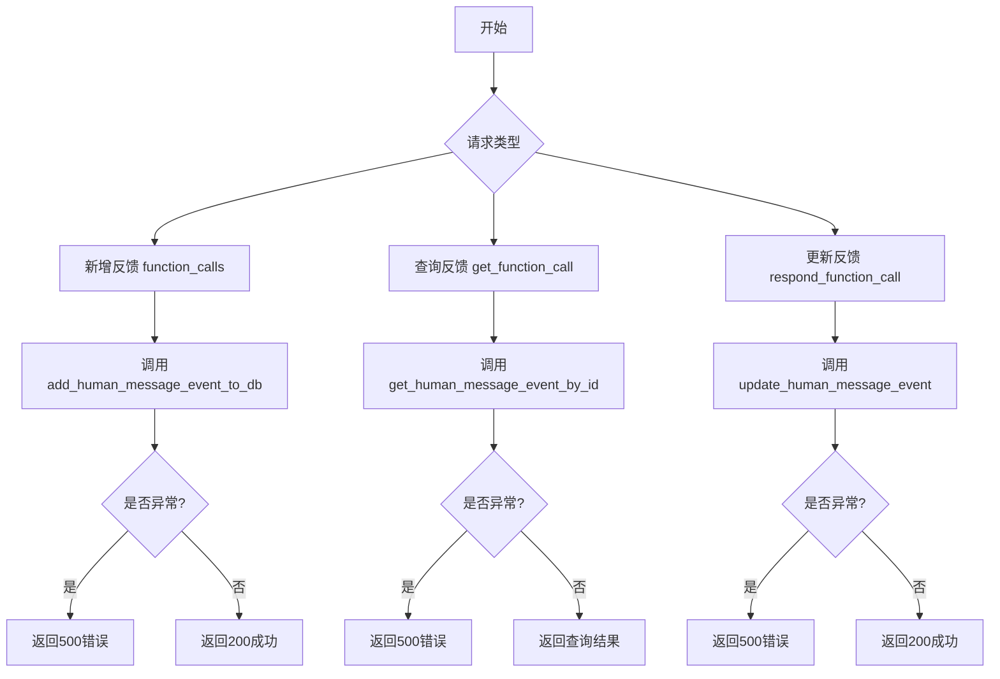
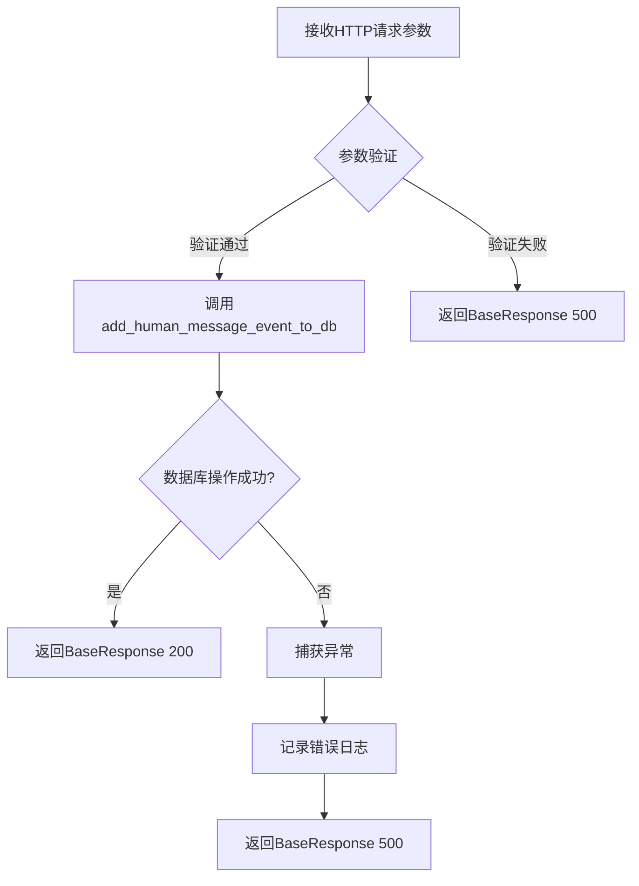
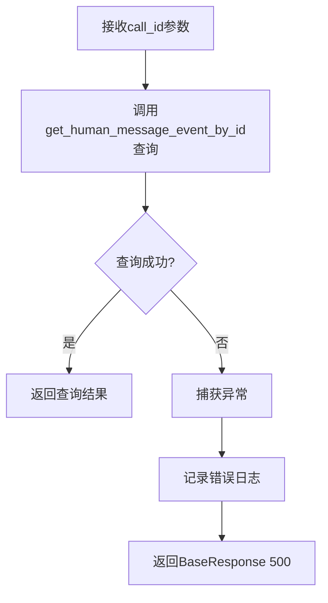
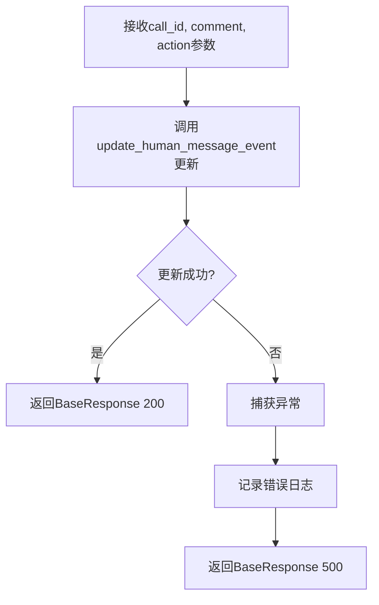
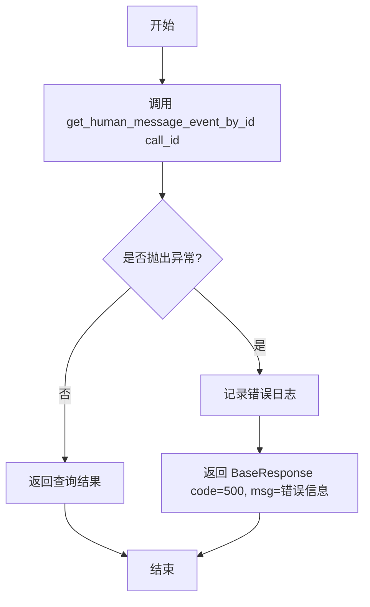
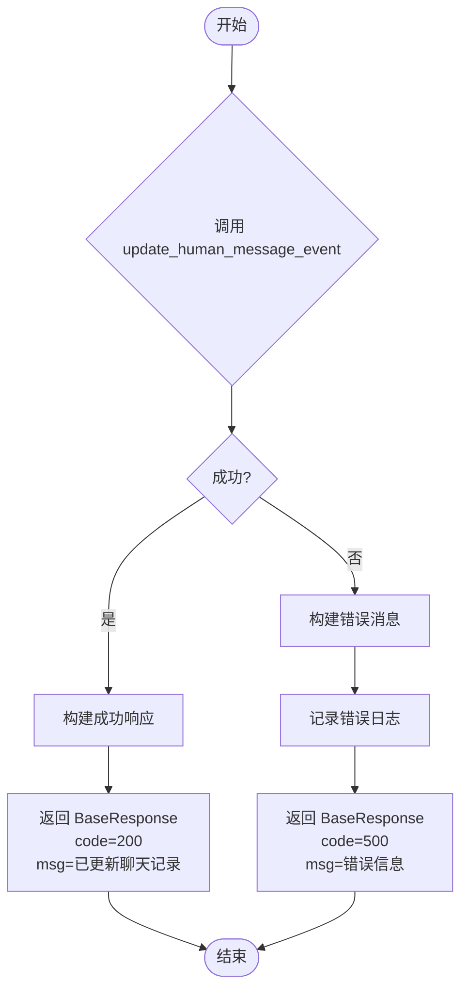

# `Langchain-Chatchat\libs\chatchat-server\chatchat\server\chat\human_message_event.py` 详细设计文档

这是一个FastAPI后端接口模块，提供人类反馈消息事件的增删改查功能，包括新增反馈、查询反馈和更新反馈操作，通过调用数据库仓储层完成持久化操作并返回标准响应结果。

## 整体流程



## 类结构

```
无类定义（纯函数模块）
第三方依赖类：
└── BaseResponse (chatchat.server.utils)
```

## 全局变量及字段


### `logger`
    
用于记录日志的日志对象

类型：`Logger`
    


### `BaseResponse.code`
    
响应状态码

类型：`int`
    


### `BaseResponse.msg`
    
响应消息

类型：`str`
    


### `BaseResponse.data`
    
响应数据

类型：`Any`
    
    

## 全局函数及方法


# 详细设计文档

## 一段话描述

该代码模块实现了人类反馈消息事件（Human Feedback Message Event）的管理功能，包括新增、查询和更新反馈事件，支持对话系统中的用户评价和行为追踪。

## 文件的整体运行流程

该模块作为FastAPI后端服务的人类反馈消息事件管理模块，主要流程如下：
1. **新增事件** (`function_calls`): 接收用户反馈数据，调用数据库Repository层添加记录
2. **查询事件** (`get_function_call`): 根据call_id查询单条反馈事件记录
3. **更新事件** (`respond_function_call`): 更新已有反馈事件的评价和行为数据
4. 所有操作均包含异常处理和统一返回格式（BaseResponse）

---

## 类的详细信息

### 模块级全局变量和全局函数

| 名称 | 类型 | 描述 |
|------|------|------|
| `logger` | `logging.Logger` | 日志记录器，用于记录错误和调试信息 |
| `get_human_message_event_by_id` | `function` | 数据库Repository层函数，根据ID查询人类消息事件 |
| `update_human_message_event` | `function` | 数据库Repository层函数，更新人类消息事件 |
| `add_human_message_event_to_db` | `function` | 数据库Repository层函数，添加人类消息事件到数据库 |
| `list_human_message_event` | `function` | 数据库Repository层函数，列出人类消息事件（未使用） |
| `BaseResponse` | `class` | 统一响应格式类 |

---

### function_calls

新增人类反馈消息事件

参数：

- `call_id`：`str`，调用ID，用于标识具体的函数调用记录
- `conversation_id`：`str`，对话框ID，关联到具体对话会话
- `function_name`：`str`，Function Name，被调用的函数名称
- `kwargs`：`str`，parameters，函数调用时传入的参数（JSON字符串形式）
- `comment`：`str`，用户评价，用户对函数调用结果的评价
- `action`：`str`，用户行为，用户采取的后续行为

返回值：`BaseResponse`，包含操作状态码、消息和返回数据

#### 流程图



#### 带注释源码

```python
def function_calls(
    call_id: str = Body("", description="call_id"),           # 调用ID
    conversation_id: str = Body("", description="对话ID"),    # 对话框ID
    function_name: str = Body("", description="Function Name"), # 函数名称
    kwargs: str = Body("", description="parameters"),          # 函数参数
    comment: str = Body("", description="用户评价"),           # 用户评价
    action: str = Body("", description="用户行为")             # 用户行为
):
    """
    新增人类反馈消息事件
    """
    try:
        # 尝试将人类反馈消息事件添加到数据库
        add_human_message_event_to_db(call_id, conversation_id, function_name, kwargs, comment, action)
    except Exception as e:
        # 捕获异常并记录错误日志
        msg = f"新增人类反馈消息事件出错： {e}"
        logger.error(f"{e.__class__.__name__}: {msg}")
        # 返回错误响应
        return BaseResponse(code=500, msg=msg)
    # 返回成功响应，包含call_id
    return BaseResponse(code=200, msg=f"已反馈聊天记录 {call_id}", data={"call_id": call_id})
```

---

### get_function_call

查询人类反馈消息事件

参数：

- `call_id`：`str`，调用ID，用于查询具体的人类反馈消息事件

返回值：`BaseResponse` 或 数据库实体对象，查询结果

#### 流程图



#### 带注释源码

```python
def get_function_call(call_id: str):
    """
    查询人类反馈消息事件
    """
    try:
        # 尝试根据call_id查询人类消息事件
        return get_human_message_event_by_id(call_id)
    except Exception as e:
        # 捕获异常并记录错误日志
        msg = f"查询人类反馈消息事件出错： {e}"
        logger.error(f"{e.__class__.__name__}: {msg}")
        # 返回错误响应
        return BaseResponse(code=500, msg=msg)
```

---

### respond_function_call

更新已有的人类反馈消息事件

参数：

- `call_id`：`str`，调用ID，用于标识需要更新的反馈事件
- `comment`：`str`，用户评价，更新后的用户评价内容
- `action`：`str`，用户行为，更新后的用户行为

返回值：`BaseResponse`，包含操作状态码和消息

#### 流程图



#### 带注释源码

```python
def respond_function_call(call_id: str, comment: str, action: str):
    """
    更新已有的人类反馈消息事件
    """
    try:
        # 尝试更新人类消息事件
        update_human_message_event(call_id, comment, action)
    except Exception as e:
        # 捕获异常并记录错误日志
        msg = f"更新已有的人类反馈消息事件出错： {e}"
        logger.error(f"{e.__class__.__name__}: {msg}")
        # 返回错误响应
        return BaseResponse(code=500, msg=msg)
    # 返回成功响应
    return BaseResponse(code=200, msg=f"已更新聊天记录 {call_id}")
```

---

## 关键组件信息

| 组件名称 | 描述 |
|---------|------|
| `BaseResponse` | 统一响应格式类，封装了code、msg、data字段，用于API统一返回格式 |
| `chatchat.server.db.repository` | 数据库Repository层，提供人类消息事件的CRUD操作 |
| `build_logger` | 日志构建工具，创建项目统一的日志记录器 |

---

## 潜在的技术债务或优化空间

1. **参数验证缺失**：未对输入参数进行有效性校验（如call_id不能为空、参数格式验证等）
2. **kwargs数据类型**：kwargs参数使用str类型存储参数，建议改为JSON字段或使用更合适的序列化方式
3. **错误处理粒度**：所有异常统一返回500错误码，缺乏细粒度的错误分类（如400参数错误、404记录不存在等）
4. **日志信息泄露**：错误日志中直接输出异常信息，可能泄露系统内部细节
5. **数据库Repository依赖**：直接依赖具体的Repository函数，缺乏抽象接口，不利于单元测试
6. **未使用的导入**：`list_human_message_event`函数被导入但未使用

---

## 其它项目

### 设计目标与约束

- **设计目标**：为对话系统提供人类反馈机制，允许用户对函数调用结果进行评价和行为追踪
- **技术约束**：基于FastAPI框架，使用Body参数接收POST请求数据
- **响应格式约束**：统一使用BaseResponse封装返回结果

### 错误处理与异常设计

- 采用try-except捕获所有异常
- 异常信息记录到日志系统
- 错误响应统一使用BaseResponse(code=500, msg=错误信息)
- 未区分不同类型的异常（如数据库连接异常、数据验证异常等）

### 数据流与状态机

- **新增流程**：HTTP请求 → 参数接收 → 数据库插入 → 返回响应
- **查询流程**：HTTP请求 → 参数接收 → 数据库查询 → 返回结果
- **更新流程**：HTTP请求 → 参数接收 → 数据库更新 → 返回响应
- 无状态机设计，每次请求独立处理

### 外部依赖与接口契约

- **数据库Repository层**：依赖`chatchat.server.db.repository`模块提供的数据库操作函数
- **日志模块**：依赖`chatchat.utils.build_logger`创建日志记录器
- **响应类**：依赖`chatchat.server.utils.BaseResponse`统一响应格式
- **FastAPI框架**：作为Web服务框架提供HTTP接口


### `get_function_call`

查询人类反馈消息事件，根据传入的 call_id 查询对应的反馈消息记录。

参数：

- `call_id`：`str`，调用ID，用于唯一标识需要查询的人类反馈消息事件

返回值：`Any`，成功时返回查询到的人类反馈消息事件对象，失败时返回 `BaseResponse` 对象（包含错误码500和错误信息）

#### 流程图



#### 带注释源码

```python
def get_function_call(call_id: str):
    """
    查询人类反馈消息事件
    
    Args:
        call_id: 调用ID，用于唯一标识需要查询的人类反馈消息事件
        
    Returns:
        成功时返回查询到的人类反馈消息事件对象
        失败时返回 BaseResponse 对象（包含错误码500和错误信息）
    """
    try:
        # 尝试根据 call_id 查询人类反馈消息事件
        return get_human_message_event_by_id(call_id)
    except Exception as e:
        # 捕获异常，构建错误信息并记录日志
        msg = f"查询人类反馈消息事件出错： {e}"
        logger.error(f"{e.__class__.__name__}: {msg}")
        # 返回错误响应
        return BaseResponse(code=500, msg=msg)
```


### `respond_function_call`

更新已有的人类反馈消息事件，通过传入的 call_id 查找对应的消息记录，并更新评论(comment)和行为(action)信息。

参数：

- `call_id`：`str`，呼叫ID，用于唯一标识需要更新的人类反馈消息事件
- `comment`：`str`，用户评价，更新的评论内容
- `action`：`str`，用户行为，更新的行为描述

返回值：`BaseResponse`，返回更新操作的结果，成功时包含状态码200和更新确认消息，失败时返回错误信息

#### 流程图



#### 带注释源码

```python
def respond_function_call(call_id: str, comment: str, action: str):
    """
    更新已有的人类反馈消息事件
    """
    try:
        # 尝试调用数据库更新函数，传入call_id、评论和行为
        update_human_message_event(call_id, comment, action)
    except Exception as e:
        # 捕获异常并构建错误消息
        msg = f"更新已有的人类反馈消息事件出错： {e}"
        # 记录错误日志，包含异常类型和错误消息
        logger.error(f"{e.__class__.__name__}: {msg}")
        # 返回错误响应，状态码500
        return BaseResponse(code=500, msg=msg)
    # 更新成功，返回成功响应，状态码200
    return BaseResponse(code=200, msg=f"已更新聊天记录 {call_id}")
```

## 关键组件


### 人类反馈消息事件管理模块

负责处理对话系统中人类用户的反馈消息事件，包括新增、查询和更新操作，提供RESTful接口与前端或下游系统交互。

### function_calls 函数

新增人类反馈消息事件到数据库，接收call_id、conversation_id、function_name、kwargs、comment和action参数，将用户反馈数据持久化。

### get_function_call 函数

根据call_id查询单条人类反馈消息事件，返回数据库中存储的对应记录，用于前端展示反馈详情。

### respond_function_call 函数

更新已有的人类反馈消息事件，通过call_id定位记录，更新comment（评价）和action（行为）字段。

### 数据库交互层

封装了add_human_message_event_to_db、get_human_message_event_by_id、update_human_message_event等Repository方法，隔离了SQL操作细节。

### BaseResponse 响应封装

统一的API响应格式，包含code、msg和data字段，便于前端统一处理成功和异常情况。

### 日志记录模块

通过build_logger构建的日志工具，记录操作成功信息和异常堆栈，便于问题排查和审计追踪。


## 问题及建议


### 已知问题

-   **返回值类型不一致**：`get_function_call`函数在成功时直接返回数据库查询结果（可能是字典或对象），而在失败时返回`BaseResponse`对象；`respond_function_call`成功时返回`BaseResponse`但没有`data`字段，而`function_calls`返回的`BaseResponse`包含`data`字段。这种不一致会导致调用方难以统一处理响应。
-   **错误日志存在乱码**：在`get_function_call`函数中，错误消息“��询人类反馈消息事件出错”包含乱码字符，应为“查询”，这表明编码处理存在问题。
-   **异常捕获过于宽泛**：所有函数都使用`except Exception as e`捕获所有异常，没有针对特定异常类型的处理，可能隐藏特定的错误信息。
-   **参数类型定义不合理**：`kwargs`参数定义为`str`类型（字符串），但从参数名称看应该是键值对字典类型，这会导致调用方需要手动序列化和反序列化。
-   **缺乏输入验证**：没有对必填参数（如`call_id`、`conversation_id`）进行非空校验，可能导致数据库操作失败。
-   **数据库操作缺乏事务管理**：新增、查询、更新操作没有明确的事务边界，在并发场景下可能导致数据不一致。
-   **函数命名不清晰**：`function_calls`和`respond_function_call`的命名与实际功能（人类反馈消息事件管理）不匹配，容易造成误解。

### 优化建议

-   **统一返回值类型**：所有函数应返回统一的`BaseResponse`对象，或至少保证成功和失败时返回类型一致；建议为`get_function_call`在成功时也包装为`BaseResponse`。
-   **修复日志乱码**：检查并修正“��询”为“查询”，确保日志编码正确。
-   **细化异常处理**：根据可能的异常类型（如数据库连接异常、数据不存在异常等）进行分类处理，提供更有针对性的错误信息。
-   **修正参数类型**：将`kwargs`参数类型从`str`改为`dict`，或使用Pydantic模型进行更严格的类型定义和验证。
-   **添加输入验证**：使用FastAPI的Pydantic模型或参数验证装饰器，确保必填参数不为空或符合预期格式。
-   **引入事务管理**：对于需要原子性操作的功能（如先查询再更新），应使用数据库事务确保数据一致性。
-   **重构函数命名**：将`function_calls`重命名为`add_human_message_event`，`get_function_call`重命名为`get_human_message_event`，`respond_function_call`重命名为`update_human_message_event`，使命名更直观反映功能。

## 其它


### 设计目标与约束

本模块旨在为聊天系统提供人类反馈消息事件的增删改查功能，支持对对话过程中的用户评价和行为进行记录和管理。设计约束包括：仅处理字符串类型的参数，需要依赖底层的数据库repository层进行持久化操作，遵循FastAPI的Body参数规范。

### 错误处理与异常设计

代码采用try-except块捕获所有Exception类型，统一返回code=500的BaseResponse错误响应。错误信息包含异常类型名称和详细描述，通过logger记录错误日志。存在问题是捕获过于宽泛，建议区分不同异常类型（如数据库连接异常、数据验证异常等）进行针对性处理。

### 数据流与状态机

新增流程：接收call_id、conversation_id、function_name、kwargs、comment、action参数 → 验证参数 → 调用add_human_message_event_to_db写入数据库 → 返回成功响应。查询流程：接收call_id → 调用get_human_message_event_by_id查询 → 返回结果或错误。更新流程：接收call_id、comment、action → 调用update_human_message_event更新 → 返回成功响应。

### 外部依赖与接口契约

依赖chatchat.utils.build_logger模块进行日志记录；依赖chatchat.server.db.repository中的get_human_message_event_by_id、update_human_message_event、add_human_message_event_to_db、list_human_message_event四个数据库操作函数；依赖chatchat.server.utils.BaseResponse返回统一格式的响应对象。

### 安全性考虑

当前代码未对输入参数进行长度限制和特殊字符过滤，存在SQL注入风险（取决于底层repository实现）。建议在参数传入前进行长度校验和XSS过滤，对于kwargs参数建议使用JSON解析验证其格式合法性。

### 性能考量

函数内部为同步调用，未使用异步处理。在高并发场景下数据库操作可能成为瓶颈，建议后续引入连接池和异步数据库操作。kwargs参数存储为字符串类型，若数据量较大应考虑JSON字段存储。

### 测试策略

建议编写单元测试覆盖：正常新增消息事件、查询存在的记录、更新已存在的记录、异常情况下的错误返回。Mock数据库repository层进行隔离测试，验证参数传递的正确性和错误处理的完整性。

### 配置与扩展性

当前函数使用FastAPI的Body参数，适合HTTP POST请求场景。若需支持GET请求或命令行调用，可添加查询参数版本。kwargs参数建议明确JSON格式规范，便于后续扩展更多参数类型。

### 日志与监控

使用build_logger()创建模块级logger，记录异常时的类名和错误信息。建议增加操作成功时的info级别日志，便于追踪系统运行状态和进行问题排查。可集成APM工具监控接口调用频率和响应时间。

### 并发与线程安全

数据库操作依赖底层repository的连接管理，若使用同步数据库驱动需关注连接池配置。当前代码无状态变量，不存在内存层面的线程安全问题。


    