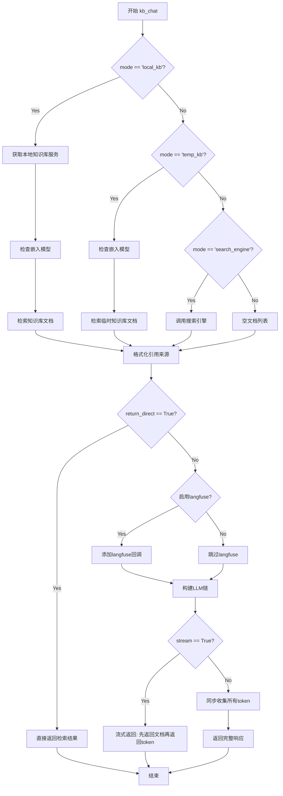
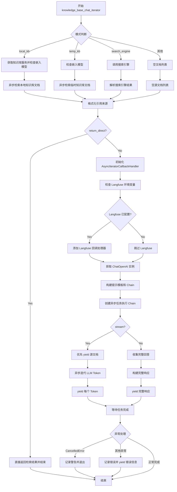

# `Langchain-Chatchat\libs\chatchat-server\chatchat\server\chat\kb_chat.py` 详细设计文档

这是一个基于FastAPI的知识库问答接口，支持三种模式（本地知识库、临时知识库、搜索引擎）进行检索增强生成（RAG），通过流式或非流式方式返回LLM生成的答案，支持langfuse可观测性集成。

## 整体流程

```mermaid
graph TD
A[开始 kb_chat] --> B{mode == 'local_kb'?}
B -- 是 --> C[获取KBService]
B -- 否 --> D{mode == 'temp_kb'?}
D -- 是 --> E[检查embed_model]
D -- 否 --> F{mode == 'search_engine?}
F -- 是 --> G[调用search_engine]
F -- 否 --> H[docs=[], source_documents=[]]
C --> I[检查embed_model]
I --> J[search_docs]
E --> K[search_temp_docs]
G --> L[格式化docs]
J --> M[format_reference]
K --> M
L --> M
M --> N{return_direct?}
N -- 是 --> O[直接返回source_documents]
N -- 否 --> P[创建AsyncIteratorCallbackHandler]
P --> Q{有langfuse配置?}
Q -- 是 --> R[添加langfuse_handler]
Q -- 否 --> S[get_ChatOpenAI]
R --> S
S --> T[构建prompt_template]
T --> U[创建chain并ainvoke]
U --> V{stream模式?}
V -- 是 --> W[先yield docs, 再流式yield token]
V -- 否 --> X[收集全部token后返回]
W --> Y[结束]
X --> Y
O --> Y
```

## 类结构

```
FastAPI Endpoint
└── kb_chat (主入口函数)
    └── knowledge_base_chat_iterator (异步生成器)
```

## 全局变量及字段


### `query`
    
用户输入的查询字符串

类型：`str`
    


### `mode`
    
知识来源模式：local_kb本地知识库、temp_kb临时知识库、search_engine搜索引擎

类型：`Literal["local_kb", "temp_kb", "search_engine"]`
    


### `kb_name`
    
知识库名称或临时知识库ID或搜索引擎名称

类型：`str`
    


### `top_k`
    
匹配向量数，控制返回的相关文档数量

类型：`int`
    


### `score_threshold`
    
知识库匹配相关度阈值，取值范围0-2，越小相关度越高

类型：`float`
    


### `history`
    
历史对话记录列表

类型：`List[History]`
    


### `stream`
    
是否启用流式输出标志

类型：`bool`
    


### `model`
    
LLM模型名称

类型：`str`
    


### `temperature`
    
LLM采样温度，控制生成随机性

类型：`float`
    


### `max_tokens`
    
限制LLM生成Token数量

类型：`Optional[int]`
    


### `prompt_name`
    
使用的prompt模板名称

类型：`str`
    


### `return_direct`
    
是否直接返回检索结果而不送入LLM

类型：`bool`
    


### `request`
    
FastAPI请求对象

类型：`Request`
    


### `kb`
    
知识库服务实例

类型：`KBService`
    


### `ok`
    
操作是否成功的标志

类型：`bool`
    


### `msg`
    
操作结果的消息或错误信息

类型：`str`
    


### `docs`
    
检索到的文档列表

类型：`List[dict]`
    


### `source_documents`
    
格式化后的引用文档列表

类型：`List[str]`
    


### `result`
    
搜索引擎返回的结果字典

类型：`dict`
    


### `callback`
    
异步迭代回调处理器，用于流式输出

类型：`AsyncIteratorCallbackHandler`
    


### `callbacks`
    
回调处理器列表

类型：`list`
    


### `langfuse_secret_key`
    
Langfuse秘钥环境变量

类型：`str`
    


### `langfuse_public_key`
    
Langfuse公钥环境变量

类型：`str`
    


### `langfuse_host`
    
Langfuse主机地址环境变量

类型：`str`
    


### `langfuse_handler`
    
Langfuse回调处理器

类型：`CallbackHandler`
    


### `llm`
    
ChatOpenAI大语言模型实例

类型：`ChatOpenAI`
    


### `context`
    
检索到的文档内容拼接的上下文字符串

类型：`str`
    


### `prompt_template`
    
prompt模板字符串

类型：`str`
    


### `input_msg`
    
用户输入消息History对象

类型：`History`
    


### `chat_prompt`
    
ChatPromptTemplate聊天提示模板

类型：`ChatPromptTemplate`
    


### `chain`
    
LangChain可运行序列

类型：`RunnableSequence`
    


### `task`
    
异步任务对象

类型：`asyncio.Task`
    


### `ret`
    
OpenAI聊天输出对象

类型：`OpenAIChatOutput`
    


### `token`
    
LLM生成的单个token

类型：`str`
    


### `answer`
    
LLM生成的全部回答

类型：`str`
    


### `logger`
    
项目日志记录器

类型：`logging.Logger`
    


    

## 全局函数及方法


### `kb_chat`

该函数是知识库聊天功能的核心入口，支持三种知识来源模式（本地知识库、临时知识库、搜索引擎），通过检索增强生成（RAG）技术，结合大语言模型为用户提供智能问答服务。函数根据`stream`参数决定返回流式响应（Server-Sent Events）或同步响应。

参数：

- `query`：`str`，用户输入的查询内容
- `mode`：`Literal["local_kb", "temp_kb", "search_engine"]`，知识来源模式，默认为"local_kb"
- `kb_name`：`str`，知识库名称（mode=local_kb时为知识库名称；mode=temp_kb时为临时知识库ID，mode=search_engine时为搜索引擎名称）
- `top_k`：`int`，匹配向量数，默认从Settings获取
- `score_threshold`：`float`，知识库匹配相关度阈值，取值范围0-2，建议0.5左右
- `history`：`List[History]`，历史对话记录
- `stream`：`bool`，是否启用流式输出，默认为True
- `model`：`str`，LLM模型名称，默认获取系统默认模型
- `temperature`：`float`，LLM采样温度，取值范围0.0-2.0
- `max_tokens`：`Optional[int]`，限制LLM生成Token数量，None代表模型最大值
- `prompt_name`：`str`，使用的prompt模板名称，默认为"default"
- `return_direct`：`bool`，是否直接返回检索结果不送入LLM，默认为False
- `request`：`Request`，FastAPI请求对象

返回值：`Union[EventSourceResponse, BaseResponse]`，流式模式下返回EventSourceResponse，同步模式下返回BaseResponse

#### 流程图



#### 带注释源码

```python
async def kb_chat(
    query: str = Body(..., description="用户输入", examples=["你好"]),
    mode: Literal["local_kb", "temp_kb", "search_engine"] = Body(
        "local_kb", description="知识来源"
    ),
    kb_name: str = Body(
        "", 
        description="mode=local_kb时为知识库名称；temp_kb时为临时知识库ID，search_engine时为搜索引擎名称", 
        examples=["samples"]
    ),
    top_k: int = Body(
        Settings.kb_settings.VECTOR_SEARCH_TOP_K, 
        description="匹配向量数"
    ),
    score_threshold: float = Body(
        Settings.kb_settings.SCORE_THRESHOLD,
        description="知识库匹配相关度阈值，取值范围在0-1之间，SCORE越小，相关度越高，取到1相当于不筛选，建议设置在0.5左右",
        ge=0,
        le=2,
    ),
    history: List[History] = Body(
        [],
        description="历史对话",
        examples=[[
            {"role": "user", "content": "我们来玩成语接龙，我先来，生龙活虎"},
            {"role": "assistant", "content": "虎头虎脑"}]]
    ),
    stream: bool = Body(True, description="流式输出"),
    model: str = Body(get_default_llm(), description="LLM 模型名称。"),
    temperature: float = Body(
        Settings.model_settings.TEMPERATURE, 
        description="LLM 采样温度", 
        ge=0.0, 
        le=2.0
    ),
    max_tokens: Optional[int] = Body(
        Settings.model_settings.MAX_TOKENS,
        description="限制LLM生成Token数量，默认None代表模型最大值"
    ),
    prompt_name: str = Body(
        "default",
        description="使用的prompt模板名称(在prompt_settings.yaml中配置)"
    ),
    return_direct: bool = Body(False, description="直接返回检索结果，不送入 LLM"),
    request: Request = None,
):
    # 初始化阶段：处理local_kb模式的知识库验证
    if mode == "local_kb":
        kb = KBServiceFactory.get_service_by_name(kb_name)
        if kb is None:
            return BaseResponse(code=404, msg=f"未找到知识库 {kb_name}")
    
    # 定义异步生成器：处理知识库聊天的核心逻辑
    async def knowledge_base_chat_iterator() -> AsyncIterable[str]:
        try:
            # 将历史消息转换为History对象
            nonlocal history, prompt_name, max_tokens
            history = [History.from_data(h) for h in history]

            # 分支处理：local_kb模式
            if mode == "local_kb":
                kb = KBServiceFactory.get_service_by_name(kb_name)
                ok, msg = kb.check_embed_model()
                if not ok:
                    raise ValueError(msg)
                # 通过线程池执行同步知识检索
                docs = await run_in_threadpool(
                    search_docs,
                    query=query,
                    knowledge_base_name=kb_name,
                    top_k=top_k,
                    score_threshold=score_threshold,
                    file_name="",
                    metadata={}
                )
                source_documents = format_reference(kb_name, docs, api_address(is_public=True))
            
            # 分支处理：temp_kb临时知识库模式
            elif mode == "temp_kb":
                ok, msg = check_embed_model()
                if not ok:
                    raise ValueError(msg)
                docs = await run_in_threadpool(
                    search_temp_docs,
                    kb_name,
                    query=query,
                    top_k=top_k,
                    score_threshold=score_threshold
                )
                source_documents = format_reference(kb_name, docs, api_address(is_public=True))
            
            # 分支处理：search_engine搜索引擎模式
            elif mode == "search_engine":
                result = await run_in_threadpool(search_engine, query, top_k, kb_name)
                docs = [x.dict() for x in result.get("docs", [])]
                # 构建带出处信息的文档列表
                source_documents = [
                    f"""出处 [{i + 1}] [{d['metadata']['filename']}]({d['metadata']['source']}) \n\n{d['page_content']}\n\n""" 
                    for i, d in enumerate(docs)
                ]
            else:
                docs = []
                source_documents = []

            # 直接返回模式：跳过LLM生成
            if return_direct:
                yield OpenAIChatOutput(
                    id=f"chat{uuid.uuid4()}",
                    model=None,
                    object="chat.completion",
                    content="",
                    role="assistant",
                    finish_reason="stop",
                    docs=source_documents,
                ).model_dump_json()
                return

            # 初始化异步迭代回调处理器
            callback = AsyncIteratorCallbackHandler()
            callbacks = [callback]

            # Langfuse集成：可选的LLM观测平台
            import os
            langfuse_secret_key = os.environ.get('LANGFUSE_SECRET_KEY')
            langfuse_public_key = os.environ.get('LANGFUSE_PUBLIC_KEY')
            langfuse_host = os.environ.get('LANGFUSE_HOST')
            if langfuse_secret_key and langfuse_public_key and langfuse_host:
                from langfuse import Langfuse
                from langfuse.callback import CallbackHandler
                langfuse_handler = CallbackHandler()
                callbacks.append(langfuse_handler)

            # 处理max_tokens默认值
            if max_tokens in [None, 0]:
                max_tokens = Settings.model_settings.MAX_TOKENS

            # 创建ChatOpenAI实例
            llm = get_ChatOpenAI(
                model_name=model,
                temperature=temperature,
                max_tokens=max_tokens,
                callbacks=callbacks,
            )

            # TODO: 预留的reranker逻辑（目前被注释）
            # 可选：使用reranker对检索结果重排序

            # 构建上下文：将检索到的文档内容拼接
            context = "\n\n".join([doc["page_content"] for doc in docs])

            # 无检索结果时使用empty模板
            if len(docs) == 0:
                prompt_name = "empty"
            
            # 获取并构建prompt模板
            prompt_template = get_prompt_template("rag", prompt_name)
            input_msg = History(role="user", content=prompt_template).to_msg_template(False)
            chat_prompt = ChatPromptTemplate.from_messages(
                [i.to_msg_template() for i in history] + [input_msg]
            )

            # 构建LCEL链：prompt -> llm
            chain = chat_prompt | llm

            # 异步任务：在后台运行LLM链
            task = asyncio.create_task(wrap_done(
                chain.ainvoke({"context": context, "question": query}),
                callback.done),
            )

            # 无检索结果时添加警告提示
            if len(source_documents) == 0:
                source_documents.append(
                    f"<span style='color:red'>未找到相关文档,该回答为大模型自身能力解答！</span>"
                )

            # 流式响应处理
            if stream:
                # 首先返回包含文档的元数据
                ret = OpenAIChatOutput(
                    id=f"chat{uuid.uuid4()}",
                    object="chat.completion.chunk",
                    content="",
                    role="assistant",
                    model=model,
                    docs=source_documents,
                )
                yield ret.model_dump_json()

                # 迭代推送LLM生成的token
                async for token in callback.aiter():
                    ret = OpenAIChatOutput(
                        id=f"chat{uuid.uuid4()}",
                        object="chat.completion.chunk",
                        content=token,
                        role="assistant",
                        model=model,
                    )
                    yield ret.model_dump_json()
            else:
                # 同步模式：收集所有token后一次性返回
                answer = ""
                async for token in callback.aiter():
                    answer += token
                ret = OpenAIChatOutput(
                    id=f"chat{uuid.uuid4()}",
                    object="chat.completion",
                    content=answer,
                    role="assistant",
                    model=model,
                )
                yield ret.model_dump_json()
            
            # 等待后台任务完成
            await task
        
        # 异常处理：用户中断流式响应
        except asyncio.exceptions.CancelledError:
            logger.warning("streaming progress has been interrupted by user.")
            return
        # 异常处理：其他错误
        except Exception as e:
            logger.error(f"error in knowledge chat: {e}")
            yield {"data": json.dumps({"error": str(e)})}
            return

    # 根据stream参数选择返回方式
    if stream:
        return EventSourceResponse(knowledge_base_chat_iterator())
    else:
        return await knowledge_base_chat_iterator().__anext__()
```


### `kb_chat.knowledge_base_chat_iterator`

这是一个异步生成器函数，封装在 `kb_chat` 路由处理函数内部。它负责根据指定的模式（本地知识库、临时知识库或搜索引擎）执行知识检索，并通过流式或非流式方式将检索结果与 LLM 生成的回答一并返回给客户端。该函数整合了知识检索、提示模板构建、LLM 调用和回调处理等核心逻辑，是知识库聊天功能的核心执行单元。

**注意**：此函数定义在 `kb_chat` 函数内部，作为闭包函数使用，因此它直接访问 `kb_chat` 的参数（`query`, `mode`, `kb_name`, `top_k`, `score_threshold`, `history`, `stream`, `model`, `temperature`, `max_tokens`, `prompt_name`, `return_direct`, `request`）作为其输入参数。

#### 参数

由于此函数是闭包函数，其参数来自外部 `kb_chat` 函数的上下文：

- `query`：`str`，用户输入的查询内容
- `mode`：`Literal["local_kb", "temp_kb", "search_engine"]`，知识来源模式
- `kb_name`：`str`，知识库名称或搜索引擎标识
- `top_k`：`int`，向量检索返回的 Top K 结果数
- `score_threshold`：`float`，知识库匹配相关度阈值
- `history`：`List[History]`，历史对话记录
- `stream`：`bool`，是否启用流式输出
- `model`：`str`，LLM 模型名称
- `temperature`：`float`，LLM 采样温度
- `max_tokens`：`Optional[int]`，限制 LLM 生成 Token 数量
- `prompt_name`：`str`，使用的 prompt 模板名称
- `return_direct`：`bool`，是否直接返回检索结果而不送入 LLM

#### 返回值

- `AsyncIterable[str]`：异步可迭代对象，逐 yield 返回 JSON 序列化的 `OpenAIChatOutput` 字符串数据

#### 流程图



#### 带注释源码

```python
async def knowledge_base_chat_iterator() -> AsyncIterable[str]:
    """
    异步生成器函数，用于执行知识库聊天的核心逻辑。
    根据 mode 参数选择不同的知识检索方式，并支持流式/非流式输出。
    """
    try:
        # 使用 nonlocal 关键字修改闭包外的变量
        nonlocal history, prompt_name, max_tokens

        # 将历史记录转换为 History 对象列表
        history = [History.from_data(h) for h in history]

        # ==================== 知识检索阶段 ====================
        if mode == "local_kb":
            # 模式1：本地知识库检索
            kb = KBServiceFactory.get_service_by_name(kb_name)
            ok, msg = kb.check_embed_model()
            if not ok:
                raise ValueError(msg)
            # 使用线程池执行同步搜索函数
            docs = await run_in_threadpool(search_docs,
                                            query=query,
                                            knowledge_base_name=kb_name,
                                            top_k=top_k,
                                            score_threshold=score_threshold,
                                            file_name="",
                                            metadata={})
            # 格式化检索到的文档为引用来源
            source_documents = format_reference(kb_name, docs, api_address(is_public=True))
            
        elif mode == "temp_kb":
            # 模式2：临时知识库检索
            ok, msg = check_embed_model()
            if not ok:
                raise ValueError(msg)
            docs = await run_in_threadpool(search_temp_docs,
                                            kb_name,
                                            query=query,
                                            top_k=top_k,
                                            score_threshold=score_threshold)
            source_documents = format_reference(kb_name, docs, api_address(is_public=True))
            
        elif mode == "search_engine":
            # 模式3：搜索引擎检索
            result = await run_in_threadpool(search_engine, query, top_k, kb_name)
            docs = [x.dict() for x in result.get("docs", [])]
            # 手动构建带链接的源文档格式
            source_documents = [f"""出处 [{i + 1}] [{d['metadata']['filename']}]({d['metadata']['source']}) \n\n{d['page_content']}\n\n""" 
                               for i,d in enumerate(docs)]
        else:
            # 其他模式：空文档
            docs = []
            source_documents = []

        # ==================== 直接返回模式 ====================
        if return_direct:
            # 不调用 LLM，直接返回检索结果
            yield OpenAIChatOutput(
                id=f"chat{uuid.uuid4()}",
                model=None,
                object="chat.completion",
                content="",
                role="assistant",
                finish_reason="stop",
                docs=source_documents,
            ).model_dump_json()
            return

        # ==================== LLM 调用准备阶段 ====================
        # 创建异步迭代回调处理器，用于捕获 LLM 生成的每个 token
        callback = AsyncIteratorCallbackHandler()
        callbacks = [callback]

        # 检查 Langfuse 可观测性工具的环境变量配置
        import os
        langfuse_secret_key = os.environ.get('LANGFUSE_SECRET_KEY')
        langfuse_public_key = os.environ.get('LANGFUSE_PUBLIC_KEY')
        langfuse_host = os.environ.get('LANGFUSE_HOST')
        # 如果配置完整，则添加 Langfuse 回调处理器以支持追踪
        if langfuse_secret_key and langfuse_public_key and langfuse_host:
            from langfuse import Langfuse
            from langfuse.callback import CallbackHandler
            langfuse_handler = CallbackHandler()
            callbacks.append(langfuse_handler)

        # 处理 max_tokens 参数边界情况
        if max_tokens in [None, 0]:
            max_tokens = Settings.model_settings.MAX_TOKENS

        # 初始化 ChatOpenAI 实例
        llm = get_ChatOpenAI(
            model_name=model,
            temperature=temperature,
            max_tokens=max_tokens,
            callbacks=callbacks,
        )

        # ==================== Reranker 逻辑（TODO 待启用）====================
        # 以下为加入 Reranker 模型的预留代码，可提升检索精度
        # if Settings.kb_settings.USE_RERANKER:
        #     reranker_model_path = get_model_path(Settings.kb_settings.RERANKER_MODEL)
        #     reranker_model = LangchainReranker(...)
        #     docs = reranker_model.compress_documents(...)

        # 构建上下文：将检索到的文档内容拼接为上下文字符串
        context = "\n\n".join([doc["page_content"] for doc in docs])

        # 如果没有检索到相关文档，切换为空模板
        if len(docs) == 0:
            prompt_name = "empty"
        
        # 获取 RAG 提示模板
        prompt_template = get_prompt_template("rag", prompt_name)
        input_msg = History(role="user", content=prompt_template).to_msg_template(False)
        # 构建聊天提示模板，包含历史消息和当前输入
        chat_prompt = ChatPromptTemplate.from_messages(
            [i.to_msg_template() for i in history] + [input_msg])

        # 构建 LangChain Chain：提示模板 -> LLM
        chain = chat_prompt | llm

        # 创建后台异步任务执行 Chain，关联回调
        task = asyncio.create_task(wrap_done(
            chain.ainvoke({"context": context, "question": query}),
            callback.done),
        )

        # 如果没有找到相关文档，添加警告信息
        if len(source_documents) == 0:
            source_documents.append(f"<span style='color:red'>未找到相关文档,该回答为大模型自身能力解答！</span>")

        # ==================== 流式/非流式输出阶段 ====================
        if stream:
            # 流式输出模式
            # 首先返回包含源文档的头信息
            ret = OpenAIChatOutput(
                id=f"chat{uuid.uuid4()}",
                object="chat.completion.chunk",
                content="",
                role="assistant",
                model=model,
                docs=source_documents,
            )
            yield ret.model_dump_json()

            # 异步迭代每个生成的 token 并 yield
            async for token in callback.aiter():
                ret = OpenAIChatOutput(
                    id=f"chat{uuid.uuid4()}",
                    object="chat.completion.chunk",
                    content=token,
                    role="assistant",
                    model=model,
                )
                yield ret.model_dump_json()
        else:
            # 非流式输出模式：收集所有 token 后一次性返回
            answer = ""
            async for token in callback.aiter():
                answer += token
            ret = OpenAIChatOutput(
                id=f"chat{uuid.uuid4()}",
                object="chat.completion",
                content=answer,
                role="assistant",
                model=model,
            )
            yield ret.model_dump_json()
        
        # 等待后台任务完成
        await task
        
    except asyncio.exceptions.CancelledError:
        # 用户中断流式输出时的处理
        logger.warning("streaming progress has been interrupted by user.")
        return
    except Exception as e:
        # 捕获其他异常并返回错误信息
        logger.error(f"error in knowledge chat: {e}")
        yield {"data": json.dumps({"error": str(e)})}
        return
```

## 关键组件


### kb_chat 函数

FastAPI API端点函数，处理知识库问答请求，支持local_kb/temp_kb/search_engine三种模式，集成LangChain实现RAG问答流程。

### knowledge_base_chat_iterator 异步生成器

核心业务逻辑异步生成器，负责执行知识检索、LLM调用和流式输出，包含模式分支处理、文档格式化、提示词构建和响应生成。

### KBServiceFactory.get_service_by_name

知识库服务工厂方法，根据名称获取对应的知识库服务实例，用于local_kb模式的文档检索。

### search_docs / search_temp_docs

文档搜索函数，通过知识库服务执行向量相似度检索，返回相关文档列表及元信息。

### search_engine

搜索引擎集成函数，调用外部搜索引擎API获取互联网搜索结果。

### get_ChatOpenAI

LLM工厂函数，创建并配置ChatOpenAI实例，支持自定义模型、温度、最大token数和回调处理器。

### AsyncIteratorCallbackHandler

LangChain异步迭代回调处理器，捕获LLM生成的token用于流式响应输出。

### langfuse 集成组件

可选的LLM监控组件，包含Langfuse客户端和CallbackHandler，用于追踪和记录LLM调用日志。

### format_reference

引用格式化函数，将检索到的文档转换为带链接的Markdown格式参考文献。

### get_prompt_template

提示模板获取函数，从配置文件中加载指定的RAG提示模板。

### ChatPromptTemplate

LangChain提示模板组件，整合历史对话和当前输入构建完整的LLM输入上下文。

### OpenAIChatOutput 数据模型

响应输出数据结构，封装chat completion响应格式，包含id、content、docs等字段。

### BaseResponse 数据模型

通用响应包装类，用于返回错误状态码和错误信息。

### History 数据模型

对话历史数据类，提供从字典构建和转换为消息模板的方法。

### 配置参数组件

包含top_k（向量检索数）、score_threshold（相关度阈值）、temperature（采样温度）、max_tokens（最大令牌数）等可配置参数，通过Settings和Body默认值获取。


## 问题及建议


### 已知问题

-   **代码重复**：在函数开头和`knowledge_base_chat_iterator`内部都调用了`KBServiceFactory.get_service_by_name(kb_name)`和`kb.check_embed_model()`，local_kb和temp_kb分支中都有重复的`check_embed_model()`调用和`format_reference()`逻辑
-   **返回值不一致**：`return_direct`分支直接`yield`的是JSON字符串（通过`.model_dump_json()`返回的字符串），而其他分支通过`EventSourceResponse`返回序列化后的JSON字符串，两者处理方式不统一
-   **错误响应格式不规范**：异常处理中使用`yield {"data": json.dumps({"error": str(e)})}`，缺少正确的SSE事件格式（应指定`event`字段）
-   **硬编码HTML**：在source_documents中直接硬编码HTML标签`<span style='color:red'>...</span>`，不符合前后端分离原则
-   **未使用的导入**：`Literal`导入后用于类型提示但实际未完全利用
-   **资源清理风险**：`asyncio.create_task`创建的task在异常情况下可能未正确等待完成就退出
-   **重复导入模块**：`langfuse`相关导入在函数内部进行，每次请求都会执行导入操作
-   **日志记录不足**：缺少关键路径的日志记录，如`return_direct`分支的执行、reranker未启用的提示等
-   **TODO代码未清理**：注释掉的reranker代码块长期存在，应决定保留或移除

### 优化建议

-   **提取公共逻辑**：将`check_embed_model()`调用和`format_reference()`逻辑提取到函数外部或公共方法中，避免重复代码
-   **统一返回值格式**：确保所有分支返回格式一致的响应对象，或使用统一的序列化方法
-   **规范化错误响应**：使用`yield {"event": "error", "data": ...}`格式返回SSE错误事件
-   **移除硬编码HTML**：将前端展示逻辑移至前端，后端只返回纯文本或结构化数据
-   **移动导入到顶部**：将`langfuse`相关导入移至文件顶部，减少运行时开销
-   **完善日志记录**：在关键路径添加logger.info/debug记录，便于排查问题
-   **清理TODO代码**：决定是否启用reranker功能，若不使用则完全移除相关注释代码
-   **优化异常处理**：为`asyncio.create_task`添加`try-except`或使用`asyncio.shield`保护关键任务

## 其它


### 设计目标与约束

该模块旨在实现一个基于知识库的智能问答系统，支持从本地知识库、临时知识库和搜索引擎三种渠道检索内容，并结合LLM生成回答。设计约束包括：必须支持流式输出以提升用户体验；知识库匹配需设置score_threshold阈值过滤低相关度结果；LLM生成需支持temperature和max_tokens参数调控；单次请求的向量检索数量受top_k限制。

### 错误处理与异常设计

代码采用分层异常处理策略。在入口层对知识库名称进行校验，不存在时返回404错误。在执行层通过try-except捕获三类异常：asyncio.exceptions.CancelledError用于处理用户中断流式输出的情况，仅记录警告日志而不抛异常；ValueError在嵌入模型校验失败时抛出；其余所有异常统一捕获并通过yield返回JSON格式的错误数据。BaseResponse用于结构化返回错误码和错误信息。

### 数据流与状态机

数据流经过以下阶段：请求接收→模式分支→知识检索→文档格式化→Prompt组装→LLM调用→响应输出。状态转换如下：初始状态(等待查询)→模式校验(local_kb/temp_kb/search_engine)→知识检索中→文档格式化完成→LLM调用中→流式输出中/非流式输出完成。return_direct为True时直接返回检索结果跳过LLM调用。

### 外部依赖与接口契约

本模块依赖以下外部系统：FastAPI框架接收HTTP请求；LangChain的AsyncIteratorCallbackHandler实现流式LLM调用；LangFuse用于LLM调用追踪（环境变量LANGFUSE_SECRET_KEY/PUBLIC_KEY/HOST配置）；KBServiceFactory获取知识库服务；search_docs/search_temp_docs执行向量检索；search_engine执行互联网搜索。各依赖通过配置文件(Settings)和环境变量进行参数注入。

### 安全性考虑

代码未在当前实现中显式处理认证授权，但通过以下间接方式保障基础安全：知识库访问受KBServiceFactory的get_service_by_name控制；LLM调用参数temperature和max_tokens有范围约束(0.0-2.0和可选值)；score_threshold限制文档相关度阈值。外部输入(query、kb_name等)通过FastAPI的Body参数校验，KB名称校验防止越权访问。

### 性能考量

存在以下性能优化点：检索和LLM调用均使用run_in_threadpool或asyncio.create_task实现异步非阻塞；流式输出通过AsyncIteratorCallbackHandler实时yield token；可考虑增加reranker模型(代码中已有TODO注释)提升检索精度；LangFuse回调处理器为可选加载，仅当三个环境变量同时存在时才初始化。

### 配置与可扩展性

功能通过多级配置实现可扩展性：prompt_name参数支持在prompt_settings.yaml中配置不同模板；mode参数支持扩展新的知识来源类型；KBServiceFactory可注册新的知识库服务实现；LLM通过get_ChatOpenAI统一封装，支持切换不同模型提供商。Settings.kb_settings和Settings.model_settings集中管理向量检索和模型参数。

### 日志与监控

使用build_logger()创建模块级logger，记录两类日志：warning级别记录用户中断流式输出的情况；error级别记录知识聊天过程中的异常信息。LangFuse集成提供LLM调用链路追踪。当前未实现请求级别metrics采集和健康检查端点。

### 部署相关

该端点部署为FastAPI路由，需确保以下依赖就绪：向量数据库服务运行正常；LLM服务(如OpenAI API或本地部署)可访问；知识库文件已正确导入；环境变量LANGFUSE_*（可选）、API密钥等已配置。流式响应需配合nginx等反向代理配置合适的超时时间。

### 测试考虑

建议补充以下测试用例：单元测试覆盖各模式分支的检索逻辑；集成测试验证LLM调用链路；流式输出完整性校验；异常场景下错误消息格式验证；参数边界值测试(score_threshold超出0-2范围、temperature超出0-2范围等)。可使用pytest-asyncio进行异步测试。


    