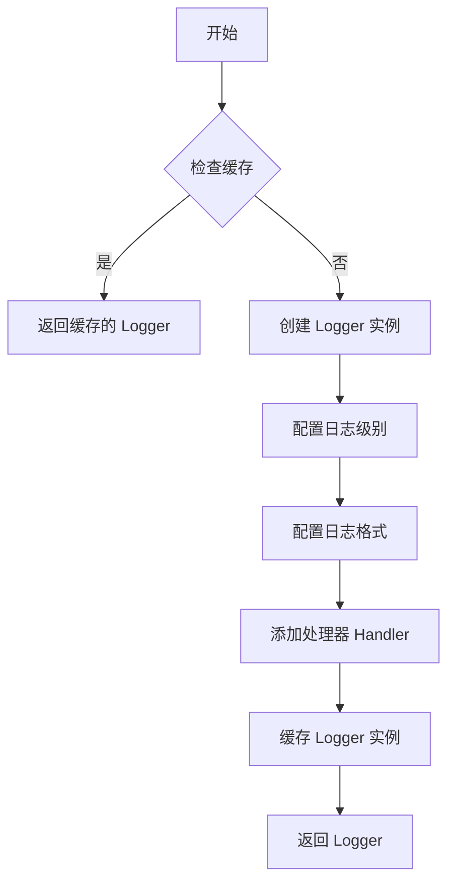
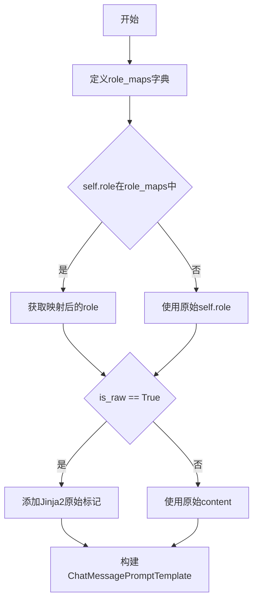

# `Langchain-Chatchat\libs\chatchat-server\chatchat\server\chat\utils.py` 详细设计文档

该代码定义了一个用于表示对话历史的 Pydantic 模型类 History，支持从字典、列表或元组等多种数据格式创建实例，并提供了将对话历史转换为 LangChain 消息元组（to_msg_tuple）和聊天提示模板（to_msg_template）的方法，主要用于聊天应用的对话管理与 LangChain 框架的集成。

## 整体流程

```mermaid
graph TD
    A[开始] --> B[导入依赖模块]
B --> C[初始化日志记录器 logger]
C --> D[定义 History 类]
D --> E{创建 History 实例}
E -- 直接实例化 --> F[传入 role 和 content]
E -- from_data 类方法 --> G{输入数据类型}
G -- list/tuple --> H[提取 role= h[0], content=h[1]]
G -- dict --> I[解包字典参数]
H --> J[调用 Pydantic 验证]
I --> J
F --> J
J --> K[History 对象创建成功]
K --> L{调用实例方法}
L --> M[to_msg_tuple]
L --> N[to_msg_template]
M --> O[返回 (role, content) 元组]
N --> P[返回 ChatMessagePromptTemplate]
```

## 类结构

```
BaseModel (Pydantic v2 基础模型)
└── History (对话历史模型)
```

## 全局变量及字段


### `logger`
    
项目日志记录器实例，用于输出程序运行日志

类型：`logging.Logger`
    


### `History.role`
    
对话角色（user/assistant/system 等），标识消息发送者身份

类型：`str`
    


### `History.content`
    
对话内容，存储消息的实际文本内容

类型：`str`
    
    

## 全局函数及方法


### `build_logger`

构建并配置日志记录器，返回一个预配置的 Logger 实例，用于在模块中记录日志。

参数：

- 无

返回值：`logging.Logger`，返回一个配置好的日志记录器实例，用于模块级别的日志输出。

#### 流程图



#### 带注释源码

```
# 注：build_logger 函数定义在 chatchat.utils 模块中，此处仅展示导入和调用方式
# 源码位置：chatchat/utils.py（外部模块，未在当前代码文件中定义）

from chatchat.utils import build_logger  # 从 chatchat.utils 模块导入 build_logger 函数

# 调用示例
logger = build_logger()  # 构建并获取一个日志记录器实例
# 返回的 logger 类型为 logging.Logger，可用于记录日志
# logger.info("信息日志")
# logger.error("错误日志")
```

> **说明**：由于 `build_logger` 函数定义在 `chatchat.utils` 模块中，当前代码文件仅展示了其导入和调用方式。该函数通常采用 `@lru_cache` 装饰器进行缓存，以确保同一模块只创建一个 Logger 实例，避免重复配置。


### `History.to_msg_tuple`

将 History 对象转换为消息元组 (role, content)，其中 role 会被映射为 "ai" 或 "human"。

参数：

- `self`：隐式参数，History 实例本身

返回值：`Tuple[str, str]`，返回一个元组，包含映射后的 role（"ai" 或 "human"）和原始的 content

#### 流程图

```mermaid
flowchart TD
    A[开始 to_msg_tuple] --> B{self.role == 'assistant'?}
    B -- 是 --> C[返回 ('ai', self.content)]
    B -- 否 --> D[返回 ('human', self.content)]
    C --> E[结束]
    D --> E
```

#### 带注释源码

```python
def to_msg_tuple(self):
    """
    将 History 对象转换为消息元组
    
    将 role 映射为标准的消息角色：
    - "assistant" -> "ai"
    - 其他 -> "human"
    
    Returns:
        Tuple[str, str]: (role, content) 元组
    """
    # 判断当前 role 是否为 "assistant"
    # 如果是则映射为 "ai"，否则映射为 "human"
    # content 保持不变
    return "ai" if self.role == "assistant" else "human", self.content
```


### `History.to_msg_template`

将对话历史转换为 LangChain 的 ChatMessagePromptTemplate，用于构建聊天提示模板。根据 `is_raw` 参数决定是否对内容进行 Jinja2 原始模板处理。

参数：

- `is_raw`：`bool`，当为 `True` 时，内容会被 Jinja2 的 `` 包裹，以防止模板变量被转义；为 `False` 时直接使用原始内容

返回值：`ChatMessagePromptTemplate`，LangChain 的聊天消息提示模板对象，包含模板内容和角色信息

#### 流程图

```mermaid
flowchart TD
    A[开始 to_msg_template] --> B{is_raw 参数}
    B -->|True| C[创建 role_maps 映射]
    B -->|False| D[获取映射后的 role]
    C --> D
    D --> E{is_raw}
    E -->|True| F[content =  + content + ]
    E -->|False| G[content = 原始 content]
    F --> H[调用 ChatMessagePromptTemplate.from_template]
    G --> H
    H --> I[返回 ChatMessagePromptTemplate]
    
    style A fill:#f9f,stroke:#333
    style I fill:#9f9,stroke:#333
```

#### 带注释源码

```python
def to_msg_template(self, is_raw=True) -> ChatMessagePromptTemplate:
    """
    将 History 对象转换为 LangChain 的 ChatMessagePromptTemplate
    
    参数:
        is_raw: bool, 是否将内容包裹为 Jinja2 原始模板.
                True 时使用  包裹内容,
                避免模板变量被转义. 默认为 True.
    
    返回:
        ChatMessagePromptTemplate: 包含模板内容和角色信息的提示模板对象
    """
    
    # 定义内部角色映射字典
    # 将项目内部使用的角色名映射为 LangChain 标准的角色名
    role_maps = {
        "ai": "assistant",       # "ai" 映射为 "assistant"
        "human": "user",         # "human" 映射为 "user"
    }
    
    # 根据映射字典获取转换后的角色名
    # 如果 self.role 不在 role_maps 中，则使用原始角色名
    role = role_maps.get(self.role, self.role)
    
    # 根据 is_raw 参数决定内容处理方式
    if is_raw:  
        # 当前默认历史消息都是没有 input_variable 的文本
        # 使用  包裹内容，防止 Jinja2 模板引擎解析内容中的变量
        content = "" + self.content + ""
    else:
        # 不使用原始模板包裹，直接使用原始内容
        content = self.content

    # 使用 LangChain 的 ChatMessagePromptTemplate.from_template 创建模板
    # 参数说明:
    #   - content: 模板内容字符串
    #   - "jinja2": 指定模板语言为 Jinja2
    #   - role: 消息的角色（如 "assistant" 或 "user"）
    return ChatMessagePromptTemplate.from_template(
        content,
        "jinja2",
        role=role,
    )
```


### `History.from_data`

从多种数据格式（列表、元组或字典）创建 History 实例的类方法。该方法接受灵活的数据输入，将其标准化为统一的 History 对象，方便不同场景下的历史消息构造。

参数：

- `h`：`Union[List, Tuple, Dict]`，输入数据，可以是包含 role 和 content 的列表/元组（如 `["human", "你好"]` 或 `("user", "Hello")`），也可以是包含 role 和 content 键的字典（如 `{"role": "user", "content": "你好"}`）

返回值：`History`，返回创建的 History 实例对象

#### 流程图

```mermaid
flowchart TD
    A[开始: from_data h] --> B{判断 h 类型}
    B --> C{isinstance(h, (list, tuple)) 且 len >= 2?}
    C -->|Yes| D[提取 h[0] 作为 role, h[1] 作为 content]
    D --> E[cls(role=role, content=content)]
    C -->|No| F{isinstance(h, dict)?}
    F -->|Yes| G[cls(**h) 解包字典]
    G --> E
    F -->|No| H[返回 None 或抛出异常]
    E --> I[返回 History 实例]
    H --> I
```

#### 带注释源码

```python
@classmethod
def from_data(cls, h: Union[List, Tuple, Dict]) -> "History":
    """
    从多种数据格式创建 History 实例
    
    参数:
        h: Union[List, Tuple, Dict]
            - list/tuple: 需要至少2个元素，[role, content]
            - dict: 需要包含 role 和 content 键的字典
    
    返回值:
        History: 创建的 History 实例
    """
    # 判断输入是否为列表或元组，且长度>=2
    if isinstance(h, (list, tuple)) and len(h) >= 2:
        # 提取第一个元素作为 role，第二个元素作为 content
        h = cls(role=h[0], content=h[1])
    # 判断输入是否为字典
    elif isinstance(h, dict):
        # 使用字典解包创建 History 实例
        h = cls(**h)
    
    # 返回创建的 History 实例
    return h
```

## 关键组件


### 一段话描述

该代码定义了一个对话历史管理类History，基于Pydantic的BaseModel实现，用于封装聊天机器人场景中的角色（role）和内容（content），支持从多种数据格式（字典、列表、元组）创建实例，并能转换为LangChain的消息元组和Jinja2模板格式。

### 文件的整体运行流程

1. 导入必要的依赖模块（logging、typing、langchain、pydantic、自定义工具）
2. 初始化日志记录器
3. 定义History类，继承Pydantic的BaseModel
4. History类提供三个核心方法：
   - `to_msg_tuple()`: 将History对象转换为消息元组格式
   - `to_msg_template()`: 将History对象转换为LangChain的ChatMessagePromptTemplate
   - `from_data()`: 工厂方法，从list/tuple/dict创建History实例

### 类的详细信息

### 类：History

**类字段：**

| 名称 | 类型 | 描述 |
|------|------|------|
| role | str | 消息角色，如"user"、"assistant"、"human"、"ai" |
| content | str | 消息内容文本 |

**类方法：**

#### to_msg_tuple

| 项目 | 详情 |
|------|------|
| 名称 | to_msg_tuple |
| 参数 | 无 |
| 参数类型 | - |
| 参数描述 | - |
| 返回值类型 | Tuple[str, str] |
| 返回值描述 | 返回("ai", content)或("human", content)格式的元组，用于LangChain消息 |

**mermaid流程图：**
```mermaid
flowchart TD
    A[开始] --> B{self.role == "assistant"}
    B -->|是| C[返回 "ai"]
    B -->|否| D[返回 "human"]
    C --> E[返回元组 role, content]
    D --> E
```

**源码：**
```python
def to_msg_tuple(self):
    return "ai" if self.role == "assistant" else "human", self.content
```

---

#### to_msg_template

| 项目 | 详情 |
|------|------|
| 名称 | to_msg_template |
| 参数 | is_raw: bool = True |
| 参数类型 | bool |
| 参数描述 | 是否对内容进行Jinja2原始文本处理，默认为True |
| 返回值类型 | ChatMessagePromptTemplate |
| 返回值描述 | 返回LangChain的聊天消息提示模板对象 |

**mermaid流程图：**


**源码：**
```python
def to_msg_template(self, is_raw=True) -> ChatMessagePromptTemplate:
    role_maps = {
        "ai": "assistant",
        "human": "user",
    }
    role = role_maps.get(self.role, self.role)
    if is_raw:  # 当前默认历史消息都是没有input_variable的文本。
        content = "" + self.content + ""
    else:
        content = self.content

    return ChatMessagePromptTemplate.from_template(
        content,
        "jinja2",
        role=role,
    )
```

---

#### from_data

| 项目 | 详情 |
|------|------|
| 名称 | from_data |
| 参数 | h: Union[List, Tuple, Dict] |
| 参数类型 | Union[List, Tuple, Dict] |
| 参数描述 | 可以是列表、元组（至少2个元素）或字典格式的历史数据 |
| 返回值类型 | History |
| 返回值描述 | 返回History类实例 |

**mermaid流程图：**
```mermaid
flowchart TD
    A[开始] --> B{h是list或tuple且长度>=2}
    B -->|是| C[创建History role=h[0], content=h[1]]
    B -->|否| D{h是dict}
    D -->|是| C
    D -->|否| E[返回None或引发异常]
    C --> F[返回History实例]
```

**源码：**
```python
@classmethod
def from_data(cls, h: Union[List, Tuple, Dict]) -> "History":
    if isinstance(h, (list, tuple)) and len(h) >= 2:
        h = cls(role=h[0], content=h[1])
    elif isinstance(h, dict):
        h = cls(**h)

    return h
```

---

### 关键组件信息

### 组件1：Pydantic BaseModel基础类

Pydantic V2的BaseModel，提供了数据验证和序列化功能，确保role和content字段的类型安全。

### 组件2：角色映射机制

role_maps字典实现了内部角色标识（ai/human）与LangChain要求的标准角色（assistant/user）之间的映射转换。

### 组件3：Jinja2模板原始文本处理

通过``和``标签实现原始文本转义，防止内容中的Jinja2模板语法被解析。

### 组件4：多格式数据工厂方法

from_data类方法支持从list、tuple、dict三种不同格式创建History实例，提供了灵活的数据接入方式。

---

### 潜在的技术债务或优化空间

1. **错误处理不完善**：from_data方法在输入格式不符合预期时静默返回None，应该抛出明确的异常或添加输入验证

2. **缺少字段验证**：role字段没有枚举限制，可能导致无效的角色值传入

3. **文档注释缺失**：类缺少详细的API文档说明

4. **魔法字符串**：角色映射使用硬编码字符串，应考虑提取为常量或配置

---

### 其它项目

**设计目标与约束：**
- 设计目标：提供轻量级的对话历史数据结构，支持与LangChain框架无缝集成
- 约束：依赖Pydantic V2和LangChain库

**错误处理与异常设计：**
- 当前实现对非法输入处理较弱，from_data方法在无效输入时返回None可能导致调用方出现AttributeError
- 建议添加自定义异常类或使用Pydantic的验证装饰器

**数据流与状态机：**
- 数据流：外部数据源 → from_data工厂方法 → History实例 → to_msg_tuple/to_msg_template转换为LangChain格式
- 状态机：单一状态对象，无复杂状态转换

**外部依赖与接口契约：**
- 依赖langchain.prompts.chat.ChatMessagePromptTemplate
- 依赖chatchat.server.pydantic_v2.BaseModel, Field
- 依赖chatchat.utils.build_logger
- 输出接口：to_msg_tuple返回Tuple[str, str]，to_msg_template返回ChatMessagePromptTemplate


## 问题及建议


### 已知问题

-   **未使用的导入**：`lru_cache` 被导入但代码中未使用，增加不必要的依赖
-   **类注释拼写错误**：注释中 `h.to_msy_tuple` 应该是 `h.to_msg_tuple`（msy 应为 msg），影响文档可读性
-   **from_data 方法存在未初始化变量风险**：当输入 `h` 不符合 `(list, tuple) >= 2` 或 `dict` 格式时，变量 `h` 未被定义，可能导致后续返回语句引用未定义变量
- **错误处理缺失**：from_data 方法对不符合预期的输入没有友好的错误提示或验证，直接抛出异常
- **日志 logger 未使用**：导入并初始化了 logger，但代码中无任何日志记录语句
- **硬编码的角色映射**：to_msg_template 中的 role_maps 字典硬编码在方法内部，不利于扩展和维护

### 优化建议

-   移除未使用的 `lru_cache` 导入
-   修正注释中的 `to_msy_tuple` 为 `to_msg_tuple`
-   在 from_data 方法中添加输入验证和明确的错误处理，例如：
  ```python
  if isinstance(h, (list, tuple)) and len(h) >= 2:
      h = cls(role=h[0], content=h[1])
  elif isinstance(h, dict):
      h = cls(**h)
  else:
      raise ValueError(f"Invalid history format: {type(h)}")
  ```
-   将 role_maps 提升为类常量或配置，支持扩展
-   如无需日志记录，可移除 logger 相关代码
-   考虑为 role 字段添加验证器，限制合法角色值（如 "user", "assistant", "system" 等）

## 其它


### 设计目标与约束

该模块旨在为聊天应用提供统一的历史消息管理抽象，支持多种输入格式的转换，以及与LangChain框架的无缝集成。设计约束包括：必须继承自Pydantic v2的BaseModel以确保数据验证；必须兼容LangChain的ChatMessagePromptTemplate格式；所有历史消息内容默认视为原始文本（Jinja2模板）。

### 错误处理与异常设计

代码中的异常处理主要通过Pydantic的数据验证机制实现。当传入无效数据时，Pydantic会自动抛出验证错误。具体异常场景包括：1) from_data方法接收非法的list/tuple长度（小于2）时，隐式返回None而非抛出异常；2) 角色映射失败时使用原角色作为后备。改进建议：应在from_data方法中增加显式的类型检查和异常抛出，明确告知调用者数据格式错误。

### 数据流与状态机

数据流方向：外部数据(dict/list/tuple) -> from_data方法 -> History实例 -> to_msg_tuple或to_msg_template方法 -> LangChain兼容格式。状态转换路径：原始数据经过验证后转换为History对象，该对象可转换为两种表示形式——消息元组(tuple)或Jinja2模板。状态转换是单向且无副作用的，符合不可变数据模式。

### 外部依赖与接口契约

核心依赖包括：1) langchain.prompts.chat.ChatMessagePromptTemplate - 用于生成LangChain兼容的消息模板；2) pydantic v2 - 用于数据模型定义和验证；3) Jinja2模板引擎 - 用于模板渲染。接口契约：from_data接受Union[List, Tuple, Dict]类型，返回History实例；to_msg_tuple返回Tuple[str, str]；to_msg_template返回ChatMessagePromptTemplate对象。

### 性能考虑

代码中未实现明显的性能优化，但存在潜在优化点：role_maps字典在每次调用to_msg_template时都会创建，建议定义为类常量；from_data方法中频繁的类型检查可考虑使用模式匹配优化。由于History对象通常作为轻量级数据容器使用，当前实现性能可接受。

### 安全性考虑

安全风险点：to_msg_template方法中的is_raw参数控制是否添加Jinja2的raw标签。当is_raw=True时，content被包裹在和中，这可以防止模板注入攻击，但如果is_raw=False且content来自用户输入，可能存在模板注入风险。建议：明确文档说明is_raw=False的使用场景，并考虑在用户输入场景下强制使用raw模式。

### 可测试性

测试策略应覆盖：1) 各种输入格式的from_data转换（有效和无效输入）；2) to_msg_tuple的角色映射准确性；3) to_msg_template生成的模板格式正确性；4) 边界条件（如空字符串、特殊字符）。该类设计较为简洁，依赖明确，适合单元测试。建议使用pytest框架，结合parametrize实现多场景覆盖。

### 配置文件

该模块无独立配置文件，所有行为通过方法参数控制。如需扩展，可考虑添加配置项：1) 默认角色映射规则；2) 是否默认使用raw模式；3) 支持的自定义角色类型。这些配置可通过环境变量或配置中心注入。

### 版本兼容性

代码明确依赖Pydantic v2（通过chatchat.server.pydantic_v2导入），与Pydantic v1不兼容。LangChain版本依赖需在requirements.txt中明确指定，建议锁定兼容版本范围。该模块在Python 3.8+环境下可正常运行（使用typing.Dict/List/Tuple）。

### 监控与日志

该模块使用了build_logger()创建的logger实例，但当前代码中未包含任何日志语句。建议在关键路径添加日志：1) from_data方法中记录数据转换；2) to_msg_template方法中记录模板生成；3) 异常场景中记录错误详情。日志级别建议使用DEBUG或INFO，避免影响生产性能。

### 术语表

| 术语 | 定义 |
|------|------|
| History | 对话历史数据模型，包含role和content字段 |
| ChatMessagePromptTemplate | LangChain的消息提示模板类 |
| Jinja2 | Python模板引擎，用于动态生成文本 |
| Pydantic | Python数据验证库，v2版本表示使用BaseModel |
| 角色映射 | 将内部角色标识(ai/human)转换为LLM提供商要求的格式(assistant/user) |

    