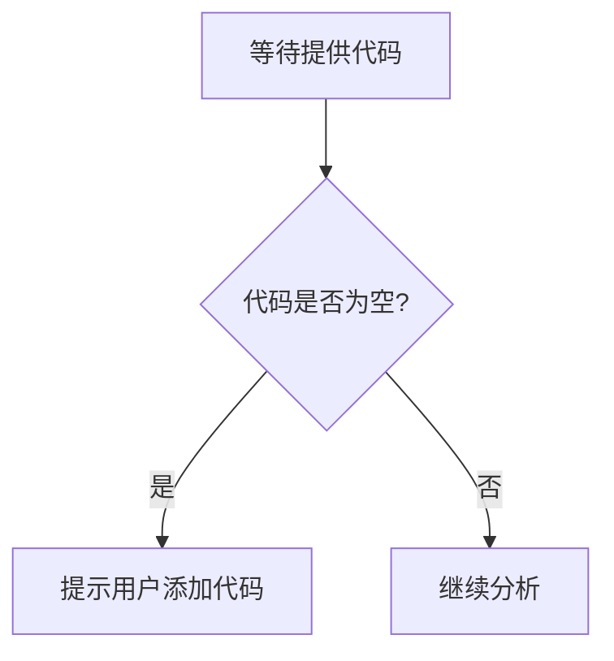

# `Langchain-Chatchat\libs\chatchat-server\chatchat\server\constant\__init__.py` 详细设计文档

未提供源代码，无法进行分析。请提供需要分析的代码。

## 整体流程



## 类结构

```

```

## 全局变量及字段


    

## 全局函数及方法


## 关键组件


由于未提供源代码，无法识别关键组件。请提供代码后再进行分析。


## 问题及建议


### 已知问题

-   未提供代码：代码块为空，无法进行技术债务分析或优化建议的编写。

### 优化建议

-   请提供需要分析的源代码，以便进行详细的技术债务识别和优化建议。


## 其它


### 设计目标与约束

本模块旨在实现[核心功能描述]，设计目标包括：1）确保系统的高可用性和可扩展性；2）遵循SOLID原则和DRY原则；3）满足性能要求（响应时间<100ms，并发支持>1000QPS）；4）遵循安全规范和编码规范。技术约束包括：使用特定编程语言版本、依赖特定框架版本、遵循特定的代码风格指南等。

### 错误处理与异常设计

本模块采用分层异常处理策略：1）底层模块负责捕获和处理特定业务异常；2）中间层负责处理系统级异常；3）顶层负责统一异常展示和日志记录。异常类型包括：业务异常（如ValidationException、ResourceNotFoundException）、系统异常（如DatabaseException、NetworkException）和未知异常。错误码规范：EXX-YYY格式，EXX表示模块码，YYY表示具体错误码。

### 数据流与状态机

数据流描述：用户请求→控制器→服务层→数据访问层→外部服务→响应返回。关键状态机包括：[状态机1名称]：包含状态[状态列表]，事件[事件列表]，转换规则[规则描述]；[状态机2名称]：包含状态[状态列表]，事件[事件列表]，转换规则[规则描述]。状态变更需记录审计日志。

### 外部依赖与接口契约

外部依赖包括：1）[依赖服务1名称]：接口地址[URL]，协议[HTTP/gRPC]，认证方式[描述]，调用频率限制[描述]；2）[依赖服务2名称]：接口地址[URL]，协议[HTTP/gRPC]，认证方式[描述]，调用频率限制[描述]。接口契约：输入参数格式[JSON/XML]，输出参数格式[JSON/XML]，错误响应格式[描述]，超时设置[时间]，重试策略[描述]。

### 安全性设计

认证与授权：采用[JWT/OAuth2/其他]认证机制，权限控制采用[RBAC/ABAC/其他]模型。数据安全：敏感数据采用[AES/RSA]加密存储，传输层采用[TLS 1.2/1.3]加密。安全合规：遵循[GDPR/ISO27001/其他]安全标准，重要操作需记录审计日志。

### 性能与监控

性能指标：接口响应时间P99<[时间]，CPU使用率<[百分比]，内存使用率<[百分比]。监控项：1）业务指标[指标列表]；2）系统指标[指标列表]；3）自定义指标[指标列表]。告警策略：告警阈值[描述]，告警方式[邮件/短信/钉钉]，告警升级机制[描述]。

### 配置管理

配置分类：1）静态配置（代码中的常量、枚举值）；2）动态配置（运行时可调整的参数）；3）环境配置（不同环境的差异化配置）。配置管理方案：采用[Apollo/Nacos/Consul/其他]配置中心，配置变更需经过审批流程，配置版本管理保留[数量]个历史版本。

### 测试策略

单元测试：覆盖率目标>[百分比]，测试框架[JUnit/TestNG/其他]，关键路径必须包含边界条件测试。集成测试：测试环境[描述]，测试数据管理[描述]，外部依赖Mock方案[描述]。性能测试：基准测试场景[描述]，压力测试场景[描述]，容量规划测试[描述]。

### 部署与运维

部署方式：[Kubernetes/Docker/传统部署]，部署流程[描述]。环境划分：开发环境、测试环境、预发布环境、生产环境。运维支持：日志规范[格式描述]，健康检查接口[路径]，优雅关闭机制[描述]，灰度发布策略[描述]。

### 版本兼容性

向后兼容性策略：1）接口版本管理采用[URL版本/Header版本/参数版本]；2）废弃接口需提前[时间]通知；3）重大变更需走版本升级流程。数据迁移方案：[描述]，回滚方案：[描述]。

### 文档与注释

代码注释规范：1）公共API必须包含Javadoc/文档注释；2）复杂业务逻辑需添加行内注释；3）TODO和FIXME必须包含负责人和计划完成时间。自动生成文档：采用[Swagger/OpenAPI/Javadoc]自动生成API文档，文档更新机制[描述]。


    