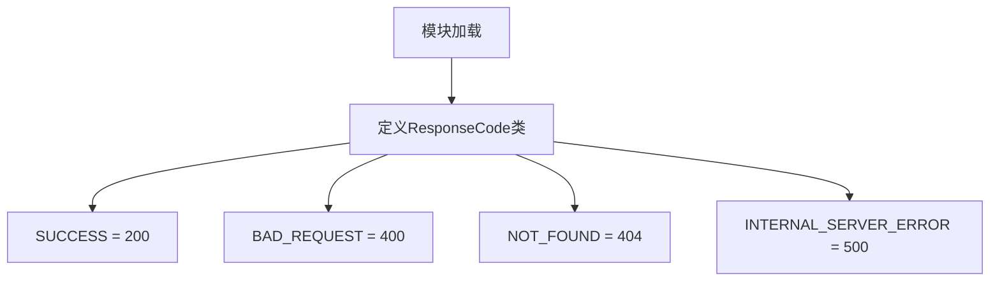

# `Langchain-Chatchat\libs\chatchat-server\chatchat\server\constant\response_code.py` 详细设计文档

一个简单的HTTP响应状态码常量类，定义了常见的HTTP状态码，包括成功请求、客户端错误、服务器错误等标准HTTP状态码。

## 整体流程



## 类结构

```
ResponseCode (HTTP响应码常量类)
```

## 全局变量及字段


### `ResponseCode.SUCCESS`
    
表示HTTP请求成功，状态码200

类型：`int`
    


### `ResponseCode.BAD_REQUEST`
    
表示客户端请求错误，状态码400

类型：`int`
    


### `ResponseCode.NOT_FOUND`
    
表示请求的资源不存在，状态码404

类型：`int`
    


### `ResponseCode.INTERNAL_SERVER_ERROR`
    
表示服务器内部错误，状态码500

类型：`int`
    
    

## 全局函数及方法


## 关键组件


### ResponseCode 类
一个用于定义标准 HTTP 响应状态码的常量类，包含四个常用的 HTTP 状态码：成功 (200)、请求错误 (404)、资源未找到 (404) 和服务器内部错误 (500)。

### SUCCESS 常量
值为 200，表示 HTTP 请求成功完成的状态码。

### BAD_REQUEST 常量
值为 400，表示客户端请求存在语法错误或参数无效的状态码。

### NOT_FOUND 常量
值为 404，表示请求的资源在服务器上无法找到的状态码。

### INTERNAL_SERVER_ERROR 常量
值为 500，表示服务器在处理请求时遇到内部错误的状态码。


## 问题及建议


### 已知问题

-   **功能不完整**：仅定义了4个HTTP状态码，缺少大量常用状态码（如201 Created、204 No Content、301/302重定向、401 Unauthorized、403 Forbidden、502 Bad Gateway、503 Service Unavailable等）
-   **缺乏文档说明**：缺少类级别和方法级别的文档字符串（docstring），无法快速理解每个状态码的语义
-   **非Pythonic实现**：使用纯类定义常量而非Python 3.4+推荐的枚举（Enum），缺乏类型安全性和语义化封装
-   **无类型注解**：缺少类型提示（type hints），不利于静态分析和IDE智能提示
-   **缺少状态码描述**：仅定义了数值，未提供状态码对应的文本描述（如"OK"、"Not Found"等）
-   **扩展性差**：若需添加新状态码，需直接修改类源码，缺乏配置化或扩展机制

### 优化建议

-   **采用Enum重构**：使用`enum.IntEnum`或`enum.Enum`替代普通类，提供更强的类型安全和语义化支持
-   **补充常用状态码**：根据业务需求添加更多HTTP状态码定义，或直接使用Python标准库`http.HTTPStatus`枚举
-   **添加文档字符串**：为类和方法添加规范的docstring，说明用途和使用场景
-   **引入类型注解**：为类添加类型提示，提升代码可维护性和IDE支持
-   **分离状态码与描述**：可考虑将状态码与描述文本分离，支持国际化或多语言场景
-   **考虑外部依赖**：若项目已依赖第三方HTTP库，评估是否复用其内置的状态码枚举，避免重复定义


## 其它


### 设计目标与约束

设计目标：提供一套标准化的HTTP响应码常量，供项目中的HTTP响应处理使用，确保响应码的一致性和可维护性。约束：该类仅包含静态常量，不包含任何业务逻辑，且常量值必须符合HTTP协议标准。

### 错误处理与异常设计

本代码不涉及运行时错误处理，因为仅为常量定义类。若需要扩展添加新的响应码，应遵循HTTP协议规范，避免使用非标准的响应码值。

### 外部依赖与接口契约

本类不依赖任何外部库，可直接被项目中其他模块引用。使用方通过`ResponseCode.SUCCESS`或`ResponseCode.BAD_REQUEST`等方式访问常量，契约规定所有常量均为整数类型。

### 使用示例

在HTTP响应构建时使用：`response.status_code = ResponseCode.SUCCESS` 或 `if status_code == ResponseCode.NOT_FOUND:`

### 扩展性考虑

当前仅包含4个常用响应码，可根据项目需求添加更多HTTP标准响应码（如201 Created、204 No Content、400系列客户端错误、500系列服务器错误等），或考虑使用Python的Enum类替代当前实现以提供更强的类型安全。

### 性能考量

该类为纯静态常量定义，不涉及运行时性能开销，访问效率取决于Python的属性查找机制。

### 安全性考虑

该类仅包含常量定义，无安全风险。但需注意不应在响应码中暴露敏感的服务器信息。

### 测试策略

建议编写单元测试验证常量值的正确性，以及测试常量在实际HTTP响应场景中的可用性。

### 版本历史与变更记录

初始版本（v1.0）：定义4个基础HTTP响应码常量。

    