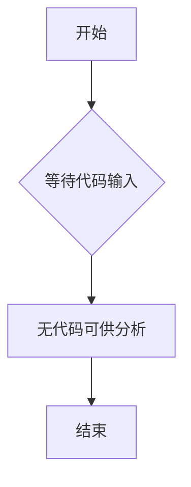

# `Langchain-Chatchat\libs\chatchat-server\chatchat\server\db\__init__.py` 详细设计文档

未提供源代码，无法进行分析。请提供需要分析的代码。

## 整体流程



## 类结构

```

```

## 全局变量及字段


    

## 全局函数及方法


## 关键组件


## 问题及建议


### 已知问题

-   代码文件为空，无法进行静态分析和技术债务评估
-   缺少源代码文件，无法提取类结构、函数定义和业务逻辑
-   无法识别潜在的依赖关系和接口契约
-   无从判断设计模式和架构合理性

### 优化建议

-   提供完整的源代码文件以供分析
-   确保代码包含实际的业务逻辑实现
-   如有多文件项目，提供完整的项目结构和文件组织
-   如有特定的分析要求，请说明关注的重点领域（如性能、安全、可维护性等）


## 其它


### 设计目标与约束

本项目旨在实现[待定]功能，采用[待定]技术栈，确保系统具备高性能、高可用性和易维护性。设计约束包括：技术选型限制为[待定]、需兼容[待定]版本的浏览器/平台、遵循[待定]编码规范、预计支持[待定]并发用户数、响应时间需控制在[待定]毫秒以内。

### 错误处理与异常设计

采用分层异常处理策略：底层模块负责捕获特定异常并转换为统一错误码；中间层进行异常日志记录和初步处理；顶层负责向用户展示友好错误信息。定义标准错误码体系（如：1xxx-系统错误、2xxx-业务错误、3xxx-验证错误），每个异常包含错误码、错误消息、堆栈信息和因果链。实现全局异常拦截器（Middleware/Handler），确保未被捕获的异常不会导致系统崩溃。关键操作需实现重试机制（如网络请求、文件IO），重试策略采用指数退避算法。

### 数据流与状态机

数据流遵循单向流动原则：用户输入→前端校验→API网关→业务服务→数据持久层→响应返回。关键业务场景定义状态机模型，以订单为例：状态包括【待支付、已支付、待发货、已发货、已完成、已取消】，状态转换规则为【待支付→已支付/已取消、已支付→待发货、待发货→已发货、已发货→已完成、任意状态→已取消（需满足特定条件）】。每个状态转换触发相应的事件和回调，确保业务流程的完整性和可追溯性。

### 外部依赖与接口契约

外部依赖包括：[待定]作为缓存层（Redis集群）、[待定]作为消息队列（Kafka）、[待定]作为对象存储（S3/OSS）、[待定]作为搜索引擎（Elasticsearch）。定义清晰的API接口契约，采用OpenAPI 3.0规范编写接口文档，包含请求/响应示例、错误码说明、认证方式（OAuth2.0/JWT）、 Rate Limiting策略（默认[待定]QPS）。与第三方集成的适配器模式实现，隔离外部系统变更对核心业务的影响。关键外部服务需实现熔断器（Circuit Breaker）模式，防止级联故障。

### 性能要求与监控

性能指标要求：API平均响应时间<[待定]ms（P99<[待定]ms）、数据库查询平均耗时<[待定]ms、页面首次加载时间<[待定]秒。实现多级缓存策略：本地缓存（Guava/Caffeine）→分布式缓存（Redis）→数据库。关键性能指标监控包括：请求延迟、吞吐量、错误率、CPU/内存/磁盘IO使用率、数据库连接池使用率。引入APM工具（如SkyWalking/Pinpoint）进行全链路追踪。

### 安全性设计

实施多层安全防护：传输层使用TLS 1.3加密、认证层采用JWT + Refresh Token机制、授权层实现RBAC权限模型、数据层对敏感信息（密码、身份证号、银行卡号）进行AES-256加密存储。输入验证采用白名单策略，防止SQL注入、XSS、CSRF等常见攻击。接口调用需携带签名（HMAC-SHA256），防止请求被篡改。敏感操作需记录审计日志，包含操作人、操作时间、操作内容、操作IP等信息。

### 兼容性设计

前端支持[待定]及以上版本的Chrome、Firefox、Safari、Edge浏览器，移动端支持iOS [待定]及以上和Android [待定]及以上版本。API采用版本化策略（URL路径如/api/v1/、/api/v2/），确保向后兼容。数据库设计考虑迁移方案，使用版本控制工具（如Flyway/Liquibase）管理Schema变更。关键配置项支持热更新，无需重启服务。

### 部署架构

采用容器化部署（Docker + Kubernetes），实现服务化架构。基础架构包括：负载均衡（Nginx/ALB）、服务注册与发现（Nacos/Consul）、配置中心（Nacos/Apollo）、日志收集（ELK Stack）、监控告警（Prometheus + Grafana）。实现蓝绿部署或金丝雀发布策略，支持灰度回滚。多区域部署实现异地多活，主从复制确保数据高可用。

### 测试策略

单元测试覆盖率需达到[待定]%以上，重点覆盖核心业务逻辑和边界条件。集成测试验证模块间交互的正确性，使用Testcontainers模拟真实数据库和消息队列。接口测试采用契约测试（Contract Testing）确保API提供者和消费者的一致性。性能测试使用JMeter/Gatling模拟真实负载，验证系统在高并发下的稳定性。安全测试包括代码扫描（SonarQube）和渗透测试。

### 配置管理与可观测性

配置管理采用集中式配置中心，支持环境区分（dev/test/staging/prod）、配置动态刷新、配置版本管理和回滚。日志规范采用结构化日志（JSON格式），包含TraceID用于全链路追踪，关键操作记录业务日志。可观测性三大支柱：指标（Metrics）用于性能监控、日志（Logs）用于问题排查、追踪（Traces）用于性能分析。建立完善的告警体系，支持多级别告警（Info/Warning/Error/Critical）和多渠道通知（钉钉/企微/邮件/短信）。

### 扩展性设计

采用微服务架构或模块化单体架构，支持水平扩展和垂直扩展。数据库采用读写分离和分库分表策略，数据量预计[待定]条记录时考虑分表。消息队列支持分区（Partition）扩展，消费者组（Consumer Group）实现负载均衡。缓存支持集群模式扩展，预留扩容接口。代码层面遵循开闭原则，对扩展开放、对修改关闭，使用策略模式、装饰器模式等设计模式应对业务变化。

### 事务与并发控制

分布式事务采用Saga模式或TCC模式，确保最终一致性。单机事务遵循ACID原则，使用合理的事务传播行为（Propagation）。并发控制采用乐观锁（版本号）或悲观锁（SELECT FOR UPDATE），根据业务场景选择。分布式锁使用Redisson实现，支持公平锁/非公平锁、可重入锁。线程池采用动态配置，核心线程数根据CPU核数和业务特性设置，队列大小和最大线程数需合理规划，防止任务积压或资源耗尽。


    