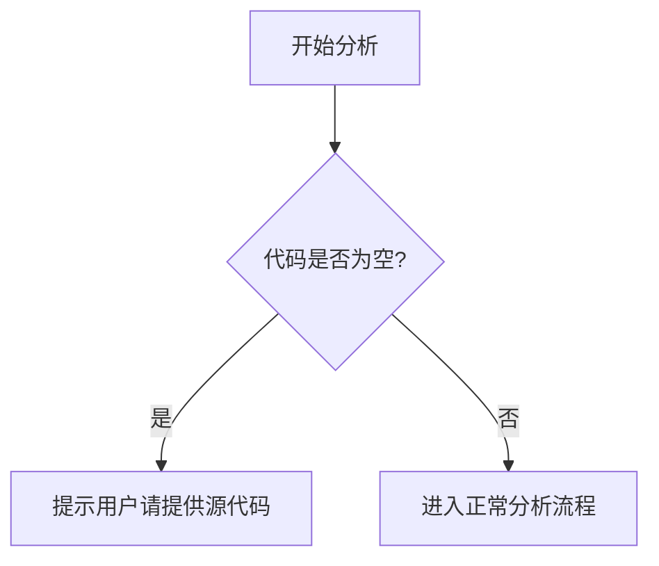

# `Langchain-Chatchat\libs\chatchat-server\chatchat\server\db\models\__init__.py` 详细设计文档

未提供源代码，无法进行分析

## 整体流程



## 类结构

```

```

## 全局变量及字段


    

## 全局函数及方法


## 关键组件


### 源代码分析

未提供代码进行分析。请在"代码"部分提供需要分析的源代码，以便识别关键组件（如张量索引与惰性加载、反量化支持、量化策略等）并生成详细的设计文档。


## 问题及建议


### 已知问题

-   未提供代码内容，无法进行技术债务和优化空间的分析

### 优化建议

-   请提供需要分析的代码，以便进行详细的技术债务识别和优化建议
-   建议提供完整的源代码文件或代码片段
-   如有多个文件，请确保提供所有相关代码


## 其它


### 设计目标与约束

（待补充：无具体代码，无法填写）

### 错误处理与异常设计

（待补充：无具体代码，无法填写）

### 数据流与状态机

（待补充：无具体代码，无法填写）

### 外部依赖与接口契约

（待补充：无具体代码，无法填写）

### 性能要求与基准

（待补充：无具体代码，无法填写）

### 安全性设计

（待补充：无具体代码，无法填写）

### 兼容性设计

（待补充：无具体代码，无法填写）

### 测试策略

（待补充：无具体代码，无法填写）

### 部署与运维相关

（待补充：无具体代码，无法填写）

### 监控与日志设计

（待补充：无具体代码，无法填写）


    