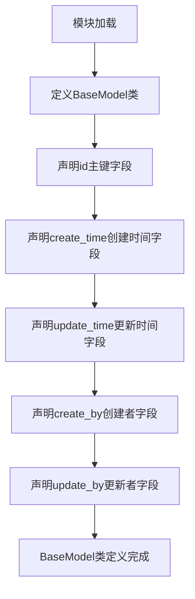
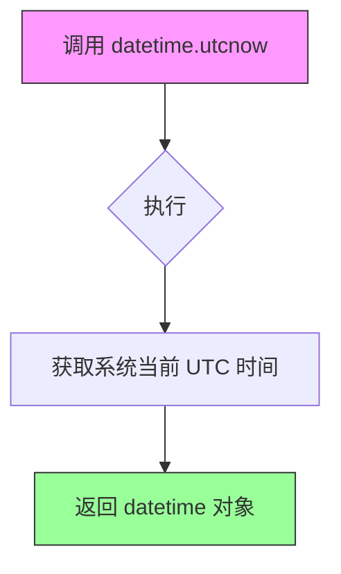

# `Langchain-Chatchat\libs\chatchat-server\chatchat\server\db\models\base.py` 详细设计文档

定义了一个SQLAlchemy基础模型类BaseModel，包含通用的数据库字段（主键ID、创建时间、更新时间、创建者、更新者），供其他模型类继承以实现统一的表结构设计。

## 整体流程



## 类结构

```
BaseModel (SQLAlchemy基础模型类)
```

## 全局变量及字段


### `BaseModel.id`
    
主键ID

类型：`Integer`
    


### `BaseModel.create_time`
    
创建时间

类型：`DateTime`
    


### `BaseModel.update_time`
    
更新时间

类型：`DateTime`
    


### `BaseModel.create_by`
    
创建者

类型：`String`
    


### `BaseModel.update_by`
    
更新者

类型：`String`
    
    

## 全局函数及方法


### `datetime.utcnow`

获取当前 UTC（协调世界时）时间的函数，常用于记录数据创建或更新的时间戳。

参数：
- （无参数）

返回值：`datetime.datetime`，返回当前 UTC 时间的 datetime 对象。

#### 流程图



#### 带注释源码

```python
# datetime.utcnow 是 datetime 模块的类方法
# 用于获取当前的 UTC（Coordinated Universal Time）时间
# 返回一个 datetime 对象，包含年、月、日、时、分、秒、微秒信息
# 不接受任何参数

# 使用示例：
from datetime import datetime

# 获取当前 UTC 时间
current_utc_time = datetime.utcnow()
print(current_utc_time)  # 输出类似: 2024-01-15 10:30:45.123456

# 在 SQLAlchemy 中作为默认值使用
# 当创建新记录时，自动填充当前 UTC 时间
class BaseModel:
    id = Column(Integer, primary_key=True, index=True, comment="主键ID")
    create_time = Column(DateTime, default=datetime.utcnow, comment="创建时间")
    update_time = Column(DateTime, default=None, onupdate=datetime.utcnow, comment="更新时间")
```

#### 详细说明

| 属性 | 值 |
|------|-----|
| 名称 | `datetime.utcnow` |
| 来源 | Python 标准库 `datetime` 模块 |
| 参数 | 无 |
| 返回值类型 | `datetime.datetime` |
| 返回值描述 | 当前 UTC 时间的 datetime 对象 |
| 使用场景 | 在数据库模型中作为列的默认值，记录创建时间和更新时间 |

## 关键组件


### BaseModel 基础模型类

提供通用的数据库模型基类，包含主键ID、创建时间、更新时间、创建者和更新者等通用字段，用于所有业务模型的继承。

### id 主键字段

Integer类型的主键字段，作为数据表的唯一标识符，支持索引，用于记录的唯一标识。

### create_time 创建时间字段

DateTime类型的创建时间字段，默认值为当前UTC时间，记录数据记录的创建时刻。

### update_time 更新时间字段

DateTime类型的更新时间字段，支持自动更新，记录数据记录的最后修改时刻。

### create_by 创建者字段

String类型的创建者字段，记录创建该数据记录的用户标识。

### update_by 更新者字段

String类型的更新者字段，记录最后修改该数据记录的用户标识。


## 问题及建议


### 已知问题

-   **String类型未指定长度**：create_by和update_by字段使用String但未指定长度，可能导致数据库迁移问题
-   **时区处理缺失**：使用datetime.utcnow()未考虑时区，Python 3.12+中已废弃utcnow()，应使用datetime.now(timezone.utc)
-   **update_time默认值不当**：default=None作为默认值语义不明确，应使用函数返回当前时间
-   **缺少__tablename__**：未定义表名，SQLAlchemy会使用默认的类名小写形式，可能不符合命名规范
-   **缺少抽象基类标识**：BaseModel应继承自sqlalchemy.orm.DeclarativeBase或使用abc模块标记为抽象类
-   **字段注释不完整**：虽然有comment，但缺少对字段约束（如最大长度、nullable）的显式定义

### 优化建议

-   为String类型字段添加长度限制，如String(64)或String(128)
-   使用timezone-aware datetime：from datetime import datetime, timezone; default=lambda: datetime.now(timezone.utc)
-   显式定义__tablename__ = 'base_model'或使用Naming Convention
-   继承sqlalchemy.orm.DeclarativeBase创建Base类
-   添加__repr__方法便于调试：def __repr__(self): return f"<{self.__class__.__name__}(id={self.id})>"
-   考虑将BaseModel改为抽象基类或mixin，避免直接实例化


## 其它


### 设计目标与约束

该代码旨在为项目提供一个通用的基础模型类，所有业务模型可以继承该类以获得统一的字段定义（主键、创建时间、更新时间、创建者、更新者），实现数据库表的统一管理。约束包括：依赖SQLAlchemy框架、适用于关系型数据库、默认使用UTC时间。

### 错误处理与异常设计

该类本身不涉及复杂业务逻辑，异常处理主要依赖于SQLAlchemy框架本身。若字段值不符合约束（如字符串长度超限），SQLAlchemy会抛出IntegrityError或DataError。继承该类的模型在新增或更新数据时需捕获SQLAlchemy异常。

### 数据流与状态机

该类作为数据模型的基类，不涉及状态机逻辑。数据流为：ORM映射→数据库表→CRUD操作。BaseModel实例化后通过SQLAlchemy Session进行数据库持久化，字段由SQLAlchemy Column定义自动映射。

### 外部依赖与接口契约

主要依赖：SQLAlchemy（数据库ORM框架）、datetime（时间处理）。接口契约：所有继承BaseModel的类将自动包含id、create_time、update_time、create_by、update_time字段，无需额外定义主键和时间戳字段。

### 数据库设计考量

该模型采用单一基类设计，所有业务表共享相同的审计字段。create_time和update_time使用datetime.utcnow确保时区一致性。默认允许create_by和update_by为NULL，适用于无需审计的场景。主键id采用自增整数策略。

### 索引和性能考量

id字段已设置index=True创建索引。create_time字段可根据业务需求选择性添加索引以支持按时间范围查询。update_time字段适合作为缓存过期或数据同步的参考字段，目前无索引。

### 版本兼容性

代码基于Python 3.x和SQLAlchemy 1.4+。datetime.utcnow在Python 3.12+已废弃，建议使用datetime.now(timezone.utc)替代以保证未来兼容性。

### 安全考虑

create_by和update_by字段长度未做限制，需根据业务场景设置String长度约束防止数据膨胀。敏感操作建议结合用户权限系统验证。


    