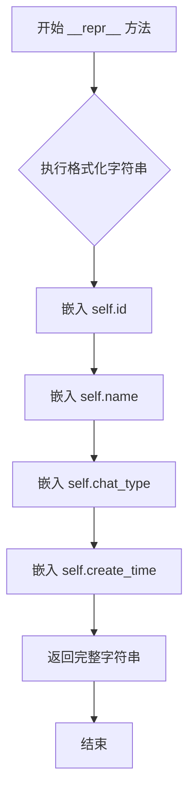

# `Langchain-Chatchat\libs\chatchat-server\chatchat\server\db\models\conversation_model.py` 详细设计文档

该代码定义了一个名为 ConversationModel 的 SQLAlchemy ORM 模型类，用于映射数据库中的 conversation 表，存储聊天会话的基本信息，包括会话ID、名称、类型及创建时间。

## 整体流程

```mermaid
graph TD
    A[开始] --> B[定义 ConversationModel 类]
B --> C[继承 Base 基类]
C --> D[设置类属性 __tablename__ = 'conversation']
D --> E[定义字段: id (String, 主键)]
E --> F[定义字段: name (String)]
F --> G[定义字段: chat_type (String)]
G --> H[定义字段: create_time (DateTime)]
H --> I[定义方法: __repr__]
I --> J[结束/等待ORM映射]
```

## 类结构

```
Base (chatchat.server.db.base)
└── ConversationModel
```

## 全局变量及字段


### `Base`
    
SQLAlchemy declarative base class, 所有数据库模型的基类

类型：`Base`
    


### `Column`
    
SQLAlchemy列构造器, 用于定义数据库表列

类型：`Column`
    


### `String`
    
SQLAlchemy字符串类型, 用于定义可变长度字符串列

类型：`String`
    


### `DateTime`
    
SQLAlchemy日期时间类型, 用于定义时间戳列

类型：`DateTime`
    


### `func`
    
SQLAlchemy函数对象, 用于设置列的默认值(如当前时间)

类型：`func`
    


### `JSON`
    
SQLAlchemy JSON类型, 用于存储JSON数据(本代码中未使用)

类型：`JSON`
    


### `Integer`
    
SQLAlchemy整数类型, 用于定义整数列(本代码中未使用)

类型：`Integer`
    


### `ConversationModel.__tablename__`
    
数据库表名, 值为'conversation'

类型：`str`
    


### `ConversationModel.id`
    
对话框唯一标识符, 32位字符串主键

类型：`String(32)`
    


### `ConversationModel.name`
    
对话框名称, 最长50个字符

类型：`String(50)`
    


### `ConversationModel.chat_type`
    
聊天类型, 如群聊、私聊等

类型：`String(50)`
    


### `ConversationModel.create_time`
    
会话创建时间, 默认值为当前时间

类型：`DateTime`
    
    

## 全局函数及方法


### `ConversationModel.__repr__`

返回模型的字符串描述，用于在调试和日志中直观地显示对话模型实例的基本信息。

参数：

- `self`：实例本身，无需显式传递

返回值：`str`，返回一个格式化的字符串，包含对话的ID、名称、聊天类型和创建时间，格式为 `<Conversation(id='{id}', name='{name}', chat_type='{chat_type}', create_time='{create_time}')>`

#### 流程图



#### 带注释源码

```python
def __repr__(self):
    """
    返回模型的字符串表示形式
    
    Returns:
        str: 包含对话基本信息的格式化字符串
    """
    # 使用 f-string 格式化字符串，将对象的属性值嵌入到字符串中
    # 格式: <Conversation(id='{id}', name='{name}', chat_type='{chat_type}', create_time='{create_time}')>
    return f"<Conversation(id='{self.id}', name='{self.name}', chat_type='{self.chat_type}', create_time='{self.create_time}')>"
```

## 关键组件


### ConversationModel

聊天记录模型类，用于存储和管理聊天对话的基本信息，采用SQLAlchemy ORM框架与数据库进行映射交互。

### id 字段

对话框唯一标识符，使用32位字符串类型，作为表的主键，用于唯一标识每个对话会话。

### name 字段

对话框名称字段，50位字符串类型，用于存储对话的标题或名称，便于用户识别和区分不同的对话。

### chat_type 字段

聊天类型字段，50位字符串类型，用于区分不同类型的聊天场景（如单聊、群聊、客服等）。

### create_time 字段

创建时间字段，DateTime类型，使用数据库函数func.now()自动记录对话创建的时间戳。

### __tablename__ 属性

数据库表名定义，将模型映射到名为"conversation"的数据库表。

### __repr__ 方法

模型实例的字符串表示方法，返回包含对话ID、名称、类型和创建时间的格式化字符串，便于调试和日志输出。


## 问题及建议


### 已知问题

- **主键生成策略不明确**：使用String(32)作为主键类型，但未定义ID生成策略，可能导致ID冲突或不符合预期格式
- **缺少用户关联字段**：模型未包含user_id等字段，无法实现多用户场景下的对话隔离与权限管理
- **索引缺失**：chat_type、create_time等常用查询字段未建立索引，高并发查询时性能可能受限
- **缺少更新时间字段**：只有create_time创建时间，缺少update_time更新时间和is_deleted软删除字段
- **JSON字段未使用**：导入了JSON类型但未使用，猜测用于存储扩展信息但未实现
- **字段长度缺乏验证**：String字段未设置合理的max_length限制或枚举值约束，chat_type无类型校验

### 优化建议

- **明确ID生成策略**：使用UUID或自定义ID生成器，确保32位字符串的唯一性和有序性
- **补充用户关联**：添加user_id字段并建立索引，支持多用户对话管理
- **增加索引**：为chat_type、create_time等高频查询字段添加索引，提升查询性能
- **完善时间字段**：添加update_time字段，使用timezone-aware的datetime类型
- **实现软删除**：添加is_deleted字段实现逻辑删除，避免物理删除导致数据丢失
- **扩展JSON字段**：使用JSON类型存储对话配置、元数据或自定义属性
- **添加字段校验**：使用SQLAlchemy的validators或枚举类型限制chat_type等字段的取值范围
- **补充业务字段**：考虑添加description、summary等常用对话属性字段

## 其它


### 设计目标与约束

本模型旨在为聊天系统提供会话数据持久化能力，通过SQLAlchemy ORM框架实现与数据库的交互。设计遵循以下约束：主键ID采用32位字符串格式，会话名称限制在50字符内，聊天类型字段长度为50字符，创建时间自动记录。

### 错误处理与异常设计

数据库操作可能引发的异常包括：ConnectionError（数据库连接失败）、IntegrityError（数据完整性约束冲突，如重复的主键ID）、DataError（数据类型不匹配）。调用方应捕获SQLAlchemy的DatabaseError异常，并针对具体错误码进行相应处理。建议在业务层封装统一的数据库操作接口，实现异常转换和日志记录。

### 数据流与状态机

该模型为静态数据模型，不涉及复杂的状态机逻辑。数据流主要涉及创建（CREATE）、读取（READ）、更新（UPDATE）、删除（DELETE）四个基本操作。创建时由数据库自动生成create_time时间戳；读取时通过ORM查询返回会话对象；更新时需注意name和chat_type字段的修改；删除时需级联处理关联的聊天消息数据。

### 外部依赖与接口契约

核心依赖包括SQLAlchemy ORM框架和chatchat.server.db.base.Base基类。接口契约方面：id字段为字符串类型且必须唯一；name字段支持空值；chat_type字段需与系统定义的聊天类型枚举值保持一致；create_time字段为只读，由数据库自动维护。外部模块通过ORM查询接口与会话数据进行交互。

### 性能考量与优化建议

当前设计存在优化空间：id字段使用String(32)类型作为主键，相比自增整数主键会增加索引存储开销且查询性能略低；缺少常用查询字段的索引，如chat_type和create_time的联合索引；未定义外键关联，若后续需要关联用户表或消息表需额外设计。建议在数据量增长后评估是否需要添加索引或调整主键策略。

### 数据库表结构详情

表名：conversation
字符集：继承自数据库默认配置
存储引擎：继承自数据库默认配置
索引：主键id已自动创建唯一索引
</content]
    