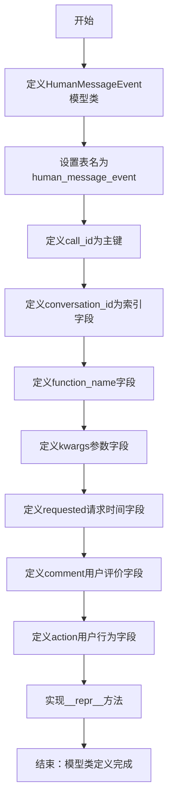

# `Langchain-Chatchat\libs\chatchat-server\chatchat\server\db\models\human_message_event.py` 详细设计文档

这是一个SQLAlchemy ORM模型类，用于在数据库中存储人类反馈消息事件，包括聊天记录ID、对话框ID、函数名、请求参数、请求时间、用户评价和用户行为等关键信息，支持通过call_id主键进行唯一标识和查询。

## 整体流程



## 类结构

```
Base (SQLAlchemy基类)
└── HumanMessageEvent (人类反馈消息事件模型)
```

## 全局变量及字段


### `HumanMessageEvent.call_id`
    
聊天记录ID，主键

类型：`String(32)`
    


### `HumanMessageEvent.conversation_id`
    
对话框ID，带索引

类型：`String(32)`
    


### `HumanMessageEvent.function_name`
    
Function Name

类型：`String(50)`
    


### `HumanMessageEvent.kwargs`
    
parameters，参数

类型：`String(4096)`
    


### `HumanMessageEvent.requested`
    
请求时间，默认当前时间

类型：`DateTime`
    


### `HumanMessageEvent.comment`
    
用户评价

类型：`String(4096)`
    


### `HumanMessageEvent.action`
    
用户行为

类型：`String(50)`
    


### `HumanMessageEvent.__repr__`
    
返回模型的字符串表示形式

类型：`method`
    
    

## 全局函数及方法


### `HumanMessageEvent.__repr__`

返回模型的字符串表示形式

参数：

- （无显式参数，仅隐含 `self` 参数）

返回值：`string`，返回模型的字符串表示形式

#### 流程图

```mermaid
flowchart TD
    A[开始 __repr__] --> B[拼接字符串: id='{self.call_id}']
    B --> C[拼接字符串: conversation_id='{self.conversation_id}']
    C --> D[拼接字符串: function_name='{self.function_name}']
    D --> E[拼接字符串: kwargs='{self.kwargs}']
    E --> F[拼接字符串: requested='{self.requested}']
    F --> G[拼接字符串: comment='{self.comment}']
    G --> H[拼接字符串: action='{self.action}']
    H --> I[返回完整字符串: <human_message_event(...)>]
    I --> J[结束]
```

#### 带注释源码

```python
def __repr__(self):
    """
    返回模型的字符串表示形式
    
    Returns:
        string: 包含HumanMessageEvent所有字段值的可读字符串
    """
    # 使用 f-string 格式化字符串，返回类的字符串表示
    # 格式: <human_message_event(id='...', conversation_id='...', ...)>
    return (f"<human_message_event(id='{self.call_id}', conversation_id='{self.conversation_id}', "
            f"function_name='{self.function_name}', kwargs='{self.kwargs}', "
            f"requested='{self.requested}', comment='{self.comment}', action='{self.action}')>")
```

## 关键组件


### HumanMessageEvent 类

核心ORM模型类，继承自SQLAlchemy的Base，用于映射数据库中的`human_message_event`表结构，存储人类反馈消息事件的完整信息。

### call_id 主键字段

字符串类型主键，存储聊天记录ID，长度32字符，用于唯一标识每条消息事件记录。

### conversation_id 对话框索引字段

字符串类型字段，存储对话框ID并建有索引，用于快速查询特定对话的所有消息事件记录。

### function_name 函数名字段

字符串类型字段，存储被调用或关联的Function名称，用于追踪用户反馈涉及的函数操作。

### kwargs 参数存储字段

字符串类型字段，最大4096字符，用于以JSON字符串形式存储请求参数和额外参数信息。

### requested 请求时间字段

DateTime类型字段，使用`func.now()`作为默认值，自动记录消息事件的请求时间，支持时间序查询。

### comment 用户评价字段

字符串类型字段，最大4096字符，存储用户对消息或交互的文本评价内容。

### action 用户行为字段

字符串类型字段，记录用户执行的具体行为动作，如"like"、"dislike"、"report"等。

### Base 继承关系

从`chatchat.server.db.base`导入的Base类，提供SQLAlchemy ORM的核心功能，包括表映射、会话管理、属性定义等基础设施支持。


## 问题及建议


### 已知问题

- **未使用的导入**：代码中导入了 `JSON` 和 `Integer` 类型，但在类定义中未使用，增加了不必要的依赖。
- **字符串长度限制不足**：`call_id` 和 `conversation_id` 使用 `String(32)`，对于 UUID 等格式的 ID 可能长度不够；`kwargs` 和 `comment` 使用 `String(4096)` 存储复杂参数或长文本可能溢出。
- **kwargs 存储方式不当**：将参数以字符串形式存储在 `String(4096)` 字段中，而非使用 JSON 类型或 Text 类型，不利于结构化数据的查询和维护。
- **缺少常用审计字段**：缺少 `created_at`（创建时间）和 `updated_at`（更新时间）等常见审计字段，无法追踪记录的变更历史。
- **索引设计不完整**：仅对 `conversation_id` 建立了索引，但 `requested` 字段（请求时间）常用于时间范围查询，应该建立索引或考虑复合索引。
- **约束定义不清晰**：`conversation_id` 设置了 `default=None` 但未明确是否为 `nullable`，语义不够清晰。
- **__repr__ 方法冗余**：在 `__repr__` 中包含 `kwargs` 和 `comment` 字段可能导致输出过长，且这些敏感信息不适合在调试信息中完整展示。
- **缺少业务状态字段**：没有状态字段来标识事件处理状态（如已处理/未处理），限制了业务扩展能力。
- **缺乏数据验证机制**：没有使用 Pydantic 或 SQLAlchemy 的验证器来确保数据的合法性和完整性。

### 优化建议

- 移除未使用的 `JSON` 和 `Integer` 导入，或将 `kwargs` 字段改为使用 `JSON` 类型以支持结构化存储。
- 扩大字符串字段长度：`call_id` 和 `conversation_id` 改为 `String(64)` 或更长；`kwargs` 和 `comment` 考虑使用 `Text` 类型以支持更大文本。
- 添加审计字段：引入 `created_at` 和 `updated_at` 字段，使用 `func.now()` 作为默认值，并可为 `created_at` 添加索引。
- 明确字段约束：为 `conversation_id` 明确 `nullable=True` 或 `nullable=False`；考虑为 `function_name` 添加 `nullable=False` 约束。
- 优化 `__repr__` 方法：移除 `kwargs` 和 `comment` 字段的完整展示，仅展示摘要或完全移除这些字段以避免信息泄露。
- 考虑添加业务状态字段：如 `status` 字段用于标记处理状态，添加相应的索引以支持状态查询。
- 实现数据验证：使用 SQLAlchemy 的验证器或结合 Pydantic 模型进行输入验证，确保数据完整性。

## 其它


### 设计目标与约束

本模型旨在存储人类反馈消息事件，用于记录用户与系统交互过程中的评价和行为数据。设计约束包括：call_id作为主键必须唯一；conversation_id用于支持多对话查询而设置索引；kwargs和comment字段限制在4096字符内以控制存储空间；requested字段使用数据库默认时间函数确保时区一致性。

### 错误处理与异常设计

本模型主要涉及数据库层面的异常处理。常见的异常包括：IntegrityError（主键冲突时抛出）、DataError（字段长度超限）、ConnectionError（数据库连接失败）。ORM操作层面应捕获SQLAlchemy的DatabaseError并转换为业务异常，建议在服务层统一处理数据库异常并记录错误日志。

### 数据流与状态机

数据流路径：用户提交反馈 → 服务层接收请求 → 创建HumanMessageEvent实例 → ORM提交到数据库 → 返回结果。状态机方面：本模型不涉及复杂状态转换，action字段用于记录用户行为类型，可作为简单状态标识（如"like"、"dislike"、"report"等枚举值）。

### 外部依赖与接口契约

本模型依赖SQLAlchemy ORM框架和chatchat.server.db.base模块中的Base类。接口契约方面：调用方需提供call_id（必填）、conversation_id（可选）、function_name（必填）、kwargs（可选）、comment（可选）、action（可选）。数据库表创建由SQLAlchemy的create_all()或alembic迁移管理。

### 性能考虑与优化

性能优化点：conversation_id字段已建立索引以支持按对话查询；对于高频查询字段可考虑添加复合索引；kwargs字段存储JSON字符串，建议最大长度控制在4096以内以避免行过长导致的性能问题；如数据量过大，可考虑定期归档历史数据或使用分表策略。

### 安全性考虑

安全性措施：kwargs和comment字段存储用户输入内容，需在业务层进行XSS过滤和特殊字符转义；String类型字段应设置最大长度防止缓冲区溢出；数据库连接应使用参数化查询防止SQL注入；敏感日志需脱敏处理。

### 事务处理

本模型涉及单表操作，事务管理相对简单。服务层创建记录时应使用session的add()和commit()方法，失败时使用rollback()回滚。对于批量插入场景，建议使用bulk_insert_mappings()或bulk_save_objects()提高性能，同时确保事务的原子性。

### 索引策略

当前已为conversation_id字段创建索引以支持按对话查询。建议根据实际查询场景考虑：若经常按function_name+requested组合查询，可创建复合索引；若需按时间段统计，可考虑对requested字段创建索引或使用分区表。

### 数据库迁移策略

建议使用Alembic进行数据库版本管理。初始迁移应包含：创建human_message_event表、设置主键和索引、添加字段注释。后续字段变更（如增加新行为类型）应通过迁移脚本完成，避免直接修改生产环境数据库表结构。

### 测试策略

单元测试应覆盖：模型实例创建与属性赋值、__repr__方法输出格式、字段默认值设置、字符串字段长度限制。集成测试应验证：数据库表创建、CRUD操作、索引生效情况、事务回滚机制。建议使用内存数据库SQLite进行单元测试，MySQL/PostgreSQL进行集成测试。

### 部署注意事项

部署时需确保：数据库用户具有CREATE TABLE权限；生产环境配置连接池参数；开启慢查询日志监控性能；定期检查表大小和索引使用率；备份策略应覆盖此表数据。

### 监控与日志

建议监控指标：表记录数增长趋势、写入QPS、查询响应时间、慢查询日志。日志记录要点：记录写入失败的操作详情、记录关键查询的SQL语句（调试模式）、记录异常堆栈信息便于问题排查。


    