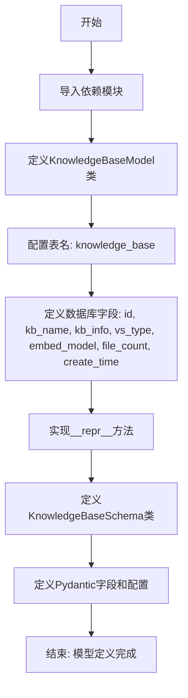
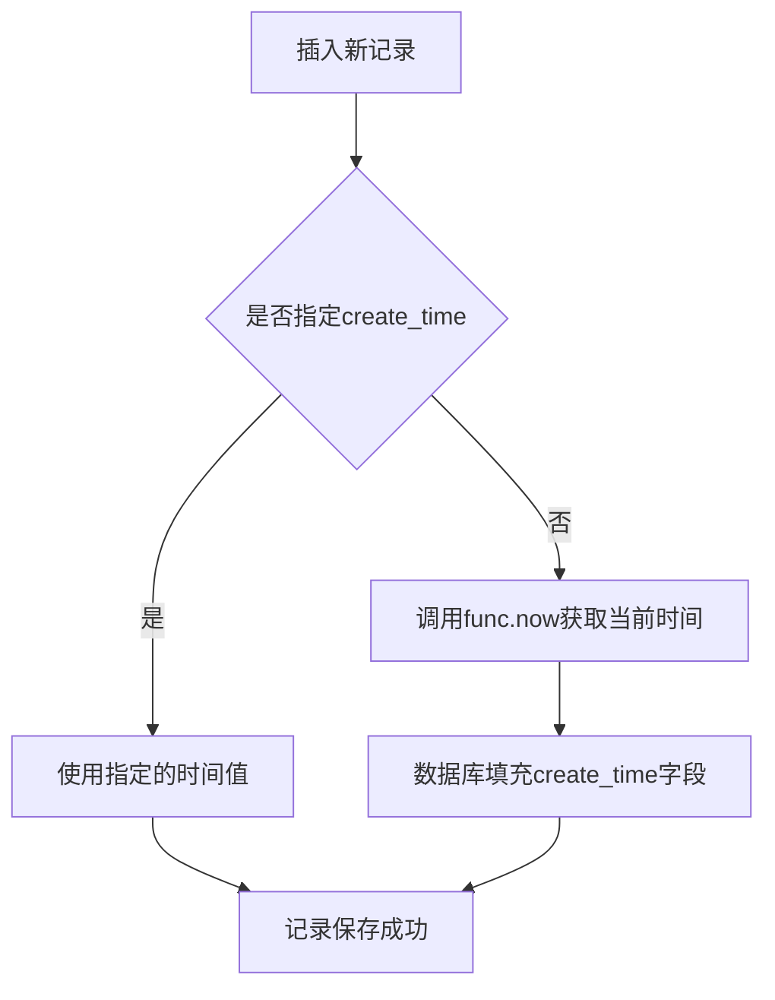
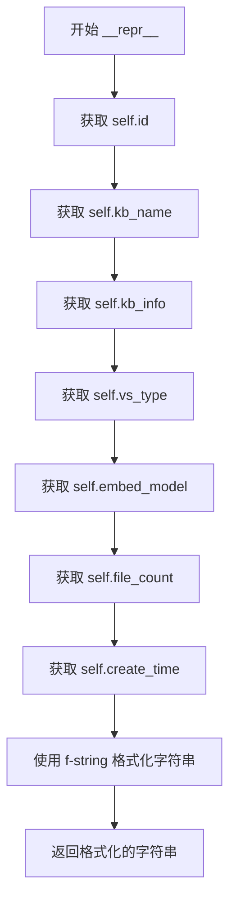
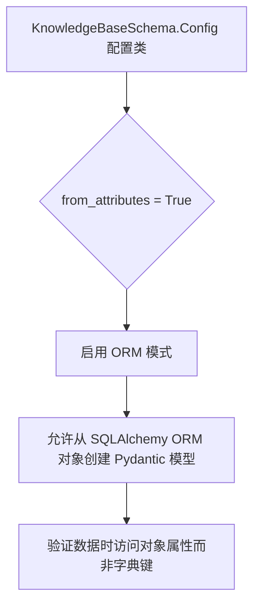

# `Langchain-Chatchat\libs\chatchat-server\chatchat\server\db\models\knowledge_base_model.py` 详细设计文档

该文件定义了知识库(Knowledge Base)的数据库模型和数据验证模式,使用SQLAlchemy ORM映射数据库表结构,并使用Pydantic进行数据序列化和验证,支持知识库的创建、更新和查询操作。

## 整体流程



## 类结构

```
KnowledgeBaseModel (SQLAlchemy ORM模型)
└── 继承自: Base (chatchat.server.db.base)

KnowledgeBaseSchema (Pydantic数据模型)
└── 继承自: BaseModel (pydantic)
```

## 全局变量及字段


### `Base`
    
从chatchat.server.db.base导入的SQLAlchemy基类,用于定义ORM模型

类型：`SQLAlchemy Base class`
    


### `KnowledgeBaseModel`
    
知识库数据库模型类,对应knowledge_base表

类型：`SQLAlchemy ORM class`
    


### `KnowledgeBaseSchema`
    
知识库Pydantic数据验证模式类,用于API请求响应

类型：`Pydantic BaseModel class`
    


### `KnowledgeBaseModel.id`
    
知识库ID,主键自增

类型：`Integer`
    


### `KnowledgeBaseModel.kb_name`
    
知识库名称

类型：`String(50)`
    


### `KnowledgeBaseModel.kb_info`
    
知识库简介(用于Agent)

类型：`String(200)`
    


### `KnowledgeBaseModel.vs_type`
    
向量库类型

类型：`String(50)`
    


### `KnowledgeBaseModel.embed_model`
    
嵌入模型名称

类型：`String(50)`
    


### `KnowledgeBaseModel.file_count`
    
文件数量,默认0

类型：`Integer`
    


### `KnowledgeBaseModel.create_time`
    
创建时间,默认当前时间

类型：`DateTime`
    


### `KnowledgeBaseModel.__repr__`
    
返回知识库的字符串表示

类型：`method`
    


### `KnowledgeBaseSchema.id`
    
知识库ID

类型：`int`
    


### `KnowledgeBaseSchema.kb_name`
    
知识库名称

类型：`str`
    


### `KnowledgeBaseSchema.kb_info`
    
知识库简介

类型：`Optional[str]`
    


### `KnowledgeBaseSchema.vs_type`
    
向量库类型

类型：`Optional[str]`
    


### `KnowledgeBaseSchema.embed_model`
    
嵌入模型名称

类型：`Optional[str]`
    


### `KnowledgeBaseSchema.file_count`
    
文件数量

类型：`Optional[int]`
    


### `KnowledgeBaseSchema.create_time`
    
创建时间

类型：`Optional[datetime]`
    


### `KnowledgeBaseSchema.Config`
    
Pydantic配置类,配置from_attributes为True以支持ORM验证

类型：`Pydantic Config class`
    
    

## 全局函数及方法


### `func.now`

`func.now()` 是 SQLAlchemy 的一个函数对象，用于在数据库层面获取当前时间戳，常作为列的默认值，在插入新记录时自动填充创建时间。

参数：
- 该函数无参数

返回值：`datetime`，返回当前数据库服务器的日期和时间

#### 流程图



#### 带注释源码

```python
# 从 SQLAlchemy 导入 func 对象
from sqlalchemy import func

# 在 KnowledgeBaseModel 类中定义 create_time 列
create_time = Column(
    DateTime,                                      # 列类型为日期时间
    default=func.now(),                            # 默认值为当前数据库时间（调用func.now()）
    comment="创建时间"                             # 字段注释
)

# func.now() 的本质：
# - func 是一个 SQLAlchemy 提供的函数构造器
# - func.now() 会在 SQL 层面生成 NOW() 函数调用
# - 当插入新行且未指定 create_time 值时，数据库会自动调用 NOW() 获取当前时间
# - 生成的 SQL 类似: CREATE TABLE knowledge_base (... create_time DATETIME DEFAULT NOW())
```


### `KnowledgeBaseModel.__repr__`

返回知识库的字符串表示，用于调试和日志输出。当打印知识库对象或使用 repr() 函数时自动调用，提供人类可读的对象描述信息。

参数：

- `self`：`KnowledgeBaseModel`，知识库模型实例本身，无需显式传递

返回值：`str`，返回一个格式化的字符串，包含知识库的 ID、名称、简介、向量库类型、嵌入模型、文件数量和创建时间

#### 流程图



#### 带注释源码

```python
def __repr__(self):
    """
    返回知识库的字符串表示
    
    Returns:
        str: 包含知识库详细信息的格式化字符串
    """
    # 使用 f-string 格式化字符串，拼接知识库的各个属性
    # 包括：id、kb_name、kb_info、vs_type、embed_model、file_count、create_time
    return f"<KnowledgeBase(id='{self.id}', kb_name='{self.kb_name}',kb_intro='{self.kb_info} vs_type='{self.vs_type}', embed_model='{self.embed_model}', file_count='{self.file_count}', create_time='{self.create_time}')>"
```


### `KnowledgeBaseSchema.Config`

Pydantic 模型配置类，用于配置 `KnowledgeBaseSchema` 模型的行为，允许从 ORM 对象（如 SQLAlchemy 模型）验证和创建 Pydantic 实例。

参数：

- 无传统函数参数（这是一个内部配置类，通过类属性进行配置）

返回值：无返回值（配置类不返回任何值，仅用于 Pydantic 模型配置）

#### 流程图



#### 带注释源码

```python
class Config:
    """
    Pydantic 模型配置类
    用于配置 KnowledgeBaseSchema 模型的验证和序列化行为
    """
    
    from_attributes = True  # 启用 ORM 模式，允许从 ORM 对象（如 SQLAlchemy 模型实例）
                            # 直接验证和创建 Pydantic 模型。
                            # 这意味着验证器可以访问对象的属性（.属性名）而非字典键
```

---

### 补充说明

| 项目 | 说明 |
|------|------|
| **配置类作用** | 在 Pydantic v1 中，`class Config` 用于定义模型级别的配置选项 |
| **from_attributes 含义** | 设为 `True` 时，Pydantic 会从 ORM 对象的属性中读取数据进行验证，而不仅仅依赖 `__dict__` |
| **与 ORM 集成** | 此配置使得 `KnowledgeBaseSchema` 可以直接接收 `KnowledgeBaseModel` 的实例进行验证，无需手动转换为字典 |
| **Pydantic 版本注意** | 在 Pydantic v2 中，推荐使用 `model_config = ConfigDict(from_attributes=True)` 替代 `class Config` 方式 |

## 关键组件


### 知识库ORM模型 (KnowledgeBaseModel)

SQLAlchemy 数据库模型类，对应 `knowledge_base` 数据表，封装知识库的基本属性与数据库映射关系

### 知识库Schema模型 (KnowledgeBaseSchema)

Pydantic 数据验证模型，用于API请求/响应的数据序列化和字段校验，支持从ORM实例自动推断属性

### 知识库ID字段 (id)

整数类型主键，自增策略，标识知识库的唯一性

### 知识库名称字段 (kb_name)

字符串类型，存储知识库的显示名称，最大长度50字符

### 知识库简介字段 (kb_info)

字符串类型，可选字段，用于Agent场景下的知识库描述，最大长度200字符

### 向量库类型字段 (vs_type)

字符串类型，可选字段，指定所使用的向量库实现（如faiss、milvus等）

### 嵌入模型字段 (embed_model)

字符串类型，可选字段，指定知识库所使用的嵌入模型名称

### 文件数量字段 (file_count)

整数类型，记录知识库中已入库的文件总数，默认值为0

### 创建时间字段 (create_time)

DateTime类型，记录知识库的创建时间，使用数据库函数自动生成时间戳


## 问题及建议


### 已知问题

-   **字段长度定义不一致**：数据库模型中 `kb_info` 限制为 200 字符，但 Pydantic Schema 中 `kb_info: Optional[str]` 无长度限制，可能导致数据验证不一致
-   **`__repr__` 方法存在错误**：方法中使用 `kb_intro` 字段名，但实际定义的字段是 `kb_info`，会导致属性访问错误
-   **缺少必要的数据库索引**：知识库名称 `kb_name` 作为关键查询字段，未定义索引，可能影响查询性能
-   **可选字段处理不一致**：`file_count` 在数据库模型有默认值 0，但在 Pydantic Schema 中为 `Optional[int]`，语义表达不一致
-   **缺少表级别配置**：未定义 `__table_args__`，无法设置索引、约束等表级配置
-   **时区处理缺失**：`create_time` 使用 `func.now()` 未考虑时区问题，可能导致时间显示不准确

### 优化建议

-   修正 `__repr__` 方法中的 `kb_intro` 为 `kb_info`
-   在 `kb_name` 字段上添加索引：`__table_args__ = (Index('idx_kb_name', 'kb_name'),)`
-   统一 Pydantic Schema 与数据库模型的字段约束，如为 `kb_info` 添加 `Field(max_length=200)` 验证
-   考虑为 `vs_type` 和 `embed_model` 使用枚举类型（Enum）限制可选值，增强类型安全性
-   将 `file_count` 在 Schema 中改为 `int = 0`，明确默认值
-   考虑添加软删除字段（如 `is_deleted`、`deleted_at`）和审计字段（`update_time`）
-   如业务需要，可添加外键关联定义文档/文件表的一对多关系
-   考虑使用 `datetime.now(timezone.utc)` 替代 `func.now()` 以支持时区


## 其它


### 设计目标与约束

本代码的设计目标是定义知识库（Knowledge Base）的基础数据模型，用于持久化存储知识库的基本信息，包括名称、简介、向量库类型、嵌入模型等核心元数据。约束条件包括：kb_name字段限制为50字符，kb_info字段限制为200字符，vs_type和embed_model字段限制为50字符，file_count字段默认为0且非负，创建时间自动记录。

### 错误处理与异常设计

本模型层代码主要涉及数据库操作和数据验证。数据库层面的错误（如连接失败、唯一约束冲突）由SQLAlchemy框架抛出，可通过数据库事务回滚处理。Pydantic模型在数据验证失败时会抛出ValidationError，需要在调用处进行捕获。kb_name为必填字段，若为空会导致验证失败；可选字段如kb_info、vs_type等可为None。

### 数据流与状态机

数据流主要分为两类：1）创建知识库时，前端提交数据经过KnowledgeBaseSchema验证后，由ORM写入数据库；2）查询知识库时，从数据库加载的ORM对象可直接序列化为KnowledgeBaseResponse返回给前端。该模型不涉及复杂的状态机，知识库创建后可通过update操作修改除id和create_time外的所有字段。

### 外部依赖与接口契约

本模块依赖以下外部包：sqlalchemy（数据库ORM）、pydantic（数据验证与序列化）、chatchat.server.db.base（基础表结构）。对内接口方面，KnowledgeBaseModel供DAO层或Repository层调用，KnowledgeBaseSchema供API层作为请求/响应模型使用。数据库表名为knowledge_base，需确保该表在数据库迁移时正确创建。

### 安全性考虑

kb_name和kb_info字段存储用户输入内容，需在API层进行XSS过滤和输入校验。数据库连接应使用配置化的凭据，避免硬编码。敏感信息不建议存储在本模型中。file_count字段为内部计算字段，需防止越权修改。

### 性能考虑

建议在kb_name字段上创建唯一索引以提升查询性能并保证唯一性。create_time字段可根据查询需求考虑是否创建索引。当前模型无分表需求，数据量较大时可考虑按create_time进行分区。embed_model和vs_type字段频繁用于筛选查询，建议建立适当索引。

### 兼容性考虑

KnowledgeBaseSchema配置了from_attributes=True以支持从ORM对象直接验证。字段类型使用Python标准库类型（datetime、Optional等），与Pydantic v1/v2均有兼容性。未来字段变更应采用向后兼容的迁移策略，如添加可选字段而非修改必填字段。

### 测试策略

单元测试应覆盖：1）KnowledgeBaseSchema的必填字段验证；2）字段长度限制验证；3）Optional字段为None时的序列化；4）datetime字段格式转换。集成测试应覆盖：1）ORM模型与数据库的CRUD操作；2）事务回滚场景；3）唯一约束冲突场景。建议使用SQLite内存数据库进行单元测试。

### 部署注意事项

部署时需确保：1）数据库迁移工具正确执行knowledge_base表的创建；2）数据库用户具有该表的CREATE、READ、UPDATE、DELETE权限；3）确认SQLAlchemy版本与数据库驱动兼容。当前代码未包含索引创建语句，建议在迁移脚本中添加。

### 监控与日志

建议在DAO层记录关键操作日志：创建知识库时记录kb_name和操作者；修改知识库时记录变更字段；删除知识库时记录id和操作时间。数据库慢查询监控应关注基于kb_name的查询和基于create_time的范围查询。


    