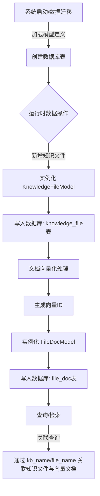
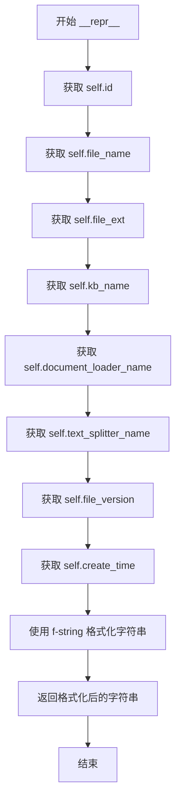
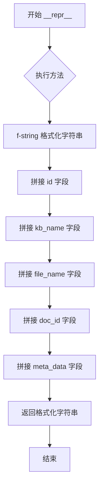

# `Langchain-Chatchat\libs\chatchat-server\chatchat\server\db\models\knowledge_file_model.py` 详细设计文档

该代码定义了知识库系统的两个核心SQLAlchemy数据模型：KnowledgeFileModel用于持久化管理知识文件的元数据（如文件名、扩展名、知识库名、分割器配置、版本等），FileDocModel用于维护文件与向量数据库中文档的映射关系及自定义元数据。

## 整体流程



## 类结构

```
Base (chatchat.server.db.base)
├── KnowledgeFileModel (知识文件模型)
└── FileDocModel (文件-向量映射模型)
```

## 全局变量及字段


### `Base`
    
所有SQLAlchemy ORM模型的基类，继承自declarative_base()

类型：`SQLAlchemy ORM 基类`
    


### `Column`
    
SQLAlchemy中用于定义表列的函数

类型：`列定义`
    


### `Integer`
    
SQLAlchemy整数类型，对应数据库的INT

类型：`整数类型`
    


### `String`
    
SQLAlchemy字符串类型，对应数据库的VARCHAR

类型：`字符串类型`
    


### `Float`
    
SQLAlchemy浮点数类型，对应数据库的FLOAT

类型：`浮点类型`
    


### `Boolean`
    
SQLAlchemy布尔类型，对应数据库的BOOLEAN

类型：`布尔类型`
    


### `DateTime`
    
SQLAlchemy日期时间类型，对应数据库的DATETIME

类型：`日期时间类型`
    


### `JSON`
    
SQLAlchemy JSON类型，用于存储JSON格式数据

类型：`JSON类型`
    


### `func`
    
SQLAlchemy中用于调用数据库聚合函数的模块

类型：`SQL函数聚合`
    


### `KnowledgeFileModel.id`
    
知识文件ID，主键自增

类型：`Integer`
    


### `KnowledgeFileModel.file_name`
    
文件名

类型：`String`
    


### `KnowledgeFileModel.file_ext`
    
文件扩展名

类型：`String`
    


### `KnowledgeFileModel.kb_name`
    
所属知识库名称

类型：`String`
    


### `KnowledgeFileModel.document_loader_name`
    
文档加载器名称

类型：`String`
    


### `KnowledgeFileModel.text_splitter_name`
    
文本分割器名称

类型：`String`
    


### `KnowledgeFileModel.file_version`
    
文件版本

类型：`Integer`
    


### `KnowledgeFileModel.file_mtime`
    
文件修改时间

类型：`Float`
    


### `KnowledgeFileModel.file_size`
    
文件大小

类型：`Integer`
    


### `KnowledgeFileModel.custom_docs`
    
是否自定义docs

类型：`Boolean`
    


### `KnowledgeFileModel.docs_count`
    
切分文档数量

类型：`Integer`
    


### `KnowledgeFileModel.create_time`
    
创建时间

类型：`DateTime`
    


### `FileDocModel.id`
    
ID，主键自增

类型：`Integer`
    


### `FileDocModel.kb_name`
    
知识库名称

类型：`String`
    


### `FileDocModel.file_name`
    
文件名称

类型：`String`
    


### `FileDocModel.doc_id`
    
向量库文档ID

类型：`String`
    


### `FileDocModel.meta_data`
    
元数据

类型：`JSON`
    
    

## 全局函数及方法


### `KnowledgeFileModel.__repr__`

该方法返回知识文件模型的可读字符串表示，用于在调试和日志输出时直观地展示 KnowledgeFileModel 对象的关键属性信息。

参数：

- `self`：`KnowledgeFileModel`，表示当前 KnowledgeFileModel 类的实例对象，隐式参数无需显式传递

返回值：`str`，返回一个格式化的字符串，包含知识文件模型的主要属性（id、file_name、file_ext、kb_name、document_loader_name、text_splitter_name、file_version、create_time），用于调试和日志输出

#### 流程图



#### 带注释源码

```python
def __repr__(self):
    """
    返回知识文件模型的可读字符串表示
    
    Returns:
        str: 包含模型关键属性的格式化字符串，用于调试和日志输出
    """
    # 使用 f-string 格式化字符串，包含知识文件的核心属性
    # 格式: <KnowledgeFile(id='xxx', file_name='xxx', ...)>'
    return f"<KnowledgeFile(id='{self.id}', file_name='{self.file_name}', file_ext='{self.file_ext}', kb_name='{self.kb_name}', document_loader_name='{self.document_loader_name}', text_splitter_name='{self.text_splitter_name}', file_version='{self.file_version}', create_time='{self.create_time}')>"
```


### `FileDocModel.__repr__`

返回 FileDocModel 实例的可读字符串表示，用于调试和日志输出。

参数：

- `self`：`FileDocModel`，表示当前 FileDocModel 实例对象

返回值：`str`，返回包含实例关键字段（id、kb_name、file_name、doc_id、meta_data）的格式化字符串，便于调试和日志查看。

#### 流程图



#### 带注释源码

```python
def __repr__(self):
    """
    返回模型的可读字符串表示
    
    Returns:
        str: 包含模型关键字段的格式化字符串，格式为：
             <FileDoc(id='xxx', kb_name='xxx', file_name='xxx', doc_id='xxx', metadata='xxx')>
    """
    # 使用 f-string 格式化字符串，返回模型的字符串表示
    # 包含关键字段：id、kb_name、file_name、doc_id、meta_data
    return f"<FileDoc(id='{self.id}', kb_name='{self.kb_name}', file_name='{self.file_name}', doc_id='{self.doc_id}', metadata='{self.meta_data}')>"
```

## 关键组件


### 知识文件模型 (KnowledgeFileModel)

用于存储知识库中文件元数据的数据库模型，包含文件名、扩展名、知识库名称、文档加载器、文本分割器、版本信息、修改时间、文件大小等核心字段，支持文件版本控制和创建时间追踪。

### 文件-向量库文档关联模型 (FileDocModel)

用于建立文件与向量库文档之间映射关系的数据库模型，通过kb_name、file_name、doc_id和meta_data字段实现文件到向量库文档的关联存储，支持JSON格式的元数据存储。

### 文档计数与切分信息

docs_count字段用于记录文件切分后的文档数量，document_loader_name和text_splitter_name字段分别记录使用的文档加载器和文本分割器，便于追溯文档处理流程。

### 自定义文档标志

custom_docs布尔字段标识该文件是否使用自定义docs，为知识库管理提供灵活性。

### 版本控制机制

file_version整数字段实现文件版本控制，支持知识库文件的更新和版本追踪。


## 问题及建议


### 已知问题

-   **索引缺失**：kb_name 和 file_name 字段在关联查询中频繁使用，但未定义数据库索引，可能导致查询性能问题
-   **可变默认值陷阱**：FileDocModel 中 meta_data 字段使用 default={} 作为默认值，这是 Python 可变对象的常见陷阱，会导致所有记录共享同一字典对象
-   **外键关系未定义**：FileDocModel 与 KnowledgeFileModel 之间存在逻辑外键关系（通过 kb_name 和 file_name 关联），但未使用 SQLAlchemy relationship 定义关系对象，导致无法利用 ORM 的级联操作能力
-   **字段约束不足**：缺少必要的约束条件，如 file_version 应为正整数、file_size 应非负、file_ext 缺乏格式验证
-   **时间字段设计问题**：file_mtime 使用 Float 类型存储时间戳不够直观，且 create_time 依赖数据库函数(func.now())，不利于单元测试
-   **字符串长度硬编码**：document_loader_name 和 text_splitter_name 使用 String(50) 存储，未来扩展性受限，应考虑使用枚举或独立配置表

### 优化建议

-   **添加数据库索引**：在 kb_name 和 file_name 字段上添加索引，提升联合查询性能
-   **修复可变默认值**：将 meta_data 的 default={} 改为 default=dict 或 default=None，并在应用层处理
-   **定义 ORM 关系**：使用 relationship 和 ForeignKey 定义 KnowledgeFileModel 和 FileDocModel 之间的关联关系
-   **增加字段约束**：使用 CheckConstraint 确保 file_version > 0、file_size >= 0，或使用 server_default 设置合理的默认值
-   **优化时间字段**：将 file_mtime 改为 DateTime 类型，create_time 可考虑在应用层生成时间戳以提高可测试性
-   **提取配置实体**：将 document_loader_name 和 text_splitter_name 提取为独立的配置表或枚举类，提高可维护性
-   **补充文档和类型注解**：为类和方法添加 docstring，增加代码可读性和可维护性

## 其它


### 设计目标与约束

本模型旨在为知识库系统提供文件管理和向量库文档关联的数据持久化支持。KnowledgeFileModel负责存储知识库中文件的元数据信息，FileDocModel负责建立文件与向量库文档之间的映射关系。设计约束包括：kb_name字段长度限制为50字符，file_name字段长度限制为255字符，file_ext字段长度限制为10字符，以确保数据库存储效率和查询性能。

### 错误处理与异常设计

数据库操作可能触发以下异常：IntegrityError（唯一性约束冲突，如重复的kb_name+file_name组合）、DataError（数据类型不匹配）、OperationalError（数据库连接异常）。建议在业务层捕获SQLAlchemy的DatabaseError异常，并进行针对性处理。对于外键约束的kb_name字段，应验证对应知识库是否存在后再进行插入操作。

### 数据流与状态机

数据流向：用户上传文件 → KnowledgeFileModel创建文件记录 → 文档加载器处理文件 → 文本分割器切分 → 向量化处理 → FileDocModel创建向量库文档映射记录。文件状态通过file_version字段体现，版本号递增表示文件已更新。custom_docs字段标识文档来源，False表示系统自动处理，True表示用户自定义导入。

### 外部依赖与接口契约

依赖组件包括：SQLAlchemy ORM框架、chatchat.server.db.base.Base基类。KnowledgeFileModel的kb_name字段应与知识库模型（KnowledgeBaseModel）保持外键关联。FileDocModel的doc_id字段应与向量库文档模型保持关联。meta_data字段为JSON类型，用于存储向量库文档的扩展元信息。

### 索引和查询性能考虑

建议在KnowledgeFileModel上创建复合索引(kb_name, file_name)以支持知识库内的文件查询，在FileDocModel上创建复合索引(kb_name, file_name)以支持文件到向量库的关联查询。file_version字段应建立索引以支持版本历史查询。docs_count字段可用于分页查询优化。

### 数据一致性和事务处理

KnowledgeFileModel与FileDocModel之间存在一对多关系，删除KnowledgeFileModel记录时应级联删除对应的FileDocModel记录，或在业务层实现软删除机制。file_mtime和create_time字段使用数据库函数自动生成，确保时间戳一致性。file_version字段的递增操作应在事务中完成，避免并发更新导致版本冲突。

### 版本控制和迁移策略

当前版本为v1.0，建议使用Alembic进行数据库迁移管理。未来可能的字段扩展包括：file_hash（文件哈希值用于去重）、status（文件处理状态）、error_message（错误信息）等。迁移策略应保持向后兼容，避免影响现有数据。

### 安全性和权限控制

file_name字段应进行输入校验，防止路径遍历攻击。kb_name字段应与用户权限模型关联，确保用户只能访问授权的知识库。meta_data字段存储用户自定义数据时需注意敏感信息过滤。custom_docs字段为True时需验证文档内容的合法性。

### 与其他模型的关系

KnowledgeFileModel与知识库模型（KnowledgeBaseModel）通过kb_name字段关联，一对多关系。FileDocModel与向量库文档模型通过doc_id字段关联，一对多关系。同一文件可能产生多个向量库文档（file_version递增时），FileDocModel通过(kb_name, file_name, doc_id)组合确保唯一性。

### 使用示例

```python
# 创建知识文件记录
file_record = KnowledgeFileModel(
    file_name="example.pdf",
    file_ext=".pdf",
    kb_name="tech_docs",
    document_loader_name="PyPDFLoader",
    text_splitter_name="ChineseTextSplitter",
    file_size=1024000,
    file_mtime=1699999999.0
)
session.add(file_record)
session.commit()

# 创建文件-向量库文档映射
doc_mapping = FileDocModel(
    kb_name="tech_docs",
    file_name="example.pdf",
    doc_id="vec_12345",
    meta_data={"page": 1, "chunk_id": 0}
)
session.add(doc_mapping)
session.commit()
```


    