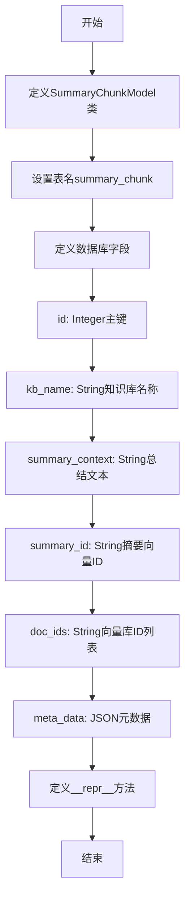
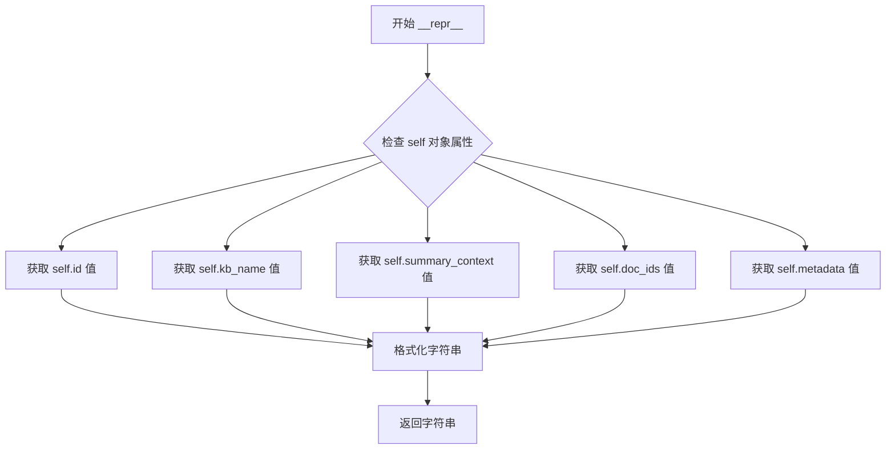

# `Langchain-Chatchat\libs\chatchat-server\chatchat\server\db\models\knowledge_metadata_model.py` 详细设计文档

SummaryChunkModel是一个SQLAlchemy数据库模型类，用于存储知识库中文档的摘要片段信息，包含知识库名称、总结文本、摘要向量ID、向量库ID关联列表及元数据字段，支持知识库管理、文本摘要存储、向量库构建和语义关联分析。

## 整体流程



## 类结构

```
Base (SQLAlchemy基类)
└── SummaryChunkModel (摘要片段模型)
```

## 全局变量及字段


### `SummaryChunkModel.id`
    
Primary key, auto-incrementing ID

类型：`Integer`
    


### `SummaryChunkModel.kb_name`
    
Knowledge base name

类型：`String(50)`
    


### `SummaryChunkModel.summary_context`
    
Summary text content

类型：`String(255)`
    


### `SummaryChunkModel.summary_id`
    
Summary vector ID

类型：`String(255)`
    


### `SummaryChunkModel.doc_ids`
    
Vector library ID association list

类型：`String(1024)`
    


### `SummaryChunkModel.meta_data`
    
Metadata field for storing additional information

类型：`JSON`
    
    

## 全局函数及方法


### `SummaryChunkModel.__repr__`

这是一个 Python 魔术方法（`__repr__`），用于返回对象的字符串表示形式。当需要将 SummaryChunkModel 实例转换为字符串时（例如打印或调试时），该方法会自动被调用，以提供关于模型实例的详细信息。

参数：

- `self`：隐式参数，SummaryChunkModel 实例，代表当前模型对象本身

返回值：`str`，返回一个格式化的字符串表示，包含模型的主要属性值（id、kb_name、summary_context、doc_ids 和 metadata）

#### 流程图



#### 带注释源码

```python
def __repr__(self):
    """
    返回模型的字符串表示形式
    
    Returns:
        str: 包含模型主要属性的格式化字符串
    """
    # 使用 f-string 格式化字符串，将对象的各个属性值拼接成可读字符串
    # 属性包括: id, kb_name, summary_context, doc_ids, metadata
    return (
        f"<SummaryChunk(id='{self.id}', kb_name='{self.kb_name}', summary_context='{self.summary_context}',"
        f" doc_ids='{self.doc_ids}', metadata='{self.metadata}')>"
    )
```

## 关键组件


### SummaryChunkModel 类

SQLAlchemy ORM模型类，用于存储文档摘要信息，关联知识库、摘要文本、向量ID和元数据，支持知识库的语义检索和向量化处理。

### kb_name 字段

知识库名称字段，String类型，用于标识摘要所属的知识库。

### summary_context 字段

总结文本字段，String类型，存储生成的文档摘要内容。

### summary_id 字段

总结矢量id字段，String类型，关联向量库中的矢量标识符，支持语义相似度计算。

### doc_ids 字段

向量库id关联列表字段，String类型，存储与摘要关联的文档ID列表。

### meta_data 字段

元数据字段，JSON类型，存储灵活的键值对配置信息，如页码、切分策略等。


## 问题及建议


### 已知问题

-   `__repr__` 方法中使用 `self.metadata`，但类中定义的是 `meta_data`（带下划线），会导致 `AttributeError`
-   `summary_context` 字段类型为 `String(255)`，可能无法存储完整的总结文本，存在数据截断风险
-   `doc_ids` 字段类型为 `String(1024)`，当关联的文档数量较多时可能超出长度限制
-   缺少索引定义，`kb_name`、`summary_id`、`doc_ids` 等高频查询字段未建立索引，影响查询性能
-   缺少 `created_at` 和 `updated_at` 时间字段，无法追踪数据创建和更新时间
-   注释与实际字段含义存在不一致：`doc_ids` 注释为"向量库id关联列表"，但实际是字符串类型；`summary_id` 注释为"总结矢量id"，命名不够清晰
-   缺少用于矢量搜索的向量 embedding 字段，与注释中提到的"矢量库构建"功能不匹配
-   `kb_name` 字段长度为 50，可能无法满足长知识库名称的需求

### 优化建议

-   修复 `__repr__` 方法，将 `self.metadata` 改为 `self.meta_data`
-   将 `summary_context` 类型改为 `Text` 或更大尺寸的 `String`，以支持更长的总结文本
-   将 `doc_ids` 改为 `JSON` 类型或 `Text` 类型，以支持动态长度的文档ID列表
-   为 `kb_name`、`summary_id`、`doc_ids` 等查询频繁的字段添加索引
-   添加 `created_at` 和 `updated_at` 字段，使用 `DateTime` 类型并设置默认值为 `func.now()`
-   考虑添加 `embedding` 或 `vector` 字段用于存储文本向量，支持矢量相似度搜索
-   将 `kb_name` 字段长度调整为更合理的值，如 100 或 255
-   添加适当的表级注释和字段注释，提升代码可读性

## 其它


### 设计目标与约束

本模型旨在为知识库系统提供文档摘要块的持久化存储能力，支持用户手动输入和程序自动切分两种数据来源，为后续的矢量库构建和语义关联查询提供数据基础。设计约束包括：kb_name字段限制为50字符，summary_context和summary_id字段限制为255字符，doc_ids字段限制为1024字符，meta_data字段使用JSON类型存储灵活的元数据信息。

### 错误处理与异常设计

数据库操作可能抛出SQLAlchemy相关异常，包括但不限于：IntegrityError（唯一约束冲突、数据外键关联失败）、DataError（数据类型不匹配、字段长度超限）、OperationalError（数据库连接失败、服务不可用）。模型层面应定义合理的默认值，meta_data字段设置默认空字典{}，避免存储NULL值导致的查询问题。

### 外部依赖与接口契约

本模型依赖chatchat.server.db.base模块中的Base类，该类继承自SQLAlchemy的DeclarativeBase，负责定义ORM映射的基类。外部系统通过ORM查询接口与本模型交互，查询接口应返回SummaryChunkModel实例或实例列表。模型本身不执行业务逻辑，仅提供数据存取抽象。

### 数据库设计细节

表名采用snake_case命名规范（summary_chunk），主键id使用自增整数策略。kb_name字段建立索引以支持按知识库名称的高效查询。summary_id字段应建立唯一索引，确保每个摘要的全局唯一性。meta_data字段使用JSON类型，存储键值对形式的灵活元数据。

### 索引策略

建议在kb_name字段建立普通索引，支持按知识库名称的过滤查询。在summary_id字段建立唯一索引，防止重复摘要数据。在doc_ids字段建立索引，支持基于向量库ID关联列表的查询操作。复合索引设计可根据实际查询模式进行优化。

### 数据迁移策略

本模型对应数据库表的变更应通过 Alembic 或 Django migrations 等迁移工具管理。字段类型变更需考虑兼容性，如String(255)到Text的迁移。添加新字段时应设置合理的默认值或允许NULL。删除字段需谨慎评估对现有业务的影响。

### 事务处理

本模型涉及的数据操作应遵循数据库事务原则。单条记录创建使用Session的add和commit方法。批量操作应使用bulk_save_objects或bulk_insert_mappings，并合理控制批量大小以优化性能。事务失败时应进行回滚，避免数据不一致。

### 性能考虑

summary_context字段存储较长文本（255字符限制），查询时应注意只选择必要字段，避免全量加载。meta_data字段为JSON类型，频繁访问时应考虑缓存策略。doc_ids字段存储关联列表，列表较长时可考虑拆分为独立关联表以优化查询性能。

### 安全性考虑

kb_name、summary_context等字符串字段在存储前应进行输入校验，防止SQL注入风险（ORM层提供基础防护）。meta_data字段存储JSON数据时应校验JSON格式有效性。用户输入的内容应进行必要的XSS防护处理。敏感信息不应以明文形式存储在本模型字段中。

### 兼容性考虑

本模型基于SQLAlchemy 2.0风格定义，使用Column、String等经典API以保持向后兼容。Python版本要求应与SQLAlchemy依赖保持一致。数据库后端应支持JSON类型（如PostgreSQL、MySQL 5.7+），不同数据库的JSON操作语法差异需在查询层兼容处理。

### 测试策略

应编写模型单元测试，验证字段类型、默认值、约束条件。测试场景包括：正常创建记录、字段长度边界验证、JSON格式校验、唯一约束冲突处理、外键关联验证。集成测试应覆盖完整的数据库操作流程，包括创建、查询、更新、删除。

    