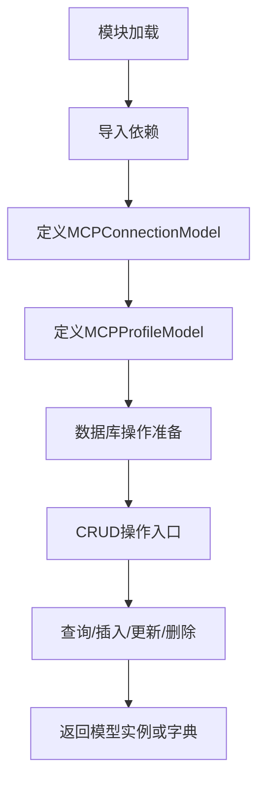
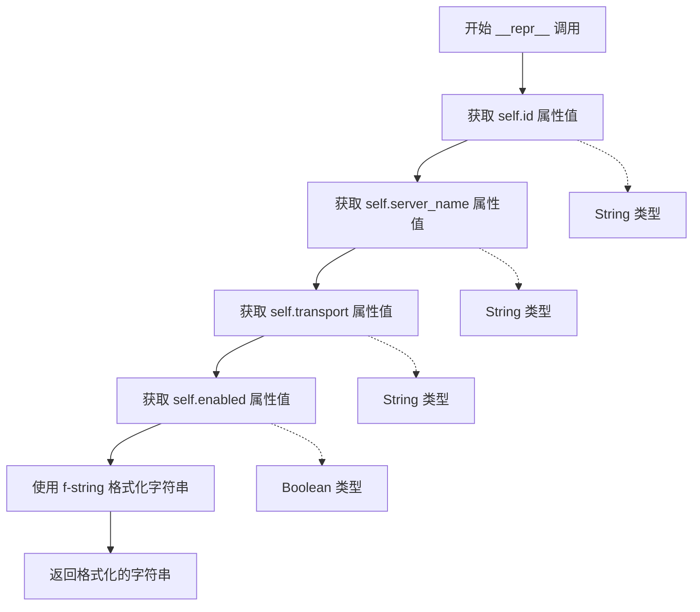
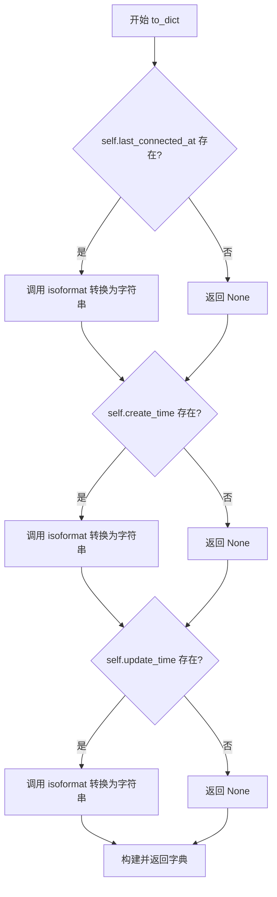

# `Langchain-Chatchat\libs\chatchat-server\chatchat\server\db\models\mcp_connection_model.py` 详细设计文档

定义MCP（Model Control Protocol）连接配置和通用配置的SQLAlchemy ORM模型，支持StdioConnection和SSEConnection两种传输方式，用于管理MCP服务器的连接信息、传输参数和连接状态。

## 整体流程



## 类结构

```
Base (SQLAlchemy ORM基类)
├── MCPConnectionModel (MCP连接配置表)
└── MCPProfileModel (MCP通用配置表)
```

## 全局变量及字段


### `Base`
    
SQLAlchemy ORM 基类，用于定义数据库模型

类型：`class`
    


### `MCPConnectionModel.id`
    
MCP连接ID，主键

类型：`String`
    


### `MCPConnectionModel.server_name`
    
服务器名称，唯一

类型：`String`
    


### `MCPConnectionModel.transport`
    
传输方式：stdio 或 sse

类型：`String`
    


### `MCPConnectionModel.args`
    
命令参数列表

类型：`JSON`
    


### `MCPConnectionModel.env`
    
环境变量字典

类型：`JSON`
    


### `MCPConnectionModel.cwd`
    
工作目录，可为空

类型：`String`
    


### `MCPConnectionModel.timeout`
    
连接超时时间（秒）

类型：`Integer`
    


### `MCPConnectionModel.enabled`
    
是否启用该连接

类型：`Boolean`
    


### `MCPConnectionModel.description`
    
连接器描述，可为空

类型：`Text`
    


### `MCPConnectionModel.config`
    
传输特定配置，包含 command 等字段

类型：`JSON`
    


### `MCPConnectionModel.last_connected_at`
    
最后连接时间，可为空

类型：`DateTime`
    


### `MCPConnectionModel.connection_status`
    
连接状态

类型：`String`
    


### `MCPConnectionModel.error_message`
    
错误信息，可为空

类型：`Text`
    


### `MCPConnectionModel.create_time`
    
创建时间

类型：`DateTime`
    


### `MCPConnectionModel.update_time`
    
更新时间

类型：`DateTime`
    


### `MCPProfileModel.id`
    
配置ID，主键，自增

类型：`Integer`
    


### `MCPProfileModel.timeout`
    
默认连接超时时间（秒）

类型：`Integer`
    


### `MCPProfileModel.working_dir`
    
默认工作目录

类型：`String`
    


### `MCPProfileModel.env_vars`
    
默认环境变量配置

类型：`JSON`
    


### `MCPProfileModel.create_time`
    
创建时间

类型：`DateTime`
    


### `MCPProfileModel.update_time`
    
更新时间

类型：`DateTime`
    
    

## 全局函数及方法


### `func.now`

该函数是 SQLAlchemy 的 `func` 对象提供的时间戳函数，用于在数据库层面生成当前时间。在 `MCPConnectionModel` 和 `MCPProfileModel` 中用作 `default` 和 `onupdate` 参数的默认值，实现自动记录创建时间和更新时间的功能。

参数： 无

返回值：`DateTime`，返回数据库当前的日期时间戳（DATETIME 类型），用于自动填充时间字段

#### 流程图

```mermaid
graph TD
    A[开始] --> B{模型记录插入/更新}
    B -->|插入操作| C[触发 default=func.now()]
    B -->|更新操作| D[触发 onupdate=func.now()]
    C --> E[执行 SQL: SELECT CURRENT_TIMESTAMP]
    D --> E
    E --> F[获取数据库当前时间戳]
    F --> G[填充到 create_time 或 update_time 字段]
    G --> H[结束]
```

#### 带注释源码

```python
# func.now() 是 SQLAlchemy 的函数对象，用于生成 SQL 函数调用
# 在模型字段定义中作为 default/onupdate 参数使用

from sqlalchemy import DateTime, Column, func
from chatchat.server.db.base import Base


class MCPConnectionModel(Base):
    """
    MCP 连接配置模型 - 支持 StdioConnection 和 SSEConnection 类型
    """
    
    __tablename__ = "mcp_connection"
    
    # ... 其他字段定义 ...
    
    # 创建时间字段：插入记录时自动设置为当前数据库时间
    # default=func.now() 表示新记录创建时自动填充当前时间
    create_time = Column(DateTime, default=func.now(), comment="创建时间")
    
    # 更新时间字段：记录创建和更新时都自动设置为当前数据库时间
    # default=func.now() - 新记录创建时自动填充当前时间
    # onupdate=func.now() - 记录更新时自动更新为当前时间
    update_time = Column(DateTime, default=func.now(), onupdate=func.now(), comment="更新时间")


class MCPProfileModel(Base):
    """
    MCP 通用配置模型
    """
    
    __tablename__ = "mcp_profile"
    
    # 同样使用 func.now() 自动管理时间戳
    create_time = Column(DateTime, default=func.now(), comment="创建时间")
    update_time = Column(DateTime, default=func.now(), onupdate=func.now(), comment="更新时间")
```

---

### 关键说明

| 项目 | 说明 |
|------|------|
| **函数来源** | `from sqlalchemy import func` 导入的 SQLAlchemy 函数生成器 |
| **实际作用** | 在 SQL 层面生成 `CURRENT_TIMESTAMP` 或 `NOW()` 函数调用 |
| **使用场景** | 作为 `Column` 的 `default`（默认值）和 `onupdate`（更新时自动修改）参数 |
| **数据库差异** | 不同数据库的底层函数可能不同（MySQL 用 `CURRENT_TIMESTAMP`，PostgreSQL 用 `NOW()`），但 `func.now()` 会自动适配 |
| **与 Python datetime 的区别** | `func.now()` 在数据库端执行，精度和时区处理取决于数据库配置；`datetime.now()` 在 Python 应用端执行 |


### `MCPConnectionModel.__repr__`

这是一个 Python 特殊方法（dunder method），用于返回对象的官方字符串表示形式。该方法返回一个格式化的字符串，包含 MCP 连接的核心信息（id、server_name、transport、enabled），便于调试、日志输出和开发者在交互式环境中的对象查看。

参数：无（`self` 为隐式参数，不计入方法签名）

返回值：`str`，返回一个格式化的字符串，格式为 `<MCPConnection(id='xxx', server_name='xxx', transport='xxx', enabled=xxx)>`

#### 流程图



#### 带注释源码

```python
def __repr__(self):
    """
    返回对象的官方字符串表示形式
    
    返回格式: <MCPConnection(id='xxx', server_name='xxx', transport='xxx', enabled=xxx)>
    用于调试、日志和交互式环境中的对象展示
    
    Returns:
        str: 包含 MCP 连接核心信息的格式化字符串
    """
    # 使用 f-string 格式化字符串，包含 4 个关键属性
    # id: MCP 连接的唯一标识符
    # server_name: 服务器名称
    # transport: 传输方式 (stdio/sse)
    # enabled: 是否启用该连接
    return f"<MCPConnection(id='{self.id}', server_name='{self.server_name}', transport='{self.transport}', enabled={self.enabled})>"
```


### `MCPConnectionModel.to_dict`

将 MCP 连接配置模型实例转换为字典格式，用于序列化或 API 响应返回。

参数：

- 该方法无显式参数（仅包含隐式参数 `self`）

返回值：`Dict`，返回包含模型所有字段的字典，其中时间字段被转换为 ISO 格式字符串

#### 流程图



#### 带注释源码

```python
def to_dict(self) -> Dict:
    """转换为字典格式"""
    # 构建返回字典，包含模型的所有字段
    # 对于 JSON 类型字段，使用 or 运算符提供默认值
    # 对于 DateTime 字段，调用 isoformat() 转换为 ISO 8601 格式字符串
    return {
        "id": self.id,                                    # 连接ID，字符串
        "server_name": self.server_name,                  # 服务器名称，字符串
        "transport": self.transport,                      # 传输方式，字符串
        "args": self.args or [],                          # 命令参数列表，列表，默认为空列表
        "env": self.env or {},                            # 环境变量字典，字典，默认为空字典
        "cwd": self.cwd,                                  # 工作目录，可能为 None
        "timeout": self.timeout,                          # 连接超时时间（秒），整数
        "enabled": self.enabled,                          # 是否启用，布尔值
        "description": self.description,                  # 连接器描述，可能为 None
        "config": self.config or {},                      # 传输特定配置，字典，默认为空字典
        # 转换 DateTime 为 ISO 格式字符串，如不存在则返回 None
        "last_connected_at": self.last_connected_at.isoformat() if self.last_connected_at else None,
        "connection_status": self.connection_status,      # 连接状态，字符串
        "error_message": self.error_message,              # 错误信息，可能为 None
        # 创建时间转换为 ISO 格式字符串
        "create_time": self.create_time.isoformat() if self.create_time else None,
        # 更新时间转换为 ISO 格式字符串
        "update_time": self.update_time.isoformat() if self.update_time else None,
    }
```


### `MCPProfileModel.__repr__`

该方法是 Python 类的特殊方法（魔法方法），用于返回对象的官方字符串表示形式，便于调试和日志输出。当使用 `print()` 或 `repr()` 函数时会自动调用此方法。

参数：

- `self`：`MCPProfileModel`，当前实例对象，隐式参数

返回值：`str`，返回 MCPProfileModel 对象的官方字符串表示，格式为 `<MCPProfile(id={id}, timeout={timeout}, working_dir='{working_dir}', update_time='{update_time}')>`

#### 流程图

```mermaid
flowchart TD
    A[开始 __repr__ 调用] --> B[获取实例属性值]
    B --> C[id: {self.id}]
    C --> D[timeout: {self.timeout}]
    D --> E[working_dir: '{self.working_dir}']
    E --> F[update_time: '{self.update_time}']
    F --> G[格式化字符串]
    G --> H[返回字符串]
    H --> I[结束]
```

#### 带注释源码

```python
def __repr__(self):
    """
    返回 MCPProfileModel 对象的官方字符串表示
    
    当使用 print()、repr() 或字符串插值时会自动调用此方法。
    用于调试、日志记录和开发阶段的快速对象识别。
    
    Returns:
        str: 格式化的字符串，示例: <MCPProfile(id=1, timeout=30, working_dir='/tmp', update_time='2024-01-01 12:00:00')>
    """
    # 使用 f-string 格式化字符串，包含关键属性用于识别对象
    return f"<MCPProfile(id={self.id}, timeout={self.timeout}, working_dir='{self.working_dir}', update_time='{self.update_time}')>"
```

## 关键组件


### MCPConnectionModel

MCP连接配置模型，用于持久化存储MCP（Model Context Protocol）服务器的连接配置信息，支持stdio和sse两种传输方式，并记录连接状态和错误信息。

### MCPProfileModel

MCP通用配置模型，用于存储MCP的全局默认配置，包括默认超时时间、工作目录和环境变量，为连接提供可复用的配置模板。

### 数据库表结构设计

使用SQLAlchemy ORM框架定义两张数据库表，通过Base基类实现模型与表的映射，包含完整的字段类型、默认值和注释说明。

### JSON配置字段

args、env、config和env_vars字段采用JSON类型存储，分别用于存储命令参数列表、环境变量字典和传输特定配置，支持灵活的结构化数据存储。

### 连接状态管理

通过connection_status字段记录连接状态（disconnected/connected等），配合last_connected_at和error_message实现完整的连接生命周期追踪。

### 时间戳自动管理

使用func.now()实现create_time和update_time的自动赋值，update_time额外配置onupdate实现修改时间的自动更新。

### 模型序列化

提供to_dict方法将模型实例转换为字典格式，支持datetime对象的isoformat格式化，便于API响应和JSON序列化。


## 问题及建议


### 已知问题

-   **字段冗余与职责不清**：`config`字段与`args`、`env`、`cwd`字段存在功能重叠，`config`被描述为"传输特定配置，包含command等字段"，但这些字段本身也是传输配置，导致数据冗余和维护困难
-   **数据类型定义不准确**：`args`字段定义为JSON类型，但实际用途是"命令参数列表"，应使用`List`类型并通过SQLAlchemy的`JSON`类型配合Python类型注解声明
-   **缺少业务索引**：仅对`server_name`创建了唯一索引，但常用查询字段如`transport`、`enabled`、`connection_status`缺少相应索引，影响查询性能
-   **枚举值缺乏约束**：`transport`字段仅用`String(20)`存储，未使用枚举约束有效值（stdio/sse），同样`connection_status`状态值也缺乏约束
-   **to_dict方法位置不当**：将序列化方法放在模型类中违反了单一职责原则，应在服务层或序列化器中实现
-   **时区处理问题**：使用`func.now()`创建的时间戳未指定时区，在跨时区场景下可能产生时间不一致问题
-   **外键关系缺失**：`MCPConnectionModel`可能需要关联`MCPProfileModel`，但代码中未定义外键关系
-   **可空字段处理不完善**：`cwd`、`description`等字段在`to_dict`方法中未做None值的充分处理，可能在后续使用中引发空指针异常
-   **默认值与约束不一致**：`enabled`字段有默认值但未在数据库层面设置默认值，依赖应用层逻辑

### 优化建议

-   梳理并统一传输配置字段，移除冗余字段或明确定义各字段职责范围
-   使用SQLAlchemy的`Enum`类型或自定义验证器约束`transport`和`connection_status`字段值
-   根据实际查询场景，为常用过滤字段添加适当索引
-   将序列化逻辑抽取到专门的DTO/Serializer类中，保持模型类纯粹性
-   考虑使用`datetime.now(timezone.utc)`替代`func.now()`以确保时区一致性
-   为`MCPConnectionModel`添加与`MCPProfileModel`的外键关联
-   使用`TypedDict`或`Pydantic`模型定义JSON字段的结构，增强类型安全和自动校验能力

## 其它


### 设计目标与约束

本模块的设计目标是提供MCP（Model Context Protocol）连接配置的持久化存储能力，支持StdioConnection和SSEConnection两种传输方式。核心约束包括：1) 使用SQLAlchemy ORM框架进行数据库操作；2) 数据库表采用String类型主键（UUID格式，32字符）；3) JSON类型字段需处理空值情况；4) 支持软删除和时间戳追踪。

### 错误处理与异常设计

空值处理：JSON字段（args、env、config）使用`or []`或`or {}`进行空值保护；时间字段（last_connected_at、create_time、update_time）使用条件判断处理None值。数据库约束异常：server_name字段设置unique=True确保唯一性约束；必填字段（server_name、transport）设置nullable=False。数据转换异常：to_dict方法中的isoformat()调用需确保datetime对象不为None。

### 数据流与状态机

MCPConnectionModel状态流转：创建时connection_status默认为"disconnected"；连接成功后更新last_connected_at为当前时间，connection_status变为"connected"；连接失败时更新error_message并设置connection_status为"error"。MCPProfileModel为全局配置模板，状态流转较简单，主要用于默认参数配置。

### 外部依赖与接口契约

依赖项：1) SQLAlchemy框架（Boolean、Column、DateTime、Integer、String、JSON、Text、func）；2) datetime模块；3) typing模块（Dict、List、Optional、Union）；4) chatchat.server.db.base.Base基类。接口契约：模型类需实现to_dict()方法用于序列化；__repr__方法用于调试输出；所有时间字段使用func.now()实现服务器端时间戳。

### 性能考虑与优化空间

索引设计建议：在server_name字段已有唯一索引；建议在connection_status和enabled字段建立联合索引用于状态查询；在last_connected_at字段建立索引用于排序查询。JSON字段优化：大型JSON数据建议拆分独立表；频繁查询的字段应提取为独立列。查询优化：批量操作时使用bulk_insert_mappings；考虑使用selectinload优化关联查询。

### 安全考虑

敏感信息处理：env字段存储环境变量可能包含敏感信息，建议增加加密存储机制；error_message可能包含堆栈信息，生产环境需脱敏处理。输入验证：args字段应验证为列表类型；timeout字段应设置合理范围（如1-300秒）；transport字段应限制为枚举值（stdio/sse）。

### 数据库表结构详情

MCPConnectionModel表：字符集建议utf8mb4以支持emoji；id字段长度32满足UUID格式；connection_status建议使用枚举类型（connected/disconnected/error/connecting）。MCPProfileModel表：working_dir字段长度500满足大多数路径需求；env_vars为JSON类型存储默认环境变量。

### 兼容性设计

版本兼容性：datetime字段使用func.now()确保数据库无关性；JSON字段在不同数据库间有兼容性差异（MySQL 5.7+、PostgreSQL、SQLite均支持）。字段演进：新增字段需设置nullable=True或提供默认值；字段类型变更需数据迁移脚本配合。

### 测试策略建议

单元测试：验证to_dict()方法的空值处理；验证默认值设置；验证唯一性约束。集成测试：验证数据库CRUD操作；验证时间戳自动更新；验证JSON字段存储与读取。


    