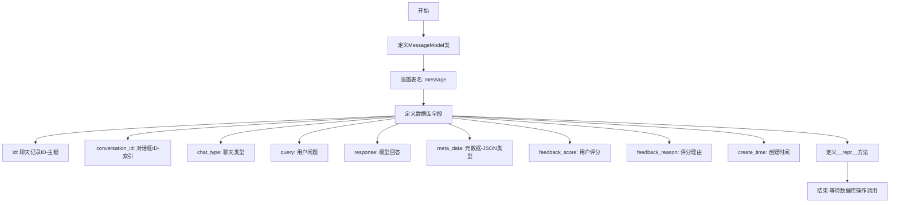
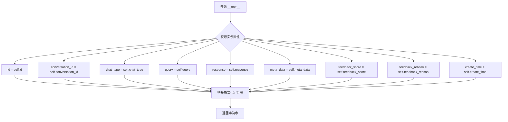

# `Langchain-Chatchat\libs\chatchat-server\chatchat\server\db\models\message_model.py` 详细设计文档

这是一个聊天记录数据库模型，定义了message表结构，用于存储用户与AI助手的对话历史，包含对话ID、聊天类型、用户问题、模型回答、元数据、用户评分及评分理由等字段。

## 整体流程



## 类结构

```
Base (chatchat.server.db.base)
└── MessageModel (聊天记录模型)
```

## 全局变量及字段


### `MessageModel.id`
    
聊天记录ID，主键

类型：`String(32)`
    


### `MessageModel.conversation_id`
    
对话框ID，可为空，带索引

类型：`String(32)`
    


### `MessageModel.chat_type`
    
聊天类型

类型：`String(50)`
    


### `MessageModel.query`
    
用户问题

类型：`String(4096)`
    


### `MessageModel.response`
    
模型回答

类型：`String(4096)`
    


### `MessageModel.meta_data`
    
元数据，用于扩展如知识库ID等

类型：`JSON`
    


### `MessageModel.feedback_score`
    
用户评分，满分100，默认-1

类型：`Integer`
    


### `MessageModel.feedback_reason`
    
用户评分理由

类型：`String(255)`
    


### `MessageModel.create_time`
    
创建时间，默认当前时间

类型：`DateTime`
    
    

## 全局函数及方法


### MessageModel.__repr__

返回模型的字符串表示，用于调试和日志记录。该方法将 MessageModel 实例的所有关键字段格式化为可读的字符串形式。

参数：

- `self`：`MessageModel` 实例，表示当前聊天记录模型对象

返回值：`str`，返回包含所有字段信息的字符串表示，格式为 `<message(...)>`

#### 流程图



#### 带注释源码

```python
def __repr__(self):
    """
    返回模型的字符串表示
    
    该方法为 MessageModel 类提供标准的 Python 对象字符串表示形式，
    主要用于：
    - 调试时查看对象内容
    - 日志记录
    - 开发时快速检查对象状态
    
    返回的字符串格式遵循 Python repr 惯例，以尖括号包裹，
    内部包含对象类型名和所有关键属性值。
    
    Returns:
        str: 包含所有字段信息的字符串，格式如下：
             <message(id='{id}', conversation_id='{conversation_id}', 
             chat_type='{chat_type}', query='{query}', response='{response}',
             meta_data='{meta_data}',feedback_score='{feedback_score}',
             feedback_reason='{feedback_reason}', create_time='{create_time}')>
    """
    # 使用 f-string 格式化字符串，拼接所有属性值
    return f"<message(id='{self.id}', conversation_id='{self.conversation_id}', chat_type='{self.chat_type}', query='{self.query}', response='{self.response}',meta_data='{self.meta_data}',feedback_score='{self.feedback_score}',feedback_reason='{self.feedback_reason}', create_time='{self.create_time}')>"
```

## 关键组件


### MessageModel

聊天记录模型类，用于存储用户与AI模型之间的对话历史，包含对话ID、聊天类型、用户问题、模型回答、元数据、用户评分及评分理由等信息。

### id字段

聊天记录的唯一标识符，采用String(32)类型，作为主键使用，用于唯一标识每条聊天记录。

### conversation_id字段

对话框ID，String(32)类型，建立索引以提升查询效率，用于将多条消息关联到同一个对话会话中。

### chat_type字段

聊天类型，String(50)类型，用于区分不同类型的聊天场景（如普通对话、知识库问答等）。

### query字段

用户问题，String(4096)类型，存储用户发送的原始查询内容，最大支持4096个字符。

### response字段

模型回答，String(4096)类型，存储AI模型生成的回复内容，最大支持4096个字符。

### meta_data字段

元数据字段，JSON类型，用于存储扩展信息如知识库ID等，以字典形式存储，默认为空字典。

### feedback_score字段

用户评分，Integer类型，满分100分，默认值为-1表示未评分，用于记录用户对回答的满意度评价。

### feedback_reason字段

用户评分理由，String(255)类型，存储用户给出评分的具体原因或反馈意见。

### create_time字段

创建时间，DateTime类型，使用数据库函数func.now()自动记录消息创建的时间戳。


## 问题及建议


### 已知问题

-   **可变默认值陷阱**：`meta_data = Column(JSON, default={})` 使用可变对象作为默认值，可能导致所有记录共享同一字典对象
- **字段长度不足**：`query` 和 `response` 使用 `String(4096)`，长文本聊天内容可能超过限制，建议使用 `Text` 类型
- **缺少复合索引**：常见查询场景（按会话ID查询消息列表）通常需要 `conversation_id` + `create_time` 的复合索引，当前仅有单字段索引
- **主键生成策略不明确**：使用 `String(32)` 作为主键，但未定义ID生成逻辑，32字符可能不足以容纳UUID（36字符）
- **缺少软删除支持**：生产环境通常需要 `is_deleted` 或 `status` 字段支持逻辑删除，而非物理删除
- **缺少租户/用户隔离字段**：无 `tenant_id` 或 `user_id` 字段，无法支持多租户或多用户场景
- **外键约束缺失**：`conversation_id` 无外键约束关联会话表，数据完整性依赖应用层保证
- **字段可空性不一致**：`conversation_id` 允许为空 (`default=None`)，但聊天消息通常应归属于特定会话
- **缺少更新 timestamp**：无 `update_time` 字段，无法追踪记录最后修改时间
- **chat_type 无默认值**：`chat_type` 列无默认值，可能产生 NULL 值

### 优化建议

-   将 `default={}` 改为 `default=dict` 或 `default=None`，避免可变默认值问题
-   将 `query` 和 `response` 字段类型改为 `Text`，支持更长文本内容
-   添加复合索引：`Index('ix_message_conversation_create', 'conversation_id', 'create_time')`
-   主键考虑使用 `UUID` 类型或明确 ID 生成策略（如雪花算法）
-   添加 `is_deleted = Column(Boolean, default=False)` 字段支持软删除
-   根据业务需求添加 `tenant_id` 或 `user_id` 字段实现数据隔离
-   为 `conversation_id` 添加外键约束或确保应用层验证
-   考虑添加 `update_time = Column(DateTime, default=func.now(), onupdate=func.now())` 字段
-   为 `chat_type` 添加合理的默认值或设置为非空约束
-   添加 `Index('ix_message_chat_type', 'chat_type')` 索引，如果按聊天类型查询是常见场景

## 其它


### 一段话描述

MessageModel是ChatChat聊天系统的数据库ORM模型类，用于持久化存储用户与AI助手的聊天记录，包含对话ID、聊天类型、用户问题、模型回答、元数据、用户评分及评分理由等核心信息，支持对话历史的查询与评价功能。

### 文件的整体运行流程

本代码文件作为数据模型定义模块，被ChatChat服务器框架加载后，SQLAlchemy会自动创建对应的数据库表结构。该模型主要通过ORM查询接口被聊天服务调用：当用户发送消息时，服务层创建MessageModel实例并保存到数据库；当需要查询历史记录时，通过conversation_id等字段进行检索；用户对回答进行评分时，相应更新feedback_score和feedback_reason字段。

### 类的详细信息

#### 类名
MessageModel

#### 类说明
聊天记录数据库模型，继承自SQLAlchemy的Base类，映射数据库中的message表

#### 类的属性（字段）

| 字段名称 | 字段类型 | 字段描述 |
|---------|---------|---------|
| id | String(32) | 聊天记录唯一标识符，主键 |
| conversation_id | String(32) | 对话会话ID，用于关联同一会话的多条消息 |
| chat_type | String(50) | 聊天类型，区分不同类型的对话 |
| query | String(4096) | 用户提出的问题或输入内容 |
| response | String(4096) | AI模型生成的回答内容 |
| meta_data | JSON | 扩展元数据字段，存储知识库ID等可选信息 |
| feedback_score | Integer | 用户评分，范围0-100，-1表示未评分 |
| feedback_reason | String(255) | 用户给出评分的理由或反馈文本 |
| create_time | DateTime | 记录创建时间，默认值为当前时间 |

#### 类方法

| 方法名称 | 参数 | 返回值类型 | 方法描述 |
|---------|-----|-----------|---------|
| __repr__ | 无 | string | 返回对象的字符串表示形式，便于调试和日志记录 |

### 全局变量和全局函数

本代码文件未定义全局变量和全局函数，所有内容封装在MessageModel类定义中。

### 关键组件信息

#### Base (chatchat.server.db.base.Base)
数据库模型基类，由SQLAlchemy提供，MessageModel继承此类以获得ORM映射能力

#### SQLAlchemy Column
用于定义数据库表列的映射字段，支持数据类型、约束条件、索引等配置

### 潜在的技术债务或优化空间

1. **索引优化**：conversation_id字段已建索引，但针对常见查询模式（如按create_time排序查询历史记录），可考虑添加复合索引
2. **字段长度限制**：query和response字段固定为4096字符，可能无法满足长文本场景，应考虑使用Text类型或动态调整
3. **元数据结构**：meta_data使用JSON类型但缺乏Schema定义，建议增加字段验证和使用文档
4. **ID生成策略**：当前未定义ID生成策略，建议使用UUID或雪花算法确保分布式环境下的唯一性
5. **缺少索引**：feedback_score字段常用于排序和筛选，但未建立索引

### 设计目标与约束

- **设计目标**：提供聊天记录的持久化存储能力，支持历史查询、对话关联、用户反馈收集
- **约束条件**：ID长度限制32字符，会话ID限制32字符，评分理由限制255字符
- **兼容性要求**：需与SQLAlchemy 1.4+版本兼容，支持MySQL、PostgreSQL等主流关系型数据库

### 错误处理与异常设计

- 数据库连接异常由上层服务（如API层）统一捕获处理
- 字段验证错误（如ID超长、JSON格式错误）会在ORM映射时触发SQLAlchemy异常
- 建议在数据入库前增加业务层校验，确保数据符合字段约束

### 数据流与状态机

- **数据写入流程**：用户发送消息 → API接收 → Service层创建MessageModel实例 → ORM写入数据库 → 返回结果
- **数据查询流程**：用户请求历史 → Service层构建查询条件 → ORM查询 → 返回MessageModel列表
- **状态变化**：feedback_score初始值为-1，用户评价后更新为0-100的整数值

### 外部依赖与接口契约

- **数据库依赖**：SQLAlchemy ORM框架，数据库驱动（pymysql/psycopg2）
- **上游依赖**：chatchat.server.db.base.Base基类
- **下游接口**：被MessageService或ConversationService等服务层调用
- **表结构契约**：表名为message，字符集建议UTF8MB4以支持中文存储

### 数据库表结构补充说明

| 配置项 | 说明 |
|-------|------|
| 表名 | message |
| 存储引擎 | 建议InnoDB（MySQL）或对应的事务支持引擎 |
| 字符集 | 建议UTF8MB4 |
| 主键 | id (String, 32字符) |
| 索引 | conversation_id字段已建索引，建议根据实际查询模式添加复合索引 |


    