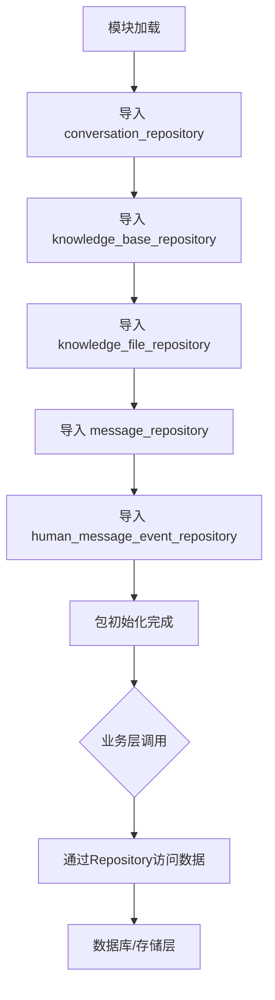

# `Langchain-Chatchat\libs\chatchat-server\chatchat\server\db\repository\__init__.py` 详细设计文档

这是一个数据访问层（DAL）模块的入口文件，通过统一导出多个仓库（Repository）类来管理对话、知识库、知识文件、消息及人工消息事件等核心业务实体的持久化操作，为上层服务提供统一的数据访问接口。

## 整体流程



## 类结构

```
repositories (包)
├── conversation_repository (对话仓库)
├── knowledge_base_repository (知识库仓库)
├── knowledge_file_repository (知识文件仓库)
├── message_repository (消息仓库)
└── human_message_event_repository (人工消息事件仓库)
```

## 全局变量及字段


    

## 全局函数及方法


## 关键组件


### 核心功能概述

该代码是数据访问层的模块入口文件，通过聚合多个仓储（Repository）模块来统一管理对话、知识库、知识文件、消息和人类消息事件等核心业务实体的数据持久化操作。

### 文件运行流程

这是一个Python包的`__init__.py`文件，其运行流程极为简单：
1. Python解释器导入该模块时
2. 依次执行5个from语句
3. 将各repository模块中的公共成员（通过*导入）暴露给外部调用者
4. 外部代码可通过 `from package_name import ConversationRepository` 等方式直接使用

### 关键组件信息

#### conversation_repository

对话数据仓储模块，负责对话（Conversation）实体的增删改查操作，包括会话创建、历史记录管理、会话状态跟踪等功能。

#### knowledge_base_repository

知识库数据仓储模块，负责知识库（Knowledge Base）实体的持久化操作，支持知识库的创建、更新、删除、检索等核心功能。

#### knowledge_file_repository

知识文件数据仓储模块，专注于知识库中文档文件的管理，包括文件上传、元数据存储、文件内容索引关联等操作。

#### message_repository

消息数据仓储模块，处理消息（Message）实体的数据访问，涵盖消息的存储、查询、分页检索、上下文关联等功能。

#### human_message_event_repository

人类消息事件数据仓储模块，管理和记录用户交互过程中产生的事件数据，用于追踪用户行为和消息交互历史。

### 潜在技术债务或优化空间

1. **模块组织方式**：使用 `from .xxx import *` 通配符导入会导致命名空间污染，难以追踪具体导出了哪些成员，建议显式导出或使用 `__all__` 明确公共API
2. **缺乏抽象层**：各repository直接暴露实现细节，缺少抽象基类或接口定义，不利于后续更换数据存储实现（如从SQL迁移到NoSQL）
3. **无统一错误处理**：各repository可能采用不同的异常处理策略，缺乏统一的错误传播机制
4. **缺少事务管理**：在涉及多repository操作的事务一致性方面可能存在设计缺失

### 其它项目

#### 设计目标与约束

- **设计目标**：提供统一的数据访问入口，简化业务层与数据层的交互
- **约束**：依赖于具体repository模块的实现，模块间耦合度较高

#### 外部依赖与接口契约

- 各repository模块的具体接口契约依赖于被导入模块的实际实现
- 外部调用方需了解各repository提供的具体方法集合

#### 扩展性考虑

- 当前架构较难支持新增repository类型而不修改入口文件
- 建议考虑使用插件化或工厂模式改进扩展性


## 问题及建议


### 已知问题

-   **通配符导入问题**：使用 `from .xxx_repository import *` 通配符导入会导入所有公共成员，污染命名空间，无法明确知道具体导入了哪些类/函数，不利于IDE代码补全和静态类型检查
-   **导入未被使用**：该文件中没有看到任何实际使用这些导入的代码，可能导致不必要的依赖加载
-   **缺少显式导出控制**：没有使用 `__all__` 明确指定模块的公共接口，降低了API的透明性
-   **无文档注释**：缺少模块级文档字符串说明该文件的目的和职责
-   **潜在的循环依赖风险**：如果被导入的Repository类之间存在循环依赖，这种导入方式可能会加剧问题
-   **无法进行代码追踪**：通配符导入使得追踪特定类的来源变得困难，增加调试和维护成本

### 优化建议

-   **明确指定导入内容**：将 `from .xxx_repository import *` 改为 `from .xxx_repository import ClassName1, ClassName2`，明确列出需要导入的具体类
-   **使用 `__all__` 限制导出**：在模块中添加 `__all__ = ['ClassName1', 'ClassName2']` 来显式定义公共API
-   **添加模块文档**：为该文件添加模块级文档字符串，说明其作为Repository层统一导出入口的职责
-   **按需导入优化**：如果某些Repository类在当前模块中未被使用，考虑移除不必要的导入以减少加载时间
-   **考虑重构为简单转发**：如果该文件仅用于统一导出，建议简化为直接导出或使用更清晰的导入方式


## 其它


### 设计目标与约束

本模块采用Repository模式（仓库模式）实现数据访问层抽象，统一管理对话、知识库、消息等业务实体的数据持久化操作。设计目标是解耦业务逻辑与数据访问逻辑，提供统一的数据操作接口，降低上层业务代码对具体数据库实现的耦合度。约束包括：遵循单一职责原则，每个Repository类负责单一实体的数据操作；依赖倒置原则，通过抽象接口隔离数据库实现细节；以及保持事务一致性，确保跨Repository操作的数据完整性。

### 错误处理与异常设计

本模块依赖导入的各个Repository类自身的异常处理机制。在__init__.py层面，主要处理ImportError异常（当某个Repository模块不存在时）和AttributeError异常（当尝试访问不存在的类属性时）。建议各Repository类定义自定义异常类，如DataAccessError、EntityNotFoundError、DuplicateEntityError等，并在方法文档中明确标注可能抛出的异常类型及触发条件。上层调用者应通过try-except块捕获并处理这些异常。

### 数据流与状态机

本模块作为数据访问层的入口点，其数据流遵循以下路径：上层业务服务 → Repository接口 → 具体Repository实现 → 数据库/持久化存储。各Repository类管理的实体状态转换如下：ConversationRepository处理会话的创建、激活、结束等状态流转；KnowledgeBaseRepository管理知识库的启用/禁用状态；KnowledgeFileRepository控制文件的上传、处理、就绪等生命周期状态；MessageRepository和HumanMessageEventRepository分别管理消息的发送、接收、已读等状态。

### 外部依赖与接口契约

本模块的外部依赖包括：各Repository类依赖的数据库驱动（如SQLAlchemy、Pymongo等）、数据库连接池管理组件、以及可能的缓存层（如Redis）。接口契约方面，每个Repository类应提供标准的CRUD方法签名：create(entity) -> entity、get_by_id(id) -> entity、get_all() -> list、update(entity) -> entity、delete(id) -> bool，以及根据业务需求定制的高级查询方法。所有方法应返回明确的类型注解，参数应包含类型提示和文档字符串说明。

### 性能要求与约束

各Repository实现应考虑性能优化：数据库查询应使用索引优化查询性能；批量操作应提供batch方法减少数据库交互次数；复杂查询应支持分页和懒加载机制；数据库连接应使用连接池管理以提高复用率。建议在Repository方法中添加缓存逻辑（可选），并提供性能监控点以支持后续优化。

### 安全考虑

数据访问层需关注以下安全要点：SQL注入防护（使用参数化查询或ORM）、敏感数据加密存储、访问控制验证（确保用户只能访问授权的数据）、审计日志记录（记录数据访问和修改操作）、以及事务权限控制（确保操作在正确的权限上下文中执行）。

### 测试策略

建议采用分层测试策略：单元测试覆盖各Repository类的核心方法，模拟数据库连接进行测试；集成测试验证Repository与实际数据库的交互；Mock测试用于隔离外部依赖。测试数据应包含边界条件、空值、异常情况等场景，确保各Repository类的健壮性。

### 版本兼容性

本模块应遵循语义化版本号规范。主版本号变更可能表示API不兼容；次版本号变更表示新增功能但保持向后兼容；修订号变更表示bug修复。各Repository类的接口变更应记录在CHANGELOG中，并提供迁移指南。建议使用抽象基类（ABC）定义Repository接口，以便实现灵活的多数据库支持。

### 监控和日志

建议在各Repository类中添加适当的日志记录：记录耗时较长的查询操作、记录数据修改操作（用于审计）、记录异常和错误信息。关键指标包括：查询响应时间、数据库连接池使用率、缓存命中率等。可集成APM工具（如SkyWalking、Pinpoint）进行链路追踪。

### 配置管理

数据库连接配置应从配置文件或环境变量读取，支持多环境配置（开发、测试、生产）。建议使用统一的配置管理模块，配置项包括：数据库连接字符串、连接池大小、超时设置、重试策略、缓存策略等。敏感配置（如数据库密码）应使用密钥管理服务存储。

    