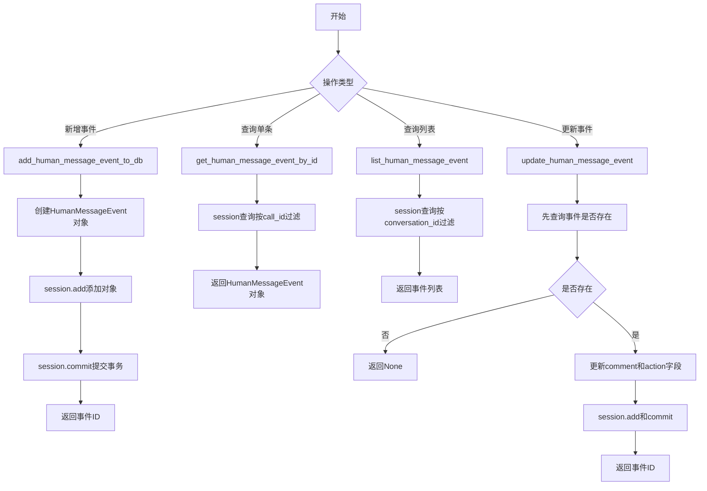
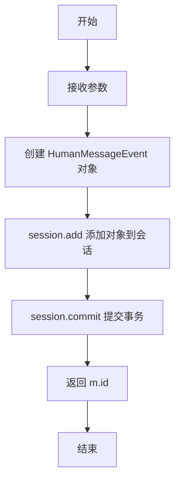
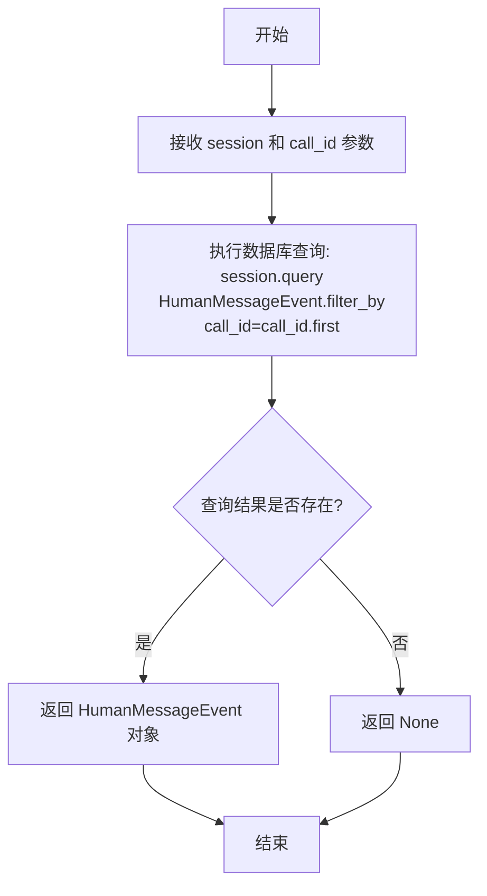
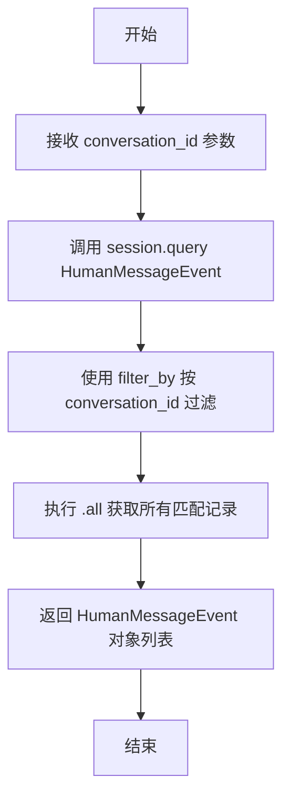
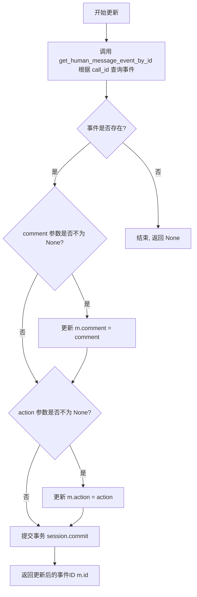
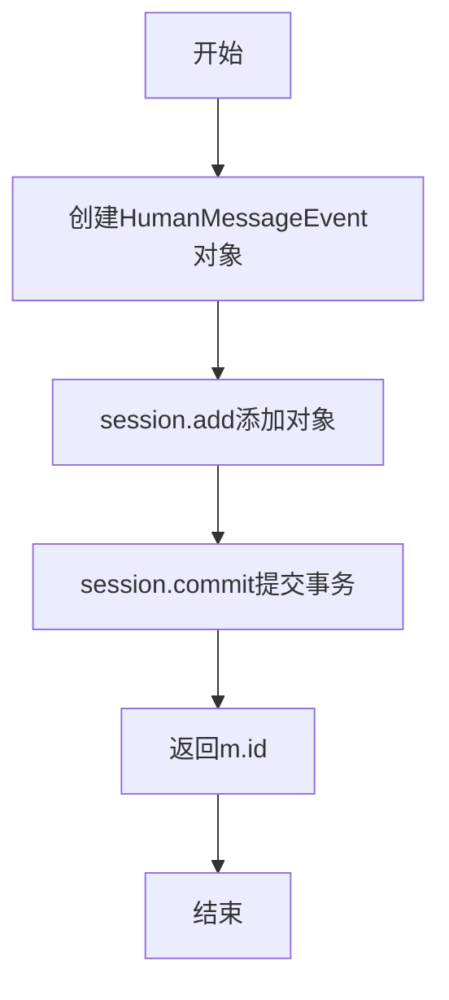
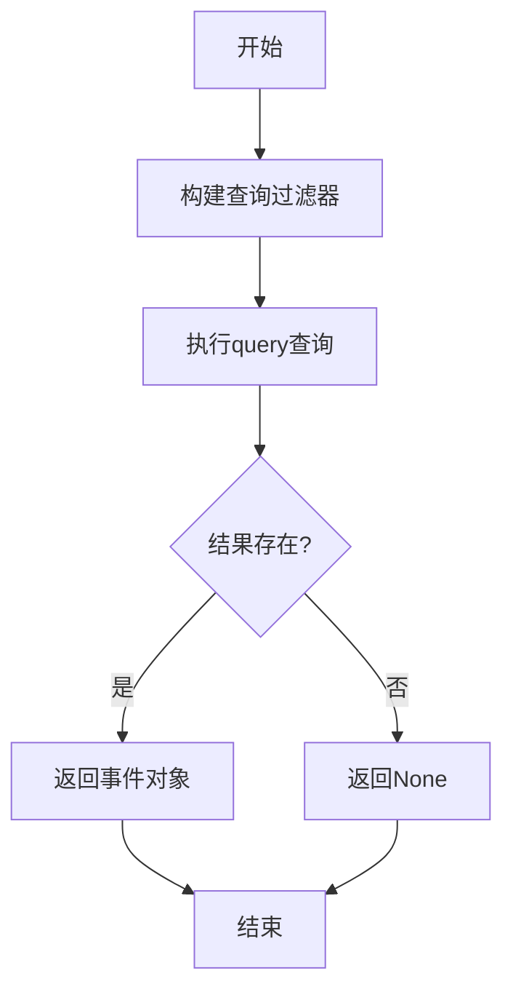
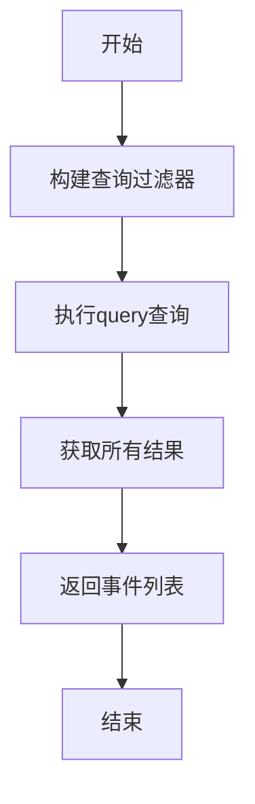
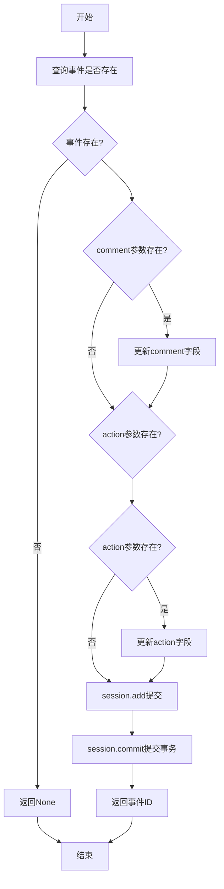

# `Langchain-Chatchat\libs\chatchat-server\chatchat\server\db\repository\human_message_event_repository.py` 详细设计文档

该代码文件实现了人类反馈消息事件（HumanMessageEvent）的数据库持久化操作封装，提供新增、查询（单条和列表）、更新等四个核心函数，通过with_session装饰器管理数据库会话，连接上层业务逻辑与底层数据库模型。

## 整体流程



## 类结构

```
HumanMessageEvent (数据库模型类)
└── human_message_event.py (API层)
```

## 全局变量及字段


### `HumanMessageEvent.call_id`
    
调用ID，用于唯一标识一次调用

类型：`str`
    


### `HumanMessageEvent.conversation_id`
    
会话ID，关联到具体的对话会话

类型：`str`
    


### `HumanMessageEvent.function_name`
    
函数名称，触发该事件的函数名

类型：`str`
    


### `HumanMessageEvent.kwargs`
    
关键参数，以字符串形式存储的函数调用参数

类型：`str`
    


### `HumanMessageEvent.comment`
    
评论内容，人类反馈的具体文本内容

类型：`str`
    


### `HumanMessageEvent.action`
    
操作类型，人类反馈的操作动作或指令

类型：`str`
    
    

## 全局函数及方法


### `add_human_message_event_to_db`

新增人类反馈消息事件到数据库的函数，通过装饰器 `@with_session` 获取数据库会话，创建一个 `HumanMessageEvent` 实体对象并保存到数据库，返回新创建记录的 ID。

参数：

- `session`：由 `@with_session` 装饰器注入的数据库会话对象，用于执行数据库操作
- `call_id`：`str`，调用的唯一标识符，用于关联特定的调用记录
- `conversation_id`：`str`，对话的唯一标识符，用于关联到特定的会话
- `function_name`：`str`，触发该事件的函数名称
- `kwargs`：`str`，以字符串形式存储的关键字参数（JSON 序列化后的参数内容）
- `comment`：`str`，用户提供的评论或反馈内容
- `action`：`str`，用户执行的操作或动作描述

返回值：`str`，新创建的 `HumanMessageEvent` 记录的唯一标识符（ID）

#### 流程图



#### 带注释源码

```python
@with_session
def add_human_message_event_to_db(
        session,                # 数据库会话对象，由装饰器自动注入
        call_id: str,           # 呼叫/调用的唯一标识
        conversation_id: str,   # 所属对话的唯一标识
        function_name: str,     # 触发事件的函数名称
        kwargs: str,            # 函数的关键字参数（字符串形式）
        comment: str,           # 用户评论/反馈内容
        action: str,            # 用户执行的动作
):
    """
    新增人类反馈消息事件
    """
    # 创建 HumanMessageEvent 实体对象，封装所有传入的参数
    m = HumanMessageEvent(
        call_id=call_id,
        conversation_id=conversation_id,
        function_name=function_name,
        kwargs=kwargs,
        comment=comment,
        action=action,
    )
    # 将实体对象添加到 SQLAlchemy 会话（相当于 INSERT 前的准备）
    session.add(m)
    # 提交事务，将数据真正写入数据库
    session.commit()
    # 返回新创建记录的 ID
    return m.id
```


### `get_human_message_event_by_id`

根据传入的 `call_id` 查询并返回对应的人类反馈消息事件记录，如果未找到则返回 `None`。

参数：

-  `session`：`Session`，数据库会话对象，由 `@with_session` 装饰器自动注入
-  `call_id`：`str`，用于查询人类反馈消息事件的唯一标识符

返回值：`HumanMessageEvent`，查询到的人类反馈消息事件对象；如果未找到则返回 `None`

#### 流程图



#### 带注释源码

```python
@with_session
def get_human_message_event_by_id(session, call_id) -> HumanMessageEvent:
    """
    根据 call_id 查询人类反馈消息事件
    
    Args:
        session: 数据库会话对象，由 with_session 装饰器自动注入
        call_id: 人类反馈消息事件的唯一标识符
    
    Returns:
        HumanMessageEvent: 查询到的事件对象，如果未找到则返回 None
    """
    # 使用 SQLAlchemy 的 query 方法查询 HumanMessageEvent 模型
    # filter_by 使用关键字参数进行过滤，first() 返回第一条匹配记录或 None
    m = session.query(HumanMessageEvent).filter_by(call_id=call_id).first()
    
    # 返回查询结果，可能是 HumanMessageEvent 对象或 None
    return m
```


### `list_human_message_event`

查询指定会话的所有人类反馈消息事件

参数：

- `session`：`Session`，数据库会话对象（由 `@with_session` 装饰器自动注入）
- `conversation_id`：`str`，会话ID，用于过滤查询特定会话下的人类反馈消息事件

返回值：`List[HumanMessageEvent]`，返回与指定 conversation_id 关联的所有 HumanMessageEvent 对象列表

#### 流程图



#### 带注释源码

```python
@with_session  # 装饰器：自动获取/创建数据库会话并管理事务
def list_human_message_event(session, conversation_id: str) -> List[HumanMessageEvent]:
    """
    查询人类反馈消息事件
    
    根据指定的 conversation_id 查询对应的所有人类反馈消息事件记录
    
    参数:
        session: 数据库会话对象，由 @with_session 装饰器自动注入
        conversation_id: 会话ID，用于过滤查询结果
    
    返回:
        List[HumanMessageEvent]: 返回与指定会话ID关联的所有 HumanMessageEvent 对象列表
    """
    # 使用 SQLAlchemy 的 query 方法查询 HumanMessageEvent 模型
    # 通过 filter_by 方法按 conversation_id 字段进行过滤
    # 使用 .all() 方法获取所有匹配的记录并返回列表
    m = session.query(HumanMessageEvent).filter_by(conversation_id=conversation_id).all()
    
    # 返回查询结果列表，如果没有匹配记录则返回空列表
    return m
```


### `update_human_message_event`

更新已有的人类反馈消息事件的评论和操作内容。

参数：

-  `session`：`Session`，由 `@with_session` 装饰器注入的数据库会话对象
-  `call_id`：`str`，人类反馈消息事件的唯一标识符，用于查询要更新的事件记录
-  `comment`：`str`，可选参数，要更新的评论内容，如果为 None 则不更新
-  `action`：`str`，可选参数，要更新的操作内容，如果为 None 则不更新

返回值：`Optional[str]`，更新成功后返回事件的主键ID，如果事件不存在则返回 None

#### 流程图



#### 带注释源码

```python
@with_session  # 装饰器：自动管理数据库会话的创建和提交
def update_human_message_event(session, call_id, comment: str = None, action: str = None):
    """
    更新已有的人类反馈消息事件
    """
    # 根据 call_id 查询对应的 HumanMessageEvent 记录
    m = get_human_message_event_by_id(call_id)
    
    # 检查事件记录是否存在
    if m is not None:
        # 如果提供了 comment 参数且不为 None，则更新评论内容
        if comment is not None:
            m.comment = comment
        
        # 如果提供了 action 参数且不为 None，则更新操作内容
        if action is not None:
            m.action = action
        
        # 将修改后的对象添加到会话，并提交事务保存到数据库
        session.add(m)
        session.commit()
        
        # 返回更新后事件的主键ID
        return m.id
    
    # 如果事件不存在，函数隐式返回 None
```

## 关键组件


### 一段话描述

该代码模块实现了人类反馈消息事件（HumanMessageEvent）的数据库持久化操作，提供新增、查询（按ID和按会话ID）、更新等核心功能，通过`with_session`装饰器管理数据库会话，支撑对话系统的人类反馈收集与存储能力。

### 文件的整体运行流程

1. 导入依赖模块（uuid、typing、模型类、会话装饰器）
2. 通过`@with_session`装饰器包装每个数据库操作函数，自动获取数据库会话
3. 调用`add_human_message_event_to_db`新增事件 → 创建模型实例 → 提交到数据库 → 返回事件ID
4. 调用`get_human_message_event_by_id`按call_id查询单条事件
5. 调用`list_human_message_event`按conversation_id查询事件列表
6. 调用`update_human_message_event`更新事件的comment和action字段 → 提交事务

### 全局变量和全局函数详细信息

#### 全局变量

无显式全局变量。

#### 全局函数

##### 1. add_human_message_event_to_db

- **参数**：
  - `session`: Session对象，数据库会话（由装饰器注入）
  - `call_id`: str，调用ID
  - `conversation_id`: str，会话ID
  - `function_name`: str，函数名称
  - `kwargs`: str，参数JSON字符串
  - `comment`: str，评论内容
  - `action`: str，动作类型
- **返回值类型**: str（事件ID）
- **返回值描述**: 新增事件的主键ID



```python
@with_session
def add_human_message_event_to_db(
        session,
        call_id: str,
        conversation_id: str,
        function_name: str,
        kwargs: str,
        comment: str,
        action: str,
):
    """
    新增人类反馈消息事件
    """
    m = HumanMessageEvent(
        call_id=call_id,
        conversation_id=conversation_id,
        function_name=function_name,
        kwargs=kwargs,
        comment=comment,
        action=action,
    )
    session.add(m)
    session.commit()
    return m.id
```

##### 2. get_human_message_event_by_id

- **参数**：
  - `session`: Session对象，数据库会话（由装饰器注入）
  - `call_id`: str，调用ID
- **返回值类型**: HumanMessageEvent
- **返回值描述**: 查询到的事件对象，若不存在返回None



```python
@with_session
def get_human_message_event_by_id(session, call_id) -> HumanMessageEvent:
    """
    查询人类反馈消息事件
    """
    m = session.query(HumanMessageEvent).filter_by(call_id=call_id).first()
    return m
```

##### 3. list_human_message_event

- **参数**：
  - `session`: Session对象，数据库会话（由装饰器注入）
  - `conversation_id`: str，会话ID
- **返回值类型**: List[HumanMessageEvent]
- **返回值描述**: 事件对象列表



```python
@with_session
def list_human_message_event(session, conversation_id: str) -> List[HumanMessageEvent]:
    """
    查询人类反馈消息事件
    """
    m = session.query(HumanMessageEvent).filter_by(conversation_id=conversation_id).all()
    return m
```

##### 4. update_human_message_event

- **参数**：
  - `session`: Session对象，数据库会话（由装饰器注入）
  - `call_id`: str，调用ID
  - `comment`: str，评论内容（可选）
  - `action`: str，动作类型（可选）
- **返回值类型**: str（事件ID）或 None
- **返回值描述**: 更新成功返回事件ID，未找到事件返回None



```python
@with_session
def update_human_message_event(session, call_id, comment: str = None, action: str = None):
    """
    更新已有的人类反馈消息事件
    """
    m = get_human_message_event_by_id(call_id)
    if m is not None:
        if comment is not None:
            m.comment = comment
        if action is not None:
            m.action = action
        session.add(m)
        session.commit()
        return m.id
```

### 关键组件信息

#### HumanMessageEvent 模型类

数据库实体模型，映射human_message_event表，存储人类反馈消息事件的完整信息。

#### with_session 装饰器

数据库会话管理装饰器，自动获取SQLAlchemy会话实例并注入到函数参数中，负责事务的生命周期管理。

#### add_human_message_event_to_db 函数

新增人类反馈消息事件的核心函数，将用户反馈数据持久化到数据库。

#### get_human_message_event_by_id 函数

根据call_id查询单条事件记录，用于事件追踪和详情获取。

#### list_human_message_event 函数

根据conversation_id查询事件列表，用于获取会话级别的所有反馈事件。

#### update_human_message_event 函数

更新已有事件的评论和动作信息，支持部分字段更新。

### 潜在的技术债务或优化空间

1. **update_human_message_event 中的递归调用问题**：调用`get_human_message_event_by_id(call_id)`时未传递session参数，导致内部查询失败，应改为`get_human_message_event_by_id(session, call_id)`

2. **缺少删除功能**：只有增删改查中的增、查、改，缺少delete_human_message_event删除操作

3. **事务处理不够健壮**：没有显式的异常处理和回滚机制，数据库操作失败时可能导致连接泄漏

4. **参数校验缺失**：function_name、kwargs等字段缺少长度校验和格式验证

5. **kwargs存储为字符串**：将字典序列化为字符串存储，不如JSON字段直接存储结构化数据

6. **函数重复注释**：多个函数使用相同的"查询人类反馈消息事件"描述，应区分具体功能

7. **缺少批量操作**：对于大规模数据处理场景，缺少批量插入和批量更新接口

### 其它项目

#### 设计目标与约束

- 设计目标：提供人类反馈消息事件的CRUD操作接口
- 约束：依赖SQLAlchemy ORM和项目自定义的with_session装饰器

#### 错误处理与异常设计

- 当前实现无显式异常捕获，数据库错误将直接向上抛出
- update操作中事件不存在时静默返回None，应考虑抛出明确异常或使用Optional返回类型

#### 数据流与状态机

- 数据流：外部调用 → 装饰器注入session → ORM操作 → 提交事务 → 返回结果
- 事件生命周期：新增(NEW) → 更新(UPDATED) → 可能被后续流程引用

#### 外部依赖与接口契约

- 依赖：chatchat.server.db.models.human_message_event.HumanMessageEvent
- 依赖：chatchat.server.db.session.with_session装饰器
- 接口契约：调用方需保证call_id和conversation_id的唯一性和有效性


## 问题及建议


### 已知问题

-   **update_human_message_event函数调用参数错误**：在update_human_message_event函数中调用get_human_message_event_by_id(call_id)时未传递session参数，而该函数需要session参数，会导致运行时错误
-   **缺少异常处理**：所有数据库操作均未使用try-except包装，数据库连接失败或操作异常时会抛出未处理的异常，缺乏友好的错误反馈
-   **事务处理不完善**：add_human_message_event_to_db和update_human_message_event中session.commit()后若发生异常，没有对应的rollback机制，可能导致事务不一致
-   **参数验证缺失**：函数参数（如call_id、conversation_id等关键字段）未进行空值校验，可能导致数据库插入无效数据
-   **update函数返回值不一致**：当记录不存在时返回None，没有明确的错误码或异常抛出，调用方难以判断操作是否成功
-   **list_human_message_event无分页支持**：返回所有匹配的记录，当数据量大时可能导致内存溢出和性能问题
-   **kwargs序列化问题**：kwargs参数存储为str类型，但代码中未见序列化/反序列化逻辑，可能导致复杂数据类型的存储和读取问题
-   **类型注解不完整**：get_human_message_event_by_id函数的call_id参数缺少类型注解，session对象也缺少类型注解

### 优化建议

-   **修复函数调用**：将get_human_message_event_by_id(call_id)改为get_human_message_event_by_id(session, call_id)
-   **添加异常处理**：为所有数据库操作添加try-except-except-finally块，捕获并处理可能的异常，同时记录日志
-   **完善事务管理**：在commit()后添加异常捕获，必要时执行rollback，并使用context manager管理事务
-   **增加参数验证**：使用Pydantic或手动校验输入参数，确保必填字段不为空，类型正确
-   **统一返回值**：为update操作返回明确的布尔值或抛出特定异常，或返回包含操作状态的字典
-   **添加分页功能**：为list_human_message_event增加offset、limit参数，支持分页查询
-   **完善类型注解**：为所有参数添加完整的类型注解，提高代码可读性和IDE支持
-   **添加日志记录**：使用logging模块记录关键操作，便于问题追踪和系统监控
-   **考虑使用JSON字段**：如果kwargs需要存储复杂结构，建议使用SQLAlchemy的JSON类型并自动处理序列化

## 其它


### 设计目标与约束

本模块的设计目标是提供对HumanMessageEvent表的基本数据库操作能力，支持创建、查询和更新操作，用于记录人类反馈消息事件。设计约束包括：所有操作必须通过@with_session装饰器管理数据库会话以确保线程安全；数据库模型HumanMessageEvent必须在chatchat.server.db.models.human_message_event中正确定义；所有函数必须返回可序列化的数据以便于上层服务调用。

### 错误处理与异常设计

当前代码的错误处理存在缺陷：update_human_message_event函数中调用get_human_message_event_by_id时未传递session参数，会导致运行时错误；所有函数缺乏显式的异常捕获和事务回滚机制。建议的改进方案包括：在每个数据库操作中添加try-except块捕获SQLAlchemy异常（如IntegrityError、OperationalError），在异常情况下执行session.rollback()；为每个函数定义明确的异常类型，如DatabaseOperationError；调用方应处理可能的None返回值情况。

### 外部依赖与接口契约

本模块依赖以下外部组件：SQLAlchemy ORM框架（用于数据库操作）、chatchat.server.db.session.with_session装饰器（用于会话管理）、chatchat.server.db.models.human_message_event.HumanMessageEvent模型类。接口契约方面：add_human_message_event_to_db接受7个参数并返回新记录ID；get_human_message_event_by_id接受call_id参数返回HumanMessageEvent对象或None；list_human_message_event接受conversation_id参数返回HumanMessageEvent列表；update_human_message_event接受call_id和可选的comment、action参数并返回更新后的记录ID或None。

### 性能考虑

当前实现适用于小规模数据场景。性能优化建议：add_human_message_event_to_db中可在session.add后使用session.flush()获取ID后再commit，减少数据库交互次数；对于list_human_message_event查询，应考虑添加索引（基于conversation_id字段）以提升查询性能；在高并发场景下可引入连接池管理和查询缓存机制。

### 安全性考虑

代码中存在潜在的安全风险：kwargs参数直接存储为字符串，应确保上层调用对输入进行脱敏处理防止SQL注入（虽然SQLAlchemy本身有防护）；comment字段可能包含用户输入，需要对特殊字符进行转义处理；建议添加输入验证逻辑，限制字段长度和字符集范围。

### 可维护性与扩展性

当前代码结构清晰但扩展性有限。建议的改进方向：将数据库模型定义与数据访问逻辑分离到不同模块；为每个函数添加详细的文档字符串和类型注解（当前已有基本文档）；考虑引入数据访问对象（DAO）模式或仓储模式封装数据库操作；添加单元测试和集成测试覆盖所有函数路径。

### 测试策略

建议为每个数据库操作函数编写单元测试，测试用例应包括：正常场景测试（插入、查询、更新成功）；异常场景测试（数据库连接失败、记录不存在、唯一约束冲突）；边界条件测试（空字符串、超长输入、特殊字符）。可使用SQLite内存数据库进行单元测试，使用pytest框架组织测试用例。

### 部署注意事项

部署时需确保：数据库表HumanMessageEvent已正确创建并包含所有必要字段；数据库连接池配置合理（建议初始连接数5-10，最大连接数20-50）；数据库用户权限应仅限于CRUD操作，禁用DROP和ALTER权限；建议配置数据库连接超时时间和重试机制以提升可用性。

    