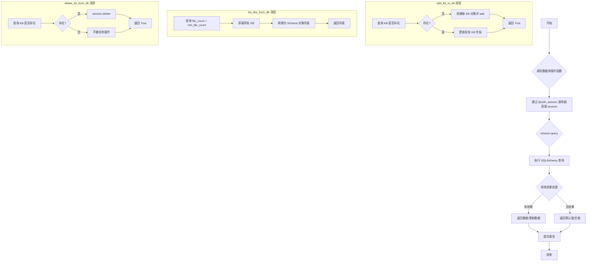
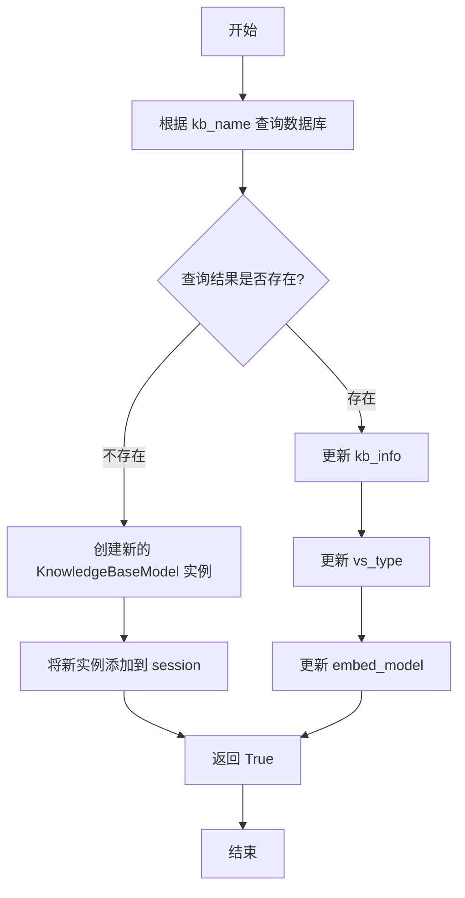
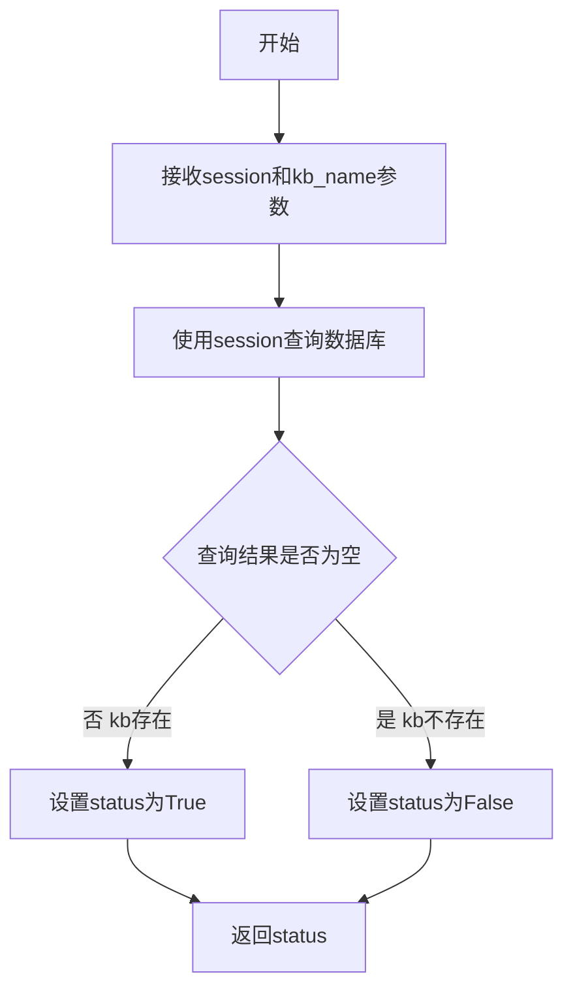
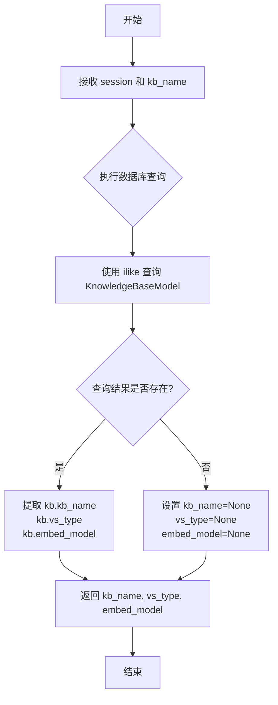
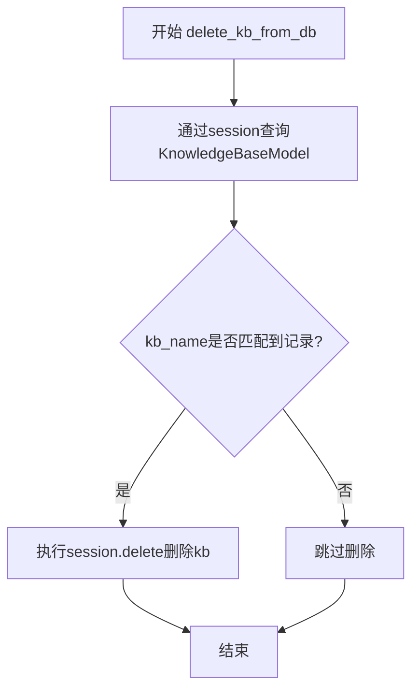
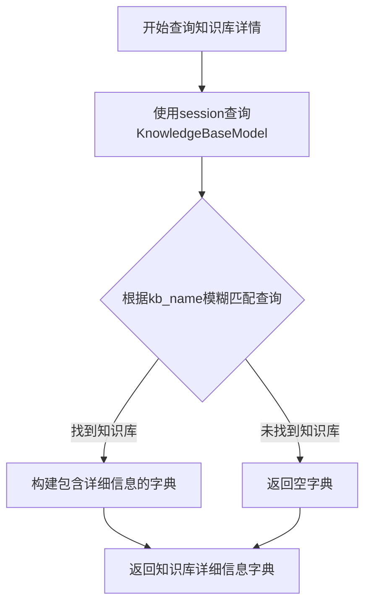
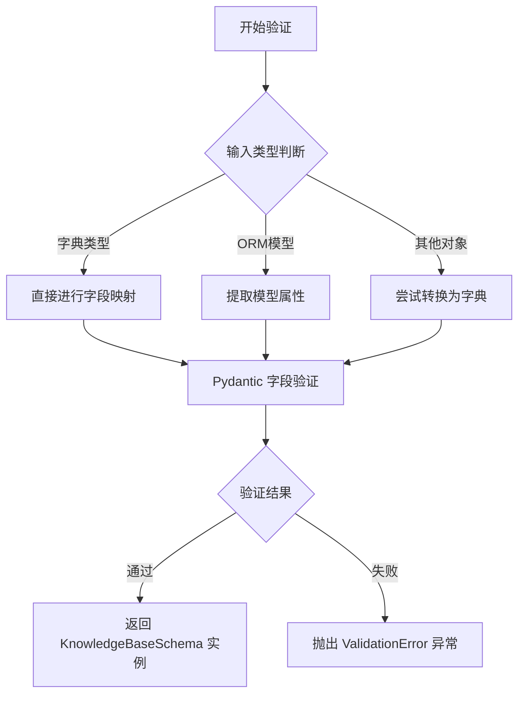

# `Langchain-Chatchat\libs\chatchat-server\chatchat\server\db\repository\knowledge_base_repository.py` 详细设计文档

该模块提供了知识库（Knowledge Base）的数据库 CRUD 操作封装，通过 @with_session 装饰器管理数据库会话，实现了知识库的添加/更新、列表查询、存在性检查、详情获取和删除功能。

## 整体流程



## 类结构

```
KnowledgeBaseModel (数据库模型类 - 外部导入)
├── kb_name: str
├── kb_info: str
├── vs_type: str
├── embed_model: str
├── file_count: int
└── create_time: datetime

KnowledgeBaseSchema (Pydantic Schema - 外部导入)
└── 用于数据验证和序列化

本文件模块 (函数式模块)
├── add_kb_to_db (添加/更新知识库)
├── list_kbs_from_db (列表查询)
├── kb_exists (存在性检查)
├── load_kb_from_db (加载知识库)
├── delete_kb_from_db (删除知识库)
└── get_kb_detail (获取详情)
```

## 全局变量及字段


### `add_kb_to_db`
    
添加或更新知识库记录到数据库，支持新建或修改已有知识库的向量存储类型和嵌入模型

类型：`function`
    


### `list_kbs_from_db`
    
从数据库检索所有知识库列表，可根据最小文件数量过滤，支持返回Schema序列化对象

类型：`function`
    


### `kb_exists`
    
检查指定名称的知识库是否存在于数据库中，返回布尔值表示存在状态

类型：`function`
    


### `load_kb_from_db`
    
根据知识库名称从数据库加载完整信息，包括向量存储类型和嵌入模型，若不存在则返回None

类型：`function`
    


### `delete_kb_from_db`
    
从数据库中删除指定名称的知识库记录，执行数据库删除操作后返回成功状态

类型：`function`
    


### `get_kb_detail`
    
获取指定知识库的详细信息字典，包含名称、描述、向量类型、嵌入模型、文件数量和创建时间

类型：`function`
    


### `KnowledgeBaseModel.kb_name`
    
知识库名称

类型：`str`
    


### `KnowledgeBaseModel.kb_info`
    
知识库描述信息

类型：`str`
    


### `KnowledgeBaseModel.vs_type`
    
向量存储类型

类型：`str`
    


### `KnowledgeBaseModel.embed_model`
    
嵌入模型名称

类型：`str`
    


### `KnowledgeBaseModel.file_count`
    
文件数量

类型：`int`
    


### `KnowledgeBaseModel.create_time`
    
创建时间

类型：`datetime`
    
    

## 全局函数及方法


### `add_kb_to_db`

该函数用于在数据库中创建新的知识库记录或更新已存在的知识库信息。它通过知识库名称查询数据库，如果不存在则创建新记录，否则更新现有的向量存储类型和嵌入模型信息。

参数：

- `session`：`Session`，由 `@with_session` 装饰器注入的数据库会话对象
- `kb_name`：`str`，知识库的名称，用于唯一标识知识库
- `kb_info`：`str`，知识库的描述信息
- `vs_type`：`str`，向量存储类型（如 faiss、milvus 等）
- `embed_model`：`str`，嵌入模型的名称

返回值：`bool`，返回 `True` 表示操作成功

#### 流程图



#### 带注释源码

```python
@with_session
def add_kb_to_db(session, kb_name, kb_info, vs_type, embed_model):
    # 根据知识库名称查询数据库中是否已存在该知识库
    kb = (
        session.query(KnowledgeBaseModel)
        .filter(KnowledgeBaseModel.kb_name.ilike(kb_name))
        .first()
    )
    
    # 如果不存在，则创建新的知识库记录
    if not kb:
        kb = KnowledgeBaseModel(
            kb_name=kb_name, kb_info=kb_info, vs_type=vs_type, embed_model=embed_model
        )
        session.add(kb)
    else:  # 如果已存在，则更新知识库的向量存储类型和嵌入模型
        kb.kb_info = kb_info
        kb.vs_type = vs_type
        kb.embed_model = embed_model
    
    # 返回操作成功标志
    return True
```


### `list_kbs_from_db`

该函数用于从数据库中检索知识库列表，可根据最小文件数量过滤结果，并将查询到的知识库模型转换为Schema格式后返回。

参数：

- `session`：数据库会话对象，由 `@with_session` 装饰器自动注入
- `min_file_count`：`int`，可选参数，默认值为 `-1`，用于过滤文件数量大于此值的知识库

返回值：`List[KnowledgeBaseSchema]`，返回符合文件数量条件的所有知识库列表，每个元素为通过 `KnowledgeBaseSchema.model_validate()` 验证后的知识库对象

#### 流程图

```mermaid
flowchart TD
    A[开始] --> B[接收 session 和 min_file_count 参数]
    B --> C[使用 session 查询 KnowledgeBaseModel]
    C --> D[过滤条件: file_count > min_file_count]
    D --> E[执行 .all() 获取所有匹配结果]
    E --> F{查询结果是否为空}
    F -->|是| G[返回空列表]
    F -->|否| H[遍历每个 kb 对象]
    H --> I[调用 KnowledgeBaseSchema.model_validate 验证转换]
    I --> J[将转换后的对象存入新列表]
    J --> K[返回知识库列表]
    G --> K
```

#### 带注释源码

```python
@with_session  # 装饰器：自动管理数据库会话的创建和提交
def list_kbs_from_db(session, min_file_count: int = -1):
    """
    从数据库中检索知识库列表
    
    Args:
        session: 数据库会话对象，由 with_session 装饰器自动注入
        min_file_count: 最小文件数量阈值，默认 -1 表示不过滤
    
    Returns:
        符合条件的所有知识库列表（KnowledgeBaseSchema 对象列表）
    """
    # 使用 SQLAlchemy 查询 KnowledgeBaseModel 表
    kbs = (
        session.query(KnowledgeBaseModel)
        # 过滤：只返回 file_count 大于 min_file_count 的记录
        .filter(KnowledgeBaseModel.file_count > min_file_count)
        # 获取所有匹配的记录
        .all()
    )
    # 将每个 KnowledgeBaseModel 对象转换为 KnowledgeBaseSchema 对象
    kbs = [KnowledgeBaseSchema.model_validate(kb) for kb in kbs]
    # 返回转换后的知识库列表
    return kbs
```


### `kb_exists`

检查指定名称的知识库是否存在于数据库中。

参数：

- `session`：数据库会话对象，由 `@with_session` 装饰器自动注入
- `kb_name`：字符串（`str`），要检查的知识库名称

返回值：`bool`，如果知识库存在返回 `True`，否则返回 `False`

#### 流程图



#### 带注释源码

```python
@with_session
def kb_exists(session, kb_name):
    """
    检查指定名称的知识库是否存在于数据库中
    
    Args:
        session: 数据库会话对象，由装饰器注入
        kb_name: 要检查的知识库名称
    
    Returns:
        bool: 知识库是否存在
    """
    # 使用session查询KnowledgeBaseModel表中kb_name字段与输入参数kb_name匹配（不区分大小写）的记录
    kb = (
        session.query(KnowledgeBaseModel)
        .filter(KnowledgeBaseModel.kb_name.ilike(kb_name))
        .first()
    )
    # 根据查询结果设置状态：如果找到kb则status为True，否则为False
    status = True if kb else False
    # 返回知识库是否存在的结果
    return status
```


### `load_kb_from_db`

该函数用于从数据库中根据知识库名称查询并加载知识库的核心配置信息（包括知识库名称、向量存储类型和嵌入模型），如果不存在则返回空值。

参数：

- `session`：Session，由 `@with_session` 装饰器自动注入的数据库会话对象
- `kb_name`：str，知识库的名称，用于在数据库中匹配目标知识库

返回值：`Tuple[Optional[str], Optional[str], Optional[str]]`，返回一个元组，依次包含知识库名称、向量存储类型和嵌入模型；如果知识库不存在，则返回 `(None, None, None)`

#### 流程图



#### 带注释源码

```python
@with_session
def load_kb_from_db(session, kb_name):
    """
    从数据库加载知识库的核心配置信息
    
    Args:
        session: 数据库会话对象，由 with_session 装饰器注入
        kb_name: 知识库名称，用于匹配数据库中的记录
    
    Returns:
        Tuple[Optional[str], Optional[str], Optional[str]]: 
            - kb_name: 知识库名称
            - vs_type: 向量存储类型
            - embed_model: 嵌入模型配置
            如果知识库不存在，则返回 (None, None, None)
    """
    # 使用 session 查询 KnowledgeBaseModel 表
    # 使用 ilike 进行大小写不敏感的模糊匹配
    kb = (
        session.query(KnowledgeBaseModel)
        .filter(KnowledgeBaseModel.kb_name.ilike(kb_name))
        .first()
    )
    
    # 判断查询结果是否存在
    if kb:
        # 如果知识库存在，提取核心配置信息
        kb_name, vs_type, embed_model = kb.kb_name, kb.vs_type, kb.embed_model
    else:
        # 如果知识库不存在，返回 None 值元组
        kb_name, vs_type, embed_model = None, None, None
    
    # 返回知识库配置信息元组
    return kb_name, vs_type, embed_model
```


### `delete_kb_from_db`

该函数用于从数据库中删除指定名称的知识库记录。函数接收知识库名称作为参数，通过SQLAlchemy查询匹配的知识库模型实例，若存在则从数据库会话中删除该记录，最后无论删除是否成功均返回True。

参数：

- `session`：`Session`，数据库会话对象，由`@with_session`装饰器自动注入管理
- `kb_name`：`str`，要删除的知识库名称，用于在数据库中匹配对应的知识库记录

返回值：`bool`，返回True，表示操作执行完成（注：无论是否实际删除成功都返回True，存在逻辑缺陷）

#### 流程图



#### 带注释源码

```python
@with_session  # 装饰器：自动管理数据库会话的创建与提交
def delete_kb_from_db(session, kb_name):
    """
    从数据库中删除指定知识库
    
    Args:
        session: 数据库会话对象，由装饰器注入
        kb_name: 要删除的知识库名称
    
    Returns:
        bool: 始终返回True（设计缺陷：未区分是否真正删除了记录）
    """
    # 使用ilike进行大小写不敏感的模糊匹配查询
    kb = (
        session.query(KnowledgeBaseModel)
        .filter(KnowledgeBaseModel.kb_name.ilike(kb_name))
        .first()
    )
    
    # 如果查询到对应的知识库记录，则执行删除操作
    if kb:
        session.delete(kb)
    
    # 注意：无论是否成功删除都返回True，可能导致调用者无法判断实际执行结果
    return True
```


### `get_kb_detail`

获取指定知识库的详细信息，包括知识库名称、描述、向量存储类型、嵌入模型、文件数量和创建时间。如果知识库不存在，则返回空字典。

参数：

- `session`：由 `@with_session` 装饰器自动注入的数据库会话对象，用于执行数据库查询操作
- `kb_name`：`str`，知识库的名称，用于在数据库中查询对应的知识库记录

返回值：`dict`，包含知识库的详细信息的字典。如果知识库存在，返回包含以下键的字典：`kb_name`（知识库名称）、`kb_info`（知识库描述信息）、`vs_type`（向量存储类型）、`embed_model`（嵌入模型）、`file_count`（文件数量）、`create_time`（创建时间）；如果知识库不存在，则返回空字典 `{}`

#### 流程图



#### 带注释源码

```python
@with_session
def get_kb_detail(session, kb_name: str) -> dict:
    """
    获取指定知识库的详细信息
    
    参数:
        session: 数据库会话对象，由装饰器自动注入
        kb_name: 知识库名称，用于查询
    
    返回:
        包含知识库详细信息的字典，如果不存在则返回空字典
    """
    # 使用session查询KnowledgeBaseModel表，通过ilike进行模糊匹配查询
    kb: KnowledgeBaseModel = (
        session.query(KnowledgeBaseModel)
        .filter(KnowledgeBaseModel.kb_name.ilike(kb_name))
        .first()
    )
    
    # 判断查询结果是否存在
    if kb:
        # 知识库存在，构建并返回包含详细信息的字典
        return {
            "kb_name": kb.kb_name,           # 知识库名称
            "kb_info": kb.kb_info,           # 知识库描述信息
            "vs_type": kb.vs_type,           # 向量存储类型
            "embed_model": kb.embed_model,    # 嵌入模型
            "file_count": kb.file_count,     # 文件数量
            "create_time": kb.create_time,   # 创建时间
        }
    else:
        # 知识库不存在，返回空字典
        return {}
```


### `KnowledgeBaseSchema.model_validate`

Pydantic 模型验证方法，用于将 ORM 模型（如 KnowledgeBaseModel）验证并转换为 Pydantic 模型（KnowledgeBaseSchema）实例，确保数据符合 Schema 定义的类型和约束。

参数：

-  `obj`：`Any`，待验证的对象，可以是字典、ORM 模型实例或其他支持的对象
-  `mode`：`ValidationMode`（可选），验证模式，默认为 `'python'`
  - `'python'`: 允许 Python 对象通过
  - `'json'`: 仅接受 JSON 兼容类型
  - `'schema'`: 基于 JSON Schema 进行验证

返回值：`KnowledgeBaseSchema`，验证并转换后的 Pydantic 模型实例

#### 流程图



#### 带注释源码

```
# KnowledgeBaseSchema.model_validate() 是 Pydantic v2 的模型验证方法
# 用于将外部数据验证并转换为 Pydantic 模型实例

# 在代码中的实际使用方式：
kbs = [KnowledgeBaseSchema.model_validate(kb) for kb in kbs]
# - kb: KnowledgeBaseModel ORM 模型实例
# - model_validate 会提取 kb 的属性
# - 根据 KnowledgeBaseSchema 定义进行验证
# - 返回 KnowledgeBaseSchema（Pydantic 模型）实例

# 示例调用过程：
# 1. 输入: kb (KnowledgeBaseModel, 包含 kb_name, kb_info, vs_type, embed_model 等属性)
# 2. model_validate 内部:
#    a. 检查 kb 是否为有效对象
#    b. 提取 kb 的属性值
#    c. 对照 KnowledgeBaseSchema 的字段定义进行类型和约束验证
#    d. 如果验证通过，创建并返回 KnowledgeBaseSchema 实例
#    e. 如果验证失败，抛出 pydantic_core.ValidationError

# 典型返回值示例 (KnowledgeBaseSchema 实例):
# KnowledgeBaseSchema(
#     kb_name="example_kb",
#     kb_info="这是知识库描述",
#     vs_type="text2vec",
#     embed_model="bge-medium",
#     file_count=10,
#     create_time=datetime(2024, 1, 1, 0, 0, 0)
# )
```


## 关键组件


### 知识库数据模型

表示知识库的数据库模型，包含知识库名称、信息、向量存储类型、嵌入模型、文件数量和创建时间等字段。

### 会话管理装饰器

通过`@with_session`装饰器自动管理数据库会话的生命周期，提供事务处理和异常回滚能力。

### 添加知识库功能

创建新的知识库记录或更新已存在的知识库信息，支持知识库的创建和更新操作。

### 列出知识库功能

从数据库查询并返回知识库列表，支持按文件数量过滤，可将数据库模型转换为Schema格式。

### 知识库存在性检查

通过知识库名称进行模糊匹配（不区分大小写），判断指定知识库是否已存在于数据库中。

### 加载知识库功能

根据知识库名称查询并返回知识库的基本配置信息，包括向量存储类型和嵌入模型。

### 删除知识库功能

根据知识库名称从数据库中删除指定的知识库记录。

### 获取知识库详情功能

查询并返回知识库的完整详细信息，包括名称、信息、向量存储类型、嵌入模型、文件数量和创建时间。


## 问题及建议


### 已知问题

-   **查询性能问题**：所有查询都使用 `ilike` 进行不区分大小写的匹配，这会导致数据库无法使用索引（尤其是 kb_name 字段），在大数据量下会造成性能瓶颈。
-   **代码重复**：每个函数都包含相同的查询模式 `session.query(KnowledgeBaseModel).filter(KnowledgeBaseModel.kb_name.ilike(kb_name)).first()`，违反了 DRY 原则。
-   **缺少错误处理**：所有函数都没有 try-except 捕获可能的数据库异常（如连接失败、事务超时等），可能导致未处理的异常向上传播。
-   **事务管理不明确**：`@with_session` 装饰器的事务行为不明确，没有显式的事务提交/回滚控制，删除操作可能存在隐式风险。
-   **返回值不一致**：`get_kb_detail` 在知识库不存在时返回空字典 `{}`，而 `load_kb_from_db` 返回 `None`，不同函数返回类型不统一可能导致调用方处理困难。
-   **delete_kb_from_db 缺少验证**：删除前没有检查知识库是否存在，也没有检查是否存在关联的向量数据或文件，误删风险较高。
-   **list_kbs_from_db 缺少分页**：当 `min_file_count=-1` 时会返回所有记录，可能导致内存溢出或响应时间过长。

### 优化建议

-   **添加数据库索引**：在 `kb_name` 字段上添加唯一索引或区分大小写的索引，优化查询性能。
-   **提取公共查询逻辑**：创建私有方法如 `_get_kb_by_name(session, kb_name)` 来避免重复代码。
-   **统一返回值规范**：对于"未找到"的情况，建议统一返回 `None` 或抛出自定义异常，而不是混合使用空字典和 None。
-   **增强错误处理**：为每个数据库操作添加 try-except 包装，捕获 `SQLAlchemyError` 及其子类，记录日志并返回有意义的错误信息。
-   **添加分页支持**：`list_kbs_from_db` 应支持 `offset` 和 `limit` 参数，避免一次性加载大量数据。
-   **删除前增加校验**：在 `delete_kb_from_db` 中先调用 `kb_exists` 确认存在，或返回明确的删除结果（如是否成功、影响的行数）。
-   **考虑使用缓存**：对于 `kb_exists`、`list_kbs_from_db` 等读频繁的操作，可引入缓存层减少数据库压力。

## 其它


### 设计目标与约束

本模块的设计目标是为知识库管理系统提供统一的数据库访问层，实现知识库的创建、查询、更新和删除等基本CRUD操作。约束包括：1）必须使用SQLAlchemy ORM框架进行数据库操作；2）所有数据库操作必须通过@with_session装饰器管理会话；3）知识库名称(kb_name)查询采用ilike模糊匹配，不区分大小写；4）返回的数据必须符合KnowledgeBaseSchema验证规范。

### 错误处理与异常设计

数据库操作采用隐式错误处理模式，通过SQLAlchemy的异常机制自动处理。主要异常场景包括：1）数据库连接失败时，@with_session装饰器会捕获异常并回滚事务；2）查询结果为空时返回None或空字典/列表，而非抛出异常；3）唯一性约束冲突时（如kb_name重复），由数据库层抛出IntegrityError。该设计将异常处理委托给上层调用者，本模块本身不进行额外的异常捕获和处理。

### 外部依赖与接口契约

本模块依赖以下外部组件：1）KnowledgeBaseModel - SQLAlchemy ORM模型类，定义知识库表结构；2）KnowledgeBaseSchema - Pydantic数据验证模式，用于序列化和验证返回数据；3）with_session装饰器 - 自定义数据库会话管理装饰器，负责创建和销毁数据库会话。接口契约方面：所有函数第一个参数为session，由装饰器自动注入；kb_name参数支持模糊匹配；vs_type和embed_model参数描述向量存储类型和嵌入模型。

### 事务处理机制

本模块采用声明式事务管理，通过@with_session装饰器实现。装饰器在函数执行前创建session，执行后提交事务。如果函数执行过程中发生异常，装饰器会自动回滚事务。每个数据库操作（add、delete、update）都会立即影响数据库，无需显式调用session.commit()。

### 并发控制与资源管理

并发控制依赖SQLAlchemy的Session生命周期管理。每个请求通过@with_session装饰器获得独立的session实例，实现请求级别的隔离。资源管理方面：1）session由装饰器自动关闭，无需手动释放；2）大量查询时（如list_kbs_from_db），注意内存占用，建议分页处理；3）delete操作仅标记删除，未真正删除数据，需依赖数据库配置进行物理清理。

### 性能优化建议

当前实现存在以下性能优化空间：1）list_kbs_from_db无分页机制，大数据量时应添加limit和offset参数；2）重复使用的查询逻辑（如kb_name的ilike查询）可提取为公共方法；3）kb_exists和load_kb_from_db执行相同查询，存在冗余；4）建议添加查询结果缓存机制，减少数据库IO。

### 安全性考虑

本模块涉及的数据操作包括：1）用户输入的kb_name、kb_info直接用于数据库查询，存在SQL注入风险（但通过ORM参数化查询已规避）；2）kb_info可能包含敏感信息，建议在返回前进行脱敏处理；3）embed_model参数应进行白名单校验，防止加载恶意模型配置。

    