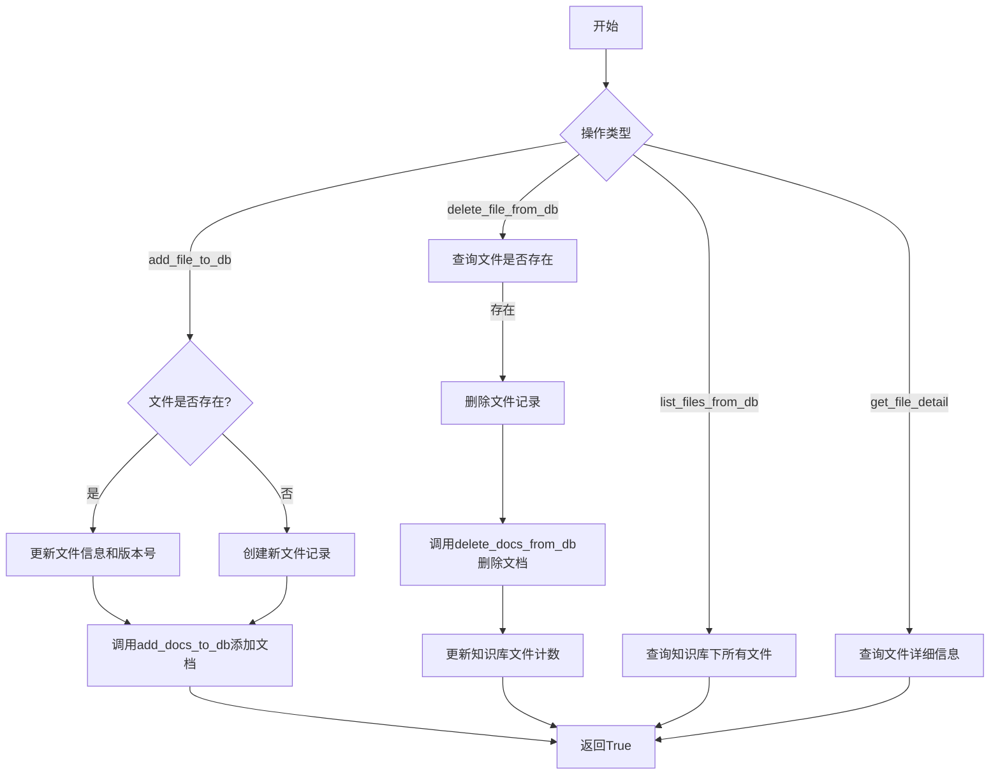
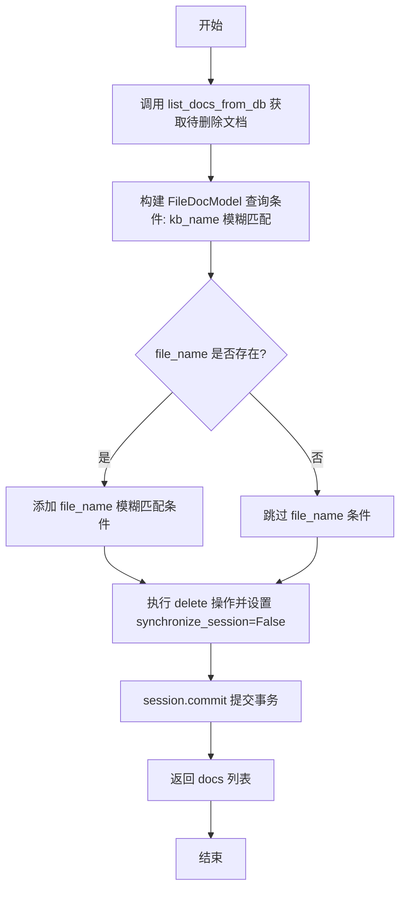
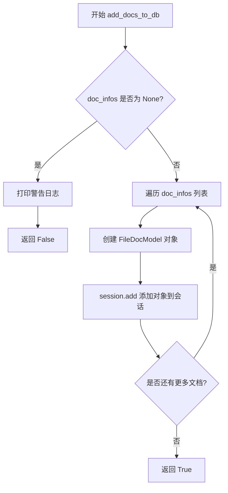
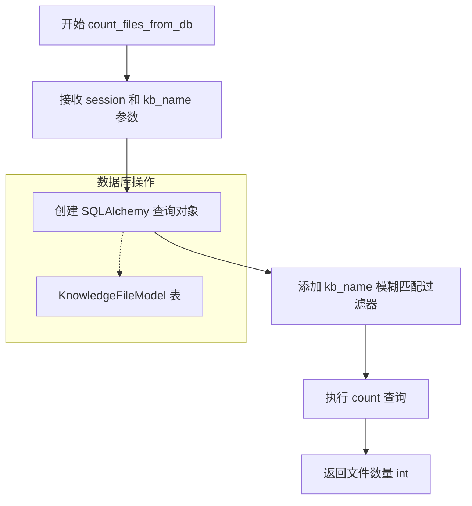
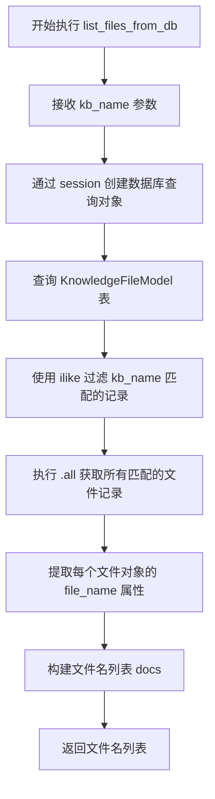
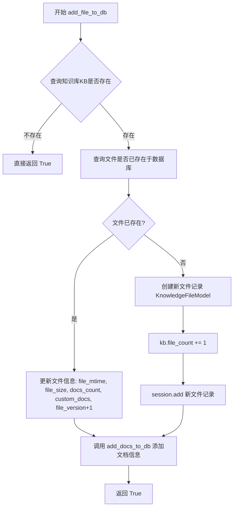
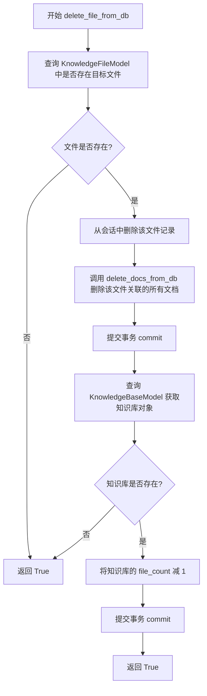
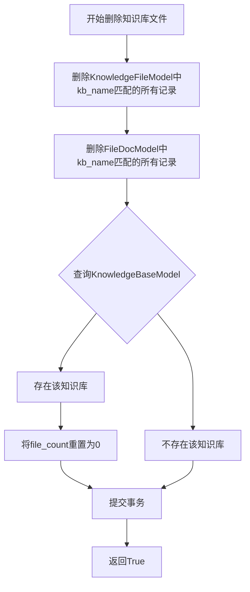
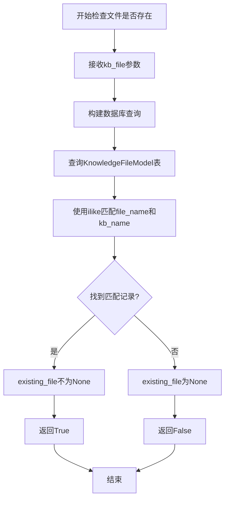
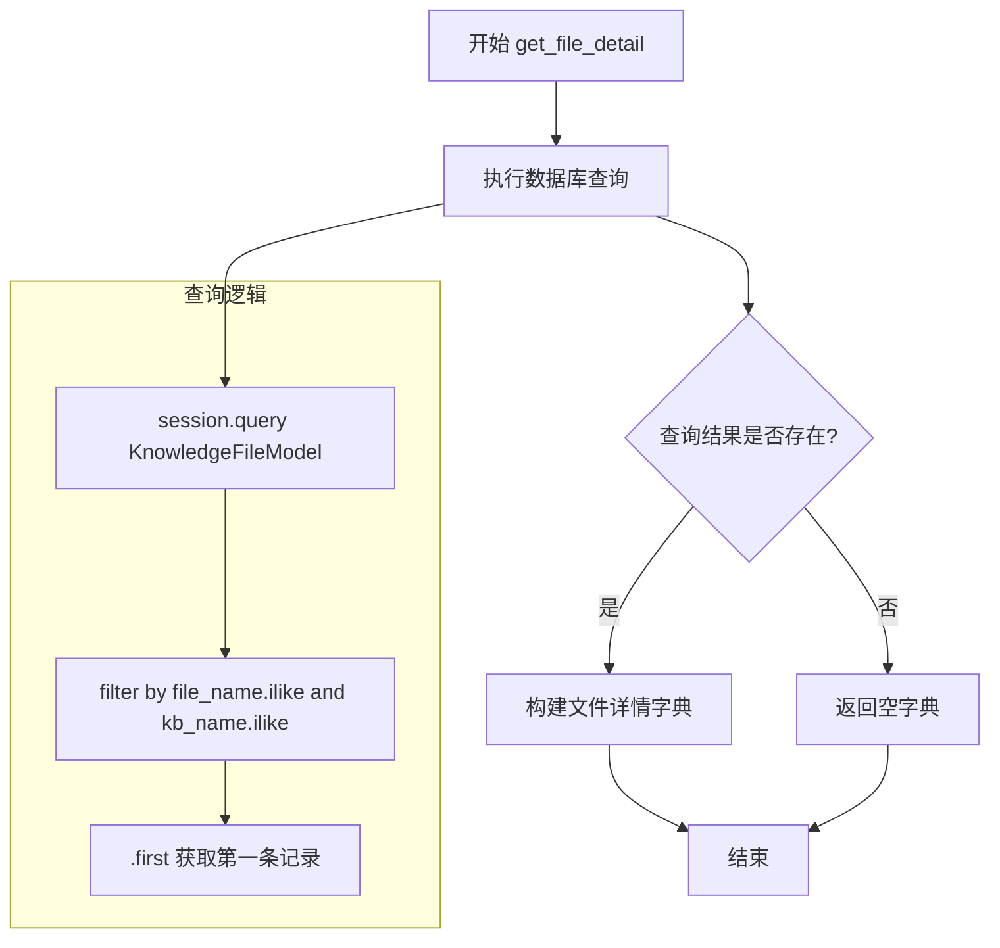

# `Langchain-Chatchat\libs\chatchat-server\chatchat\server\db\repository\knowledge_file_repository.py` 详细设计文档

该文件是ChatChat知识库模块的数据库仓库层，实现了知识库文件和文档的CRUD操作，通过SQLAlchemy ORM与数据库交互，提供文件添加、删除、查询及文档管理等功能。

## 整体流程



## 类结构

```
无自定义类
├── 全局函数 (仓库层)
│   ├── list_file_num_docs_id_by_kb_name_and_file_name
│   ├── list_docs_from_db
│   ├── delete_docs_from_db
│   ├── add_docs_to_db
│   ├── count_files_from_db
│   ├── list_files_from_db
│   ├── add_file_to_db
│   ├── delete_file_from_db
│   ├── delete_files_from_db
│   ├── file_exists_in_db
│   └── get_file_detail
└── 依赖的模型类
    ├── KnowledgeBaseModel
    ├── KnowledgeFileModel
    ├── FileDocModel
    └── KnowledgeFile
```

## 全局变量及字段


### `doc_ids`
    
存储从数据库查询到的文档ID元组列表

类型：`List[Tuple[Any]]`
    


### `docs`
    
存储从数据库查询到的文档对象列表

类型：`List[FileDocModel]`
    


### `query`
    
SQLAlchemy查询对象，用于构建删除文档的查询条件

类型：`Query`
    


### `kb`
    
从数据库查询到的知识库对象实例

类型：`KnowledgeBaseModel`
    


### `existing_file`
    
从数据库查询到的文件模型对象，用于判断文件是否已存在

类型：`KnowledgeFileModel`
    


### `mtime`
    
文件的修改时间，通过KnowledgeFile对象的get_mtime方法获取

类型：`Union[str, datetime]`
    


### `size`
    
文件大小，通过KnowledgeFile对象的get_size方法获取

类型：`Union[int, str]`
    


### `new_file`
    
新创建的文件模型对象，用于添加到数据库

类型：`KnowledgeFileModel`
    


### `file`
    
从数据库查询到的文件详情对象

类型：`KnowledgeFileModel`
    


    

## 全局函数及方法


### `list_file_num_docs_id_by_kb_name_and_file_name`

根据知识库名称和文件名称，查询并返回该文件对应的所有Document的ID列表。

参数：

- `session`：`Session`，数据库会话对象（由 `@with_session` 装饰器自动注入）
- `kb_name`：`str`，知识库的名称，用于指定查询的目标知识库
- `file_name`：`str`，文件的名称，用于指定查询的目标文件

返回值：`List[int]`，返回与指定知识库和文件关联的所有Document的ID列表，元素为整数类型

#### 流程图

```mermaid
flowchart TD
    A[开始] --> B[接收 kb_name 和 file_name 参数]
    B --> C[通过 session 查询 FileDocModel.doc_id]
    C --> D[使用 filter_by 按 kb_name 和 file_name 过滤]
    E[获取所有匹配的 doc_id 结果] --> F[将查询结果转换为整数列表]
    F --> G[返回 List[int]]
    
    style A fill:#f9f,stroke:#333
    style G fill:#9f9,stroke:#333
```

#### 带注释源码

```python
@with_session  # 装饰器：自动管理数据库会话的创建和提交
def list_file_num_docs_id_by_kb_name_and_file_name(
    session,        # 数据库会话对象，由装饰器注入
    kb_name: str,   # 知识库名称
    file_name: str, # 文件名称
) -> List[int]:
    """
    列出某知识库某文件对应的所有Document的id。
    返回形式：[str, ...]
    """
    # 使用 SQLAlchemy 查询 FileDocModel 表中的 doc_id 字段
    # 通过 kb_name 和 file_name 两个条件进行精确匹配过滤
    doc_ids = (
        session.query(FileDocModel.doc_id)
        .filter_by(kb_name=kb_name, file_name=file_name)
        .all()  # 获取所有匹配的记录
    )
    # 将查询结果（可能是元组或其他形式）转换为 int 类型列表并返回
    # 注意：原注释写的是返回 [str, ...]，但实际代码返回的是 List[int]
    return [int(_id[0]) for _id in doc_ids]
```


### `list_docs_from_db`

列出某知识库中指定文件对应的所有 Document，支持按文件名和元数据进行过滤查询。

参数：

- `session`：`Session`，数据库会话对象，由 `@with_session` 装饰器自动注入
- `kb_name`：`str`，知识库名称，用于过滤查询
- `file_name`：`str`，文件名（可选），用于进一步过滤查询，默认为 `None`
- `metadata`：`Dict`，元数据字典（可选），用于按元数据键值对过滤查询，默认为空字典 `{}`

返回值：`List[Dict]`，返回文档列表，每个元素包含文档 ID 和元数据，格式为 `[{"id": str, "metadata": dict}, ...]`

#### 流程图

```mermaid
flowchart TD
    A[开始] --> B[接收参数: session, kb_name, file_name, metadata]
    B --> C[创建基础查询: session.query<br/>FileDocModel 过滤 kb_name]
    C --> D{file_name 是否存在?}
    D -->|是| E[添加 file_name 过滤条件]
    D -->|否| F{metadata 是否为空?}
    E --> F
    F -->|否| G[遍历 metadata 字典<br/>添加元数据过滤条件]
    F -->|是| H[执行查询 .all()]
    G --> H
    H --> I[遍历结果转换为字典列表<br/>{id: x.doc_id, metadata: x.metadata}]
    I --> J[返回文档列表]
```

#### 带注释源码

```python
@with_session
def list_docs_from_db(
    session,
    kb_name: str,
    file_name: str = None,
    metadata: Dict = {},
) -> List[Dict]:
    """
    列出某知识库某文件对应的所有Document。
    返回形式：[{"id": str, "metadata": dict}, ...]
    """
    # 基础查询：按知识库名称过滤，使用 ilike 进行模糊匹配（不区分大小写）
    docs = session.query(FileDocModel).filter(FileDocModel.kb_name.ilike(kb_name))
    
    # 如果提供了文件名，则添加文件名过滤条件
    if file_name:
        docs = docs.filter(FileDocModel.file_name.ilike(file_name))
    
    # 遍历元数据字典，添加元数据字段的过滤条件
    # 使用 as_string() 将元数据字段转换为字符串进行比较
    for k, v in metadata.items():
        docs = docs.filter(FileDocModel.meta_data[k].as_string() == str(v))

    # 执行查询并将结果转换为指定格式的字典列表
    # 每个元素包含文档的 doc_id 和 metadata
    return [{"id": x.doc_id, "metadata": x.metadata} for x in docs.all()]
```


### `delete_docs_from_db`

该函数用于删除指定知识库中特定文件对应的所有 Document 记录，并在删除前先查询返回将被删除的 Document 信息，以便调用者获取已删除文档的元数据。

参数：

- `session`：`Session`，数据库会话对象，由 `@with_session` 装饰器自动注入管理事务
- `kb_name`：`str`，知识库名称，用于定位目标知识库
- `file_name`：`str`，可选参数，文件名，用于进一步筛选要删除的文档

返回值：`List[Dict]`，返回被删除的 Document 列表，每个元素为 `{"id": str, "metadata": dict}` 格式

#### 流程图



#### 带注释源码

```python
@with_session
def delete_docs_from_db(
    session,          # 数据库会话对象，由装饰器自动注入
    kb_name: str,     # 知识库名称，用于定位目标知识库
    file_name: str = None,  # 可选的文件名，用于精确删除某文件下的文档
) -> List[Dict]:
    """
    删除某知识库某文件对应的所有Document，并返回被删除的Document。
    返回形式：[{"id": str, "metadata": dict}, ...]
    """
    # 第一步：先查询出符合条件的文档，以便返回给调用者
    # 调用 list_docs_from_db 获取当前 kb_name 和 file_name 下的所有文档
    docs = list_docs_from_db(kb_name=kb_name, file_name=file_name)
    
    # 第二步：构建删除查询
    # 使用 ilike 进行大小写不敏感的模糊匹配
    query = session.query(FileDocModel).filter(FileDocModel.kb_name.ilike(kb_name))
    
    # 如果提供了 file_name，则添加文件名的过滤条件
    if file_name:
        query = query.filter(FileDocModel.file_name.ilike(file_name))
    
    # 第三步：执行删除操作
    # synchronize_session=False 表示不同步会话中的对象，直接从数据库删除
    query.delete(synchronize_session=False)
    
    # 第四步：提交事务，确保删除操作持久化到数据库
    session.commit()
    
    # 第五步：返回被删除的文档列表（删除前查询的结果）
    return docs
```


### `add_docs_to_db`

将某知识库中指定文件的所有 Document 信息批量添加到数据库中。

参数：

- `session`：数据库会话对象，由 `@with_session` 装饰器自动注入
- `kb_name`：`str`，目标知识库的名称
- `file_name`：`str`，目标文件的名称
- `doc_infos`：`List[Dict]`，要添加的文档信息列表，格式为 `[{"id": str, "metadata": dict}, ...]`

返回值：`bool`，表示添加操作是否成功（若 `doc_infos` 为 `None` 返回 `False`，否则返回 `True`）

#### 流程图



#### 带注释源码

```python
@with_session
def add_docs_to_db(session, kb_name: str, file_name: str, doc_infos: List[Dict]):
    """
    将某知识库某文件对应的所有Document信息添加到数据库。
    doc_infos形式：[{"id": str, "metadata": dict}, ...]
    """
    # 检查输入参数 doc_infos 是否为 None
    # ! 这里会出现doc_infos为None的情况，需要进一步排查
    if doc_infos is None:
        print(
            "输入的server.db.repository.knowledge_file_repository.add_docs_to_db的doc_infos参数为None"
        )
        return False
    
    # 遍历文档信息列表，逐一创建数据库模型对象并添加到会话
    for d in doc_infos:
        obj = FileDocModel(
            kb_name=kb_name,        # 知识库名称
            file_name=file_name,    # 文件名称
            doc_id=d["id"],          # 文档ID
            meta_data=d["metadata"], # 文档元数据
        )
        session.add(obj)             # 将对象添加到数据库会话
    
    return True  # 添加成功返回 True
```


### `count_files_from_db`

该函数用于统计指定知识库（Knowledge Base）中的文件总数，通过查询数据库中 `KnowledgeFileModel` 表并对匹配知识库名称的记录进行计数。

参数：

- `session`：`Session`，数据库会话对象，由 `@with_session` 装饰器自动注入
- `kb_name`：`str`，知识库的名称，用于过滤查询条件

返回值：`int`，返回指定知识库中包含的文件数量

#### 流程图



#### 带注释源码

```python
@with_session
def count_files_from_db(session, kb_name: str) -> int:
    """
    统计指定知识库中的文件数量。
    
    参数:
        session: 数据库会话对象，由 @with_session 装饰器自动注入
        kb_name: str，知识库的名称
    
    返回:
        int，该知识库中文件数量
    """
    # 使用 SQLAlchemy 的 query builder 模式构建查询
    # 查询 KnowledgeFileModel 表
    return (
        session.query(KnowledgeFileModel)
        # 使用 ilike 进行大小写不敏感的模糊匹配
        # 过滤出 kb_name 匹配的知识库文件记录
        .filter(KnowledgeFileModel.kb_name.ilike(kb_name))
        # 统计匹配记录的数量
        .count()
    )
```


### `list_files_from_db`

列出指定知识库（Knowledge Base）下的所有文件名。

参数：

-  `session`：由装饰器 `@with_session` 注入的数据库会话对象，用于执行数据库查询操作
-  `kb_name`：待查询的知识库名称（字符串类型），用于过滤查询结果

返回值：`List[str]`，返回该知识库下所有文件名的列表

#### 流程图



#### 带注释源码

```python
@with_session  # 装饰器：自动管理数据库会话的创建与提交
def list_files_from_db(session, kb_name):
    """
    列出指定知识库下的所有文件名。
    
    参数:
        session: 数据库会话对象（由装饰器自动注入）
        kb_name: 知识库名称，用于过滤查询
    
    返回:
        知识库中所有文件的文件名列表
    """
    # 使用 SQLAlchemy 查询 KnowledgeFileModel 表
    # 通过 ilike 进行模糊匹配（不区分大小写）
    files = (
        session.query(KnowledgeFileModel)
        .filter(KnowledgeFileModel.kb_name.ilike(kb_name))
        .all()  # 获取所有匹配的记录
    )
    
    # 提取每个文件对象的 file_name 属性，构建文件名列表
    docs = [f.file_name for f in files]
    
    # 返回文件名列表
    return docs
```


### `add_file_to_db`

该函数用于将知识库文件的信息及其关联的Document文档添加到数据库。如果文件已存在则更新文件元数据（修改时间、大小、文档数量、自定义文档标识）和版本号；如果文件不存在则创建新的文件记录，同时增加知识库的文件计数，并调用`add_docs_to_db`将文档信息批量写入数据库。

参数：

- `session`：数据库会话对象，由`@with_session`装饰器自动注入
- `kb_file`：`KnowledgeFile`，知识库文件对象，包含文件名、知识库名、文件扩展名、文档加载器名称、文本分割器名称等属性
- `docs_count`：`int`，表示该文件包含的文档数量，默认为0
- `custom_docs`：`bool`，表示是否为自定义文档，默认为False
- `doc_infos`：`List[Dict]`，要添加的文档信息列表，形式为`[{"id": str, "metadata": dict}, ...]`，默认为空列表

返回值：`bool`，返回`True`表示操作完成（无论文件是否存在或是否真正执行了数据库写入）

#### 流程图



#### 带注释源码

```python
@with_session
def add_file_to_db(
    session,
    kb_file: KnowledgeFile,
    docs_count: int = 0,
    custom_docs: bool = False,
    doc_infos: List[Dict] = [],  # 形式：[{"id": str, "metadata": dict}, ...]
):
    """
    将知识库文件信息及关联的Document文档添加到数据库。
    
    参数:
        session: 数据库会话对象，由with_session装饰器注入
        kb_file: KnowledgeFile对象，包含文件相关元信息
        docs_count: 文件对应的文档数量
        custom_docs: 是否为自定义文档的标识
        doc_infos: 文档信息列表，每项包含id和metadata
    
    返回:
        bool: 操作完成返回True
    """
    # 根据kb_name查询KnowledgeBaseModel，验证知识库是否存在
    kb = session.query(KnowledgeBaseModel).filter_by(kb_name=kb_file.kb_name).first()
    
    # 如果知识库不存在，直接返回True（静默失败，未抛出异常）
    if kb:
        # 如果已经存在该文件，则更新文件信息与版本号
        # 使用ilike进行大小写不敏感的模糊匹配查询
        existing_file: KnowledgeFileModel = (
            session.query(KnowledgeFileModel)
            .filter(
                KnowledgeFileModel.kb_name.ilike(kb_file.kb_name),
                KnowledgeFileModel.file_name.ilike(kb_file.filename),
            )
            .first()
        )
        
        # 获取文件的修改时间和大小
        mtime = kb_file.get_mtime()
        size = kb_file.get_size()

        # 根据文件是否已存在执行不同的分支逻辑
        if existing_file:
            # 更新已有文件的元数据信息
            existing_file.file_mtime = mtime
            existing_file.file_size = size
            existing_file.docs_count = docs_count
            existing_file.custom_docs = custom_docs
            existing_file.file_version += 1  # 版本号递增
        # 否则，添加新文件记录
        else:
            new_file = KnowledgeFileModel(
                file_name=kb_file.filename,
                file_ext=kb_file.ext,
                kb_name=kb_file.kb_name,
                document_loader_name=kb_file.document_loader_name,
                text_splitter_name=kb_file.text_splitter_name or "SpacyTextSplitter",
                file_mtime=mtime,
                file_size=size,
                docs_count=docs_count,
                custom_docs=custom_docs,
            )
            kb.file_count += 1  # 知识库文件计数+1
            session.add(new_file)  # 添加新文件记录到会话
        
        # 调用add_docs_to_db将文档信息写入数据库
        add_docs_to_db(
            kb_name=kb_file.kb_name, file_name=kb_file.filename, doc_infos=doc_infos
        )
    
    # 无论操作是否真正执行，都返回True
    return True
```


### `delete_file_from_db`

该函数用于从数据库中删除指定知识库中的特定文件及其关联的文档记录，同时更新知识库的文件计数。

参数：

- `session`：会话对象，由装饰器 `@with_session` 自动注入，用于数据库操作
- `kb_file`：`KnowledgeFile` 类型，知识库文件对象，包含 `kb_name`（知识库名称）和 `filename`（文件名）属性

返回值：`bool` 类型，返回 `True` 表示操作执行成功（无论文件是否存在）

#### 流程图



#### 带注释源码

```python
@with_session
def delete_file_from_db(session, kb_file: KnowledgeFile):
    """
    从数据库中删除指定知识库的指定文件及其关联文档
    
    Args:
        session: 数据库会话对象，由 @with_session 装饰器注入
        kb_file: KnowledgeFile 对象，需要包含 kb_name 和 filename 属性
    
    Returns:
        bool: 始终返回 True，表示操作执行完成
    """
    # 根据文件名和知识库名称查询目标文件是否存在
    existing_file = (
        session.query(KnowledgeFileModel)
        .filter(
            KnowledgeFileModel.file_name.ilike(kb_file.filename),  # 使用 ilike 进行模糊匹配（忽略大小写）
            KnowledgeFileModel.kb_name.ilike(kb_file.kb_name),
        )
        .first()
    )
    
    # 如果文件存在则执行删除操作
    if existing_file:
        # 1. 从数据库中删除文件记录
        session.delete(existing_file)
        
        # 2. 删除该文件关联的所有 Document 文档记录
        delete_docs_from_db(kb_name=kb_file.kb_name, file_name=kb_file.filename)
        
        # 3. 提交事务，保存文件删除操作
        session.commit()

        # 4. 查询对应的知识库，递减文件计数
        kb = (
            session.query(KnowledgeBaseModel)
            .filter(KnowledgeBaseModel.kb_name.ilike(kb_file.kb_name))
            .first()
        )
        if kb:
            kb.file_count -= 1
            # 5. 提交事务，保存文件计数更新
            session.commit()
    
    # 无论文件是否存在都返回 True（幂等性设计）
    return True
```


### `delete_files_from_db`

删除指定知识库的所有文件及其关联的Document记录，并将该知识库的文件计数重置为0。

参数：

- `session`：`Session`，由 `@with_session` 装饰器自动注入的数据库会话对象，用于执行数据库操作
- `knowledge_base_name`：`str`，目标知识库的名称，用于匹配要删除的记录

返回值：`bool`，表示删除操作是否成功完成（始终返回 `True`）

#### 流程图



#### 带注释源码

```python
@with_session
def delete_files_from_db(session, knowledge_base_name: str):
    """
    删除指定知识库的所有文件及其关联的Document记录。
    
    参数:
        session: 数据库会话对象，由with_session装饰器注入
        knowledge_base_name: 目标知识库的名称
    
    返回:
        bool: 操作是否成功
    """
    # 删除KnowledgeFileModel中所有kb_name匹配的文件记录
    session.query(KnowledgeFileModel).filter(
        KnowledgeFileModel.kb_name.ilike(knowledge_base_name)
    ).delete(synchronize_session=False)
    
    # 删除FileDocModel中所有kb_name匹配的文档记录
    session.query(FileDocModel).filter(
        FileDocModel.kb_name.ilike(knowledge_base_name)
    ).delete(synchronize_session=False)
    
    # 查询对应的知识库实体
    kb = (
        session.query(KnowledgeBaseModel)
        .filter(KnowledgeBaseModel.kb_name.ilike(knowledge_base_name))
        .first()
    )
    
    # 如果知识库存在，则将文件计数重置为0
    if kb:
        kb.file_count = 0

    # 提交事务，永久删除数据
    session.commit()
    return True
```


### `file_exists_in_db`

检查指定知识库中是否存在指定文件，用于判断文件是否已经存在于数据库中。

参数：

- `session`：`Session`，数据库会话对象，由 `@with_session` 装饰器自动注入
- `kb_file`：`KnowledgeFile`，知识库文件对象，包含文件名（filename）和知识库名（kb_name）

返回值：`bool`，如果文件存在返回 `True`，否则返回 `False`

#### 流程图



#### 带注释源码

```python
@with_session
def file_exists_in_db(session, kb_file: KnowledgeFile):
    """
    检查指定知识库中是否存在指定文件
    
    Args:
        session: 数据库会话对象，由装饰器自动注入
        kb_file: KnowledgeFile类型，包含kb_name和filename属性的知识库文件对象
    
    Returns:
        bool: 文件存在返回True，不存在返回False
    """
    # 使用SQLAlchemy查询KnowledgeFileModel表
    existing_file = (
        session.query(KnowledgeFileModel)
        .filter(
            # 使用ilike进行不区分大小写的文件名匹配
            KnowledgeFileModel.file_name.ilike(kb_file.filename),
            # 使用ilike进行不区分大小写的知识库名匹配
            KnowledgeFileModel.kb_name.ilike(kb_file.kb_name),
        )
        .first()  # 只获取第一条记录，提高查询效率
    )
    # 三元表达式判断文件是否存在
    return True if existing_file else False
```


### `get_file_detail`

获取指定知识库中指定文件的详细信息，包括文件名称、扩展名、版本号、文档加载器、文本分割器、创建时间、修改时间、文件大小、自定义文档标志以及文档数量。如果文件不存在，则返回空字典。

**参数：**

- `session`：`Session`，数据库会话对象，由 `@with_session` 装饰器自动注入
- `kb_name`：`str`，知识库的名称，用于在数据库中定位知识库
- `filename`：`str`，文件的名称，用于在数据库中定位文件

**返回值：** `dict`，包含文件详细信息的字典，键包括 kb_name、file_name、file_ext、file_version、document_loader、text_splitter、create_time、file_mtime、file_size、custom_docs、docs_count；如果文件不存在则返回空字典 `{}`

#### 流程图



#### 带注释源码

```python
@with_session
def get_file_detail(session, kb_name: str, filename: str) -> dict:
    """
    获取指定知识库中指定文件的详细信息。
    
    参数:
        session: 数据库会话对象，由 @with_session 装饰器自动注入
        kb_name: 知识库的名称
        filename: 文件的名称
        
    返回:
        包含文件详细信息的字典，如果文件不存在则返回空字典
    """
    # 使用 SQLAlchemy 查询 KnowledgeFileModel 表
    # 使用 ilike 进行不区分大小写的模糊匹配
    file: KnowledgeFileModel = (
        session.query(KnowledgeFileModel)
        .filter(
            KnowledgeFileModel.file_name.ilike(filename),  # 文件名模糊匹配（不区分大小写）
            KnowledgeFileModel.kb_name.ilike(kb_name),      # 知识库名模糊匹配（不区分大小写）
        )
        .first()  # 获取查询结果的第一条记录
    )
    
    # 判断文件是否存在
    if file:
        # 如果文件存在，构建并返回包含文件详细信息的字典
        return {
            "kb_name": file.kb_name,                        # 知识库名称
            "file_name": file.file_name,                    # 文件名称
            "file_ext": file.file_ext,                      # 文件扩展名
            "file_version": file.file_version,              # 文件版本号
            "document_loader": file.document_loader_name,   # 文档加载器名称
            "text_splitter": file.text_splitter_name,       # 文本分割器名称
            "create_time": file.create_time,                # 创建时间
            "file_mtime": file.file_mtime,                  # 修改时间
            "file_size": file.file_size,                    # 文件大小
            "custom_docs": file.custom_docs,                # 是否为自定义文档
            "docs_count": file.docs_count,                  # 文档数量
        }
    else:
        # 如果文件不存在，返回空字典
        return {}
```

## 关键组件


### 数据库会话管理

通过 `@with_session` 装饰器实现数据库会话的自动管理，包括会话的创建、提交和异常回滚，确保数据库操作的原子性。

### 文档模型访问层

提供对 `FileDocModel` 的增删改查操作，包括 `list_file_num_docs_id_by_kb_name_and_file_name`、`list_docs_from_db`、`delete_docs_from_db`、`add_docs_to_db` 等函数，实现文档级别的数据持久化。

### 文件模型访问层

提供对 `KnowledgeFileModel` 的增删改查操作，包括 `add_file_to_db`、`delete_file_from_db`、`delete_files_from_db`、`file_exists_in_db`、`get_file_detail` 等函数，实现知识库文件元数据的管理。

### 知识库模型关联操作

在 `add_file_to_db` 和 `delete_file_from_db` 中实现了与 `KnowledgeBaseModel` 的级联更新，包括文件计数（`kb.file_count`）的自动维护。

### 条件过滤查询

通过 `ilike` 方法实现不区分大小写的模糊匹配，结合 `metadata` 字典实现动态条件过滤，支持多维度的文档检索。

### 文件版本管理

在 `add_file_to_db` 中实现了文件版本号（`file_version`）的自动递增机制，用于追踪文件的更新历史。


## 问题及建议


### 已知问题

-   **可变默认参数陷阱**：`list_docs_from_db` 的 `metadata: Dict = {}` 和 `add_file_to_db` 的 `doc_infos: List[Dict] = []` 使用了可变对象作为默认参数，这在 Python 中会导致意外行为（所有调用共享同一对象）
-   **事务处理不当**：`delete_file_from_db` 函数中调用了两次 `session.commit()`，应该在同一个事务中完成所有操作，保证原子性
-   **重复查询逻辑**：`delete_docs_from_db` 先调用 `list_docs_from_db` 获取文档列表用于返回，随后又重新构建查询进行删除，存在重复的数据库查询操作
-   **类型转换潜在问题**：`list_docs_from_db` 中使用 `str(v)` 转换 metadata 值进行过滤，可能导致类型不匹配无法使用索引
-   **批量操作缺失**：`add_docs_to_db` 使用循环逐个添加文档，没有使用 SQLAlchemy 的批量插入功能，效率低下
-   **空列表处理不一致**：`add_docs_to_db` 检查了 `doc_infos is None`，但未处理空列表 `[]` 的情况，导致空列表时仍执行无意义的循环
-   **类型注解不完整**：`list_files_from_db` 函数的 `kb_name` 参数缺少类型注解
-   **返回语义不一致**：`delete_docs_from_db` 返回的是删除前的文档列表，而非删除操作的结果，可能造成调用方困惑

### 优化建议

-   将可变默认参数改为 `None`，在函数体内进行默认值初始化，如 `metadata: Dict = None` 后接 `if metadata is None: metadata = {}`
-   移除 `delete_file_from_db` 中的第二次 `commit()`，只在函数末尾统一提交事务
-   重构 `delete_docs_from_db`，避免重复查询，可直接返回删除结果或使用单个查询完成查询和删除
-   考虑在 metadata 过滤时使用数据库原生类型，或在模型层面确保类型一致性
-   使用 `session.bulk_insert_mappings()` 或 `session.add_all()` 批量插入文档
-   对空列表进行显式检查并提前返回，避免不必要的数据库操作
-   完善所有函数的类型注解，包括参数和返回值
-   统一 `delete_docs_from_db` 的返回语义，明确是返回删除结果还是删除前的数据
-   添加适当的异常处理（try-except）和日志记录，提高代码健壮性

## 其它


### 设计目标与约束

本代码模块作为知识库（Knowledge Base）的数据访问层（DAL），主要目标是为知识库系统提供对底层数据库的统一访问接口，屏蔽SQLAlchemy ORM的具体实现细节。设计约束包括：必须使用`@with_session`装饰器确保数据库会话的正确管理；所有数据库操作必须通过已定义的数据模型（KnowledgeBaseModel、KnowledgeFileModel、FileDocModel）进行；函数命名遵循`{操作}_{对象}_from_db`或`{操作}_{对象}_to_db`的统一命名规范。

### 错误处理与异常设计

当前代码的错误处理相对薄弱，主要体现在：1）`add_docs_to_db`函数仅使用`print`输出错误信息，未抛出异常；2）`delete_docs_from_db`和`delete_file_from_db`中的`list_docs_from_db`调用未检查返回结果为空的情况；3）`add_file_to_db`中未检查`kb`是否为None就直接访问其属性。改进建议：使用日志框架替代print输出，统一抛出自定义异常类（如`KnowledgeBaseNotFoundException`、`FileOperationException`），为关键操作添加try-except块并记录详细错误堆栈。

### 数据流与状态机

数据流主要遵循以下路径：外部调用→仓库函数→SQLAlchemy Session→数据库模型→数据库。文件状态转换：新增文件时状态为CREATE，文件存在时执行UPDATE（版本号+1），删除文件时状态为DELETE。文档（Document）与文件（File）为级联关系，删除文件时必须同步删除关联的文档记录。当前代码中`delete_file_from_db`正确实现了级联删除逻辑，但`delete_files_from_db`仅删除记录而未维护KnowledgeBaseModel的file_count一致性。

### 外部依赖与接口契约

本模块依赖以下外部组件：1）`chatchat.server.db.session.with_session`装饰器：提供数据库会话管理；2）数据模型：KnowledgeBaseModel（知识库元数据）、KnowledgeFileModel（文件元数据）、FileDocModel（文档元数据）；3）`KnowledgeFile`工具类：提供文件元信息获取（get_mtime、get_size）。接口契约方面：所有`@with_session`修饰的函数第一个参数为session，最后一个返回值应为布尔值表示操作成功与否，kb_name和file_name参数支持模糊匹配（ilike）。

### 事务处理与并发控制

当前代码的事务处理由`@with_session`装饰器自动管理，每个函数执行完毕后自动commit。但存在以下问题：1）`add_file_to_db`函数中先更新文件再添加文档，若添加文档失败会导致数据不一致；2）`delete_files_from_db`执行两次delete操作但未使用事务保证原子性。建议：将相关操作包装在显式事务中，使用session.begin()或with_session配合savepoint。并发控制方面：未实现任何锁机制，高并发场景下可能出现竞态条件，建议在更新file_version等关键字段时使用数据库级别的乐观锁或悲观锁。

### 性能考虑与优化空间

性能瓶颈包括：1）`list_docs_from_db`中使用循环多次filter，每次都创建新的查询对象；2）`delete_docs_from_db`先查询再删除，效率较低；3）`list_files_from_db`加载所有文件记录到内存。优化建议：使用SQLAlchemy的复合filter条件合并多次filter；批量删除使用`delete().where()`直接生成DELETE语句；分页查询使用limit/offset；为kb_name、file_name等高频查询字段添加数据库索引。

### 安全性考虑

当前代码存在安全隐患：1）`list_docs_from_db`和`delete_docs_from_db`中metadata的key直接作为列名访问，存在SQL注入风险（虽然SQLAlchemy会做参数化，但动态构建查询条件的方式不够安全）；2）file_name和kb_name参数支持模糊匹配，可能导致过度查询；3）未对输入参数进行长度和格式校验。建议：添加输入验证函数限制参数长度和格式，对metadata的key进行白名单校验，敏感操作添加权限检查。

### 测试策略

建议采用以下测试策略：1）单元测试：使用Mock对象模拟Session和数据库模型，测试各函数的核心逻辑；2）集成测试：使用内存数据库（如SQLite）进行真实数据库操作测试；3）边界测试：测试空kb_name、空file_name、doc_infos为None或空列表、metadata包含特殊字符等边界情况；4）性能测试：使用大量数据测试查询和删除操作的性能表现。

### 配置要求与部署注意事项

部署时需确保：1）数据库连接池配置合理（建议initial_pool_size=5, max_overflow=10）；2）数据库表结构已通过Alembic或SQLAlchemy的create_all完成初始化；3）日志级别配置为INFO以上以便追踪操作；4）生产环境建议将print语句替换为结构化日志。配置参数：数据库连接字符串需通过环境变量或配置文件注入，避免硬编码。

### 关键组件信息

| 组件名称 | 一句话描述 |
|---------|-----------|
| KnowledgeBaseModel | 知识库元数据模型，包含kb_name、file_count等字段 |
| KnowledgeFileModel | 文件元数据模型，包含文件版本、加载器、分词器等信息 |
| FileDocModel | 文档模型，存储文档ID和元数据，与文件是多对一关系 |
| KnowledgeFile | 工具类，提供文件时间、大小等物理属性获取 |
| @with_session | 装饰器，自动管理数据库会话的开启、提交和关闭 |

### 潜在技术债务与优化空间

1. **代码重复**：`list_docs_from_db`的实现逻辑在`delete_docs_from_db`中被部分重复，可考虑抽象公共查询逻辑；2. **类型提示不完整**：部分函数参数缺少类型提示（如`list_files_from_db`的kb_name参数）；3. **返回值不一致**：部分函数返回布尔值表示成功，部分返回数据列表，建议统一返回格式；4. **缺少分页支持**：列出文件和文档的函数均无分页功能，大数据量时存在内存溢出风险；5. **注释缺失**：部分函数缺少详细的参数说明和返回值描述。


    