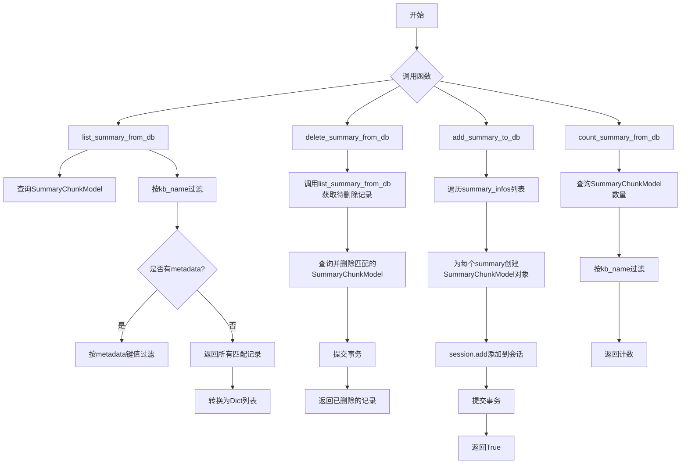
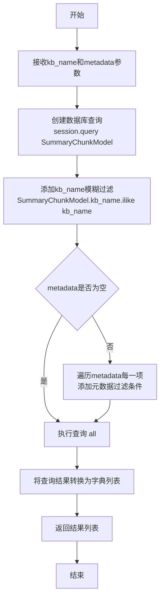
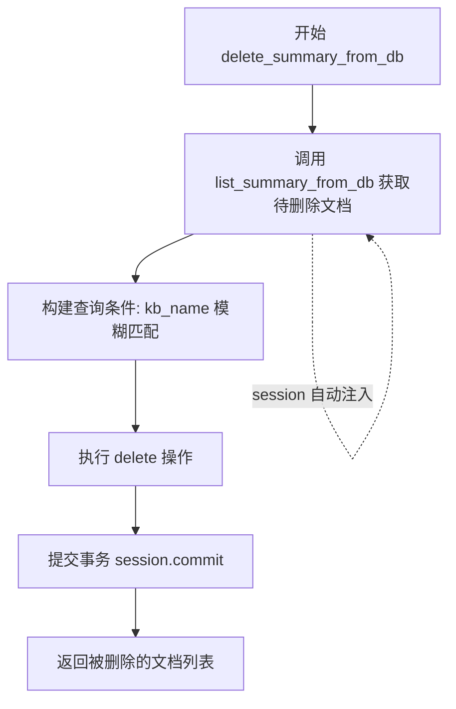
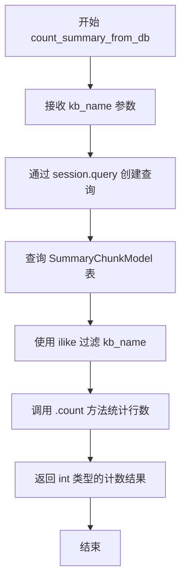

# `Langchain-Chatchat\libs\chatchat-server\chatchat\server\db\repository\knowledge_metadata_repository.py` 详细设计文档

这是一个知识库摘要管理模块，提供了对数据库中知识库摘要（SummaryChunkModel）的增删改查功能，通过@with_session装饰器实现数据库会话管理，支持按知识库名称和元数据过滤查询、批量添加、删除以及统计摘要数量等操作。

## 整体流程



## 类结构

```
SummaryChunkModel (数据库模型类 - 外部导入)
└── 本文件为Repository层，无类定义

函数模块 (knowledge_summary_repo)
├── list_summary_from_db (查询摘要)
├── delete_summary_from_db (删除摘要)
├── add_summary_to_db (添加摘要)
└── count_summary_from_db (统计数量)
```

## 全局变量及字段


### `kb_name`
    
知识库名称，用于指定要操作的知识库

类型：`str`
    


### `metadata`
    
元数据字典，用于过滤查询结果

类型：`Dict`
    


### `session`
    
数据库会话对象，由with_session装饰器注入

类型：`Session`
    


### `docs`
    
查询结果对象或列表，包含知识库的摘要chunk记录

类型：`Query/List[SummaryChunkModel]`
    


### `summary_infos`
    
要添加的摘要信息列表，每个元素包含summary_context、summary_id、doc_ids和metadata

类型：`List[Dict]`
    


### `summary`
    
循环变量，表示当前处理的单个摘要信息字典

类型：`Dict`
    


### `obj`
    
数据库模型实例，用于添加到会话的单个摘要chunk对象

类型：`SummaryChunkModel`
    


### `x`
    
循环变量，表示查询结果中的单个摘要chunk模型实例

类型：`SummaryChunkModel`
    


    

## 全局函数及方法


### `list_summary_from_db`

列出指定知识库（Knowledge Base）的摘要（Summary）信息，支持通过元数据进行过滤查询。函数通过数据库会话查询`SummaryChunkModel`模型，按照知识库名称模糊匹配，并可额外应用元数据过滤条件，最终返回包含摘要ID、摘要内容、关联文档ID及元数据的字典列表。

参数：

- `session`：`Session`，数据库会话对象，由`@with_session`装饰器自动注入管理
- `kb_name`：`str`，知识库名称，用于过滤查询对应的知识库摘要记录，支持模糊匹配（ilike）
- `metadata`：`Dict = {}`，可选的元数据过滤条件字典，键为元数据字段名，值为期望的元数据值，用于进一步筛选结果

返回值：`List[Dict]`，返回符合条件的所有摘要记录列表，每个字典包含以下字段：
- `id`：摘要记录的唯一标识符
- `summary_context`：摘要内容文本
- `summary_id`：摘要的唯一标识ID
- `doc_ids`：关联的文档ID列表
- `metadata`：该摘要记录的完整元数据

#### 流程图



#### 带注释源码

```python
from typing import Dict, List

from chatchat.server.db.models.knowledge_metadata_model import SummaryChunkModel
from chatchat.server.db.session import with_session


@with_session  # 装饰器：自动管理数据库会话的创建和提交
def list_summary_from_db(
    session,          # 数据库会话对象，由装饰器注入
    kb_name: str,     # 知识库名称，用于过滤查询
    metadata: Dict = {},  # 可选的元数据过滤条件字典
) -> List[Dict]:
    """
    列出某知识库chunk summary。
    返回形式：[{"id": str, "summary_context": str, "doc_ids": str}, ...]
    """
    # 步骤1：创建基础查询，查询SummaryChunkModel表
    # 使用ilike实现模糊匹配，不区分大小写
    docs = session.query(SummaryChunkModel).filter(
        SummaryChunkModel.kb_name.ilike(kb_name)
    )

    # 步骤2：如果提供了metadata参数，则遍历并添加过滤条件
    # metadata中的每个键值对都会作为额外的过滤条件
    for k, v in metadata.items():
        # 使用as_string()将元数据字段转换为字符串进行比较
        docs = docs.filter(SummaryChunkModel.meta_data[k].as_string() == str(v))

    # 步骤3：执行查询，获取所有匹配的记录
    # 步骤4：将每条记录转换为字典格式返回
    return [
        {
            "id": x.id,                              # 摘要记录ID
            "summary_context": x.summary_context,    # 摘要内容
            "summary_id": x.summary_id,              # 摘要唯一标识
            "doc_ids": x.doc_ids,                    # 关联文档ID列表
            "metadata": x.metadata,                  # 完整元数据
        }
        for x in docs.all()  # 执行查询并遍历结果
    ]
```


### `delete_summary_from_db`

删除指定知识库的所有摘要块，并返回被删除的摘要块列表。

参数：

- `session`：由 `@with_session` 装饰器自动注入的数据库会话对象
- `kb_name`：`str`，知识库名称，用于定位要删除的摘要记录

返回值：`List[Dict]`，返回被删除的摘要块列表，格式为 `[{"id": str, "summary_context": str, "summary_id": str, "doc_ids": str, "metadata": dict}, ...]`

#### 流程图



#### 带注释源码

```python
@with_session  # 装饰器：自动管理数据库会话的创建和提交
def delete_summary_from_db(session, kb_name: str) -> List[Dict]:
    """
    删除知识库chunk summary，并返回被删除的Dchunk summary。
    返回形式：[{"id": str, "summary_context": str, "doc_ids": str}, ...]
    """
    # Step 1: 先查询获取要删除的文档（用于返回）
    # 注意：此处调用 list_summary_from_db 时未显式传入 session 参数
    # 依赖装饰器自动注入，但原函数定义中 session 是第一个参数
    docs = list_summary_from_db(kb_name=kb_name)
    
    # Step 2: 构建删除查询 - 使用 ilike 进行模糊匹配（不区分大小写）
    query = session.query(SummaryChunkModel).filter(
        SummaryChunkModel.kb_name.ilike(kb_name)
    )
    
    # Step 3: 执行删除操作
    # synchronize_session=False: 删除时不同步 session 中的对象状态
    query.delete(synchronize_session=False)
    
    # Step 4: 提交事务以确保删除生效
    session.commit()
    
    # Step 5: 返回删除前的文档列表（业务需求：告知用户删除了什么）
    return docs
```


### `add_summary_to_db`

将知识库的摘要信息批量添加到数据库的函数。该函数接收知识库名称和摘要信息列表，遍历并为每条摘要创建SummaryChunkModel对象，最后提交到数据库。

参数：

- `session`：会话对象（由装饰器`@with_session`自动注入），数据库会话实例
- `kb_name`：`str`，目标知识库的名称
- `summary_infos`：`List[Dict]`，摘要信息列表，格式为`[{"summary_context": str, "summary_id": str, "doc_ids": str, "metadata": dict}, ...]`

返回值：`bool`，返回`True`表示添加成功

#### 流程图

```mermaid
flowchart TD
    A[开始 add_summary_to_db] --> B[遍历 summary_infos 列表]
    B --> C{遍历是否结束?}
    C -->|否| D[取出当前 summary]
    D --> E[创建 SummaryChunkModel 对象]
    E --> F[设置 kb_name = kb_name]
    E --> G[设置 summary_context = summary['summary_context']]
    E --> H[设置 summary_id = summary['summary_id']]
    E --> I[设置 doc_ids = summary['doc_ids']]
    E --> J[设置 meta_data = summary['metadata']]
    F --> K[session.add 添加到会话]
    K --> B
    C -->|是| L[session.commit 提交事务]
    L --> M[返回 True]
    M --> N[结束]
```

#### 带注释源码

```python
@with_session  # 装饰器：自动管理数据库会话，提供session参数
def add_summary_to_db(session, kb_name: str, summary_infos: List[Dict]):
    """
    将总结信息添加到数据库。
    summary_infos形式：[{"summary_context": str, "doc_ids": str}, ...]
    """
    # 遍历每条摘要信息
    for summary in summary_infos:
        # 创建SummaryChunkModel模型对象
        obj = SummaryChunkModel(
            kb_name=kb_name,                          # 知识库名称
            summary_context=summary["summary_context"],  # 摘要内容
            summary_id=summary["summary_id"],         # 摘要ID
            doc_ids=summary["doc_ids"],               # 关联的文档ID列表
            meta_data=summary["metadata"],             # 元数据字典
        )
        # 将对象添加到会话（相当于INSERT操作）
        session.add(obj)

    # 提交事务，将所有更改持久化到数据库
    session.commit()
    
    # 返回True表示操作成功
    return True
```


### `count_summary_from_db`

该函数用于统计指定知识库（kb_name）中的摘要（summary）记录数量，通过SQLAlchemy查询过滤知识库名称并返回匹配的行数。

参数：

- `session`：`Session`，由`@with_session`装饰器自动注入的数据库会话对象
- `kb_name`：`str`，知识库名称，用于过滤查询条件

返回值：`int`，返回指定知识库中摘要记录的总数量

#### 流程图



#### 带注释源码

```python
@with_session  # 装饰器：自动注入 session 对象，管理数据库会话生命周期
def count_summary_from_db(session, kb_name: str) -> int:
    """
    统计指定知识库中的摘要记录数量。
    
    参数:
        session: 数据库会话对象，由 @with_session 装饰器注入
        kb_name: 知识库名称，用于过滤查询
    
    返回:
        int: 匹配知识库名称的摘要记录总数
    """
    return (
        session.query(SummaryChunkModel)  # 创建对 SummaryChunkModel 表的查询
        .filter(SummaryChunkModel.kb_name.ilike(kb_name))  # 使用 ilike 进行不区分大小写的模糊匹配
        .count()  # 统计满足条件的记录数量并返回
    )
```

## 关键组件


### 知识库摘要列表查询组件 (list_summary_from_db)

该组件负责从数据库查询指定知识库的摘要信息，支持通过元数据进行过滤筛选，返回包含id、summary_context、summary_id、doc_ids和metadata的字典列表。

### 知识库摘要删除组件 (delete_summary_from_db)

该组件负责删除指定知识库的所有摘要记录，并在删除前返回被删除的摘要数据用于可能的回滚或日志记录。

### 知识库摘要添加组件 (add_summary_to_db)

该组件负责将多个摘要信息批量添加到数据库，每个摘要包含summary_context、summary_id、doc_ids和metadata字段。

### 知识库摘要计数组件 (count_summary_from_db)

该组件负责统计指定知识库中摘要记录的总数量，用于分页或其他业务逻辑。

### 数据库会话管理组件 (@with_session)

该组件是装饰器模式的应用，负责自动管理数据库会话的生命周期，包括会话的创建和提交/回滚。

### 摘要数据模型组件 (SummaryChunkModel)

该组件是SQLAlchemy ORM模型，定义了知识库摘要的数据结构，包括kb_name、summary_context、summary_id、doc_ids和meta_data等字段。


## 问题及建议


### 已知问题

-   **可变默认参数**：函数`list_summary_from_db`中`metadata: Dict = {}`使用可变默认参数，这是Python反模式，可能导致意外行为。
-   **缺失参数传递**：`delete_summary_from_db`函数内部调用`list_summary_from_db(kb_name=kb_name)`时未传递`session`参数，会导致数据库会话丢失或重复创建连接。
-   **缺少错误处理**：所有数据库操作均未捕获SQL异常，数据库连接失败或查询异常时可能导致未处理的错误向上传播。
-   **事务管理不完善**：`add_summary_to_db`和`delete_summary_from_db`中直接`session.commit()`，未在失败时进行`session.rollback()`，可能导致数据不一致。
-   **N+1查询风险**：`list_summary_from_db`中遍历结果构建字典时直接访问`x.metadata`等属性，可能触发延迟加载。
-   **性能隐患**：`delete_summary_from_db`先调用`list_summary_from_db`获取删除数据，再执行删除操作，存在两次查询开销且在并发场景下数据可能不一致。
-   **输入验证缺失**：函数参数如`kb_name`、`summary_infos`等未进行有效性校验，可能导致无效输入进入数据库层。
-   **索引利用不明确**：使用`ilike`进行模糊匹配查询，可能无法有效利用数据库索引，影响大数据量场景性能。

### 优化建议

-   将可变默认参数改为`metadata: Dict = None`，在函数体内判断并初始化空字典。
-   修复`delete_summary_from_db`中的参数传递问题，改为`list_summary_from_db(session=session, kb_name=kb_name)`。
-   添加try-except块包装数据库操作，实现事务回滚机制，确保异常情况下数据一致性。
-   考虑使用批量插入`session.bulk_insert_mappings`或`session.add_all`替代循环`session.add`，提升批量添加性能。
-   对`count_summary_from_db`考虑使用`func.count()`配合查询条件，或返回查询对象的count而非再执行一次独立count查询。
-   添加输入参数校验，如检查`kb_name`非空、`summary_infos`格式正确等。
-   如需精确匹配场景，考虑将`ilike`改为`==`以利用索引，或评估是否确实需要模糊匹配。
-   考虑为`delete_summary_from_db`返回删除操作的结果而非删除前的快照数据，使函数行为更直观。

## 其它


### 设计目标与约束

该模块旨在提供对知识库摘要（Summary Chunk）的完整CRUD操作能力，支持按知识库名称查询、筛选、统计和批量管理摘要数据。设计约束包括：1）依赖SQLAlchemy ORM框架进行数据库操作；2）使用@with_session装饰器确保会话管理；3）知识库名称匹配采用ilike模糊查询，支持大小写不敏感；4）metadata字段支持动态过滤，但需注意JSON类型字段的查询兼容性。

### 错误处理与异常设计

数据库操作异常由@with_session装饰器统一捕获并处理，会话管理采用上下文管理器模式。查询结果为空时返回空列表而非异常。delete_summary_from_db中先调用list_summary_from_db获取待删除数据，若查询失败可能导致返回空列表。metadata过滤时若key不存在会导致查询异常。缺少输入参数校验（如kb_name为空或summary_infos格式错误）时的异常处理机制。

### 数据流与状态机

数据流：输入(kb_name, metadata, summary_infos) → Session创建 → ORM查询/更新 → 状态同步(synchronize_session=False) → Commit → 结果转换 → 返回。无复杂状态机，仅存在数据库事务状态（pending → committed/rolled_back）。

### 外部依赖与接口契约

核心依赖：1）SummaryChunkModel数据库模型类；2）with_session装饰器（提供session管理）；3）typing模块（类型提示）。外部接口：调用方需传递有效的kb_name字符串，summary_infos需符合指定字典结构（含summary_context、summary_id、doc_ids、metadata字段）。返回值契约：list类函数返回List[Dict]，count返回int，add返回bool。

### 性能考虑

list_summary_from_db使用ilike模糊查询，全量加载后Python层过滤metadata，建议对大数据量场景添加数据库层索引或分页机制。delete_summary_from_db执行两次查询（list+delete），可优化为单次查询+delete子查询。add_summary_to_db逐条插入，建议使用bulk_insert_mappings批量操作提升性能。

### 安全性考虑

代码未对输入进行SQL注入防护，但SQLAlchemy ORM自动参数化可防止基本注入。kb_name和summary_context等文本字段未进行长度校验和特殊字符过滤，可能存在数据验证漏洞。metadata参数直接透传，需确保调用方可信。

### 测试策略

建议单元测试覆盖：1）空kb_name和有效kb_name场景；2）metadata过滤匹配/不匹配场景；3）空结果集场景；4）批量插入多条记录；5）删除后数据一致性验证；6）异常场景（如数据库连接失败、模型字段不匹配）。

### 监控与日志

建议添加：1）数据库操作耗时日志；2）查询结果数量日志；3）批量操作的成功/失败计数；4）异常堆栈信息记录。@with_session装饰器层面可统一记录SQL语句和执行时间。

    