# `Langchain-Chatchat\libs\chatchat-server\chatchat\server\db\repository\mcp_connection_repository.py` 详细设计文档

该文件提供MCP（Model Context Protocol）连接配置和通用配置的全套数据库CRUD操作，包括连接的增删改查、启用/禁用、搜索过滤，以及MCP Profile的创建、更新、重置和删除功能。

## 整体流程

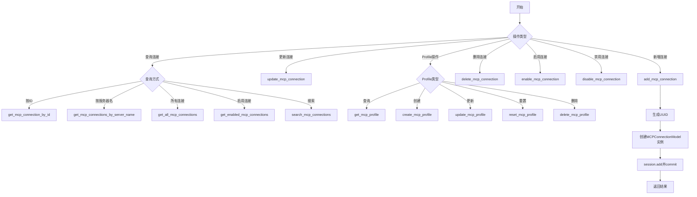

## 类结构

```
无自定义类（均为模块级函数）
依赖的数据模型类（来自外部模块）:
├── MCPConnectionModel (MCP连接配置模型)
└── MCPProfileModel (MCP通用配置模型)
```

## 全局变量及字段


### `外部依赖.MCPConnectionModel`
    
MCP连接配置的数据库模型，定义在chatchat.server.db.models.mcp_connection_model模块中

类型：`SQLAlchemy Model`
    


### `外部依赖.MCPProfileModel`
    
MCP通用配置的数据库模型，定义在chatchat.server.db.models.mcp_connection_model模块中

类型：`SQLAlchemy Model`
    


### `MCPConnectionModel.id`
    
MCP连接的唯一标识符

类型：`str`
    


### `MCPConnectionModel.server_name`
    
MCP服务器名称

类型：`str`
    


### `MCPConnectionModel.args`
    
MCP服务器启动参数列表

类型：`List[str]`
    


### `MCPConnectionModel.env`
    
MCP服务器环境变量字典

类型：`Dict[str, str]`
    


### `MCPConnectionModel.cwd`
    
MCP服务器工作目录

类型：`str`
    


### `MCPConnectionModel.transport`
    
MCP服务器传输协议类型

类型：`str`
    


### `MCPConnectionModel.timeout`
    
MCP连接超时时间（秒）

类型：`int`
    


### `MCPConnectionModel.enabled`
    
MCP连接是否启用

类型：`bool`
    


### `MCPConnectionModel.description`
    
MCP连接描述信息

类型：`str`
    


### `MCPConnectionModel.config`
    
MCP连接额外配置字典

类型：`Dict`
    


### `MCPConnectionModel.create_time`
    
MCP连接创建时间

类型：`datetime`
    


### `MCPConnectionModel.update_time`
    
MCP连接更新时间

类型：`datetime`
    


### `MCPProfileModel.id`
    
MCP配置的唯一标识符

类型：`str`
    


### `MCPProfileModel.timeout`
    
MCP默认超时时间（秒）

类型：`int`
    


### `MCPProfileModel.working_dir`
    
MCP默认工作目录

类型：`str`
    


### `MCPProfileModel.env_vars`
    
MCP默认环境变量字典

类型：`Dict[str, str]`
    


### `MCPProfileModel.update_time`
    
MCP配置更新时间

类型：`datetime`
    
    

## 全局函数及方法


### `add_mcp_connection`

新增 MCP 连接配置，将传入的连接参数持久化到数据库，并返回生成的连接 ID。

参数：

- `session`：`Session`，数据库会话对象，由装饰器 `@with_session` 自动注入
- `server_name`：`str`，MCP 服务器名称，必填参数，用于标识唯一的服务器
- `args`：`List[str]`，启动参数列表，可选，默认 `[]`
- `env`：`Dict[str, str]`，环境变量字典，可选，默认 `{}`
- `cwd`：`str`，工作目录路径，可选，默认 `None`
- `transport`：`str`，传输协议类型，可选，默认 `"stdio"`，常用值包括 `stdio`、`sse`、`http` 等
- `timeout`：`int`，超时时间（秒），可选，默认 `30`
- `enabled`：`bool`，是否启用该连接，可选，默认 `True`
- `description`：`str`，连接描述信息，可选，默认空字符串
- `config`：`Dict`，扩展配置字典，可选，默认 `{}`
- `connection_id`：`str`，连接唯一标识符，可选，若未提供则自动生成 UUID

返回值：`str`，新创建的 MCP 连接配置的唯一标识符（connection_id）

#### 流程图

```mermaid
flowchart TD
    A[开始 add_mcp_connection] --> B{connection_id 是否为空?}
    B -->|是| C[使用 uuid.uuid4().hex 生成连接ID]
    B -->|否| D[使用传入的 connection_id]
    C --> E[初始化默认参数: args=[], env={}, config={}]
    D --> E
    E --> F[创建 MCPConnectionModel 实例]
    F --> G[session.add 添加到会话]
    G --> H[session.commit 提交事务]
    H --> I[返回 mcp_connection.id]
    I --> J[结束]
```

#### 带注释源码

```python
@with_session  # 装饰器：自动获取数据库会话并管理事务
def add_mcp_connection(
    session,                      # 数据库会话对象，由装饰器注入
    server_name: str,             # MCP 服务器名称，必填
    args: List[str] = None,       # 启动参数列表，可选
    env: Dict[str, str] = None,   # 环境变量，可选
    cwd: str = None,              # 工作目录，可选
    transport: str = "stdio",     # 传输协议，默认 stdio
    timeout: int = 30,           # 超时时间，默认30秒
    enabled: bool = True,         # 是否启用，默认启用
    description: str = "",        # 描述信息，默认空字符串
    config: Dict = None,          # 扩展配置，可选
    connection_id: str = None,    # 连接ID，可选，未提供则自动生成
):
    """
    新增 MCP 连接配置
    """
    # 如果未提供 connection_id，则自动生成 UUID 作为唯一标识
    if not connection_id:
        connection_id = uuid.uuid4().hex
    
    # 参数防御性检查：确保可变默认参数不为 None，避免共享引用问题
    if args is None:
        args = []
    if env is None:
        env = {}
    if config is None:
        config = {}
    
    # 创建 MCP 连接模型实例
    mcp_connection = MCPConnectionModel(
        id=connection_id,
        server_name=server_name,
        args=args,
        env=env,
        cwd=cwd,
        transport=transport,
        timeout=timeout,
        enabled=enabled,
        description=description,
        config=config,
    )
    
    # 将新实例添加到数据库会话
    session.add(mcp_connection)
    
    # 提交事务，持久化到数据库
    session.commit()
    
    # 返回新创建的连接 ID
    return mcp_connection.id
```


### `update_mcp_connection`

更新 MCP 连接配置，根据 connection_id 查找对应的连接记录，并仅对传入的非空参数进行更新操作，最后提交事务返回更新后的连接 ID，若连接不存在则返回 None。

参数：

- `session`：`Session`，数据库会话对象，由 `@with_session` 装饰器自动注入
- `connection_id`：`str`，MCP 连接的唯一标识 ID，用于定位要更新的记录
- `server_name`：`str`，可选，服务器名称
- `args`：`List[str]`，可选，启动参数列表
- `env`：`Dict[str, str]`，可选，环境变量字典
- `cwd`：`str`，可选，工作目录
- `transport`：`str`，可选，传输协议类型（如 "stdio"）
- `timeout`：`int`，可选，超时时间（秒）
- `enabled`：`bool`，可选，是否启用该连接
- `description`：`str`，可选，连接描述信息
- `config`：`Dict`，可选，额外配置字典

返回值：`Optional[str]`，更新成功时返回 connection_id，更新失败（连接不存在）时返回 None

#### 流程图

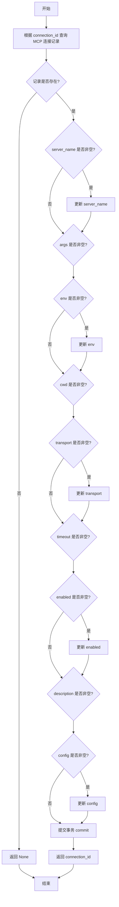

#### 带注释源码

```python
@with_session
def update_mcp_connection(
    session,
    connection_id: str,
    server_name: str = None,
    args: List[str] = None,
    env: Dict[str, str] = None,
    cwd: str = None,
    transport: str = None,
    timeout: int = None,
    enabled: bool = None,
    description: str = None,
    config: Dict = None,
):
    """
    更新 MCP 连接配置
    """
    # 根据 connection_id 查询对应的 MCP 连接记录
    mcp_connection = session.query(MCPConnectionModel).filter_by(id=connection_id).first()

    # 判断记录是否存在
    if mcp_connection is not None:
        # 仅更新传入的非空参数，实现部分更新逻辑
        
        # 如果传入了 server_name，则更新服务器名称
        if server_name is not None:
            mcp_connection.server_name = server_name
        
        # 如果传入了 args，则更新启动参数列表
        if args is not None:
            mcp_connection.args = args
        
        # 如果传入了 env，则更新环境变量
        if env is not None:
            mcp_connection.env = env
        
        # 如果传入了 cwd，则更新工作目录
        if cwd is not None:
            mcp_connection.cwd = cwd
        
        # 如果传入了 transport，则更新传输协议
        if transport is not None:
            mcp_connection.transport = transport
        
        # 如果传入了 timeout，则更新超时时间
        if timeout is not None:
            mcp_connection.timeout = timeout
        
        # 如果传入了 enabled，则更新启用状态
        if enabled is not None:
            mcp_connection.enabled = enabled
        
        # 如果传入了 description，则更新描述信息
        if description is not None:
            mcp_connection.description = description
        
        # 如果传入了 config，则更新额外配置
        if config is not None:
            mcp_connection.config = config
        
        # 将更新后的对象添加到会话
        session.add(mcp_connection)
        # 提交事务，持久化到数据库
        session.commit()
        # 返回更新后的连接 ID
        return mcp_connection.id
    
    # 如果记录不存在，返回 None
    return None
```


### `get_mcp_connection_by_id`

根据连接 ID 查询 MCP 连接配置的详细信息。

参数：

-  `session`：`Session`，由 `@with_session` 装饰器自动注入的数据库会话对象
-  `connection_id`：`str`，MCP 连接的唯一标识符

返回值：`Optional[dict]`，返回包含 MCP 连接配置的字典对象，如果未找到则返回 `None`。返回的字典包含以下字段：

-  `id`：连接 ID
-  `server_name`：服务器名称
-  `args`：启动参数列表
-  `env`：环境变量字典
-  `cwd`：工作目录
-  `transport`：传输协议
-  `timeout`：超时时间
-  `enabled`：是否启用
-  `description`：描述信息
-  `config`：配置字典
-  `create_time`：创建时间（ISO 格式）
-  `update_time`：更新时间（ISO 格式）

#### 流程图

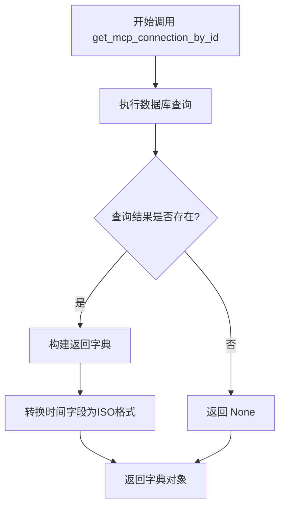

#### 带注释源码

```python
@with_session
def get_mcp_connection_by_id(session, connection_id: str) -> Optional[dict]:
    """
    根据 ID 查询 MCP 连接配置
    
    Args:
        session: 数据库会话对象，由装饰器自动注入
        connection_id: MCP 连接的唯一标识符
    
    Returns:
        包含连接配置的字典，如果未找到则返回 None
    """
    # 使用 SQLAlchemy 查询 MCPConnectionModel 表，按 id 字段过滤
    mcp_connection = session.query(MCPConnectionModel).filter_by(id=connection_id).first()
    
    # 如果查询结果存在，则构建并返回字典
    if mcp_connection:
        return {
            "id": mcp_connection.id,
            "server_name": mcp_connection.server_name,
            "args": mcp_connection.args,
            "env": mcp_connection.env,
            "cwd": mcp_connection.cwd,
            "transport": mcp_connection.transport,
            "timeout": mcp_connection.timeout,
            "enabled": mcp_connection.enabled,
            "description": mcp_connection.description,
            "config": mcp_connection.config,
            # 将 datetime 对象转换为 ISO 格式字符串，便于 JSON 序列化
            "create_time": mcp_connection.create_time.isoformat() if mcp_connection.create_time else None,
            "update_time": mcp_connection.update_time.isoformat() if mcp_connection.update_time else None,
        }
    
    # 未找到对应记录，返回 None
    return None
```


### `get_mcp_connections_by_server_name`

根据服务器名称查询 MCP 连接配置列表，返回该服务器下所有已配置的 MCP 连接信息。

参数：

- `session`：`Session`，数据库会话对象，由 `@with_session` 装饰器自动注入
- `server_name`：`str`，服务器名称，用于过滤查询对应的 MCP 连接配置

返回值：`List[dict]`，MCP 连接配置列表，每个元素包含连接的各项属性（id、server_name、args、env、cwd、transport、timeout、enabled、description、config、create_time、update_time），如果没有匹配的连接配置则返回空列表

#### 流程图

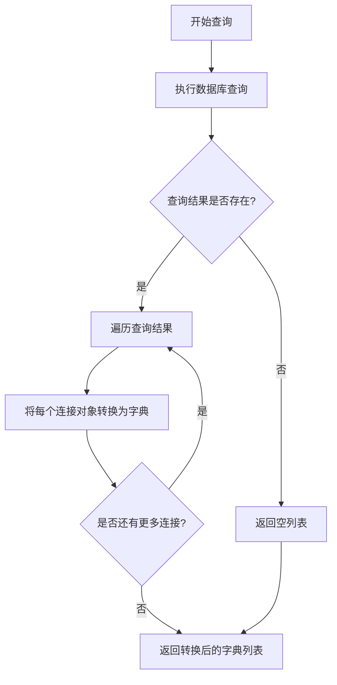

#### 带注释源码

```python
@with_session
def get_mcp_connections_by_server_name(session, server_name: str) -> List[dict]:
    """
    根据服务器名称查询 MCP 连接配置列表
    
    参数:
        session: 数据库会话对象，由装饰器注入
        server_name: 服务器名称，用于过滤查询
    
    返回:
        包含多个连接配置的字典列表，每个字典包含:
        - id: 连接唯一标识
        - server_name: 服务器名称
        - args: 启动参数列表
        - env: 环境变量字典
        - cwd: 工作目录
        - transport: 传输类型
        - timeout: 超时时间
        - enabled: 是否启用
        - description: 描述信息
        - config: 额外配置
        - create_time: 创建时间
        - update_time: 更新时间
    """
    # 使用 SQLAlchemy 查询 MCPConnectionModel 表
    # 按 server_name 字段过滤，获取所有匹配的记录
    connections = (
        session.query(MCPConnectionModel)
        .filter_by(server_name=server_name)
        .all()
    )
    
    # 将查询结果转换为字典列表返回
    # 遍历每个连接对象，提取其属性值
    # 时间字段转换为 ISO 格式字符串，若为空则返回 None
    return [
        {
            "id": conn.id,
            "server_name": conn.server_name,
            "args": conn.args,
            "env": conn.env,
            "cwd": conn.cwd,
            "transport": conn.transport,
            "timeout": conn.timeout,
            "enabled": conn.enabled,
            "description": conn.description,
            "config": conn.config,
            "create_time": conn.create_time.isoformat() if conn.create_time else None,
            "update_time": conn.update_time.isoformat() if conn.update_time else None,
        }
        for conn in connections
    ]
```


### `get_all_mcp_connections`

获取所有 MCP 连接配置，可选择是否仅获取已启用的连接。

参数：

- `session`：会话对象，由 `with_session` 装饰器自动注入，用于数据库操作
- `enabled_only`：`bool`，可选参数，默认为 `False`。当设为 `True` 时，仅返回已启用的连接配置

返回值：`List[dict]`，返回 MCP 连接配置列表，每个元素包含 id、server_name、args、env、cwd、transport、timeout、enabled、description、config、create_time、update_time 等字段

#### 流程图

```mermaid
flowchart TD
    A[开始] --> B[接收 session 和 enabled_only 参数]
    B --> C[创建基础查询: session.query(MCPConnectionModel)]
    C --> D{enabled_only 是否为 True?}
    D -->|是| E[添加过滤条件: enabled=True]
    D -->|否| F[保持原查询不变]
    E --> G[按创建时间倒序排序]
    F --> G
    G --> H[执行查询获取所有连接]
    H --> I[遍历连接结果转换为字典列表]
    I --> J[返回字典列表]
    J --> K[结束]
```

#### 带注释源码

```python
@with_session
def get_all_mcp_connections(session, enabled_only: bool = False) -> List[dict]:
    """
    获取所有 MCP 连接配置
    """
    # 创建基础查询对象，查询 MCPConnectionModel 表
    query = session.query(MCPConnectionModel)
    
    # 如果 enabled_only 为 True，则仅查询已启用的连接
    if enabled_only:
        query = query.filter_by(enabled=True)
    
    # 按创建时间倒序排列，获取所有匹配的连接记录
    connections = query.order_by(MCPConnectionModel.create_time.desc()).all()
    
    # 将 ORM 模型对象转换为字典列表返回
    return [
        {
            "id": conn.id,                                    # 连接唯一标识
            "server_name": conn.server_name,                  # 服务器名称
            "args": conn.args,                                # 启动参数列表
            "env": conn.env,                                  # 环境变量字典
            "cwd": conn.cwd,                                  # 工作目录
            "transport": conn.transport,                      # 传输协议
            "timeout": conn.timeout,                          # 超时时间（秒）
            "enabled": conn.enabled,                          # 是否启用
            "description": conn.description,                  # 描述信息
            "config": conn.config,                            # 额外配置字典
            "create_time": conn.create_time.isoformat() if conn.create_time else None,  # 创建时间
            "update_time": conn.update_time.isoformat() if conn.update_time else None,  # 更新时间
        }
        for conn in connections
    ]
```


### `get_enabled_mcp_connections`

获取所有已启用的 MCP 连接配置列表，按创建时间倒序排列。

参数：

- `session`：`Session`，数据库会话对象，由 `@with_session` 装饰器自动注入

返回值：`List[dict]`，返回所有已启用的 MCP 连接配置的字典列表，每个字典包含连接的全部信息（ID、服务器名称、参数、环境变量、工作目录、传输协议、超时设置、启用状态、描述、配置、创建时间和更新时间）

#### 流程图

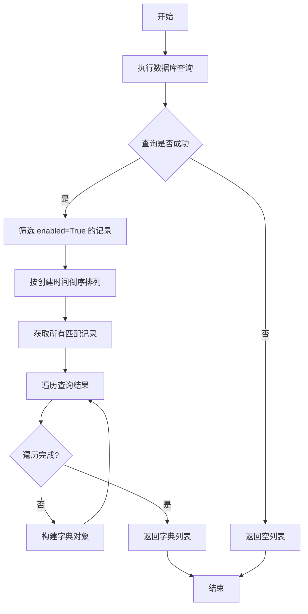

#### 带注释源码

```python
@with_session  # 装饰器：自动获取数据库会话并管理事务
def get_enabled_mcp_connections(session) -> List[dict]:
    """
    获取所有启用的 MCP 连接配置
    """
    # 使用 SQLAlchemy 查询 MCPConnectionModel 表
    # 筛选条件：enabled 字段为 True
    # 排序方式：按 create_time 字段降序排列（最新的在前）
    connections = (
        session.query(MCPConnectionModel)
        .filter_by(enabled=True)          # 过滤：只获取已启用的连接
        .order_by(MCPConnectionModel.create_time.desc())  # 排序：创建时间倒序
        .all()                             # 获取所有匹配的记录
    )
    
    # 将 ORM 模型对象转换为字典列表
    # 每个字典包含连接的全部属性信息
    return [
        {
            "id": conn.id,                                    # 连接唯一标识符
            "server_name": conn.server_name,                  # MCP 服务器名称
            "args": conn.args,                                # 启动参数列表
            "env": conn.env,                                  # 环境变量字典
            "cwd": conn.cwd,                                  # 工作目录
            "transport": conn.transport,                      # 传输协议（如 stdio）
            "timeout": conn.timeout,                          # 超时时间（秒）
            "enabled": conn.enabled,                          # 是否启用
            "description": conn.description,                  # 连接描述
            "config": conn.config,                            # 额外配置字典
            # 处理可能为 None 的时间字段，转换为 ISO 格式字符串
            "create_time": conn.create_time.isoformat() if conn.create_time else None,
            "update_time": conn.update_time.isoformat() if conn.update_time else None,
        }
        for conn in connections  # 列表推导式：遍历查询结果并转换
    ]
```


### `delete_mcp_connection`

删除指定ID的MCP连接配置

参数：

- `session`：Session，由 `@with_session` 装饰器自动注入的数据库会话对象
- `connection_id`：str，要删除的MCP连接的唯一标识符

返回值：`bool`，删除成功返回 `True`，未找到对应连接返回 `False`

#### 流程图

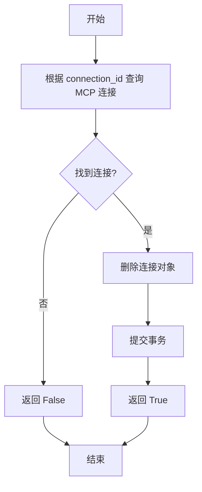

#### 带注释源码

```python
@with_session  # 数据库会话装饰器，自动管理事务
def delete_mcp_connection(session, connection_id: str) -> bool:
    """
    删除 MCP 连接配置
    """
    # 根据 connection_id 查询对应的 MCP 连接记录
    mcp_connection = session.query(MCPConnectionModel).filter_by(id=connection_id).first()
    
    # 判断连接记录是否存在
    if mcp_connection is not None:
        # 存在则删除该记录
        session.delete(mcp_connection)
        # 提交事务以使删除操作生效
        session.commit()
        # 返回删除成功标志
        return True
    
    # 未找到对应连接，返回删除失败标志
    return False
```


### `enable_mcp_connection`

启用指定 ID 的 MCP 连接配置，将其 enabled 字段设置为 True。

参数：

- `session`：`Session`，由 `@with_session` 装饰器注入的数据库会话对象
- `connection_id`：`str`，要启用的 MCP 连接的唯一标识符

返回值：`bool`，表示是否成功启用连接（True 表示启用成功，False 表示连接不存在）

#### 流程图

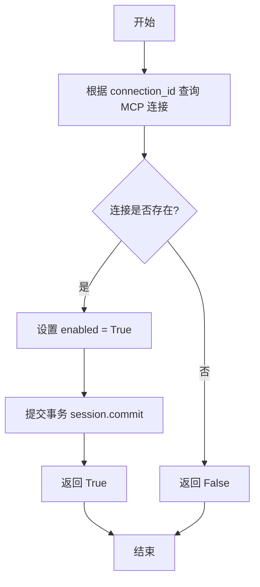

#### 带注释源码

```python
@with_session
def enable_mcp_connection(session, connection_id: str) -> bool:
    """
    启用 MCP 连接配置
    
    Args:
        session: 数据库会话对象，由装饰器自动注入
        connection_id: 要启用的 MCP 连接的唯一标识符
    
    Returns:
        bool: 启用成功返回 True，连接不存在返回 False
    """
    # 根据 connection_id 查询对应的 MCP 连接配置
    mcp_connection = session.query(MCPConnectionModel).filter_by(id=connection_id).first()
    
    # 判断连接是否存在
    if mcp_connection is not None:
        # 存在则将 enabled 字段设置为 True
        mcp_connection.enabled = True
        
        # 将修改后的对象添加到会话
        session.add(mcp_connection)
        
        # 提交事务以保存更改
        session.commit()
        
        # 返回 True 表示启用成功
        return True
    
    # 连接不存在，返回 False
    return False
```


### `disable_mcp_connection`

该函数用于禁用指定的 MCP 连接配置，通过将连接记录中的 enabled 字段设置为 False 来实现禁用操作。

参数：

- `session`：`Session`，数据库会话对象，由 `@with_session` 装饰器自动注入
- `connection_id`：`str`，MCP 连接的唯一标识符

返回值：`bool`，成功禁用返回 `True`，若连接不存在则返回 `False`

#### 流程图

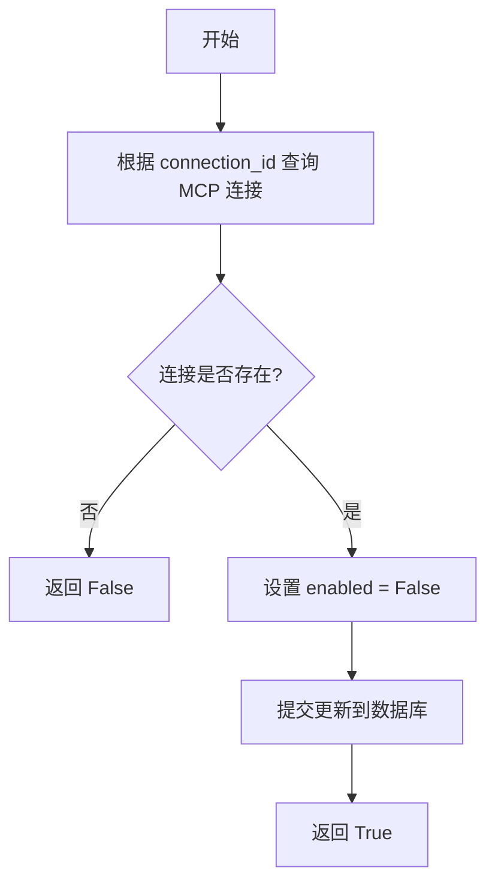

#### 带注释源码

```python
@with_session
def disable_mcp_connection(session, connection_id: str) -> bool:
    """
    禁用 MCP 连接配置
    
    Args:
        session: 数据库会话对象，由 @with_session 装饰器自动注入
        connection_id: MCP 连接的唯一标识符
    
    Returns:
        bool: 成功禁用返回 True，连接不存在返回 False
    """
    # 根据 connection_id 查询对应的 MCP 连接记录
    mcp_connection = session.query(MCPConnectionModel).filter_by(id=connection_id).first()
    
    # 检查连接是否存在
    if mcp_connection is not None:
        # 将 enabled 字段设置为 False，禁用该连接
        mcp_connection.enabled = False
        
        # 将更新后的对象添加到会话
        session.add(mcp_connection)
        
        # 提交事务，保存更改到数据库
        session.commit()
        
        # 返回成功标志
        return True
    
    # 连接不存在，返回失败标志
    return False
```


### `search_mcp_connections`

根据关键字、启用状态等条件搜索 MCP 连接配置，并返回匹配的连接列表。

参数：

- `session`：`Session`，数据库会话对象，由 `@with_session` 装饰器自动注入
- `keyword`：`Optional[str]`，可选，关键字，用于模糊匹配服务器名称或描述
- `enabled`：`Optional[bool]`，可选，筛选是否启用的连接，`True` 仅返回已启用的连接，`False` 仅返回已禁用的连接，`None` 不过滤
- `limit`：`int`，可选，返回结果的最大数量，默认为 50

返回值：`List[dict]`，返回匹配的 MCP 连接配置列表，每项包含完整的连接信息字典

#### 流程图

```mermaid
flowchart TD
    A[开始 search_mcp_connections] --> B[构建基础查询 query = session.query(MCPConnectionModel)]
    B --> C{keyword 是否为空?}
    C -->|是| D{enabled 是否为 None?}
    C -->|否| E[将 keyword 包装为模糊匹配格式: f'%{keyword}%']
    E --> F[添加过滤条件: server_name LIKE keyword OR description LIKE keyword]
    F --> D
    D --> G{enabled 不为 None?}
    G -->|是| H[添加过滤条件: enabled = enabled]
    G -->|否| I[跳过 enabled 过滤]
    H --> J[按 create_time 降序排序并限制返回数量: .order_by.desc().limit(limit).all()]
    I --> J
    J --> K[遍历结果转换为字典列表]
    K --> L[返回字典列表]
    L --> M[结束]
```

#### 带注释源码

```python
@with_session
def search_mcp_connections(
    session,
    keyword: str = None,
    enabled: bool = None,
    limit: int = 50,
) -> List[dict]:
    """
    搜索 MCP 连接配置
    
    根据关键字、启用状态等条件搜索 MCP 连接配置，并返回匹配的连接列表。
    
    参数:
        session: 数据库会话对象，由 with_session 装饰器注入
        keyword: 可选关键字，用于模糊匹配 server_name 或 description 字段
        enabled: 可选的布尔值，用于过滤已启用/已禁用的连接
        limit: 返回结果的最大数量，默认为 50
    
    返回:
        匹配的 MCP 连接配置字典列表，每项包含完整的连接信息
    """
    # 构建基础查询，查询 MCPConnectionModel 表
    query = session.query(MCPConnectionModel)
    
    # 如果提供了关键字，添加模糊匹配过滤条件
    if keyword:
        # 使用 SQL LIKE 进行模糊匹配，% 表示任意字符
        keyword = f"%{keyword}%"
        # 使用 OR 条件匹配 server_name 或 description 字段
        query = query.filter(
            MCPConnectionModel.server_name.like(keyword) |
            MCPConnectionModel.description.like(keyword)
        )
    
    # 如果提供了 enabled 参数，添加启用状态过滤
    if enabled is not None:
        # filter_by 使用严格匹配，filter 使用表达式
        query = query.filter_by(enabled=enabled)
    
    # 执行查询：按创建时间降序排列，限制返回数量
    connections = query.order_by(MCPConnectionModel.create_time.desc()).limit(limit).all()
    
    # 将 ORM 模型对象转换为字典列表返回
    return [
        {
            "id": conn.id,
            "server_name": conn.server_name,
            "args": conn.args,
            "env": conn.env,
            "cwd": conn.cwd,
            "transport": conn.transport,
            "timeout": conn.timeout,
            "enabled": conn.enabled,
            "description": conn.description,
            "config": conn.config,
            # 将 datetime 对象转换为 ISO 格式字符串，处理可能为 None 的情况
            "create_time": conn.create_time.isoformat() if conn.create_time else None,
            "update_time": conn.update_time.isoformat() if conn.update_time else None,
        }
        for conn in connections
    ]
```


### `get_mcp_profile`

获取 MCP 通用配置的函数，用于从数据库中查询并返回 MCP Profile 的配置信息。

参数：

- `session`：`Session`，数据库会话对象，由 `@with_session` 装饰器自动注入

返回值：`Optional[dict]`，返回包含 MCP 通用配置的字典（包含 id、timeout、working_dir、env_vars、update_time），如果不存在配置则返回 None

#### 流程图

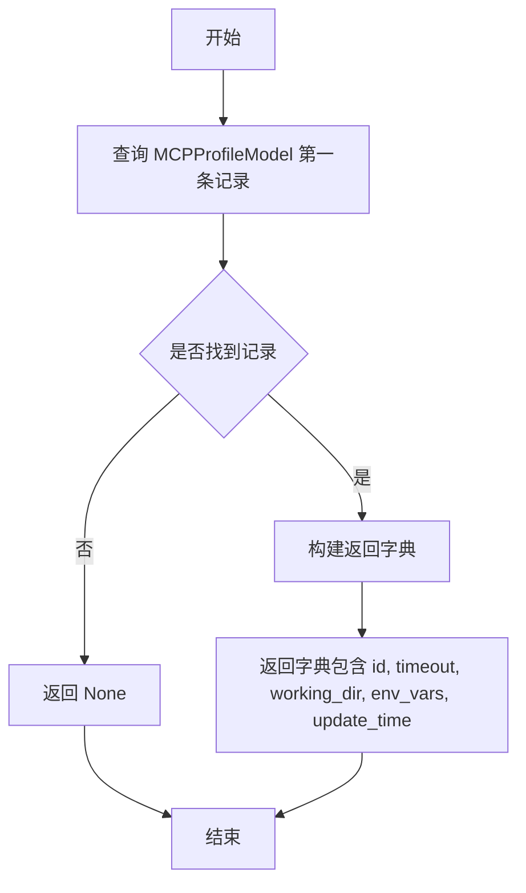

#### 带注释源码

```python
@with_session
def get_mcp_profile(session) -> Optional[dict]:
    """
    获取 MCP 通用配置
    """
    # 查询数据库中的第一条 MCPProfileModel 记录
    profile = session.query(MCPProfileModel).first()
    
    # 如果记录存在，则构建并返回配置字典
    if profile:
        return {
            "id": profile.id,                                          # 配置 ID
            "timeout": profile.timeout,                                # 超时时间
            "working_dir": profile.working_dir,                        # 工作目录
            "env_vars": profile.env_vars,                              # 环境变量
            "update_time": profile.update_time.isoformat() if profile.update_time else None  # 更新时间
        }
    
    # 如果记录不存在，则返回 None
    return None
```


### `create_mcp_profile`

创建 MCP 通用配置，如果已存在配置则更新现有配置。

参数：

- `session`：数据库会话对象，由 `@with_session` 装饰器自动注入管理
- `timeout`：`int`，超时时间（秒），默认值为 30
- `working_dir`：`str`，工作目录，默认值为 "/tmp"
- `env_vars`：`Dict[str, str]`，环境变量字典，默认值为 None（内部会设置默认值）

返回值：`int`，创建或更新后的 MCP 配置文件 ID

#### 流程图

```mermaid
flowchart TD
    A[开始] --> B{env_vars is None?}
    B -->|是| C[设置默认环境变量<br/>PATH: /usr/local/bin:/usr/bin:/bin<br/>PYTHONPATH: /app<br/>HOME: /tmp]
    B -->|否| D[查询数据库中已存在的配置]
    C --> D
    D --> E{已存在配置?}
    E -->|是| F[调用 update_mcp_profile 更新配置]
    E -->|否| G[创建 MCPProfileModel 对象<br/>timeout: 30<br/>working_dir: /tmp<br/>env_vars: {...}]
    F --> H[提交数据库会话]
    G --> I[添加 profile 到会话]
    I --> H
    H --> J[返回 profile.id]
    J --> K[结束]
```

#### 带注释源码

```python
@with_session
def create_mcp_profile(
    session,
    timeout: int = 30,
    working_dir: str = "/tmp",
    env_vars: Dict[str, str] = None,
):
    """
    创建 MCP 通用配置
    """
    # 如果未提供 env_vars，则设置默认值环境变量
    if env_vars is None:
        env_vars = {
            "PATH": "/usr/local/bin:/usr/bin:/bin",
            "PYTHONPATH": "/app",
            "HOME": "/tmp"
        }
    
    # 检查数据库中是否已存在 MCP 通用配置
    existing_profile = session.query(MCPProfileModel).first()
    
    # 如果已存在配置，则调用 update_mcp_profile 更新现有配置
    if existing_profile:
        return update_mcp_profile(
            session,
            timeout=timeout,
            working_dir=working_dir,
            env_vars=env_vars,
        )
    
    # 不存在配置，则创建新的 MCPProfileModel 实例
    profile = MCPProfileModel(
        timeout=timeout,
        working_dir=working_dir,
        env_vars=env_vars,
    )
    
    # 添加到会话并提交事务
    session.add(profile)
    session.commit()
    
    # 返回新创建的配置 ID
    return profile.id
```


### `update_mcp_profile`

更新 MCP 通用配置，如果配置不存在则自动创建新的配置。

参数：

- `session`：`Session`，数据库会话对象，由 `@with_session` 装饰器自动注入
- `timeout`：`int`，可选，超时时间（秒），默认为 `None`
- `working_dir`：`str`，可选，工作目录路径，默认为 `None`
- `env_vars`：`Dict[str, str]`，可选，环境变量字典，默认为 `None`

返回值：`str`，更新或创建的 MCP 配置 ID

#### 流程图

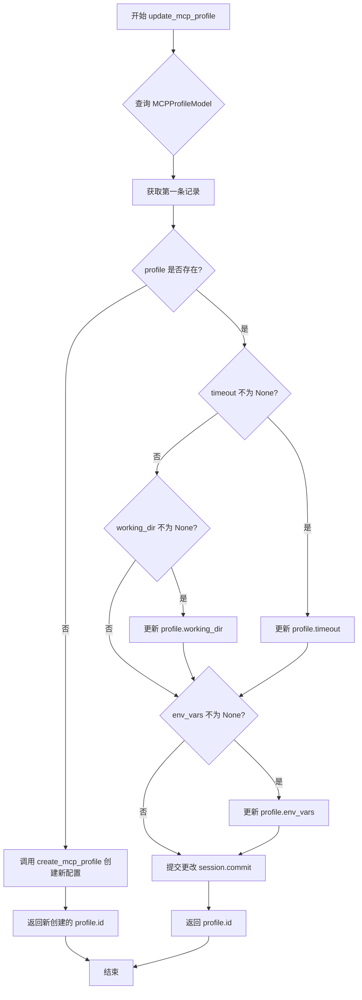

#### 带注释源码

```python
@with_session
def update_mcp_profile(
    session,
    timeout: int = None,
    working_dir: str = None,
    env_vars: Dict[str, str] = None,
):
    """
    更新 MCP 通用配置
    
    参数:
        session: 数据库会话对象，由 @with_session 装饰器注入
        timeout: 超时时间（秒），可选
        working_dir: 工作目录路径，可选
        env_vars: 环境变量字典，可选
    
    返回:
        str: 更新或创建的 MCP 配置 ID
    """
    # 查询数据库中的 MCP 通用配置（只获取第一条记录）
    profile = session.query(MCPProfileModel).first()
    
    # 如果配置已存在，则更新字段
    if profile is not None:
        # 仅更新非 None 的参数，实现部分更新
        if timeout is not None:
            profile.timeout = timeout
        if working_dir is not None:
            profile.working_dir = working_dir
        if env_vars is not None:
            profile.env_vars = env_vars
        
        # 标记对象为已修改并提交到数据库
        session.add(profile)
        session.commit()
        return profile.id
    else:
        # 如果配置不存在，则创建新的配置
        # 使用提供的值或默认值
        return create_mcp_profile(
            session,
            timeout=timeout or 30,           # 默认超时 30 秒
            working_dir=working_dir or "/tmp",  # 默认工作目录
            env_vars=env_vars,
        )
```


### `reset_mcp_profile`

重置 MCP 通用配置为默认值，将超时时间、工作目录和环境变量恢复为系统预设的默认值。

参数：

- `session`：`Session`，数据库会话对象，由 `@with_session` 装饰器自动注入管理

返回值：`bool`，表示重置操作是否成功；若配置文件存在并成功重置返回 `True`，否则返回 `False`

#### 流程图

```mermaid
flowchart TD
    A[开始] --> B{查询 MCPProfileModel}
    B --> C{记录是否存在?}
    C -->|是| D[设置 timeout = 30]
    D --> E[设置 working_dir = "/tmp"]
    E --> F[设置 env_vars 为默认字典]
    F --> G[session.add 更新后的 profile]
    G --> H[session.commit 提交事务]
    H --> I[返回 True]
    C -->|否| J[返回 False]
    I --> K[结束]
    J --> K
```

#### 带注释源码

```python
@with_session
def reset_mcp_profile(session):
    """
    重置 MCP 通用配置为默认值
    """
    # 查询数据库中是否存在 MCP 配置文件记录
    profile = session.query(MCPProfileModel).first()
    
    # 判断配置文件是否存在
    if profile is not None:
        # 将超时时间重置为默认值 30 秒
        profile.timeout = 30
        
        # 将工作目录重置为默认值 /tmp
        profile.working_dir = "/tmp"
        
        # 将环境变量重置为默认值字典
        profile.env_vars = {
            "PATH": "/usr/local/bin:/usr/bin:/bin",
            "PYTHONPATH": "/app",
            "HOME": "/tmp"
        }
        
        # 将更新后的 profile 对象添加到会话
        session.add(profile)
        
        # 提交事务以保存更改
        session.commit()
        
        # 返回 True 表示重置成功
        return True
    
    # 如果不存在配置文件，返回 False 表示重置失败
    return False
```


### `delete_mcp_profile`

删除 MCP 通用配置，移除系统中存储的 MCP Profile 记录。

参数：

- `session`：`Session`，数据库会话对象，由 `@with_session` 装饰器自动注入管理

返回值：`bool`，删除成功返回 `True`，配置不存在时返回 `False`

#### 流程图

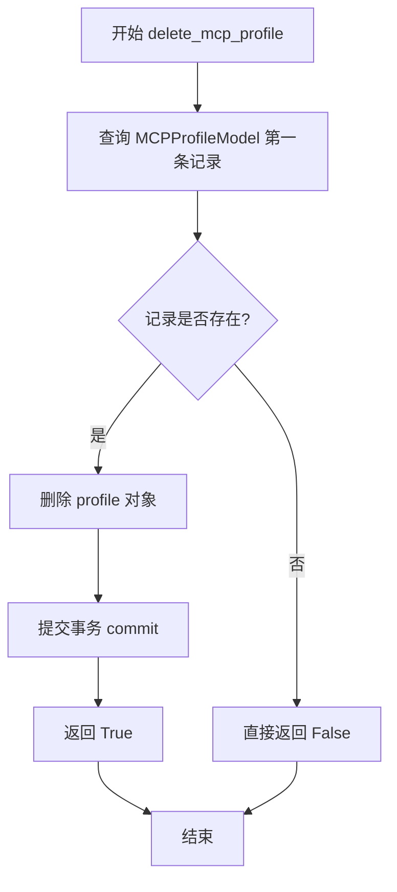

#### 带注释源码

```python
@with_session
def delete_mcp_profile(session):
    """
    删除 MCP 通用配置
    """
    # 查询数据库中的第一条 MCPProfileModel 记录
    profile = session.query(MCPProfileModel).first()
    
    # 判断记录是否存在
    if profile is not None:
        # 存在则删除该记录
        session.delete(profile)
        # 提交事务以永久保存删除操作
        session.commit()
        # 返回删除成功标志
        return True
    
    # 记录不存在，返回删除失败标志
    return False
```

## 关键组件


### MCP连接配置管理（Connection Management）

负责MCP服务器连接配置的完整生命周期管理，包括创建、更新、查询、删除、启用/禁用等操作。

### MCP通用配置管理（Profile Management）

负责MCP全局配置的统一管理，包括超时时间、工作目录、环境变量等通用参数的创建、更新、重置和删除。

### 数据库会话管理（Session Management）

使用`@with_session`装饰器统一管理数据库会话，提供事务自动提交和异常回滚机制。

### 数据模型抽象（Data Models）

`MCPConnectionModel`和`MCPProfileModel`分别定义MCP连接和配置文件的数据库结构，封装了所有字段映射。

### 查询构建器（Query Builder）

通过链式调用构建复杂查询条件，支持关键字搜索、状态过滤、排序和分页。

### 统一响应格式（Response Format）

所有查询方法返回标准化的字典格式，包含时间字段的ISO格式转换处理。


## 问题及建议


### 已知问题

-   **大量代码重复**：多个函数（`get_mcp_connection_by_id`、`get_mcp_connections_by_server_name`、`get_all_mcp_connections`、`get_enabled_mcp_connections`、`search_mcp_connections`）中都将`MCPConnectionModel`对象转换为字典的逻辑重复了5次，增加维护成本。
-   **函数功能重复**：`get_enabled_mcp_connections`与`get_all_mcp_connections(enabled_only=True)`功能完全相同，造成代码冗余。
-   **缺少输入验证**：`server_name`未进行空值校验，`timeout`未验证是否为正整数，`transport`未验证是否为有效值（如"stdio"），`connection_id`未验证格式有效性。
-   **缺乏异常处理**：所有数据库操作（session.add、session.commit、session.delete、session.query）均未使用try-except包裹，数据库连接失败或操作异常时可能导致未捕获的异常向上传播。
-   **SQL注入风险**：`search_mcp_connections`函数中直接使用用户输入的`keyword`进行LIKE查询，虽然使用ORM但未对keyword进行转义处理，恶意输入可能导致意外查询结果。
-   **事务处理不一致**：`update_mcp_connection`中逐字段更新后commit，未使用atomic事务批量更新；`create_mcp_profile`中先查询再决定更新或创建，存在竞态条件风险。
-   **分页支持不完整**：`search_mcp_connections`有`limit`参数但无`offset`参数，无法实现真正的分页查询。
-   **更新效率低下**：使用逐字段赋值而非SQLAlchemy的`update()`语句，性能较低。
-   **硬编码默认值**：超时默认值30、工作目录"/tmp"等硬编码在多个函数中，应提取为常量或配置。
-   **返回值语义不一致**：部分函数返回bool，部分返回id，部分返回None，缺乏统一的错误返回机制。

### 优化建议

-   **抽取转换函数**：创建`_mcp_connection_to_dict`私有函数，将模型转字典逻辑统一，避免重复代码。
-   **合并重复函数**：删除`get_enabled_mcp_connections`，统一使用`get_all_mcp_connections(enabled_only=True)`。
-   **添加输入验证**：使用Pydantic或自定义验证器对函数参数进行校验，确保必填字段非空、类型正确、值在合理范围内。
-   **添加异常处理**：在所有数据库操作外层包裹try-except，捕获SQLAlchemy异常并返回友好的错误信息。
-   **修复SQL注入**：对`keyword`进行转义处理或使用参数化查询（SQLAlchemy的filter支持）。
-   **改进事务处理**：使用`session.begin()`或装饰器实现统一的事务管理；对于并发场景使用数据库锁。
-   **添加分页支持**：为`search_mcp_connections`添加`offset`参数支持分页。
-   **使用批量更新**：使用`session.query(MCPConnectionModel).filter(...).update({...})`替代逐字段赋值。
-   **提取常量**：创建配置类或常量模块管理默认超时、工作目录、默认环境变量等。
-   **统一返回值**：定义统一的响应结构（如包含success、data、message字段的字典），或抛出自定义异常。

## 其它


### 设计目标与约束

本模块旨在提供对MCP（Model Context Protocol）连接配置和通用配置文件的完整CRUD操作能力，支持连接的单体管理和批量查询。设计约束包括：数据库会话通过装饰器`@with_session`自动管理，连接ID采用UUID生成，配置参数支持可选默认值，且所有数据库操作遵循同步执行模式。

### 错误处理与异常设计

当前代码采用返回`None`或`False`的方式表示查询失败或记录不存在，未抛出显式异常。`add_mcp_connection`和`update_mcp_connection`在记录不存在时返回`None`，`delete_mcp_connection`、`enable_mcp_connection`、`disable_mcp_connection`操作失败时返回`False`。建议补充自定义异常类（如`MCPConnectionNotFoundError`）以区分不同失败场景，并增加数据库唯一性约束冲突处理。

### 数据流与状态机

数据流从API层传入参数，经`@with_session`装饰器获取数据库会话，通过SQLAlchemy ORM执行CURD操作，最终返回字典结构或布尔值。`MCPConnectionModel`具有`enabled`状态字段，支持启用/禁用状态切换；`MCPProfileModel`为单例配置，无状态流转。

### 外部依赖与接口契约

依赖`chatchat.server.db.models.mcp_connection_model`中的`MCPConnectionModel`和`MCPProfileModel`两个ORM模型，以及`chatchat.server.db.session`中的`with_session`装饰器。函数接口约定：所有MCP Connection函数接受`connection_id`作为主键标识，Profile函数无ID参数（全局单例），返回值类型包括`str`（ID）、`Optional[dict]`（单条记录）、`List[dict]`（记录列表）、`bool`（操作结果）。

### 安全性考虑

当前代码未对敏感信息（如`env`中的密钥、`config`中的凭证）进行加密存储或脱敏处理。`env`参数以明文方式存入数据库，存在信息泄露风险。建议增加字段级别的加密机制，并在返回数据时对敏感字段进行掩码处理。

### 性能考量

所有查询均未使用索引优化（`server_name`、`enabled`字段查询频繁，应建立索引）。`search_mcp_connections`中使用`LIKE`模糊查询在大数据量下性能较差，建议引入全文搜索或分页机制。批量查询场景下可考虑使用`joinedload`预加载关联数据减少N+1查询。

### 配置管理

`create_mcp_profile`包含默认环境变量配置（`PATH`、`PYTHONPATH`、`HOME`），这些默认值硬编码在函数内部。建议抽离至独立配置文件，支持通过环境变量或配置文件动态注入，提高部署灵活性。

### 并发与事务处理

当前代码依赖`@with_session`装饰器管理事务，但未显式处理并发冲突（如两个请求同时修改同一连接配置）。`update_mcp_connection`中先查询再更新，存在竞态条件风险。建议增加乐观锁（版本号字段）或悲观锁机制。

### 兼容性考虑

代码使用`isoformat()`处理时间字段，假设调用方能够解析ISO格式时间字符串。若存在跨语言调用场景（如JavaScript前端），需确保时间格式兼容性。当前无版本号字段，后续配置变更难以追踪历史版本。

### 日志与监控

代码中无任何日志记录语句，无法追踪操作历史和调试问题。建议在关键操作节点（增删改）增加审计日志，记录操作人、操作时间、变更前后值等信息，便于问题排查和合规审计。

    