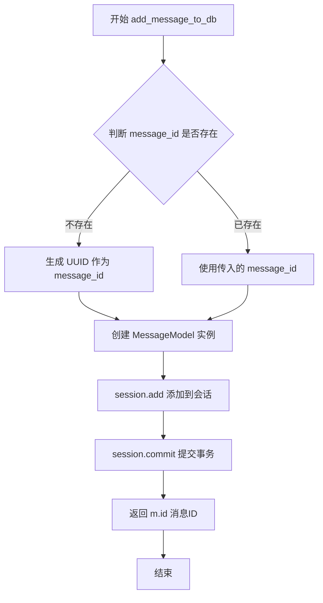
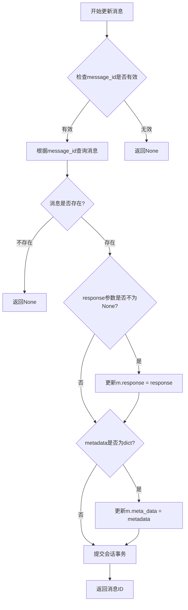
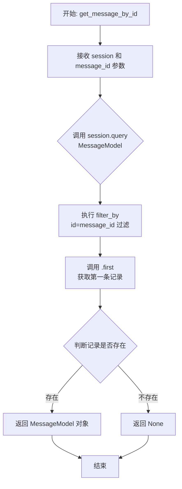
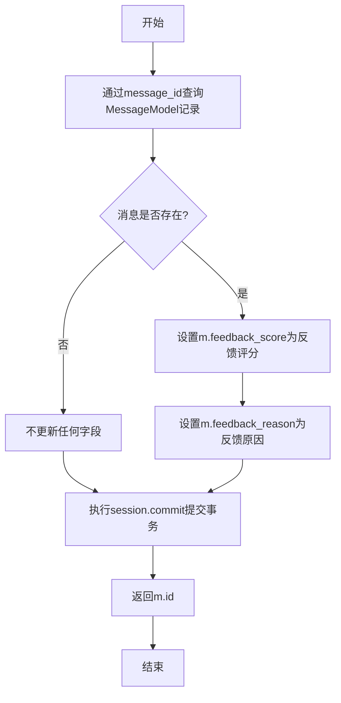
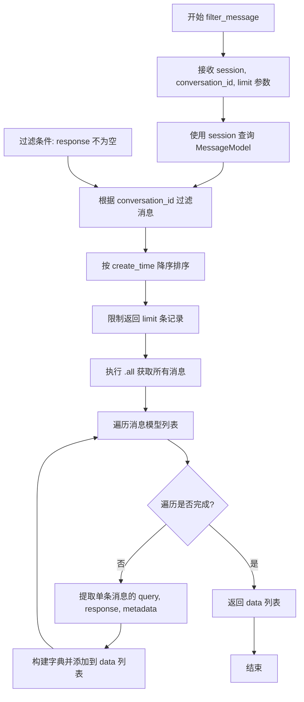

# `Langchain-Chatchat\libs\chatchat-server\chatchat\server\db\repository\message_repository.py` 详细设计文档

该模块是聊天系统的数据访问层（API），封装了对数据库中聊天消息（MessageModel）的创建、读取、更新、反馈以及历史记录筛选等功能，依赖于SQLAlchemy的session管理器和装饰器实现事务控制。

## 整体流程

```mermaid
graph TD
    Caller[服务层调用] --> Func{数据库操作函数}
    Func -->|@with_session| SessionMgr[获取/开启数据库会话]
    SessionMgr --> Logic{执行业务逻辑}
    Logic -->|add_message| Create[创建MessageModel对象]
    Logic -->|get_message| Query[根据ID查询]
    Logic -->|update_message| Modify[修改对象属性]
    Logic -->|filter_message| Filter[条件过滤与转换]
    Create --> Commit[session.commit()]
    Query --> Commit
    Modify --> Commit
    Filter --> Commit
    Commit --> Return[返回结果/ID/列表]
```

## 类结构

```
该文件为模块文件 (Module)
无显式类定义 (Classes: None)
└── Functions (全局函数)
    ├── add_message_to_db
    ├── update_message
    ├── get_message_by_id
    ├── feedback_message_to_db
    └── filter_message
```

## 全局变量及字段


### `uuid`
    
Python标准库模块，用于生成唯一标识符

类型：`module`
    


### `typing.Dict`
    
Python类型提示模块，用于定义字典类型

类型：`module`
    


### `typing.List`
    
Python类型提示模块，用于定义列表类型

类型：`module`
    


### `MessageModel`
    
消息数据模型类，对应数据库中的message表

类型：`class`
    


### `with_session`
    
数据库会话装饰器，用于自动管理数据库事务

类型：`decorator`
    


    

## 全局函数及方法


### `add_message_to_db`

新增聊天记录到数据库，通过会话会话将用户查询、响应及相关元数据持久化到MessageModel表中，并返回新创建的消息ID。

参数：

- `session`：`Session`，由`@with_session`装饰器注入的数据库会话对象
- `conversation_id`：`str`，会话ID，用于关联消息所属的对话
- `chat_type`：未指定类型，聊天类型（如单聊、群聊等）
- `query`：未指定类型，用户提交的查询内容
- `response`：`str`，可选，默认为空字符串，服务端响应内容
- `message_id`：可选，默认值为`None`，消息唯一标识，默认自动生成UUID
- `metadata`：`Dict`，可选，默认为空字典`{}`，消息的附加元数据信息

返回值：`str`，新创建的消息ID（UUID格式）

#### 流程图



#### 带注释源码

```python
@with_session  # 装饰器：自动管理数据库会话的创建与提交
def add_message_to_db(
    session,                    # 数据库会话对象，由装饰器注入
    conversation_id: str,        # 会话ID，字符串类型
    chat_type,                  # 聊天类型，类型未标注
    query,                      # 用户查询内容，类型未标注
    response="",                # 服务端响应，默认空字符串
    message_id=None,            # 消息ID，可选，默认自动生成
    metadata: Dict = {},        # 元数据字典，默认为空字典
):
    """
    新增聊天记录
    """
    # 如果未提供message_id，则生成UUID作为唯一标识
    if not message_id:
        message_id = uuid.uuid4().hex
    
    # 创建消息模型实例
    m = MessageModel(
        id=message_id,           # 消息唯一ID
        chat_type=chat_type,     # 聊天类型
        query=query,             # 用户查询
        response=response,       # 响应内容
        conversation_id=conversation_id,  # 所属会话
        meta_data=metadata,      # 元数据（注意：字段名为meta_data）
    )
    
    # 将模型实例添加到SQLAlchemy会话
    session.add(m)
    
    # 提交事务，将数据写入数据库
    session.commit()
    
    # 返回新创建的消息ID
    return m.id
```


### `update_message`

更新已有的聊天记录，根据传入的参数修改消息的响应内容或元数据。

参数：

- `session`：数据库会话对象（由装饰器 `@with_session` 自动注入）
- `message_id`：`str`，要更新的消息的唯一标识符
- `response`：`str`，可选参数，用于更新消息的响应内容
- `metadata`：`Dict`，可选参数，用于更新消息的元数据

返回值：`str` 或 `None`，返回更新后的消息ID；若消息不存在则返回 `None`

#### 流程图



#### 带注释源码

```python
@with_session  # 装饰器：自动获取/创建数据库会话并管理事务
def update_message(session, message_id, response: str = None, metadata: Dict = None):
    """
    更新已有的聊天记录
    参数:
        session: 数据库会话对象，由装饰器注入
        message_id: 要更新的消息ID
        response: 可选的响应内容，用于更新消息的回复
        metadata: 可选的元数据字典，用于更新消息的附加信息
    返回:
        成功更新返回消息ID，消息不存在返回None
    """
    # 根据message_id从数据库获取消息记录
    m = get_message_by_id(message_id)
    
    # 判断消息记录是否存在
    if m is not None:
        # 如果传入了response参数，则更新响应内容
        if response is not None:
            m.response = response
        
        # 如果传入的metadata是字典类型，则更新元数据
        if isinstance(metadata, dict):
            m.meta_data = metadata
        
        # 将更新后的对象添加到会话，准备提交
        session.add(m)
        
        # 提交事务，将修改持久化到数据库
        session.commit()
        
        # 返回更新后的消息ID
        return m.id
    
    # 如果消息不存在，直接返回None
    return None
```


### `get_message_by_id`

根据代码分析，`get_message_by_id` 是一个数据库查询函数，用于根据消息ID从数据库中查询并返回对应的聊天记录（MessageModel对象）。该函数被 `@with_session` 装饰器包装，支持自动会话管理。

参数：

- `session`：`Session`，由 `@with_session` 装饰器自动注入的数据库会话对象
- `message_id`：`str`，要查询的消息的唯一标识符

返回值：`MessageModel`，返回查询到的消息记录对象，如果未找到则返回 `None`

#### 流程图



#### 带注释源码

```python
@with_session  # 装饰器：自动管理数据库会话的开启和提交/回滚
def get_message_by_id(session, message_id) -> MessageModel:
    """
    查询聊天记录
    """
    # 使用 SQLAlchemy 的 query API 查询 MessageModel 表
    # filter_by: 使用关键字参数进行过滤，这里按 id 字段匹配
    # .first(): 返回第一条匹配记录，若无匹配则返回 None
    m = session.query(MessageModel).filter_by(id=message_id).first()
    return m
```


### `feedback_message_to_db`

反馈聊天记录函数，用于将用户对聊天消息的反馈（评分和反馈原因）存储到数据库中。

参数：

- `session`：会话对象，由 `@with_session` 装饰器自动注入的数据库会话
- `message_id`：消息ID，用于定位需要反馈的消息记录
- `feedback_score`：反馈评分，用户对消息的评价分数
- `feedback_reason`：反馈原因，用户提供的反馈详细说明

返回值：`str` 或 `int`，返回被反馈消息的ID，如果消息不存在则返回 `None`

#### 流程图



#### 带注释源码

```
@with_session
def feedback_message_to_db(session, message_id, feedback_score, feedback_reason):
    """
    反馈聊天记录
    
    该函数接收用户对聊天消息的反馈，并将反馈信息更新到数据库中。
    反馈内容包括评分和反馈原因两个维度。
    
    参数:
        session: 数据库会话对象，由with_session装饰器注入
        message_id: 消息的唯一标识符，用于定位数据库中的消息记录
        feedback_score: 用户对消息的评分，可以是数值型（如1-5分）
        feedback_reason: 用户给出的反馈原因或详细说明
    
    返回值:
        返回被反馈消息的ID，如果消息不存在则返回None
    """
    # 使用message_id查询对应的消息记录
    m = session.query(MessageModel).filter_by(id=message_id).first()
    
    # 如果查询到了消息记录，则更新反馈字段
    if m:
        # 更新反馈评分
        m.feedback_score = feedback_score
        # 更新反馈原因
        m.feedback_reason = feedback_reason
    
    # 提交事务，保存修改到数据库
    session.commit()
    
    # 返回消息的ID（如果消息不存在，m为None，此时m.id返回None）
    return m.id
```


### `filter_message`

该函数用于根据会话ID查询聊天记录，过滤掉用户最新发送但尚未得到回复的查询记录（即只保留有回复的消息），并返回最近的指定数量的消息数据。

参数：

- `session`：数据库会话对象，由 `@with_session` 装饰器注入
- `conversation_id`：`str`，会话ID，用于筛选属于特定会话的消息
- `limit`：`int` = 10，返回消息的数量限制，默认为10条

返回值：`List[Dict]`，返回包含消息查询内容、回复内容和元数据的字典列表

#### 流程图



#### 带注释源码

```python
@with_session
def filter_message(session, conversation_id: str, limit: int = 10):
    """
    根据会话ID过滤聊天记录
    参数:
        session: 数据库会话对象, 由装饰器注入
        conversation_id: 会话ID字符串
        limit: 返回记录数限制, 默认10条
    返回:
        包含消息字典的列表
    """
    # 使用 SQLAlchemy 查询 MessageModel 表
    messages = (
        session.query(MessageModel)
        # 1. 根据会话ID进行过滤
        .filter_by(conversation_id=conversation_id)
        # 2. 过滤掉用户最新发送但尚未得到回复的记录
        #    (只保留 response 不为空的记录)
        .filter(MessageModel.response != "")
        # 3. 按创建时间降序排序,确保获取最近的消息
        .order_by(MessageModel.create_time.desc())
        # 4. 限制返回的记录数量
        .limit(limit)
        # 5. 执行查询并获取所有结果
        .all()
    )
    
    # 注意: 直接返回 List[MessageModel] 可能会导致序列化问题
    # 因此将每个消息模型转换为字典格式
    
    # 初始化空列表用于存储转换后的数据
    data = []
    
    # 遍历查询到的消息模型列表
    for m in messages:
        # 从每个消息模型中提取需要的字段
        # query: 用户发送的查询内容
        # response: 助手生成的回复内容
        # metadata: 附加的元数据信息
        data.append({
            "query": m.query, 
            "response": m.response, 
            "metadata": m.meta_data
        })
    
    # 返回转换后的字典列表
    return data
```

## 关键组件


### 消息添加组件

负责向数据库新增聊天记录，支持自动生成消息ID

### 消息更新组件

负责更新已有聊天记录的回答内容和元数据

### 消息查询组件

根据消息ID查询单条聊天记录

### 消息反馈组件

为聊天记录添加反馈分数和反馈原因

### 消息过滤组件

根据会话ID过滤聊天记录，支持返回最近N条记录


## 问题及建议


### 已知问题

-   **可变默认参数陷阱**：`metadata: Dict = {}` 使用了可变默认参数，Python中会导致所有调用共享同一个字典对象，可能引发意外的副作用
-   **缺少参数类型注解**：`chat_type`、`query`、`message_id`、`feedback_score`、`feedback_reason` 等参数缺少类型注解，影响代码可读性和类型安全
-   **空值处理缺失**：`get_message_by_id` 返回 None 时，`update_message` 和 `feedback_message_to_db` 未做判空检查，尤其是 `feedback_message_to_db` 在 `m` 为 None 时调用 `m.id` 会引发 `AttributeError`
-   **事务错误处理缺失**：所有数据库操作均无 try-except 包裹，数据库连接失败或操作异常时会导致未捕获的异常上浮
-   **更新操作无事务回滚**：`update_message` 中先查询再更新，若更新失败无法自动回滚，可能造成数据不一致
-   **代码格式不规范**：`filter_message` 中的链式调用在 `.` 处换行，不符合 PEP8 规范
-   **注释表明存在已知问题**：注释 "# 直接返回 List[MessageModel] 报错" 表明开发者意识到类型转换问题但未彻底解决

### 优化建议

-   将可变默认参数改为 `metadata: Dict = None`，在函数内部判断是否为 None 并初始化新字典
-   为所有函数参数添加完整的类型注解，提升代码可维护性
-   在 `update_message` 和 `feedback_message_to_db` 中增加空值检查，返回明确的错误信息或抛出自定义异常
-   使用 try-except 包裹数据库操作，捕获 `SQLAlchemyError` 等异常，并进行适当的日志记录和事务回滚
-   考虑使用上下文管理器统一管理事务提交和回滚
-   统一代码风格，将 `.` 放在行首或行尾，保持一致性
-   在 `filter_message` 中明确处理返回类型的转换逻辑，或使用 Pydantic/Dataclass 进行类型约束

## 其它


### 设计目标与约束

本模块的设计目标是实现聊天消息的持久化存储和管理，提供消息的增删改查及反馈功能。设计约束包括：1）依赖SQLAlchemy ORM框架和with_session装饰器进行数据库操作；2）message_id采用UUID生成策略；3）metadata字段支持自定义字典格式；4）所有数据库操作需在session上下文内完成。

### 错误处理与异常设计

1. 数据库连接异常：由with_session装饰器统一处理，连接失败时向上抛出SQLAlchemy异常；2. 消息不存在：get_message_by_id和update_message返回None而非抛出异常，调用方需进行空值判断；3. 参数类型错误：metadata参数需为dict类型，否则在update_message中会被跳过；4. 会话提交失败：session.commit()异常会被抛出，需由上层调用方捕获处理。

### 外部依赖与接口契约

外部依赖包括：1）chatchat.server.db.models.message_model.MessageModel - 消息数据模型；2）chatchat.server.db.session.with_session - 数据库会话装饰器；3）uuid模块 - 用于生成唯一消息ID。接口契约：add_message_to_db返回新创建的消息ID字符串；update_message返回更新后的消息ID或None；get_message_by_id返回MessageModel对象或None；feedback_message_to_db返回消息ID或None；filter_message返回包含query、response、metadata的字典列表。

### 安全性考虑

1. SQL注入防护：使用SQLAlchemy ORM的filter_by和filter方法，自动防止SQL注入；2. 敏感数据：metadata参数需调用方自行过滤敏感信息，当前实现无内置脱敏机制；3. 权限控制：当前模块未实现权限验证，需在上层API层实现。

### 性能考虑与优化空间

1. N+1查询风险：filter_message中使用循环追加字典，建议使用orm加载策略优化；2. 索引优化：conversation_id和create_time字段建议在MessageModel中建立联合索引以提升查询性能；3. 批量操作：当前无批量插入/更新方法，高并发场景下可考虑添加batch_add_messages方法；4. 会话管理：频繁commit可能导致性能瓶颈，可考虑事务批量提交策略。

### 数据流与状态机

消息生命周期状态：1）CREATED - 初始创建状态，query已写入，response为空；2）COMPLETED - 响应生成完成，response字段有值；3）UPDATED - 消息内容被更新；4）FEEDBACKED - 用户已提交反馈，feedback_score和feedback_reason字段有值。数据流：API层调用add_message_to_db创建消息 → 业务逻辑处理 → 调用update_message填充response → 用户交互 → 调用feedback_message_to_db记录反馈 → filter_message用于历史记录查询。

### 配置与部署相关

数据库连接配置由with_session装饰器内部管理，需确保数据库连接池参数合理配置（建议pool_size=5, max_overflow=10）。部署时需执行MessageModel对应的数据库迁移脚本，确保messages表及索引创建完成。建议配置数据库连接超时参数（建议connect_timeout=10秒）。

### 日志与监控建议

建议在关键操作点添加日志：1）add_message_to_db - 记录新消息创建，包含conversation_id和message_id；2）update_message - 记录消息更新，包含message_id和更新字段；3）filter_message - 记录查询操作和返回数量。监控指标建议：消息创建QPS、查询响应时间、数据库连接池使用率、commit失败率。

### 测试策略建议

单元测试：1）使用mock对象模拟session和MessageModel；2）测试各函数参数边界情况（空值、异常类型）；3）测试filter_message的limit参数和过滤逻辑。集成测试：1）测试真实数据库环境下的CRUD操作；2）测试with_session装饰器的会话管理；3）测试并发场景下的事务一致性。

    