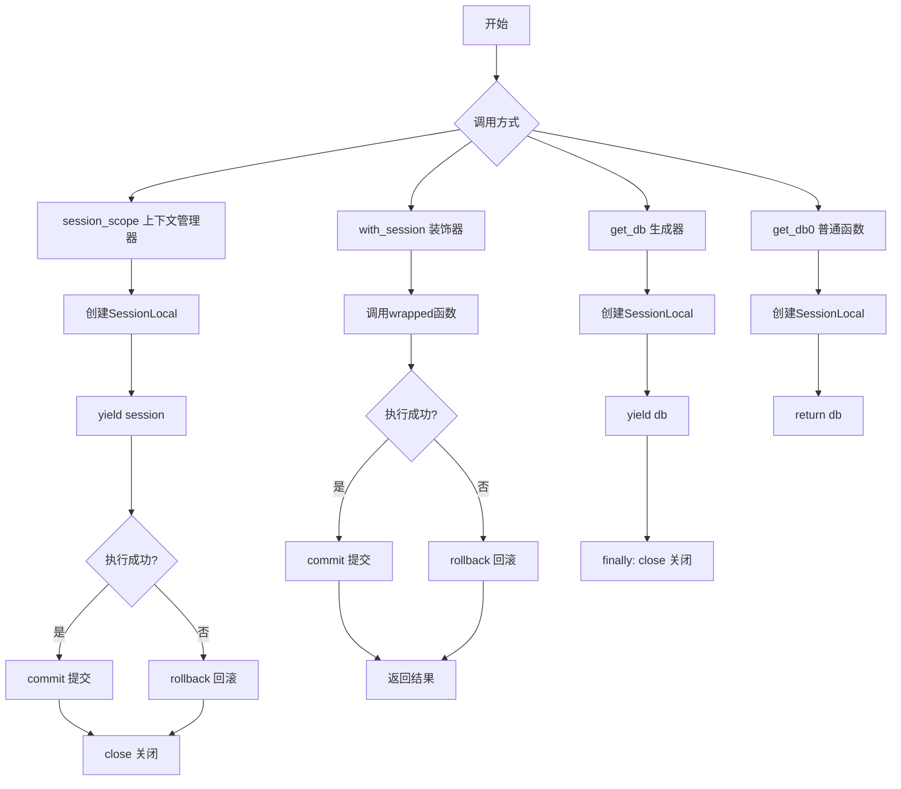
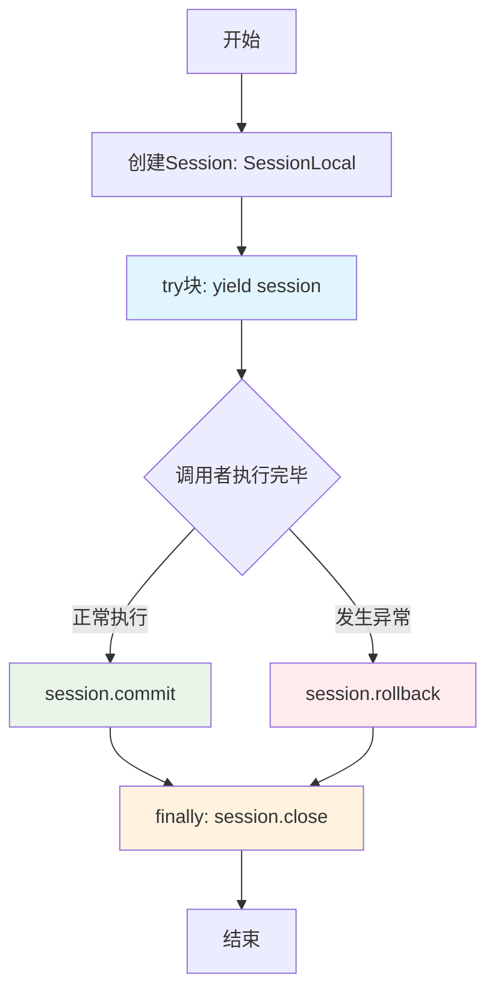
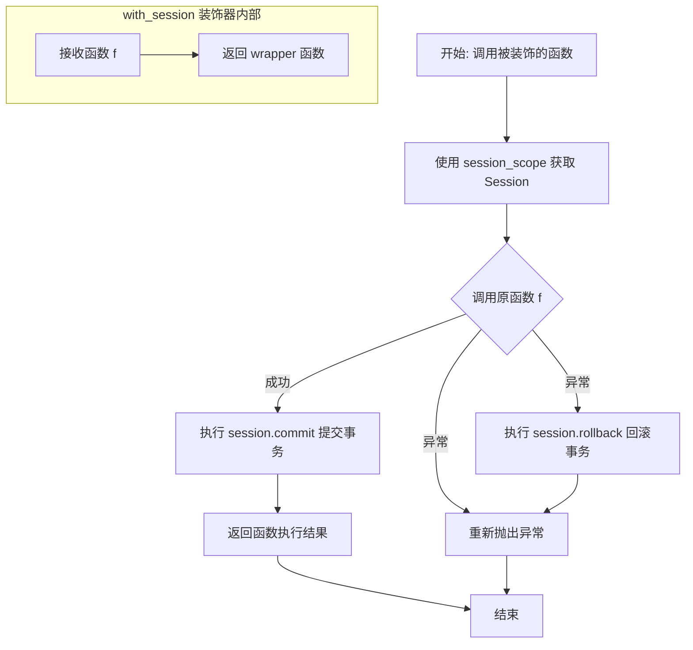

# `Langchain-Chatchat\libs\chatchat-server\chatchat\server\db\session.py` 详细设计文档

这是一个数据库会话管理模块，提供了四种获取SQLAlchemy数据库会话的方式：上下文管理器session_scope()、装饰器with_session()、生成器get_db()和普通函数get_db0()，均实现了会话的自动创建、提交和异常回滚，确保数据库操作的正确性和资源释放。

## 整体流程



## 类结构

```
模块: db_session (无类定义)
└── 全局函数
    ├── session_scope (上下文管理器)
    ├── with_session (装饰器工厂)
    ├── get_db (生成器函数)
    └── get_db0 (普通函数)
```

## 全局变量及字段


### `session_scope`
    
上下文管理器，用于自动获取和提交SQLAlchemy会话

类型：`context manager`
    


### `with_session`
    
装饰器，为函数自动添加会话管理功能

类型：`decorator`
    


### `get_db`
    
生成器函数，用于FastAPI依赖注入获取数据库会话

类型：`generator function`
    


### `get_db0`
    
简单函数，返回新的数据库会话（需手动关闭）

类型：`function`
    


### `SessionLocal`
    
从chatchat.server.db.base导入的SQLAlchemy会话工厂

类型：`SessionLocal`
    


    

## 全局函数及方法


### `session_scope`

上下文管理器，自动管理数据库会话的创建、提交和异常回滚，确保数据库资源得到正确释放。

参数：此函数无参数

返回值：`Session`，SQLAlchemy ORM 会话对象，供调用者使用并在使用完毕后自动提交或回滚

#### 流程图



#### 带注释源码

```python
@contextmanager
def session_scope() -> Session:
    """
    上下文管理器用于自动获取 Session, 避免错误
    
    该装饰器将函数转换为上下文管理器，提供以下功能：
    - 自动创建数据库会话
    - 自动提交事务（如果无异常）
    - 自动回滚事务（如果发生异常）
    - 自动关闭会话（无论成功或失败）
    """
    # 第一步：创建数据库会话
    # 使用 SessionLocal 工厂方法创建新的 Session 实例
    session = SessionLocal()
    try:
        # 第二步：将 session 控制权交给调用者
        # 调用者可以在 with 块中使用该 session 进行数据库操作
        yield session
        
        # 第三步：如果执行至此（无异常），提交事务
        # 将所有更改持久化到数据库
        session.commit()
    except:
        # 第四步：如果发生异常，回滚事务
        # 撤销当前事务中的所有更改
        session.rollback()
        
        # 重新抛出异常，让调用者能够感知到错误
        raise
    finally:
        # 第五步：无论成功或失败，最终关闭会话
        # 释放数据库连接资源
        session.close()
```


### `with_session`

`with_session` 是一个装饰器，用于为函数自动添加数据库会话管理功能。它通过上下文管理器获取 SQLAlchemy 会话，并将 session 作为第一个参数传递给被装饰的函数，同时自动处理事务的提交和回滚。

参数：

- `f`：`Callable`，需要装饰的函数，该函数需要接受 `session` 作为其第一个参数

返回值：`Callable`，返回包装后的函数，该函数会自动管理数据库会话的生命周期

#### 流程图



#### 带注释源码

```python
def with_session(f):
    """
    装饰器：为函数自动添加会话管理功能
    
    该装饰器会：
    1. 创建一个 session_scope 上下文管理器来管理数据库会话
    2. 将 session 作为第一个参数传递给被装饰的函数
    3. 自动处理事务的提交和回滚
    4. 确保会话正确关闭
    
    Args:
        f: 需要装饰的函数，该函数的第一个参数必须是 session
        
    Returns:
        wrapper: 包装后的函数，自动管理会话生命周期
    """
    @wraps(f)  # 保留原函数的元信息（名称、文档字符串等）
    def wrapper(*args, **kwargs):
        """
        包装函数：自动管理数据库会话
        
        Args:
            *args: 传递给原函数的位置参数
            **kwargs: 传递给原函数的关键字参数
            
        Returns:
            原函数的返回值
            
        Raises:
            Exception: 如果原函数抛出异常，会先回滚事务再重新抛出
        """
        # 使用上下文管理器获取数据库会话
        # session_scope 会自动处理会话的创建和关闭
        with session_scope() as session:
            try:
                # 将 session 作为第一个参数传入原函数
                # 然后传递其他参数
                result = f(session, *args, **kwargs)
                
                # 显式提交事务（虽然 session_scope 也会提交，
                # 但这里额外确保一次提交）
                session.commit()
                
                # 返回原函数的执行结果
                return result
            except:
                # 如果发生异常，回滚事务
                session.rollback()
                # 重新抛出异常，让调用者处理
                raise
        # 当离开 with 语句时，session_scope 会自动调用 session.close()

    return wrapper
```

---

#### 补充说明

| 项目 | 说明 |
|------|------|
| **设计目标** | 为数据库操作函数自动添加会话管理，避免手动创建和关闭 Session 的繁琐操作 |
| **约束** | 被装饰的函数的第一个参数必须是 `session`，且该函数应接受 `Session` 类型的参数 |
| **错误处理** | 如果原函数执行成功，会自动提交事务；如果抛出任何异常，会自动回滚事务并重新抛出异常 |
| **会话生命周期** | 由 `session_scope()` 上下文管理器管理，确保会话在使用后正确关闭 |
| **与 session_scope 的关系** | `with_session` 内部使用了 `session_scope()`，但额外添加了异常处理和对原函数的调用逻辑 |
| **潜在优化空间** | 目前装饰器会覆盖原函数的所有异常，建议可以通过配置参数允许自定义异常处理逻辑；另外可以考虑支持非事务模式的装饰器变体 |


### `get_db`

这是一个依赖注入用的生成器函数，用于在 FastAPI 等异步框架中提供数据库会话实例给请求处理函数使用。该函数遵循 SQLAlchemy 的依赖注入模式，通过 yield 关键字将会话传递给调用者，并在请求结束后自动关闭会话资源，确保资源不会泄漏。

参数：

- （无参数）

返回值：`SessionLocal`，数据库会话对象，调用者可以使用此会话对象进行数据库操作，如查询、插入、更新和删除等。

#### 流程图

```mermaid
flowchart TD
    A[开始] --> B[创建数据库会话: db = SessionLocal()]
    B --> C{yield db}
    C -->|调用者使用会话| D[执行数据库操作]
    D --> E{会话使用完毕}
    E --> F[进入 finally 块]
    F --> G[关闭会话: db.close()]
    G --> H[结束]
    
    style C fill:#e1f5fe
    style F fill:#fff3e0
    style G fill:#ffebee
```

#### 带注释源码

```python
def get_db() -> SessionLocal:
    """
    依赖注入用的生成器函数，用于提供数据库会话。
    
    该函数通常与 FastAPI 的 Depends() 一起使用，作为路径函数的依赖项。
    当请求到达时，FastAPI 会调用此函数获取数据库会话；
    当请求处理完毕后（无论成功或失败），finally 块确保会话被正确关闭。
    
    使用示例（FastAPI）：
        @app.get("/users/{user_id}")
        def get_user(user_id: int, db: Session = Depends(get_db)):
            return db.query(User).get(user_id)
    
    Returns:
        SessionLocal: SQLAlchemy 数据库会话对象，供调用者执行数据库操作
    """
    # 第一步：创建数据库会话实例
    # SessionLocal 是从 chatchat.server.db.base 导入的会话工厂
    db = SessionLocal()
    
    try:
        # 第二步：通过 yield 将会话控制权交给调用者
        # 调用者可以在此会话上执行任意数据库操作
        # 当调用者完成操作后，代码会继续执行 finally 块
        yield db
    finally:
        # 第三步（无论成功或异常）：确保会话资源被释放
        # 关闭数据库连接，防止连接泄漏
        db.close()
```


### `get_db0`

这是一个简单的数据库会话获取函数，直接实例化并返回一个数据库会话对象，不包含任何异常处理或资源清理逻辑，需要调用者手动管理会话的生命周期。

参数：

- （无参数）

返回值：`SessionLocal`，返回一个数据库会话实例，调用者需要在使用完毕后手动调用 `close()` 方法释放资源

#### 流程图

```mermaid
flowchart TD
    A[开始调用 get_db0] --> B[创建数据库会话: db = SessionLocal()]
    B --> C[返回会话对象给调用者]
    C --> D[调用者负责后续: 使用会话 → 提交/回滚 → 关闭会话]
    D --> E[结束]
    
    style B fill:#ff9999
    style D fill:#ffe066
```

#### 带注释源码

```python
def get_db0() -> SessionLocal:
    """
    简单获取会话的函数，需手动管理会话生命周期
    
    注意：此函数设计为生成器模式，但实际上并未实现生成器逻辑
    直接返回会话对象，调用者需要手动负责:
    1. 会话的使用
    2. 事务的提交或回滚
    3. 会话的关闭
    """
    db = SessionLocal()  # 创建新的数据库会话实例
    return db            # 直接返回会话，未使用 yield
```

---

## 补充信息

### 关键组件信息

| 组件名称 | 描述 |
|---------|------|
| `SessionLocal` | SQLAlchemy 的会话工厂，用于创建数据库会话 |
| `get_db0` | 简单会话获取函数，缺少生命周期管理 |

### 潜在的技术债务或优化空间

1. **资源泄漏风险**：函数返回会话后不关闭，长时间运行的应用可能导致数据库连接耗尽
2. **设计不一致**：函数签名声明返回类型为 `SessionLocal`，但实际返回的是 `Session` 实例
3. **生成器误用**：注释表明意图是实现生成器模式（`yield`），但实际使用了 `return`，与同文件中的 `get_db()` 函数的实现不一致
4. **缺失异常处理**：没有 try-except 保护，数据库连接失败时会抛出未处理异常
5. **事务管理缺失**：调用者必须自行处理 commit/rollback，容易遗漏

### 其它项目

#### 设计目标与约束

- **设计目标**：提供一个极简的会话获取接口，保持调用灵活性
- **约束**：调用者必须严格遵循"获取→使用→关闭"的完整生命周期

#### 错误处理与异常设计

- 无内置错误处理机制
- 数据库连接失败时直接向上抛出异常
- 建议调用者自行封装 try-finally 块确保资源释放

#### 数据流与状态机

```
[调用者] → 调用 get_db0() → [创建 Session] → 返回 Session → [调用者使用]
                                                      ↓
                                              [手动 commit/rollback]
                                                      ↓
                                              [手动 session.close()]
```

#### 外部依赖与接口契约

- **依赖**：`chatchat.server.db.base.SessionLocal`（SQLAlchemy 会话工厂）
- **接口契约**：
  - 输入：无参数
  - 输出：返回可用的数据库会话对象
  - 前置条件：无
  - 后置条件：调用者获得会话所有权，需自行管理生命周期

## 关键组件


### SessionLocal 全局变量

从 `chatchat.server.db.base` 导入的 SQLAlchemy 会话工厂，用于创建数据库连接会话。

### session_scope 上下文管理器

提供自动获取和释放数据库会话的上下文管理器，确保会话在使用后正确提交或回滚。

### with_session 装饰器

装饰器函数，为任意数据库操作函数自动添加会话管理功能，支持事务提交和异常回滚。

### get_db 生成器函数

FastAPI 依赖注入用的生成器函数，提供请求级别的数据库会话管理，会话在使用后自动关闭。

### get_db0 普通函数

简单直接的会话创建函数，无自动管理逻辑，需要调用方手动管理会话生命周期。

### SessionLocal 类型提示

从 `chatchat.server.db.base` 导入的会话类类型，用于类型注解。


## 问题及建议


### 已知问题

-   **事务处理不一致**：`get_db()` 函数未处理异常情况下的 `rollback`，而 `session_scope()` 和 `with_session` 都有完善的异常处理，可能导致异常时事务未正确回滚
-   **重复提交**：`with_session` 装饰器内先通过 `session_scope()` 隐式调用 `commit`，随后又在 `wrapper` 中显式调用 `session.commit()`，造成重复提交操作
-   **连接泄漏风险**：`get_db0()` 函数创建数据库连接后直接返回，没有任何清理机制，调用者若未手动关闭将导致数据库连接泄漏
-   **类型注解错误**：`get_db()` 和 `get_db0()` 的返回值类型标注为 `SessionLocal`（工厂函数类型），但实际返回的是 `Session` 对象
-   **异常捕获过于宽泛**：`except:` 捕获所有异常（包括 `KeyboardInterrupt`、`SystemExit` 等系统异常），不利于特定异常的区分和处理
-   **缺少资源清理保障**：`get_db()` 若在 `yield` 之前发生异常，数据库连接不会被关闭，存在资源泄露风险

### 优化建议

-   **统一事务管理策略**：为 `get_db()` 添加异常处理和 rollback 逻辑，或明确文档说明其适用于不需要自动事务控制的场景
-   **移除冗余提交**：删除 `with_session` 装饰器中 `wrapper` 里的显式 `session.commit()` 调用，由 `session_scope()` 统一管理事务提交
-   **删除或重构 `get_db0()`**：如无明确用途建议删除，或者参照 `session_scope()` 实现完整的生命周期管理
-   **修正类型注解**：将 `get_db()` 和 `get_db0()` 的返回类型改为 `Generator[Session, None, None]` 和 `Session`，或使用 `typing.TypeAlias` 定义类型别名
-   **细化异常捕获**：使用 `except Exception:` 替代 `except:`，避免捕获系统异常，必要时对特定异常进行区分处理
-   **添加上下文管理器支持**：考虑为 `get_db()` 实现 `asynccontextmanager` 以支持异步场景
-   **增强错误日志**：在异常处理块中添加日志记录，便于问题排查和监控


## 其它


### 设计目标与约束

本模块旨在提供统一的数据库会话管理机制，简化数据库操作的事务处理流程，确保资源正确释放。设计约束包括：会话必须与请求生命周期绑定，不允许跨请求共享会话，会话操作必须遵循提交/回滚的标准化流程，底层依赖SQLAlchemy的SessionLocal工厂方法。

### 错误处理与异常设计

异常处理采用分层策略：session_scope上下文管理器捕获所有异常并执行rollback后重新抛出；with_session装饰器在此基础上额外执行commit（若函数执行成功）；get_db依赖注入函数仅负责资源释放，不处理业务异常。关键约束是异常必须向上传播以保证调用方感知数据库操作失败，避免静默失败导致数据不一致。

### 外部依赖与接口契约

核心依赖为SQLAlchemy的Session和SessionLocal。SessionLocal由chatchat.server.db.base模块提供，需确保该模块正确初始化引擎和绑定基类。所有数据库操作函数必须接收Session对象作为第一个参数或通过依赖注入获取。接口契约规定：使用session_scope上下文管理器时，调用方负责在yield前完成所有业务逻辑；使用with_session装饰器时，装饰函数会自动获得session参数注入。

### 会话生命周期管理策略

提供三种会话管理模式：session_scope适用于需要精细控制事务边界的场景，with_session适用于装饰已有函数使其自动获得会话支持，get_db适用于FastAPI依赖注入场景。关键设计决策是session_scope在异常情况下会执行rollback再抛出异常，确保事务原子性；get_db0存在资源泄漏风险，不推荐在生产环境使用。

### 并发控制和线程安全性

SQLAlchemy的Session非线程安全，每个线程必须使用独立的Session实例。session_scope每次调用创建新会话，符合单线程单会话原则。在异步框架（FastAPI）环境下，需确保async路由中使用async版本的数据库操作，或通过同步线程池执行同步数据库代码。with_session装饰器为每次调用创建新会话，不共享状态，天然支持并发。

### 性能考虑与资源优化

SessionLocal的创建涉及连接池管理，频繁创建销毁会话会带来连接获取开销。优化建议：配置合理的连接池大小（建议10-20个连接），避免在热路径上创建会话；get_db设计为生成器形式支持FastAPI的yield依赖注入，可利用FastAPI的会话复用机制；长时间运行的事务应尽快提交以释放数据库锁。

### 测试策略

单元测试应覆盖：session_scope正常提交流程、session_scope异常回滚流程、with_session装饰器正确传递session参数、get_db资源释放逻辑。建议使用mock SessionLocal和内存数据库（SQLite）进行隔离测试，验证commit/rollback/close的调用顺序和次数。

### 迁移和兼容性考虑

当前版本仅支持SQLAlchemy 1.x兼容模式（使用Session类型）。若迁移到SQLAlchemy 2.0，需注意Session类型注解变化和部分API废弃。SessionLocal的创建逻辑封装在chatchat.server.db.base中，模块内部无直接依赖，便于底层数据库配置变更时保持接口稳定。

### 已知问题和改进建议

get_db0函数存在明显缺陷：创建Session后直接返回但从不关闭，导致数据库连接泄漏，应标记为deprecated并引导使用session_scope或get_db。with_session装饰器内部额外执行commit可能导致双重提交风险（函数内部已通过session_scope提交），需明确约定装饰器使用场景。建议增加类型注解的完整性（如具体的异常类型），并考虑为不同数据库操作场景提供更多预设的会话管理模式。


    