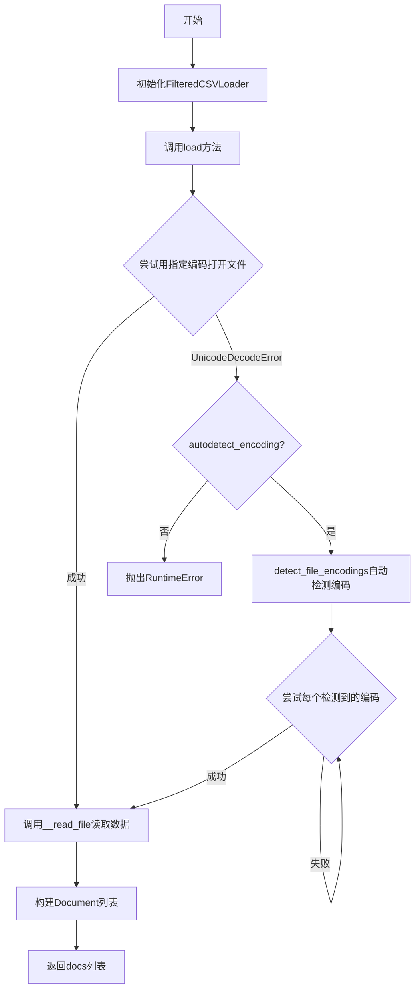
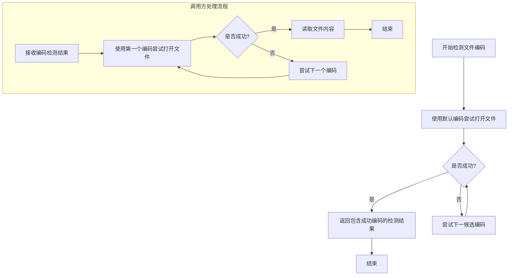
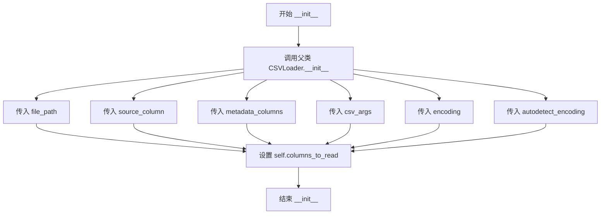
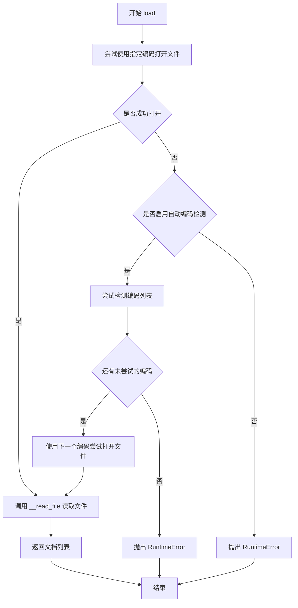
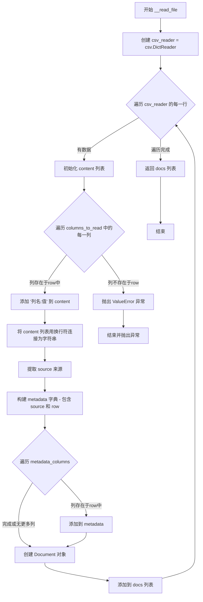

# `Langchain-Chatchat\libs\chatchat-server\chatchat\server\file_rag\document_loaders\FilteredCSVloader.py` 详细设计文档

FilteredCSVLoader是一个自定义的CSV文档加载器，继承自LangChain的CSVLoader，允许用户指定只读取CSV文件中的特定列，并将数据转换为LangChain的Document对象，支持自动编码检测和灵活的元数据配置。

## 整体流程



## 类结构

```
CSVLoader (LangChain基类)
└── FilteredCSVLoader (自定义实现)
```

## 全局变量及字段


### `FilteredCSVLoader.columns_to_read`
    
指定要读取的列名列表

类型：`List[str]`
    


### `FilteredCSVLoader.file_path`
    
CSV文件路径（继承自父类）

类型：`str`
    


### `FilteredCSVLoader.source_column`
    
源列名称（继承自父类）

类型：`Optional[str]`
    


### `FilteredCSVLoader.metadata_columns`
    
元数据列列表（继承自父类）

类型：`List[str]`
    


### `FilteredCSVLoader.csv_args`
    
CSV读取参数（继承自父类）

类型：`Optional[Dict]`
    


### `FilteredCSVLoader.encoding`
    
文件编码（继承自父类）

类型：`Optional[str]`
    


### `FilteredCSVLoader.autodetect_encoding`
    
是否自动检测编码（继承自父类）

类型：`bool`
    
    

## 全局函数及方法


### `detect_file_encodings`

自动检测文件编码的辅助函数，来自 `langchain_community.document_loaders.helpers` 模块。该函数尝试使用多种常见编码格式打开指定文件，返回一个可迭代的编码检测结果列表，每个结果包含编码信息，供调用方逐个尝试直到成功打开文件。

参数：

- `file_path`：`str`，要检测编码的文件路径

返回值：`Iterator[EncodingDetector]`，返回编码检测结果的可迭代对象，每个元素包含 `.encoding` 属性表示具体的编码格式（如 utf-8、gbk 等）

#### 流程图



#### 带注释源码

```python
# detect_file_encodings 是 langchain_community.document_loaders.helpers 模块中的函数
# 以下是其在 FilteredCSVLoader 中的调用方式及上下文

def load(self) -> List[Document]:
    """加载数据到文档对象"""
    docs = []
    try:
        # 首选尝试使用指定的编码打开文件
        with open(self.file_path, newline="", encoding=self.encoding) as csvfile:
            docs = self.__read_file(csvfile)
    except UnicodeDecodeError as e:
        # 如果指定编码失败，且启用了自动检测编码
        if self.autodetect_encoding:
            # 调用 detect_file_encodings 获取候选编码列表
            # 返回值是一个迭代器，包含多个编码检测结果
            # 每个结果对象有 .encoding 属性存储具体编码名
            detected_encodings = detect_file_encodings(self.file_path)
            
            # 遍历候选编码，逐个尝试打开文件
            for encoding in detected_encodings:
                try:
                    with open(
                        self.file_path, newline="", encoding=encoding.encoding
                    ) as csvfile:
                        docs = self.__read_file(csvfile)
                        break  # 成功打开后跳出循环
                except UnicodeDecodeError:
                    # 当前编码失败，继续尝试下一个
                    continue
        else:
            # 未启用自动检测，直接抛出异常
            raise RuntimeError(f"Error loading {self.file_path}") from e
    except Exception as e:
        raise RuntimeError(f"Error loading {self.file_path}") from e

    return docs
```


### `FilteredCSVLoader.__init__`

构造函数，用于初始化指定列的CSV文档加载器，继承自langchain_community的CSVLoader，并新增了columns_to_read属性以支持只加载指定的列。

参数：

- `file_path`：`str`，要加载的CSV文件的路径
- `columns_to_read`：`List[str]`，要读取的列名列表
- `source_column`：`Optional[str] = None`，用作文档源的列名（可选）
- `metadata_columns`：`List[str] = []`，要包含在元数据中的列名列表（可选）
- `csv_args`：`Optional[Dict] = None`，传递给csv.DictReader的额外参数（可选）
- `encoding`：`Optional[str] = None`，文件编码格式（可选）
- `autodetect_encoding`：`bool = False`，是否自动检测文件编码（可选）

返回值：`None`，构造函数无返回值

#### 流程图



#### 带注释源码

```python
def __init__(
    self,
    file_path: str,
    columns_to_read: List[str],
    source_column: Optional[str] = None,
    metadata_columns: List[str] = [],
    csv_args: Optional[Dict] = None,
    encoding: Optional[str] = None,
    autodetect_encoding: bool = False,
):
    """
    初始化 FilteredCSVLoader 实例
    
    参数:
        file_path: CSV文件路径
        columns_to_read: 需要读取的列名列表
        source_column: 用作文档源的列名（可选）
        metadata_columns: 需要放入元数据的列名列表（可选）
        csv_args: 传递给csv.DictReader的额外参数（可选）
        encoding: 文件编码格式（可选）
        autodetect_encoding: 是否自动检测文件编码（可选）
    """
    # 调用父类CSVLoader的构造函数，初始化基础加载功能
    super().__init__(
        file_path=file_path,
        source_column=source_column,
        metadata_columns=metadata_columns,
        csv_args=csv_args,
        encoding=encoding,
        autodetect_encoding=autodetect_encoding,
    )
    # 设置实例属性，指定需要读取的列
    self.columns_to_read = columns_to_read
```


### `FilteredCSVLoader.load`

该方法是 FilteredCSVLoader 类的主加载方法，用于打开 CSV 文件并根据指定列生成 Document 对象列表，支持自动编码检测和多种错误处理机制。

参数：

- `self`：隐式参数，FilterCSVLoader 实例本身

返回值：`List[Document]`，返回加载后的文档列表，每个文档包含指定列的内容和元数据

#### 流程图



#### 带注释源码

```python
def load(self) -> List[Document]:
    """Load data into document objects."""
    
    # 初始化文档列表
    docs = []
    try:
        # 使用指定的编码打开 CSV 文件（newline="" 防止 CSV 格式化问题）
        with open(self.file_path, newline="", encoding=self.encoding) as csvfile:
            # 调用私有方法读取文件内容并转换为 Document 列表
            docs = self.__read_file(csvfile)
    except UnicodeDecodeError as e:
        # 如果遇到编码错误且启用了自动编码检测
        if self.autodetect_encoding:
            # 尝试检测文件可能的编码列表
            detected_encodings = detect_file_encodings(self.file_path)
            # 遍历检测到的编码并尝试打开文件
            for encoding in detected_encodings:
                try:
                    with open(
                        self.file_path, newline="", encoding=encoding.encoding
                    ) as csvfile:
                        docs = self.__read_file(csvfile)
                        # 成功读取后跳出循环
                        break
                except UnicodeDecodeError:
                    # 当前编码失败，继续尝试下一个
                    continue
        else:
            # 未启用自动检测，直接抛出运行时错误
            raise RuntimeError(f"Error loading {self.file_path}") from e
    except Exception as e:
        # 捕获其他所有异常并重新抛出运行时错误
        raise RuntimeError(f"Error loading {self.file_path}") from e

    # 返回生成的文档列表
    return docs
```


### `FilteredCSVLoader.__read_file`

私有方法，实际读取CSV文件内容，根据指定的列名列表提取数据，并转换为Document对象列表返回。

参数：

- `csvfile`：`TextIOWrapper`，CSV文件对象，用于逐行读取CSV数据

返回值：`List[Document]`，[Document](https://api.python.langchain.com/en/latest/schema/schema.html#document)对象列表，每个Document包含页面内容（指定列的数据）和元数据（来源、行号及其他元数据列）

#### 流程图



#### 带注释源码

```python
def __read_file(self, csvfile: TextIOWrapper) -> List[Document]:
    """
    读取CSV文件并返回Document列表
    
    参数:
        csvfile: TextIOWrapper - 已打开的CSV文件对象
        
    返回:
        List[Document] - 包含CSV数据的Document对象列表
    """
    docs = []
    # 使用 DictReader 逐行读取CSV，保留列名作为键
    csv_reader = csv.DictReader(csvfile, **self.csv_args)  # type: ignore
    # 遍历CSV的每一行
    for i, row in enumerate(csv_reader):
        content = []
        # 遍历需要读取的指定列
        for col in self.columns_to_read:
            if col in row:
                # 将列名和值格式化为 "列名:值" 字符串并添加到内容列表
                content.append(f"{col}:{str(row[col])}")
            else:
                # 如果指定的列不存在于CSV中，抛出ValueError异常
                raise ValueError(
                    f"Column '{self.columns_to_read[0]}' not found in CSV file."
                )
        # 用换行符连接所有内容行，形成完整的页面内容
        content = "\n".join(content)
        
        # 提取文档来源：如果指定了source_column则从该列获取，否则使用文件路径
        source = (
            row.get(self.source_column, None)
            if self.source_column is not None
            else self.file_path
        )
        # 初始化元数据，包含来源和行号
        metadata = {"source": source, "row": i}

        # 遍历元数据列，将指定的列添加到元数据字典中
        for col in self.metadata_columns:
            if col in row:
                metadata[col] = row[col]

        # 创建Document对象，包含页面内容和元数据
        doc = Document(page_content=content, metadata=metadata)
        docs.append(doc)

    return docs
```

## 关键组件


### FilteredCSVLoader

FilteredCSVLoader 是一个用于加载 CSV 文件的文档加载器，继承自 CSVLoader，其核心功能是仅读取用户指定的列，并将每行数据转换为 Document 对象，适用于需要从大型 CSV 文件中提取特定字段的场景。

### columns_to_read

指定要读取的列名列表，用于过滤 CSV 文件中的列，只有该列表中指定的列会被读取并包含在生成的 Document 的 page_content 中。

### source_column

可选的源列名，用于指定 CSV 中哪一列的值作为文档的来源标识（source），如果未指定，则默认使用文件路径作为 source。

### metadata_columns

元数据列列表，这些列的值会被包含在生成的 Document 的 metadata 字典中，但不会出现在 page_content 里。

### csv_args

传递给 csv.DictReader 的额外参数字典，用于自定义 CSV 解析行为（如分隔符、引号符等）。

### encoding

文件编码方式，如果为 None，则使用系统默认编码。

### autodetect_encoding

布尔标志，控制是否在遇到编码错误时自动检测文件编码。

### load 方法

加载方法，首先尝试使用指定编码打开文件，如果遇到 UnicodeDecodeError 且 autodetect_encoding 为 True，则自动检测编码并重试，最后返回 Document 列表。包含编码自动检测的冗余设计。

### __read_file 方法

核心读取方法，接收文件对象，遍历 CSV 行，对每行提取指定列的内容，将列名和值拼接为字符串（如 "column_name:value"），构建 Document 对象，包含异常处理逻辑（列不存在时抛出 ValueError）。


## 问题及建议


### 已知问题

-   **错误消息不准确**：在`__read_file`方法的第52行，当列不存在时，错误消息始终显示`self.columns_to_read[0]`，而不是实际找不到的列名，可能误导用户排查问题。
-   **类型注解不完整**：第49行使用`# type: ignore`跳过类型检查，掩盖了潜在的静态类型问题。
-   **缺少输入验证**：构造函数中没有验证`columns_to_read`参数（如为空列表、包含不存在列名等情况的预检查）。
-   **异常处理粒度过粗**：第39行使用`except Exception as e`捕获所有异常并统一抛出，隐藏了具体异常类型信息，不利于问题定位。
-   **metadata_columns与columns_to_read可能重复**：未检查两者是否存在重叠，可能导致数据冗余存储。

### 优化建议

-   **修正错误消息**：将第52行的错误消息改为显示实际检查的列名`col`，而非`self.columns_to_read[0]`。
-   **添加输入验证**：在`__init__`或`load`方法中添加对`columns_to_read`为空或无效的校验，提前失败而非运行时错误。
-   **细化异常处理**：区分不同异常类型（如FileNotFoundError、PermissionError等），提供更有针对性的错误信息。
-   **移除类型忽略**：补全第49行的类型注解，确保与`csv.DictReader`的返回类型正确对应。
-   **检查重复列**：在构造函数或`load`开始时，检查`columns_to_read`和`metadata_columns`是否有交集，必要时给出警告或去重。

## 其它


### 设计目标与约束

**设计目标**：提供一种灵活的方式来加载CSV文件，允许用户仅读取指定的列，同时保持与LangChain Document加载框架的兼容性。

**约束条件**：
- 依赖LangChain的CSVLoader基类实现
- 假设CSV文件包含表头行
- 当前实现仅支持读取操作，不支持写入
- 仅支持UTF-8编码（通过autodetect_encoding可自动检测其他编码）

### 错误处理与异常设计

**异常类型**：
- `UnicodeDecodeError`：当文件编码与指定编码不匹配时触发，如果启用autodetect_encoding则自动尝试其他编码
- `ValueError`：当指定的columns_to_read中的列名在CSV文件中不存在时抛出
- `RuntimeError`：当文件无法打开或读取时抛出，作为最终兜底异常

**错误传播**：所有异常都会附加原始异常作为上下文（使用`from e`语法），便于调试追踪问题根源。

### 数据流与状态机

**数据流**：
1. 用户调用load()方法
2. 尝试使用指定编码打开文件
3. 如果遇到编码错误且启用自动检测，遍历检测到的编码列表尝试打开
4. 调用__read_file()进行实际读取
5. 使用csv.DictReader逐行读取
6. 对每行过滤columns_to_read中的列
7. 构建Document对象（page_content和metadata）
8. 返回Document列表

**状态**：初始状态 → 加载中 → 完成/异常

### 外部依赖与接口契约

**外部依赖**：
- `langchain.docstore.document.Document`：文档对象定义
- `langchain_community.document_loaders.CSVLoader`：父类，提供基础CSV加载功能
- `langchain_community.document_loaders.helpers.detect_file_encodings`：编码检测工具函数

**接口契约**：
- 继承CSVLoader的所有公共接口
- load()方法返回List[Document]
- columns_to_read为必需参数，指定要加载的列

### 性能考虑

- 使用流式读取（open with newline=""）处理大文件
- 内存使用与CSV行数成正比
- 编码检测会额外增加I/O开销，建议在确定编码时设置encoding参数以提升性能
- 每次调用load()都会重新打开和读取文件，无内置缓存机制

### 安全性考虑

- 直接使用用户提供的file_path打开文件，存在路径遍历风险（建议在使用前进行路径验证）
- 未对CSV内容进行消毒处理，page_content可能包含恶意内容
- metadata中的row字段可能泄露文件内部结构信息

### 兼容性考虑

- 与LangChain 0.1.0+版本兼容
- Python 3.8+支持
- 依赖的第三方库版本：无严格版本限制，建议使用最新稳定版

### 使用示例

```python
# 示例1：基本用法
loader = FilteredCSVLoader(
    file_path="data.csv",
    columns_to_read=["name", "email", "phone"]
)
docs = loader.load()

# 示例2：指定源列和元数据列
loader = FilteredCSVLoader(
    file_path="data.csv",
    columns_to_read=["name", "email"],
    source_column="id",
    metadata_columns=["created_at", "status"]
)
docs = loader.load()

# 示例3：启用自动编码检测
loader = FilteredCSVLoader(
    file_path="data.csv",
    columns_to_read=["name", "email"],
    autodetect_encoding=True
)
docs = loader.load()
```

### 配置参数详细说明

| 参数 | 类型 | 必填 | 默认值 | 说明 |
|------|------|------|--------|------|
| file_path | str | 是 | - | CSV文件路径 |
| columns_to_read | List[str] | 是 | - | 要读取的列名列表 |
| source_column | Optional[str] | 否 | None | 用作文档源的列名 |
| metadata_columns | List[str] | 否 | [] | 要包含在metadata中的额外列 |
| csv_args | Optional[Dict] | 否 | None | 传递给csv.DictReader的额外参数 |
| encoding | Optional[str] | 否 | None | 文件编码，为None时使用系统默认 |
| autodetect_encoding | bool | 否 | False | 是否自动检测文件编码 |

### 扩展性考虑

- 可通过继承FilterCSVLoader添加自定义的列过滤逻辑
- 可覆盖__read_file()方法实现自定义的文档转换逻辑
- 支持通过csv_args参数传递自定义的CSV解析选项（如自定义分隔符、引号处理等）
- 可添加缓存层以支持重复加载同一文件

### 测试策略建议

- 单元测试：测试正常加载、列过滤、编码处理
- 集成测试：与LangChain生态系统的集成
- 边界测试：大文件、空文件、特殊字符、编码边界情况
- 异常测试：文件不存在、列名错误、权限问题

### 已知限制

- 不支持CSV写入操作
- 假设CSV文件有表头行
- 未实现行级缓存，重复加载会有性能开销
- columns_to_read中的列必须全部存在于CSV中，否则抛出异常
- 不支持多级嵌套的metadata结构

    