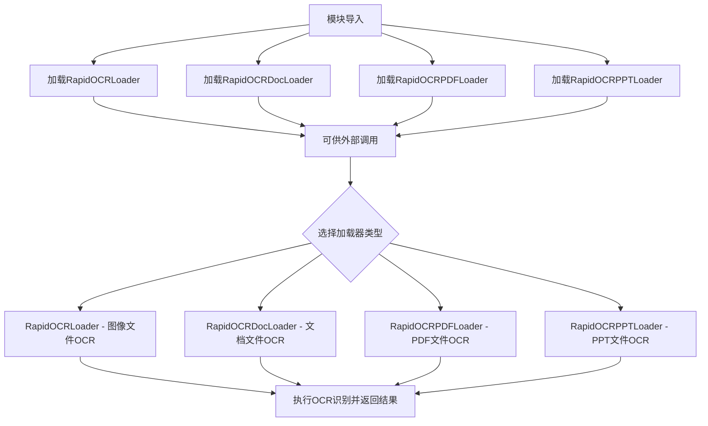

# `Langchain-Chatchat\libs\chatchat-server\chatchat\server\file_rag\document_loaders\__init__.py` 详细设计文档

这是一个文档加载器模块的入口文件，通过导入四个RapidOCR加载器类（图像、文档、PDF、PPT），为项目提供统一的OCR文档处理接口。

## 整体流程



## 类结构

```
Package: rapidocr_loading (文档加载器包)
├── RapidOCRLoader (图像加载器)
├── RapidOCRDocLoader (文档加载器)
├── RapidOCRPDFLoader (PDF加载器)
└── RapidOCRPPTLoader (PPT加载器)
```

## 全局变量及字段


### `RapidOCRDocLoader`
    
用于加载DOC/DOCX等文档格式的OCR识别加载器

类型：`class`
    


### `RapidOCRLoader`
    
用于加载图片格式的OCR识别加载器，支持JPG、PNG等常见图片格式

类型：`class`
    


### `RapidOCRPDFLoader`
    
用于加载PDF文档的OCR识别加载器，支持PDF文件内容的文本提取

类型：`class`
    


### `RapidOCRPPTLoader`
    
用于加载PPT/PPTX演示文稿的OCR识别加载器，支持幻灯片内容识别

类型：`class`
    


    

## 全局函数及方法


## 关键组件


### RapidOCRDocLoader

文档加载器组件，负责加载各类文档文件并进行OCR识别处理。

### RapidOCRLoader

图像加载器组件，负责加载图像文件并进行OCR识别处理。

### RapidOCRPDFLoader

PDF文档加载器组件，专门用于加载PDF格式文档并进行OCR识别处理。

### RapidOCRPPTLoader

PPT演示文稿加载器组件，专门用于加载PowerPoint格式文件并进行OCR识别处理。


## 问题及建议


### 已知问题

-   缺少 `__all__` 变量定义，未明确公开的 API 接口，可能导致外部调用时导入不必要的内部实现
-   缺少模块级文档字符串（docstring），无法快速了解该包的整体用途
-   导入的类名命名不一致（如 `RapidOCRLoader` 与 `RapidOCRDocLoader`），可能造成使用时的困惑
-   未定义包版本信息，不利于依赖管理和版本追踪
-   缺少类型注解（type hints），降低代码可维护性和 IDE 智能提示支持
-   未添加任何错误处理机制，若子模块导入失败，整个包将无法使用

### 优化建议

-   添加 `__all__ = ['RapidOCRDocLoader', 'RapidOCRLoader', 'RapidOCRPDFLoader', 'RapidOCRPPTLoader']` 明确公开接口
-   在文件开头添加模块级文档字符串，说明该包用于 OCR 文档加载功能
-   考虑统一类命名规范，或在文档中说明各加载器的适用场景
-   添加 `__version__` 变量以支持版本查询
-   为导入语句添加类型注解，提升代码健壮性
-   考虑使用 try-except 包装导入语句，提供更友好的错误信息


## 其它


### 设计目标与约束

本模块作为RapidOCR的统一导出接口，旨在为用户提供一致的OCR文档加载API。设计目标包括：1）统一不同文档格式的加载接口；2）保持各加载器的独立性以便于维护和扩展；3）遵循Python包的最佳实践，通过__init__.py集中导出核心类。技术约束方面，本模块依赖Python 3.7+环境，各子模块分别处理不同的文档格式（Word、图片、PDF、PPT），需要确保各加载器依赖的底层OCR库（如RapidOCR）可用。

### 错误处理与异常设计

由于本模块仅包含导入语句，错误处理逻辑下沉到各个子模块中。预期的主要异常包括：ImportError（依赖的OCR库未安装）、FileNotFoundError（指定的文档路径不存在）、以及各加载器内部的格式解析异常。建议在调用方进行try-except包装，捕获通用Exception或具体子类。__init__.py层面可在导入时添加可选依赖的版本检查，向用户提示潜在的兼容性问题。

### 数据流与状态机

数据流从用户调用具体的Loader类开始：用户创建Loader实例并传入文档路径，Loader内部调用底层OCR引擎进行预处理和文字识别，最终返回结构化结果（通常为文本字符串或包含坐标信息的字典列表）。本模块不维护持久状态，各Loader实例为无状态对象，支持重复调用。状态转换简单：初始状态（对象创建）→ 处理中（load方法调用）→ 完成（返回结果）或异常（抛出错误）。

### 外部依赖与接口契约

核心依赖为RapidOCR系列库（包括rapidocr_onnxruntime或其他后端实现）。各Loader类的接口契约如下：构造方法接受文档路径（str）或文件对象；load()或__call__()方法执行OCR并返回结果。依赖版本要求：Python 3.7+，具体OCR库版本需参考各子模块的requirements.txt。建议使用poetry或pipenv进行版本锁定，确保各环境的一致性。

### 模块组织与扩展性

当前模块采用按文档类型分离的设计模式（一个类负责一种格式），这种设计符合开闭原则，便于添加新格式支持。扩展新的Loader只需：1）创建新的loader类文件；2）在__init__.py中导入；3）在对应子模块中实现标准化接口。建议未来考虑添加抽象基类（ABC）定义通用接口规范，以及提供统一的工厂方法（Factory）根据文件扩展名自动选择合适的Loader。

### 版本兼容性说明

本模块版本号应与RapidOCR主版本保持一致。当前代码使用相对导入（from .module import Class），确保在包内正确导入。需注意Python 2与Python 3的兼容性已不在考虑范围内（Python 2已于2020年停止支持）。如需支持更旧的Python版本，需将相对导入改为绝对导入或使用six库兼容层。

    