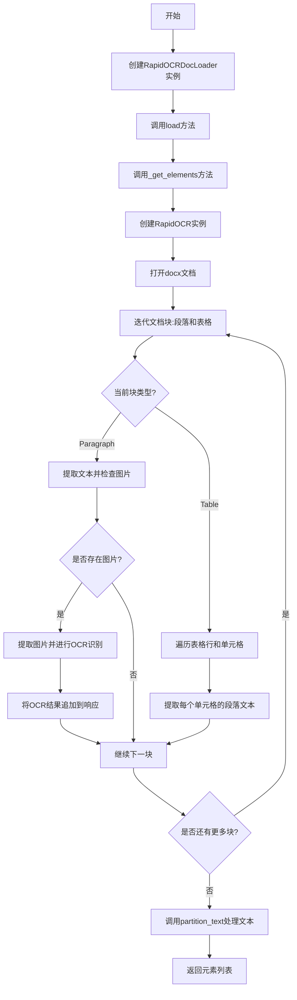
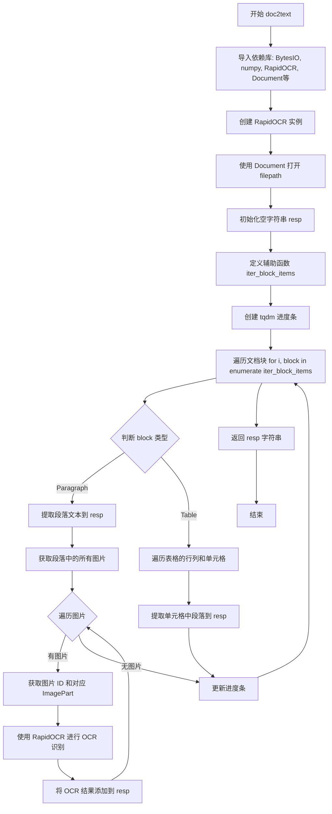
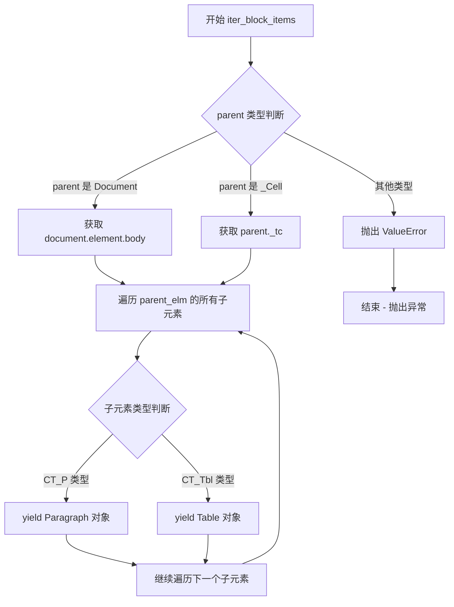
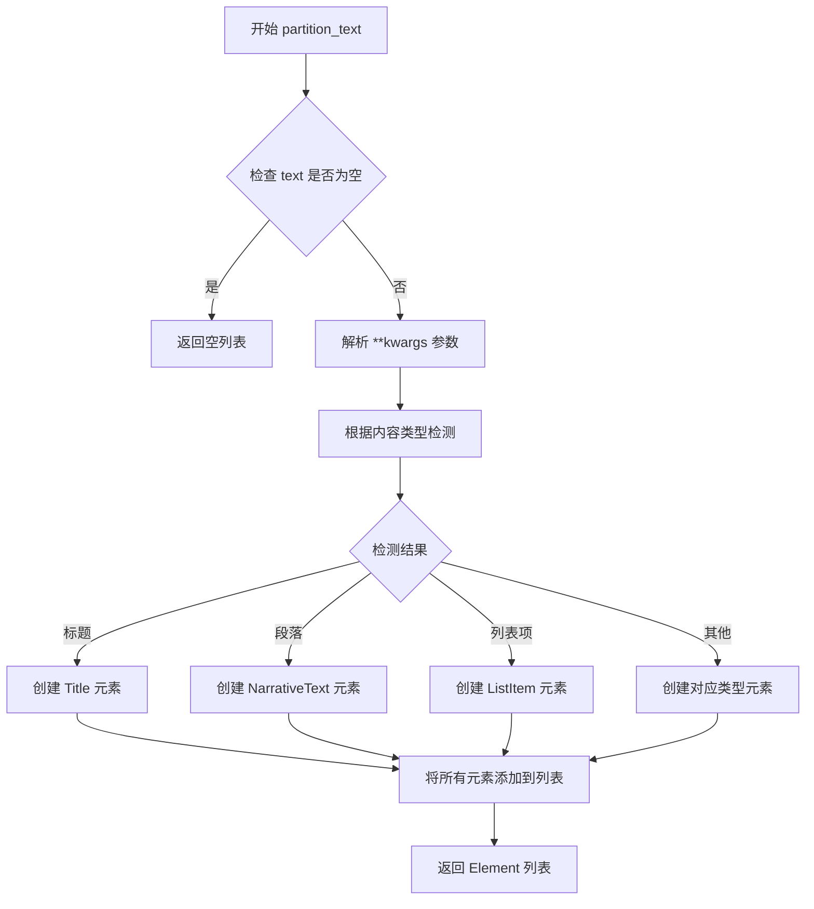
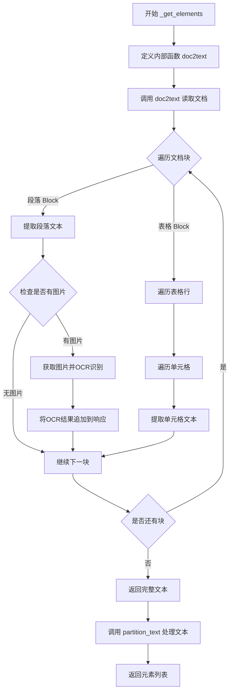
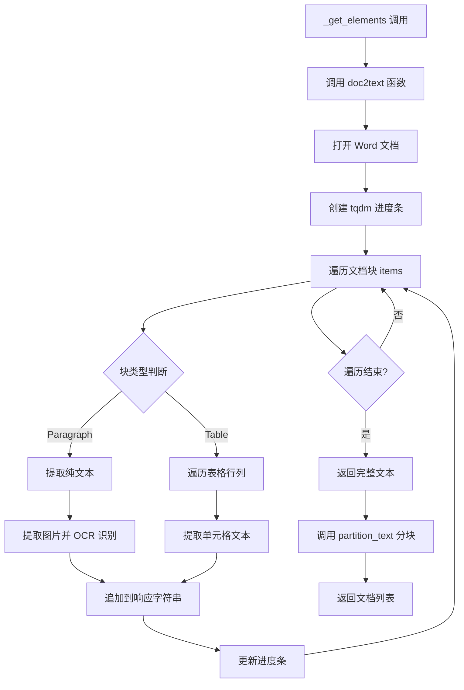

# `Langchain-Chatchat\libs\chatchat-server\chatchat\server\file_rag\document_loaders\mydocloader.py` 详细设计文档

这是一个基于LangChain的文档加载器，继承自UnstructuredFileLoader，用于从Word文档(.docx)中提取文本内容。该加载器的核心功能是结合RapidOCR光学字符识别技术，自动识别文档中的图片文字，同时处理段落和表格文本，实现对包含扫描图片的文档进行全文提取。

## 整体流程



## 类结构

```
UnstructuredFileLoader (LangChain基类)
└── RapidOCRDocLoader (文档加载器实现类)
```

## 全局变量及字段


### `RapidOCRDocLoader.file_path`
    
继承自父类,文档路径

类型：`str`
    


### `RapidOCRDocLoader.unstructured_kwargs`
    
继承自父类,用于传递给unstructured库的参数

类型：`dict`
    


### `RapidOCRDocLoader._get_elements`
    
重写父类方法,获取文档中的所有元素并返回List

类型：`function`
    
    

## 全局函数及方法


### `doc2text`

该内部函数是 `RapidOCRDocLoader` 类的核心文本提取方法，负责解析 DOCX 文件并遍历文档中的所有段落和表格元素，对段落中的图片进行 OCR 识别，最终将所有文本内容整合为单一字符串返回。

参数：

- `filepath`：`str`，DOCX 文件的路径，用于打开并解析文档

返回值：`str`，包含所有段落文本、表格文本以及图片 OCR 识别结果的字符串

#### 流程图



#### 带注释源码

```python
def doc2text(filepath):
    """
    内部函数: 解析DOCX文件并提取文本和图片OCR结果
    
    参数:
        filepath: DOCX文件的路径
        
    返回:
        str: 包含所有文本内容的字符串
    """
    from io import BytesIO  # 用于处理二进制图像数据

    import numpy as np  # 用于图像数组转换
    from docx import Document, ImagePart  # 用于解析DOCX文档和获取图片
    from docx.oxml.table import CT_Tbl  # DOCX表格元素
    from docx.oxml.text.paragraph import CT_P  # DOCX段落元素
    from docx.table import Table, _Cell  # 表格和单元格对象
    from docx.text.paragraph import Paragraph  # 段落对象
    from PIL import Image  # 图像处理
    from rapidocr_onnxruntime import RapidOCR  # OCR识别库

    # 创建RapidOCR识别器实例
    ocr = RapidOCR()
    # 打开指定路径的DOCX文档
    doc = Document(filepath)
    # 初始化结果字符串
    resp = ""

    def iter_block_items(parent):
        """
        辅助函数: 遍历文档中的所有块元素（段落和表格）
        
        参数:
            parent: Document对象或_Cell对象
            
        生成:
            Paragraph或Table对象
        """
        from docx.document import Document

        # 根据parent类型获取对应的XML元素
        if isinstance(parent, Document):
            parent_elm = parent.element.body
        elif isinstance(parent, _Cell):
            parent_elm = parent._tc
        else:
            raise ValueError("RapidOCRDocLoader parse fail")

        # 遍历所有子元素
        for child in parent_elm.iterchildren():
            if isinstance(child, CT_P):
                yield Paragraph(child, parent)
            elif isinstance(child, CT_Tbl):
                yield Table(child, parent)

    # 创建进度条,总计段落数+表格数
    b_unit = tqdm.tqdm(
        total=len(doc.paragraphs) + len(doc.tables),
        desc="RapidOCRDocLoader block index: 0",
    )
    
    # 遍历文档中的每个块
    for i, block in enumerate(iter_block_items(doc)):
        # 更新进度条描述
        b_unit.set_description("RapidOCRDocLoader  block index: {}".format(i))
        b_unit.refresh()
        
        # 判断当前块是段落还是表格
        if isinstance(block, Paragraph):
            # 提取段落文本并添加到结果
            resp += block.text.strip() + "\n"
            
            # 获取段落中的所有图片元素
            images = block._element.xpath(".//pic:pic")
            
            # 遍历段落中的每个图片
            for image in images:
                # 获取图片嵌入ID
                for img_id in image.xpath(".//a:blip/@r:embed"):
                    # 根据ID获取对应的图片部件
                    part = doc.part.related_parts[img_id]
                    
                    # 判断是否为图片类型
                    if isinstance(part, ImagePart):
                        # 从二进制数据打开图片
                        image = Image.open(BytesIO(part._blob))
                        # 使用RapidOCR进行OCR识别
                        result, _ = ocr(np.array(image))
                        
                        # 如果识别有结果
                        if result:
                            # 提取识别文本(取第二个元素为识别结果)
                            ocr_result = [line[1] for line in result]
                            # 将OCR结果追加到响应字符串
                            resp += "\n".join(ocr_result)
                            
        elif isinstance(block, Table):
            # 遍历表格的每一行
            for row in block.rows:
                # 遍历行中的每个单元格
                for cell in row.cells:
                    # 遍历单元格中的每个段落
                    for paragraph in cell.paragraphs:
                        # 提取单元格段落文本
                        resp += paragraph.text.strip() + "\n"
                        
        # 更新进度条
        b_unit.update(1)
        
    # 返回完整的文本结果
    return resp
```


### `iter_block_items(parent)`

这是一个内部函数，用于遍历 docx 文档中的段落和表格块，返回一个生成器，逐个 yield 文档中的段落(Paragraph)或表格(Table)元素，以便后续对每个块进行 OCR 识别和文本提取。

参数：

- `parent`：`Document | _Cell`，要遍历的父元素，可以是文档对象或表格单元格对象

返回值：`Generator[Paragraph | Table, None, None]`，生成器，逐个返回段落或表格对象

#### 流程图



#### 带注释源码

```python
def iter_block_items(parent):
    """
    遍历 docx 文档中的段落和表格块
    
    参数:
        parent: Document 对象或 _Cell 对象，表示要遍历的父元素
    
    返回:
        生成器，逐个 yield Paragraph 或 Table 对象
    """
    from docx.document import Document

    # 判断 parent 类型，获取对应的 XML 元素
    if isinstance(parent, Document):
        # 如果是 Document 对象，获取 body 元素
        parent_elm = parent.element.body
    elif isinstance(parent, _Cell):
        # 如果是单元格对象，获取表格单元格元素
        parent_elm = parent._tc
    else:
        # 不支持的类型，抛出异常
        raise ValueError("RapidOCRDocLoader parse fail")

    # 遍历父元素的所有子元素
    for child in parent_elm.iterchildren():
        if isinstance(child, CT_P):
            # 如果是段落元素，创建并 yield Paragraph 对象
            yield Paragraph(child, parent)
        elif isinstance(child, CT_Tbl):
            # 如果是表格元素，创建并 yield Table 对象
            yield Table(child, parent)
```


### `partition_text(text, **kwargs)`

这是 `unstructured` 库中的文本分区函数，用于将文本内容分割成结构化的文档片段（Element）。在 `RapidOCRDocLoader` 中，该函数接收经过 OCR 处理的文本内容，并利用 `unstructured` 的智能分区能力识别标题、段落、列表等不同内容块，将其转换为统一的 Element 列表返回，便于后续的文档处理和向量化。

#### 参数

- `text`：`str`，需要分割的原始文本内容，即经过 RapidOCR OCR 识别后的完整文档文本字符串
- `**kwargs`：`Any`，可选的分区参数，透传给 `unstructured` 的分区函数，用于控制分区行为（如语言设置、章节检测策略等）

#### 返回值

- `List[Element]`：返回 Element 对象列表，每个 Element 代表文档中的一个结构化片段（如标题、段落、页脚等），类型包括 `Title`、`NarrativeText`、`ListItem` 等

#### 流程图



#### 带注释源码

```python
# 导入 partition_text 函数
# 位置: unstructured/partition/text.py
from unstructured.partition.text import partition_text

# 使用示例（在 RapidOCRDocLoader 中）
text = doc2text(self.file_path)  # 获取 OCR 后的完整文本
# 调用 partition_text 进行文本分区
elements = partition_text(text=text, **self.unstructured_kwargs)

# partition_text 函数核心逻辑（简化版）
def partition_text(text: str, **kwargs) -> List[Element]:
    """
    将文本分割成结构化的 Element 列表
    
    参数:
        text: 输入的原始文本字符串
        **kwargs: 可选参数，如 language='chinese' 等
    
    返回:
        Element 列表，每个元素代表一个文档片段
    """
    # 1. 文本预处理：清理空白字符
    text = text.strip()
    
    # 2. 检测文本编码和语言
    language = kwargs.get('language', 'auto')
    
    # 3. 文本分区策略
    # - 基于规则的分区（标题识别、段落分隔）
    # - 使用正则表达式匹配常见格式
    elements = []
    
    # 4. 逐行/逐段分析
    lines = text.split('\n')
    for line in lines:
        if is_title(line):  # 标题检测逻辑
            elements.append(Title(text=line))
        elif is_list_item(line):  # 列表项检测
            elements.append(ListItem(text=line))
        else:  # 普通段落
            elements.append(NarrativeText(text=line))
    
    # 5. 后处理：合并相邻的同类元素
    elements = merge_adjacent_elements(elements)
    
    return elements
```


### `RapidOCRDocLoader._get_elements`

重写父类方法，获取Word文档中的所有元素，通过RapidOCR对文档内的图片进行OCR识别提取文本，并使用unstructured库对文本进行进一步处理后返回元素列表。

参数：

- `self`：`RapidOCRDocLoader`，当前实例，调用该方法的对象本身

返回值：`List`，返回经过unstructured库处理后的文档元素列表

#### 流程图



#### 带注释源码

```python
def _get_elements(self) -> List:
    """
    重写父类方法，获取文档中的所有元素
    通过RapidOCR对文档内的图片进行OCR识别，并使用unstructured库处理文本
    """
    
    def doc2text(filepath):
        """
        内部函数：将Word文档转换为文本
        支持提取段落、表格文本，并对图片进行OCR识别
        """
        from io import BytesIO

        import numpy as np
        from docx import Document, ImagePart
        from docx.oxml.table import CT_Tbl
        from docx.oxml.text.paragraph import CT_P
        from docx.table import Table, _Cell
        from docx.text.paragraph import Paragraph
        from PIL import Image
        from rapidocr_onnxruntime import RapidOCR

        # 初始化OCR引擎
        ocr = RapidOCR()
        # 打开文档
        doc = Document(filepath)
        # 存储最终结果
        resp = ""

        def iter_block_items(parent):
            """
            遍历文档中的段落和表格块
            支持文档主体和表格单元格内的元素
            """
            from docx.document import Document

            if isinstance(parent, Document):
                parent_elm = parent.element.body
            elif isinstance(parent, _Cell):
                parent_elm = parent._tc
            else:
                raise ValueError("RapidOCRDocLoader parse fail")

            for child in parent_elm.iterchildren():
                if isinstance(child, CT_P):
                    yield Paragraph(child, parent)
                elif isinstance(child, CT_Tbl):
                    yield Table(child, parent)

        # 创建进度条，追踪文档块处理进度
        b_unit = tqdm.tqdm(
            total=len(doc.paragraphs) + len(doc.tables),
            desc="RapidOCRDocLoader block index: 0",
        )
        
        # 遍历文档中的所有块（段落和表格）
        for i, block in enumerate(iter_block_items(doc)):
            b_unit.set_description("RapidOCRDocLoader  block index: {}".format(i))
            b_unit.refresh()
            
            if isinstance(block, Paragraph):
                # 处理段落：提取文本
                resp += block.text.strip() + "\n"
                # 获取段落中的所有图片
                images = block._element.xpath(".//pic:pic")
                for image in images:
                    # 获取图片嵌入ID
                    for img_id in image.xpath(".//a:blip/@r:embed"):
                        # 获取图片对象
                        part = doc.part.related_parts[img_id]
                        if isinstance(part, ImagePart):
                            # 使用PIL打开图片并转换为numpy数组
                            image = Image.open(BytesIO(part._blob))
                            # 调用RapidOCR进行OCR识别
                            result, _ = ocr(np.array(image))
                            if result:
                                # 提取OCR识别的文本
                                ocr_result = [line[1] for line in result]
                                resp += "\n".join(ocr_result)
            elif isinstance(block, Table):
                # 处理表格：遍历所有单元格
                for row in block.rows:
                    for cell in row.cells:
                        for paragraph in cell.paragraphs:
                            resp += paragraph.text.strip() + "\n"
            # 更新进度条
            b_unit.update(1)
        return resp

    # 调用内部函数获取文档文本
    text = doc2text(self.file_path)
    # 使用unstructured库对文本进行进一步处理
    from unstructured.partition.text import partition_text

    return partition_text(text=text, **self.unstructured_kwargs)
```

#### 关键组件信息

| 组件名称 | 一句话描述 |
|---------|-----------|
| `RapidOCR` | RapidOCR引擎，用于对图片进行光学字符识别 |
| `Document` (python-docx) | 用于读取Word .docx格式文档 |
| `partition_text` | unstructured库函数，用于将文本分割为结构化元素 |
| `iter_block_items` | 内部函数，用于遍历文档中的段落和表格块 |
| `tqdm` | 进度条库，用于显示文档处理进度 |

#### 潜在的技术债务或优化空间

1. **错误处理不足**：缺少对文件不存在、文件格式错误、OCR识别失败等情况的异常处理
2. **性能优化**：OCR识别操作在主线程执行，大文档可能导致阻塞；可考虑异步处理或批量OCR
3. **依赖管理**：内部函数中多次import依赖，建议移至文件顶部或模块级别
4. **资源释放**：未显式关闭文档对象和OCR引擎，可能存在资源泄漏风险
5. **表格处理简化**：当前表格处理仅提取文本，未保留表格结构信息

#### 其它项目

**设计目标与约束**：
- 目标：从Word文档中提取文本和图片中的文字，支持OCR识别
- 约束：依赖python-docx、rapidocr_onnxruntime、unstructured等库

**错误处理与异常设计**：
- 当前仅有一个ValueError用于不支持的父元素类型
- 缺少文件读取异常、OCR失败异常等处理机制

**数据流与状态机**：
- 状态1：初始化 → 加载文档
- 状态2：遍历文档块 → 提取文本/OCR识别
- 状态3：文本后处理 → partition_text
- 状态4：返回元素列表

**外部依赖与接口契约**：
- 输入：Word文档路径（.docx）
- 输出：Element列表（List类型）
- 依赖库：python-docx, rapidocr_onnxruntime, unstructured, PIL, numpy, tqdm

## 关键组件


### 核心功能概述

该代码实现了一个基于RapidOCR的Word文档加载器（RapidOCRDocLoader），通过解析Word文档中的文本段落和表格，并利用OCR技术识别嵌入文档中的图片内容，最终将所有文本和OCR识别结果整合为结构化文档列表返回。

### 文件整体运行流程

1. **入口**：`if __name__ == "__main__"` 创建 RapidOCRDocLoader 实例并调用 `load()` 方法
2. **继承链**：调用继承自 `UnstructuredFileLoader` 的 `load()` 方法，该方法内部调用 `_get_elements()` 
3. **核心处理**：`_get_elements()` 方法调用 `doc2text()` 函数进行文档解析
4. **文档解析**：`doc2text()` 函数打开Word文档，遍历所有段落和表格块
5. **文本提取**：从段落中提取纯文本，从表格中遍历单元格提取文本
6. **图片OCR**：从段落中提取嵌入图片，使用RapidOCR进行文字识别
7. **文本整合**：将所有文本和OCR结果拼接为单个字符串
8. **最终分块**：调用 `unstructured.partition.text.partition_text` 对整合后的文本进行分块处理
9. **返回结果**：返回分块后的文档列表

### 类详细信息

#### 类名：RapidOCRDocLoader

**类继承**：
- 继承自 `UnstructuredFileLoader`（来自 `langchain_community.document_loaders.unstructured`）

**类字段**：
- `file_path` (str)：从父类继承的待加载文档路径
- `unstructured_kwargs` (dict)：从父类继承的传递给unstructured分区函数的额外参数

**类方法**：

##### 方法：_get_elements

- **参数**：无（仅使用 self）
- **返回值类型**：List
- **返回值描述**：返回经过unstructured处理后的文档元素列表
- **mermaid流程图**：

- **带注释源码**：
```python
def _get_elements(self) -> List:
    """
    重写父类方法，实现自定义文档解析逻辑
    """
    def doc2text(filepath):
        """
        内部函数：负责将Word文档转换为文本
        包括文本提取和图片OCR
        """
        from io import BytesIO

        import numpy as np
        from docx import Document, ImagePart
        from docx.oxml.table import CT_Tbl
        from docx.oxml.text.paragraph import CT_P
        from docx.table import Table, _Cell
        from docx.text.paragraph import Paragraph
        from PIL import Image
        from rapidocr_onnxruntime import RapidOCR

        # 初始化OCR引擎
        ocr = RapidOCR()
        # 打开Word文档
        doc = Document(filepath)
        resp = ""

        def iter_block_items(parent):
            """
            遍历文档中的块元素（段落和表格）
            支持Document和_Cell类型
            """
            from docx.document import Document

            if isinstance(parent, Document):
                parent_elm = parent.element.body
            elif isinstance(parent, _Cell):
                parent_elm = parent._tc
            else:
                raise ValueError("RapidOCRDocLoader parse fail")

            for child in parent_elm.iterchildren():
                if isinstance(child, CT_P):
                    yield Paragraph(child, parent)
                elif isinstance(child, CT_Tbl):
                    yield Table(child, parent)

        # 创建进度条，监控解析进度
        b_unit = tqdm.tqdm(
            total=len(doc.paragraphs) + len(doc.tables),
            desc="RapidOCRDocLoader block index: 0",
        )
        # 遍历所有块（段落和表格）
        for i, block in enumerate(iter_block_items(doc)):
            b_unit.set_description("RapidOCRDocLoader  block index: {}".format(i))
            b_unit.refresh()
            # 处理段落：提取文本和图片OCR
            if isinstance(block, Paragraph):
                resp += block.text.strip() + "\n"
                # 获取段落中的所有图片
                images = block._element.xpath(".//pic:pic")
                for image in images:
                    for img_id in image.xpath(".//a:blip/@r:embed"):
                        # 根据图片ID获取图片对象
                        part = doc.part.related_parts[img_id]
                        if isinstance(part, ImagePart):
                            # 使用PIL打开图片并转换为numpy数组
                            image = Image.open(BytesIO(part._blob))
                            result, _ = ocr(np.array(image))
                            if result:
                                # 提取OCR识别结果
                                ocr_result = [line[1] for line in result]
                                resp += "\n".join(ocr_result)
            # 处理表格：遍历所有单元格提取文本
            elif isinstance(block, Table):
                for row in block.rows:
                    for cell in row.cells:
                        for paragraph in cell.paragraphs:
                            resp += paragraph.text.strip() + "\n"
            b_unit.update(1)
        return resp

    # 调用内部函数解析文档
    text = doc2text(self.file_path)
    # 使用unstructured库对文本进行分块
    from unstructured.partition.text import partition_text

    return partition_text(text=text, **self.unstructured_kwargs)
```

### 关键组件信息

#### 组件1：RapidOCRDocLoader 类
文档加载器主类，继承自UnstructuredFileLoader，封装了Word文档的解析和OCR识别逻辑

#### 组件2：doc2text 内部函数
核心文档解析函数，负责打开Word文档、遍历块元素、提取文本和执行图片OCR识别

#### 组件3：iter_block_items 内部函数
文档块迭代器，用于遍历Word文档中的段落（Paragraph）和表格（Table）元素

#### 组件4：RapidOCR 引擎
来自 rapidocr_onnxruntime 库的OCR识别引擎，用于识别文档中的嵌入图片文字

#### 组件5：进度条监控组件
使用 tqdm 实现的进度条，用于显示文档解析进度

#### 组件6：partition_text 分块组件
来自 unstructured.partition.text 的文本分块函数，用于将解析后的文本分割为合适的文档块

### 潜在技术债务与优化空间

1. **重复导入依赖**：在 `doc2text` 函数内部重复导入 docx、PIL、numpy 等库，每次调用都会重新加载，应考虑将导入移到模块顶部或缓存
2. **缺少错误处理**：文档解析过程中缺少对文件不存在、图片损坏、OCR识别失败等异常情况的处理
3. **文本追加效率低**：使用 `resp +=` 方式频繁拼接字符串，应使用列表 append 后 join 的方式提高性能
4. **进度条计算不精确**：使用 `len(doc.paragraphs) + len(doc.tables)` 计算总块数可能不准确，因为 iter_block_items 遍历的顺序和数量可能不同
5. **OCR结果未去重**：图片OCR结果可能包含重复内容，缺乏去重机制
6. **内存占用**：对于大型文档，所有内容存储在单个字符串中可能导致内存问题，应考虑流式处理
7. **硬编码字符串**：进度条描述等字符串硬编码，缺乏国际化支持
8. **缺少配置选项**：OCR参数、文本提取规则等缺乏可配置性

### 其它项目

#### 设计目标与约束
- **设计目标**：实现一个能够同时提取Word文档文本内容和图片文字的文档加载器，用于构建支持OCR的RAG系统
- **约束**：依赖 langchain 的 unstructured 框架，需要 rapidocr_onnxruntime 进行OCR识别，仅支持 .docx 格式

#### 错误处理与异常设计
- 当前代码错误处理较弱，仅在 `iter_block_items` 中对不支持的类型抛出 ValueError
- 建议增加：文件不存在异常、文档损坏异常、OCR识别超时异常、图片格式不支持异常等

#### 数据流与状态机
- **数据流**：.docx文件 → Document对象 → 块迭代器 → 文本/表格提取 → 图片OCR → 字符串整合 → partition_text → 文档列表
- **状态**：文件加载状态 → 解析中状态 → OCR识别状态 → 分块状态 → 完成状态

#### 外部依赖与接口契约
- **输入**：有效的 .docx 文件路径
- **输出**：List[Document] 格式的文档列表
- **依赖库**：langchain_community、unstructured、docx、PIL、numpy、rapidocr_onnxruntime、tqdm
- **接口**：遵循 UnstructuredFileLoader 的 load() 和 _get_elements() 接口契约


## 问题及建议


### 已知问题

-   **导入语句位置不当**：大量导入语句位于方法内部（`doc2text`函数和`_get_elements`方法中），导致每次调用都会重复执行导入检查，影响性能，且不符合PEP8规范
-   **OCR对象重复创建**：`RapidOCR()` 实例在 `doc2text` 函数内部创建，每次调用都会实例化新的OCR对象，未实现对象复用，造成不必要的资源开销
-   **进度条计算不准确**：使用 `len(doc.paragraphs) + len(doc.tables)` 作为进度条总数，但实际遍历的是通过 `iter_block_items` 生成的迭代器，两者数量可能不一致，导致进度条显示不准确
-   **异常处理缺失**：整个解析过程没有任何try-except保护，文件损坏、图片格式不支持、OCR识别失败等异常情况会导致整个加载失败
-   **资源未正确释放**：`tqdm` 进度条对象 `b_unit` 使用后未显式调用 `close()` 方法，虽然Python会自动清理，但显式管理更佳
-   **函数嵌套层级过深**：`doc2text` 定义在 `_get_elements` 方法内部，每次调用都会重新定义该函数，增加内存开销且难以测试
-   **字符串拼接效率低**：使用 `resp += ...` 方式反复拼接字符串，应使用列表收集最后用 `join()` 拼接
-   **变量命名不一致**：部分变量命名不够清晰，如 `resp`、`b_unit`、`block` 等
-   **进度条描述硬编码**：进度条描述字符串 "RapidOCRDocLoader" 重复出现，可提取为常量
-   **图片OCR结果处理不当**：OCR结果直接拼接，未添加适当的分隔符，可能导致多张图片的识别结果粘连
-   **类型注解不完整**：`_get_elements` 方法返回类型注解为 `List`，缺少泛型参数；`doc2text` 函数缺少类型注解
-   **文件路径未验证**：`self.file_path` 直接使用，未检查文件是否存在或是否可读

### 优化建议

-   **重构导入结构**：将所有导入语句移至文件顶部，使用标准库 `from typing import List, Optional` 等，对于可选依赖可采用延迟导入策略
-   **实现OCR对象复用**：将 `RapidOCR()` 实例化提升到类级别或模块级别，使用单例模式或缓存机制
-   **改进进度条逻辑**：改为在遍历时动态更新，或使用 `tqdm` 的迭代器封装 `tqdm(iter_block_items(doc), total=estimated_total)`
-   **添加异常处理**：为文件读取、OCR识别、图片处理等关键步骤添加try-except，区分不同异常类型并给出有意义的错误信息
-   **使用上下文管理器**：使用 `with` 语句管理进度条生命周期，确保资源释放
-   **提取内部函数**：将 `doc2text` 和 `iter_block_items` 提升为模块级函数或独立的工具类
-   **优化字符串操作**：使用 `List[str]` 收集文本片段，最后用 `"\n".join(parts)` 拼接
-   **统一命名规范**：使用更描述性的变量名，如 `result_text`、`progress_bar`、`document_block`
-   **提取常量**：定义常量如 `LOADER_NAME = "RapidOCRDocLoader"` 供多处使用
-   **完善类型注解**：补充完整的类型注解，如 `_get_elements() -> List[str]`，为函数参数添加类型注解
-   **添加文件验证**：在开始处理前检查文件是否存在及可读性
-   **优化图片OCR流程**：考虑批量处理图片而非逐张识别，提高效率
-   **添加日志记录**：使用 `logging` 模块替代 print 和进度条描述，便于生产环境调试
-   **考虑缓存机制**：对于大型文档，可考虑缓存已识别的图片结果


## 其它


### 设计目标与约束

**设计目标**：实现一个能够从Word文档中同时提取文本内容和图片OCR结果的文档加载器，集成RapidOCR光学字符识别技术，将文档中的图片内容转换为可搜索的文本数据。

**约束条件**：
- 仅支持.docx格式的Word文档
- 依赖RapidOCR进行OCR识别，需确保模型文件可用
- 需要unstructured库进行文本分区处理
- 对大文件处理时需要考虑内存和性能问题

### 错误处理与异常设计

**主要异常场景**：
- 文件路径不存在或无法访问：抛出FileNotFoundError
- 文档格式损坏无法解析：抛出ValueError或docx库相关异常
- OCR识别失败：返回空结果而非抛出异常
- 图片格式不支持：PIL无法打开时跳过该图片
- 内存不足：处理大文档时可能出现内存溢出

**异常处理策略**：
- 使用try-except捕获关键步骤异常
- OCR识别返回(None, None)时视为识别失败，优雅降级
- 文档解析失败时提供明确的错误信息
- 进度条异常处理：确保异常情况下资源正确释放

### 数据流与状态机

**数据流**：
1. 输入：.docx文件路径
2. 文档解析：使用python-docx库解析文档结构
3. 块遍历：迭代文档中的段落和表格
4. 文本提取：从段落和表格单元格提取纯文本
5. 图片识别：从文档中提取嵌入图片，使用RapidOCR进行OCR
6. 结果合并：将文本和OCR结果拼接
7. 文本分区：使用unstructured库进行文本后处理
8. 输出：返回Element列表

**状态转换**：
- 初始状态 → 文档加载状态 → 遍历状态 → 识别状态 → 完成状态

### 外部依赖与接口契约

**核心依赖**：
- langchain_community.document_loaders.unstructured：UnstructuredFileLoader基类
- python-docx：Word文档解析
- rapidocr_onnxruntime：OCR识别引擎
- PIL (Pillow)：图片处理
- numpy：图片数组转换
- tqdm：进度条显示
- unstructured：文本分区处理

**接口契约**：
- 输入：file_path参数，指向.docx文件
- 输出：load()方法返回List[Document]对象
- 继承自UnstructuredFileLoader，需实现_get_elements()方法

### 性能考虑

**优化空间**：
- RapidOCR实例化在每次调用时创建，可考虑单例模式或全局复用
- 进度条b_unit未正确关闭，可能导致资源泄漏
- 文档解析使用iter_block_items，可能存在多次迭代开销
- 大文档图片数量多时，OCR处理可能成为瓶颈

**性能指标**：
- 文本提取性能：取决于文档段落和表格数量
- OCR性能：取决于图片数量和分辨率，建议异步处理或批量处理

### 安全性考虑

**安全风险**：
- 文档中可能嵌入恶意图片或OLE对象
- 文件路径未做充分验证
- 内存消耗可能通过特制大型文档触发拒绝服务

**安全建议**：
- 添加文件大小限制
- 对异常尺寸图片进行缩放处理
- 添加超时机制防止OCR长时间阻塞

### 可扩展性设计

**扩展方向**：
- 支持更多文档格式（.doc、.pdf）
- 支持更多图片格式的OCR
- 添加自定义OCR引擎接口
- 支持多语言OCR模型切换
- 添加异步处理支持

**模块化建议**：
- 将doc2text逻辑提取为独立函数
- 将OCR处理逻辑封装为独立模块
- 进度回调机制支持自定义

### 测试策略

**测试用例设计**：
- 纯文本Word文档测试
- 包含图片的Word文档测试
- 包含表格的Word文档测试
- 空文档测试
- 损坏文档测试
- 大文档性能测试
- OCR准确率测试

**测试覆盖**：
- 单元测试：各函数独立测试
- 集成测试：完整加载流程测试
- 性能测试：处理时间和内存使用

### 资源管理

**资源使用**：
- 文件句柄：python-docx自动管理
- OCR模型：每次创建新实例，内存占用较高
- 进度条：未显式关闭
- 图片对象：PIL Image对象未显式关闭

**资源优化建议**：
- 使用with语句管理资源
- OCR引擎考虑单例模式
- 及时释放图片对象
- 添加资源清理方法

### 日志设计

**日志内容**：
- 进度信息：当前处理的块索引
- OCR识别结果统计
- 异常和错误信息
- 性能相关日志

**日志级别**：
- INFO：正常流程进度
- WARNING：识别失败等可恢复错误
- ERROR：解析失败等严重错误

### 配置管理

**可配置项**：
- unstructured_kwargs：传递给partition_text的参数
- OCR参数：RapidOCR初始化参数
- 进度条显示配置
- 错误处理策略配置

**配置方式**：
- 构造函数参数传入
- 环境变量配置
- 配置文件支持


    